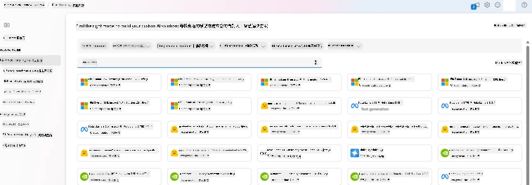
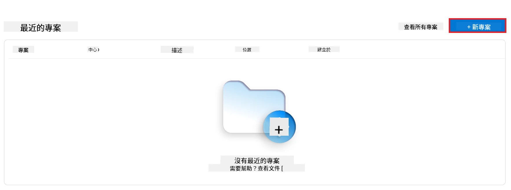
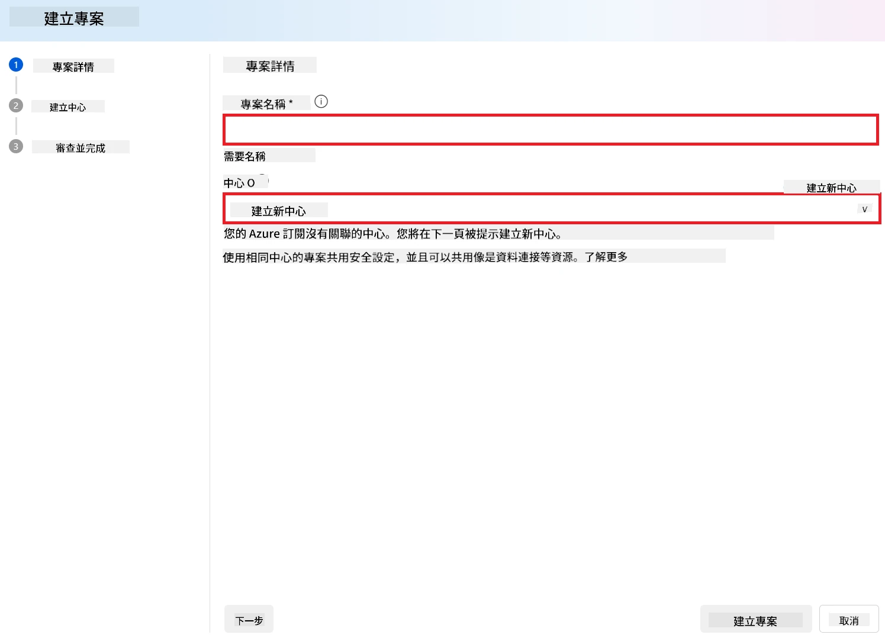
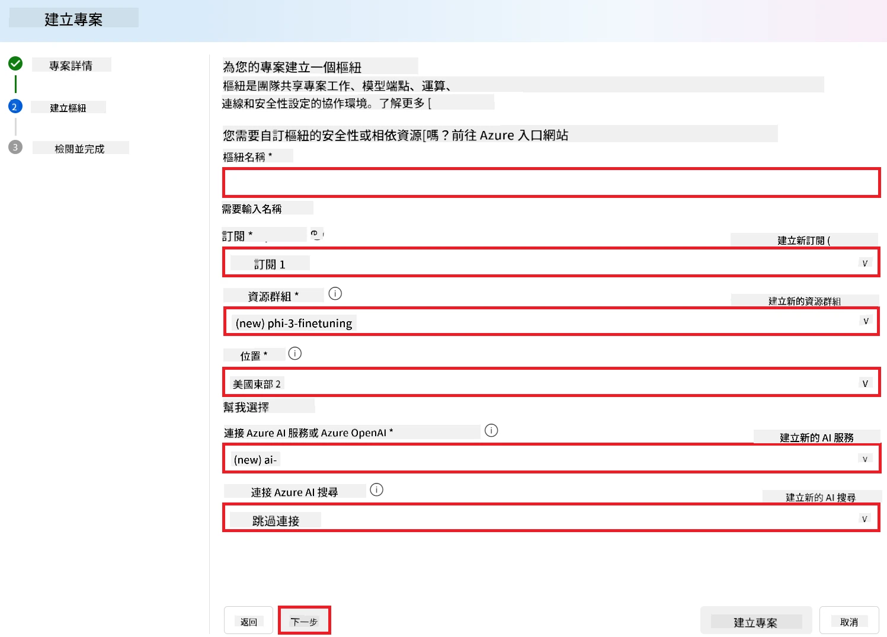
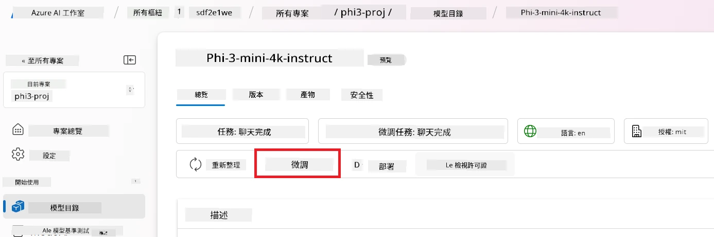
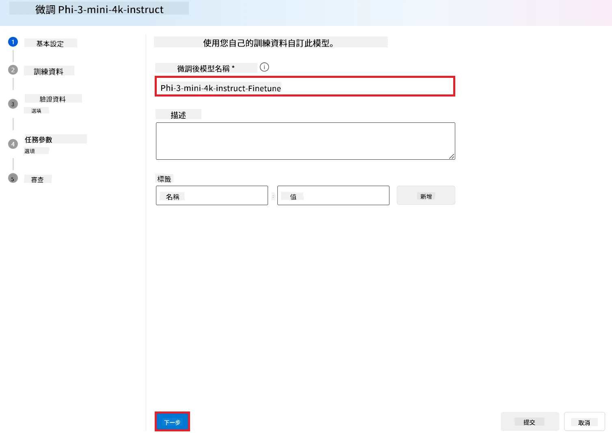
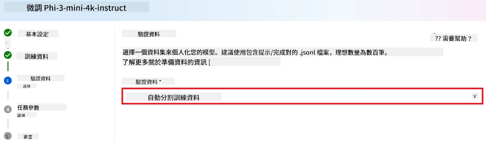
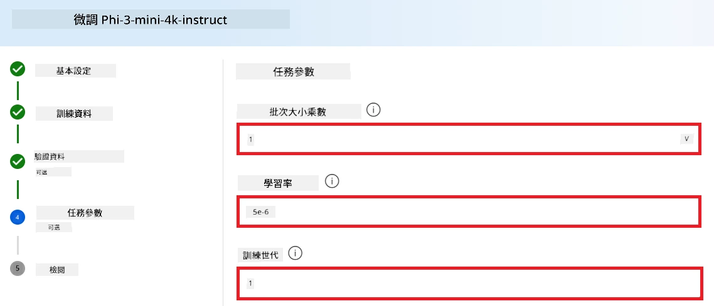
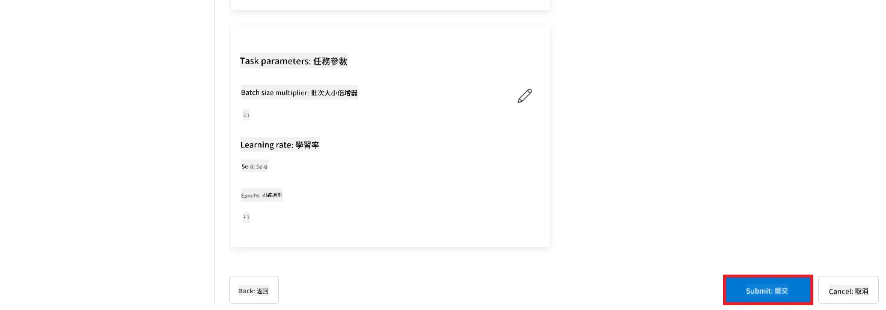
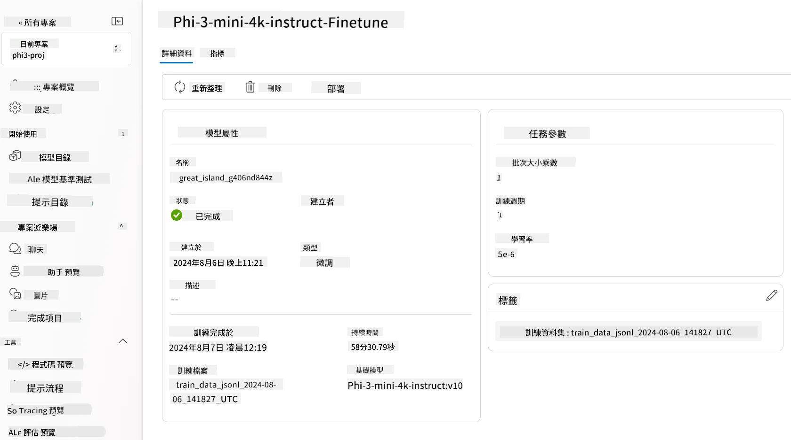

<!--
CO_OP_TRANSLATOR_METADATA:
{
  "original_hash": "c1559c5af6caccf6f623fd43a6b3a9a3",
  "translation_date": "2025-07-17T05:57:17+00:00",
  "source_file": "md/03.FineTuning/FineTuning_AIFoundry.md",
  "language_code": "mo"
}
-->
# 使用 Azure AI Foundry 微調 Phi-3

讓我們來探索如何使用 Azure AI Foundry 微調 Microsoft 的 Phi-3 Mini 語言模型。微調能讓你將 Phi-3 Mini 適應特定任務，使其更強大且更具上下文感知能力。

## 注意事項

- **功能：** 哪些模型可以微調？基礎模型可以被微調成什麼樣的功能？
- **成本：** 微調的定價模式是什麼？
- **可定制性：** 我能修改基礎模型多少？以什麼方式修改？
- **便利性：** 微調的實際流程是什麼？我需要撰寫自訂程式碼嗎？需要自備運算資源嗎？
- **安全性：** 微調後的模型存在安全風險嗎？是否有防護措施避免意外傷害？



## 微調準備

### 前置條件

> [!NOTE]
> 對於 Phi-3 系列模型，按用量付費的微調服務僅在 **East US 2** 區域建立的 hub 中可用。

- 一個 Azure 訂閱。如果你還沒有 Azure 訂閱，請建立一個[付費 Azure 帳戶](https://azure.microsoft.com/pricing/purchase-options/pay-as-you-go)開始使用。

- 一個 [AI Foundry 專案](https://ai.azure.com?WT.mc_id=aiml-138114-kinfeylo)。
- Azure 角色型存取控制 (Azure RBAC) 用於授權 Azure AI Foundry 中的操作。要執行本文的步驟，你的使用者帳戶必須在資源群組中被指派為 __Azure AI Developer 角色__。

### 訂閱提供者註冊

確認訂閱已註冊 `Microsoft.Network` 資源提供者。

1. 登入 [Azure 入口網站](https://portal.azure.com)。
1. 從左側選單選擇 **Subscriptions**。
1. 選擇你要使用的訂閱。
1. 從左側選單選擇 **AI project settings** > **Resource providers**。
1. 確認列表中有 **Microsoft.Network**，若無則新增。

### 資料準備

準備你的訓練和驗證資料來微調模型。你的訓練和驗證資料集應包含你希望模型執行方式的輸入與輸出範例。

確保所有訓練範例符合推論的預期格式。為了有效微調模型，請確保資料集平衡且多樣。

這包括維持資料平衡、涵蓋多種情境，並定期調整訓練資料以符合真實世界的期望，最終達成更準確且均衡的模型回應。

不同模型類型需要不同格式的訓練資料。

### 聊天完成

你使用的訓練和驗證資料**必須**是 JSON Lines (JSONL) 格式。對於 `Phi-3-mini-128k-instruct`，微調資料集必須採用聊天完成 API 使用的對話格式。

### 範例檔案格式

```json
    {"messages": [{"role": "system", "content": "You are an Xbox customer support agent whose primary goal is to help users with issues they are experiencing with their Xbox devices. You are friendly and concise. You only provide factual answers to queries, and do not provide answers that are not related to Xbox."}, {"role": "user", "content": "Is Xbox better than PlayStation?"}, {"role": "assistant", "content": "I apologize, but I cannot provide personal opinions. My primary job is to assist you with any issues related to your Xbox device. Do you have any Xbox-related issues that need addressing?"}]}
    {"messages": [{"role": "system", "content": "You are an Xbox customer support agent whose primary goal is to help users with issues they are experiencing with their Xbox devices. You are friendly and concise. You only provide factual answers to queries, and do not provide answers that are not related to Xbox."}, {"role": "user", "content": "Can I play PC games on my Xbox?"}, {"role": "assistant", "content": "While Xbox consoles don't natively support PC games, they can play an array of Xbox games, many of which are also available on PC. Can I assist you with finding games compatible with your Xbox device?"}]}
    {"messages": [{"role": "system", "content": "You are an Xbox customer support agent whose primary goal is to help users with issues they are experiencing with their Xbox devices. You are friendly and concise. You only provide factual answers to queries, and do not provide answers that are not related to Xbox."}, {"role": "user", "content": "I'm having trouble connecting my Xbox to the Wi-Fi."}, {"role": "assistant", "content": "No worries, let's go through the network settings on your Xbox. Can you please tell me what happens when you try to connect it to the Wi-Fi?"}]}
```

支援的檔案類型為 JSON Lines。檔案會上傳至預設資料存放區，並在你的專案中可用。

## 使用 Azure AI Foundry 微調 Phi-3

Azure AI Foundry 讓你能透過微調程序，將大型語言模型調整為符合個人資料集的需求。微調能帶來顯著價值，讓模型針對特定任務和應用進行客製化與優化，提升效能、降低成本、減少延遲，並產生更符合需求的輸出。


### 建立新專案

1. 登入 [Azure AI Foundry](https://ai.azure.com)。

1. 選擇 **+New project** 以在 Azure AI Foundry 中建立新專案。

    

1. 執行以下操作：

    - 專案 **Hub name**，必須是唯一值。
    - 選擇要使用的 **Hub**（如有需要可建立新 Hub）。

    

1. 執行以下操作以建立新 Hub：

    - 輸入 **Hub name**，必須是唯一值。
    - 選擇你的 Azure **Subscription**。
    - 選擇要使用的 **Resource group**（如有需要可建立新資源群組）。
    - 選擇你想使用的 **Location**。
    - 選擇要連接的 **Azure AI Services**（如有需要可建立新服務）。
    - 選擇 **Connect Azure AI Search**，並選擇 **Skip connecting**。

    

1. 選擇 **Next**。
1. 選擇 **Create a project**。

### 資料準備

在微調前，收集或建立與任務相關的資料集，例如聊天指令、問答對或其他相關文字資料。清理並預處理資料，移除雜訊、處理缺失值，並進行文字分詞。

### 在 Azure AI Foundry 微調 Phi-3 模型

> [!NOTE]
> Phi-3 模型的微調目前僅支援位於 East US 2 的專案。

1. 從左側標籤選擇 **Model catalog**。

1. 在 **搜尋欄**輸入 *phi-3*，並選擇你想使用的 phi-3 模型。

    

1. 選擇 **Fine-tune**。

    

1. 輸入 **Fine-tuned model name**。

    

1. 選擇 **Next**。

1. 執行以下操作：

    - 選擇 **task type** 為 **Chat completion**。
    - 選擇你想使用的 **Training data**。你可以透過 Azure AI Foundry 的資料或從本機環境上傳。

    

1. 選擇 **Next**。

1. 上傳你想使用的 **Validation data**，或選擇 **Automatic split of training data**。

    

1. 選擇 **Next**。

1. 執行以下操作：

    - 選擇你想使用的 **Batch size multiplier**。
    - 選擇你想使用的 **Learning rate**。
    - 選擇你想使用的 **Epochs**。

    

1. 選擇 **Submit** 開始微調程序。

    

1. 微調完成後，狀態會顯示為 **Completed**，如下圖所示。你現在可以部署模型，並在自己的應用程式、遊樂場或提示流程中使用。更多資訊請參考[如何使用 Azure AI Foundry 部署 Phi-3 系列小型語言模型](https://learn.microsoft.com/azure/ai-studio/how-to/deploy-models-phi-3?tabs=phi-3-5&pivots=programming-language-python)。

    

> [!NOTE]
> 欲了解更詳細的 Phi-3 微調資訊，請參閱[在 Azure AI Foundry 微調 Phi-3 模型](https://learn.microsoft.com/azure/ai-studio/how-to/fine-tune-phi-3?tabs=phi-3-mini)。

## 清理你的微調模型

你可以從 [Azure AI Foundry](https://ai.azure.com) 的微調模型清單或模型詳細頁面刪除微調模型。從微調頁面選擇要刪除的微調模型，然後按下刪除按鈕即可刪除。

> [!NOTE]
> 如果自訂模型已有部署，則無法刪除。必須先刪除模型部署，才能刪除自訂模型。

## 成本與配額

### Phi-3 模型作為服務微調的成本與配額考量

Phi 模型作為服務微調由 Microsoft 提供，並整合於 Azure AI Foundry 中使用。你可以在[部署](https://learn.microsoft.com/azure/ai-studio/how-to/deploy-models-phi-3?tabs=phi-3-5&pivots=programming-language-python)或微調模型時，在部署精靈的「定價與條款」標籤中查看定價。

## 內容過濾

以按用量付費方式部署的服務模型受 Azure AI Content Safety 保護。部署至即時端點時，你可以選擇關閉此功能。啟用 Azure AI 內容安全後，提示詞與完成結果都會通過一組分類模型，旨在偵測並防止輸出有害內容。內容過濾系統會偵測並對輸入提示與輸出完成中的特定潛在有害內容類別採取行動。了解更多關於 [Azure AI Content Safety](https://learn.microsoft.com/azure/ai-studio/concepts/content-filtering)。

**微調設定**

超參數：定義學習率、批次大小、訓練輪數等超參數。

**損失函數**

選擇適合任務的損失函數（例如交叉熵）。

**優化器**

選擇優化器（例如 Adam）以進行訓練期間的梯度更新。

**微調流程**

- 載入預訓練模型：載入 Phi-3 Mini 檢查點。
- 新增自訂層：新增任務專用層（例如聊天指令的分類頭）。

**訓練模型**

使用準備好的資料集微調模型。監控訓練進度並根據需要調整超參數。

**評估與驗證**

驗證集：將資料分割為訓練集與驗證集。

**評估效能**

使用準確率、F1 分數或困惑度等指標評估模型表現。

## 儲存微調模型

**檢查點**

儲存微調後的模型檢查點以供未來使用。

## 部署

- 作為 Web 服務部署：將微調模型部署為 Azure AI Foundry 中的 Web 服務。
- 測試端點：向部署的端點發送測試查詢以驗證功能。

## 迭代與改進

迭代：若效能不理想，可透過調整超參數、增加資料或延長微調輪數來持續優化。

## 監控與精進

持續監控模型行為並視需要進行調整。

## 客製化與擴展

自訂任務：Phi-3 Mini 可針對聊天指令以外的多種任務進行微調。探索其他應用場景！
實驗：嘗試不同架構、層組合與技術以提升效能。

> [!NOTE]
> 微調是一個反覆的過程。持續實驗、學習並調整你的模型，以達成特定任務的最佳成果！

**免責聲明**：  
本文件係使用 AI 翻譯服務 [Co-op Translator](https://github.com/Azure/co-op-translator) 進行翻譯。雖然我們力求準確，但請注意，自動翻譯可能包含錯誤或不準確之處。原始文件的母語版本應視為權威來源。對於重要資訊，建議採用專業人工翻譯。我們不對因使用本翻譯而產生的任何誤解或誤釋承擔責任。