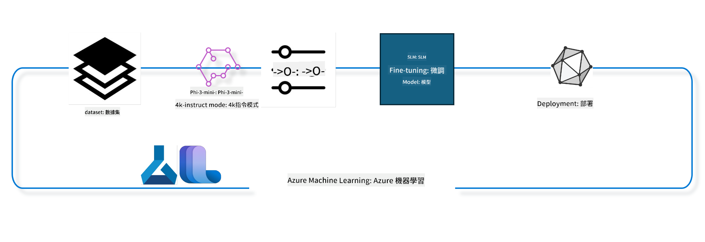

<!--
CO_OP_TRANSLATOR_METADATA:
{
  "original_hash": "ef071f0e903a1a38f8a5f8cbb253a9ca",
  "translation_date": "2025-04-04T13:17:12+00:00",
  "source_file": "md\\03.FineTuning\\FineTuning_MLSDK.md",
  "language_code": "mo"
}
-->
## How to use chat-completion components from the Azure ML system registry to fine-tune a model

In this example, we will fine-tune the Phi-3-mini-4k-instruct model to complete a conversation between two people using the ultrachat_200k dataset.



The example demonstrates how to perform fine-tuning using the Azure ML SDK and Python, followed by deploying the fine-tuned model to an online endpoint for real-time inference.

### Training Data

We will use the ultrachat_200k dataset, which is a heavily filtered version of the UltraChat dataset. This dataset was used to train Zephyr-7B-β, a state-of-the-art 7B chat model.

### Model

The Phi-3-mini-4k-instruct model will be used to demonstrate how users can fine-tune a model for chat-completion tasks. If you opened this notebook from a specific model card, remember to replace the specific model name accordingly.

### Tasks

- Select a model for fine-tuning.
- Choose and explore the training data.
- Configure the fine-tuning job.
- Execute the fine-tuning job.
- Review training and evaluation metrics.
- Register the fine-tuned model.
- Deploy the fine-tuned model for real-time inference.
- Clean up resources.

## 1. Setup Pre-requisites

- Install dependencies.
- Connect to the AzureML Workspace. Learn more about SDK authentication setup. Replace <WORKSPACE_NAME>, <RESOURCE_GROUP>, and <SUBSCRIPTION_ID> below.
- Connect to the AzureML system registry.
- Optionally, set an experiment name.
- Verify or create compute resources.

> [!NOTE]  
> Requirements: A single GPU node can have multiple GPU cards. For instance, a Standard_NC24rs_v3 node contains 4 NVIDIA V100 GPUs, while a Standard_NC12s_v3 node has 2 NVIDIA V100 GPUs. Refer to the documentation for details. The number of GPU cards per node is specified in the `gpus_per_node` parameter below. Setting this value correctly ensures optimal GPU utilization. Recommended GPU compute SKUs can be found here and here.

### Python Libraries

Install dependencies by running the cell below. This step is mandatory for new environments.

```bash
pip install azure-ai-ml
pip install azure-identity
pip install datasets==2.9.0
pip install mlflow
pip install azureml-mlflow
```

### Interacting with Azure ML

1. This Python script interacts with the Azure Machine Learning (Azure ML) service. Here's what it does:

    - It imports necessary modules from `azure.ai.ml`, `azure.identity`, and `azure.ai.ml.entities`. It also imports the `time` module.

    - It attempts authentication using `DefaultAzureCredential()`, which simplifies authentication for Azure applications. If this fails, it uses `InteractiveBrowserCredential()` for interactive login.

    - It creates an `MLClient` instance using the `from_config` method, which reads configuration from the default `config.json` file. If this fails, it manually creates the `MLClient` instance using subscription, resource group, and workspace details.

    - Another `MLClient` instance is created for the Azure ML registry named "azureml," where models, fine-tuning pipelines, and environments are stored.

    - The experiment name is set to "chat_completion_Phi-3-mini-4k-instruct."

    - A unique timestamp is generated using the current time in seconds, which can be used for naming purposes.

    ```python
    # Import necessary modules from Azure ML and Azure Identity
    from azure.ai.ml import MLClient
    from azure.identity import (
        DefaultAzureCredential,
        InteractiveBrowserCredential,
    )
    from azure.ai.ml.entities import AmlCompute
    import time  # Import time module
    
    # Try to authenticate using DefaultAzureCredential
    try:
        credential = DefaultAzureCredential()
        credential.get_token("https://management.azure.com/.default")
    except Exception as ex:  # If DefaultAzureCredential fails, use InteractiveBrowserCredential
        credential = InteractiveBrowserCredential()
    
    # Try to create an MLClient instance using the default config file
    try:
        workspace_ml_client = MLClient.from_config(credential=credential)
    except:  # If that fails, create an MLClient instance by manually providing the details
        workspace_ml_client = MLClient(
            credential,
            subscription_id="<SUBSCRIPTION_ID>",
            resource_group_name="<RESOURCE_GROUP>",
            workspace_name="<WORKSPACE_NAME>",
        )
    
    # Create another MLClient instance for the Azure ML registry named "azureml"
    # This registry is where models, fine-tuning pipelines, and environments are stored
    registry_ml_client = MLClient(credential, registry_name="azureml")
    
    # Set the experiment name
    experiment_name = "chat_completion_Phi-3-mini-4k-instruct"
    
    # Generate a unique timestamp that can be used for names and versions that need to be unique
    timestamp = str(int(time.time()))
    ```

## 2. Select a Foundation Model for Fine-Tuning

1. Phi-3-mini-4k-instruct is a lightweight, state-of-the-art open model with 3.8 billion parameters. It is built upon datasets used for Phi-2. The Mini version supports two context lengths: 4K and 128K tokens. Fine-tuning is necessary to adapt the model for specific tasks. You can browse these models in the AzureML Studio Model Catalog by filtering for the chat-completion task. In this example, we use the Phi-3-mini-4k-instruct model. If you're working with a different model, update the model name and version accordingly.

    > [!NOTE]  
    > The model's ID property will be used as input for the fine-tuning job. This can be found in the Asset ID field on the model details page in AzureML Studio Model Catalog.

2. This Python script interacts with Azure Machine Learning (Azure ML). Here's what it does:

    - It sets the `model_name` to "Phi-3-mini-4k-instruct."

    - Using the `get` method of the `models` property in `registry_ml_client`, it retrieves the latest version of the model with the specified name from the Azure ML registry.

    - A message is printed, showing the name, version, and ID of the model selected for fine-tuning. This information is accessed as properties of the `foundation_model` object.

    ```python
    # Set the model name
    model_name = "Phi-3-mini-4k-instruct"
    
    # Get the latest version of the model from the Azure ML registry
    foundation_model = registry_ml_client.models.get(model_name, label="latest")
    
    # Print the model name, version, and id
    # This information is useful for tracking and debugging
    print(
        "\n\nUsing model name: {0}, version: {1}, id: {2} for fine tuning".format(
            foundation_model.name, foundation_model.version, foundation_model.id
        )
    )
    ```

## 3. Create Compute Resources for the Job

The fine-tuning job requires GPU compute. The compute size depends on the model's requirements, and selecting the right compute can be challenging. This section helps users choose the appropriate compute resources.

> [!NOTE]  
> The computes listed below are optimized for specific configurations. Altering these configurations may lead to CUDA Out Of Memory errors. If this occurs, consider upgrading to a larger compute size.

> [!NOTE]  
> Ensure that the selected compute cluster is available in your resource group. If a specific compute resource is unavailable, you can request access.

### Checking Model for Fine-Tuning Support

1. This Python script interacts with an Azure ML model. Here's what it does:

    - It imports the `ast` module for safely evaluating strings containing Python expressions.

    - It checks whether the `foundation_model` object has a tag named `finetune_compute_allow_list`. Tags in Azure ML are key-value pairs used for filtering and sorting models.

    - If the tag exists, its value is parsed into a Python list using `ast.literal_eval`, and the list is stored in `computes_allow_list`. A message is printed, advising users to select compute from this list.

    - If the tag does not exist, `computes_allow_list` is set to `None`, and a message is printed indicating the absence of the tag.

    ```python
    # Import the ast module, which provides functions to process trees of the Python abstract syntax grammar
    import ast
    
    # Check if the 'finetune_compute_allow_list' tag is present in the model's tags
    if "finetune_compute_allow_list" in foundation_model.tags:
        # If the tag is present, use ast.literal_eval to safely parse the tag's value (a string) into a Python list
        computes_allow_list = ast.literal_eval(
            foundation_model.tags["finetune_compute_allow_list"]
        )  # convert string to python list
        # Print a message indicating that a compute should be created from the list
        print(f"Please create a compute from the above list - {computes_allow_list}")
    else:
        # If the tag is not present, set computes_allow_list to None
        computes_allow_list = None
        # Print a message indicating that the 'finetune_compute_allow_list' tag is not part of the model's tags
        print("`finetune_compute_allow_list` is not part of model tags")
    ```

### Checking Compute Instance

1. This Python script interacts with Azure ML and performs checks on a compute instance. Here's what it does:

    - It retrieves the compute instance specified in `compute_cluster` from the Azure ML workspace. If the provisioning state is "failed," a `ValueError` is raised.

    - If `computes_allow_list` is not `None`, it converts all compute sizes in the list to lowercase and verifies if the current compute instance size is in the list. If not, a `ValueError` is raised.

    - If `computes_allow_list` is `None`, it checks if the compute instance size is in a list of unsupported GPU VM sizes. If it is, a `ValueError` is raised.

    - It retrieves a list of all available compute sizes in the workspace. For each compute size, it checks if its name matches the current compute instance size. If a match is found, the number of GPUs is retrieved, and `gpu_count_found` is set to `True`.

    - If `gpu_count_found` is `True`, the number of GPUs is printed. Otherwise, a `ValueError` is raised.

    ```python
    # Print the exception message
    print(e)
    # Raise a ValueError if the compute size is not available in the workspace
    raise ValueError(
        f"WARNING! Compute size {compute_cluster_size} not available in workspace"
    )
    
    # Retrieve the compute instance from the Azure ML workspace
    compute = workspace_ml_client.compute.get(compute_cluster)
    # Check if the provisioning state of the compute instance is "failed"
    if compute.provisioning_state.lower() == "failed":
        # Raise a ValueError if the provisioning state is "failed"
        raise ValueError(
            f"Provisioning failed, Compute '{compute_cluster}' is in failed state. "
            f"please try creating a different compute"
        )
    
    # Check if computes_allow_list is not None
    if computes_allow_list is not None:
        # Convert all compute sizes in computes_allow_list to lowercase
        computes_allow_list_lower_case = [x.lower() for x in computes_allow_list]
        # Check if the size of the compute instance is in computes_allow_list_lower_case
        if compute.size.lower() not in computes_allow_list_lower_case:
            # Raise a ValueError if the size of the compute instance is not in computes_allow_list_lower_case
            raise ValueError(
                f"VM size {compute.size} is not in the allow-listed computes for finetuning"
            )
    else:
        # Define a list of unsupported GPU VM sizes
        unsupported_gpu_vm_list = [
            "standard_nc6",
            "standard_nc12",
            "standard_nc24",
            "standard_nc24r",
        ]
        # Check if the size of the compute instance is in unsupported_gpu_vm_list
        if compute.size.lower() in unsupported_gpu_vm_list:
            # Raise a ValueError if the size of the compute instance is in unsupported_gpu_vm_list
            raise ValueError(
                f"VM size {compute.size} is currently not supported for finetuning"
            )
    
    # Initialize a flag to check if the number of GPUs in the compute instance has been found
    gpu_count_found = False
    # Retrieve a list of all available compute sizes in the workspace
    workspace_compute_sku_list = workspace_ml_client.compute.list_sizes()
    available_sku_sizes = []
    # Iterate over the list of available compute sizes
    for compute_sku in workspace_compute_sku_list:
        available_sku_sizes.append(compute_sku.name)
        # Check if the name of the compute size matches the size of the compute instance
        if compute_sku.name.lower() == compute.size.lower():
            # If it does, retrieve the number of GPUs for that compute size and set gpu_count_found to True
            gpus_per_node = compute_sku.gpus
            gpu_count_found = True
    # If gpu_count_found is True, print the number of GPUs in the compute instance
    if gpu_count_found:
        print(f"Number of GPU's in compute {compute.size}: {gpus_per_node}")
    else:
        # If gpu_count_found is False, raise a ValueError
        raise ValueError(
            f"Number of GPU's in compute {compute.size} not found. Available skus are: {available_sku_sizes}."
            f"This should not happen. Please check the selected compute cluster: {compute_cluster} and try again."
        )
    ```

## 4. Select the Dataset for Fine-Tuning

1. We use the ultrachat_200k dataset, which has four splits suitable for supervised fine-tuning (sft) and generation ranking (gen). The number of examples per split is shown as follows:

    ```bash
    train_sft test_sft  train_gen  test_gen
    207865  23110  256032  28304
    ```

1. The following cells demonstrate basic data preparation for fine-tuning:

### Visualize Some Data Rows

To ensure quick execution, save `train_sft` and `test_sft` files containing 5% of the already trimmed rows. This results in lower accuracy for the fine-tuned model, so it should not be used in real-world scenarios. The `download-dataset.py` script downloads the ultrachat_200k dataset and transforms it into a format consumable by the fine-tune pipeline component. As the dataset is large, only a portion is used here.

1. Running the script below downloads 5% of the data. This percentage can be adjusted by modifying the `dataset_split_pc` parameter.

    > [!NOTE]  
    > Some language models use different language codes, so the column names in the dataset should reflect this.

1. Example of dataset structure:  
The chat-completion dataset is stored in parquet format, with each entry using the following schema:

    - `prompt`: A string representing a task or question posed to an AI assistant.
    - `messages`: An array of objects representing a conversation between a user and an AI assistant. Each object includes:
        - `content`: The message content.
        - `role`: The sender's role, either "user" or "assistant."
    - `prompt_id`: A unique identifier for the prompt.

1. Example conversation: A user asks the assistant to create a protagonist for a dystopian story. The assistant responds, and the user asks for more details. The assistant agrees, and the entire conversation is associated with a specific prompt ID.

    ```python
    {
        // The task or question posed to an AI assistant
        "prompt": "Create a fully-developed protagonist who is challenged to survive within a dystopian society under the rule of a tyrant. ...",
        
        // An array of objects, each representing a message in a conversation between a user and an AI assistant
        "messages":[
            {
                // The content of the user's message
                "content": "Create a fully-developed protagonist who is challenged to survive within a dystopian society under the rule of a tyrant. ...",
                // The role of the entity that sent the message
                "role": "user"
            },
            {
                // The content of the assistant's message
                "content": "Name: Ava\n\n Ava was just 16 years old when the world as she knew it came crashing down. The government had collapsed, leaving behind a chaotic and lawless society. ...",
                // The role of the entity that sent the message
                "role": "assistant"
            },
            {
                // The content of the user's message
                "content": "Wow, Ava's story is so intense and inspiring! Can you provide me with more details.  ...",
                // The role of the entity that sent the message
                "role": "user"
            }, 
            {
                // The content of the assistant's message
                "content": "Certainly! ....",
                // The role of the entity that sent the message
                "role": "assistant"
            }
        ],
        
        // A unique identifier for the prompt
        "prompt_id": "d938b65dfe31f05f80eb8572964c6673eddbd68eff3db6bd234d7f1e3b86c2af"
    }
    ```

### Download Data

1. This Python script downloads a dataset using the `download-dataset.py` helper script. Here's what it does:

    - It uses `os.system` to execute the `download-dataset.py` script with specific arguments for the dataset name, download directory, and split percentage.

    - If the script fails (exit status is not 0), an exception is raised.

    ```python
    # Import the os module, which provides a way of using operating system dependent functionality
    import os
    
    # Use the os.system function to run the download-dataset.py script in the shell with specific command-line arguments
    # The arguments specify the dataset to download (HuggingFaceH4/ultrachat_200k), the directory to download it to (ultrachat_200k_dataset), and the percentage of the dataset to split (5)
    # The os.system function returns the exit status of the command it executed; this status is stored in the exit_status variable
    exit_status = os.system(
        "python ./download-dataset.py --dataset HuggingFaceH4/ultrachat_200k --download_dir ultrachat_200k_dataset --dataset_split_pc 5"
    )
    
    # Check if exit_status is not 0
    # In Unix-like operating systems, an exit status of 0 usually indicates that a command has succeeded, while any other number indicates an error
    # If exit_status is not 0, raise an Exception with a message indicating that there was an error downloading the dataset
    if exit_status != 0:
        raise Exception("Error downloading dataset")
    ```

### Load Data into a DataFrame

1. This Python script loads a JSON Lines file into a pandas DataFrame and displays the first 5 rows. Here's what it does:

    - It imports the pandas library.
    - Sets the maximum column width for display.
    - Loads the `train_sft.jsonl` file into a DataFrame using `pd.read_json`.
    - Displays the first 5 rows using the `head` method.

    ```python
    # Import the pandas library, which is a powerful data manipulation and analysis library
    import pandas as pd
    
    # Set the maximum column width for pandas' display options to 0
    # This means that the full text of each column will be displayed without truncation when the DataFrame is printed
    pd.set_option("display.max_colwidth", 0)
    
    # Use the pd.read_json function to load the train_sft.jsonl file from the ultrachat_200k_dataset directory into a DataFrame
    # The lines=True argument indicates that the file is in JSON Lines format, where each line is a separate JSON object
    df = pd.read_json("./ultrachat_200k_dataset/train_sft.jsonl", lines=True)
    
    # Use the head method to display the first 5 rows of the DataFrame
    # If the DataFrame has less than 5 rows, it will display all of them
    df.head()
    ```

## 5. Submit the Fine-Tuning Job Using the Model and Data as Inputs

Create a job using the chat-completion pipeline component. Learn more about the supported parameters for fine-tuning.

### Define Fine-Tuning Parameters

1. Fine-tuning parameters are grouped into two categories: training parameters and optimization parameters.

1. Training parameters define aspects such as:
    - Optimizer and scheduler.
    - Metric for optimization.
    - Number of training steps, batch size, etc.

1. Optimization parameters focus on GPU memory and compute resource utilization. These vary by model and are packaged to handle these differences.

    - Enable DeepSpeed and LoRA.
    - Enable mixed precision training.
    - Enable multi-node training.

> [!NOTE]  
> Supervised fine-tuning may lead to alignment loss or catastrophic forgetting. Check for these issues and consider running an alignment stage post fine-tuning.

### Fine-Tuning Parameters

1. This Python script sets up fine-tuning parameters:

    - Default training parameters: epochs, batch sizes, learning rate, scheduler type.
    - Default optimization parameters: LoRA, DeepSpeed, etc.
    - Combines parameters into a dictionary.
    - Updates parameters with model-specific defaults if available.

    ```python
    # Set up default training parameters such as the number of training epochs, batch sizes for training and evaluation, learning rate, and learning rate scheduler type
    training_parameters = dict(
        num_train_epochs=3,
        per_device_train_batch_size=1,
        per_device_eval_batch_size=1,
        learning_rate=5e-6,
        lr_scheduler_type="cosine",
    )
    
    # Set up default optimization parameters such as whether to apply Layer-wise Relevance Propagation (LoRa) and DeepSpeed, and the DeepSpeed stage
    optimization_parameters = dict(
        apply_lora="true",
        apply_deepspeed="true",
        deepspeed_stage=2,
    )
    
    # Combine the training and optimization parameters into a single dictionary called finetune_parameters
    finetune_parameters = {**training_parameters, **optimization_parameters}
    
    # Check if the foundation_model has any model-specific default parameters
    # If it does, print a warning message and update the finetune_parameters dictionary with these model-specific defaults
    # The ast.literal_eval function is used to convert the model-specific defaults from a string to a Python dictionary
    if "model_specific_defaults" in foundation_model.tags:
        print("Warning! Model specific defaults exist. The defaults could be overridden.")
        finetune_parameters.update(
            ast.literal_eval(  # convert string to python dict
                foundation_model.tags["model_specific_defaults"]
            )
        )
    
    # Print the final set of fine-tuning parameters that will be used for the run
    print(
        f"The following finetune parameters are going to be set for the run: {finetune_parameters}"
    )
    ```

### Training Pipeline

1. This Python script generates a display name for the training pipeline based on various parameters:

    - Calculates total batch size using multiple factors.
    - Constructs a string that includes key parameters like DeepSpeed stage, LoRA usage, etc.
    - Returns the string as the pipeline's display name.

    ```python
    # Define a function to generate a display name for the training pipeline
    def get_pipeline_display_name():
        # Calculate the total batch size by multiplying the per-device batch size, the number of gradient accumulation steps, the number of GPUs per node, and the number of nodes used for fine-tuning
        batch_size = (
            int(finetune_parameters.get("per_device_train_batch_size", 1))
            * int(finetune_parameters.get("gradient_accumulation_steps", 1))
            * int(gpus_per_node)
            * int(finetune_parameters.get("num_nodes_finetune", 1))
        )
        # Retrieve the learning rate scheduler type
        scheduler = finetune_parameters.get("lr_scheduler_type", "linear")
        # Retrieve whether DeepSpeed is applied
        deepspeed = finetune_parameters.get("apply_deepspeed", "false")
        # Retrieve the DeepSpeed stage
        ds_stage = finetune_parameters.get("deepspeed_stage", "2")
        # If DeepSpeed is applied, include "ds" followed by the DeepSpeed stage in the display name; if not, include "nods"
        if deepspeed == "true":
            ds_string = f"ds{ds_stage}"
        else:
            ds_string = "nods"
        # Retrieve whether Layer-wise Relevance Propagation (LoRa) is applied
        lora = finetune_parameters.get("apply_lora", "false")
        # If LoRa is applied, include "lora" in the display name; if not, include "nolora"
        if lora == "true":
            lora_string = "lora"
        else:
            lora_string = "nolora"
        # Retrieve the limit on the number of model checkpoints to keep
        save_limit = finetune_parameters.get("save_total_limit", -1)
        # Retrieve the maximum sequence length
        seq_len = finetune_parameters.get("max_seq_length", -1)
        # Construct the display name by concatenating all these parameters, separated by hyphens
        return (
            model_name
            + "-"
            + "ultrachat"
            + "-"
            + f"bs{batch_size}"
            + "-"
            + f"{scheduler}"
            + "-"
            + ds_string
            + "-"
            + lora_string
            + f"-save_limit{save_limit}"
            + f"-seqlen{seq_len}"
        )
    
    # Call the function to generate the display name
    pipeline_display_name = get_pipeline_display_name()
    # Print the display name
    print(f"Display name used for the run: {pipeline_display_name}")
    ```
training pipeline based on various parameters, and then printing this display name. ```python
    # Define a function to generate a display name for the training pipeline
    def get_pipeline_display_name():
        # Calculate the total batch size by multiplying the per-device batch size, the number of gradient accumulation steps, the number of GPUs per node, and the number of nodes used for fine-tuning
        batch_size = (
            int(finetune_parameters.get("per_device_train_batch_size", 1))
            * int(finetune_parameters.get("gradient_accumulation_steps", 1))
            * int(gpus_per_node)
            * int(finetune_parameters.get("num_nodes_finetune", 1))
        )
        # Retrieve the learning rate scheduler type
        scheduler = finetune_parameters.get("lr_scheduler_type", "linear")
        # Retrieve whether DeepSpeed is applied
        deepspeed = finetune_parameters.get("apply_deepspeed", "false")
        # Retrieve the DeepSpeed stage
        ds_stage = finetune_parameters.get("deepspeed_stage", "2")
        # If DeepSpeed is applied, include "ds" followed by the DeepSpeed stage in the display name; if not, include "nods"
        if deepspeed == "true":
            ds_string = f"ds{ds_stage}"
        else:
            ds_string = "nods"
        # Retrieve whether Layer-wise Relevance Propagation (LoRa) is applied
        lora = finetune_parameters.get("apply_lora", "false")
        # If LoRa is applied, include "lora" in the display name; if not, include "nolora"
        if lora == "true":
            lora_string = "lora"
        else:
            lora_string = "nolora"
        # Retrieve the limit on the number of model checkpoints to keep
        save_limit = finetune_parameters.get("save_total_limit", -1)
        # Retrieve the maximum sequence length
        seq_len = finetune_parameters.get("max_seq_length", -1)
        # Construct the display name by concatenating all these parameters, separated by hyphens
        return (
            model_name
            + "-"
            + "ultrachat"
            + "-"
            + f"bs{batch_size}"
            + "-"
            + f"{scheduler}"
            + "-"
            + ds_string
            + "-"
            + lora_string
            + f"-save_limit{save_limit}"
            + f"-seqlen{seq_len}"
        )
    
    # Call the function to generate the display name
    pipeline_display_name = get_pipeline_display_name()
    # Print the display name
    print(f"Display name used for the run: {pipeline_display_name}")
    ``` ### Configuring Pipeline This Python script defines and configures a machine learning pipeline using the Azure Machine Learning SDK. Here's an overview of its actions: 1. Imports necessary modules from the Azure AI ML SDK. 2. Retrieves a pipeline component named "chat_completion_pipeline" from the registry. 3. Defines a pipeline job using the `@pipeline` decorator and the function `create_pipeline`. The name of the pipeline is set to `pipeline_display_name`.

1. Inside the `create_pipeline` function, it initializes the fetched pipeline component with various parameters, including the model path, compute clusters for different stages, dataset splits for training and testing, the number of GPUs to use for fine-tuning, and other fine-tuning parameters.

1. It maps the output of the fine-tuning job to the output of the pipeline job. This is done so that the fine-tuned model can be easily registered, which is required to deploy the model to an online or batch endpoint.

1. It creates an instance of the pipeline by calling the `create_pipeline` function.

1. It sets the `force_rerun` setting of the pipeline to `True`, meaning that cached results from previous jobs will not be used.

1. It sets the `continue_on_step_failure` setting of the pipeline to `False`, ensuring that the pipeline halts if any step fails. 4. In summary, this script defines and configures a machine learning pipeline for a chat completion task using the Azure Machine Learning SDK. ```python
    # Import necessary modules from the Azure AI ML SDK
    from azure.ai.ml.dsl import pipeline
    from azure.ai.ml import Input
    
    # Fetch the pipeline component named "chat_completion_pipeline" from the registry
    pipeline_component_func = registry_ml_client.components.get(
        name="chat_completion_pipeline", label="latest"
    )
    
    # Define the pipeline job using the @pipeline decorator and the function create_pipeline
    # The name of the pipeline is set to pipeline_display_name
    @pipeline(name=pipeline_display_name)
    def create_pipeline():
        # Initialize the fetched pipeline component with various parameters
        # These include the model path, compute clusters for different stages, dataset splits for training and testing, the number of GPUs to use for fine-tuning, and other fine-tuning parameters
        chat_completion_pipeline = pipeline_component_func(
            mlflow_model_path=foundation_model.id,
            compute_model_import=compute_cluster,
            compute_preprocess=compute_cluster,
            compute_finetune=compute_cluster,
            compute_model_evaluation=compute_cluster,
            # Map the dataset splits to parameters
            train_file_path=Input(
                type="uri_file", path="./ultrachat_200k_dataset/train_sft.jsonl"
            ),
            test_file_path=Input(
                type="uri_file", path="./ultrachat_200k_dataset/test_sft.jsonl"
            ),
            # Training settings
            number_of_gpu_to_use_finetuning=gpus_per_node,  # Set to the number of GPUs available in the compute
            **finetune_parameters
        )
        return {
            # Map the output of the fine tuning job to the output of pipeline job
            # This is done so that we can easily register the fine tuned model
            # Registering the model is required to deploy the model to an online or batch endpoint
            "trained_model": chat_completion_pipeline.outputs.mlflow_model_folder
        }
    
    # Create an instance of the pipeline by calling the create_pipeline function
    pipeline_object = create_pipeline()
    
    # Don't use cached results from previous jobs
    pipeline_object.settings.force_rerun = True
    
    # Set continue on step failure to False
    # This means that the pipeline will stop if any step fails
    pipeline_object.settings.continue_on_step_failure = False
    ``` ### Submit the Job 1. This Python script submits a machine learning pipeline job to an Azure Machine Learning workspace and waits for its completion. Here's an overview of its actions: - Uses the create_or_update method of the jobs object in the workspace_ml_client to submit the pipeline job. The pipeline to execute is specified by pipeline_object, and the experiment under which the job runs is specified by experiment_name. - Uses the stream method of the jobs object in the workspace_ml_client to wait for the pipeline job to finish. The job is identified by the name attribute of the pipeline_job object. - In summary, this script submits a machine learning pipeline job to an Azure Machine Learning workspace and waits for its completion. ```python
    # Submit the pipeline job to the Azure Machine Learning workspace
    # The pipeline to be run is specified by pipeline_object
    # The experiment under which the job is run is specified by experiment_name
    pipeline_job = workspace_ml_client.jobs.create_or_update(
        pipeline_object, experiment_name=experiment_name
    )
    
    # Wait for the pipeline job to complete
    # The job to wait for is specified by the name attribute of the pipeline_job object
    workspace_ml_client.jobs.stream(pipeline_job.name)
    ``` ## 6. Register the fine tuned model with the workspace The model output from the fine-tuning job will be registered to establish lineage between the fine-tuned model and the fine-tuning job. The fine-tuning job, in turn, tracks lineage to the foundation model, data, and training code. ### Registering the ML Model 1. This Python script registers a machine learning model trained in an Azure Machine Learning pipeline. Here's an overview of its actions: - Imports necessary modules from the Azure AI ML SDK. - Verifies if the trained_model output is available from the pipeline job by calling the get method of the jobs object in the workspace_ml_client and accessing its outputs attribute. - Constructs a path to the trained model by formatting a string with the pipeline job's name and the output name ("trained_model"). - Defines a name for the fine-tuned model by appending "-ultrachat-200k" to the original model name and replacing any slashes with hyphens. - Prepares to register the model by creating a Model object with parameters like the model's path, type (MLflow model), name, version, and description. - Registers the model by calling the create_or_update method of the models object in the workspace_ml_client with the Model object as the argument. - Prints the registered model. 1. In summary, this script registers a machine learning model trained in an Azure Machine Learning pipeline. ```python
    # Import necessary modules from the Azure AI ML SDK
    from azure.ai.ml.entities import Model
    from azure.ai.ml.constants import AssetTypes
    
    # Check if the `trained_model` output is available from the pipeline job
    print("pipeline job outputs: ", workspace_ml_client.jobs.get(pipeline_job.name).outputs)
    
    # Construct a path to the trained model by formatting a string with the name of the pipeline job and the name of the output ("trained_model")
    model_path_from_job = "azureml://jobs/{0}/outputs/{1}".format(
        pipeline_job.name, "trained_model"
    )
    
    # Define a name for the fine-tuned model by appending "-ultrachat-200k" to the original model name and replacing any slashes with hyphens
    finetuned_model_name = model_name + "-ultrachat-200k"
    finetuned_model_name = finetuned_model_name.replace("/", "-")
    
    print("path to register model: ", model_path_from_job)
    
    # Prepare to register the model by creating a Model object with various parameters
    # These include the path to the model, the type of the model (MLflow model), the name and version of the model, and a description of the model
    prepare_to_register_model = Model(
        path=model_path_from_job,
        type=AssetTypes.MLFLOW_MODEL,
        name=finetuned_model_name,
        version=timestamp,  # Use timestamp as version to avoid version conflict
        description=model_name + " fine tuned model for ultrachat 200k chat-completion",
    )
    
    print("prepare to register model: \n", prepare_to_register_model)
    
    # Register the model by calling the create_or_update method of the models object in the workspace_ml_client with the Model object as the argument
    registered_model = workspace_ml_client.models.create_or_update(
        prepare_to_register_model
    )
    
    # Print the registered model
    print("registered model: \n", registered_model)
    ``` ## 7. Deploy the fine tuned model to an online endpoint Online endpoints provide a reliable REST API for integrating the model into applications. ### Manage Endpoint 1. This Python script creates a managed online endpoint in Azure Machine Learning for a registered model. Here's an overview of its actions: - Imports necessary modules from the Azure AI ML SDK. - Defines a unique name for the online endpoint by appending a timestamp to "ultrachat-completion-". - Prepares to create the online endpoint by creating a ManagedOnlineEndpoint object with parameters like the endpoint's name, description, and authentication mode ("key"). - Creates the online endpoint by calling the begin_create_or_update method of the workspace_ml_client with the ManagedOnlineEndpoint object as the argument. Waits for the operation to complete by calling the wait method. 1. In summary, this script creates a managed online endpoint in Azure Machine Learning for a registered model. ```python
    # Import necessary modules from the Azure AI ML SDK
    from azure.ai.ml.entities import (
        ManagedOnlineEndpoint,
        ManagedOnlineDeployment,
        ProbeSettings,
        OnlineRequestSettings,
    )
    
    # Define a unique name for the online endpoint by appending a timestamp to the string "ultrachat-completion-"
    online_endpoint_name = "ultrachat-completion-" + timestamp
    
    # Prepare to create the online endpoint by creating a ManagedOnlineEndpoint object with various parameters
    # These include the name of the endpoint, a description of the endpoint, and the authentication mode ("key")
    endpoint = ManagedOnlineEndpoint(
        name=online_endpoint_name,
        description="Online endpoint for "
        + registered_model.name
        + ", fine tuned model for ultrachat-200k-chat-completion",
        auth_mode="key",
    )
    
    # Create the online endpoint by calling the begin_create_or_update method of the workspace_ml_client with the ManagedOnlineEndpoint object as the argument
    # Then wait for the creation operation to complete by calling the wait method
    workspace_ml_client.begin_create_or_update(endpoint).wait()
    ``` > [!NOTE] > You can find here the list of SKU's supported for deployment - [Managed online endpoints SKU list](https://learn.microsoft.com/azure/machine-learning/reference-managed-online-endpoints-vm-sku-list) ### Deploying ML Model 1. This Python script deploys a registered machine learning model to a managed online endpoint in Azure Machine Learning. Here's an overview of its actions: - Imports the ast module, which provides functions to process trees of Python abstract syntax grammar. - Sets the deployment's instance type to "Standard_NC6s_v3". - Checks if the inference_compute_allow_list tag exists in the foundation model. If present, converts the tag value from a string to a Python list and assigns it to inference_computes_allow_list; otherwise, sets inference_computes_allow_list to None. - Validates if the specified instance type is in the allow list. If not, prompts the user to select an instance type from the allow list. - Prepares to create the deployment by creating a ManagedOnlineDeployment object with parameters like deployment name, endpoint name, model ID, instance type and count, liveness probe settings, and request settings. - Creates the deployment by calling the begin_create_or_update method of the workspace_ml_client with the ManagedOnlineDeployment object as the argument. Waits for the operation to complete by calling the wait method. - Configures the endpoint's traffic to direct 100% to the "demo" deployment. - Updates the endpoint by calling the begin_create_or_update method of the workspace_ml_client with the endpoint object as the argument. Waits for the operation to complete by calling the result method. 1. In summary, this script deploys a registered machine learning model to a managed online endpoint in Azure Machine Learning. ```python
    # Import the ast module, which provides functions to process trees of the Python abstract syntax grammar
    import ast
    
    # Set the instance type for the deployment
    instance_type = "Standard_NC6s_v3"
    
    # Check if the `inference_compute_allow_list` tag is present in the foundation model
    if "inference_compute_allow_list" in foundation_model.tags:
        # If it is, convert the tag value from a string to a Python list and assign it to `inference_computes_allow_list`
        inference_computes_allow_list = ast.literal_eval(
            foundation_model.tags["inference_compute_allow_list"]
        )
        print(f"Please create a compute from the above list - {computes_allow_list}")
    else:
        # If it's not, set `inference_computes_allow_list` to `None`
        inference_computes_allow_list = None
        print("`inference_compute_allow_list` is not part of model tags")
    
    # Check if the specified instance type is in the allow list
    if (
        inference_computes_allow_list is not None
        and instance_type not in inference_computes_allow_list
    ):
        print(
            f"`instance_type` is not in the allow listed compute. Please select a value from {inference_computes_allow_list}"
        )
    
    # Prepare to create the deployment by creating a `ManagedOnlineDeployment` object with various parameters
    demo_deployment = ManagedOnlineDeployment(
        name="demo",
        endpoint_name=online_endpoint_name,
        model=registered_model.id,
        instance_type=instance_type,
        instance_count=1,
        liveness_probe=ProbeSettings(initial_delay=600),
        request_settings=OnlineRequestSettings(request_timeout_ms=90000),
    )
    
    # Create the deployment by calling the `begin_create_or_update` method of the `workspace_ml_client` with the `ManagedOnlineDeployment` object as the argument
    # Then wait for the creation operation to complete by calling the `wait` method
    workspace_ml_client.online_deployments.begin_create_or_update(demo_deployment).wait()
    
    # Set the traffic of the endpoint to direct 100% of the traffic to the "demo" deployment
    endpoint.traffic = {"demo": 100}
    
    # Update the endpoint by calling the `begin_create_or_update` method of the `workspace_ml_client` with the `endpoint` object as the argument
    # Then wait for the update operation to complete by calling the `result` method
    workspace_ml_client.begin_create_or_update(endpoint).result()
    ``` ## 8. Test the endpoint with sample data Fetch sample data from the test dataset, submit it to the online endpoint for inference, and display the scored labels alongside the ground truth labels. ### Reading the results 1. This Python script reads a JSON Lines file into a pandas DataFrame, selects a random sample, and resets the index. Here's an overview of its actions: - Reads the file ./ultrachat_200k_dataset/test_gen.jsonl into a pandas DataFrame using the read_json function with lines=True, as the file is in JSON Lines format where each line is a separate JSON object. - Selects a random sample of 1 row from the DataFrame using the sample function with n=1. - Resets the index of the DataFrame using the reset_index function with drop=True to drop the original index and replace it with a new default integer index. - Displays the first 2 rows of the DataFrame using the head function with the argument 2. Since the DataFrame only contains one row after sampling, only that row will be displayed. 1. In summary, this script reads a JSON Lines file into a pandas DataFrame, selects a random sample of 1 row, resets the index, and displays the first row. ```python
    # Import pandas library
    import pandas as pd
    
    # Read the JSON Lines file './ultrachat_200k_dataset/test_gen.jsonl' into a pandas DataFrame
    # The 'lines=True' argument indicates that the file is in JSON Lines format, where each line is a separate JSON object
    test_df = pd.read_json("./ultrachat_200k_dataset/test_gen.jsonl", lines=True)
    
    # Take a random sample of 1 row from the DataFrame
    # The 'n=1' argument specifies the number of random rows to select
    test_df = test_df.sample(n=1)
    
    # Reset the index of the DataFrame
    # The 'drop=True' argument indicates that the original index should be dropped and replaced with a new index of default integer values
    # The 'inplace=True' argument indicates that the DataFrame should be modified in place (without creating a new object)
    test_df.reset_index(drop=True, inplace=True)
    
    # Display the first 2 rows of the DataFrame
    # However, since the DataFrame only contains one row after the sampling, this will only display that one row
    test_df.head(2)
    ``` ### Create JSON Object 1. This Python script creates a JSON object with specific parameters and saves it to a file. Here's an overview of its actions: - Imports the json module, which provides functions to work with JSON data. - Creates a dictionary parameters with keys and values representing machine learning model parameters. The keys are "temperature", "top_p", "do_sample", and "max_new_tokens", with values 0.6, 0.9, True, and 200 respectively. - Creates another dictionary test_json with two keys: "input_data" and "params". The value of "input_data" is another dictionary with keys "input_string" and "parameters". The value of "input_string" is a list containing the first message from the test_df DataFrame. The value of "parameters" is the parameters dictionary created earlier. The value of "params" is an empty dictionary. - Opens a file named sample_score.json. ```python
    # Import the json module, which provides functions to work with JSON data
    import json
    
    # Create a dictionary `parameters` with keys and values that represent parameters for a machine learning model
    # The keys are "temperature", "top_p", "do_sample", and "max_new_tokens", and their corresponding values are 0.6, 0.9, True, and 200 respectively
    parameters = {
        "temperature": 0.6,
        "top_p": 0.9,
        "do_sample": True,
        "max_new_tokens": 200,
    }
    
    # Create another dictionary `test_json` with two keys: "input_data" and "params"
    # The value of "input_data" is another dictionary with keys "input_string" and "parameters"
    # The value of "input_string" is a list containing the first message from the `test_df` DataFrame
    # The value of "parameters" is the `parameters` dictionary created earlier
    # The value of "params" is an empty dictionary
    test_json = {
        "input_data": {
            "input_string": [test_df["messages"][0]],
            "parameters": parameters,
        },
        "params": {},
    }
    
    # Open a file named `sample_score.json` in the `./ultrachat_200k_dataset` directory in write mode
    with open("./ultrachat_200k_dataset/sample_score.json", "w") as f:
        # Write the `test_json` dictionary to the file in JSON format using the `json.dump` function
        json.dump(test_json, f)
    ``` ### Invoking Endpoint 1. This Python script invokes an online endpoint in Azure Machine Learning to score a JSON file. Here's an overview of its actions: - Calls the invoke method of the online_endpoints property of the workspace_ml_client object to send a request to an online endpoint and retrieve a response. - Specifies the endpoint name and deployment with the endpoint_name and deployment_name arguments. The endpoint name is stored in the online_endpoint_name variable, and the deployment name is "demo". - Specifies the path to the JSON file to be scored using the request_file argument. The file is located at ./ultrachat_200k_dataset/sample_score.json. - Stores the endpoint's response in the response variable. - Prints the raw response. 1. In summary, this script invokes an online endpoint in Azure Machine Learning to score a JSON file and prints the response. ```python
    # Invoke the online endpoint in Azure Machine Learning to score the `sample_score.json` file
    # The `invoke` method of the `online_endpoints` property of the `workspace_ml_client` object is used to send a request to an online endpoint and get a response
    # The `endpoint_name` argument specifies the name of the endpoint, which is stored in the `online_endpoint_name` variable
    # The `deployment_name` argument specifies the name of the deployment, which is "demo"
    # The `request_file` argument specifies the path to the JSON file to be scored, which is `./ultrachat_200k_dataset/sample_score.json`
    response = workspace_ml_client.online_endpoints.invoke(
        endpoint_name=online_endpoint_name,
        deployment_name="demo",
        request_file="./ultrachat_200k_dataset/sample_score.json",
    )
    
    # Print the raw response from the endpoint
    print("raw response: \n", response, "\n")
    ``` ## 9. Delete the online endpoint 1. Remember to delete the online endpoint to avoid incurring costs for the compute used by the endpoint. This Python code deletes an online endpoint in Azure Machine Learning. Here's an overview of its actions: - Calls the begin_delete method of the online_endpoints property of the workspace_ml_client object to initiate the deletion of an online endpoint. - Specifies the name of the endpoint to delete using the name argument. The endpoint name is stored in the online_endpoint_name variable. - Calls the wait method to wait for the deletion operation to finish. This is a blocking operation, preventing the script from continuing until the deletion is complete. - In summary, this line of code starts the deletion of an online endpoint in Azure Machine Learning and waits for the operation to finish. ```python
    # Delete the online endpoint in Azure Machine Learning
    # The `begin_delete` method of the `online_endpoints` property of the `workspace_ml_client` object is used to start the deletion of an online endpoint
    # The `name` argument specifies the name of the endpoint to be deleted, which is stored in the `online_endpoint_name` variable
    # The `wait` method is called to wait for the deletion operation to complete. This is a blocking operation, meaning that it will prevent the script from continuing until the deletion is finished
    workspace_ml_client.online_endpoints.begin_delete(name=online_endpoint_name).wait()
    ```

It seems like you are asking for the text to be translated into "mo." Could you clarify what "mo" refers to? Are you referring to a specific language or dialect? If so, please provide more details so I can assist you accurately!