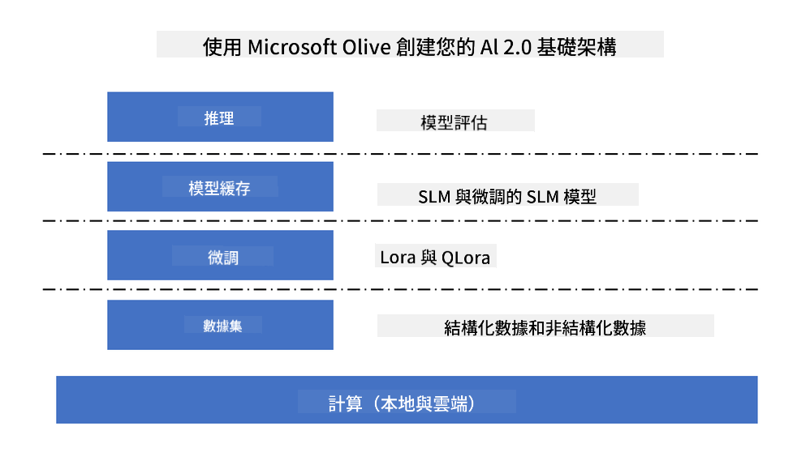
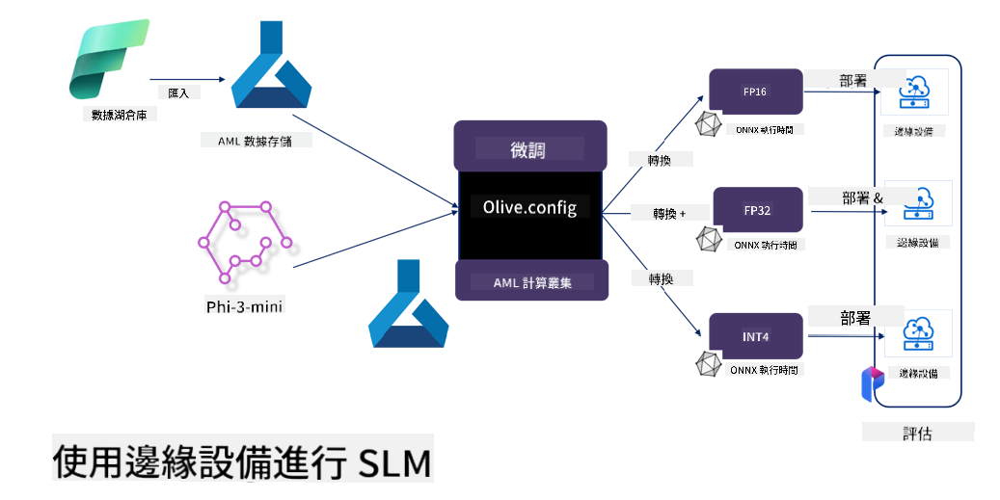

<!--
CO_OP_TRANSLATOR_METADATA:
{
  "original_hash": "727978e690ed9c055f594a4bfe01d75c",
  "translation_date": "2025-04-04T13:13:24+00:00",
  "source_file": "md\\03.FineTuning\\FineTuning_MicrosoftOlive.md",
  "language_code": "mo"
}
-->
# **Phi-3をMicrosoft Oliveでファインチューニング**

[Olive](https://github.com/microsoft/OLive?WT.mc_id=aiml-138114-kinfeylo)は、モデルの圧縮、最適化、コンパイルにおける業界トップクラスの技術を統合した、ハードウェアに特化したモデル最適化ツールです。

このツールは、機械学習モデルを特定のハードウェア構造に最適化するプロセスを簡素化するよう設計されています。

クラウドベースのアプリケーションでもエッジデバイスでも、Oliveを使用することでモデルの最適化が簡単かつ効果的に行えます。

## 主な特徴:
- Oliveは、目的のハードウェアターゲットに向けた最適化技術を集約し、自動化します。
- すべてのシナリオに適した単一の最適化技術は存在しないため、Oliveは業界専門家が最適化技術を追加できる拡張性を提供します。

## エンジニアリングの負担軽減:
- 開発者は通常、トレーニング済みモデルを展開するために複数のハードウェアベンダー固有のツールチェーンを学習・利用する必要があります。
- Oliveは目的のハードウェア向けの最適化技術を自動化することで、このプロセスを簡素化します。

## すぐに使えるE2E最適化ソリューション:

統合された技術を組み合わせて調整することで、Oliveはエンドツーエンドの最適化に向けた統一ソリューションを提供します。
モデルの最適化時には、精度やレイテンシーといった制約を考慮します。

## Microsoft Oliveを使ったファインチューニング

Microsoft Oliveは非常に使いやすいオープンソースのモデル最適化ツールで、生成型人工知能分野でのファインチューニングや参照に対応しています。簡単な設定を行い、オープンソースの小型言語モデルと関連するランタイム環境（AzureML / ローカルGPU、CPU、DirectML）を組み合わせることで、モデルの自動最適化を通じてファインチューニングや参照が可能になります。そして、最適なモデルをクラウドやエッジデバイスに展開することができます。これにより、企業はオンプレミスやクラウド上で独自の業界特化型モデルを構築できます。



## Phi-3をMicrosoft Oliveでファインチューニングする



## Phi-3 Oliveのサンプルコードと例
この例では、Oliveを使用して以下を行います:

- LoRAアダプターをファインチューニングし、フレーズを「悲しみ」「喜び」「恐れ」「驚き」に分類します。
- アダプターの重みをベースモデルに統合します。
- モデルをint4に最適化・量子化します。

[サンプルコード](../../code/03.Finetuning/olive-ort-example/README.md)

### Microsoft Oliveのセットアップ

Microsoft Oliveのインストールは非常に簡単で、CPU、GPU、DirectML、Azure MLに対応したインストールが可能です。

```bash
pip install olive-ai
```

ONNXモデルをCPUで実行したい場合は以下を使用します。

```bash
pip install olive-ai[cpu]
```

ONNXモデルをGPUで実行したい場合は以下を使用します。

```python
pip install olive-ai[gpu]
```

Azure MLを使用したい場合は以下を使用します。

```python
pip install git+https://github.com/microsoft/Olive#egg=olive-ai[azureml]
```

**注意**
OS要件 : Ubuntu 20.04 / 22.04 

### **Microsoft OliveのConfig.json**

インストール後、Configファイルを通じてデータ、計算、トレーニング、展開、モデル生成などのモデル固有の設定を構成できます。

**1. データ**

Microsoft Oliveでは、ローカルデータとクラウドデータでのトレーニングがサポートされており、設定で構成できます。

*ローカルデータの設定*

ファインチューニングに必要なデータセットを簡単に設定できます。通常はjson形式で、データテンプレートに適合させます。モデルの要件に基づいて調整が必要です（例: Microsoft Phi-3-miniが必要とする形式に適合させる。他のモデルを使用する場合は、それぞれのモデルが必要とするファインチューニング形式を参照してください）。

```json

    "data_configs": [
        {
            "name": "dataset_default_train",
            "type": "HuggingfaceContainer",
            "load_dataset_config": {
                "params": {
                    "data_name": "json", 
                    "data_files":"dataset/dataset-classification.json",
                    "split": "train"
                }
            },
            "pre_process_data_config": {
                "params": {
                    "dataset_type": "corpus",
                    "text_cols": [
                            "phrase",
                            "tone"
                    ],
                    "text_template": "### Text: {phrase}\n### The tone is:\n{tone}",
                    "corpus_strategy": "join",
                    "source_max_len": 2048,
                    "pad_to_max_len": false,
                    "use_attention_mask": false
                }
            }
        }
    ],
```

**クラウドデータソースの設定**

Azure AI Studio / Azure Machine Learning Serviceのデータストアをリンクし、クラウド上のデータを結びつけることで、Microsoft FabricやAzure Dataを通じて異なるデータソースをAzure AI Studio / Azure Machine Learning Serviceに導入し、ファインチューニングのデータをサポートできます。

```json

    "data_configs": [
        {
            "name": "dataset_default_train",
            "type": "HuggingfaceContainer",
            "load_dataset_config": {
                "params": {
                    "data_name": "json", 
                    "data_files": {
                        "type": "azureml_datastore",
                        "config": {
                            "azureml_client": {
                                "subscription_id": "Your Azure Subscrition ID",
                                "resource_group": "Your Azure Resource Group",
                                "workspace_name": "Your Azure ML Workspaces name"
                            },
                            "datastore_name": "workspaceblobstore",
                            "relative_path": "Your train_data.json Azure ML Location"
                        }
                    },
                    "split": "train"
                }
            },
            "pre_process_data_config": {
                "params": {
                    "dataset_type": "corpus",
                    "text_cols": [
                            "Question",
                            "Best Answer"
                    ],
                    "text_template": "<|user|>\n{Question}<|end|>\n<|assistant|>\n{Best Answer}\n<|end|>",
                    "corpus_strategy": "join",
                    "source_max_len": 2048,
                    "pad_to_max_len": false,
                    "use_attention_mask": false
                }
            }
        }
    ],
    
```

**2. コンピューティング構成**

ローカルで実行する場合はローカルデータリソースを直接使用できます。Azure AI Studio / Azure Machine Learning Serviceのリソースを使用する場合は、関連するAzureパラメータや計算能力名などを構成する必要があります。

```json

    "systems": {
        "aml": {
            "type": "AzureML",
            "config": {
                "accelerators": ["gpu"],
                "hf_token": true,
                "aml_compute": "Your Azure AI Studio / Azure Machine Learning Service Compute Name",
                "aml_docker_config": {
                    "base_image": "Your Azure AI Studio / Azure Machine Learning Service docker",
                    "conda_file_path": "conda.yaml"
                }
            }
        },
        "azure_arc": {
            "type": "AzureML",
            "config": {
                "accelerators": ["gpu"],
                "aml_compute": "Your Azure AI Studio / Azure Machine Learning Service Compute Name",
                "aml_docker_config": {
                    "base_image": "Your Azure AI Studio / Azure Machine Learning Service docker",
                    "conda_file_path": "conda.yaml"
                }
            }
        }
    },
```

***注意***

Azure AI Studio / Azure Machine Learning Service上でコンテナを通じて実行されるため、必要な環境を構成する必要があります。これはconda.yaml環境で構成します。

```yaml

name: project_environment
channels:
  - defaults
dependencies:
  - python=3.8.13
  - pip=22.3.1
  - pip:
      - einops
      - accelerate
      - azure-keyvault-secrets
      - azure-identity
      - bitsandbytes
      - datasets
      - huggingface_hub
      - peft
      - scipy
      - sentencepiece
      - torch>=2.2.0
      - transformers
      - git+https://github.com/microsoft/Olive@jiapli/mlflow_loading_fix#egg=olive-ai[gpu]
      - --extra-index-url https://aiinfra.pkgs.visualstudio.com/PublicPackages/_packaging/ORT-Nightly/pypi/simple/ 
      - ort-nightly-gpu==1.18.0.dev20240307004
      - --extra-index-url https://aiinfra.pkgs.visualstudio.com/PublicPackages/_packaging/onnxruntime-genai/pypi/simple/
      - onnxruntime-genai-cuda

    

```

**3. SLMの選択**

Hugging Faceから直接モデルを使用することも、Azure AI Studio / Azure Machine Learningのモデルカタログと組み合わせて使用するモデルを選択することもできます。以下のコード例ではMicrosoft Phi-3-miniを例にします。

モデルがローカルにある場合は以下の方法を使用します。

```json

    "input_model":{
        "type": "PyTorchModel",
        "config": {
            "hf_config": {
                "model_name": "model-cache/microsoft/phi-3-mini",
                "task": "text-generation",
                "model_loading_args": {
                    "trust_remote_code": true
                }
            }
        }
    },
```

Azure AI Studio / Azure Machine Learning Serviceからモデルを使用したい場合は以下の方法を使用します。

```json

    "input_model":{
        "type": "PyTorchModel",
        "config": {
            "model_path": {
                "type": "azureml_registry_model",
                "config": {
                    "name": "microsoft/Phi-3-mini-4k-instruct",
                    "registry_name": "azureml-msr",
                    "version": "11"
                }
            },
             "model_file_format": "PyTorch.MLflow",
             "hf_config": {
                "model_name": "microsoft/Phi-3-mini-4k-instruct",
                "task": "text-generation",
                "from_pretrained_args": {
                    "trust_remote_code": true
                }
            }
        }
    },
```

**注意:**
Azure AI Studio / Azure Machine Learning Serviceと統合する必要があるため、モデルを設定する際にはバージョン番号や関連する命名を参照してください。

Azure上のすべてのモデルはPyTorch.MLflowに設定する必要があります。

Hugging Faceのアカウントを持っている必要があり、そのキーをAzure AI Studio / Azure Machine LearningのKey値に結びつける必要があります。

**4. アルゴリズム**

Microsoft OliveはLoraとQLoraのファインチューニングアルゴリズムを非常にうまくカプセル化しています。設定する必要があるのは関連するパラメータだけです。ここではQLoraを例に挙げます。

```json
        "lora": {
            "type": "LoRA",
            "config": {
                "target_modules": [
                    "o_proj",
                    "qkv_proj"
                ],
                "double_quant": true,
                "lora_r": 64,
                "lora_alpha": 64,
                "lora_dropout": 0.1,
                "train_data_config": "dataset_default_train",
                "eval_dataset_size": 0.3,
                "training_args": {
                    "seed": 0,
                    "data_seed": 42,
                    "per_device_train_batch_size": 1,
                    "per_device_eval_batch_size": 1,
                    "gradient_accumulation_steps": 4,
                    "gradient_checkpointing": false,
                    "learning_rate": 0.0001,
                    "num_train_epochs": 3,
                    "max_steps": 10,
                    "logging_steps": 10,
                    "evaluation_strategy": "steps",
                    "eval_steps": 187,
                    "group_by_length": true,
                    "adam_beta2": 0.999,
                    "max_grad_norm": 0.3
                }
            }
        },
```

量子化変換を行いたい場合、Microsoft Oliveのメインブランチはonnxruntime-genaiメソッドをすでにサポートしています。必要に応じて以下のように設定できます：

1. アダプターの重みをベースモデルに統合する
2. 必要な精度でモデルをonnxモデルに変換する（ModelBuilderを使用）

例えば、量子化されたINT4への変換

```json

        "merge_adapter_weights": {
            "type": "MergeAdapterWeights"
        },
        "builder": {
            "type": "ModelBuilder",
            "config": {
                "precision": "int4"
            }
        }
```

**注意** 
- QLoRAを使用する場合、ONNXRuntime-genaiの量子化変換は現時点ではサポートされていません。

- ここで指摘すべき点として、上記のステップを自分のニーズに応じて設定することができます。必ずしも上記のステップを完全に構成する必要はありません。ニーズに応じてアルゴリズムのステップを直接使用することも可能です。最後に関連するエンジンを構成する必要があります。

```json

    "engine": {
        "log_severity_level": 0,
        "host": "aml",
        "target": "aml",
        "search_strategy": false,
        "execution_providers": ["CUDAExecutionProvider"],
        "cache_dir": "../model-cache/models/phi3-finetuned/cache",
        "output_dir" : "../model-cache/models/phi3-finetuned"
    }
```

**5. ファインチューニングの完了**

コマンドラインで、olive-config.jsonのディレクトリ内で以下を実行します。

```bash
olive run --config olive-config.json  
```

It seems like "mo" might be a typo or shorthand. Could you clarify what language or format you mean by "mo"? For example, are you referring to Māori, Mongolian, or something else? Let me know, and I'll assist you accordingly!