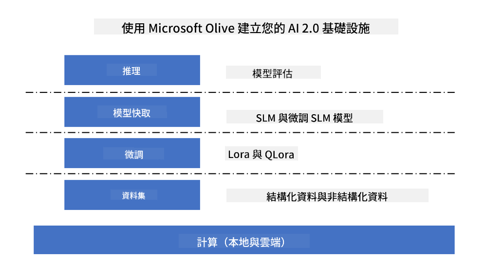

<!--
CO_OP_TRANSLATOR_METADATA:
{
  "original_hash": "5764be88ad2eb4f341e742eb8f14fab1",
  "translation_date": "2025-05-07T13:14:33+00:00",
  "source_file": "md/03.FineTuning/FineTuning_MicrosoftOlive.md",
  "language_code": "mo"
}
-->
# **Fine-tuning Phi-3 with Microsoft Olive**

[Olive](https://github.com/microsoft/OLive?WT.mc_id=aiml-138114-kinfeylo) 是一款易于使用的硬件感知模型优化工具，汇集了业界领先的模型压缩、优化和编译技术。

它旨在简化机器学习模型的优化流程，确保模型能高效利用特定硬件架构。

无论你是在云端应用还是边缘设备上工作，Olive 都能帮助你轻松且高效地优化模型。

## 主要功能：
- Olive 汇聚并自动化针对目标硬件的优化技术。
- 没有单一的优化技术能适用于所有场景，Olive 允许行业专家通过插件扩展优化创新。

## 降低工程投入：
- 开发者通常需要学习并使用多个硬件厂商专属的工具链来准备和优化训练好的模型以供部署。
- Olive 通过自动化目标硬件的优化技术简化了这一流程。

## 开箱即用的端到端优化解决方案：

通过组合和调优集成技术，Olive 提供统一的端到端优化方案。
它在优化模型时会考虑准确率和延迟等约束。

## 使用 Microsoft Olive 进行微调

Microsoft Olive 是一款非常易用的开源模型优化工具，覆盖生成式人工智能领域的微调和推理。只需简单配置，结合开源小型语言模型及相关运行环境（AzureML / 本地 GPU、CPU、DirectML），即可通过自动优化完成模型的微调或推理，找到最佳模型部署到云端或边缘设备。帮助企业在本地及云端构建行业垂直模型。



## 使用 Microsoft Olive 进行 Phi-3 微调


## Phi-3 Olive 示例代码与示例
本示例将使用 Olive 来：

- 微调 LoRA 适配器，将短语分类为 Sad、Joy、Fear、Surprise。
- 将适配器权重合并到基础模型中。
- 优化并量化模型为 int4。

[Sample Code](../../code/03.Finetuning/olive-ort-example/README.md)

### 安装 Microsoft Olive

Microsoft Olive 安装非常简单，支持 CPU、GPU、DirectML 及 Azure ML 环境安装。

```bash
pip install olive-ai
```

如果你想在 CPU 上运行 ONNX 模型，可以使用

```bash
pip install olive-ai[cpu]
```

如果你想在 GPU 上运行 ONNX 模型，可以使用

```python
pip install olive-ai[gpu]
```

如果你想使用 Azure ML，使用

```python
pip install git+https://github.com/microsoft/Olive#egg=olive-ai[azureml]
```

**注意**  
操作系统要求：Ubuntu 20.04 / 22.04

### **Microsoft Olive 的 Config.json**

安装完成后，可以通过 Config 文件配置不同模型的专属设置，包括数据、计算、训练、部署及模型生成。

**1. 数据**

Microsoft Olive 支持本地数据和云端数据训练，均可在设置中配置。

*本地数据设置*

只需简单配置需要用于微调训练的数据集，通常为 json 格式，并适配对应数据模板。需根据模型要求调整（例如，适配 Microsoft Phi-3-mini 所需格式。如使用其他模型，请参考对应模型的微调格式要求进行处理）

```json

    "data_configs": [
        {
            "name": "dataset_default_train",
            "type": "HuggingfaceContainer",
            "load_dataset_config": {
                "params": {
                    "data_name": "json", 
                    "data_files":"dataset/dataset-classification.json",
                    "split": "train"
                }
            },
            "pre_process_data_config": {
                "params": {
                    "dataset_type": "corpus",
                    "text_cols": [
                            "phrase",
                            "tone"
                    ],
                    "text_template": "### Text: {phrase}\n### The tone is:\n{tone}",
                    "corpus_strategy": "join",
                    "source_max_len": 2048,
                    "pad_to_max_len": false,
                    "use_attention_mask": false
                }
            }
        }
    ],
```

**云端数据源设置**

通过关联 Azure AI Studio/Azure Machine Learning Service 的数据存储，可以通过 Microsoft Fabric 和 Azure Data 引入不同数据源，支持微调数据。

```json

    "data_configs": [
        {
            "name": "dataset_default_train",
            "type": "HuggingfaceContainer",
            "load_dataset_config": {
                "params": {
                    "data_name": "json", 
                    "data_files": {
                        "type": "azureml_datastore",
                        "config": {
                            "azureml_client": {
                                "subscription_id": "Your Azure Subscrition ID",
                                "resource_group": "Your Azure Resource Group",
                                "workspace_name": "Your Azure ML Workspaces name"
                            },
                            "datastore_name": "workspaceblobstore",
                            "relative_path": "Your train_data.json Azure ML Location"
                        }
                    },
                    "split": "train"
                }
            },
            "pre_process_data_config": {
                "params": {
                    "dataset_type": "corpus",
                    "text_cols": [
                            "Question",
                            "Best Answer"
                    ],
                    "text_template": "<|user|>\n{Question}<|end|>\n<|assistant|>\n{Best Answer}\n<|end|>",
                    "corpus_strategy": "join",
                    "source_max_len": 2048,
                    "pad_to_max_len": false,
                    "use_attention_mask": false
                }
            }
        }
    ],
    
```

**2. 计算配置**

如果需要使用本地环境，可直接使用本地计算资源。若需使用 Azure AI Studio / Azure Machine Learning Service 的资源，需要配置相关 Azure 参数、计算资源名称等。

```json

    "systems": {
        "aml": {
            "type": "AzureML",
            "config": {
                "accelerators": ["gpu"],
                "hf_token": true,
                "aml_compute": "Your Azure AI Studio / Azure Machine Learning Service Compute Name",
                "aml_docker_config": {
                    "base_image": "Your Azure AI Studio / Azure Machine Learning Service docker",
                    "conda_file_path": "conda.yaml"
                }
            }
        },
        "azure_arc": {
            "type": "AzureML",
            "config": {
                "accelerators": ["gpu"],
                "aml_compute": "Your Azure AI Studio / Azure Machine Learning Service Compute Name",
                "aml_docker_config": {
                    "base_image": "Your Azure AI Studio / Azure Machine Learning Service docker",
                    "conda_file_path": "conda.yaml"
                }
            }
        }
    },
```

***注意***

由于运行在 Azure AI Studio/Azure Machine Learning Service 的容器中，需配置所需环境，配置内容在 conda.yaml 文件中。

```yaml

name: project_environment
channels:
  - defaults
dependencies:
  - python=3.8.13
  - pip=22.3.1
  - pip:
      - einops
      - accelerate
      - azure-keyvault-secrets
      - azure-identity
      - bitsandbytes
      - datasets
      - huggingface_hub
      - peft
      - scipy
      - sentencepiece
      - torch>=2.2.0
      - transformers
      - git+https://github.com/microsoft/Olive@jiapli/mlflow_loading_fix#egg=olive-ai[gpu]
      - --extra-index-url https://aiinfra.pkgs.visualstudio.com/PublicPackages/_packaging/ORT-Nightly/pypi/simple/ 
      - ort-nightly-gpu==1.18.0.dev20240307004
      - --extra-index-url https://aiinfra.pkgs.visualstudio.com/PublicPackages/_packaging/onnxruntime-genai/pypi/simple/
      - onnxruntime-genai-cuda

    

```

**3. 选择你的 SLM**

你可以直接使用 Hugging Face 上的模型，也可以结合 Azure AI Studio / Azure Machine Learning 的模型目录选择使用的模型。以下代码示例以 Microsoft Phi-3-mini 为例。

如果模型在本地，可以使用此方式

```json

    "input_model":{
        "type": "PyTorchModel",
        "config": {
            "hf_config": {
                "model_name": "model-cache/microsoft/phi-3-mini",
                "task": "text-generation",
                "model_loading_args": {
                    "trust_remote_code": true
                }
            }
        }
    },
```

如果想使用 Azure AI Studio / Azure Machine Learning Service 的模型，可以使用此方式

```json

    "input_model":{
        "type": "PyTorchModel",
        "config": {
            "model_path": {
                "type": "azureml_registry_model",
                "config": {
                    "name": "microsoft/Phi-3-mini-4k-instruct",
                    "registry_name": "azureml-msr",
                    "version": "11"
                }
            },
             "model_file_format": "PyTorch.MLflow",
             "hf_config": {
                "model_name": "microsoft/Phi-3-mini-4k-instruct",
                "task": "text-generation",
                "from_pretrained_args": {
                    "trust_remote_code": true
                }
            }
        }
    },
```

**注意：**  
需与 Azure AI Studio / Azure Machine Learning Service 集成，设置模型时请参考版本号及相关命名。

Azure 上所有模型需设置为 PyTorch.MLflow。

你需要拥有 Hugging Face 账号，并将密钥绑定到 Azure AI Studio / Azure Machine Learning 的 Key 值中。

**4. 算法**

Microsoft Olive 对 LoRA 和 QLoRA 微调算法封装良好，只需配置相关参数。这里以 QLoRA 为例。

```json
        "lora": {
            "type": "LoRA",
            "config": {
                "target_modules": [
                    "o_proj",
                    "qkv_proj"
                ],
                "double_quant": true,
                "lora_r": 64,
                "lora_alpha": 64,
                "lora_dropout": 0.1,
                "train_data_config": "dataset_default_train",
                "eval_dataset_size": 0.3,
                "training_args": {
                    "seed": 0,
                    "data_seed": 42,
                    "per_device_train_batch_size": 1,
                    "per_device_eval_batch_size": 1,
                    "gradient_accumulation_steps": 4,
                    "gradient_checkpointing": false,
                    "learning_rate": 0.0001,
                    "num_train_epochs": 3,
                    "max_steps": 10,
                    "logging_steps": 10,
                    "evaluation_strategy": "steps",
                    "eval_steps": 187,
                    "group_by_length": true,
                    "adam_beta2": 0.999,
                    "max_grad_norm": 0.3
                }
            }
        },
```

如果需要量化转换，Microsoft Olive 主分支已支持 onnxruntime-genai 方法，可根据需求设置：

1. 将适配器权重合并到基础模型  
2. 使用 ModelBuilder 将模型转换为所需精度的 onnx 模型

例如转换为量化的 INT4

```json

        "merge_adapter_weights": {
            "type": "MergeAdapterWeights"
        },
        "builder": {
            "type": "ModelBuilder",
            "config": {
                "precision": "int4"
            }
        }
```

**注意**  
- 如果使用 QLoRA，当前暂不支持 ONNXRuntime-genai 的量化转换。  
- 这里强调，你可以根据需求设置以上步骤，无需全部配置。根据需求可直接使用算法步骤而不进行微调，最后配置相关引擎即可。

```json

    "engine": {
        "log_severity_level": 0,
        "host": "aml",
        "target": "aml",
        "search_strategy": false,
        "execution_providers": ["CUDAExecutionProvider"],
        "cache_dir": "../model-cache/models/phi3-finetuned/cache",
        "output_dir" : "../model-cache/models/phi3-finetuned"
    }
```

**5. 微调完成**

在命令行中，在 olive-config.json 所在目录执行

```bash
olive run --config olive-config.json  
```

**Disclaimer**:  
Dis document haz been translatid yusing AI translatshun servis [Co-op Translator](https://github.com/Azure/co-op-translator). While we striv for akyurasi, pleez be aware dat automated translatshuns may contain erors or inakyerasees. De original document in its native langwaj shud be konsiderd de authoritativ sors. For kritikal informashun, profeshunal hyuman translatshun is rekomended. We ar not layabul for eni misunderstandings or misinterpretashuns arising from de yus of dis translatshun.