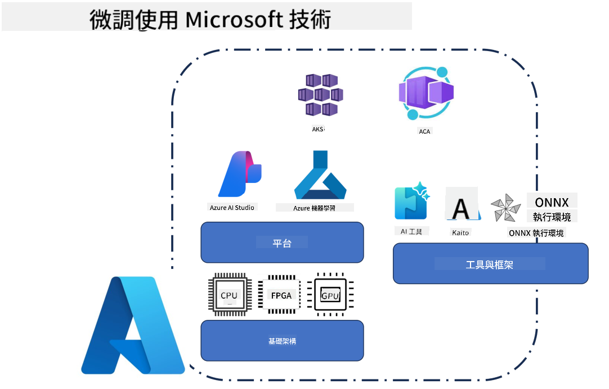
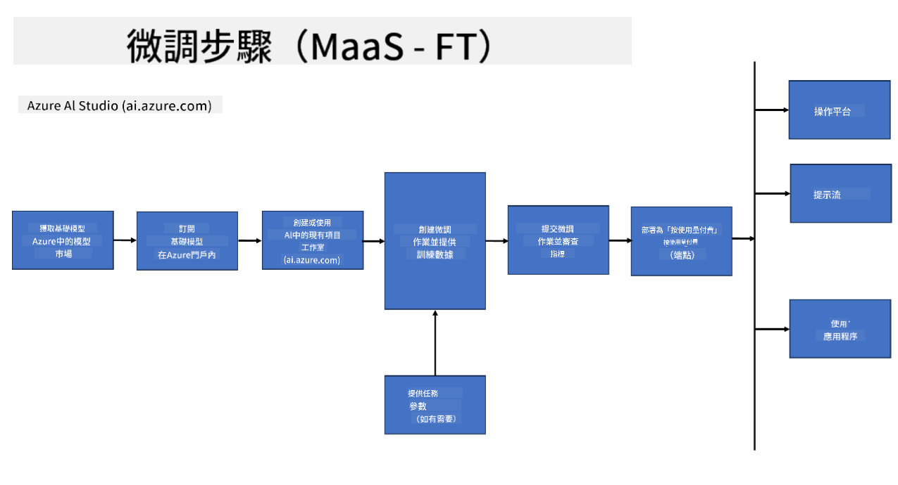
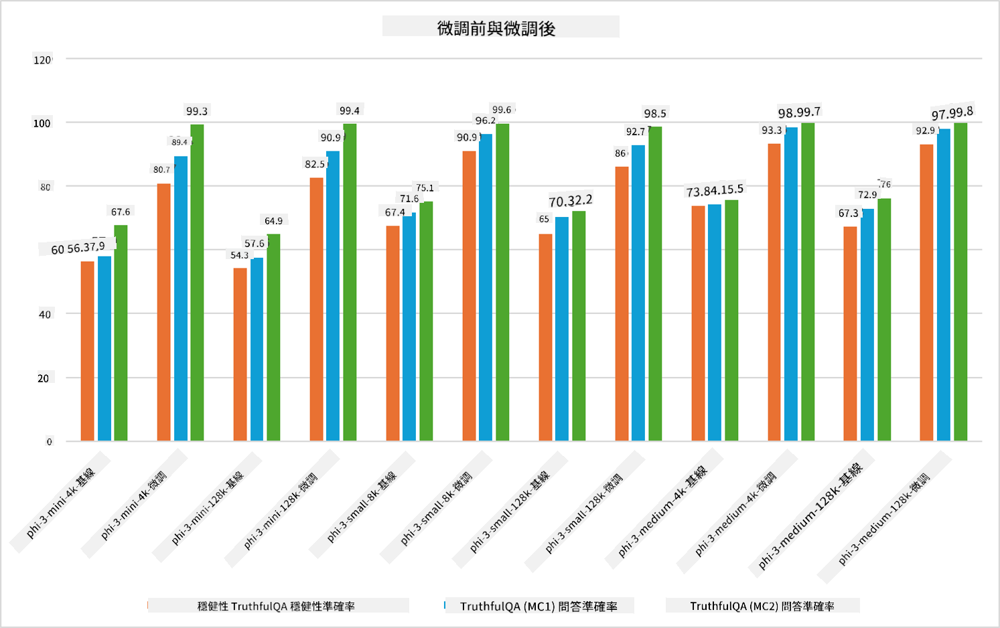

<!--
CO_OP_TRANSLATOR_METADATA:
{
  "original_hash": "cd52a3c9a424a77d2ec0470770c93846",
  "translation_date": "2025-04-04T13:28:30+00:00",
  "source_file": "md\\03.FineTuning\\FineTuning_Scenarios.md",
  "language_code": "mo"
}
-->
## Fine Tuning Scenarios

**Platform** Includes various technologies such as Azure AI Foundry, Azure Machine Learning, AI Tools, Kaito, and ONNX Runtime.

**Infrastructure** Covers the CPU and FPGA, which play a crucial role in the fine-tuning process. Below are the icons for these technologies.

**Tools & Framework** Includes ONNX Runtime and ONNX Runtime. Below are the icons for these technologies.
[Insert icons for ONNX Runtime and ONNX Runtime]

The fine-tuning process using Microsoft technologies integrates multiple components and tools. By leveraging these technologies, applications can be effectively fine-tuned to deliver superior solutions.

## Model as Service

Fine-tune the model through hosted fine-tuning without needing to manage compute resources.

Serverless fine-tuning is offered for Phi-3-mini and Phi-3-medium models, allowing developers to quickly and easily customize models for both cloud and edge scenarios without worrying about compute setup. Additionally, Phi-3-small is now available via the Models-as-a-Service offering, enabling developers to begin AI development seamlessly without managing the underlying infrastructure.

## Model as a Platform 

Users oversee their own compute to fine-tune their models.

[Fine Tuning Sample](https://github.com/Azure/azureml-examples/blob/main/sdk/python/foundation-models/system/finetune/chat-completion/chat-completion.ipynb)

## Fine Tuning Scenarios 

| | | | | | | |
|-|-|-|-|-|-|-|
|Scenario|LoRA|QLoRA|PEFT|DeepSpeed|ZeRO|DORA|
|Adapting pre-trained LLMs to specific tasks or domains|Yes|Yes|Yes|Yes|Yes|Yes|
|Fine-tuning for NLP tasks such as text classification, named entity recognition, and machine translation|Yes|Yes|Yes|Yes|Yes|Yes|
|Fine-tuning for QA tasks|Yes|Yes|Yes|Yes|Yes|Yes|
|Fine-tuning for generating human-like responses in chatbots|Yes|Yes|Yes|Yes|Yes|Yes|
|Fine-tuning for generating music, art, or other forms of creativity|Yes|Yes|Yes|Yes|Yes|Yes|
|Reducing computational and financial costs|Yes|Yes|No|Yes|Yes|No|
|Reducing memory usage|No|Yes|No|Yes|Yes|Yes|
|Using fewer parameters for efficient finetuning|No|Yes|Yes|No|No|Yes|
|Memory-efficient form of data parallelism that gives access to the aggregate GPU memory of all the GPU devices available|No|No|No|Yes|Yes|Yes|

## Fine Tuning Performance Examples

It seems like you're asking for the text to be translated into "mo." Could you clarify what "mo" refers to? Are you referring to a specific language, such as Moldovan (Romanian), or something else? Let me know so I can assist you properly!