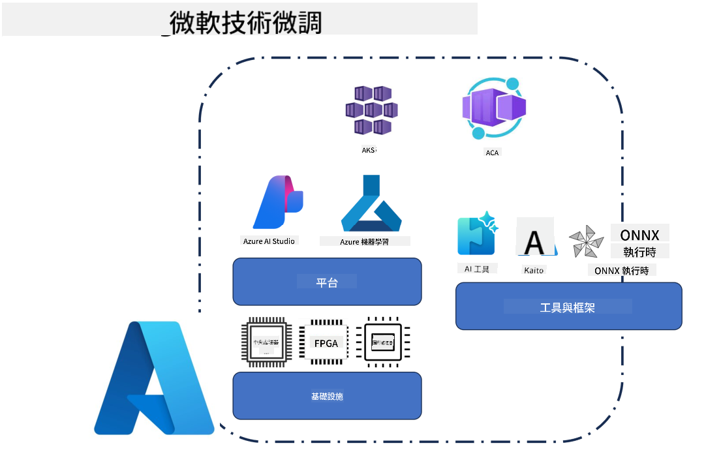

<!--
CO_OP_TRANSLATOR_METADATA:
{
  "original_hash": "cb5648935f63edc17e95ce38f23adc32",
  "translation_date": "2025-05-07T13:37:46+00:00",
  "source_file": "md/03.FineTuning/FineTuning_Scenarios.md",
  "language_code": "mo"
}
-->
## Fine Tuning Scenarios

**Platform** Includes various technologies like Azure AI Foundry, Azure Machine Learning, AI Tools, Kaito, and ONNX Runtime.

**Infrastructure** Covers CPU and FPGA, which are key for the fine-tuning process. Let me show you the icons representing each of these technologies.

**Tools & Framework** Covers ONNX Runtime and ONNX Runtime. Let me show you the icons for each of these technologies.  
[Insert icons for ONNX Runtime and ONNX Runtime]

The fine-tuning process with Microsoft technologies involves multiple components and tools. By understanding and leveraging these technologies, we can effectively fine-tune our applications and build better solutions.

## Model as Service

Fine-tune the model using hosted fine-tuning, without needing to create or manage compute resources.

Serverless fine-tuning is available for Phi-3-mini and Phi-3-medium models, allowing developers to quickly and easily customize models for cloud and edge scenarios without managing compute. We have also announced that Phi-3-small is now accessible through our Models-as-a-Service offering, enabling developers to start AI development quickly without handling underlying infrastructure.

## Model as a Platform

Users manage their own compute to fine-tune their models.

[Fine Tuning Sample](https://github.com/Azure/azureml-examples/blob/main/sdk/python/foundation-models/system/finetune/chat-completion/chat-completion.ipynb)

## Fine Tuning Scenarios

| | | | | | | |
|-|-|-|-|-|-|-|
|Scenario|LoRA|QLoRA|PEFT|DeepSpeed|ZeRO|DORA|
|Adapting pre-trained LLMs to specific tasks or domains|Yes|Yes|Yes|Yes|Yes|Yes|
|Fine-tuning for NLP tasks such as text classification, named entity recognition, and machine translation|Yes|Yes|Yes|Yes|Yes|Yes|
|Fine-tuning for QA tasks|Yes|Yes|Yes|Yes|Yes|Yes|
|Fine-tuning for generating human-like responses in chatbots|Yes|Yes|Yes|Yes|Yes|Yes|
|Fine-tuning for generating music, art, or other forms of creativity|Yes|Yes|Yes|Yes|Yes|Yes|
|Reducing computational and financial costs|Yes|Yes|No|Yes|Yes|No|
|Reducing memory usage|No|Yes|No|Yes|Yes|Yes|
|Using fewer parameters for efficient finetuning|No|Yes|Yes|No|No|Yes|
|Memory-efficient form of data parallelism that gives access to the aggregate GPU memory of all the GPU devices available|No|No|No|Yes|Yes|Yes|

## Fine Tuning Performance Examples

**Disclaimer**:  
This document has been translated using AI translation service [Co-op Translator](https://github.com/Azure/co-op-translator). While we strive for accuracy, please be aware that automated translations may contain errors or inaccuracies. The original document in its native language should be considered the authoritative source. For critical information, professional human translation is recommended. We are not liable for any misunderstandings or misinterpretations arising from the use of this translation.