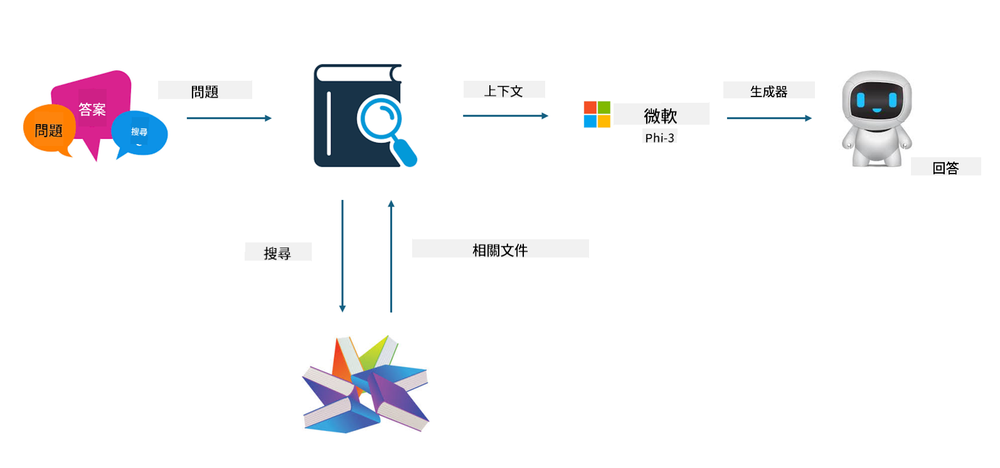

<!--
CO_OP_TRANSLATOR_METADATA:
{
  "original_hash": "e4e010400c2918557b36bb932a14004c",
  "translation_date": "2025-05-07T13:33:08+00:00",
  "source_file": "md/03.FineTuning/FineTuning_vs_RAG.md",
  "language_code": "mo"
}
-->
## Finetuning vs RAG

## Retrieval Augmented Generation

RAG combines data retrieval with text generation. Both structured and unstructured enterprise data are stored in a vector database. When searching for relevant information, related summaries and content are retrieved to form a context, which is then used alongside the text completion capabilities of LLM/SLM to generate content.

## RAG Process

## Fine-tuning
Fine-tuning focuses on improving a specific model. It doesn’t require starting from the model algorithm, but it does need continuous accumulation of data. If you want more accurate terminology and language expression in industry applications, fine-tuning is a better choice. However, if your data changes frequently, fine-tuning can become complex.

## How to choose
If your answer requires incorporating external data, RAG is the best choice.

If you need to deliver stable and precise industry knowledge, fine-tuning is a good option. RAG prioritizes retrieving relevant content but may not always capture specialized nuances perfectly.

Fine-tuning demands a high-quality dataset, and if your data scope is small, it won’t make much difference. RAG is more flexible.  
Fine-tuning is a black box, somewhat metaphysical, making it hard to understand the internal workings. RAG, on the other hand, makes it easier to trace the data source, helping to effectively address hallucinations or content errors and offering better transparency.

**Disclaimer**:  
This document has been translated using AI translation service [Co-op Translator](https://github.com/Azure/co-op-translator). While we strive for accuracy, please be aware that automated translations may contain errors or inaccuracies. The original document in its native language should be considered the authoritative source. For critical information, professional human translation is recommended. We are not liable for any misunderstandings or misinterpretations arising from the use of this translation.