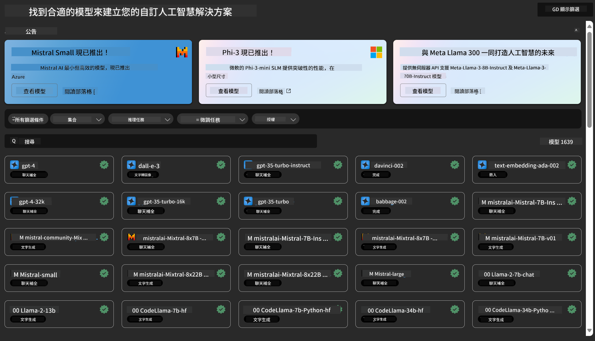
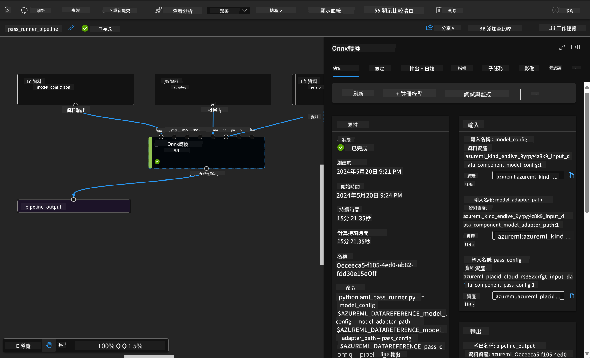

<!--
CO_OP_TRANSLATOR_METADATA:
{
  "original_hash": "315566447513c4c6215ea5a004315e4f",
  "translation_date": "2025-04-04T13:33:19+00:00",
  "source_file": "md\\03.FineTuning\\Introduce_AzureML.md",
  "language_code": "mo"
}
-->
# **Introduce Azure Machine Learning Service**

[Azure Machine Learning](https://ml.azure.com?WT.mc_id=aiml-138114-kinfeylo) è un servizio cloud progettato per accelerare e gestire il ciclo di vita dei progetti di machine learning (ML).

Professionisti ML, data scientist e ingegneri possono utilizzarlo nelle loro attività quotidiane per:

- Allenare e distribuire modelli.
- Gestire le operazioni di machine learning (MLOps).
- È possibile creare un modello direttamente in Azure Machine Learning o utilizzare modelli sviluppati su piattaforme open-source come PyTorch, TensorFlow o scikit-learn.
- Gli strumenti MLOps aiutano a monitorare, riaddestrare e ridistribuire i modelli.

## A chi è rivolto Azure Machine Learning?

**Data Scientist e Ingegneri ML**

Possono utilizzare strumenti per accelerare e automatizzare i loro flussi di lavoro quotidiani.  
Azure ML offre funzionalità per equità, spiegabilità, tracciabilità e verificabilità.

**Sviluppatori di Applicazioni**

Possono integrare i modelli in applicazioni o servizi in modo semplice e fluido.

**Sviluppatori di Piattaforme**

Hanno accesso a un set di strumenti avanzati supportati da API affidabili di Azure Resource Manager.  
Questi strumenti consentono di costruire strumenti ML avanzati.

**Imprese**

Lavorando nel cloud Microsoft Azure, le imprese possono beneficiare di una sicurezza familiare e del controllo degli accessi basato sui ruoli.  
È possibile configurare progetti per controllare l'accesso a dati protetti e operazioni specifiche.

## Produttività per Tutti i Membri del Team

I progetti ML spesso richiedono un team con competenze diversificate per costruire e mantenere i modelli.

Azure ML offre strumenti che consentono di:
- Collaborare con il team tramite notebook condivisi, risorse di calcolo, calcolo serverless, dati e ambienti.
- Sviluppare modelli con equità, spiegabilità, tracciabilità e verificabilità per soddisfare i requisiti di conformità alla tracciabilità e agli audit.
- Distribuire modelli ML rapidamente e facilmente su larga scala e gestirli in modo efficiente con MLOps.
- Eseguire carichi di lavoro di machine learning ovunque, con governance, sicurezza e conformità integrate.

## Strumenti Piattaforma Compatibili

Chiunque faccia parte di un team ML può utilizzare gli strumenti preferiti per svolgere il proprio lavoro.  
Che si tratti di esperimenti rapidi, tuning di iperparametri, costruzione di pipeline o gestione delle inferenze, è possibile utilizzare interfacce familiari, tra cui:
- Azure Machine Learning Studio
- Python SDK (v2)
- Azure CLI (v2)
- API REST di Azure Resource Manager

Mentre si affinano i modelli e si collabora durante il ciclo di sviluppo, è possibile condividere e trovare asset, risorse e metriche direttamente nell'interfaccia utente di Azure Machine Learning Studio.

## **LLM/SLM in Azure ML**

Azure ML ha introdotto numerose funzionalità legate a LLM/SLM, combinando LLMOps e SLMOps per creare una piattaforma tecnologica di intelligenza artificiale generativa a livello aziendale.

### **Catalogo Modelli**

Gli utenti aziendali possono distribuire diversi modelli in base a scenari di business specifici tramite il Catalogo Modelli, fornendo servizi come Model as Service per consentire agli sviluppatori o utenti aziendali di accedere ai modelli.

Il Catalogo Modelli in Azure Machine Learning Studio è il punto di riferimento per scoprire e utilizzare una vasta gamma di modelli che consentono di costruire applicazioni di intelligenza artificiale generativa.  
Il catalogo include centinaia di modelli di fornitori come Azure OpenAI Service, Mistral, Meta, Cohere, Nvidia, Hugging Face, oltre a modelli addestrati da Microsoft.  
I modelli forniti da fornitori diversi da Microsoft sono definiti Prodotti Non-Microsoft, come indicato nei Termini di Prodotti Microsoft, e sono soggetti ai termini forniti con il modello.

### **Pipeline di Lavoro**

Il cuore di una pipeline di machine learning è suddividere un compito ML completo in un flusso di lavoro a più fasi.  
Ogni fase rappresenta un componente gestibile che può essere sviluppato, ottimizzato, configurato e automatizzato singolarmente.  
Le fasi sono connesse tramite interfacce ben definite. Il servizio di pipeline di Azure Machine Learning orchestra automaticamente tutte le dipendenze tra le fasi della pipeline.

Nella messa a punto di SLM / LLM, possiamo gestire i nostri dati, processi di addestramento e generazione tramite Pipeline.

### **Prompt flow**

**Vantaggi dell'uso di Azure Machine Learning Prompt Flow**  
Azure Machine Learning Prompt Flow offre una serie di vantaggi che aiutano gli utenti a passare dall'ideazione all'esperimento e, infine, alla produzione di applicazioni basate su LLM:

**Agilità nella progettazione dei prompt**  
- Esperienza interattiva di authoring: Azure Machine Learning Prompt Flow fornisce una rappresentazione visiva della struttura del flusso, consentendo agli utenti di comprendere e navigare facilmente nei loro progetti. Offre anche un'esperienza di codifica simile ai notebook per uno sviluppo e un debugging efficienti.  
- Varianti per la messa a punto dei prompt: Gli utenti possono creare e confrontare diverse varianti di prompt, facilitando un processo iterativo di affinamento.  
- Valutazione: I flussi di valutazione integrati consentono agli utenti di analizzare la qualità e l'efficacia dei loro prompt e flussi.  
- Risorse complete: Azure Machine Learning Prompt Flow include una libreria di strumenti, esempi e modelli integrati che fungono da punto di partenza per lo sviluppo, ispirando creatività e accelerando il processo.

**Preparazione aziendale per applicazioni basate su LLM**  
- Collaborazione: Azure Machine Learning Prompt Flow supporta la collaborazione tra i membri del team, permettendo a più utenti di lavorare insieme su progetti di progettazione di prompt, condividere conoscenze e mantenere il controllo delle versioni.  
- Piattaforma integrata: Azure Machine Learning Prompt Flow semplifica l'intero processo di progettazione dei prompt, dalla fase di sviluppo e valutazione fino alla distribuzione e monitoraggio. Gli utenti possono distribuire facilmente i loro flussi come endpoint Azure Machine Learning e monitorarne le prestazioni in tempo reale, garantendo un funzionamento ottimale e miglioramenti continui.  
- Soluzioni di preparazione aziendale di Azure Machine Learning: Prompt Flow sfrutta le solide soluzioni aziendali di Azure Machine Learning, fornendo una base sicura, scalabile e affidabile per lo sviluppo, l'esperimento e la distribuzione dei flussi.

Con Azure Machine Learning Prompt Flow, gli utenti possono liberare la loro agilità nella progettazione dei prompt, collaborare efficacemente e sfruttare soluzioni aziendali per sviluppare e distribuire con successo applicazioni basate su LLM.

Combinando la potenza di calcolo, i dati e i diversi componenti di Azure ML, gli sviluppatori aziendali possono costruire facilmente le proprie applicazioni di intelligenza artificiale.

It seems like you want the text translated to "mo." Could you clarify what "mo" refers to? Are you referring to a specific language or dialect?