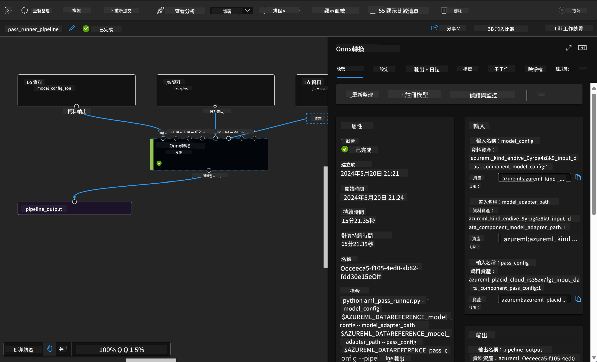

<!--
CO_OP_TRANSLATOR_METADATA:
{
  "original_hash": "7fe541373802e33568e94e13226d463c",
  "translation_date": "2025-05-07T13:32:21+00:00",
  "source_file": "md/03.FineTuning/Introduce_AzureML.md",
  "language_code": "mo"
}
-->
# **परिचय Azure Machine Learning सेवा**

[Azure Machine Learning](https://ml.azure.com?WT.mc_id=aiml-138114-kinfeylo) एक क्लाउड सेवा है जो मशीन लर्निंग (ML) परियोजना जीवनचक्र को तेज़ और प्रबंधित करने के लिए है।

ML पेशेवर, डेटा वैज्ञानिक, और इंजीनियर इसे अपनी दैनिक कार्यप्रणाली में उपयोग कर सकते हैं:

- मॉडल प्रशिक्षण और तैनाती करें।  
मशीन लर्निंग संचालन (MLOps) का प्रबंधन करें।  
- आप Azure Machine Learning में मॉडल बना सकते हैं या PyTorch, TensorFlow, या scikit-learn जैसे ओपन-सोर्स प्लेटफॉर्म से बने मॉडल का उपयोग कर सकते हैं।  
- MLOps उपकरण आपको मॉडलों की निगरानी, पुनःप्रशिक्षण, और पुनःतैनाती में मदद करते हैं।

## Azure Machine Learning किसके लिए है?

**डेटा वैज्ञानिक और ML इंजीनियर**  
वे अपनी दैनिक कार्यप्रणाली को तेज़ और स्वचालित करने के लिए उपकरणों का उपयोग कर सकते हैं।  
Azure ML न्यायसंगतता, व्याख्यात्मकता, ट्रैकिंग, और ऑडिटबिलिटी के लिए सुविधाएँ प्रदान करता है।  

**एप्लिकेशन डेवलपर्स:**  
वे मॉडल को अनुप्रयोगों या सेवाओं में सहजता से एकीकृत कर सकते हैं।

**प्लेटफ़ॉर्म डेवलपर्स**  
उन्हें Azure Resource Manager APIs द्वारा समर्थित एक मजबूत उपकरण सेट मिलता है।  
ये उपकरण उन्नत ML टूलिंग बनाने की अनुमति देते हैं।

**उद्योग**  
Microsoft Azure क्लाउड में काम करते हुए, उद्योग परिचित सुरक्षा और भूमिका-आधारित पहुँच नियंत्रण का लाभ उठाते हैं।  
परियोजनाएँ सेट करें ताकि संरक्षित डेटा और विशिष्ट संचालन तक पहुँच नियंत्रित की जा सके।

## टीम के हर सदस्य के लिए उत्पादकता  
ML परियोजनाओं के लिए अक्सर विविध कौशल वाले टीम की आवश्यकता होती है जो निर्माण और रखरखाव कर सके।

Azure ML ऐसे उपकरण प्रदान करता है जो आपको सक्षम बनाते हैं:  
- साझा नोटबुक, कंप्यूट संसाधन, सर्वरलेस कंप्यूट, डेटा, और परिवेशों के माध्यम से अपनी टीम के साथ सहयोग करने के लिए।  
- न्यायसंगतता, व्याख्यात्मकता, ट्रैकिंग, और ऑडिटबिलिटी के साथ मॉडल विकसित करने के लिए, ताकि वंशावली और ऑडिट अनुपालन आवश्यकताओं को पूरा किया जा सके।  
- ML मॉडल को तेज़ और आसानी से पैमाने पर तैनात करें, और MLOps के साथ उन्हें कुशलतापूर्वक प्रबंधित और नियंत्रित करें।  
- अंतर्निहित शासन, सुरक्षा, और अनुपालन के साथ कहीं भी मशीन लर्निंग वर्कलोड चलाएं।

## क्रॉस-कंपैटिबल प्लेटफ़ॉर्म टूल्स

ML टीम का कोई भी सदस्य अपनी पसंदीदा टूल्स का उपयोग कर काम पूरा कर सकता है।  
चाहे आप तेजी से प्रयोग कर रहे हों, हाइपरपैरामीटर ट्यूनिंग कर रहे हों, पाइपलाइनों का निर्माण कर रहे हों, या पूर्वानुमान प्रबंधन कर रहे हों, आप परिचित इंटरफेस का उपयोग कर सकते हैं जैसे:  
- Azure Machine Learning Studio  
- Python SDK (v2)  
- Azure CLI (v2)  
- Azure Resource Manager REST APIs  

जैसे-जैसे आप मॉडल परिष्कृत करते हैं और विकास चक्र के दौरान सहयोग करते हैं, आप Azure Machine Learning स्टूडियो UI में एसेट्स, संसाधन, और मेट्रिक्स साझा और खोज सकते हैं।

## **Azure ML में LLM/SLM**

Azure ML ने कई LLM/SLM-संबंधित फ़ंक्शन जोड़े हैं, जो LLMOps और SLMOps को मिलाकर एक उद्यम-स्तरीय जनरेटिव आर्टिफिशियल इंटेलिजेंस तकनीकी प्लेटफ़ॉर्म बनाते हैं।

### **मॉडल कैटलॉग**

उद्यम उपयोगकर्ता मॉडल कैटलॉग के माध्यम से विभिन्न व्यावसायिक परिदृश्यों के अनुसार अलग-अलग मॉडल तैनात कर सकते हैं, और मॉडल को सेवा के रूप में प्रदान कर सकते हैं ताकि उद्यम डेवलपर्स या उपयोगकर्ता इसे एक्सेस कर सकें।

Azure Machine Learning स्टूडियो में मॉडल कैटलॉग एक केंद्र है जहाँ आप विभिन्न मॉडल खोज और उपयोग कर सकते हैं, जो आपको जनरेटिव AI अनुप्रयोग बनाने में सक्षम बनाते हैं। मॉडल कैटलॉग में Azure OpenAI सेवा, Mistral, Meta, Cohere, Nvidia, Hugging Face जैसे मॉडल प्रदाताओं के सैकड़ों मॉडल होते हैं, जिनमें Microsoft द्वारा प्रशिक्षित मॉडल भी शामिल हैं। Microsoft के अलावा अन्य प्रदाताओं के मॉडल Microsoft के उत्पाद नियमों में गैर-Microsoft उत्पाद होते हैं और मॉडल के साथ प्रदान किए गए नियमों के अधीन होते हैं।

### **जॉब पाइपलाइन**

मशीन लर्निंग पाइपलाइन का मूल एक पूर्ण मशीन लर्निंग कार्य को कई चरणों वाले वर्कफ़्लो में विभाजित करना है। प्रत्येक चरण एक प्रबंधनीय घटक होता है जिसे व्यक्तिगत रूप से विकसित, अनुकूलित, कॉन्फ़िगर, और स्वचालित किया जा सकता है। चरण अच्छी तरह परिभाषित इंटरफेस के माध्यम से जुड़े होते हैं। Azure Machine Learning पाइपलाइन सेवा पाइपलाइन चरणों के बीच सभी निर्भरताओं का स्वचालित समन्वय करती है।

SLM / LLM के फाइन-ट्यूनिंग में, हम पाइपलाइन के माध्यम से अपने डेटा, प्रशिक्षण, और जनरेशन प्रक्रियाओं का प्रबंधन कर सकते हैं।

### **प्रॉम्प्ट फ्लो**

Azure Machine Learning प्रॉम्प्ट फ्लो का उपयोग करने के लाभ  
Azure Machine Learning प्रॉम्प्ट फ्लो उपयोगकर्ताओं को विचार से लेकर प्रयोग और अंततः उत्पादन-तैयार LLM-आधारित अनुप्रयोगों तक पहुँचने में मदद करता है:

**प्रॉम्प्ट इंजीनियरिंग में लचीलापन**

इंटरएक्टिव लेखन अनुभव: Azure Machine Learning प्रॉम्प्ट फ्लो फ्लो की संरचना का दृश्य प्रतिनिधित्व प्रदान करता है, जिससे उपयोगकर्ता अपने प्रोजेक्ट को आसानी से समझ और नेविगेट कर सकते हैं। यह कुशल फ्लो विकास और डीबगिंग के लिए नोटबुक जैसी कोडिंग सुविधा भी प्रदान करता है।  
प्रॉम्प्ट ट्यूनिंग के लिए वेरिएंट: उपयोगकर्ता कई प्रॉम्प्ट वेरिएंट बना सकते हैं और तुलना कर सकते हैं, जिससे एक पुनरावृत्त सुधार प्रक्रिया संभव होती है।  

मूल्यांकन: अंतर्निर्मित मूल्यांकन फ्लो उपयोगकर्ताओं को उनके प्रॉम्प्ट और फ्लो की गुणवत्ता और प्रभावशीलता का आकलन करने में सक्षम बनाते हैं।  

व्यापक संसाधन: Azure Machine Learning प्रॉम्प्ट फ्लो में अंतर्निहित उपकरणों, नमूनों, और टेम्प्लेट्स का एक पुस्तकालय शामिल है, जो विकास के लिए शुरुआती बिंदु के रूप में काम करता है, रचनात्मकता को प्रेरित करता है और प्रक्रिया को तेज करता है।

**LLM-आधारित अनुप्रयोगों के लिए उद्यम तत्परता**

सहयोग: Azure Machine Learning प्रॉम्प्ट फ्लो टीम सहयोग का समर्थन करता है, जिससे कई उपयोगकर्ता प्रॉम्प्ट इंजीनियरिंग प्रोजेक्ट्स पर साथ काम कर सकते हैं, ज्ञान साझा कर सकते हैं, और संस्करण नियंत्रण बनाए रख सकते हैं।  

सभी-एक-में प्लेटफ़ॉर्म: Azure Machine Learning प्रॉम्प्ट फ्लो पूरे प्रॉम्प्ट इंजीनियरिंग प्रक्रिया को सुव्यवस्थित करता है, विकास और मूल्यांकन से लेकर तैनाती और निगरानी तक। उपयोगकर्ता अपने फ्लो को Azure Machine Learning endpoints के रूप में आसानी से तैनात कर सकते हैं और वास्तविक समय में उनके प्रदर्शन की निगरानी कर सकते हैं, जिससे सर्वोत्तम संचालन और सतत सुधार सुनिश्चित होता है।  

Azure Machine Learning उद्यम तत्परता समाधान: प्रॉम्प्ट फ्लो Azure Machine Learning के मजबूत उद्यम तत्परता समाधानों का लाभ उठाता है, जो फ्लो के विकास, प्रयोग, और तैनाती के लिए एक सुरक्षित, स्केलेबल, और विश्वसनीय आधार प्रदान करता है।

Azure Machine Learning प्रॉम्प्ट फ्लो के साथ, उपयोगकर्ता अपनी प्रॉम्प्ट इंजीनियरिंग क्षमता को मुक्त कर सकते हैं, प्रभावी सहयोग कर सकते हैं, और सफल LLM-आधारित अनुप्रयोग विकास और तैनाती के लिए उद्यम-ग्रेड समाधान का लाभ उठा सकते हैं।

Azure ML की कम्प्यूटिंग शक्ति, डेटा, और विभिन्न घटकों को मिलाकर, उद्यम डेवलपर्स आसानी से अपने खुद के आर्टिफिशियल इंटेलिजेंस अनुप्रयोग बना सकते हैं।

**Disclaimer**:  
This document has been translated using AI translation service [Co-op Translator](https://github.com/Azure/co-op-translator). While we strive for accuracy, please be aware that automated translations may contain errors or inaccuracies. The original document in its native language should be considered the authoritative source. For critical information, professional human translation is recommended. We are not liable for any misunderstandings or misinterpretations arising from the use of this translation.

---

If by "mo" you mean a specific language or code, could you please clarify? The term "mo" could refer to several things (e.g., Moldovan language, a language code, or something else). Providing more details will help me deliver an accurate translation.