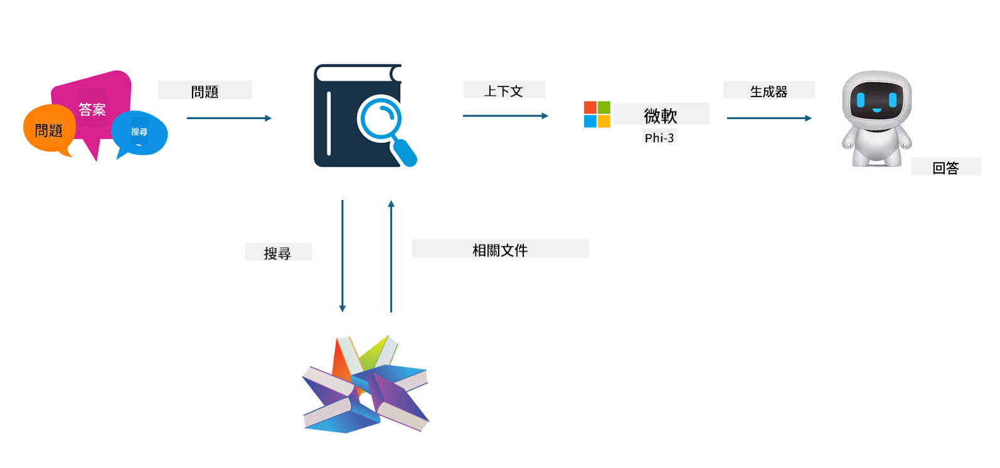

<!--
CO_OP_TRANSLATOR_METADATA:
{
  "original_hash": "743d7e9cb9c4e8ea642d77bee657a7fa",
  "translation_date": "2025-05-07T13:34:12+00:00",
  "source_file": "md/03.FineTuning/LetPhi3gotoIndustriy.md",
  "language_code": "mo"
}
-->
# **Phi-3 को उद्योग विशेषज्ञ बनाउनुहोस्**

Phi-3 मोडेललाई उद्योगमा लागू गर्न, तपाईंले उद्योग व्यवसाय डेटा Phi-3 मोडेलमा थप्न आवश्यक छ। हाम्रो दुई फरक विकल्पहरू छन्, पहिलो RAG (Retrieval Augmented Generation) हो र दोस्रो Fine Tuning हो।

## **RAG बनाम Fine-Tuning**

### **Retrieval Augmented Generation**

RAG भनेको डेटा पुनःप्राप्ति + पाठ उत्पादन हो। उद्यमको संरचित र असंरचित डेटा भेक्टर डेटाबेसमा भण्डारण गरिन्छ। सान्दर्भिक सामग्री खोज्दा, सान्दर्भिक सारांश र सामग्री पत्ता लगाइन्छ र सन्दर्भ बनाउनका लागि प्रयोग गरिन्छ, र LLM/SLM को पाठ पूर्ति क्षमता सँग जोडेर सामग्री उत्पादन गरिन्छ।

### **Fine-tuning**

Fine-tuning कुनै विशेष मोडेलको सुधारमा आधारित हुन्छ। यसले मोडेल एल्गोरिदमबाट सुरु गर्न आवश्यक पर्दैन, तर डेटा निरन्तर सङ्कलन गर्नुपर्छ। यदि तपाईंलाई उद्योग अनुप्रयोगहरूमा बढी सटीक पदावली र भाषा अभिव्यक्ति चाहिन्छ भने, fine-tuning तपाईंको राम्रो विकल्प हो। तर यदि तपाईंको डेटा बारम्बार परिवर्तन हुन्छ भने, fine-tuning जटिल हुन सक्छ।

### **कसरी छान्ने**

1. यदि हाम्रो उत्तर बाह्य डेटा परिचय गराउन आवश्यक छ भने, RAG उत्तम विकल्प हो।

2. यदि तपाईंलाई स्थिर र सटीक उद्योग ज्ञान आउटपुट गर्न आवश्यक छ भने, fine-tuning राम्रो विकल्प हुनेछ। RAG ले सान्दर्भिक सामग्री तान्न प्राथमिकता दिन्छ तर सधैं विशेषज्ञ सूक्ष्मता नबुझ्न सक्छ।

3. Fine-tuning उच्च गुणस्तरको डेटा सेट चाहिन्छ, र यदि डेटा सानो क्षेत्रमा मात्र सीमित छ भने, यसले धेरै फरक पार्दैन। RAG बढी लचिलो छ।

4. Fine-tuning एक कालो बक्स हो, एक रहस्य, र यसको आन्तरिक मेकानिजम बुझ्न गाह्रो हुन्छ। तर RAG ले डेटा स्रोत सजिलै पत्ता लगाउन मद्दत गर्दछ, जसले हल्युसिनेसन वा सामग्री त्रुटिहरूलाई प्रभावकारी रूपमा समायोजन गर्न र राम्रो पारदर्शिता प्रदान गर्न सकिन्छ।

### **परिदृश्यहरू**

1. ठूला उद्योगहरूमा विशेष पेशागत शब्दावली र अभिव्यक्तिहरू आवश्यक पर्दा, ***Fine-tuning*** उत्तम विकल्प हुन्छ।

2. QA प्रणाली, जसले विभिन्न ज्ञान बिन्दुहरूको संयोजन समावेश गर्दछ, ***RAG*** उत्तम विकल्प हुन्छ।

3. स्वचालित व्यवसाय प्रवाहको संयोजनमा ***RAG + Fine-tuning*** उत्तम विकल्प हो।

## **RAG कसरी प्रयोग गर्ने**

भेक्टर डेटाबेस भनेको गणितीय रूपमा डेटा भण्डारण गर्ने संग्रह हो। भेक्टर डेटाबेसले मेसिन लर्निङ मोडेलहरूलाई अघिल्लो इनपुटहरू सम्झन सजिलो बनाउँछ, जसले खोज, सिफारिस, र पाठ उत्पादन जस्ता प्रयोग केसहरूलाई समर्थन गर्न मेसिन लर्निङ प्रयोग गर्न सक्षम बनाउँछ। डेटा समानता मेट्रिक्सको आधारमा चिन्हित गर्न सकिन्छ, ठ्याक्कै मिल्दोजुल्दो नभए पनि, जसले कम्प्युटर मोडेलहरूलाई डेटा सन्दर्भ बुझ्न मद्दत गर्छ।

भेक्टर डेटाबेस RAG कार्यान्वयनको कुञ्जी हो। हामी text-embedding-3, jina-ai-embedding जस्ता भेक्टर मोडेलहरू मार्फत डेटा भेक्टर भण्डारणमा रूपान्तरण गर्न सक्छौं।

RAG अनुप्रयोग बनाउन थप जान्न [https://github.com/microsoft/Phi-3CookBook](https://github.com/microsoft/Phi-3CookBook?WT.mc_id=aiml-138114-kinfeylo) मा जानुहोस्।

## **Fine-tuning कसरी प्रयोग गर्ने**

Fine-tuning मा सामान्य रूपमा प्रयोग हुने एल्गोरिदमहरू Lora र QLora हुन्। कसरी छान्ने?
- [यस नमूना नोटबुकसँग थप जान्नुहोस्](../../../../code/04.Finetuning/Phi_3_Inference_Finetuning.ipynb)
- [Python FineTuning नमूना उदाहरण](../../../../code/04.Finetuning/FineTrainingScript.py)

### **Lora र QLora**

LoRA (Low-Rank Adaptation) र QLoRA (Quantized Low-Rank Adaptation) दुवै Parameter Efficient Fine Tuning (PEFT) प्रयोग गरेर ठूलो भाषा मोडेलहरू (LLMs) लाई fine-tune गर्ने प्रविधिहरू हुन्। PEFT प्रविधिहरू परम्परागत विधिहरू भन्दा मोडेलहरूलाई बढी प्रभावकारी रूपमा तालिम दिन डिजाइन गरिएको हो।  
LoRA एउटा स्वतन्त्र fine-tuning प्रविधि हो जसले वजन अपडेट म्याट्रिक्समा कम-रैंक अनुमान लागू गरेर मेमोरी खपत घटाउँछ। यसले छिटो तालिम समय दिन्छ र परम्परागत fine-tuning विधिहरूको नजिकको प्रदर्शन कायम राख्छ।

QLoRA LoRA को विस्तारित संस्करण हो जसले क्वान्टाइजेसन प्रविधिहरू समावेश गरेर मेमोरी उपयोग अझ कम गर्दछ। QLoRA ले प्रि-ट्रेंड LLM का वजन प्यारामिटरहरूको सटीकता 4-बिटमा क्वान्टाइज गर्दछ, जुन LoRA भन्दा बढी मेमोरी कुशल छ। तर QLoRA तालिम LoRA भन्दा करिब ३०% ढिलो हुन्छ किनभने यसमा अतिरिक्त क्वान्टाइजेसन र डिक्वान्टाइजेसन चरणहरू हुन्छन्।

QLoRA ले LoRA लाई सहायकको रूपमा प्रयोग गर्छ जसले क्वान्टाइजेसनमा आएका त्रुटिहरूलाई सुधार्छ। QLoRA ले साना, सजिलै उपलब्ध GPUs मा अरबौं प्यारामिटर भएका विशाल मोडेलहरू fine-tune गर्न सक्षम बनाउँछ। उदाहरणका लागि, QLoRA ले ७०B प्यारामिटर मोडेललाई ३६ GPUs को आवश्यकता पर्ने ठाउँमा मात्र २ GPUs मा fine-tune गर्न सक्छ।

**Disclaimer**:  
This document has been translated using AI translation service [Co-op Translator](https://github.com/Azure/co-op-translator). While we strive for accuracy, please be aware that automated translations may contain errors or inaccuracies. The original document in its native language should be considered the authoritative source. For critical information, professional human translation is recommended. We are not liable for any misunderstandings or misinterpretations arising from the use of this translation.

---

Could you please clarify what language or dialect "mo" refers to? This will help me provide an accurate translation.