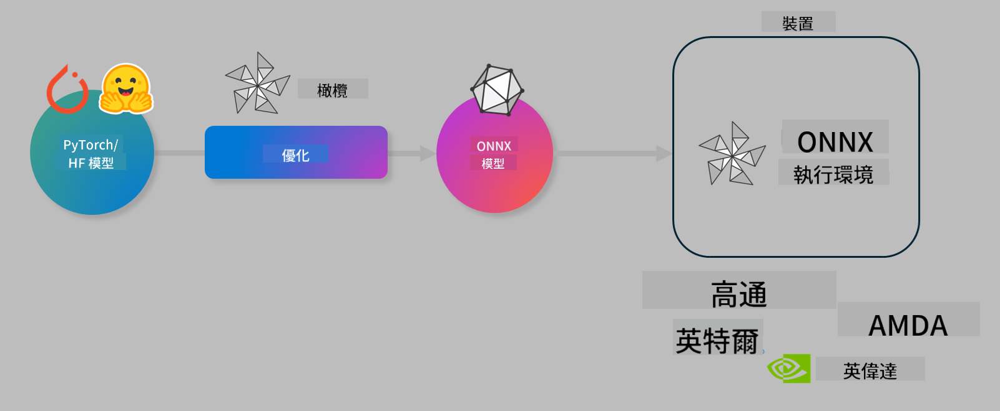

<!--
CO_OP_TRANSLATOR_METADATA:
{
  "original_hash": "76956c0c22e5686908a6d85ec72126af",
  "translation_date": "2025-04-04T13:36:49+00:00",
  "source_file": "md\\03.FineTuning\\olive-lab\\readme.md",
  "language_code": "mo"
}
-->
# Lab. Optimize AI models for on-device inference

## Introduction 

> [!IMPORTANT]
> This lab requires an **Nvidia A10 or A100 GPU** with associated drivers and CUDA toolkit (version 12+) installed.

> [!NOTE]
> This is a **35-minute** lab that provides a hands-on introduction to optimizing models for on-device inference using OLIVE.

## Learning Objectives

By the end of this lab, you will be able to use OLIVE to:

- Quantize an AI model using the AWQ quantization method.
- Fine-tune an AI model for a specific task.
- Generate LoRA adapters (fine-tuned models) for efficient on-device inference on the ONNX Runtime.

### What is Olive

Olive (*O*NNX *live*) is a model optimization toolkit with a CLI that allows you to deploy models for the ONNX runtime +++https://onnxruntime.ai+++ with improved quality and performance.



The input to Olive is typically a PyTorch or Hugging Face model, and the output is an optimized ONNX model designed for deployment on a device running the ONNX runtime. Olive optimizes the model for the target device's AI accelerator (NPU, GPU, CPU) provided by hardware vendors such as Qualcomm, AMD, Nvidia, or Intel.

Olive performs a *workflow*, which is a sequence of model optimization tasks called *passes*. Examples of passes include model compression, graph capture, quantization, and graph optimization. Each pass has parameters that can be adjusted to achieve optimal metrics like accuracy and latency, which are evaluated by the corresponding evaluator. Olive uses a search strategy with algorithms to auto-tune individual passes or groups of passes.

#### Benefits of Olive

- **Save time and reduce frustration** by avoiding trial-and-error experimentation with graph optimization, compression, and quantization techniques. Set your performance and quality requirements, and Olive will automatically identify the best model.
- **40+ built-in optimization components** that leverage state-of-the-art techniques in quantization, compression, graph optimization, and fine-tuning.
- **User-friendly CLI** for common optimization tasks, such as olive quantize, olive auto-opt, and olive finetune.
- Built-in model packaging and deployment features.
- Supports creating models for **Multi LoRA serving**.
- Enables workflow construction using YAML/JSON to manage optimization and deployment tasks.
- Integration with **Hugging Face** and **Azure AI**.
- Built-in **caching** to **reduce costs**.

## Lab Instructions
> [!NOTE]
> Ensure you have provisioned your Azure AI Hub and Project and set up your A100 compute as instructed in Lab 1.

### Step 0: Connect to your Azure AI Compute

Connect to the Azure AI compute using the remote feature in **VS Code.** 

1. Open your **VS Code** desktop application:
1. Open the **command palette** using **Shift+Ctrl+P**.
1. In the command palette, search for **AzureML - remote: Connect to compute instance in New Window**.
1. Follow the on-screen instructions to connect to the compute. You'll need to select your Azure Subscription, Resource Group, Project, and Compute name set up in Lab 1.
1. Once connected to your Azure ML Compute node, this will be displayed in the **bottom left of Visual Code** `><Azure ML: Compute Name`.

### Step 1: Clone this repo

In VS Code, open a new terminal using **Ctrl+J** and clone this repo:

In the terminal, you should see the prompt:

```
azureuser@computername:~/cloudfiles/code$ 
```
Clone the solution:

```bash
cd ~/localfiles
git clone https://github.com/microsoft/phi-3cookbook.git
```

### Step 2: Open Folder in VS Code

To open VS Code in the relevant folder, execute the following command in the terminal, which will open a new window:

```bash
code phi-3cookbook/code/04.Finetuning/Olive-lab
```

Alternatively, you can open the folder by selecting **File** > **Open Folder**.

### Step 3: Dependencies

Open a terminal window in VS Code in your Azure AI Compute Instance (tip: **Ctrl+J**) and run the following commands to install the dependencies:

```bash
conda create -n olive-ai python=3.11 -y
conda activate olive-ai
pip install -r requirements.txt
az extension remove -n azure-cli-ml
az extension add -n ml
```

> [!NOTE]
> Installing all dependencies will take approximately 5 minutes.

In this lab, you'll download and upload models to the Azure AI Model catalog. To access the model catalog, log in to Azure using:

```bash
az login
```

> [!NOTE]
> During login, you'll be prompted to select your subscription. Make sure you choose the subscription assigned for this lab.

### Step 4: Execute Olive commands 

Open a terminal window in VS Code in your Azure AI Compute Instance (tip: **Ctrl+J**) and ensure the `olive-ai` conda environment is activated:

```bash
conda activate olive-ai
```

Next, run the following Olive commands in the terminal.

1. **Inspect the data:** In this example, you'll fine-tune the Phi-3.5-Mini model to specialize in answering travel-related questions. The code below displays the first few records of the dataset, which are in JSON lines format:
   
    ```bash
    head data/data_sample_travel.jsonl
    ```
1. **Quantize the model:** Before training the model, quantize it using the following command that applies Active Aware Quantization (AWQ) +++https://arxiv.org/abs/2306.00978+++. AWQ quantizes model weights based on activations produced during inference, preserving accuracy better than traditional weight quantization methods.
    
    ```bash
    olive quantize \
       --model_name_or_path microsoft/Phi-3.5-mini-instruct \
       --trust_remote_code \
       --algorithm awq \
       --output_path models/phi/awq \
       --log_level 1
    ```
    
    Quantization takes approximately 8 minutes and reduces the model size from ~7.5GB to ~2.5GB.
   
   In this lab, you'll use models from Hugging Face (e.g., `microsoft/Phi-3.5-mini-instruct`). However, Olive also allows you to input models from the Azure AI catalog by updating the `model_name_or_path` argument to an Azure AI asset ID (for example:  `azureml://registries/azureml/models/Phi-3.5-mini-instruct/versions/4`). 

1. **Train the model:** Next, the `olive finetune` command fine-tunes the quantized model. Quantizing the model *before* fine-tuning improves accuracy, as fine-tuning recovers some of the loss from quantization.
    
    ```bash
    olive finetune \
        --method lora \
        --model_name_or_path models/phi/awq \
        --data_files "data/data_sample_travel.jsonl" \
        --data_name "json" \
        --text_template "<|user|>\n{prompt}<|end|>\n<|assistant|>\n{response}<|end|>" \
        --max_steps 100 \
        --output_path ./models/phi/ft \
        --log_level 1
    ```
    
    Fine-tuning takes approximately 6 minutes (with 100 steps).

1. **Optimize:** After training, optimize the model using Olive's `auto-opt` command, which will capture the ONNX graph and automatically perform a number of optimizations to improve the model performance for CPU by compressing the model and doing fusions. It should be noted, that you can also optimize for other devices such as NPU or GPU by just updating the `--device` and `--provider` arguments. For this lab, we'll use CPU.

    ```bash
    olive auto-opt \
       --model_name_or_path models/phi/ft/model \
       --adapter_path models/phi/ft/adapter \
       --device cpu \
       --provider CPUExecutionProvider \
       --use_ort_genai \
       --output_path models/phi/onnx-ao \
       --log_level 1
    ```
    
    Optimization takes approximately 5 minutes.

### Step 5: Model inference quick test

To test the model's inference capabilities, create a Python file named **app.py** in your folder and copy-paste the following code:

```python
import onnxruntime_genai as og
import numpy as np

print("loading model and adapters...", end="", flush=True)
model = og.Model("models/phi/onnx-ao/model")
adapters = og.Adapters(model)
adapters.load("models/phi/onnx-ao/model/adapter_weights.onnx_adapter", "travel")
print("DONE!")

tokenizer = og.Tokenizer(model)
tokenizer_stream = tokenizer.create_stream()

params = og.GeneratorParams(model)
params.set_search_options(max_length=100, past_present_share_buffer=False)
user_input = "what is the best thing to see in chicago"
params.input_ids = tokenizer.encode(f"<|user|>\n{user_input}<|end|>\n<|assistant|>\n")

generator = og.Generator(model, params)

generator.set_active_adapter(adapters, "travel")

print(f"{user_input}")

while not generator.is_done():
    generator.compute_logits()
    generator.generate_next_token()

    new_token = generator.get_next_tokens()[0]
    print(tokenizer_stream.decode(new_token), end='', flush=True)

print("\n")
```

Run the code using:

```bash
python app.py
```

### Step 6: Upload model to Azure AI

Uploading the model to an Azure AI model repository allows sharing with your development team and provides version control. To upload the model, run the following command:

> [!NOTE]
> Update the `{}` placeholders with the name of your resource group and Azure AI Project Name. 

To find your resource group `"resourceGroup"and Azure AI Project name, run the following command 

```
az ml workspace show
```

Alternatively, visit +++ai.azure.com+++ and select **management center**, **project**, **overview**.

Update the `{}` placeholders with your resource group and Azure AI Project Name.

```bash
az ml model create \
    --name ft-for-travel \
    --version 1 \
    --path ./models/phi/onnx-ao \
    --resource-group {RESOURCE_GROUP_NAME} \
    --workspace-name {PROJECT_NAME}
```
You can view your uploaded model and deploy it at https://ml.azure.com/model/list.

It seems you want the text translated into "mo." Could you clarify what "mo" refers to? Are you referring to a specific language or format?