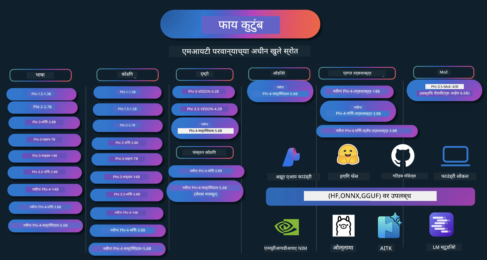

# Phi पाककृती पुस्तिका: Microsoft च्या Phi मॉडेल्ससह हाताळणीचे उदाहरणे

[](https://codespaces.new/microsoft/phicookbook)
[](https://vscode.dev/redirect?url=vscode://ms-vscode-remote.remote-containers/cloneInVolume?url=https://github.com/microsoft/phicookbook)

[](https://GitHub.com/microsoft/phicookbook/graphs/contributors/?WT.mc_id=aiml-137032-kinfeylo)
[](https://GitHub.com/microsoft/phicookbook/issues/?WT.mc_id=aiml-137032-kinfeylo)
[](https://GitHub.com/microsoft/phicookbook/pulls/?WT.mc_id=aiml-137032-kinfeylo)
[](http://makeapullrequest.com?WT.mc_id=aiml-137032-kinfeylo)

[](https://GitHub.com/microsoft/phicookbook/watchers/?WT.mc_id=aiml-137032-kinfeylo)
[](https://GitHub.com/microsoft/phicookbook/network/?WT.mc_id=aiml-137032-kinfeylo)
[](https://GitHub.com/microsoft/phicookbook/stargazers/?WT.mc_id=aiml-137032-kinfeylo)

[](https://discord.com/invite/ByRwuEEgH4)

Phi हे Microsoft कडून विकसित केलेल्या खुल्या स्त्रोत AI मॉडेलची एक मालिका आहे.

Phi सध्या सर्वात सामर्थ्यवान आणि खर्च-कम आहेत अशा लहान भाषा मॉडेल्सपैकी एक आहे, ज्याचे बहुभाषिक, तर्कशास्त्र, मजकूर/चॅट निर्मिती, कोडींग, प्रतिमा, ऑडिओ आणि इतर परिस्थितींमध्ये अत्यंत चांगले बेंचमार्क्स आहेत.

तुम्ही Phi ला क्लाउडवर किंवा एज डिव्हाइसवर तैनात करू शकता, आणि तुम्ही सहजपणे मर्यादित संगणकीय शक्तीसह जनरेटिव्ह AI अनुप्रयोग तयार करू शकता.

हे स्रोत वापरण्यास प्रारंभ करण्यासाठी खालील चरणांचे अनुसरण करा:
1. **रिपॉझिटरी फोर्क करा**: क्लिक करा [](https://GitHub.com/microsoft/phicookbook/network/?WT.mc_id=aiml-137032-kinfeylo)
2. **रिपॉझिटरी क्लोन करा**: `git clone https://github.com/microsoft/PhiCookBook.git`
3. [**Microsoft AI Discord समुदायामध्ये सहभागी व्हा आणि तज्ञ व सहकार्य विकासकांशी भेटा**](https://discord.com/invite/ByRwuEEgH4?WT.mc_id=aiml-137032-kinfeylo)



### 🌐 बहुभाषिक समर्थन

#### GitHub Action द्वारा समर्थित (स्वयंचलित आणि नेहमी अद्ययावत)

<!-- CO-OP TRANSLATOR LANGUAGES TABLE START -->
[अरबी](../ar/README.md) | [बंगाली](../bn/README.md) | [बल्गेरियन](../bg/README.md) | [बर्मिज (म्यानमार)](../my/README.md) | [चिनी (सोपे केलेले)](../zh-CN/README.md) | [चिनी (परंपरागत, हाँगकाँग)](../zh-HK/README.md) | [चिनी (परंपरागत, मकाओ)](../zh-MO/README.md) | [चिनी (परंपरागत, तैवान)](../zh-TW/README.md) | [क्रोएशियन](../hr/README.md) | [चेक](../cs/README.md) | [डॅनिश](../da/README.md) | [डच](../nl/README.md) | [एस्टोनियन](../et/README.md) | [फिन्निश](../fi/README.md) | [फ्रेंच](../fr/README.md) | [जर्मन](../de/README.md) | [ग्रीक](../el/README.md) | [हिब्रू](../he/README.md) | [हिंदी](../hi/README.md) | [हंगेरियन](../hu/README.md) | [इंडोनेशियन](../id/README.md) | [इटालियन](../it/README.md) | [जपानी](../ja/README.md) | [कन्नड](../kn/README.md) | [कोरियन](../ko/README.md) | [लिथुआनियन](../lt/README.md) | [मलय](../ms/README.md) | [मलयाळम](../ml/README.md) | [मराठी](./README.md) | [नेपाळी](../ne/README.md) | [नाइजीरियन पिजिन](../pcm/README.md) | [नॉर्वेजियन](../no/README.md) | [फारसी (पर्शियन)](../fa/README.md) | [पोलिश](../pl/README.md) | [पोर्तुगालियन (ब्राझील)](../pt-BR/README.md) | [पोर्तुगालियन (पोर्तुगाल)](../pt-PT/README.md) | [पंजाबी (गुरमुखी)](../pa/README.md) | [रोमानियन](../ro/README.md) | [रशियन](../ru/README.md) | [सर्बियन (सिरिलिक)](../sr/README.md) | [स्लोव्हाक](../sk/README.md) | [स्लोव्हेनियन](../sl/README.md) | [स्पॅनिश](../es/README.md) | [स्वाहिली](../sw/README.md) | [स्वीडिश](../sv/README.md) | [टॅगलॉग (फिलीपिनो)](../tl/README.md) | [तमिळ](../ta/README.md) | [तेलुगू](../te/README.md) | [थाई](../th/README.md) | [टर्किश](../tr/README.md) | [युक्रेनीयन](../uk/README.md) | [उर्दू](../ur/README.md) | [व्हियतनामी](../vi/README.md)

> **स्थानिकरीत्या क्लोन करणे प्राधान्य देता?**

> या रिपॉझिटरीमध्ये ५०+ भाषा अनुवाद आहेत ज्यामुळे डाउनलोडचा आकार मोठा होतो. अनुवादांशिवाय क्लोन करण्यासाठी sparse checkout वापरा:
> ```bash
> git clone --filter=blob:none --sparse https://github.com/microsoft/PhiCookBook.git
> cd PhiCookBook
> git sparse-checkout set --no-cone '/*' '!translations' '!translated_images'
> ```
> यामुळे तुम्हाला कोर्स पूर्ण करण्यासाठी आवश्यक असलेले सर्वकाही सहज आणि जलद डाउनलोड करता येते.
<!-- CO-OP TRANSLATOR LANGUAGES TABLE END -->

## अनुक्रमणिका

- परिचय
  - [Phi कुटुंबात तुमचे स्वागत आहे](./md/01.Introduction/01/01.PhiFamily.md)
  - [तुमचे पर्यावरण सेट करा](./md/01.Introduction/01/01.EnvironmentSetup.md)
  - [महत्‍वाच्या तंत्रज्ञानांची समज](./md/01.Introduction/01/01.Understandingtech.md)
  - [Phi मॉडेल्ससाठी AI सुरक्षा](./md/01.Introduction/01/01.AISafety.md)
  - [Phi हार्डवेअर समर्थन](./md/01.Introduction/01/01.Hardwaresupport.md)
  - [Phi मॉडेल्स व प्लॅटफॉर्मवर उपलब्धता](./md/01.Introduction/01/01.Edgeandcloud.md)
  - [Guidance-ai व Phi वापरणे](./md/01.Introduction/01/01.Guidance.md)
  - [GitHub मार्केटप्लेस मॉडेल्स](https://github.com/marketplace/models)
  - [Azure AI मॉडेल सूची](https://ai.azure.com)

- विविध वातावरणात Phi चे इन्फरन्स
    -  [Hugging face](./md/01.Introduction/02/01.HF.md)
    -  [GitHub मॉडेल्स](./md/01.Introduction/02/02.GitHubModel.md)
    -  [Azure AI Foundry मॉडेल सूची](./md/01.Introduction/02/03.AzureAIFoundry.md)
    -  [Ollama](./md/01.Introduction/02/04.Ollama.md)
    -  [AI Toolkit VSCode (AITK)](./md/01.Introduction/02/05.AITK.md)
    -  [NVIDIA NIM](./md/01.Introduction/02/06.NVIDIA.md)
    -  [Foundry Local](./md/01.Introduction/02/07.FoundryLocal.md)

- Phi कुटुंबाचा इन्फरन्स
    - [iOS मध्ये Phi इन्फरन्स](./md/01.Introduction/03/iOS_Inference.md)
    - [Android मध्ये Phi इन्फरन्स](./md/01.Introduction/03/Android_Inference.md)
    - [Jetson मध्ये Phi इन्फरन्स](./md/01.Introduction/03/Jetson_Inference.md)
    - [AI PC मध्ये Phi इन्फरन्स](./md/01.Introduction/03/AIPC_Inference.md)
    - [Apple MLX फ्रेमवर्कसह Phi इन्फरन्स](./md/01.Introduction/03/MLX_Inference.md)
    - [स्थानिक सर्व्हरमध्ये Phi इन्फरन्स](./md/01.Introduction/03/Local_Server_Inference.md)
    - [AI Toolkit वापरून रिमोट सर्व्हरमध्ये Phi इन्फरन्स](./md/01.Introduction/03/Remote_Interence.md)
    - [Rust सह Phi इन्फरन्स](./md/01.Introduction/03/Rust_Inference.md)
    - [स्थानिक मध्ये Phi--Vision चे इन्फरन्स](./md/01.Introduction/03/Vision_Inference.md)
    - [Kaito AKS, Azure कंटेनर्स (अधिकृत समर्थन) सह Phi इन्फरन्स](./md/01.Introduction/03/Kaito_Inference.md)
-  [Phi कुटुंबाचे क्वांटिफायिंग](./md/01.Introduction/04/QuantifyingPhi.md)
    - [llama.cpp वापरून Phi-3.5 / 4 चे क्वांटायझिंग](./md/01.Introduction/04/UsingLlamacppQuantifyingPhi.md)
    - [onnxruntime साठी Generative AI विस्तार वापरून Phi-3.5 / 4 चे क्वांटायझिंग](./md/01.Introduction/04/UsingORTGenAIQuantifyingPhi.md)
    - [Intel OpenVINO वापरून Phi-3.5 / 4 चे क्वांटायझिंग](./md/01.Introduction/04/UsingIntelOpenVINOQuantifyingPhi.md)
    - [Apple MLX फ्रेमवर्क वापरून Phi-3.5 / 4 चे क्वांटायझिंग](./md/01.Introduction/04/UsingAppleMLXQuantifyingPhi.md)

-  Phi चे मूल्यांकन
    - [जबाबदार AI](./md/01.Introduction/05/ResponsibleAI.md)
    - [मूल्यांकनासाठी Azure AI Foundry](./md/01.Introduction/05/AIFoundry.md)
    - [मूल्यांकनासाठी Promptflow वापरणे](./md/01.Introduction/05/Promptflow.md)
 
- Azure AI शोधासह RAG
    - [Azure AI शोधासह Phi-4-mini आणि Phi-4-multimodal(RAG)चा कसा वापर करायचा](https://github.com/microsoft/PhiCookBook/blob/main/code/06.E2E/E2E_Phi-4-RAG-Azure-AI-Search.ipynb)

- Phi अनुप्रयोग विकास नमुने
  - मजकूर व चॅट अनुप्रयोग
    - Phi-4 नमुने 🆕
      - [📓] [Phi-4-mini ONNX मॉडेलसह चॅट करा](./md/02.Application/01.TextAndChat/Phi4/ChatWithPhi4ONNX/README.md)
      - [स्थानिक ONNX मॉडेल .NET सह Phi-4 चॅट करा](../../md/04.HOL/dotnet/src/LabsPhi4-Chat-01OnnxRuntime)
      - [Semantic Kernel वापरून Phi-4 ONNX सह .NET कन्सोल अॅपमध्ये चॅट](../../md/04.HOL/dotnet/src/LabsPhi4-Chat-02SK)
    - Phi-3 / 3.5 नमुने
      - [Phi3, ONNX Runtime Web आणि WebGPU वापरून ब्राउझरमध्ये स्थानिक चॅटबॉट](https://github.com/microsoft/onnxruntime-inference-examples/tree/main/js/chat)
      - [OpenVino चॅट](./md/02.Application/01.TextAndChat/Phi3/E2E_OpenVino_Chat.md)
      - [मल्टी मॉडल - इंटरॅक्टिव Phi-3-mini आणि OpenAI Whisper](./md/02.Application/01.TextAndChat/Phi3/E2E_Phi-3-mini_with_whisper.md)
      - [MLFlow - कवच तयार करणे आणि MLFlow सह Phi-3 वापरणे](./md//02.Application/01.TextAndChat/Phi3/E2E_Phi-3-MLflow.md)
      - [मॉडेल ऑप्टिमायझेशन - ONNX रनटाइम वेबसाठी Phi-3-min मॉडेल कसे ऑप्टिमाइझ करावे Olive सह](https://github.com/microsoft/Olive/tree/main/examples/phi3)
      - [Phi-3 mini-4k-instruct-onnx सह WinUI3 अॅप](https://github.com/microsoft/Phi3-Chat-WinUI3-Sample/)
      -[WinUI3 मल्टी मॉडल AI पॉवर्ड नोट्स अॅप नमुना](https://github.com/microsoft/ai-powered-notes-winui3-sample)
      - [कस्टम Phi-3 मॉडेल्सना परिष्कृत करा आणि Prompt flow सह एकत्र करा](./md/02.Application/01.TextAndChat/Phi3/E2E_Phi-3-FineTuning_PromptFlow_Integration.md)
      - [Azure AI Foundry मध्ये Prompt flow सह कस्टम Phi-3 मॉडेल्स परिष्कृत करा आणि एकत्र करा](./md/02.Application/01.TextAndChat/Phi3/E2E_Phi-3-FineTuning_PromptFlow_Integration_AIFoundry.md)
      - [Azure AI Foundry मध्ये Microsoft's Responsible AI Principles वर लक्ष केंद्रीत करत परिष्कृत Phi-3 / Phi-3.5 मॉडेलचे मूल्यांकन करा](./md/02.Application/01.TextAndChat/Phi3/E2E_Phi-3-Evaluation_AIFoundry.md)
      - [📓] [Phi-3.5-mini-instruct भाषा भाकित नमुना (चिनी/इंग्रजी)](./md/02.Application/01.TextAndChat/Phi3/phi3-instruct-demo.ipynb)
      - [Phi-3.5-Instruct WebGPU RAG चैटबॉट](./md/02.Application/01.TextAndChat/Phi3/WebGPUWithPhi35Readme.md)
      - [Windows GPU वापरून Phi-3.5-Instruct ONNX सह Prompt flow सोल्यूशन तयार करणे](./md/02.Application/01.TextAndChat/Phi3/UsingPromptFlowWithONNX.md)
      - [Microsoft Phi-3.5 tflite वापरून Android अॅप तयार करणे](./md/02.Application/01.TextAndChat/Phi3/UsingPhi35TFLiteCreateAndroidApp.md)
      - [स्थानिक ONNX Phi-3 मॉडेल वापरून Q&A .NET उदाहरण Microsoft.ML.OnnxRuntime सह](../../md/04.HOL/dotnet/src/LabsPhi301)
      - [Semantic Kernel आणि Phi-3 सह कन्सोल चॅट .NET अॅप](../../md/04.HOL/dotnet/src/LabsPhi302)

  - Azure AI Inference SDK कोड आधारित नमुने 
    - Phi-4 नमुने 🆕
      - [📓] [Phi-4-multimodal वापरून प्रोजेक्ट कोड तयार करा](./md/02.Application/02.Code/Phi4/GenProjectCode/README.md)
    - Phi-3 / 3.5 नमुने
      - [Microsoft Phi-3 कुटुंबासह आपला स्वतःचा Visual Studio Code GitHub Copilot Chat तयार करा](./md/02.Application/02.Code/Phi3/VSCodeExt/README.md)
      - [GitHub मॉडेल्ससह Phi-3.5 द्वारे Visual Studio Code Chat Copilot एजंट तयार करा](/md/02.Application/02.Code/Phi3/CreateVSCodeChatAgentWithGitHubModels.md)

  - प्रगत तर्क नमुने
    - Phi-4 नमुने 🆕
      - [📓] [Phi-4-mini-reasoning किंवा Phi-4-reasoning नमुने](./md/02.Application/03.AdvancedReasoning/Phi4/AdvancedResoningPhi4mini/README.md)
      - [📓] [Microsoft Olive सह Phi-4-mini-reasoning फाइन-ट्युनिंग](./md/02.Application/03.AdvancedReasoning/Phi4/AdvancedResoningPhi4mini/olive_ft_phi_4_reasoning_with_medicaldata.ipynb)
      - [📓] [Apple MLX सह Phi-4-mini-reasoning फाइन-ट्युनिंग](./md/02.Application/03.AdvancedReasoning/Phi4/AdvancedResoningPhi4mini/mlx_ft_phi_4_reasoning_with_medicaldata.ipynb)
      - [📓] [GitHub मॉडेल्ससह Phi-4-mini-reasoning](./md/02.Application/02.Code/Phi4r/github_models_inference.ipynb)
      - [📓] [Azure AI Foundry मॉडेल्ससह Phi-4-mini-reasoning](./md/02.Application/02.Code/Phi4r/azure_models_inference.ipynb)
  - डेमो
      - [Phi-4-mini डेमोस Hugging Face Spaces वर होस्ट केलेले](https://huggingface.co/spaces/microsoft/phi-4-mini?WT.mc_id=aiml-137032-kinfeylo)
      - [Phi-4-multimodal डेमोस Hugginge Face Spaces वर होस्ट केलेले](https://huggingface.co/spaces/microsoft/phi-4-multimodal?WT.mc_id=aiml-137032-kinfeylo)
  - व्हिजन नमुने
    - Phi-4 नमुने 🆕
      - [📓] [Phi-4-multimodal वापरून प्रतिमा वाचा आणि कोड तयार करा](./md/02.Application/04.Vision/Phi4/CreateFrontend/README.md) 
    - Phi-3 / 3.5 नमुने
      -  [📓][Phi-3-vision-प्रतिमा मजकूर ते मजकूर](./md/02.Application/04.Vision/Phi3/E2E_Phi-3-vision-image-text-to-text-online-endpoint.ipynb)
      - [Phi-3-vision-ONNX](https://onnxruntime.ai/docs/genai/tutorials/phi3-v.html)
      - [📓][Phi-3-vision CLIP एम्बेडिंग](./md/02.Application/04.Vision/Phi3/E2E_Phi-3-vision-image-text-to-text-online-endpoint.ipynb)
      - [डेमो: Phi-3 रीसायकलिंग](https://github.com/jennifermarsman/PhiRecycling/)
      - [Phi-3-vision - व्हिज्युअल भाषा सहाय्यक - Phi3-Vision आणि OpenVINO सह](https://docs.openvino.ai/nightly/notebooks/phi-3-vision-with-output.html)
      - [Phi-3 Vision Nvidia NIM](./md/02.Application/04.Vision/Phi3/E2E_Nvidia_NIM_Vision.md)
      - [Phi-3 Vision OpenVino](./md/02.Application/04.Vision/Phi3/E2E_OpenVino_Phi3Vision.md)
      - [📓][Phi-3.5 Vision मल्टी-फ्रेम किंवा मल्टी-इमेज नमुना](./md/02.Application/04.Vision/Phi3/phi3-vision-demo.ipynb)
      - [Microsoft.ML.OnnxRuntime .NET वापरून Phi-3 Vision स्थानिक ONNX मॉडेल](../../md/04.HOL/dotnet/src/LabsPhi303)
      - [मेनू आधारित Phi-3 Vision स्थानिक ONNX मॉडेल Microsoft.ML.OnnxRuntime .NET वापरून](../../md/04.HOL/dotnet/src/LabsPhi304)

  - गणित नमुने
    -  Phi-4-Mini-Flash-Reasoning-Instruct नमुने 🆕 [Phi-4-Mini-Flash-Reasoning-Instruct सहित गणित डेमो](./md/02.Application/09.Math/MathDemo.ipynb)

  - ऑडिओ नमुने
    - Phi-4 नमुने 🆕
      - [📓] [Phi-4-multimodal वापरून ऑडिओ ट्रान्सक्रिप्ट्स काढणे](./md/02.Application/05.Audio/Phi4/Transciption/README.md)
      - [📓] [Phi-4-multimodal ऑडिओ नमुना](./md/02.Application/05.Audio/Phi4/Siri/demo.ipynb)
      - [📓] [Phi-4-multimodal भाषण अनुवाद नमुना](./md/02.Application/05.Audio/Phi4/Translate/demo.ipynb)
      - [.NET कन्सोल अॅप्लिकेशन Phi-4-multimodal ऑडिओ वापरून ऑडिओ फाइलचे विश्लेषण आणि ट्रान्सक्रिप्ट तयार करणे](../../md/04.HOL/dotnet/src/LabsPhi4-MultiModal-02Audio)

  - MOE नमुने
    - Phi-3 / 3.5 नमुने
      - [📓] [Phi-3.5 मिक्सचर ऑफ एक्सपर्ट्स मॉडेल्स (MoEs) सोशल मिडिया नमुना](./md/02.Application/06.MoE/Phi3/phi3_moe_demo.ipynb)
      - [📓] [NVIDIA NIM Phi-3 MOE, Azure AI Search, आणि LlamaIndex सह Retrieval-Augmented Generation (RAG) पाईपलाइन तयार करणे](./md/02.Application/06.MoE/Phi3/azure-ai-search-nvidia-rag.ipynb)
      - 
  - फंक्शन कॉलिंग नमुने
    - Phi-4 नमुने 🆕
      -  [📓] [Phi-4-mini सह फंक्शन कॉलिंग वापरणे](./md/02.Application/07.FunctionCalling/Phi4/FunctionCallingBasic/README.md)
      -  [📓] [Phi-4-mini सह मल्टी-एजंट्स तयार करण्यासाठी फंक्शन कॉलिंग वापरणे](./md/02.Application/07.FunctionCalling/Phi4/Multiagents/Phi_4_mini_multiagent.ipynb)
      -  [📓] [Ollama सह फंक्शन कॉलिंग वापरणे](./md/02.Application/07.FunctionCalling/Phi4/Ollama/ollama_functioncalling.ipynb)
      -  [📓] [ONNX सह फंक्शन कॉलिंग वापरणे](./md/02.Application/07.FunctionCalling/Phi4/ONNX/onnx_parallel_functioncalling.ipynb)
  - मल्टीमॉडाल मिक्सिंग नमुने
    - Phi-4 नमुने 🆕
      -  [📓] [Phi-4-multimodal वापरून तंत्रज्ञान पत्रकार म्हणून वापरणे](./md/02.Application/08.Multimodel/Phi4/TechJournalist/phi_4_mm_audio_text_publish_news.ipynb)
      - [.NET कन्सोल अॅप्लिकेशन Phi-4-multimodal वापरून प्रतिमा विश्लेषणासाठी](../../md/04.HOL/dotnet/src/LabsPhi4-MultiModal-01Images)

- Phi फाइन-ट्युनिंग नमुने
  - [फाइन-ट्युनिंग परिस्थिती](./md/03.FineTuning/FineTuning_Scenarios.md)
  - [फाइन-ट्युनिंग विरुद्ध RAG](./md/03.FineTuning/FineTuning_vs_RAG.md)
  - [Phi-3 ला उद्योग तज्ज्ञ बनवण्यासाठी फाइन-ट्युनिंग करा](./md/03.FineTuning/LetPhi3gotoIndustriy.md)
  - [VS Code साठी AI Toolkit सह Phi-3 फाइन-ट्युनिंग](./md/03.FineTuning/Finetuning_VSCodeaitoolkit.md)
  - [Azure Machine Learning Service सह Phi-3 फाइन-ट्युनिंग](./md/03.FineTuning/Introduce_AzureML.md)
  - [Lora सह Phi-3 फाइन-ट्युनिंग](./md/03.FineTuning/FineTuning_Lora.md)
  - [QLora सह Phi-3 फाइन-ट्युनिंग](./md/03.FineTuning/FineTuning_Qlora.md)
  - [Azure AI Foundry सह Phi-3 फाइन-ट्युनिंग](./md/03.FineTuning/FineTuning_AIFoundry.md)
  - [Azure ML CLI/SDK सह Phi-3 फाइन-ट्युनिंग](./md/03.FineTuning/FineTuning_MLSDK.md)
  - [Microsoft Olive सह फाइन-ट्युनिंग](./md/03.FineTuning/FineTuning_MicrosoftOlive.md)
  - [Microsoft Olive Hands-On Lab सह फाइन-ट्युनिंग](./md/03.FineTuning/olive-lab/readme.md)
  - [Weights and Bias सह Phi-3-vision फाइन-ट्युनिंग](./md/03.FineTuning/FineTuning_Phi-3-visionWandB.md)
  - [Apple MLX Framework सह Phi-3 फाइन-ट्युनिंग](./md/03.FineTuning/FineTuning_MLX.md)
  - [Phi-3-vision (अधिकृत समर्थन) फाइन-ट्युनिंग](./md/03.FineTuning/FineTuning_Vision.md)
  - [Kaito AKS, Azure Containers (अधिकृत समर्थन) सह Phi-3 फाइन-ट्युनिंग](./md/03.FineTuning/FineTuning_Kaito.md)
  - [Phi-3 आणि 3.5 Vision फाइन-ट्युनिंग](https://github.com/2U1/Phi3-Vision-Finetune)

- हैंड्स ऑन लॅब
  - [आधुनिक मॉडेल्सची अन्वेषणे: LLMs, SLMs, स्थानिक विकास इत्यादी](https://github.com/microsoft/aitour-exploring-cutting-edge-models)
  - [NLP क्षमता अनलॉक करणे: Microsoft Olive सह फाइन-ट्युनिंग](https://github.com/azure/Ignite_FineTuning_workshop)

- शैक्षणिक संशोधन पेपर्स आणि प्रकाशने
  - [Textbooks Are All You Need II: phi-1.5 तांत्रिक अहवाल](https://arxiv.org/abs/2309.05463)
  - [Phi-3 तांत्रिक अहवाल: आपल्या फोनवर स्थानिकरीत्या एक अत्यंत सक्षम भाषा मॉडेल](https://arxiv.org/abs/2404.14219)
  - [Phi-4 तांत्रिक अहवाल](https://arxiv.org/abs/2412.08905)
  - [Phi-4-Mini तांत्रिक अहवाल: मिश्रित-LoRAs द्वारे कॉम्पॅक्ट तरीही शक्तिशाली मल्टीमोडल भाषा मॉडेल्स](https://arxiv.org/abs/2503.01743)
  - [वाहन-आधारित फंक्शन-कॉलिंगसाठी लहान भाषा मॉडेल्सचे ऑप्टिमायझेशन](https://arxiv.org/abs/2501.02342)
  - [(WhyPHI) बहुपर्यायी प्रश्नोत्तरासाठी PHI-3 चे फाइंट्यूनिंग: कार्यपद्धती, निकाल, आणि आव्हाने](https://arxiv.org/abs/2501.01588)
  - [Phi-4-तर्कशास्त्र तांत्रिक अहवाल](https://www.microsoft.com/en-us/research/wp-content/uploads/2025/04/phi_4_reasoning.pdf)
  - [Phi-4-mini-तर्कशास्त्र तांत्रिक अहवाल](https://huggingface.co/microsoft/Phi-4-mini-reasoning/blob/main/Phi-4-Mini-Reasoning.pdf)

## Phi मॉडेल्स वापरणे

### Azure AI Foundry वर Phi

आपण Microsoft Phi कसा वापरायचा आणि आपल्या विविध हार्डवेअर उपकरणांमध्ये E2E सोल्युशन्स कसे तयार करायचे हे शिकू शकता. Phi स्वतःसाठी अनुभवण्यासाठी, आधी मॉडेल्स सोबत खेळा आणि आपल्या परिस्थितीसाठी Phi सानुकूलित करा [Azure AI Foundry Azure AI Model Catalog](https://aka.ms/phi3-azure-ai) वापरून, आपण अधिक जाणून घेऊ शकता [Azure AI Foundry](/md/02.QuickStart/AzureAIFoundry_QuickStart.md) सह प्रारंभ करताना

**प्लेग्राउंड**  
प्रत्येक मॉडेलसाठी एक समर्पित प्लेग्राउंड आहे जिथे आपण मॉडेल तपासू शकता [Azure AI Playground](https://aka.ms/try-phi3).

### GitHub मॉडेल्सवर Phi

आपण Microsoft Phi कसा वापरायचा आणि आपल्या विविध हार्डवेअर उपकरणांमध्ये E2E सोल्युशन्स कसे तयार करायचे हे शिकू शकता. Phi स्वतःसाठी अनुभवण्यासाठी, आधी मॉडेलसह खेळा आणि आपल्या परिस्थितीसाठी Phi सानुकूलित करा [GitHub Model Catalog](https://github.com/marketplace/models?WT.mc_id=aiml-137032-kinfeylo) वापरून, आपण अधिक जाणून घेऊ शकता [GitHub Model Catalog](/md/02.QuickStart/GitHubModel_QuickStart.md) सह प्रारंभ करताना

**प्लेग्राउंड**  
प्रत्येक मॉडेलसाठी एक समर्पित [मॉडेल तपासण्यासाठी प्लेग्राउंड](/md/02.QuickStart/GitHubModel_QuickStart.md) आहे.

### Hugging Face वर Phi

आपण मॉडेल [Hugging Face](https://huggingface.co/microsoft) वर देखील शोधू शकता

**प्लेग्राउंड**  
[Hugging Chat प्लेग्राउंड](https://huggingface.co/chat/models/microsoft/Phi-3-mini-4k-instruct)

## 🎒 इतर कोर्सेस

आमच्या टीमकडे इतरही कोर्सेस आहेत! पहा:

<!-- CO-OP TRANSLATOR OTHER COURSES START -->
### LangChain  
[](https://aka.ms/langchain4j-for-beginners)  
[](https://aka.ms/langchainjs-for-beginners?WT.mc_id=m365-94501-dwahlin)  

---

### Azure / Edge / MCP / Agents  
[](https://github.com/microsoft/AZD-for-beginners?WT.mc_id=academic-105485-koreyst)  
[](https://github.com/microsoft/edgeai-for-beginners?WT.mc_id=academic-105485-koreyst)  
[](https://github.com/microsoft/mcp-for-beginners?WT.mc_id=academic-105485-koreyst)  
[](https://github.com/microsoft/ai-agents-for-beginners?WT.mc_id=academic-105485-koreyst)  

---
 
### जनरेटिव AI मालिका  
[](https://github.com/microsoft/generative-ai-for-beginners?WT.mc_id=academic-105485-koreyst)  
[-9333EA?style=for-the-badge&labelColor=E5E7EB&color=9333EA)](https://github.com/microsoft/Generative-AI-for-beginners-dotnet?WT.mc_id=academic-105485-koreyst)  
[-C084FC?style=for-the-badge&labelColor=E5E7EB&color=C084FC)](https://github.com/microsoft/generative-ai-for-beginners-java?WT.mc_id=academic-105485-koreyst)  
[-E879F9?style=for-the-badge&labelColor=E5E7EB&color=E879F9)](https://github.com/microsoft/generative-ai-with-javascript?WT.mc_id=academic-105485-koreyst)  

---
 
### कोर शिक्षण  
[](https://aka.ms/ml-beginners?WT.mc_id=academic-105485-koreyst)  
[](https://aka.ms/datascience-beginners?WT.mc_id=academic-105485-koreyst)  
[](https://aka.ms/ai-beginners?WT.mc_id=academic-105485-koreyst)  
[](https://github.com/microsoft/Security-101?WT.mc_id=academic-96948-sayoung)  
[](https://aka.ms/webdev-beginners?WT.mc_id=academic-105485-koreyst)  
[](https://aka.ms/iot-beginners?WT.mc_id=academic-105485-koreyst)  
[](https://github.com/microsoft/xr-development-for-beginners?WT.mc_id=academic-105485-koreyst)  

---
 
### Copilot मालिका  
[](https://aka.ms/GitHubCopilotAI?WT.mc_id=academic-105485-koreyst)  
[](https://github.com/microsoft/mastering-github-copilot-for-dotnet-csharp-developers?WT.mc_id=academic-105485-koreyst)  
[](https://github.com/microsoft/CopilotAdventures?WT.mc_id=academic-105485-koreyst)  
<!-- CO-OP TRANSLATOR OTHER COURSES END -->

## जबाबदार AI

Microsoft आपल्या ग्राहकांना आमचे AI उत्पादने जबाबदारीने वापरण्यास मदत करण्यासाठी वचनबद्ध आहे, आमचे शिकवणुकी सामायिक करत आहे, आणि पारदर्शकता नोट्स आणि परिणाम मूल्यांकन यासारख्या साधनांद्वारे विश्वासावर आधारित भागीदारी निर्माण करत आहे. या संसाधनांचे बरंच सार [https://aka.ms/RAI](https://aka.ms/RAI) येथे उपलब्ध आहे.  
Microsoft यांचा जबाबदार AI साठी दृष्टिकोन आमच्या AI तत्त्वांवर आधारित आहे ज्यात समतेचा, विश्वासार्हतेचा आणि सुरक्षिततेचा, गोपनीयता आणि सुरक्षा, समावेश, पारदर्शकता, आणि जवाबदारीचा समावेश आहे.

मोठ्या प्रमाणावरच्या नैसर्गिक भाषा, प्रतिमा, आणि भाषण मॉडेल्स - जसे की या उदाहरणात वापरल्या गेलेल्या - कदाचित असमान, अविश्वसनीय किंवा आक्षेपार्ह वर्तन करू शकतात, ज्यामुळे नुकसान होऊ शकते. कृपया जोखमी आणि मर्यादा जाणून घेण्यासाठी [Azure OpenAI सेवा पारदर्शकता नोट](https://learn.microsoft.com/legal/cognitive-services/openai/transparency-note?tabs=text) पाहा.

या जोखमी कमी करण्याचा शिफारसीय दृष्टिकोन असा आहे की आपल्या आर्किटेक्चरमध्ये एक सुरक्षितता प्रणाली समाविष्ट करणे जी हानिकारक वर्तन ओळखू शकते आणि प्रतिबंधित करू शकते. [Azure AI Content Safety](https://learn.microsoft.com/azure/ai-services/content-safety/overview) स्वतंत्र संरक्षण स्तर प्रदान करते, जे वापरकर्त्यांनी निर्माण केलेले आणि AI-निर्मित हानिकारक सामग्री अनुप्रयोग आणि सेवा मध्ये ओळखू शकते. Azure AI Content Safety मध्ये मजकूर आणि प्रतिमा API समाविष्ट आहेत जे आपल्याला हानिकारक सामग्री शोधण्यास परवानगी देतात. Azure AI Foundry मध्ये, Content Safety सेवा वेगवेगळ्या प्रकारातील हानिकारक सामग्री शोधण्यासाठी नमुना कोड पाहू, एक्सप्लोर करू आणि वापरू देते. खालील [क्विकस्टार्ट दस्तऐवज](https://learn.microsoft.com/azure/ai-services/content-safety/quickstart-text?tabs=visual-studio%2Clinux&pivots=programming-language-rest) आपल्याला सेवेवर विनंत्या करण्यासाठी मार्गदर्शन करतो.

दुसरी बाब म्हणजे संपूर्ण अनुप्रयोगाची कामगिरी. मल्टी-मोडल आणि मल्टी-मॉडेल अनुप्रयोगांसह, कामगिरी म्हणजे प्रणाली आपल्याला आणि आपल्या वापरकर्त्यांना जशी अपेक्षित आहे तशी कार्य करते, ज्यात हानिकारक आउटपुट तयार न करणे देखील समाविष्ट आहे. आपला संपूर्ण अनुप्रयोग योग्य प्रकारे कार्य करतो का याचे मूल्यांकन करण्यासाठी [Performance and Quality and Risk and Safety evaluators](https://learn.microsoft.com/azure/ai-studio/concepts/evaluation-metrics-built-in) वापरणे महत्त्वाचे आहे. आपण [कस्टम मूल्यांकनकर्ता](https://learn.microsoft.com/azure/ai-studio/how-to/develop/evaluate-sdk#custom-evaluators) तयार करून आणि मूल्यांकन करून देखील हे करू शकता.
आपण आपले AI अनुप्रयोग आपल्या विकास वातावरणात [Azure AI Evaluation SDK](https://microsoft.github.io/promptflow/index.html) वापरून मूल्यांकन करू शकता. एखादा चाचणी डेटासेट किंवा लक्ष्य दिल्यास, आपले जनरेटिव्ह AI अनुप्रयोग उत्पादन अगदी मोजमापाने अंगभूत मूल्यांकनकर्ते किंवा आपल्या पसंतीचे सानुकूल मूल्यांकनकर्ते वापरून मोजले जातात. आपली प्रणाली मूल्यांकन करण्यासाठी Azure AI Evaluation SDK वापरण्यास सुरुवात करण्यासाठी आपण [जलद प्रारंभ मार्गदर्शक](https://learn.microsoft.com/azure/ai-studio/how-to/develop/flow-evaluate-sdk) अनुसरू शकता. एकदा आपण मूल्यांकन रन अंमलात आणल्यावर, आपण [Azure AI Foundry मध्ये निकालांचे दृश्य](https://learn.microsoft.com/azure/ai-studio/how-to/evaluate-flow-results) पाहू शकता.

## ट्रेडमार्क

हा प्रकल्प प्रकल्प, उत्पादने किंवा सेवा यांसाठी ट्रेडमार्क किंवा लोगो असू शकतो. Microsoft ट्रेडमार्क किंवा लोगोचा अधिकृत वापर [Microsoft's Trademark & Brand Guidelines](https://www.microsoft.com/legal/intellectualproperty/trademarks/usage/general) चे पालन करणारा असणे आवश्यक आहे. या प्रकल्पाच्या सुधारित आवृत्त्यांमध्ये Microsoft ट्रेडमार्क किंवा लोगोचा वापर गोंधळ निर्माण करू नये किंवा Microsoft ची प्रायोजकता सूचित करू नये. तृतीय-पक्ष ट्रेडमार्क किंवा लोगोच्या कोणत्याही वापरावर त्या तृतीय-पक्षांच्या धोरणांचा आदर केला पाहिजे.

## मदत मिळवा

आपण अडकले असाल किंवा AI अनुप्रयोग तयार करताना कोणतेही प्रश्न असतील तर सहभागी व्हा:

[](https://aka.ms/foundry/discord)

आपल्याला उत्पादन अभिप्राय किंवा त्रुटी असल्यास भेट द्या:

[](https://aka.ms/foundry/forum)

---

<!-- CO-OP TRANSLATOR DISCLAIMER START -->
**अस्वीकरण**:
हा दस्तऐवज AI भाषांतर सेवा [Co-op Translator](https://github.com/Azure/co-op-translator) चा वापर करून भाषांतरित केला गेला आहे. जरी आम्ही अचूकतेसाठी प्रयत्न करतो, तरी कृत्रिम भाषांतरांमध्ये चुका किंवा असत्यता असू शकतात याची कृपया जाणीव ठेवा. मूळ दस्तऐवज त्याच्या स्थानिक भाषेत वाचला जाणे अधिकारपात्र स्रोत मानले पाहिजे. महत्त्वाची माहिती असल्यास व्यावसायिक मानवी भाषांतर शिफारस केली जाते. या भाषांतराच्या वापरामुळे निर्माण होणाऱ्या कोणत्याही गैरसमजुती किंवा चुकीच्या अर्थलागीसाठी आम्ही जबाबदार नाही.
<!-- CO-OP TRANSLATOR DISCLAIMER END -->