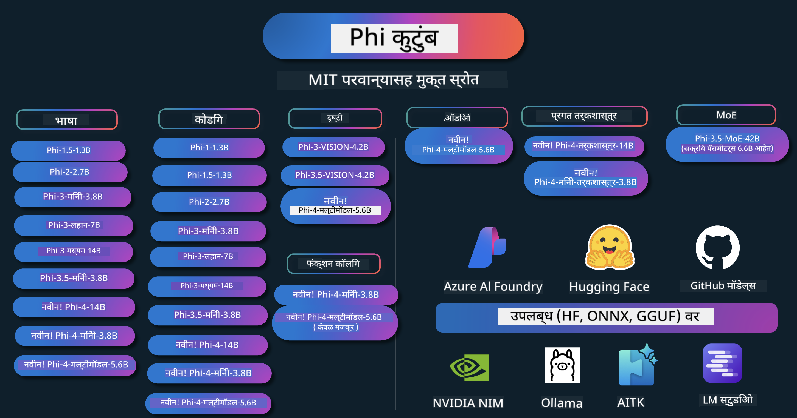

<!--
CO_OP_TRANSLATOR_METADATA:
{
  "original_hash": "1cab9282e04f2e1c388a38dca7763c16",
  "translation_date": "2025-05-09T03:47:04+00:00",
  "source_file": "README.md",
  "language_code": "mr"
}
-->
# Phi Cookbook: Microsoft च्या Phi मॉडेल्ससह प्रत्यक्ष उदाहरणे

Phi हे Microsoft कडून विकसित केलेले एक ओपन सोर्स AI मॉडेल्सचे सिरीज आहे.

Phi सध्या सर्वात सामर्थ्यशाली आणि किफायतशीर छोटे भाषा मॉडेल (SLM) आहे, जे बहुभाषिक, तर्कशास्त्र, मजकूर/चॅट जनरेशन, कोडिंग, प्रतिमा, ऑडिओ आणि इतर परिस्थितींमध्ये उत्कृष्ट बेंचमार्क्स देते.

तुम्ही Phi ला क्लाउडवर किंवा एज डिव्हायसेसवर डिप्लॉय करू शकता, आणि कमी संगणकीय शक्तीने सहजपणे जनरेटिव्ह AI अनुप्रयोग तयार करू शकता.

हे स्त्रोत वापरण्यास सुरुवात करण्यासाठी खालील पायऱ्या फॉलो करा:
1. **Repository Fork करा**: Click 
2. **Repository Clone करा**: `git clone https://github.com/microsoft/PhiCookBook.git`
3. [**Microsoft AI Discord Community मध्ये Join व्हा आणि तज्ञ व सहकार्यकांसोबत भेटा**](https://discord.com/invite/ByRwuEEgH4?WT.mc_id=aiml-137032-kinfeylo)

## 🌐 बहुभाषिक समर्थन

### GitHub Action द्वारे समर्थित (स्वयंचलित आणि नेहमी अपडेटेड)

[French](../fr/README.md) | [Spanish](../es/README.md) | [German](../de/README.md) | [Russian](../ru/README.md) | [Arabic](../ar/README.md) | [Persian (Farsi)](../fa/README.md) | [Urdu](../ur/README.md) | [Chinese (Simplified)](../zh/README.md) | [Chinese (Traditional, Macau)](../mo/README.md) | [Chinese (Traditional, Hong Kong)](../hk/README.md) | [Chinese (Traditional, Taiwan)](../tw/README.md) | [Japanese](../ja/README.md) | [Korean](../ko/README.md) | [Hindi](../hi/README.md)

### CLI द्वारे समर्थित
## अनुक्रमणिका

- परिचय
- [Phi कुटुंबात आपले स्वागत आहे](./md/01.Introduction/01/01.PhiFamily.md)
  - [आपले वातावरण सेट करणे](./md/01.Introduction/01/01.EnvironmentSetup.md)
  - [महत्त्वाच्या तंत्रज्ञानांची समज](./md/01.Introduction/01/01.Understandingtech.md)
  - [Phi मॉडेल्ससाठी AI सुरक्षा](./md/01.Introduction/01/01.AISafety.md)
  - [Phi हार्डवेअर समर्थन](./md/01.Introduction/01/01.Hardwaresupport.md)
  - [Phi मॉडेल्स आणि प्लॅटफॉर्मवर त्यांची उपलब्धता](./md/01.Introduction/01/01.Edgeandcloud.md)
  - [Guidance-ai आणि Phi वापरणे](./md/01.Introduction/01/01.Guidance.md)
  - [GitHub मार्केटप्लेस मॉडेल्स](https://github.com/marketplace/models)
  - [Azure AI मॉडेल कॅटलॉग](https://ai.azure.com)

- विविध वातावरणात Phi चे इन्फरन्स
    -  [Hugging face](./md/01.Introduction/02/01.HF.md)
    -  [GitHub मॉडेल्स](./md/01.Introduction/02/02.GitHubModel.md)
    -  [Azure AI Foundry मॉडेल कॅटलॉग](./md/01.Introduction/02/03.AzureAIFoundry.md)
    -  [Ollama](./md/01.Introduction/02/04.Ollama.md)
    -  [AI Toolkit VSCode (AITK)](./md/01.Introduction/02/05.AITK.md)
    -  [NVIDIA NIM](./md/01.Introduction/02/06.NVIDIA.md)

- Phi कुटुंबात इन्फरन्स
    - [iOS मध्ये Phi इन्फरन्स](./md/01.Introduction/03/iOS_Inference.md)
    - [Android मध्ये Phi इन्फरन्स](./md/01.Introduction/03/Android_Inference.md)
    - [Jetson मध्ये Phi इन्फरन्स](./md/01.Introduction/03/Jetson_Inference.md)
    - [AI PC मध्ये Phi इन्फरन्स](./md/01.Introduction/03/AIPC_Inference.md)
    - [Apple MLX Framework सह Phi इन्फरन्स](./md/01.Introduction/03/MLX_Inference.md)
    - [स्थानिक सर्व्हरमध्ये Phi इन्फरन्स](./md/01.Introduction/03/Local_Server_Inference.md)
    - [AI Toolkit वापरून रिमोट सर्व्हरमध्ये Phi इन्फरन्स](./md/01.Introduction/03/Remote_Interence.md)
    - [Rust सह Phi इन्फरन्स](./md/01.Introduction/03/Rust_Inference.md)
    - [स्थानिक Vision मध्ये Phi इन्फरन्स](./md/01.Introduction/03/Vision_Inference.md)
    - [Kaito AKS, Azure Containers (अधिकृत समर्थन) सह Phi इन्फरन्स](./md/01.Introduction/03/Kaito_Inference.md)
-  [Phi कुटुंबाचे क्वांटिफायिंग](./md/01.Introduction/04/QuantifyingPhi.md)
    - [llama.cpp वापरून Phi-3.5 / 4 चे क्वांटायझेशन](./md/01.Introduction/04/UsingLlamacppQuantifyingPhi.md)
    - [onnxruntime साठी Generative AI एक्स्टेंशन्स वापरून Phi-3.5 / 4 चे क्वांटायझेशन](./md/01.Introduction/04/UsingORTGenAIQuantifyingPhi.md)
    - [Intel OpenVINO वापरून Phi-3.5 / 4 चे क्वांटायझेशन](./md/01.Introduction/04/UsingIntelOpenVINOQuantifyingPhi.md)
    - [Apple MLX Framework वापरून Phi-3.5 / 4 चे क्वांटायझेशन](./md/01.Introduction/04/UsingAppleMLXQuantifyingPhi.md)

-  Phi चे मूल्यमापन
- [Response AI](./md/01.Introduction/05/ResponsibleAI.md)
    - [Azure AI Foundry for Evaluation](./md/01.Introduction/05/AIFoundry.md)
    - [Using Promptflow for Evaluation](./md/01.Introduction/05/Promptflow.md)
 
- RAG सह Azure AI Search
    - [Phi-4-mini आणि Phi-4-multimodal(RAG) Azure AI Search सोबत कसे वापरावे](https://github.com/microsoft/PhiCookBook/blob/main/code/06.E2E/E2E_Phi-4-RAG-Azure-AI-Search.ipynb)

- Phi अनुप्रयोग विकास नमुने
  - मजकूर & चॅट अनुप्रयोग
    - Phi-4 नमुने 🆕
      - [📓] [Phi-4-mini ONNX मॉडेलसह चॅट करा](./md/02.Application/01.TextAndChat/Phi4/ChatWithPhi4ONNX/README.md)
      - [Phi-4 स्थानिक ONNX मॉडेल .NET सह चॅट](../../md/04.HOL/dotnet/src/LabsPhi4-Chat-01OnnxRuntime)
      - [Semantic Kernel वापरून Phi-4 ONNX सह .NET कन्सोल अॅपमध्ये चॅट](../../md/04.HOL/dotnet/src/LabsPhi4-Chat-02SK)
    - Phi-3 / 3.5 नमुने
      - [Phi3, ONNX Runtime Web आणि WebGPU वापरून ब्राउझरमध्ये स्थानिक चॅटबॉट](https://github.com/microsoft/onnxruntime-inference-examples/tree/main/js/chat)
      - [OpenVino चॅट](./md/02.Application/01.TextAndChat/Phi3/E2E_OpenVino_Chat.md)
      - [मल्टि मॉडेल - परस्परसंवादी Phi-3-mini आणि OpenAI Whisper](./md/02.Application/01.TextAndChat/Phi3/E2E_Phi-3-mini_with_whisper.md)
      - [MLFlow - Phi-3 वापरून रॅपर तयार करणे आणि वापरणे](./md//02.Application/01.TextAndChat/Phi3/E2E_Phi-3-MLflow.md)
      - [मॉडेल ऑप्टिमायझेशन - ONNX Runtime Web साठी Phi-3-min मॉडेल कसे ऑप्टिमाइझ करावे Olive वापरून](https://github.com/microsoft/Olive/tree/main/examples/phi3)
      - [Phi-3 mini-4k-instruct-onnx सह WinUI3 अॅप](https://github.com/microsoft/Phi3-Chat-WinUI3-Sample/)
      - [WinUI3 मल्टि मॉडेल AI पॉवर्ड नोट्स अॅप नमुना](https://github.com/microsoft/ai-powered-notes-winui3-sample)
      - [Prompt flow सह कस्टम Phi-3 मॉडेल फाइन-ट्यून आणि एकत्रीकरण](./md/02.Application/01.TextAndChat/Phi3/E2E_Phi-3-FineTuning_PromptFlow_Integration.md)
      - [Azure AI Foundry मध्ये Prompt flow सह कस्टम Phi-3 मॉडेल फाइन-ट्यून आणि एकत्रीकरण](./md/02.Application/01.TextAndChat/Phi3/E2E_Phi-3-FineTuning_PromptFlow_Integration_AIFoundry.md)
      - [Microsoft च्या Responsible AI तत्त्वांवर लक्ष केंद्रित करून Azure AI Foundry मध्ये फाइन-ट्यून केलेले Phi-3 / Phi-3.5 मॉडेल मूल्यांकन](./md/02.Application/01.TextAndChat/Phi3/E2E_Phi-3-Evaluation_AIFoundry.md)
      - [📓] [Phi-3.5-mini-instruct भाषा भाकीत नमुना (चिनी/इंग्रजी)](../../md/02.Application/01.TextAndChat/Phi3/phi3-instruct-demo.ipynb)
      - [Phi-3.5-Instruct WebGPU RAG चॅटबॉट](./md/02.Application/01.TextAndChat/Phi3/WebGPUWithPhi35Readme.md)
      - [Windows GPU वापरून Phi-3.5-Instruct ONNX सह Prompt flow सोल्यूशन तयार करणे](./md/02.Application/01.TextAndChat/Phi3/UsingPromptFlowWithONNX.md)
      - [Microsoft Phi-3.5 tflite वापरून Android अॅप तयार करणे](./md/02.Application/01.TextAndChat/Phi3/UsingPhi35TFLiteCreateAndroidApp.md)
      - [स्थानिक ONNX Phi-3 मॉडेल वापरून Q&A .NET उदाहरण Microsoft.ML.OnnxRuntime सह](../../md/04.HOL/dotnet/src/LabsPhi301)
      - [Semantic Kernel आणि Phi-3 सह .NET कन्सोल चॅट अॅप](../../md/04.HOL/dotnet/src/LabsPhi302)

  - Azure AI Inference SDK कोड आधारित नमुने
    - Phi-4 नमुने 🆕
      - [📓] [Phi-4-multimodal वापरून प्रोजेक्ट कोड तयार करा](./md/02.Application/02.Code/Phi4/GenProjectCode/README.md)
    - Phi-3 / 3.5 नमुने
      - [Microsoft Phi-3 कुटुंबासह Visual Studio Code GitHub Copilot Chat स्वतः तयार करा](./md/02.Application/02.Code/Phi3/VSCodeExt/README.md)
      - [GitHub मॉडेल्स वापरून Phi-3.5 सह Visual Studio Code Chat Copilot एजंट तयार करा](./md/02.Application/02.Code/Phi3/CreateVSCodeChatAgentWithGitHubModels.md)

  - प्रगत तर्क नमुने
    - Phi-4 नमुने 🆕
      - [📓] [Phi-4-mini-reasoning किंवा Phi-4-reasoning नमुने](./md/02.Application/03.AdvancedReasoning/Phi4/AdvancedResoningPhi4mini/README.md)
      - [📓] [Microsoft Olive वापरून Phi-4-mini-reasoning चे फाइन-ट्यूनिंग](../../md/02.Application/03.AdvancedReasoning/Phi4/AdvancedResoningPhi4mini/olive_ft_phi_4_reasoning_with_medicaldata.ipynb)
      - [📓] [Apple MLX वापरून Phi-4-mini-reasoning चे फाइन-ट्यूनिंग](../../md/02.Application/03.AdvancedReasoning/Phi4/AdvancedResoningPhi4mini/mlx_ft_phi_4_reasoning_with_medicaldata.ipynb)
      - [📓] [GitHub मॉडेल्स सह Phi-4-mini-reasoning](../../md/02.Application/02.Code/Phi4r/github_models_inference.ipynb)
- [📓] [Azure AI Foundry मॉडेल्ससह Phi-4-mini-तर्कशास्त्र](../../md/02.Application/02.Code/Phi4r/azure_models_inference.ipynb)
  - डेमो
      - [Phi-4-mini डेमो Hugging Face Spaces वर होस्ट केलेले](https://huggingface.co/spaces/microsoft/phi-4-mini?WT.mc_id=aiml-137032-kinfeylo)
      - [Phi-4-multimodal डेमो Hugging Face Spaces वर होस्ट केलेले](https://huggingface.co/spaces/microsoft/phi-4-multimodal?WT.mc_id=aiml-137032-kinfeylo)
  - व्हिजन नमुने
    - Phi-4 नमुने 🆕
      - [📓] [Phi-4-multimodal वापरून प्रतिमा वाचणे आणि कोड जनरेट करणे](./md/02.Application/04.Vision/Phi4/CreateFrontend/README.md) 
    - Phi-3 / 3.5 नमुने
      -  [📓][Phi-3-vision-प्रतिमा मजकूर ते मजकूर](../../md/02.Application/04.Vision/Phi3/E2E_Phi-3-vision-image-text-to-text-online-endpoint.ipynb)
      - [Phi-3-vision-ONNX](https://onnxruntime.ai/docs/genai/tutorials/phi3-v.html)
      - [📓][Phi-3-vision CLIP एम्बेडिंग](../../md/02.Application/04.Vision/Phi3/E2E_Phi-3-vision-image-text-to-text-online-endpoint.ipynb)
      - [डेमो: Phi-3 रीसायक्लिंग](https://github.com/jennifermarsman/PhiRecycling/)
      - [Phi-3-vision - व्हिज्युअल भाषा सहाय्यक - Phi3-Vision आणि OpenVINO सह](https://docs.openvino.ai/nightly/notebooks/phi-3-vision-with-output.html)
      - [Phi-3 Vision Nvidia NIM](./md/02.Application/04.Vision/Phi3/E2E_Nvidia_NIM_Vision.md)
      - [Phi-3 Vision OpenVino](./md/02.Application/04.Vision/Phi3/E2E_OpenVino_Phi3Vision.md)
      - [📓][Phi-3.5 Vision मल्टि-फ्रेम किंवा मल्टि-इमेज नमुना](../../md/02.Application/04.Vision/Phi3/phi3-vision-demo.ipynb)
      - [Phi-3 Vision स्थानिक ONNX मॉडेल Microsoft.ML.OnnxRuntime .NET वापरून](../../md/04.HOL/dotnet/src/LabsPhi303)
      - [मेनू आधारित Phi-3 Vision स्थानिक ONNX मॉडेल Microsoft.ML.OnnxRuntime .NET वापरून](../../md/04.HOL/dotnet/src/LabsPhi304)

  - ऑडिओ नमुने
    - Phi-4 नमुने 🆕
      - [📓] [Phi-4-multimodal वापरून ऑडिओ ट्रान्सक्रिप्ट्स काढणे](./md/02.Application/05.Audio/Phi4/Transciption/README.md)
      - [📓] [Phi-4-multimodal ऑडिओ नमुना](../../md/02.Application/05.Audio/Phi4/Siri/demo.ipynb)
      - [📓] [Phi-4-multimodal भाषांतर नमुना](../../md/02.Application/05.Audio/Phi4/Translate/demo.ipynb)
      - [.NET कन्सोल अ‍ॅप्लिकेशन Phi-4-multimodal वापरून ऑडिओ फाइलचे विश्लेषण आणि ट्रान्सक्रिप्ट तयार करणे](../../md/04.HOL/dotnet/src/LabsPhi4-MultiModal-02Audio)

  - MOE नमुने
    - Phi-3 / 3.5 नमुने
      - [📓] [Phi-3.5 Mixture of Experts Models (MoEs) सोशल मीडिया नमुना](../../md/02.Application/06.MoE/Phi3/phi3_moe_demo.ipynb)
      - [📓] [NVIDIA NIM Phi-3 MOE, Azure AI Search आणि LlamaIndex सह Retrieval-Augmented Generation (RAG) पाइपलाइन तयार करणे](../../md/02.Application/06.MoE/Phi3/azure-ai-search-nvidia-rag.ipynb)
  - फंक्शन कॉलिंग नमुने
    - Phi-4 नमुने 🆕
      -  [📓] [Phi-4-mini सह फंक्शन कॉलिंग वापरणे](./md/02.Application/07.FunctionCalling/Phi4/FunctionCallingBasic/README.md)
      -  [📓] [Phi-4-mini सह मल्टि-एजंट्स तयार करण्यासाठी फंक्शन कॉलिंग वापरणे](../../md/02.Application/07.FunctionCalling/Phi4/Multiagents/Phi_4_mini_multiagent.ipynb)
      -  [📓] [Ollama सह फंक्शन कॉलिंग वापरणे](../../md/02.Application/07.FunctionCalling/Phi4/Ollama/ollama_functioncalling.ipynb)
  - मल्टिमोडल मिक्सिंग नमुने
    - Phi-4 नमुने 🆕
      -  [📓] [Phi-4-multimodal वापरून तंत्रज्ञान पत्रकार म्हणून काम करणे](../../md/02.Application/08.Multimodel/Phi4/TechJournalist/phi_4_mm_audio_text_publish_news.ipynb)
      - [.NET कन्सोल अ‍ॅप्लिकेशन Phi-4-multimodal वापरून प्रतिमा विश्लेषणासाठी](../../md/04.HOL/dotnet/src/LabsPhi4-MultiModal-01Images)

- Phi फाइन-ट्यूनिंग नमुने
  - [फाइन-ट्यूनिंग परिस्थिती](./md/03.FineTuning/FineTuning_Scenarios.md)
  - [फाइन-ट्यूनिंग विरुद्ध RAG](./md/03.FineTuning/FineTuning_vs_RAG.md)
  - [Phi-3 ला उद्योग विशेषज्ञ बनवण्यासाठी फाइन-ट्यूनिंग](./md/03.FineTuning/LetPhi3gotoIndustriy.md)
  - [VS Code साठी AI Toolkit वापरून Phi-3 चे फाइन-ट्यूनिंग](./md/03.FineTuning/Finetuning_VSCodeaitoolkit.md)
  - [Azure Machine Learning Service वापरून Phi-3 चे फाइन-ट्यूनिंग](./md/03.FineTuning/Introduce_AzureML.md)
- [Lora सह Phi-3 ची फाइन-ट्यूनिंग](./md/03.FineTuning/FineTuning_Lora.md)
  - [QLora सह Phi-3 ची फाइन-ट्यूनिंग](./md/03.FineTuning/FineTuning_Qlora.md)
  - [Azure AI Foundry सह Phi-3 ची फाइन-ट्यूनिंग](./md/03.FineTuning/FineTuning_AIFoundry.md)
  - [Azure ML CLI/SDK सह Phi-3 ची फाइन-ट्यूनिंग](./md/03.FineTuning/FineTuning_MLSDK.md)
  - [Microsoft Olive सह फाइन-ट्यूनिंग](./md/03.FineTuning/FineTuning_MicrosoftOlive.md)
  - [Microsoft Olive Hands-On Lab सह फाइन-ट्यूनिंग](./md/03.FineTuning/olive-lab/readme.md)
  - [Weights and Bias सह Phi-3-vision ची फाइन-ट्यूनिंग](./md/03.FineTuning/FineTuning_Phi-3-visionWandB.md)
  - [Apple MLX Framework सह Phi-3 ची फाइन-ट्यूनिंग](./md/03.FineTuning/FineTuning_MLX.md)
  - [Phi-3-vision ची फाइन-ट्यूनिंग (अधिकृत समर्थन)](./md/03.FineTuning/FineTuning_Vision.md)
  - [Kaito AKS, Azure Containers सह Phi-3 ची फाइन-ट्यूनिंग (अधिकृत समर्थन)](./md/03.FineTuning/FineTuning_Kaito.md)
  - [Phi-3 आणि 3.5 Vision ची फाइन-ट्यूनिंग](https://github.com/2U1/Phi3-Vision-Finetune)

- Hands on Lab
  - [अत्याधुनिक मॉडेल्सची एक्सप्लोरेशन: LLMs, SLMs, लोकल डेव्हलपमेंट आणि बरेच काही](https://github.com/microsoft/aitour-exploring-cutting-edge-models)
  - [NLP क्षमता उघडणे: Microsoft Olive सह फाइन-ट्यूनिंग](https://github.com/azure/Ignite_FineTuning_workshop)

- अकादमिक संशोधन पेपर्स आणि प्रकाशने
  - [Textbooks Are All You Need II: phi-1.5 तांत्रिक अहवाल](https://arxiv.org/abs/2309.05463)
  - [Phi-3 तांत्रिक अहवाल: तुमच्या फोनवर स्थानिकरित्या उच्च क्षमतायुक्त भाषा मॉडेल](https://arxiv.org/abs/2404.14219)
  - [Phi-4 तांत्रिक अहवाल](https://arxiv.org/abs/2412.08905)
  - [Phi-4-Mini तांत्रिक अहवाल: Mixture-of-LoRAs द्वारे कॉम्पॅक्ट पण शक्तिशाली मल्टिमोडल भाषा मॉडेल्स](https://arxiv.org/abs/2503.01743)
  - [इन-व्हीकल फंक्शन-कॉलिंगसाठी लहान भाषा मॉडेल्सचे ऑप्टिमायझेशन](https://arxiv.org/abs/2501.02342)
  - [(WhyPHI) मल्टीपल-चॉइस प्रश्न उत्तरेसाठी PHI-3 ची फाइन-ट्यूनिंग: पद्धती, निकाल आणि आव्हाने](https://arxiv.org/abs/2501.01588)
  - [Phi-4- reasoning तांत्रिक अहवाल](https://www.microsoft.com/en-us/research/wp-content/uploads/2025/04/phi_4_reasoning.pdf)
  - [Phi-4-mini-reasoning तांत्रिक अहवाल](https://huggingface.co/microsoft/Phi-4-mini-reasoning/blob/main/Phi-4-Mini-Reasoning.pdf)

## Phi मॉडेल्स वापरणे

### Azure AI Foundry वर Phi

Microsoft Phi कसे वापरायचे आणि विविध हार्डवेअर डिव्हाइसेसवर E2E सोल्यूशन्स कसे तयार करायचे हे तुम्ही शिकू शकता. Phi स्वतः अनुभवण्यासाठी, मॉडेल्ससह प्रयोग करा आणि तुमच्या परिस्थितीनुसार Phi सानुकूलित करा [Azure AI Foundry Azure AI Model Catalog](https://aka.ms/phi3-azure-ai) वापरून. अधिक जाणून घेण्यासाठी [Azure AI Foundry](/md/02.QuickStart/AzureAIFoundry_QuickStart.md) चा परिचय पहा.

**Playground**  
प्रत्येक मॉडेलसाठी मॉडेल चाचणीसाठी समर्पित playground आहे [Azure AI Playground](https://aka.ms/try-phi3).

### GitHub Models वर Phi

Microsoft Phi कसे वापरायचे आणि विविध हार्डवेअर डिव्हाइसेसवर E2E सोल्यूशन्स कसे तयार करायचे हे शिकण्यासाठी, मॉडेलसह प्रयोग करा आणि तुमच्या परिस्थितीनुसार Phi सानुकूलित करा [GitHub Model Catalog](https://github.com/marketplace/models?WT.mc_id=aiml-137032-kinfeylo) वापरून. अधिक जाणून घेण्यासाठी [GitHub Model Catalog](/md/02.QuickStart/GitHubModel_QuickStart.md) चा परिचय पहा.

**Playground**  
प्रत्येक मॉडेलसाठी समर्पित [playground आहे ज्यात मॉडेलची चाचणी करता येते](/md/02.QuickStart/GitHubModel_QuickStart.md).

### Hugging Face वर Phi

तुम्हाला [Hugging Face](https://huggingface.co/microsoft) वर देखील मॉडेल सापडेल.

**Playground**  
[Hugging Chat playground](https://huggingface.co/chat/models/microsoft/Phi-3-mini-4k-instruct)

## जबाबदार AI

Microsoft आपल्या ग्राहकांना आमच्या AI उत्पादनांचा जबाबदारीने वापर करण्यास मदत करण्यासाठी वचनबद्ध आहे, आमचे अनुभव शेअर करतो आणि Transparency Notes आणि Impact Assessments सारख्या साधनांद्वारे विश्वासावर आधारित भागीदारी तयार करतो. या संसाधनांपैकी बरेच काही [https://aka.ms/RAI](https://aka.ms/RAI) येथे उपलब्ध आहेत.  
Microsoft चा जबाबदार AI चा दृष्टिकोन आमच्या AI तत्त्वांवर आधारित आहे: न्याय्यपणा, विश्वासार्हता आणि सुरक्षा, गोपनीयता आणि सुरक्षितता, समावेश, पारदर्शकता, आणि जबाबदारी.
मोठ्या प्रमाणावर नैसर्गिक भाषा, प्रतिमा, आणि भाषण मॉडेल्स - जसे की या नमुन्यात वापरलेले - संभाव्यतः असमान, अविश्वसनीय किंवा अपमानास्पद वर्तन करू शकतात, ज्यामुळे हानी होऊ शकते. कृपया [Azure OpenAI service Transparency note](https://learn.microsoft.com/legal/cognitive-services/openai/transparency-note?tabs=text) पाहा जेणेकरून धोके आणि मर्यादा यांची माहिती मिळेल.

या धोका कमी करण्यासाठी शिफारस केलेला मार्ग म्हणजे तुमच्या आर्किटेक्चरमध्ये एक सुरक्षा प्रणाली समाविष्ट करणे जी हानिकारक वर्तन ओळखू आणि प्रतिबंधित करू शकेल. [Azure AI Content Safety](https://learn.microsoft.com/azure/ai-services/content-safety/overview) एक स्वतंत्र संरक्षण स्तर प्रदान करते, जे वापरकर्त्यांनी तयार केलेल्या आणि AI-निर्मित हानिकारक सामग्रीचा शोध घेऊ शकते. Azure AI Content Safety मध्ये टेक्स्ट आणि प्रतिमा API समाविष्ट आहेत जे तुम्हाला हानिकारक सामग्री ओळखण्यास मदत करतात. Azure AI Foundry मध्ये, Content Safety सेवा तुम्हाला वेगवेगळ्या माध्यमांमधील हानिकारक सामग्री शोधण्यासाठी नमुना कोड पाहण्याची, एक्सप्लोर करण्याची आणि वापरून पाहण्याची संधी देते. पुढील [quickstart documentation](https://learn.microsoft.com/azure/ai-services/content-safety/quickstart-text?tabs=visual-studio%2Clinux&pivots=programming-language-rest) तुम्हाला सेवेवर विनंत्या करण्यास मार्गदर्शन करते.

दुसरी गोष्ट जी लक्षात घेणे आवश्यक आहे ती म्हणजे संपूर्ण अनुप्रयोगाची कामगिरी. मल्टी-मॉडल आणि मल्टी-मॉडेल्स असलेल्या अनुप्रयोगांसाठी, कामगिरी म्हणजे प्रणाली तुम्ही आणि तुमचे वापरकर्ते अपेक्षा करतात तसे कार्य करणे, ज्यात हानिकारक आउटपुट तयार न होणे याचा समावेश आहे. तुमच्या संपूर्ण अनुप्रयोगाची कामगिरी [Performance and Quality and Risk and Safety evaluators](https://learn.microsoft.com/azure/ai-studio/concepts/evaluation-metrics-built-in) वापरून तपासणे महत्त्वाचे आहे. तुम्हाला [custom evaluators](https://learn.microsoft.com/azure/ai-studio/how-to/develop/evaluate-sdk#custom-evaluators) तयार करण्याची आणि त्यांचा वापर करून मूल्यांकन करण्याची क्षमता देखील आहे.

तुम्ही तुमच्या विकास वातावरणात [Azure AI Evaluation SDK](https://microsoft.github.io/promptflow/index.html) वापरून तुमचा AI अनुप्रयोग मूल्यांकन करू शकता. एखादा चाचणी डेटासेट किंवा लक्ष्य दिल्यास, तुमच्या जनरेटिव्ह AI अनुप्रयोगाच्या निर्मितींचे प्रमाणात्मक मूल्यांकन अंगभूत किंवा तुमच्या पसंतीनुसार कस्टम इव्हॅल्युएटर्सने केले जाऊ शकते. तुमच्या प्रणालीचे मूल्यांकन करण्यासाठी azure ai evaluation sdk सह सुरुवात करण्यासाठी, तुम्ही [quickstart guide](https://learn.microsoft.com/azure/ai-studio/how-to/develop/flow-evaluate-sdk) अनुसरू शकता. एकदा तुम्ही मूल्यांकन चालवले की, तुम्ही [Azure AI Foundry मध्ये निकालांचे दृश्य](https://learn.microsoft.com/azure/ai-studio/how-to/evaluate-flow-results) पाहू शकता.

## ट्रेडमार्क्स

हा प्रकल्प प्रकल्प, उत्पादने किंवा सेवांसाठी ट्रेडमार्क्स किंवा लोगो असू शकतात. Microsoft ट्रेडमार्क्स किंवा लोगोच्या अधिकृत वापरासाठी [Microsoft's Trademark & Brand Guidelines](https://www.microsoft.com/legal/intellectualproperty/trademarks/usage/general) चे पालन करणे आवश्यक आहे. या प्रकल्पाच्या सुधारित आवृत्त्यांमध्ये Microsoft ट्रेडमार्क्स किंवा लोगोचा वापर गोंधळ निर्माण करू नये किंवा Microsoft च्या प्रायोजकत्वाचा भास होऊ नये. तृतीय-पक्ष ट्रेडमार्क्स किंवा लोगोचा वापर त्या तृतीय-पक्षाच्या धोरणांनुसार असतो.

**अस्वीकरण**:  
हा दस्तऐवज AI भाषांतर सेवा [Co-op Translator](https://github.com/Azure/co-op-translator) वापरून भाषांतरित केला आहे. आम्ही अचूकतेसाठी प्रयत्न करतो, तरी कृपया लक्षात ठेवा की स्वयंचलित भाषांतरांमध्ये चुका किंवा अचूकतेच्या त्रुटी असू शकतात. मूळ दस्तऐवज त्याच्या स्थानिक भाषेत अधिकृत स्रोत मानला जावा. महत्त्वाच्या माहितीसाठी व्यावसायिक मानवी भाषांतर शिफारस केले जाते. या भाषांतराच्या वापरामुळे उद्भवणाऱ्या कोणत्याही गैरसमजुती किंवा चुकीच्या अर्थसंग्रहांसाठी आम्ही जबाबदार नाही.