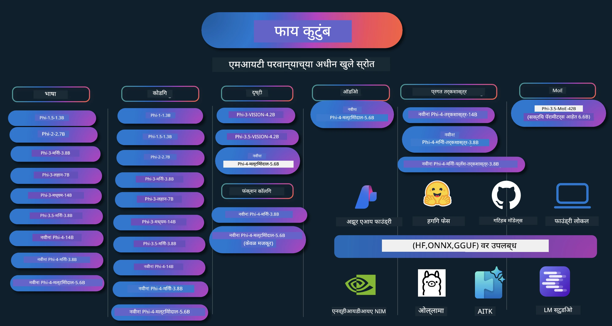

# Phi कूकबुक: Microsoft च्या Phi मॉडेल्ससह हाताने करण्याच्या उदाहरणांसह

[](https://codespaces.new/microsoft/phicookbook)
[](https://vscode.dev/redirect?url=vscode://ms-vscode-remote.remote-containers/cloneInVolume?url=https://github.com/microsoft/phicookbook)

[](https://GitHub.com/microsoft/phicookbook/graphs/contributors/?WT.mc_id=aiml-137032-kinfeylo)
[](https://GitHub.com/microsoft/phicookbook/issues/?WT.mc_id=aiml-137032-kinfeylo)
[](https://GitHub.com/microsoft/phicookbook/pulls/?WT.mc_id=aiml-137032-kinfeylo)
[](http://makeapullrequest.com?WT.mc_id=aiml-137032-kinfeylo)

[](https://GitHub.com/microsoft/phicookbook/watchers/?WT.mc_id=aiml-137032-kinfeylo)
[](https://GitHub.com/microsoft/phicookbook/network/?WT.mc_id=aiml-137032-kinfeylo)
[](https://GitHub.com/microsoft/phicookbook/stargazers/?WT.mc_id=aiml-137032-kinfeylo)

[](https://discord.com/invite/ByRwuEEgH4)

Phi ही Microsoft द्वारे विकसित केलेली खुल्या स्रोताची AI मॉडेल्सची मालिका आहे.

Phi सध्या बहुभाषिक, विचारसरणी, मजकूर/चॅट निर्मिती, कोडिंग, प्रतिमा, ऑडिओ आणि इतर परिस्थितींमध्ये अप्रतिम बेंचमार्क्ससह सर्वात शक्तिशाली आणि किफायतशीर लहान भाषा मॉडेल (SLM) आहे.

आपण Phi ला क्लाउडमध्ये किंवा एज डिव्हाइसेसमध्ये तैनात करू शकता, आणि कमी संगणकीय सामर्थ्याने सहजपणे जनरेटिव AI अनुप्रयोग तयार करू शकता.

या स्रोतांचा वापर सुरू करण्यासाठी खालील पायऱ्या अनुसरा:
1. **रेपॉझिटरी फोर्क करा**: क्लिक करा [](https://GitHub.com/microsoft/phicookbook/network/?WT.mc_id=aiml-137032-kinfeylo)
2. **रेपॉझिटरी क्लोन करा**: `git clone https://github.com/microsoft/PhiCookBook.git`
3. [**Microsoft AI Discord समुदायात सामील व्हा आणि तज्ञ व इतर विकासकांशी भेटा**](https://discord.com/invite/ByRwuEEgH4?WT.mc_id=aiml-137032-kinfeylo)



### 🌐 बहुभाषिक समर्थन

#### GitHub Action द्वारे समर्थित (स्वयंचलित आणि सदैव अद्ययावत)

<!-- CO-OP TRANSLATOR LANGUAGES TABLE START -->
[अरेबिक](../ar/README.md) | [बंगाली](../bn/README.md) | [बल्गेरियन](../bg/README.md) | [बर्मी (म्यानमार)](../my/README.md) | [चिनी (सोप्या स्वरूपात)](../zh-CN/README.md) | [चिनी (परंपरागत, हॉंगकॉनग)](../zh-HK/README.md) | [चिनी (परंपरागत, मकाऊ)](../zh-MO/README.md) | [चिनी (परंपरागत, तैवान)](../zh-TW/README.md) | [क्रोएशियन](../hr/README.md) | [चेक](../cs/README.md) | [डॅनिश](../da/README.md) | [डच](../nl/README.md) | [एस्टोनियन](../et/README.md) | [फिन्निश](../fi/README.md) | [फ्रेंच](../fr/README.md) | [जर्मन](../de/README.md) | [ग्रीक](../el/README.md) | [हिब्रू](../he/README.md) | [हिंदी](../hi/README.md) | [हंगेरीयन](../hu/README.md) | [इंडोनेशियन](../id/README.md) | [इटालियन](../it/README.md) | [जपानी](../ja/README.md) | [कन्नड](../kn/README.md) | [कोरियन](../ko/README.md) | [लिथुवेनियन](../lt/README.md) | [मलय](../ms/README.md) | [मलयाळम](../ml/README.md) | [मराठी](./README.md) | [नेपाली](../ne/README.md) | [नायजीरियन पिड्गिन](../pcm/README.md) | [नॉर्वेजियन](../no/README.md) | [पर्शियन (फारसी)](../fa/README.md) | [पोलिश](../pl/README.md) | [पोर्तुगीज (ब्राझील)](../pt-BR/README.md) | [पोर्तुगीज (पोर्तुगाल)](../pt-PT/README.md) | [पंजाबी (गुरमुखी)](../pa/README.md) | [रोमानियन](../ro/README.md) | [रशियन](../ru/README.md) | [सर्बियन (सिरिलिक)](../sr/README.md) | [स्लोव्हाक](../sk/README.md) | [स्लोव्हेनियन](../sl/README.md) | [स्पॅनिश](../es/README.md) | [सहिली](../sw/README.md) | [स्वीडिश](../sv/README.md) | [टागालोग (फिलिपिनो)](../tl/README.md) | [तमिळ](../ta/README.md) | [तेलुगू](../te/README.md) | [थाई](../th/README.md) | [तुर्की](../tr/README.md) | [युक्रेनीयन](../uk/README.md) | [उर्दू](../ur/README.md) | [व्हिएतनामीज](../vi/README.md)

> **स्थानिकरित्या क्लोन करणे प्राधान्य देतो का?**
>
> या रेपॉझिटरीमध्ये ५०+ भाषा अनुवादांचा समावेश आहे ज्यामुळे डाउनलोड आकार लक्षणीय वाढतो. अनुवादांशिवाय क्लोन करण्यासाठी sparse checkout वापरा:
>
> **Bash / macOS / Linux:**
> ```bash
> git clone --filter=blob:none --sparse https://github.com/microsoft/PhiCookBook.git
> cd PhiCookBook
> git sparse-checkout set --no-cone '/*' '!translations' '!translated_images'
> ```
>
> **CMD (Windows):**
> ```cmd
> git clone --filter=blob:none --sparse https://github.com/microsoft/PhiCookBook.git
> cd PhiCookBook
> git sparse-checkout set --no-cone "/*" "!translations" "!translated_images"
> ```
>
> हे आपल्याला कोर्स पूर्ण करण्यासाठी आवश्यक असलेली सर्व काही जलद डाउनलोडसह देते.
<!-- CO-OP TRANSLATOR LANGUAGES TABLE END -->

## मजकूर सूची

- परिचय
  - [Phi परिवारात स्वागत आहे](./md/01.Introduction/01/01.PhiFamily.md)
  - [आपले वातावरण सेट करणे](./md/01.Introduction/01/01.EnvironmentSetup.md)
  - [महत्त्वाच्या तंत्रज्ञानाचा समज](./md/01.Introduction/01/01.Understandingtech.md)
  - [Phi मॉडेल्ससाठी AI सुरक्षा](./md/01.Introduction/01/01.AISafety.md)
  - [Phi हार्डवेअर समर्थन](./md/01.Introduction/01/01.Hardwaresupport.md)
  - [प्लॅटफॉर्मवर Phi मॉडेल्स आणि उपलब्धता](./md/01.Introduction/01/01.Edgeandcloud.md)
  - [Guidance-ai आणि Phi चा वापर](./md/01.Introduction/01/01.Guidance.md)
  - [GitHub मार्केटप्लेस मॉडेल्स](https://github.com/marketplace/models)
  - [Azure AI मॉडेल कॅटलॉग](https://ai.azure.com)

- वेगवेगळ्या वातावरणात Phi ची इन्फरन्स
    -  [Hugging face](./md/01.Introduction/02/01.HF.md)
    -  [GitHub मॉडेल्स](./md/01.Introduction/02/02.GitHubModel.md)
    -  [Microsoft Foundry मॉडेल कॅटलॉग](./md/01.Introduction/02/03.AzureAIFoundry.md)
    -  [Ollama](./md/01.Introduction/02/04.Ollama.md)
    -  [AI Toolkit VSCode (AITK)](./md/01.Introduction/02/05.AITK.md)
    -  [NVIDIA NIM](./md/01.Introduction/02/06.NVIDIA.md)
    -  [Foundry Local](./md/01.Introduction/02/07.FoundryLocal.md)

- Phi परिवाराची इन्फरन्स
    - [iOS मध्ये Phi ची इन्फरन्स](./md/01.Introduction/03/iOS_Inference.md)
    - [Android मध्ये Phi ची इन्फरन्स](./md/01.Introduction/03/Android_Inference.md)
    - [Jetson मध्ये Phi ची इन्फरन्स](./md/01.Introduction/03/Jetson_Inference.md)
    - [AI PC मध्ये Phi ची इन्फरन्स](./md/01.Introduction/03/AIPC_Inference.md)
    - [Apple MLX फ्रेमवर्कसह Phi ची इन्फरन्स](./md/01.Introduction/03/MLX_Inference.md)
    - [स्थानिक सर्व्हरमध्ये Phi ची इन्फरन्स](./md/01.Introduction/03/Local_Server_Inference.md)
    - [AI Toolkit वापरून रिमोट सर्व्हरमध्ये Phi ची इन्फरन्स](./md/01.Introduction/03/Remote_Interence.md)
    - [Rust सह Phi ची इन्फरन्स](./md/01.Introduction/03/Rust_Inference.md)
    - [स्थानिक Vision साठी Phi ची इन्फरन्स](./md/01.Introduction/03/Vision_Inference.md)
    - [Kaito AKS, Azure Containers (अधिकृत समर्थन) सह Phi ची इन्फरन्स](./md/01.Introduction/03/Kaito_Inference.md)
-  [Phi परिवाराचे क्वांटिफायिंग](./md/01.Introduction/04/QuantifyingPhi.md)
    - [llama.cpp वापरून Phi-3.5 / 4 क्वांटायझिंग](./md/01.Introduction/04/UsingLlamacppQuantifyingPhi.md)
    - [onnxruntime साठी जनरेटिव AI एक्स्टेंशन्स वापरून Phi-3.5 / 4 क्वांटायझिंग](./md/01.Introduction/04/UsingORTGenAIQuantifyingPhi.md)
    - [Intel OpenVINO वापरून Phi-3.5 / 4 क्वांटायझिंग](./md/01.Introduction/04/UsingIntelOpenVINOQuantifyingPhi.md)
    - [Apple MLX फ्रेमवर्क वापरून Phi-3.5 / 4 क्वांटायझिंग](./md/01.Introduction/04/UsingAppleMLXQuantifyingPhi.md)

- Phi चे मूल्यमापन
    - [जबाबदार AI](./md/01.Introduction/05/ResponsibleAI.md)
    - [मूल्यमापनासाठी Microsoft Foundry](./md/01.Introduction/05/AIFoundry.md)
    - [मूल्यमापनासाठी Promptflow वापरणे](./md/01.Introduction/05/Promptflow.md)
 
- Azure AI Search सह RAG
    - [Azure AI Search सह Phi-4-mini आणि Phi-4-multimodal (RAG) वापरण्याचे कसे](https://github.com/microsoft/PhiCookBook/blob/main/code/06.E2E/E2E_Phi-4-RAG-Azure-AI-Search.ipynb)

- Phi अॅप्लिकेशन विकास नमुने
  - मजकूर आणि चॅट अॅप्लिकेशन्स
    - Phi-4 नमुने 🆕
      - [📓] [Phi-4-mini ONNX मॉडेलसह चॅट करा](./md/02.Application/01.TextAndChat/Phi4/ChatWithPhi4ONNX/README.md)
      - [स्थानिक ONNX मॉडेल .NET वापरून Phi-4 चॅट करा](../../md/04.HOL/dotnet/src/LabsPhi4-Chat-01OnnxRuntime)
      - [Semantic Kernel वापरून Phi-4 ONNX सह .NET कन्सोल अॅप्लिकेशनमध्ये चॅट करा](../../md/04.HOL/dotnet/src/LabsPhi4-Chat-02SK)
    - Phi-3 / 3.5 नमुने
      - [Phi3, ONNX रनटाइम वेब आणि WebGPU वापरून ब्राउझरमध्ये स्थानिक चॅटबॉट](https://github.com/microsoft/onnxruntime-inference-examples/tree/main/js/chat)
      - [OpenVino चॅट](./md/02.Application/01.TextAndChat/Phi3/E2E_OpenVino_Chat.md)
      - [मल्टि मॉडेल - इंटरऐक्टिव Phi-3-मिनी आणि OpenAI व्हिस्पर](./md/02.Application/01.TextAndChat/Phi3/E2E_Phi-3-mini_with_whisper.md)
      - [MLFlow - रॅपर तयार करणे आणि Phi-3 चा MLFlow सह वापर](./md//02.Application/01.TextAndChat/Phi3/E2E_Phi-3-MLflow.md)
      - [मॉडेल ऑप्टिमायझेशन - ONNX Runtime Web साठी Phi-3-min मॉडेल Olive वापरून कसे ऑप्टिमाइझ करायचे](https://github.com/microsoft/Olive/tree/main/examples/phi3)
      - [Phi-3 मिनी-4k-instruct-onnx सह WinUI3 अॅप](https://github.com/microsoft/Phi3-Chat-WinUI3-Sample/)
      -[WinUI3 मल्टि मॉडेल AI पॉवर्ड नोट्स अॅप सॅम्पल](https://github.com/microsoft/ai-powered-notes-winui3-sample)
      - [कस्टम Phi-3 मॉडेल्सचे फाईन-ट्यूनिंग आणि Prompt flow सह एकत्रीकरण](./md/02.Application/01.TextAndChat/Phi3/E2E_Phi-3-FineTuning_PromptFlow_Integration.md)
      - [Azure AI फाउंड्रीमध्ये Prompt flow सह कस्टम Phi-3 मॉडेल्सचे फाईन-ट्यूनिंग आणि एकत्रीकरण](./md/02.Application/01.TextAndChat/Phi3/E2E_Phi-3-FineTuning_PromptFlow_Integration_AIFoundry.md)
      - [Azure AI फाउंड्रीमध्ये Microsoft च्या जबाबदार AI तत्त्वांवर लक्ष केंद्रित करून फाईन-ट्यून Phi-3 / Phi-3.5 मॉडेलचे मूल्यमापन](./md/02.Application/01.TextAndChat/Phi3/E2E_Phi-3-Evaluation_AIFoundry.md)
      - [📓] [Phi-3.5-mini-instruct भाषा भविष्यवाणी सॅम्पल (चिनी/इंग्रजी)](./md/02.Application/01.TextAndChat/Phi3/phi3-instruct-demo.ipynb)
      - [Phi-3.5-Instruct WebGPU RAG चॅटबॉट](./md/02.Application/01.TextAndChat/Phi3/WebGPUWithPhi35Readme.md)
      - [Windows GPU वापरून Phi-3.5-Instruct ONNX सह Prompt flow सोल्युशन तयार करणे](./md/02.Application/01.TextAndChat/Phi3/UsingPromptFlowWithONNX.md)
      - [Microsoft Phi-3.5 tflite वापरून Android अॅप तयार करणे](./md/02.Application/01.TextAndChat/Phi3/UsingPhi35TFLiteCreateAndroidApp.md)
      - [Microsoft.ML.OnnxRuntime वापरून स्थानिक ONNX Phi-3 मॉडेलसह Q&A .NET उदाहरण](../../md/04.HOL/dotnet/src/LabsPhi301)
      - [Semantic Kernel आणि Phi-3 सह कॉन्सोल चॅट .NET अॅप](../../md/04.HOL/dotnet/src/LabsPhi302)

  - Azure AI Inference SDK कोड आधारित सॅम्पल्स 
    - Phi-4 सॅम्पल्स 🆕
      - [📓] [Phi-4-multimodal वापरून प्रोजेक्ट कोड जनरेट करा](./md/02.Application/02.Code/Phi4/GenProjectCode/README.md)
    - Phi-3 / 3.5 सॅम्पल्स
      - [Microsoft Phi-3 फॅमिली वापरून तुमचा स्वतःचा Visual Studio Code GitHub Copilot Chat तयार करा](./md/02.Application/02.Code/Phi3/VSCodeExt/README.md)
      - [GitHub मॉडेल्स वापरून Phi-3.5 सह तुमचा स्वतःचा Visual Studio Code Chat Copilot एजंट तयार करा](/md/02.Application/02.Code/Phi3/CreateVSCodeChatAgentWithGitHubModels.md)

  - प्रगत तर्कनियमन सॅम्पल्स
    - Phi-4 सॅम्पल्स 🆕
      - [📓] [Phi-4-mini-reasoning किंवा Phi-4-reasoning सॅम्पल्स](./md/02.Application/03.AdvancedReasoning/Phi4/AdvancedResoningPhi4mini/README.md)
      - [📓] [Microsoft Olive सह Phi-4-mini-reasoning चे फाईन-ट्यूनिंग](./md/02.Application/03.AdvancedReasoning/Phi4/AdvancedResoningPhi4mini/olive_ft_phi_4_reasoning_with_medicaldata.ipynb)
      - [📓] [Apple MLX सह Phi-4-mini-reasoning चे फाईन-ट्यूनिंग](./md/02.Application/03.AdvancedReasoning/Phi4/AdvancedResoningPhi4mini/mlx_ft_phi_4_reasoning_with_medicaldata.ipynb)
      - [📓] [GitHub मॉडेल्स सह Phi-4-mini-reasoning](./md/02.Application/02.Code/Phi4r/github_models_inference.ipynb)
      - [📓] [Microsoft Foundry मॉडेल्स सह Phi-4-mini-reasoning](./md/02.Application/02.Code/Phi4r/azure_models_inference.ipynb)
  - डेमो
      - [Phi-4-mini डेमो Hugging Face Spaces वर होस्ट केलेले](https://huggingface.co/spaces/microsoft/phi-4-mini?WT.mc_id=aiml-137032-kinfeylo)
      - [Phi-4-multimodal डेमो Hugginge Face Spaces वर होस्ट केलेले](https://huggingface.co/spaces/microsoft/phi-4-multimodal?WT.mc_id=aiml-137032-kinfeylo)
  - व्हिजन सॅम्पल्स
    - Phi-4 सॅम्पल्स 🆕
      - [📓] [Phi-4-multimodal वापरून प्रतिमा वाचा आणि कोड तयार करा](./md/02.Application/04.Vision/Phi4/CreateFrontend/README.md) 
    - Phi-3 / 3.5 सॅम्पल्स
      -  [📓][Phi-3-vision-प्रतिमा टेक्स्ट ते टेक्स्ट](./md/02.Application/04.Vision/Phi3/E2E_Phi-3-vision-image-text-to-text-online-endpoint.ipynb)
      - [Phi-3-vision-ONNX](https://onnxruntime.ai/docs/genai/tutorials/phi3-v.html)
      - [📓][Phi-3-vision CLIP एम्बेडिंग](./md/02.Application/04.Vision/Phi3/E2E_Phi-3-vision-image-text-to-text-online-endpoint.ipynb)
      - [डेमो: Phi-3 रीसायक्लिंग](https://github.com/jennifermarsman/PhiRecycling/)
      - [Phi-3-vision - व्हिज्युअल भाषा सहाय्यक - Phi3-Vision आणि OpenVINO सह](https://docs.openvino.ai/nightly/notebooks/phi-3-vision-with-output.html)
      - [Phi-3 Vision Nvidia NIM](./md/02.Application/04.Vision/Phi3/E2E_Nvidia_NIM_Vision.md)
      - [Phi-3 Vision OpenVino](./md/02.Application/04.Vision/Phi3/E2E_OpenVino_Phi3Vision.md)
      - [📓][Phi-3.5 Vision मल्टि-फ्रेम किंवा मल्टि-इमेज सॅम्पल](./md/02.Application/04.Vision/Phi3/phi3-vision-demo.ipynb)
      - [Microsoft.ML.OnnxRuntime .NET वापरून Phi-3 Vision स्थानिक ONNX मॉडेल](../../md/04.HOL/dotnet/src/LabsPhi303)
      - [Microsoft.ML.OnnxRuntime .NET वापरून मेनू आधारित Phi-3 Vision स्थानिक ONNX मॉडेल](../../md/04.HOL/dotnet/src/LabsPhi304)

  - गणित सॅम्पल्स
    -  Phi-4-Mini-Flash-Reasoning-Instruct सॅम्पल्स 🆕 [Phi-4-Mini-Flash-Reasoning-Instruct सह गणित डेमो](./md/02.Application/09.Math/MathDemo.ipynb)

  - ऑडिओ सॅम्पल्स
    - Phi-4 सॅम्पल्स 🆕
      - [📓] [Phi-4-multimodal वापरून ऑडिओ ट्रान्सक्रिप्ट्स काढणे](./md/02.Application/05.Audio/Phi4/Transciption/README.md)
      - [📓] [Phi-4-multimodal ऑडिओ सॅम्पल](./md/02.Application/05.Audio/Phi4/Siri/demo.ipynb)
      - [📓] [Phi-4-multimodal भाषांतर सॅम्पल](./md/02.Application/05.Audio/Phi4/Translate/demo.ipynb)
      - [.NET कन्सोल अॅप्लिकेशन ज्यामध्ये Phi-4-multimodal ऑडिओ वापरून ऑडिओ फाईलचे विश्लेषण आणि ट्रान्सक्रिप्ट तयार करणे](../../md/04.HOL/dotnet/src/LabsPhi4-MultiModal-02Audio)

  - MOE सॅम्पल्स
    - Phi-3 / 3.5 सॅम्पल्स
      - [📓] [Phi-3.5 मिक्सचर ऑफ एक्सपर्ट्स मॉडेल्स (MoEs) सोशल मीडिया सॅम्पल](./md/02.Application/06.MoE/Phi3/phi3_moe_demo.ipynb)
      - [📓] [NVIDIA NIM Phi-3 MOE, Azure AI Search, आणि LlamaIndex सह Retrieval-Augmented Generation (RAG) पाईपलाईन तयार करणे](./md/02.Application/06.MoE/Phi3/azure-ai-search-nvidia-rag.ipynb)
      - 
  - फंक्शन कॉलिंग सॅम्पल्स
    - Phi-4 सॅम्पल्स 🆕
      -  [📓] [Phi-4-mini सह फंक्शन कॉलिंग वापरणे](./md/02.Application/07.FunctionCalling/Phi4/FunctionCallingBasic/README.md)
      -  [📓] [Phi-4-mini सह मल्टि-एजंट्स तयार करण्यासाठी फंक्शन कॉलिंग वापरणे](./md/02.Application/07.FunctionCalling/Phi4/Multiagents/Phi_4_mini_multiagent.ipynb)
      -  [📓] [Ollama सह फंक्शन कॉलिंग वापरणे](./md/02.Application/07.FunctionCalling/Phi4/Ollama/ollama_functioncalling.ipynb)
      -  [📓] [ONNX सह फंक्शन कॉलिंग वापरणे](./md/02.Application/07.FunctionCalling/Phi4/ONNX/onnx_parallel_functioncalling.ipynb)
  - मल्टि मोडेल मिक्सिंग सॅम्पल्स
    - Phi-4 सॅम्पल्स 🆕
      -  [📓] [Phi-4-multimodal वापरून तंत्रज्ञान पत्रकार म्हणून काम करणे](./md/02.Application/08.Multimodel/Phi4/TechJournalist/phi_4_mm_audio_text_publish_news.ipynb)
      - [.NET कॉन्सोल अॅप्लिकेशन जे Phi-4-multimodal वापरून प्रतिमा विश्लेषित करते](../../md/04.HOL/dotnet/src/LabsPhi4-MultiModal-01Images)

- Phi सॅम्पल्सचे फाईन-ट्यूनिंग
  - [फाईन-ट्यूनिंग परिस्थिती](./md/03.FineTuning/FineTuning_Scenarios.md)
  - [फाईन-ट्यूनिंग विरुद्ध RAG](./md/03.FineTuning/FineTuning_vs_RAG.md)
  - [Phi-3 ला उद्योग तज्ञ बनू द्या फाईन-ट्यूनिंग](./md/03.FineTuning/LetPhi3gotoIndustriy.md)
  - [VS Code साठी AI टूलकिटसह Phi-3 चे फाईन-ट्यूनिंग](./md/03.FineTuning/Finetuning_VSCodeaitoolkit.md)
  - [Azure मशीन लर्निंग सेवेसह Phi-3 चे फाईन-ट्यूनिंग](./md/03.FineTuning/Introduce_AzureML.md)
  - [Lora सह Phi-3 चे फाईन-ट्यूनिंग](./md/03.FineTuning/FineTuning_Lora.md)
  - [QLora सह Phi-3 चे फाईन-ट्यूनिंग](./md/03.FineTuning/FineTuning_Qlora.md)
  - [Azure AI फाउंड्रीसह Phi-3 चे फाईन-ट्यूनिंग](./md/03.FineTuning/FineTuning_AIFoundry.md)
  - [Azure ML CLI/SDK सह Phi-3 चे फाईन-ट्यूनिंग](./md/03.FineTuning/FineTuning_MLSDK.md)
  - [Microsoft Olive सह फाईन-ट्यूनिंग](./md/03.FineTuning/FineTuning_MicrosoftOlive.md)
  - [Microsoft Olive Hands-On Lab सह फाईन-ट्यूनिंग](./md/03.FineTuning/olive-lab/readme.md)
  - [Weights and Bias सह Phi-3-vision चे फाईन-ट्यूनिंग](./md/03.FineTuning/FineTuning_Phi-3-visionWandB.md)
  - [Apple MLX Framework सह Phi-3 चे फाईन-ट्यूनिंग](./md/03.FineTuning/FineTuning_MLX.md)
  - [Phi-3-vision चे फाईन-ट्यूनिंग (अधिकृत समर्थन)](./md/03.FineTuning/FineTuning_Vision.md)
  - [Kaito AKS, Azure कंटेनर्स सह Phi-3 चे फाईन-ट्यूनिंग (अधिकृत समर्थन)](./md/03.FineTuning/FineTuning_Kaito.md)
  - [Phi-3 आणि 3.5 Vision चे फाईन-ट्यूनिंग](https://github.com/2U1/Phi3-Vision-Finetune)

- हैंड्स ऑन लॅब
  - [अत्याधुनिक मॉडेल्स एक्सप्लोर करणे: LLMs, SLMs, स्थानिक विकास आणि बरेच काही](https://github.com/microsoft/aitour-exploring-cutting-edge-models)
  - [NLP क्षमता अनलॉक करणे: Microsoft Olive सह फाईन-ट्यूनिंग](https://github.com/azure/Ignite_FineTuning_workshop)
- अकादमिक संशोधन पेपर्स आणि प्रकाशने
  - [Textbooks Are All You Need II: phi-1.5 तांत्रिक अहवाल](https://arxiv.org/abs/2309.05463)
  - [Phi-3 तांत्रिक अहवाल: आपल्या फोनवर स्थानिक रूपात अत्यंत सक्षम भाषा मॉडेल](https://arxiv.org/abs/2404.14219)
  - [Phi-4 तांत्रिक अहवाल](https://arxiv.org/abs/2412.08905)
  - [Phi-4-Mini तांत्रिक अहवाल: मिश्रण-ऑफ-LoRAs द्वारे संकुचित परंतु समर्थ मल्टीमोडल भाषा मॉडेल्स](https://arxiv.org/abs/2503.01743)
  - [वाहनांतर्गत फंक्शन-कालिंगसाठी लहान भाषा मॉडेल्सचे अनुकूलन](https://arxiv.org/abs/2501.02342)
  - [(WhyPHI) बहुविकल्पीय प्रश्न उत्तरेसाठी PHI-3 चे फाइन-ट्यूनिंग: पद्धतशास्त्र, निकाल आणि आव्हाने](https://arxiv.org/abs/2501.01588)
  - [Phi-4-तर्कसंगत तांत्रिक अहवाल](https://www.microsoft.com/en-us/research/wp-content/uploads/2025/04/phi_4_reasoning.pdf)
  - [Phi-4-mini-तर्कसंगत तांत्रिक अहवाल](https://huggingface.co/microsoft/Phi-4-mini-reasoning/blob/main/Phi-4-Mini-Reasoning.pdf)

## Phi मॉडेल्सचा वापर

### Microsoft Foundry वर Phi

आपण Microsoft Phi कसा वापरायचा आणि आपल्या विविध हार्डवेअर उपकरणांमध्ये E2E सोल्यूशन्स कसे तयार करायचे हे जाणून घेऊ शकता. स्वतः साठी Phi अनुभवण्यासाठी, प्रथम मॉडेल्ससह खेळा आणि आपल्या परिस्थितीसाठी Phi सानुकूलित करा, [Microsoft Foundry Azure AI Model Catalog](https://aka.ms/phi3-azure-ai) वापरून आपण अधिक माहिती मिळवू शकता Getting Started with [Microsoft Foundry](/md/02.QuickStart/AzureAIFoundry_QuickStart.md)

**प्लेराउंड**
प्रत्येक मॉडेलसाठी मॉडेलची चाचणी करण्यासाठी समर्पित प्लेग्राउंड आहे [Azure AI Playground](https://aka.ms/try-phi3).

### GitHub मॉडेल्सवर Phi

आपण Microsoft Phi कसा वापरायचा आणि आपल्या विविध हार्डवेअर उपकरणांमध्ये E2E सोल्यूशन्स कसे तयार करायचे हे जाणून घेऊ शकता. स्वतः साठी Phi अनुभवण्यासाठी, प्रथम मॉडेलसह खेळा आणि आपल्या परिस्थितीसाठी Phi सानुकूलित करा, [GitHub Model Catalog](https://github.com/marketplace/models?WT.mc_id=aiml-137032-kinfeylo) वापरून आपण अधिक माहिती मिळवू शकता Getting Started with [GitHub Model Catalog](/md/02.QuickStart/GitHubModel_QuickStart.md)

**प्लेराउंड**
प्रत्येक मॉडेलसाठी समर्पित [प्लेग्राउंड आहे जिथे मॉडेलची चाचणी करू शकता](/md/02.QuickStart/GitHubModel_QuickStart.md).

### Hugging Face वर Phi

आपण मॉडेल [Hugging Face](https://huggingface.co/microsoft) वर देखील शोधू शकता

**प्लेराउंड**  
[Hugging Chat playground](https://huggingface.co/chat/models/microsoft/Phi-3-mini-4k-instruct)

## 🎒 इतर अभ्यासक्रम

आमची टीम इतर अभ्यासक्रम देखील तयार करते! पाहा:

<!-- CO-OP TRANSLATOR OTHER COURSES START -->
### LangChain  
[](https://aka.ms/langchain4j-for-beginners)  
[](https://aka.ms/langchainjs-for-beginners?WT.mc_id=m365-94501-dwahlin)  
[](https://github.com/microsoft/langchain-for-beginners?WT.mc_id=m365-94501-dwahlin)  
---

### Azure / Edge / MCP / Agents  
[](https://github.com/microsoft/AZD-for-beginners?WT.mc_id=academic-105485-koreyst)  
[](https://github.com/microsoft/edgeai-for-beginners?WT.mc_id=academic-105485-koreyst)  
[](https://github.com/microsoft/mcp-for-beginners?WT.mc_id=academic-105485-koreyst)  
[](https://github.com/microsoft/ai-agents-for-beginners?WT.mc_id=academic-105485-koreyst)

---

### Generative AI Series  
[](https://github.com/microsoft/generative-ai-for-beginners?WT.mc_id=academic-105485-koreyst)  
[-9333EA?style=for-the-badge&labelColor=E5E7EB&color=9333EA)](https://github.com/microsoft/Generative-AI-for-beginners-dotnet?WT.mc_id=academic-105485-koreyst)  
[-C084FC?style=for-the-badge&labelColor=E5E7EB&color=C084FC)](https://github.com/microsoft/generative-ai-for-beginners-java?WT.mc_id=academic-105485-koreyst)  
[-E879F9?style=for-the-badge&labelColor=E5E7EB&color=E879F9)](https://github.com/microsoft/generative-ai-with-javascript?WT.mc_id=academic-105485-koreyst)

---

### Core Learning  
[](https://aka.ms/ml-beginners?WT.mc_id=academic-105485-koreyst)  
[](https://aka.ms/datascience-beginners?WT.mc_id=academic-105485-koreyst)  
[](https://aka.ms/ai-beginners?WT.mc_id=academic-105485-koreyst)  
[](https://github.com/microsoft/Security-101?WT.mc_id=academic-96948-sayoung)  
[](https://aka.ms/webdev-beginners?WT.mc_id=academic-105485-koreyst)  
[](https://aka.ms/iot-beginners?WT.mc_id=academic-105485-koreyst)  
[](https://github.com/microsoft/xr-development-for-beginners?WT.mc_id=academic-105485-koreyst)

---

### Copilot Series  
[](https://aka.ms/GitHubCopilotAI?WT.mc_id=academic-105485-koreyst)  
[](https://github.com/microsoft/mastering-github-copilot-for-dotnet-csharp-developers?WT.mc_id=academic-105485-koreyst)  
[](https://github.com/microsoft/CopilotAdventures?WT.mc_id=academic-105485-koreyst)  
<!-- CO-OP TRANSLATOR OTHER COURSES END -->

## जबाबदार AI

Microsoft आमच्या ग्राहकांना आमची AI उत्पादने जबाबदारीने वापरण्यात मदत करण्यासाठी, आमच्या शिकवणी सामायिक करण्यासाठी आणि पंचायती-आधारित भागीदारी तयार करण्यासाठी Transparency Notes आणि Impact Assessments सारख्या साधनांद्वारे कटिबद्ध आहे. या अनेक संसाधने येथे आढळू शकतात: [https://aka.ms/RAI](https://aka.ms/RAI).  
Microsoft चा जबाबदार AI कडे दृष्टिकोन आमच्या न्याय, विश्वासार्हता आणि सुरक्षितता, गोपनीयता आणि सुरक्षा, समावेश, पारदर्शकता, आणि जबाबदारीचा AI तत्त्वांवर आधारित आहे.

मोठ्या प्रमाणावर नैसर्गिक भाषा, प्रतिमा आणि भाषण मॉडेल्स - जसे की या नमुन्यात वापरलेले - संभाव्यपणे अन्यायकारक, अविश्वसनीय किंवा अपमानजनक वर्तन करू शकतात, ज्यामुळे हानी होऊ शकते. कृपया [Azure OpenAI सेवा Transparency note](https://learn.microsoft.com/legal/cognitive-services/openai/transparency-note?tabs=text) पहा जो जोखमी आणि मर्यादा याबद्दल माहिती देतो.

या जोखमी कमी करण्याचा शिफारसीय दृष्टिकोन म्हणजे आपल्या आर्किटेक्चरमध्ये एक सुरक्षा प्रणाली समाविष्ट करणे जी हानिकारक वर्तन ओळखू आणि थांबवू शकेल. [Azure AI Content Safety](https://learn.microsoft.com/azure/ai-services/content-safety/overview) एक स्वतंत्र संरक्षण स्तर प्रदान करतो, जो अनुप्रयोग आणि सेवांमध्ये हानिकारक वापरकर्ता निर्माण सामग्री आणि AI-निर्मित सामग्री ओळखू शकतो. Azure AI Content Safety मध्ये टेक्स्ट आणि इमेज API आहेत जे आपण हानिकारक सामग्री शोधू शकता. Microsoft Foundry मधील Content Safety सेवा विविध प्रकारच्या मजकूरांसाठी हानिकारक सामग्री शोधण्यासाठी नमुना कोड पाहण्याची, शोधण्याची आणि वापरण्याची परवानगी देते. खालील [क्विकस्टार्ट दस्तऐवज](https://learn.microsoft.com/azure/ai-services/content-safety/quickstart-text?tabs=visual-studio%2Clinux&pivots=programming-language-rest) आपल्याला सेवेवर विनंत्या कशा करायच्या याचे मार्गदर्शन करते.
अजून एक बाब विचारात घेण्यासारखी म्हणजे संपूर्ण अनुप्रयोगाची कामगिरी. बहु-मोडाल आणि बहु-मॉडेल्स अनुप्रयोगांसह, कामगिरीचा अर्थ असा आहे की प्रणाली तुम्ही आणि तुमचे वापरकर्ते अपेक्षा करतात तशी कार्य करते, ज्यामध्ये हानिकारक आउटपुट तयार करणे समाविष्ट नाही. तुमच्या संपूर्ण अनुप्रयोगाची कामगिरी [Performance and Quality and Risk and Safety evaluators](https://learn.microsoft.com/azure/ai-studio/concepts/evaluation-metrics-built-in) वापरून मोजणे महत्त्वाचे आहे. तुम्हाला [custom evaluators](https://learn.microsoft.com/azure/ai-studio/how-to/develop/evaluate-sdk#custom-evaluators) तयार करण्याची आणि मूल्यांकन करण्याची क्षमता देखील आहे.

तुम्ही तुमच्या विकास पर्यावरणात [Azure AI Evaluation SDK](https://microsoft.github.io/promptflow/index.html) वापरून तुमचा AI अनुप्रयोग मूल्यांकन करू शकता. टेस्ट डेटासेट किंवा लक्ष्य दिल्यास, तुमच्या जनरेटिव्ह AI अनुप्रयोगाच्या जनरेशनचे परिमाणात्मक मापन अंतर्गत मूल्यांकन करणारे किंवा तुमच्या पसंतीनुसार तयार केलेले कस्टम मूल्यांकन करणारे वापरून केले जाते. तुमची प्रणाली मूल्यांकन करण्यासाठी azure ai evaluation sdk सह सुरुवात करण्यासाठी, तुम्ही [quickstart guide](https://learn.microsoft.com/azure/ai-studio/how-to/develop/flow-evaluate-sdk) अनुसरू शकता. एकदा तुम्ही मूल्यांकन कार्यान्वित केल्यावर, तुम्ही [Microsoft Foundry मध्ये निकालांचे दृश्य देखावा](https://learn.microsoft.com/azure/ai-studio/how-to/evaluate-flow-results) करू शकता. 

## ट्रेडमार्क

हा प्रकल्प प्रकल्प, उत्पादने किंवा सेवा यांचे ट्रेडमार्क किंवा लोगो असू शकतो. मायक्रोसॉफ्टच्या ट्रेडमार्क किंवा लोगोचा अधिकृत वापर [Microsoft's Trademark & Brand Guidelines](https://www.microsoft.com/legal/intellectualproperty/trademarks/usage/general) च्या अधीन असून यादरम्यान त्यांचे पालन करणे आवश्यक आहे.
या प्रकल्पाच्या सुधारित आवृत्त्यांमध्ये मायक्रोसॉफ्ट ट्रेडमार्क किंवा लोगोचा वापर केल्यास गोंधळ निर्माण होऊ नये किंवा मायक्रोसॉफ्टच्या प्रायोजकत्वाचा भास होऊ नये. तृतीय पक्षाच्या ट्रेडमार्क किंवा लोगोचा वापर त्या तृतीय पक्षाच्या धोरणांनुसार करणे आवश्यक आहे.

## मदतीसाठी

जर तुम्ही अडकलात किंवा AI अ‍ॅप्स तयार करताना काही प्रश्न असतील, तर सामील व्हा:

[](https://aka.ms/foundry/discord)

जर उत्पादक अभिप्राय किंवा त्रुटी येत असल्यास, भेट द्या:

[](https://aka.ms/foundry/forum)

---

<!-- CO-OP TRANSLATOR DISCLAIMER START -->
**अस्वीकरण**:
हा दस्तऐवज AI भाषांतर सेवा [Co-op Translator](https://github.com/Azure/co-op-translator) वापरून भाषांतरित केला आहे. आम्ही अचूकतेसाठी प्रयत्नशील असलो तरी, कृत्रिम भाषांतरांमध्ये चुका किंवा विसंगती असू शकतात याची कृपया नोंद घ्या. मूळ दस्तऐवज त्याच्या मूळ भाषेत अधिकृत स्रोत म्हणून मानला जावा. महत्त्वाची माहितीबाबत व्यावसायिक मानवी भाषांतर करण्याचा सल्ला दिला जातो. या भाषांतराच्या वापरामुळे उद्भवणाऱ्या कोणत्याही गैरसमज किंवा चुकांसाठी आम्ही जबाबदार नाही.
<!-- CO-OP TRANSLATOR DISCLAIMER END -->