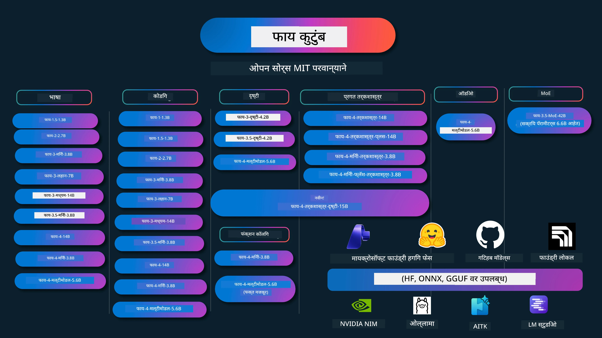

# Phi कुकीबुक: Microsoft च्या Phi मॉडेल्ससह हाताळणीचे उदाहरणे

[](https://codespaces.new/microsoft/phicookbook)
[](https://vscode.dev/redirect?url=vscode://ms-vscode-remote.remote-containers/cloneInVolume?url=https://github.com/microsoft/phicookbook)

[](https://GitHub.com/microsoft/phicookbook/graphs/contributors/?WT.mc_id=aiml-137032-kinfeylo)
[](https://GitHub.com/microsoft/phicookbook/issues/?WT.mc_id=aiml-137032-kinfeylo)
[](https://GitHub.com/microsoft/phicookbook/pulls/?WT.mc_id=aiml-137032-kinfeylo)
[](http://makeapullrequest.com?WT.mc_id=aiml-137032-kinfeylo)

[](https://GitHub.com/microsoft/phicookbook/watchers/?WT.mc_id=aiml-137032-kinfeylo)
[](https://GitHub.com/microsoft/phicookbook/network/?WT.mc_id=aiml-137032-kinfeylo)
[](https://GitHub.com/microsoft/phicookbook/stargazers/?WT.mc_id=aiml-137032-kinfeylo)

[](https://discord.com/invite/ByRwuEEgH4)

Phi ही Microsoft ने विकसित केलेली मुक्त स्रोत AI मॉडेल्सची मालिका आहे.

Phi सध्या सर्वात शक्तिशाली आणि किफायतशीर छोटे भाषा मॉडेल (SLM) आहे, जे बहुभाषिक, तर्कशास्त्र, मजकूर/चॅट जनरेशन, कोडिंग, प्रतिमा, ऑडिओ आणि इतर अनेक परस्थिति मध्ये चांगले बेंचमार्क दाखवते.

आपण Phi क्लाउड किंवा एज डिव्हाइसेसवर तैनात करू शकता, आणि मर्यादित संगणकीय शक्तीने सहज जनरेटिव्ह AI अनुप्रयोग तयार करू शकता.

हे संसाधने वापरण्यास सुरुवात करण्यासाठी खालील चरणांचे पालन करा :
1. **रिपॉझिटरी फोर्क करा**: क्लिक करा [](https://GitHub.com/microsoft/phicookbook/network/?WT.mc_id=aiml-137032-kinfeylo)
2. **रिपॉझिटरी क्लोन करा**: `git clone https://github.com/microsoft/PhiCookBook.git`
3. [**Microsoft AI Discord समुदायात सहभागी व्हा आणि तज्ञ व सहकारी विकासकांना भेटा**](https://discord.com/invite/ByRwuEEgH4?WT.mc_id=aiml-137032-kinfeylo)



### 🌐 बहुभाषिक समर्थन

#### GitHub Action द्वारे समर्थीत (स्वयंचलित आणि नेहमी अद्ययावत)

<!-- CO-OP TRANSLATOR LANGUAGES TABLE START -->
[अरबी](../ar/README.md) | [बांग्ला](../bn/README.md) | [बुल्गारियन](../bg/README.md) | [बर्मी (म्यानमार)](../my/README.md) | [चिनी (सोप्या)](../zh-CN/README.md) | [चिनी (परंपरागत, होंग कॉंग)](../zh-HK/README.md) | [चिनी (परंपरागत, मकाऊ)](../zh-MO/README.md) | [चिनी (परंपरागत, तैवान)](../zh-TW/README.md) | [क्रोएशियन](../hr/README.md) | [चेक](../cs/README.md) | [डॅनिश](../da/README.md) | [डच](../nl/README.md) | [एस्टोनियन](../et/README.md) | [फिन्निश](../fi/README.md) | [फ्रेंच](../fr/README.md) | [जर्मन](../de/README.md) | [ग्रीक](../el/README.md) | [हिब्रू](../he/README.md) | [हिंदी](../hi/README.md) | [हंगेरियन](../hu/README.md) | [इंडोनेशियन](../id/README.md) | [इटालियन](../it/README.md) | [जपानी](../ja/README.md) | [कन्नड](../kn/README.md) | [खमेर](../km/README.md) | [कोरियन](../ko/README.md) | [लिथुआनियन](../lt/README.md) | [मलय](../ms/README.md) | [मलयाळम](../ml/README.md) | [मराठी](./README.md) | [नेपाली](../ne/README.md) | [नायजीरियन पिजिन](../pcm/README.md) | [नॉर्वेजियन](../no/README.md) | [फारसी (पर्शियन)](../fa/README.md) | [पोलिश](../pl/README.md) | [पॉर्तुगीज (ब्राझील)](../pt-BR/README.md) | [पॉर्तुगीज (पोर्तुगाल)](../pt-PT/README.md) | [पंजाबी (गुरुमुखी)](../pa/README.md) | [रोमानियन](../ro/README.md) | [रशियन](../ru/README.md) | [सर्बियन (सिरिलिक)](../sr/README.md) | [स्लोव्हाक](../sk/README.md) | [स्लोव्हेनियन](../sl/README.md) | [स्पॅनिश](../es/README.md) | [स्वाहिली](../sw/README.md) | [स्वीडिश](../sv/README.md) | [टॅगलॉग (फिलिपिनो)](../tl/README.md) | [तमिळ](../ta/README.md) | [तेलुगू](../te/README.md) | [थाई](../th/README.md) | [तुर्की](../tr/README.md) | [यूक्रेनियन](../uk/README.md) | [उर्दू](../ur/README.md) | [व्हिएतनामी](../vi/README.md)

> **स्थानिकरित्या क्लोन करणे प्राधान्य द्या?**
>
> या रिपॉझिटरीमध्ये 50 पेक्षा जास्त भाषा अनुवाद आहेत जे डाउनलोड आकार मोठा करतात. अनुवादांशिवाय क्लोन करण्यासाठी, sparse checkout वापरा:
>
> **Bash / macOS / Linux:**
> ```bash
> git clone --filter=blob:none --sparse https://github.com/microsoft/PhiCookBook.git
> cd PhiCookBook
> git sparse-checkout set --no-cone '/*' '!translations' '!translated_images'
> ```
>
> **CMD (विंडोज):**
> ```cmd
> git clone --filter=blob:none --sparse https://github.com/microsoft/PhiCookBook.git
> cd PhiCookBook
> git sparse-checkout set --no-cone "/*" "!translations" "!translated_images"
> ```
>
> यामुळे आपल्याला कोर्स पूर्ण करण्यासाठी सर्व काही मिळेल आणि डाउनलोड प्रक्रिया खूप जलद होईल.
<!-- CO-OP TRANSLATOR LANGUAGES TABLE END -->

## विषय सूची
- परिचय - [Phi कुटुंबात आपले स्वागत आहे](./md/01.Introduction/01/01.PhiFamily.md) - [आपले वातावरण सेट करणे](./md/01.Introduction/01/01.EnvironmentSetup.md) - [महत्त्वाच्या तंत्रज्ञानांचे समजून घेणे](./md/01.Introduction/01/01.Understandingtech.md) - [Phi मॉडेलसाठी एआय सुरक्षितता](./md/01.Introduction/01/01.AISafety.md) - [Phi हार्डवेअर समर्थन](./md/01.Introduction/01/01.Hardwaresupport.md) - [प्लॅटफॉर्मवर Phi मॉडेल्स आणि उपलब्धता](./md/01.Introduction/01/01.Edgeandcloud.md) - [Guidance-ai आणि Phi वापरणे](./md/01.Introduction/01/01.Guidance.md) - [GitHub मार्केटप्लेस मॉडेल्स](https://github.com/marketplace/models) - [Azure AI मॉडेल कॅटलॉग](https://ai.azure.com) - वेगवेगळ्या वातावरणात Phi चे Inference - [Hugging face](./md/01.Introduction/02/01.HF.md) - [GitHub मॉडेल्स](./md/01.Introduction/02/02.GitHubModel.md) - [Microsoft Foundry मॉडेल कॅटलॉग](./md/01.Introduction/02/03.AzureAIFoundry.md) - [Ollama](./md/01.Introduction/02/04.Ollama.md) - [AI टूलकिट VSCode (AITK)](./md/01.Introduction/02/05.AITK.md) - [NVIDIA NIM](./md/01.Introduction/02/06.NVIDIA.md) - [Foundry लोकल](./md/01.Introduction/02/07.FoundryLocal.md) - Phi कुटुंबाचा Inference - [iOS मध्ये Inference Phi](./md/01.Introduction/03/iOS_Inference.md) - [Android मध्ये Inference Phi](./md/01.Introduction/03/Android_Inference.md) - [Jetsonमध्ये Inference Phi](./md/01.Introduction/03/Jetson_Inference.md) - [AI पीसी मध्ये Inference Phi](./md/01.Introduction/03/AIPC_Inference.md) - [Apple MLX फ्रेमवर्कसह Inference Phi](./md/01.Introduction/03/MLX_Inference.md) - [लोकल सर्व्हरमध्ये Inference Phi](./md/01.Introduction/03/Local_Server_Inference.md) - [AI टूलकिट वापरून रिमोट सर्व्हरमध्ये Inference Phi](./md/01.Introduction/03/Remote_Interence.md) - [Rust सह Inference Phi](./md/01.Introduction/03/Rust_Inference.md) - [लोकलमध्ये Inference Phi--Vision](./md/01.Introduction/03/Vision_Inference.md) - [Kaito AKS, Azure कंटेनर (औपचारिक समर्थन) सह Inference Phi](./md/01.Introduction/03/Kaito_Inference.md) - [Phi कुटुंबाचे क्वांटिफायिंग](./md/01.Introduction/04/QuantifyingPhi.md) - [llama.cpp वापरून Phi-3.5 / 4 चे क्वांटायझिंग](./md/01.Introduction/04/UsingLlamacppQuantifyingPhi.md) - [onnxruntime साठी जनरेटिव्ह AI विस्तार वापरून Phi-3.5 / 4 चे क्वांटायझिंग](./md/01.Introduction/04/UsingORTGenAIQuantifyingPhi.md) - [Intel OpenVINO वापरून Phi-3.5 / 4 चे क्वांटायझिंग](./md/01.Introduction/04/UsingIntelOpenVINOQuantifyingPhi.md) - [Apple MLX फ्रेमवर्क वापरून Phi-3.5 / 4 चे क्वांटायझिंग](./md/01.Introduction/04/UsingAppleMLXQuantifyingPhi.md) - Phi चे मूल्यांकन - [उत्तरदायित्व AI](./md/01.Introduction/05/ResponsibleAI.md) - [Microsoft Foundry साठी मूल्यांकन](./md/01.Introduction/05/AIFoundry.md) - [मूल्यांकनासाठी Promptflow वापरणे](./md/01.Introduction/05/Promptflow.md) - Azure AI सर्चसह RAG - [Phi-4-mini आणि Phi-4-multimodal (RAG) Azure AI सर्चसह कसे वापरायचे](https://github.com/microsoft/PhiCookBook/blob/main/code/06.E2E/E2E_Phi-4-RAG-Azure-AI-Search.ipynb) - Phi अनुप्रयोग विकास नमुने - टेक्स्ट आणि चॅट अनुप्रयोग - Phi-4 नमुने - [📓] [Phi-4-mini ONNX मॉडेलसह चॅट करा](./md/02.Application/01.TextAndChat/Phi4/ChatWithPhi4ONNX/README.md) - [Phi-4 लोकल ONNX मॉडेल .NET सह चॅट](../../md/04.HOL/dotnet/src/LabsPhi4-Chat-01OnnxRuntime) - [Semantic Kernel वापरून Phi-4 ONNX सह .NET कन्सोल अॅपमध्ये चॅट](../../md/04.HOL/dotnet/src/LabsPhi4-Chat-02SK) - Phi-3 / 3.5 नमुने - [Phi3, ONNX Runtime Web आणि WebGPU वापरून ब्राउझरमध्ये लोकल चॅटबोट](https://github.com/microsoft/onnxruntime-inference-examples/tree/main/js/chat) - [OpenVino चॅट](./md/02.Application/01.TextAndChat/Phi3/E2E_OpenVino_Chat.md) - [मल्टी मॉडेल - इंटरऍक्टिव Phi-3-mini आणि OpenAI Whisper](./md/02.Application/01.TextAndChat/Phi3/E2E_Phi-3-mini_with_whisper.md) - [MLFlow - रॅपर तयार करणे आणि Phi-3 सह MLFlow वापरणे](./md//02.Application/01.TextAndChat/Phi3/E2E_Phi-3-MLflow.md) - [मॉडेल ऑप्टिमायझेशन - Olive सह ONNX Runtime Web साठी Phi-3-min मॉडेल कसे ऑप्टिमाइझ करावे](https://github.com/microsoft/Olive/tree/main/examples/phi3) - [WinUI3 अॅप Phi-3 मिनी-4k-instruct-onnx सह](https://github.com/microsoft/Phi3-Chat-WinUI3-Sample/) - [WinUI3 मल्टी मॉडेल AI Powered Notes अॅप नमुना](https://github.com/microsoft/ai-powered-notes-winui3-sample) - [Prompt flow सह सानुकूल Phi-3 मॉडेल्स फाइन-ट्यून आणि एकत्रीकरण](./md/02.Application/01.TextAndChat/Phi3/E2E_Phi-3-FineTuning_PromptFlow_Integration.md) - [Microsoft Foundry मध्ये Prompt flow सह सानुकूल Phi-3 मॉडेल्स फाइन-ट्यून आणि एकत्रीकरण](./md/02.Application/01.TextAndChat/Phi3/E2E_Phi-3-FineTuning_PromptFlow_Integration_AIFoundry.md) - [Phi-3 / Phi-3.5 मॉडेलचे Microsoft Foundry मध्ये Microsoft च्या उत्तरदायित्व AI तत्त्वांवर लक्ष केंद्रित करून मूल्यांकन](./md/02.Application/01.TextAndChat/Phi3/E2E_Phi-3-Evaluation_AIFoundry.md) - [📓] [Phi-3.5-mini-instruct भाषा अंदाज नमुना (चायनीज/इंग्रजी)](./md/02.Application/01.TextAndChat/Phi3/phi3-instruct-demo.ipynb) - [Phi-3.5-Instruct WebGPU RAG चॅटबोट](./md/02.Application/01.TextAndChat/Phi3/WebGPUWithPhi35Readme.md) - [Windows GPU वापरून Phi-3.5-Instruct ONNX सह Prompt flow सोल्यूशन तयार करणे](./md/02.Application/01.TextAndChat/Phi3/UsingPromptFlowWithONNX.md) - [Microsoft Phi-3.5 tflite वापरून Android अॅप तयार करणे](./md/02.Application/01.TextAndChat/Phi3/UsingPhi35TFLiteCreateAndroidApp.md) - [स्थानिक ONNX Phi-3 मॉडेल वापरून Microsoft.ML.OnnxRuntime सह Q&A .NET उदाहरण](../../md/04.HOL/dotnet/src/LabsPhi301) - [Semantic Kernel आणि Phi-3 सह कन्सोल चॅट .NET अॅप](../../md/04.HOL/dotnet/src/LabsPhi302) - Azure AI Inference SDK कोड आधारित नमुने - Phi-4 नमुने - [📓] [Phi-4-multimodal वापरून प्रोजेक्ट कोड तयार करा](./md/02.Application/02.Code/Phi4/GenProjectCode/README.md) - Phi-3 / 3.5 नमुने - [Microsoft Phi-3 कुटुंबासह स्वतःचा Visual Studio Code GitHub Copilot चॅट तयार करा](./md/02.Application/02.Code/Phi3/VSCodeExt/README.md) - [GitHub मॉडेल्स वापरून Phi-3.5 सह स्वतःचा Visual Studio Code Chat Copilot एजंट तयार करा](/md/02.Application/02.Code/Phi3/CreateVSCodeChatAgentWithGitHubModels.md) - प्रगत तर्क नमुने - Phi-4 नमुने - [📓] [Phi-4-mini-reasoning किंवा Phi-4-reasoning नमुने](./md/02.Application/03.AdvancedReasoning/Phi4/AdvancedResoningPhi4mini/README.md) - [📓] [Microsoft Olive सह Phi-4-mini-reasoning चे फाइन-ट्यूनिंग](./md/02.Application/03.AdvancedReasoning/Phi4/AdvancedResoningPhi4mini/olive_ft_phi_4_reasoning_with_medicaldata.ipynb) - [📓] [Apple MLX सह Phi-4-mini-reasoning चे फाइन-ट्यूनिंग](./md/02.Application/03.AdvancedReasoning/Phi4/AdvancedResoningPhi4mini/mlx_ft_phi_4_reasoning_with_medicaldata.ipynb) - [📓] [GitHub मॉडेल्स सह Phi-4-mini-reasoning](./md/02.Application/02.Code/Phi4r/github_models_inference.ipynb) - [📓] [Microsoft Foundry मॉडेल्स सह Phi-4-mini-reasoning](./md/02.Application/02.Code/Phi4r/azure_models_inference.ipynb) -
डेमो - [Phi-4-mini डेमो Hugging Face Spaces वर होस्ट केलेले](https://huggingface.co/spaces/microsoft/phi-4-mini?WT.mc_id=aiml-137032-kinfeylo) - [Phi-4-multimodal डेमो Hugging Face Spaces वर होस्ट केलेले](https://huggingface.co/spaces/microsoft/phi-4-multimodal?WT.mc_id=aiml-137032-kinfeylo) - दृश्य नमुने - Phi-4 नमुने - [📓] [इमेजेस वाचण्यासाठी आणि कोड जनरेट करण्यासाठी Phi-4-multimodal वापरा](./md/02.Application/04.Vision/Phi4/CreateFrontend/README.md) - Phi-3 / 3.5 नमुने - [📓][Phi-3-vision-इमेज टेक्स्ट ते टेक्स्ट](./md/02.Application/04.Vision/Phi3/E2E_Phi-3-vision-image-text-to-text-online-endpoint.ipynb) - [Phi-3-vision-ONNX](https://onnxruntime.ai/docs/genai/tutorials/phi3-v.html) - [📓][Phi-3-vision CLIP एम्बेडिंग](./md/02.Application/04.Vision/Phi3/E2E_Phi-3-vision-image-text-to-text-online-endpoint.ipynb) - [DEMO: Phi-3 रीसायक्लिंग](https://github.com/jennifermarsman/PhiRecycling/) - [Phi-3-vision - दृश्य भाषा सहाय्यक - Phi3-Vision आणि OpenVINO सह](https://docs.openvino.ai/nightly/notebooks/phi-3-vision-with-output.html) - [Phi-3 Vision Nvidia NIM](./md/02.Application/04.Vision/Phi3/E2E_Nvidia_NIM_Vision.md) - [Phi-3 Vision OpenVino](./md/02.Application/04.Vision/Phi3/E2E_OpenVino_Phi3Vision.md) - [📓][Phi-3.5 Vision मल्टि-फ्रेम किंवा मल्टि-इमेज नमुना](./md/02.Application/04.Vision/Phi3/phi3-vision-demo.ipynb) - [Phi-3 Vision स्थानिक ONNX मॉडेल Microsoft.ML.OnnxRuntime .NET वापरून](../../md/04.HOL/dotnet/src/LabsPhi303) - [मेनू आधारित Phi-3 Vision स्थानिक ONNX मॉडेल Microsoft.ML.OnnxRuntime .NET वापरून](../../md/04.HOL/dotnet/src/LabsPhi304) - तर्कशास्त्र-व्हिजन नमुने - Phi-4-Reasoning-Vision-15B - [📓] [Jaywalking ओळखण्यासाठी Phi-4-Reasoning-Vision-15B वापरणे](./md/02.Application/10.ReasoningVision/Phi_4_reasoning_vision_15b_Jaywalking.ipynb) - [📓] [गणितासाठी Phi-4-Reasoning-Vision-15B वापरणे](./md/02.Application/10.ReasoningVision/Phi_4_reasoning_vision_15b_Math.ipynb) - [📓] [UI शोधण्यासाठी Phi-4-Reasoning-Vision-15B वापरणे](./md/02.Application/10.ReasoningVision/Phi_4_reasoning_vision_15b_ui.ipynb) - गणित नमुने - Phi-4-Mini-Flash-Reasoning-Instruct नमुने [गणित डेमो Phi-4-Mini-Flash-Reasoning-Instruct सह](./md/02.Application/09.Math/MathDemo.ipynb) - ऑडिओ नमुने - Phi-4 नमुने - [📓] [Phi-4-multimodal वापरून ऑडिओ ट्रान्सक्रिप्ट्स काढणे](./md/02.Application/05.Audio/Phi4/Transciption/README.md) - [📓] [Phi-4-multimodal ऑडिओ नमुना](./md/02.Application/05.Audio/Phi4/Siri/demo.ipynb) - [📓] [Phi-4-multimodal स्पीच ट्रान्सलेशन नमुना](./md/02.Application/05.Audio/Phi4/Translate/demo.ipynb) - [Phi-4-multimodal ऑडिओ वापरून .NET कन्सोल अप्लिकेशन वापरून ऑडिओ फाइलचे विश्लेषण करा आणि ट्रान्सक्रिप्ट जनरेट करा](../../md/04.HOL/dotnet/src/LabsPhi4-MultiModal-02Audio) - MOE नमुने - Phi-3 / 3.5 नमुने - [📓] [Phi-3.5 विशेषज्ञांचे मिश्रण मॉडेल्स (MoEs) सोशल मिडिया नमुना](./md/02.Application/06.MoE/Phi3/phi3_moe_demo.ipynb) - [📓] [NVIDIA NIM Phi-3 MOE, Azure AI Search, आणि LlamaIndex सह Retrieval-Augmented Generation (RAG) पाइपलाइन तयार करणे](./md/02.Application/06.MoE/Phi3/azure-ai-search-nvidia-rag.ipynb) - - फंक्शन कॉलिंग नमुने - Phi-4 नमुने 🆕 - [📓] [Phi-4-mini सह फंक्शन कॉलिंग वापरणे](./md/02.Application/07.FunctionCalling/Phi4/FunctionCallingBasic/README.md) - [📓] [Phi-4-mini सह मल्टि-एजंट तयार करण्यासाठी फंक्शन कॉलिंग वापरणे](./md/02.Application/07.FunctionCalling/Phi4/Multiagents/Phi_4_mini_multiagent.ipynb) - [📓] [Ollama सह फंक्शन कॉलिंग वापरणे](./md/02.Application/07.FunctionCalling/Phi4/Ollama/ollama_functioncalling.ipynb) - [📓] [ONNX सह फंक्शन कॉलिंग वापरणे](./md/02.Application/07.FunctionCalling/Phi4/ONNX/onnx_parallel_functioncalling.ipynb) - मल्टिमोडल मिक्सिंग नमुने - Phi-4 नमुने 🆕 - [📓] [तंत्रज्ञान पत्रकार म्हणून Phi-4-multimodal वापरणे](./md/02.Application/08.Multimodel/Phi4/TechJournalist/phi_4_mm_audio_text_publish_news.ipynb) - [Phi-4-multimodal वापरून चित्रांचे विश्लेषण करण्यासाठी .NET कन्सोल अप्लिकेशन](../../md/04.HOL/dotnet/src/LabsPhi4-MultiModal-01Images) - Phi फाइन-ट्यूनिंग नमुने - [फाइन-ट्यूनिंग परिस्थिती](./md/03.FineTuning/FineTuning_Scenarios.md) - [फाइन-ट्यूनिंग विरुद्ध RAG](./md/03.FineTuning/FineTuning_vs_RAG.md) - [Phi-3 ला उद्योग तज्ञ बनवण्यासाठी फाइन-ट्यूनिंग](./md/03.FineTuning/LetPhi3gotoIndustriy.md) - [AI Toolkit for VS Code सह Phi-3 फाइन-ट्यूनिंग](./md/03.FineTuning/Finetuning_VSCodeaitoolkit.md) - [Azure Machine Learning Service सह Phi-3 फाइन-ट्यूनिंग](./md/03.FineTuning/Introduce_AzureML.md) - [Lora सह Phi-3 फाइन-ट्यूनिंग](./md/03.FineTuning/FineTuning_Lora.md) - [QLora सह Phi-3 फाइन-ट्यूनिंग](./md/03.FineTuning/FineTuning_Qlora.md) - [Microsoft Foundry सह Phi-3 फाइन-ट्यूनिंग](./md/03.FineTuning/FineTuning_AIFoundry.md) - [Azure ML CLI/SDK सह Phi-3 फाइन-ट्यूनिंग](./md/03.FineTuning/FineTuning_MLSDK.md) - [Microsoft Olive सह फाइन-ट्यूनिंग](./md/03.FineTuning/FineTuning_MicrosoftOlive.md) - [Microsoft Olive Hands-On Lab सह फाइन-ट्यूनिंग](./md/03.FineTuning/olive-lab/readme.md) - [Weights and Bias सह Phi-3-vision फाइन-ट्यूनिंग](./md/03.FineTuning/FineTuning_Phi-3-visionWandB.md) - [Apple MLX Framework सह Phi-3 फाइन-ट्यूनिंग](./md/03.FineTuning/FineTuning_MLX.md) - [Phi-3-vision (अधिकृत समर्थन) फाइन-ट्यूनिंग](./md/03.FineTuning/FineTuning_Vision.md) - [Kaito AKS, Azure Containers सह Phi-3 फाइन-ट्यूनिंग (अधिकृत समर्थन)](./md/03.FineTuning/FineTuning_Kaito.md) - [Phi-3 आणि 3.5 Vision फाइन-ट्यूनिंग](https://github.com/2U1/Phi3-Vision-Finetune) - हँड्स ऑन लॅब - [काटिंग एज मॉडेल्स एक्सप्लोर करणे: LLMs, SLMs, स्थानिक विकास आणि बरेच काही](https://github.com/microsoft/aitour-exploring-cutting-edge-models) - [एनएलपी क्षमता अनलॉक करणे: Microsoft Olive सह फाइन-ट्यूनिंग](https://github.com/azure/Ignite_FineTuning_workshop) - अकादमिक संशोधन पेपर आणि प्रकाशने - [ टेक्स्टबुक्स आर ऑल यू नीड II: phi-1.5 तांत्रिक अहवाल](https://arxiv.org/abs/2309.05463) - [Phi-3 तांत्रिक अहवाल: तुमच्या फोनवर स्थानिक अत्यंत सक्षम भाषा मॉडेल](https://arxiv.org/abs/2404.14219) - [Phi-4 तांत्रिक अहवाल](https://arxiv.org/abs/2412.08905) - [Phi-4-Mini तांत्रिक अहवाल: मिश्रण-ऑफ-LoRAs द्वारे कॉम्पॅक्ट परंतु शक्तिशाली मल्टिमोडल भाषा मॉडेल्स](https://arxiv.org/abs/2503.01743) - [वाहनातील फंक्शन-कॉलिंगसाठी लहान भाषा मॉडेल्सचे ऑप्टिमायझेशन](https://arxiv.org/abs/2501.02342) - [(WhyPHI) बहुविकल्पीय प्रश्न उत्तरांसाठी PHI-3 चे फाइन-ट्यूनिंग: पद्धतशास्त्र, निकाल आणि आव्हाने](https://arxiv.org/abs/2501.01588) - [Phi-4-Reasoning तांत्रिक अहवाल](https://www.microsoft.com/en-us/research/wp-content/uploads/2025/04/phi_4_reasoning.pdf)
- [Phi-4-मिनी-तार्किक तंत्रज्ञ अहवाल](https://huggingface.co/microsoft/Phi-4-mini-reasoning/blob/main/Phi-4-Mini-Reasoning.pdf)
# Phi पाककृतीपुस्तक: Microsoft च्या Phi मॉडेल्ससह प्रत्यक्ष उदाहरणे

[](https://codespaces.new/microsoft/phicookbook)
[](https://vscode.dev/redirect?url=vscode://ms-vscode-remote.remote-containers/cloneInVolume?url=https://github.com/microsoft/phicookbook)

[](https://GitHub.com/microsoft/phicookbook/graphs/contributors/?WT.mc_id=aiml-137032-kinfeylo)
[](https://GitHub.com/microsoft/phicookbook/issues/?WT.mc_id=aiml-137032-kinfeylo)
[](https://GitHub.com/microsoft/phicookbook/pulls/?WT.mc_id=aiml-137032-kinfeylo)
[](http://makeapullrequest.com?WT.mc_id=aiml-137032-kinfeylo)

[](https://GitHub.com/microsoft/phicookbook/watchers/?WT.mc_id=aiml-137032-kinfeylo)
[](https://GitHub.com/microsoft/phicookbook/network/?WT.mc_id=aiml-137032-kinfeylo)
[](https://GitHub.com/microsoft/phicookbook/stargazers/?WT.mc_id=aiml-137032-kinfeylo)

[](https://discord.com/invite/ByRwuEEgH4)

Phi हा Microsoft ने विकसित केलेल्या खुल्या स्रोत AI मॉडेल्सची एक मालिका आहे.

Phi सध्या सर्वात शक्तिशाली आणि खर्च-कुशल लहान भाषा मॉडेल (SLM) आहे, ज्याचे बहुभाषिक, तर्कशास्त्र, मजकूर/चॅट निर्मिती, कोडिंग, प्रतिमा, ऑडिओ आणि इतर परिस्थितीत उत्कृष्ट मापदंड आहेत.

आपण Phi ला क्लाउडवर किंवा एज डिव्हाइसेसवर तैनात करू शकता, आणि मर्यादित संगणन क्षमतेसह सहज जनरेटिव्ह AI अ‍ॅप्लिकेशन तयार करू शकता.

या संसाधनांचा वापर सुरू करण्यासाठी हे चरण फॉलो करा :
1. **रिपॉझिटरी फॉर्क करा**: [](https://GitHub.com/microsoft/phicookbook/network/?WT.mc_id=aiml-137032-kinfeylo)
2. **रिपॉझिटरी क्लोन करा**:   `git clone https://github.com/microsoft/PhiCookBook.git`
3. [**Microsoft AI Discord समुदायात सामील व्हा आणि तज्ञ व सहकारी विकासक भेटा**](https://discord.com/invite/ByRwuEEgH4?WT.mc_id=aiml-137032-kinfeylo)


### 🌐 बहुभाषिक समर्थन

#### GitHub Action द्वारा समर्थित (स्वयंक्रिय आणि नेहमी अद्ययावत)

<!-- CO-OP TRANSLATOR LANGUAGES TABLE START -->
[अरबी](../ar/README.md) | [बंगाली](../bn/README.md) | [बल्गेरियन](../bg/README.md) | [बर्मी (म्यानमार)](../my/README.md) | [चिनी (सोपे रूप)](../zh-CN/README.md) | [चिनी (परंपरागत, हॉंग कॉंग)](../zh-HK/README.md) | [चिनी (परंपरागत, मकाऊ)](../zh-MO/README.md) | [चिनी (परंपरागत, तैवान)](../zh-TW/README.md) | [क्रोएशियन](../hr/README.md) | [चेक](../cs/README.md) | [डॅनिश](../da/README.md) | [डच](../nl/README.md) | [इस्तोनियन](../et/README.md) | [फिन्निश](../fi/README.md) | [फ्रेंच](../fr/README.md) | [जर्मन](../de/README.md) | [ग्रीक](../el/README.md) | [हिब्रू](../he/README.md) | [हिंदी](../hi/README.md) | [हंगेरीयन](../hu/README.md) | [इंडोनेशियन](../id/README.md) | [इटालियन](../it/README.md) | [जपानी](../ja/README.md) | [कन्नड](../kn/README.md) | [खमेर](../km/README.md) | [कोरियन](../ko/README.md) | [लिथुआनियन](../lt/README.md) | [मलय](../ms/README.md) | [मलयाळम](../ml/README.md) | [मराठी](./README.md) | [नेपाली](../ne/README.md) | [नायजेरियन पिडगिन](../pcm/README.md) | [नॉर्वेजियन](../no/README.md) | [फारसी (पर्शियन)](../fa/README.md) | [पोलीश](../pl/README.md) | [पोर्तुगीज (ब्राज़ील)](../pt-BR/README.md) | [पोर्तुगीज (पोर्तुगाल)](../pt-PT/README.md) | [पंजाबी (गुरमुखी)](../pa/README.md) | [रोमानियन](../ro/README.md) | [रशियन](../ru/README.md) | [सर्बियन (सिरिलिक)](../sr/README.md) | [स्लोव्हाक](../sk/README.md) | [स्लोव्हेनियन](../sl/README.md) | [स्पॅनिश](../es/README.md) | [स्वाहिली](../sw/README.md) | [स्वीडिश](../sv/README.md) | [टॅगलॉग (फिलिपिनो)](../tl/README.md) | [तमिळ](../ta/README.md) | [तेलुगु](../te/README.md) | [थाई](../th/README.md) | [तुर्की](../tr/README.md) | [युक्रेनियन](../uk/README.md) | [उर्दू](../ur/README.md) | [व्हिएतनामीज](../vi/README.md)

> **स्थानिक क्लोन प्राधान्य द्यायचे?**
>
> या रिपॉझिटरीमध्ये ५०+ भाषा भाषांतरांचा समावेश आहे ज्यामुळे डाउनलोड आकार मोठा होतो. भाषांतरांशिवाय क्लोन करण्यासाठी sparse checkout वापरा:
>
> **Bash / macOS / Linux:**
> ```bash
> git clone --filter=blob:none --sparse https://github.com/microsoft/PhiCookBook.git
> cd PhiCookBook
> git sparse-checkout set --no-cone '/*' '!translations' '!translated_images'
> ```
>
> **CMD (Windows):**
> ```cmd
> git clone --filter=blob:none --sparse https://github.com/microsoft/PhiCookBook.git
> cd PhiCookBook
> git sparse-checkout set --no-cone "/*" "!translations" "!translated_images"
> ```
>
> यामुळे तुम्हाला आवश्यक ते सर्व काही खूप वेगाने डाउनलोड करता येते.
<!-- CO-OP TRANSLATOR LANGUAGES TABLE END -->

## अनुक्रमणिका

## Phi मॉडेल्सचा वापर

### Microsoft Foundry वर Phi

आपण Microsoft Phi कसे वापरायचे आणि विविध हार्डवेअर डिव्हाइसेसवर E2E समाधान कसे तयार करायचे हे शिकू शकता. स्वतःसाठी Phi अनुभवण्यासाठी, मॉडेल्ससह खेळायला सुरुवात करा आणि [Microsoft Foundry Azure AI Model Catalog](https://aka.ms/phi3-azure-ai) वापरून तुमच्या परिस्थितीसाठी Phi सानुकूल कसा करायचा हे शिकायला [Microsoft Foundry शी सुरूवात](/md/02.QuickStart/AzureAIFoundry_QuickStart.md) बघा.

**प्लेग्राउंड**  
प्रत्येक मॉडेलसाठी एक समर्पित प्लेग्राउंड आहे जिथे तुम्ही मॉडेलची चाचणी करू शकता [Azure AI Playground](https://aka.ms/try-phi3).

### GitHub मॉडेल्सवर Phi

आपण Microsoft Phi कसे वापरायचे आणि विविध हार्डवेअर डिव्हाइसेसवर E2E समाधान कसे तयार करायचे हे शिकू शकता. स्वतःसाठी Phi अनुभवण्यासाठी, मॉडेलसह खेळायला सुरुवात करा आणि [GitHub Model Catalog](https://github.com/marketplace/models?WT.mc_id=aiml-137032-kinfeylo) वापरून तुमच्या परिस्थितीसाठी Phi सानुकूल करा. अधिक जाणून घेण्यासाठी [GitHub Model Catalog शी सुरूवात](/md/02.QuickStart/GitHubModel_QuickStart.md) बघा.

**प्लेग्राउंड**  
प्रत्येक मॉडेलसाठी समर्पित [प्लेग्राउंड आहे जिथे मॉडेलची चाचणी करता येते](/md/02.QuickStart/GitHubModel_QuickStart.md).

### Hugging Face वर Phi

तुम्हाला हा मॉडेल [Hugging Face](https://huggingface.co/microsoft) वर देखील सापडेल

**प्लेग्राउंड**  
[Hugging Chat प्लेग्राउंड](https://huggingface.co/chat/models/microsoft/Phi-3-mini-4k-instruct)

## 🎒 इतर कोर्सेस

आमची टीम इतर कोर्सेस देखील तयार करते! येथे तपासा:

<!-- CO-OP TRANSLATOR OTHER COURSES START -->
### LangChain  
[](https://aka.ms/langchain4j-for-beginners)  
[](https://aka.ms/langchainjs-for-beginners?WT.mc_id=m365-94501-dwahlin)  
[](https://github.com/microsoft/langchain-for-beginners?WT.mc_id=m365-94501-dwahlin)  
---

### Azure / एज / MCP / एजंट्स  
[](https://github.com/microsoft/AZD-for-beginners?WT.mc_id=academic-105485-koreyst)  
[](https://github.com/microsoft/edgeai-for-beginners?WT.mc_id=academic-105485-koreyst)  
[](https://github.com/microsoft/mcp-for-beginners?WT.mc_id=academic-105485-koreyst)  
[](https://github.com/microsoft/ai-agents-for-beginners?WT.mc_id=academic-105485-koreyst)  

---

### जनरेटिव्ह AI मालिका  
[](https://github.com/microsoft/generative-ai-for-beginners?WT.mc_id=academic-105485-koreyst)  
[-9333EA?style=for-the-badge&labelColor=E5E7EB&color=9333EA)](https://github.com/microsoft/Generative-AI-for-beginners-dotnet?WT.mc_id=academic-105485-koreyst)  

[-C084FC?style=for-the-badge&labelColor=E5E7EB&color=C084FC)](https://github.com/microsoft/generative-ai-for-beginners-java?WT.mc_id=academic-105485-koreyst)
[-E879F9?style=for-the-badge&labelColor=E5E7EB&color=E879F9)](https://github.com/microsoft/generative-ai-with-javascript?WT.mc_id=academic-105485-koreyst)

---
 
### मुख्य शिक्षण
[](https://aka.ms/ml-beginners?WT.mc_id=academic-105485-koreyst)
[](https://aka.ms/datascience-beginners?WT.mc_id=academic-105485-koreyst)
[](https://aka.ms/ai-beginners?WT.mc_id=academic-105485-koreyst)
[](https://github.com/microsoft/Security-101?WT.mc_id=academic-96948-sayoung)
[](https://aka.ms/webdev-beginners?WT.mc_id=academic-105485-koreyst)
[](https://aka.ms/iot-beginners?WT.mc_id=academic-105485-koreyst)
[](https://github.com/microsoft/xr-development-for-beginners?WT.mc_id=academic-105485-koreyst)

---
 
### कॉपायलट मालिका
[](https://aka.ms/GitHubCopilotAI?WT.mc_id=academic-105485-koreyst)
[](https://github.com/microsoft/mastering-github-copilot-for-dotnet-csharp-developers?WT.mc_id=academic-105485-koreyst)
[](https://github.com/microsoft/CopilotAdventures?WT.mc_id=academic-105485-koreyst)
<!-- CO-OP TRANSLATOR OTHER COURSES END -->

## जबाबदार AI 

मायक्रोसॉफ्ट आमच्या ग्राहकांना आमची AI उत्पादने जबाबदारीने वापरण्यात मदत करण्यासाठी, आमचे शिकणे सामायिक करण्यासाठी आणि ट्रान्सपरन्सी नोट्स आणि इम्पॅक्ट असेसमेंट्ससारख्या साधनांद्वारे विश्वासाधारित भागीदाऱ्या तयार करण्यासाठी वचनबद्ध आहे. या संसाधनांपैकी बरेच काही [https://aka.ms/RAI](https://aka.ms/RAI) येथे मिळू शकतात.
मायक्रोसॉफ्टचा जबाबदार AI साठी दृष्टिकोन फेअर्नेस, विश्वासार्हता आणि सुरक्षितता, गोपनीयता आणि सुरक्षा, समावेश, पारदर्शकता आणि जबाबदारी या आमच्या AI तत्त्वांवर आधारित आहे.

मोठ्या प्रमाणावर नैसर्गिक भाषा, प्रतिमा, आणि भाषण मॉडेल्स - ज्याप्रमाणे या उदाहरणात वापरले गेलेले - संभाव्यतः गैरवापर, अविश्वसनीय किंवा अपमानकारक वर्तन करू शकतात, ज्यामुळे नुकसान होऊ शकते. कृपया धोके आणि मर्यादा याबाबत माहिती मिळवण्यासाठी [Azure OpenAI सेवा ट्रान्सपरन्सी नोट](https://learn.microsoft.com/legal/cognitive-services/openai/transparency-note?tabs=text) पाहा.

या धोके कमी करण्यासाठी शिफारस केलेला मार्ग म्हणजे आपल्या आर्किटेक्चरमध्ये एक सुरक्षितता प्रणाली समाविष्ट करणे जी हानिकारक वर्तन ओळखू आणि प्रतिबंधित करू शकते. [Azure AI Content Safety](https://learn.microsoft.com/azure/ai-services/content-safety/overview) ही एक स्वतंत्र संरक्षणाची पर्त उपलब्ध करुन देते, जी अनुप्रयोग आणि सेवांमधील हानिकारक वापरकर्त्यांद्वारे निर्मित आणि AI-निर्मित सामग्रीची ओळख करू शकते. Azure AI Content Safety मध्ये टेक्स्ट आणि प्रतिमा API समाविष्ट आहेत ज्याद्वारे आपण हानिकारक सामग्रीचा शोध घेऊ शकता. माइक्रोसॉफ्ट फाउंड्रीमध्ये, कंटेंट सेफ्टी सेवा आपल्याला विविध माध्यमांमध्ये हानिकारक सामग्री शोधण्यासाठी नमुना कोड पाहण्याची, शोधण्याची आणि प्रयत्न करण्याची परवानगी देते. खालील [क्विकस्टार्ट दस्तऐवज](https://learn.microsoft.com/azure/ai-services/content-safety/quickstart-text?tabs=visual-studio%2Clinux&pivots=programming-language-rest) आपल्याला सेवेला विनंती करण्यासाठी मार्गदर्शन करतो.

एक इतर बाब ही आहे की एकूण अनुप्रयोगाची कार्यक्षमता. मल्टी-मॉडल आणि मल्टी-मॉडेल्स अनुप्रयोगांसह, आम्ही कार्यक्षमता याचा अर्थ घेतो की प्रणाली आपले आणि आपल्या वापरकर्त्यांचे अपेक्षित कार्य करते, ज्यात हानिकारक उत्पादन तयार न करणे समाविष्ट आहे. आपला एकूण अनुप्रयोगाचा कार्यप्रदर्शन [कार्यक्षमता आणि गुणवत्ता तसेच धोका आणि सुरक्षितता मूल्यमापनकर्ता](https://learn.microsoft.com/azure/ai-studio/concepts/evaluation-metrics-built-in) वापरून मूल्यांकन करणे महत्त्वाचे आहे. आपल्याला [सानुकूल मूल्यांकनकर्ते](https://learn.microsoft.com/azure/ai-studio/how-to/develop/evaluate-sdk#custom-evaluators) तयार करण्याची आणि मूल्यमापन करण्याची क्षमता देखील आहे.

आपण आपल्या विकास वातावरणात [Azure AI मूल्यांकन SDK](https://microsoft.github.io/promptflow/index.html) वापरून आपल्या AI अनुप्रयोगाचे मूल्यमापन करू शकता. एक चाचणी डेटासेट किंवा लक्ष्य दिल्यास, आपल्या जनरेटिव्ह AI अनुप्रयोगाच्या उत्पन्नांचे प्रमाणात्मक मोजमाप अंगभूत मूल्यांकनकर्ते किंवा आपल्या आवडत्या सानुकूल मूल्यांकनकर्त्यांनी केले जाते. आपल्या प्रणालीचे मूल्यमापन करण्यासाठी Azure AI Evaluation SDK वापरण्यास प्रारंभ करण्यासाठी, आपण [क्विकस्टार्ट मार्गदर्शिका](https://learn.microsoft.com/azure/ai-studio/how-to/develop/flow-evaluate-sdk) अनुसरू शकता. एकदा आपण मूल्यांकन चालविले की, आपण [Microsoft Foundry मध्ये निकालांचे दृश्य](https://learn.microsoft.com/azure/ai-studio/how-to/evaluate-flow-results) पाहू शकता.

## ट्रेडमार्क

हा प्रकल्प प्रकल्प, उत्पादने, किंवा सेवांसाठी ट्रेडमार्क किंवा लोगो असू शकतात. मायक्रोसॉफ्टच्या ट्रेडमार्क किंवा लोगोच्या अधिकृत वापरासाठी [Microsoft च्या ट्रेडमार्क & ब्रँड मार्गदर्शक तत्त्वे](https://www.microsoft.com/legal/intellectualproperty/trademarks/usage/general) पालन करणे आवश्यक आहे.
या प्रकल्पाच्या बदललेल्या आवृत्त्यांमध्ये मायक्रोसॉफ्ट ट्रेडमार्क किंवा लोगो वापरल्यामुळे गोंधळ निर्माण होऊ नये किंवा मायक्रोसॉफ्टच्या प्रायोजकत्वाचा भ्रम होऊ नये. तृतीय-पक्ष ट्रेडमार्क किंवा लोगोच्या कोणत्याही वापरासाठी त्या तृतीय पक्षाच्या धोरणांचे पालन करणे आवश्यक आहे.

## मदतीसाठी

जर आपण अडकलात किंवा AI अ‍ॅप्स तयार करताना कोणतेही प्रश्न असतील, तर सहभागी व्हा:

[](https://aka.ms/foundry/discord)

उत्पादक अभिप्राय किंवा त्रुटींसाठी भेट द्या:

[](https://aka.ms/foundry/forum)

---

<!-- CO-OP TRANSLATOR DISCLAIMER START -->
**अस्वीकरण**:  
हा दस्तऐवज AI भाषांतर सेवा [Co-op Translator](https://github.com/Azure/co-op-translator) वापरून भाषांतरित केला आहे. आम्ही अचूकतेसाठी प्रयत्न करतो, तरी कृपया लक्षात घ्या की स्वयंचलित भाषांतरांमध्ये चुका किंवा अचूकतेच्या त्रुटी असू शकतात. मूळ दस्तऐवज त्याच्या स्थानिक भाषेत अधिकृत स्रोत मानला पाहिजे. महत्त्वाच्या माहितीकरिता, व्यावसायिक मानवी भाषांतर शिफारस केले जाते. या भाषांतराचा वापर करताना झालेल्या कोणत्याही गैरसमजुती किंवा चुकीच्या अर्थलाभासाठी आम्ही जबाबदार नाही.
<!-- CO-OP TRANSLATOR DISCLAIMER END -->