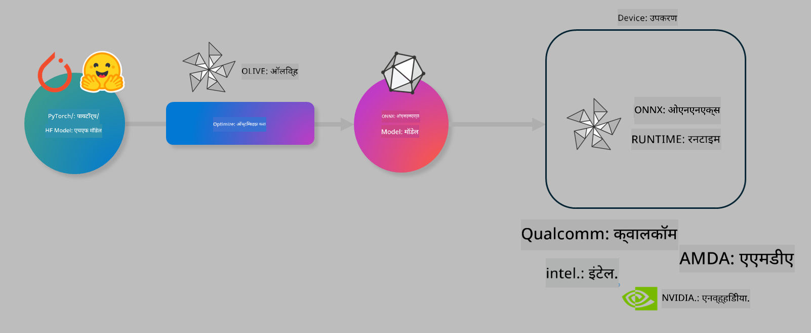

<!--
CO_OP_TRANSLATOR_METADATA:
{
  "original_hash": "6bbe47de3b974df7eea29dfeccf6032b",
  "translation_date": "2025-05-09T04:22:06+00:00",
  "source_file": "code/03.Finetuning/olive-lab/readme.md",
  "language_code": "mr"
}
-->
# Lab. ऑन-डिव्हाइस इन्फरन्ससाठी AI मॉडेल्स ऑप्टिमाइझ करा

## परिचय

> [!IMPORTANT]  
> या लॅबसाठी **Nvidia A10 किंवा A100 GPU** आणि त्यासंबंधित ड्रायव्हर्स व CUDA टूलकिट (आवृत्ती 12+) इन्स्टॉल केलेले असणे आवश्यक आहे.

> [!NOTE]  
> ही लॅब **35 मिनिटांची** आहे जी OLIVE वापरून ऑन-डिव्हाइस इन्फरन्ससाठी मॉडेल ऑप्टिमायझेशनच्या मूलभूत संकल्पनांचा प्रत्यक्ष अनुभव देईल.

## शिकण्याचे उद्दिष्टे

या लॅबच्या शेवटी, तुम्ही OLIVE वापरून:

- AWQ क्वांटायझेशन पद्धत वापरून AI मॉडेल क्वांटायझ करू शकाल.
- विशिष्ट टास्कसाठी AI मॉडेल फाइन-ट्यून करू शकाल.
- ONNX Runtime वर प्रभावी ऑन-डिव्हाइस इन्फरन्ससाठी LoRA अ‍ॅडॉप्टर्स (फाइन-ट्यून केलेले मॉडेल) जनरेट करू शकाल.

### Olive म्हणजे काय

Olive (*O*NNX *live*) ही एक मॉडेल ऑप्टिमायझेशन टूलकिट आहे ज्यासोबत CLI दिलेला आहे, ज्यामुळे तुम्ही ONNX runtime +++https://onnxruntime.ai+++ साठी गुणवत्ता आणि कामगिरीसह मॉडेल्स तयार करू शकता.



Olive मध्ये इनपुट सामान्यतः PyTorch किंवा Hugging Face मॉडेल असतो आणि आउटपुट म्हणजे ऑप्टिमाइझ्ड ONNX मॉडेल जे डिव्हाइस (डिप्लॉयमेंट टार्गेट) वर ONNX runtime चालवते. Olive मॉडेलला डिप्लॉयमेंट टार्गेटच्या AI अ‍ॅक्सेलरेटर (NPU, GPU, CPU) नुसार ऑप्टिमाइझ करते, जसे Qualcomm, AMD, Nvidia किंवा Intel सारख्या हार्डवेअर विक्रेत्यांकडून.

Olive एक *workflow* चालवते, जी एक क्रमबद्ध साखळी असते ज्यात वेगवेगळ्या मॉडेल ऑप्टिमायझेशन टास्क्स (ज्याला *passes* म्हणतात) असतात - उदा. मॉडेल कंप्रेशन, ग्राफ कॅप्चर, क्वांटायझेशन, ग्राफ ऑप्टिमायझेशन. प्रत्येक pass चे काही पॅरामीटर्स असतात जे उत्तम मेट्रिक्स (जसे अचूकता आणि लेटन्सी) साधण्यासाठी ट्यून करता येतात, जे संबंधित evaluator द्वारे मोजले जातात. Olive एक सर्च स्ट्रॅटेजी वापरते ज्यामध्ये सर्च अल्गोरिदम प्रत्येक pass किंवा pass च्या समूहाला एकाच वेळी ऑटो-ट्यून करते.

#### Olive चे फायदे

- ग्राफ ऑप्टिमायझेशन, कंप्रेशन आणि क्वांटायझेशनसाठी वेगवेगळ्या तंत्रांचा trial-and-error मॅन्युअल प्रयोग करण्याचा त्रास आणि वेळ कमी करा. तुमचे गुणवत्ता आणि कामगिरीचे बंधन निश्चित करा आणि Olive आपोआप सर्वोत्तम मॉडेल शोधून देईल.
- **40+ अंगभूत मॉडेल ऑप्टिमायझेशन कॉम्पोनंट्स** जे क्वांटायझेशन, कंप्रेशन, ग्राफ ऑप्टिमायझेशन आणि फाइनट्यूनिंगमधील अत्याधुनिक तंत्रे कव्हर करतात.
- सामान्य मॉडेल ऑप्टिमायझेशन टास्कसाठी सोपी CLI. उदा. olive quantize, olive auto-opt, olive finetune.
- मॉडेल पॅकेजिंग आणि डिप्लॉयमेंट अंगभूत.
- **Multi LoRA सर्व्हिंग** साठी मॉडेल जनरेट करण्यास समर्थन.
- YAML/JSON वापरून वर्कफ्लोज तयार करून मॉडेल ऑप्टिमायझेशन आणि डिप्लॉयमेंट टास्क्सचे आयोजन करा.
- **Hugging Face** आणि **Azure AI** इंटिग्रेशन.
- खर्च वाचवण्यासाठी अंगभूत **कॅशिंग** यंत्रणा.

## लॅब सूचना

> [!NOTE]  
> कृपया खात्री करा की तुम्ही Azure AI Hub आणि प्रोजेक्ट तयार केले आहेत आणि Lab 1 प्रमाणे तुमचा A100 compute सेटअप केला आहे.

### Step 0: तुमच्या Azure AI Compute शी कनेक्ट करा

तुम्ही VS Code च्या रिमोट फीचरचा वापर करून Azure AI compute शी कनेक्ट होणार आहात.

1. तुमचा **VS Code** डेस्कटॉप अ‍ॅप्लिकेशन उघडा:  
2. **Shift+Ctrl+P** वापरून **command palette** उघडा  
3. कमांड पॅलेटमध्ये **AzureML - remote: Connect to compute instance in New Window** शोधा.  
4. ऑन-स्क्रीन सूचनांचे पालन करा आणि Compute शी कनेक्ट व्हा. यामध्ये तुमची Azure Subscription, Resource Group, Project आणि Lab 1 मध्ये सेट केलेले Compute नाव निवडावे लागेल.  
5. एकदा Azure ML Compute नोडशी कनेक्ट झाल्यावर, ते Visual Code च्या **खाली डाव्या कोपऱ्यात** दिसेल `><Azure ML: Compute Name`

### Step 1: हा repo क्लोन करा

VS Code मध्ये, **Ctrl+J** वापरून नवीन टर्मिनल उघडा आणि हा repo क्लोन करा:

टर्मिनलमध्ये तुम्हाला खालीलप्रमाणे प्रॉम्प्ट दिसेल

```
azureuser@computername:~/cloudfiles/code$ 
```  
सोल्यूशन क्लोन करा  

```bash
cd ~/localfiles
git clone https://github.com/microsoft/phi-3cookbook.git
```

### Step 2: VS Code मध्ये फोल्डर उघडा

टर्मिनलमध्ये खालील कमांड चालवा ज्यामुळे नवीन विंडोमध्ये फोल्डर उघडेल:

```bash
code phi-3cookbook/code/04.Finetuning/Olive-lab
```

किंवा तुम्ही **File** > **Open Folder** निवडूनही फोल्डर उघडू शकता.

### Step 3: Dependencies

VS Code मध्ये तुमच्या Azure AI Compute Instance मध्ये टर्मिनल उघडा (टिप: **Ctrl+J**) आणि खालील कमांड्स चालवून आवश्यक dependencies इन्स्टॉल करा:

```bash
conda create -n olive-ai python=3.11 -y
conda activate olive-ai
pip install -r requirements.txt
az extension remove -n azure-cli-ml
az extension add -n ml
```

> [!NOTE]  
> सर्व dependencies इन्स्टॉल होण्यासाठी सुमारे ~5 मिनिटे लागतील.

या लॅबमध्ये तुम्ही मॉडेल्स Azure AI Model catalog मध्ये डाउनलोड आणि अपलोड करणार आहात. त्यामुळे मॉडेल कॅटलॉगमध्ये प्रवेशासाठी तुम्हाला Azure मध्ये लॉगिन करावे लागेल:

```bash
az login
```

> [!NOTE]  
> लॉगिन करताना तुम्हाला तुमची subscription निवडायला विचारले जाईल. लॅबसाठी दिलेली subscription निवडा.

### Step 4: Olive कमांड्स चालवा

VS Code मध्ये Azure AI Compute Instance च्या टर्मिनलमध्ये `olive-ai` conda environment सक्रिय करा:

```bash
conda activate olive-ai
```

यानंतर, खालील Olive कमांड्स टर्मिनलवर चालवा.

1. **डेटा तपासा:** या उदाहरणात, तुम्ही Phi-3.5-Mini मॉडेल फाइन-ट्यून करणार आहात ज्यामुळे तो प्रवासाशी संबंधित प्रश्नांची उत्तरे देण्यात विशेष होईल. खालील कोड dataset चे पहिले काही रेकॉर्ड JSON lines फॉरमॅटमध्ये दाखवतो:

    ```bash
    head data/data_sample_travel.jsonl
    ```

1. **मॉडेल क्वांटायझ करा:** मॉडेल ट्रेनिंगपूर्वी खालील कमांडने Active Aware Quantization (AWQ) +++https://arxiv.org/abs/2306.00978+++ वापरून क्वांटायझेशन करा. AWQ मॉडेलच्या वजनांना क्वांटायझ करताना इन्फरन्स दरम्यान तयार होणाऱ्या अ‍ॅक्टिव्हेशन्सचा विचार करते. यामुळे क्वांटायझेशन प्रक्रियेत अ‍ॅक्टिव्हेशन्समधील वास्तविक डेटा वितरण लक्षात घेतले जाते, ज्यामुळे पारंपारिक वजन क्वांटायझेशन पद्धतींपेक्षा अचूकता जास्त टिकून राहते.

    ```bash
    olive quantize \
       --model_name_or_path microsoft/Phi-3.5-mini-instruct \
       --trust_remote_code \
       --algorithm awq \
       --output_path models/phi/awq \
       --log_level 1
    ```

    AWQ क्वांटायझेशन पूर्ण होण्यासाठी सुमारे **~8 मिनिटे** लागतात, ज्यामुळे मॉडेलचा आकार सुमारे **~7.5GB वरून ~2.5GB** पर्यंत कमी होतो.

    या लॅबमध्ये, आम्ही तुम्हाला Hugging Face मधील मॉडेल्स (उदा. `microsoft/Phi-3.5-mini-instruct`). However, Olive also allows you to input models from the Azure AI catalog by updating the `model_name_or_path` argument to an Azure AI asset ID (for example:  `azureml://registries/azureml/models/Phi-3.5-mini-instruct/versions/4`). 

1. **Train the model:** Next, the `olive finetune` कमांडने क्वांटायझ केलेले मॉडेल फाइन-ट्यून करते. क्वांटायझेशन नंतर नव्हे तर फाइन-ट्यूनिंगपूर्वी केल्यास अचूकता सुधारते कारण फाइन-ट्यूनिंग प्रक्रियेद्वारे क्वांटायझेशनमुळे झालेली काही हानी भरून काढली जाते.

    ```bash
    olive finetune \
        --method lora \
        --model_name_or_path models/phi/awq \
        --data_files "data/data_sample_travel.jsonl" \
        --data_name "json" \
        --text_template "<|user|>\n{prompt}<|end|>\n<|assistant|>\n{response}<|end|>" \
        --max_steps 100 \
        --output_path ./models/phi/ft \
        --log_level 1
    ```

    फाइन-ट्यूनिंग (100 स्टेप्ससह) पूर्ण होण्यासाठी सुमारे **~6 मिनिटे** लागतात.

1. **ऑप्टिमाइझ करा:** मॉडेल ट्रेन झाल्यानंतर, Olive च्या `auto-opt` command, which will capture the ONNX graph and automatically perform a number of optimizations to improve the model performance for CPU by compressing the model and doing fusions. It should be noted, that you can also optimize for other devices such as NPU or GPU by just updating the `--device` and `--provider` अर्ग्युमेंट्स वापरून मॉडेल ऑप्टिमाइझ करा - पण या लॅबसाठी CPU वापरू.

    ```bash
    olive auto-opt \
       --model_name_or_path models/phi/ft/model \
       --adapter_path models/phi/ft/adapter \
       --device cpu \
       --provider CPUExecutionProvider \
       --use_ort_genai \
       --output_path models/phi/onnx-ao \
       --log_level 1
    ```

    ऑप्टिमायझेशन पूर्ण होण्यासाठी सुमारे **~5 मिनिटे** लागतात.

### Step 5: मॉडेल इन्फरन्सचे जलद चाचणी

मॉडेल इन्फरन्स टेस्ट करण्यासाठी तुमच्या फोल्डरमध्ये **app.py** नावाचा Python फाइल तयार करा आणि खालील कोड कॉपी-पेस्ट करा:

```python
import onnxruntime_genai as og
import numpy as np

print("loading model and adapters...", end="", flush=True)
model = og.Model("models/phi/onnx-ao/model")
adapters = og.Adapters(model)
adapters.load("models/phi/onnx-ao/model/adapter_weights.onnx_adapter", "travel")
print("DONE!")

tokenizer = og.Tokenizer(model)
tokenizer_stream = tokenizer.create_stream()

params = og.GeneratorParams(model)
params.set_search_options(max_length=100, past_present_share_buffer=False)
user_input = "what is the best thing to see in chicago"
params.input_ids = tokenizer.encode(f"<|user|>\n{user_input}<|end|>\n<|assistant|>\n")

generator = og.Generator(model, params)

generator.set_active_adapter(adapters, "travel")

print(f"{user_input}")

while not generator.is_done():
    generator.compute_logits()
    generator.generate_next_token()

    new_token = generator.get_next_tokens()[0]
    print(tokenizer_stream.decode(new_token), end='', flush=True)

print("\n")
```

खालीलप्रमाणे कोड चालवा:

```bash
python app.py
```

### Step 6: मॉडेल Azure AI मध्ये अपलोड करा

मॉडेल Azure AI मॉडेल रिपॉझिटरीमध्ये अपलोड केल्याने ते तुमच्या डेव्हलपमेंट टीममधील इतर सदस्यांसोबत शेअर करता येते आणि मॉडेलच्या आवृत्ती नियंत्रणाचे व्यवस्थापन होते. मॉडेल अपलोड करण्यासाठी खालील कमांड चालवा:

> [!NOTE]  
> `{}` placeholders with the name of your resource group and Azure AI Project Name. 

To find your resource group `` मध्ये तुमचा resourceGroup आणि Azure AI प्रोजेक्टचे नाव अपडेट करा आणि खालील कमांड चालवा

```
az ml workspace show
```

किंवा +++ai.azure.com+++ वर जाऊन **management center** > **project** > **overview** निवडा.

`{}` प्लेसहोल्डर्समध्ये तुमच्या resource group आणि Azure AI प्रोजेक्टचे नाव भरा.

```bash
az ml model create \
    --name ft-for-travel \
    --version 1 \
    --path ./models/phi/onnx-ao \
    --resource-group {RESOURCE_GROUP_NAME} \
    --workspace-name {PROJECT_NAME}
```

त्यानंतर तुम्ही अपलोड केलेले मॉडेल पाहू शकता आणि https://ml.azure.com/model/list येथे मॉडेल डिप्लॉय करू शकता.

**अस्वीकरण**:  
हा दस्तऐवज AI भाषांतर सेवा [Co-op Translator](https://github.com/Azure/co-op-translator) चा वापर करून भाषांतरित केला आहे. आम्ही अचूकतेसाठी प्रयत्न करतो, तरी कृपया लक्षात ठेवा की स्वयंचलित भाषांतरांमध्ये चुका किंवा अचूकतेच्या त्रुटी असू शकतात. मूळ दस्तऐवज त्याच्या स्थानिक भाषेत अधिकृत स्रोत मानला जावा. महत्त्वाची माहिती असल्यास, व्यावसायिक मानवी भाषांतर शिफारस केले जाते. या भाषांतराचा वापर करून झालेल्या कोणत्याही गैरसमजुती किंवा चुकीच्या अर्थ लावण्याबद्दल आम्ही जबाबदार नाही.