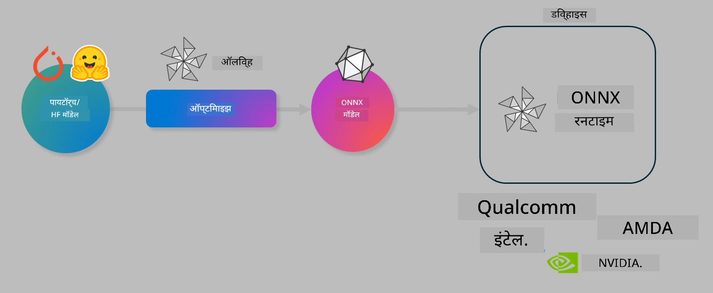

# लॅब. ऑन-डिव्हाइस इन्फरन्ससाठी AI मॉडेल्सचे ऑप्टिमायझेशन

## परिचय

> [!IMPORTANT]
> या लॅबसाठी **Nvidia A10 किंवा A100 GPU** आणि संबंधित ड्रायव्हर्स व CUDA टूलकिट (आवृत्ती 12+) आवश्यक आहे.

> [!NOTE]
> ही एक **35 मिनिटांची** लॅब आहे जी OLIVE वापरून ऑन-डिव्हाइस इन्फरन्ससाठी मॉडेल ऑप्टिमायझेशनच्या मुख्य संकल्पनांचा प्रत्यक्ष अनुभव देईल.

## शिकण्याचे उद्दिष्टे

या लॅबच्या शेवटी, तुम्ही OLIVE वापरून खालील गोष्टी करू शकाल:

- AWQ क्वांटायझेशन पद्धत वापरून AI मॉडेल क्वांटायझ करणे.
- विशिष्ट कार्यासाठी AI मॉडेल फाइन-ट्यून करणे.
- ONNX Runtime वर कार्यक्षम ऑन-डिव्हाइस इन्फरन्ससाठी LoRA अ‍ॅडॉप्टर्स (फाइन-ट्यून केलेले मॉडेल) तयार करणे.

### Olive म्हणजे काय

Olive (*O*NNX *live*) हा एक मॉडेल ऑप्टिमायझेशन टूलकिट आहे ज्यासोबत CLI देखील आहे, ज्यामुळे तुम्ही ONNX runtime +++https://onnxruntime.ai+++ साठी गुणवत्ता आणि कार्यक्षमतेसह मॉडेल्स वितरित करू शकता.



Olive मध्ये इनपुट सहसा PyTorch किंवा Hugging Face मॉडेल असते आणि आउटपुट म्हणजे ऑप्टिमायझ केलेले ONNX मॉडेल जे ONNX runtime चालवणाऱ्या डिव्हाइसवर (डिप्लॉयमेंट टार्गेट) चालवले जाते. Olive मॉडेलला डिप्लॉयमेंट टार्गेटच्या AI अ‍ॅक्सेलरेटरसाठी (NPU, GPU, CPU) ऑप्टिमायझ करेल, जे Qualcomm, AMD, Nvidia किंवा Intel सारख्या हार्डवेअर विक्रेत्याद्वारे पुरवले जाते.

Olive एक *workflow* चालवते, जे एक क्रमबद्ध साखळी असते ज्यात वैयक्तिक मॉडेल ऑप्टिमायझेशन टास्क्स असतात ज्याला *passes* म्हणतात - उदाहरणार्थ: मॉडेल कंप्रेशन, ग्राफ कॅप्चर, क्वांटायझेशन, ग्राफ ऑप्टिमायझेशन. प्रत्येक पासचे काही पॅरामीटर्स असतात जे सर्वोत्तम मेट्रिक्स (जसे अचूकता आणि विलंब) साध्य करण्यासाठी ट्यून करता येतात, जे संबंधित मूल्यांकनकर्त्याद्वारे तपासले जातात. Olive एक शोध धोरण वापरते जे प्रत्येक पास किंवा पासेसच्या संचाला एकेक करून किंवा एकत्रितपणे ऑटो-ट्यून करण्यासाठी शोध अल्गोरिदम वापरते.

#### Olive चे फायदे

- ग्राफ ऑप्टिमायझेशन, कंप्रेशन आणि क्वांटायझेशनसाठी वेगवेगळ्या तंत्रांसह मॅन्युअल प्रयोग करताना येणारी त्रास आणि वेळ कमी करा. तुमच्या गुणवत्ता आणि कार्यक्षमता मर्यादा ठरवा आणि Olive आपोआप सर्वोत्तम मॉडेल शोधून देईल.
- क्वांटायझेशन, कंप्रेशन, ग्राफ ऑप्टिमायझेशन आणि फाइनट्यूनिंगमधील अत्याधुनिक तंत्रांसाठी **40+ अंगभूत मॉडेल ऑप्टिमायझेशन घटक**.
- सामान्य मॉडेल ऑप्टिमायझेशन टास्कसाठी सोपा CLI. उदाहरणार्थ, olive quantize, olive auto-opt, olive finetune.
- मॉडेल पॅकेजिंग आणि डिप्लॉयमेंट अंगभूत.
- **मल्टी LoRA सर्व्हिंग** साठी मॉडेल तयार करण्यास समर्थन.
- YAML/JSON वापरून वर्कफ्लोज तयार करा ज्याद्वारे मॉडेल ऑप्टिमायझेशन आणि डिप्लॉयमेंट टास्क्सचे समन्वय करता येतो.
- **Hugging Face** आणि **Azure AI** एकत्रीकरण.
- खर्च वाचवण्यासाठी अंगभूत **कॅशिंग** यंत्रणा.

## लॅब सूचना

> [!NOTE]
> कृपया खात्री करा की तुम्ही तुमचा Azure AI Hub आणि प्रोजेक्ट तयार केला आहे आणि Lab 1 प्रमाणे तुमचा A100 compute सेटअप केला आहे.

### Step 0: तुमच्या Azure AI Compute शी कनेक्ट व्हा

तुम्ही **VS Code** मधील रिमोट फिचर वापरून Azure AI compute शी कनेक्ट व्हाल.

1. तुमचा **VS Code** डेस्कटॉप अ‍ॅप्लिकेशन उघडा:
2. **Shift+Ctrl+P** वापरून **command palette** उघडा.
3. कमांड पॅलेटमध्ये शोधा **AzureML - remote: Connect to compute instance in New Window**.
4. ऑन-स्क्रीन सूचनांचे पालन करा ज्यात तुमची Azure Subscription, Resource Group, Project आणि Lab 1 मध्ये सेट केलेले Compute नाव निवडावे लागेल.
5. एकदा Azure ML Compute नोडशी कनेक्ट झाल्यावर, ते Visual Code च्या **खाली डाव्या कोपऱ्यात** `><Azure ML: Compute Name` म्हणून दिसेल.

### Step 1: हा रेपो क्लोन करा

VS Code मध्ये, नवीन टर्मिनल उघडण्यासाठी **Ctrl+J** दाबा आणि हा रेपो क्लोन करा:

टर्मिनलमध्ये तुम्हाला प्रॉम्प्ट दिसेल

```
azureuser@computername:~/cloudfiles/code$ 
```  
सोल्यूशन क्लोन करा

```bash
cd ~/localfiles
git clone https://github.com/microsoft/phi-3cookbook.git
```

### Step 2: VS Code मध्ये फोल्डर उघडा

टर्मिनलमध्ये खालील कमांड चालवा ज्यामुळे नवीन विंडोमध्ये VS Code उघडेल:

```bash
code phi-3cookbook/code/04.Finetuning/Olive-lab
```

किंवा तुम्ही **File** > **Open Folder** निवडून फोल्डर उघडू शकता.

### Step 3: Dependencies

VS Code मध्ये Azure AI Compute Instance मध्ये टर्मिनल उघडा (टिप: **Ctrl+J**) आणि खालील कमांड्स चालवून dependencies इन्स्टॉल करा:

```bash
conda create -n olive-ai python=3.11 -y
conda activate olive-ai
pip install -r requirements.txt
az extension remove -n azure-cli-ml
az extension add -n ml
```

> [!NOTE]
> सर्व dependencies इन्स्टॉल होण्यासाठी सुमारे 5 मिनिटे लागतील.

या लॅबमध्ये तुम्ही Azure AI Model catalog मध्ये मॉडेल्स डाउनलोड आणि अपलोड कराल. त्यामुळे मॉडेल कॅटलॉगमध्ये प्रवेशासाठी तुम्हाला Azure मध्ये लॉगिन करावे लागेल:

```bash
az login
```

> [!NOTE]
> लॉगिन करताना तुम्हाला तुमची सबस्क्रिप्शन निवडण्यास सांगितले जाईल. कृपया लॅबसाठी दिलेली सबस्क्रिप्शन निवडा.

### Step 4: Olive कमांड्स चालवा

VS Code मध्ये Azure AI Compute Instance मध्ये टर्मिनल उघडा (टिप: **Ctrl+J**) आणि `olive-ai` कोंडा एन्व्हायर्नमेंट सक्रिय आहे याची खात्री करा:

```bash
conda activate olive-ai
```

नंतर खालील Olive कमांड्स कमांड लाइनवर चालवा.

1. **डेटा तपासा:** या उदाहरणात, तुम्ही Phi-3.5-Mini मॉडेल फाइन-ट्यून करणार आहात जे प्रवासाशी संबंधित प्रश्नांची उत्तरे देण्यात विशेष असेल. खालील कोड JSON lines फॉरमॅटमधील डेटासेटमधील पहिले काही रेकॉर्ड दाखवतो:

    ```bash
    head data/data_sample_travel.jsonl
    ```

2. **मॉडेल क्वांटायझ करा:** मॉडेल ट्रेनिंगपूर्वी खालील कमांडने Active Aware Quantization (AWQ) +++https://arxiv.org/abs/2306.00978+++ नावाच्या तंत्राचा वापर करून मॉडेल क्वांटायझ करा. AWQ क्वांटायझेशनमध्ये इन्फरन्स दरम्यान तयार होणाऱ्या अ‍ॅक्टिव्हेशन्सचा विचार करून मॉडेलचे वजन क्वांटायझ केले जाते. यामुळे पारंपरिक वजन क्वांटायझेशनच्या तुलनेत अचूकता अधिक चांगली राखली जाते.

    ```bash
    olive quantize \
       --model_name_or_path microsoft/Phi-3.5-mini-instruct \
       --trust_remote_code \
       --algorithm awq \
       --output_path models/phi/awq \
       --log_level 1
    ```

    AWQ क्वांटायझेशन पूर्ण होण्यासाठी सुमारे **8 मिनिटे** लागतात, ज्यामुळे मॉडेलचा आकार सुमारे **7.5GB वरून 2.5GB पर्यंत कमी होतो**.

    या लॅबमध्ये आम्ही Hugging Face कडून मॉडेल इनपुट कसे करायचे ते दाखवत आहोत (उदा. `microsoft/Phi-3.5-mini-instruct`). मात्र, Olive तुम्हाला Azure AI कॅटलॉगमधील मॉडेल्स वापरण्याची परवानगी देखील देते, ज्यासाठी `model_name_or_path` आर्ग्युमेंटमध्ये Azure AI asset ID (उदा. `azureml://registries/azureml/models/Phi-3.5-mini-instruct/versions/4`) अपडेट करा.

3. **मॉडेल ट्रेन करा:** नंतर, `olive finetune` कमांड क्वांटायझ केलेले मॉडेल फाइन-ट्यून करते. क्वांटायझेशन नंतर नव्हे तर *पूर्वी* फाइन-ट्यून केल्याने अचूकता सुधारते कारण फाइन-ट्यूनिंग क्वांटायझेशनमुळे झालेला काहीसा नुकसान भरून काढतो.

    ```bash
    olive finetune \
        --method lora \
        --model_name_or_path models/phi/awq \
        --data_files "data/data_sample_travel.jsonl" \
        --data_name "json" \
        --text_template "<|user|>\n{prompt}<|end|>\n<|assistant|>\n{response}<|end|>" \
        --max_steps 100 \
        --output_path ./models/phi/ft \
        --log_level 1
    ```

    फाइन-ट्यूनिंग पूर्ण होण्यासाठी सुमारे **6 मिनिटे** लागतात (100 स्टेप्ससह).

4. **ऑप्टिमायझ करा:** मॉडेल ट्रेन झाल्यानंतर, Olive च्या `auto-opt` कमांडने मॉडेल ऑप्टिमायझ करा, ज्यामुळे ONNX ग्राफ कॅप्चर होतो आणि CPU साठी मॉडेल कंप्रेस करून व फ्युजन करून कार्यक्षमता सुधारली जाते. लक्षात ठेवा, तुम्ही `--device` आणि `--provider` आर्ग्युमेंट्स अपडेट करून NPU किंवा GPU साठी देखील ऑप्टिमायझ करू शकता, पण या लॅबसाठी CPU वापरू.

    ```bash
    olive auto-opt \
       --model_name_or_path models/phi/ft/model \
       --adapter_path models/phi/ft/adapter \
       --device cpu \
       --provider CPUExecutionProvider \
       --use_ort_genai \
       --output_path models/phi/onnx-ao \
       --log_level 1
    ```

    ऑप्टिमायझेशन पूर्ण होण्यासाठी सुमारे **5 मिनिटे** लागतात.

### Step 5: मॉडेल इन्फरन्स जलद चाचणी

मॉडेल इन्फरन्स तपासण्यासाठी, तुमच्या फोल्डरमध्ये **app.py** नावाचा Python फाइल तयार करा आणि खालील कोड कॉपी-पेस्ट करा:

```python
import onnxruntime_genai as og
import numpy as np

print("loading model and adapters...", end="", flush=True)
model = og.Model("models/phi/onnx-ao/model")
adapters = og.Adapters(model)
adapters.load("models/phi/onnx-ao/model/adapter_weights.onnx_adapter", "travel")
print("DONE!")

tokenizer = og.Tokenizer(model)
tokenizer_stream = tokenizer.create_stream()

params = og.GeneratorParams(model)
params.set_search_options(max_length=100, past_present_share_buffer=False)
user_input = "what is the best thing to see in chicago"
params.input_ids = tokenizer.encode(f"<|user|>\n{user_input}<|end|>\n<|assistant|>\n")

generator = og.Generator(model, params)

generator.set_active_adapter(adapters, "travel")

print(f"{user_input}")

while not generator.is_done():
    generator.compute_logits()
    generator.generate_next_token()

    new_token = generator.get_next_tokens()[0]
    print(tokenizer_stream.decode(new_token), end='', flush=True)

print("\n")
```

कोड चालवण्यासाठी:

```bash
python app.py
```

### Step 6: मॉडेल Azure AI मध्ये अपलोड करा

मॉडेल Azure AI मॉडेल रिपॉझिटरीमध्ये अपलोड केल्याने ते तुमच्या विकास टीममधील इतर सदस्यांसोबत शेअर करता येते आणि मॉडेलचे व्हर्जन कंट्रोल देखील होते. मॉडेल अपलोड करण्यासाठी खालील कमांड चालवा:

> [!NOTE]
> `{}` प्लेसहोल्डर्समध्ये तुमच्या resource group आणि Azure AI प्रोजेक्टचे नाव भरा.

तुमचा resource group `"resourceGroup"` आणि Azure AI प्रोजेक्ट नाव शोधण्यासाठी खालील कमांड चालवा:

```
az ml workspace show
```

किंवा +++ai.azure.com+++ येथे जाऊन **management center** > **project** > **overview** निवडा.

`{}` प्लेसहोल्डर्समध्ये तुमच्या resource group आणि Azure AI प्रोजेक्टचे नाव भरा.

```bash
az ml model create \
    --name ft-for-travel \
    --version 1 \
    --path ./models/phi/onnx-ao \
    --resource-group {RESOURCE_GROUP_NAME} \
    --workspace-name {PROJECT_NAME}
```

त्यानंतर तुम्ही तुमचे अपलोड केलेले मॉडेल पाहू शकता आणि https://ml.azure.com/model/list येथे मॉडेल डिप्लॉय करू शकता.

**अस्वीकरण**:  
हा दस्तऐवज AI अनुवाद सेवा [Co-op Translator](https://github.com/Azure/co-op-translator) वापरून अनुवादित केला आहे. आम्ही अचूकतेसाठी प्रयत्नशील असलो तरी, कृपया लक्षात घ्या की स्वयंचलित अनुवादांमध्ये चुका किंवा अचूकतेची कमतरता असू शकते. मूळ दस्तऐवज त्याच्या स्थानिक भाषेत अधिकृत स्रोत मानला जावा. महत्त्वाच्या माहितीसाठी व्यावसायिक मानवी अनुवाद करण्याची शिफारस केली जाते. या अनुवादाच्या वापरामुळे उद्भवलेल्या कोणत्याही गैरसमजुती किंवा चुकीच्या अर्थलागी आम्ही जबाबदार नाही.