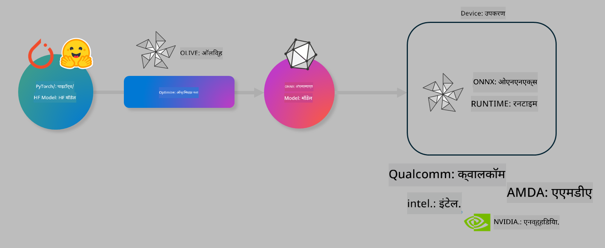

<!--
CO_OP_TRANSLATOR_METADATA:
{
  "original_hash": "6bbe47de3b974df7eea29dfeccf6032b",
  "translation_date": "2025-05-09T04:35:11+00:00",
  "source_file": "code/04.Finetuning/olive-lab/readme.md",
  "language_code": "mr"
}
-->
# Lab. Optimize AI models for on-device inference

## Introduction 

> [!IMPORTANT]
> या लॅबसाठी **Nvidia A10 किंवा A100 GPU** आणि त्याच्याशी संबंधित ड्रायव्हर्स व CUDA टूलकिट (आवृत्ती 12+) आवश्यक आहे.

> [!NOTE]
> ही एक **35 मिनिटांची** लॅब आहे जी तुम्हाला OLIVE वापरून ऑन-डिव्हाइस इन्फरन्ससाठी मॉडेल ऑप्टिमायझेशनच्या मुख्य संकल्पनांचा प्रत्यक्ष अनुभव देईल.

## Learning Objectives

या लॅबच्या शेवटी, तुम्ही OLIVE वापरून खालील गोष्टी करू शकाल:

- AWQ क्वांटायझेशन पद्धत वापरून AI मॉडेल क्वांटायझ करणे.
- विशिष्ट कामासाठी AI मॉडेल फाईन-ट्यून करणे.
- ONNX Runtime वर कार्यक्षम ऑन-डिव्हाइस इन्फरन्ससाठी LoRA अ‍ॅडॉप्टर्स (फाईन-ट्यून केलेले मॉडेल) तयार करणे.

### Olive म्हणजे काय

Olive (*O*NNX *live*) ही एक मॉडेल ऑप्टिमायझेशन टूलकिट आहे ज्यासोबत CLI देखील आहे, ज्यामुळे तुम्ही ONNX runtime +++https://onnxruntime.ai+++ साठी गुणवत्ता आणि कार्यक्षमतेसह मॉडेल वितरित करू शकता.



Olive ला इनपुट सामान्यतः PyTorch किंवा Hugging Face मॉडेल असते आणि आउटपुट म्हणजे ऑप्टिमायझ केलेले ONNX मॉडेल जे ONNX runtime चालवणाऱ्या डिव्हाइसवर (डिप्लॉयमेंट टार्गेट) चालते. Olive हार्डवेअर विक्रेत्यांद्वारे पुरवलेल्या AI ऍक्सेलेरेटर (NPU, GPU, CPU) साठी डिप्लॉयमेंट टार्गेटच्या अनुकूलतेनुसार मॉडेल ऑप्टिमाईज करते, जसे Qualcomm, AMD, Nvidia किंवा Intel.

Olive एक *workflow* चालवते, जे एक क्रमबद्ध मॉडेल ऑप्टिमायझेशन टास्क्सची मालिका असते, ज्याला *passes* म्हणतात - उदाहरणार्थ: मॉडेल कॉम्प्रेशन, ग्राफ कॅप्चर, क्वांटायझेशन, ग्राफ ऑप्टिमायझेशन. प्रत्येक pass मध्ये काही पॅरामीटर्स असतात जे सर्वोत्तम मेट्रिक्स (उदा. अचूकता आणि विलंब) साधण्यासाठी ट्यून करता येतात, जे संबंधित evaluator कडून मोजले जातात. Olive प्रत्येक pass किंवा pass च्या सेटसाठी ऑटो-ट्यूनिंगसाठी सर्च अल्गोरिदम वापरतो.

#### Olive चे फायदे

- **ग्राफ ऑप्टिमायझेशन, कॉम्प्रेशन आणि क्वांटायझेशनसाठी वेगवेगळ्या तंत्रांचा मॅन्युअल प्रयोग करताना होणारा त्रास आणि वेळ कमी करा.** तुमच्या गुणवत्ता आणि कार्यक्षमता अटी सेट करा आणि Olive तुमच्यासाठी सर्वोत्तम मॉडेल आपोआप शोधेल.
- **40+ अंगभूत मॉडेल ऑप्टिमायझेशन कॉम्पोनंट्स** ज्यात क्वांटायझेशन, कॉम्प्रेशन, ग्राफ ऑप्टिमायझेशन आणि फाईनट्यूनिंगमधील नवीनतम तंत्रे आहेत.
- सामान्य मॉडेल ऑप्टिमायझेशन टास्कसाठी **सोपे CLI**. उदाहरणार्थ, olive quantize, olive auto-opt, olive finetune.
- मॉडेल पॅकेजिंग आणि डिप्लॉयमेंट अंगभूत.
- **Multi LoRA serving** साठी मॉडेल जनरेटिंगला समर्थन.
- YAML/JSON वापरून workflows तयार करून मॉडेल ऑप्टिमायझेशन आणि डिप्लॉयमेंट टास्क्सचे आयोजन करा.
- **Hugging Face** आणि **Azure AI** एकत्रीकरण.
- **कॅशिंग** यंत्रणा अंगभूत जे खर्च वाचवते.

## Lab Instructions
> [!NOTE]
> कृपया खात्री करा की तुम्ही Azure AI Hub आणि Project तयार केले आहेत आणि Lab 1 प्रमाणे A100 compute सेटअप केले आहे.

### Step 0: तुमच्या Azure AI Compute शी कनेक्ट करा

तुम्ही **VS Code** मधील remote फिचर वापरून Azure AI compute शी कनेक्ट कराल.

1. तुमचा **VS Code** डेस्कटॉप अ‍ॅप उघडा:
1. **Shift+Ctrl+P** वापरून **command palette** उघडा.
1. command palette मध्ये **AzureML - remote: Connect to compute instance in New Window** शोधा.
1. ऑन-स्क्रीन सूचनांचे पालन करा, ज्यात Azure Subscription, Resource Group, Project आणि Lab 1 मध्ये सेट केलेले Compute नाव निवडणे समाविष्ट आहे.
1. Azure ML Compute नोडशी कनेक्ट झाल्यावर ते **Visual Code च्या तळाच्या डाव्या कोपऱ्यात** दिसेल `><Azure ML: Compute Name`

### Step 1: हा repo क्लोन करा

VS Code मध्ये, **Ctrl+J** वापरून नवीन टर्मिनल उघडा आणि हा repo क्लोन करा:

टर्मिनलमध्ये तुम्हाला प्रॉम्प्ट दिसेल

```
azureuser@computername:~/cloudfiles/code$ 
```
Solution क्लोन करा

```bash
cd ~/localfiles
git clone https://github.com/microsoft/phi-3cookbook.git
```

### Step 2: VS Code मध्ये फोल्डर उघडा

टर्मिनलमध्ये खालील कमांड चालवा, ज्यामुळे नवीन विंडोमध्ये VS Code मध्ये फोल्डर उघडेल:

```bash
code phi-3cookbook/code/04.Finetuning/Olive-lab
```

पर्यायीपणे, तुम्ही **File** > **Open Folder** निवडून फोल्डर उघडू शकता.

### Step 3: Dependencies

VS Code मधील तुमच्या Azure AI Compute Instance मध्ये नवीन टर्मिनल उघडा (टिप: **Ctrl+J**) आणि खालील कमांड्स चालवून dependencies इन्स्टॉल करा:

```bash
conda create -n olive-ai python=3.11 -y
conda activate olive-ai
pip install -r requirements.txt
az extension remove -n azure-cli-ml
az extension add -n ml
```

> [!NOTE]
> सर्व dependencies इन्स्टॉल होण्यासाठी सुमारे 5 मिनिटे लागतील.

या लॅबमध्ये तुम्ही मॉडेल Azure AI Model catalog मध्ये डाउनलोड आणि अपलोड कराल. त्यामुळे मॉडेल कॅटलॉगमध्ये प्रवेशासाठी, Azure मध्ये लॉगिन करा:

```bash
az login
```

> [!NOTE]
> लॉगिन करताना तुम्हाला सबस्क्रिप्शन निवडण्यास सांगितले जाईल. लॅबसाठी दिलेल्या सबस्क्रिप्शनची निवड करा.

### Step 4: Olive कमांड्स चालवा

VS Code मधील Azure AI Compute Instance मध्ये टर्मिनल उघडा (टिप: **Ctrl+J**) आणि `olive-ai` conda environment सक्रिय करा:

```bash
conda activate olive-ai
```

यानंतर खालील Olive कमांड्स चालवा.

1. **डेटा तपासा:** या उदाहरणात, तुम्ही Phi-3.5-Mini मॉडेल फाईन-ट्यून करणार आहात जे प्रवासाशी संबंधित प्रश्नांची उत्तरे देण्यात तज्ज्ञ होईल. खालील कोड डेटासेटमधील पहिल्या काही रेकॉर्ड्स (JSON lines फॉरमॅटमध्ये) दाखवतो:

    ```bash
    head data/data_sample_travel.jsonl
    ```
1. **मॉडेल क्वांटायझ करा:** ट्रेनिंगपूर्वी, खालील कमांड वापरून Active Aware Quantization (AWQ) +++https://arxiv.org/abs/2306.00978+++ या तंत्राचा वापर करून मॉडेल क्वांटायझ करा. AWQ मॉडेलच्या वेट्सना क्वांटायझ करताना इन्फरन्स दरम्यान निर्माण होणाऱ्या अॅक्टिव्हेशन्सचा विचार करते. यामुळे क्वांटायझेशन प्रक्रियेत वास्तविक डेटा वितरण लक्षात घेतले जाते, ज्यामुळे पारंपरिक वेट क्वांटायझेशन पद्धतींपेक्षा अचूकता जास्त टिकून राहते.

    ```bash
    olive quantize \
       --model_name_or_path microsoft/Phi-3.5-mini-instruct \
       --trust_remote_code \
       --algorithm awq \
       --output_path models/phi/awq \
       --log_level 1
    ```

    AWQ क्वांटायझेशन पूर्ण होण्यासाठी **सुमारे 8 मिनिटे** लागतात, ज्यामुळे मॉडेलचा आकार **सुमारे 7.5GB वरून 2.5GB पर्यंत कमी होतो**.

    या लॅबमध्ये आम्ही तुम्हाला Hugging Face कडून मॉडेल इनपुट कसे करायचे ते दाखवत आहोत (उदा. `microsoft/Phi-3.5-mini-instruct`). However, Olive also allows you to input models from the Azure AI catalog by updating the `model_name_or_path` argument to an Azure AI asset ID (for example:  `azureml://registries/azureml/models/Phi-3.5-mini-instruct/versions/4`). 

1. **Train the model:** Next, the `olive finetune` कमांड क्वांटायझ केलेले मॉडेल फाईन-ट्यून करते). फाईन-ट्यूनिंगपूर्वी मॉडेल क्वांटायझ केल्याने अचूकता सुधारते कारण फाईन-ट्यूनिंग क्वांटायझेशनमुळे झालेला काहीसा नुकसान भरून काढतो.

    ```bash
    olive finetune \
        --method lora \
        --model_name_or_path models/phi/awq \
        --data_files "data/data_sample_travel.jsonl" \
        --data_name "json" \
        --text_template "<|user|>\n{prompt}<|end|>\n<|assistant|>\n{response}<|end|>" \
        --max_steps 100 \
        --output_path ./models/phi/ft \
        --log_level 1
    ```

    फाईन-ट्यूनिंग (100 स्टेप्ससह) पूर्ण होण्यासाठी **सुमारे 6 मिनिटे** लागतात.

1. **ऑप्टिमाईज करा:** मॉडेल ट्रेन झाल्यानंतर, Olive च्या `auto-opt` command, which will capture the ONNX graph and automatically perform a number of optimizations to improve the model performance for CPU by compressing the model and doing fusions. It should be noted, that you can also optimize for other devices such as NPU or GPU by just updating the `--device` and `--provider` आर्ग्युमेंट्स वापरून मॉडेल ऑप्टिमाईज करा - पण या लॅबसाठी CPU वापरू.

    ```bash
    olive auto-opt \
       --model_name_or_path models/phi/ft/model \
       --adapter_path models/phi/ft/adapter \
       --device cpu \
       --provider CPUExecutionProvider \
       --use_ort_genai \
       --output_path models/phi/onnx-ao \
       --log_level 1
    ```

    ऑप्टिमायझेशन पूर्ण होण्यासाठी **सुमारे 5 मिनिटे** लागतात.

### Step 5: मॉडेल इन्फरन्सचा जलद चाचणी

मॉडेल इन्फरन्स तपासण्यासाठी, तुमच्या फोल्डरमध्ये **app.py** नावाचा Python फाइल तयार करा आणि खालील कोड कॉपी-पेस्ट करा:

```python
import onnxruntime_genai as og
import numpy as np

print("loading model and adapters...", end="", flush=True)
model = og.Model("models/phi/onnx-ao/model")
adapters = og.Adapters(model)
adapters.load("models/phi/onnx-ao/model/adapter_weights.onnx_adapter", "travel")
print("DONE!")

tokenizer = og.Tokenizer(model)
tokenizer_stream = tokenizer.create_stream()

params = og.GeneratorParams(model)
params.set_search_options(max_length=100, past_present_share_buffer=False)
user_input = "what is the best thing to see in chicago"
params.input_ids = tokenizer.encode(f"<|user|>\n{user_input}<|end|>\n<|assistant|>\n")

generator = og.Generator(model, params)

generator.set_active_adapter(adapters, "travel")

print(f"{user_input}")

while not generator.is_done():
    generator.compute_logits()
    generator.generate_next_token()

    new_token = generator.get_next_tokens()[0]
    print(tokenizer_stream.decode(new_token), end='', flush=True)

print("\n")
```

कोड चालवा:

```bash
python app.py
```

### Step 6: मॉडेल Azure AI मध्ये अपलोड करा

मॉडेल Azure AI मॉडेल रेपॉजिटरीमध्ये अपलोड केल्याने तो तुमच्या डेव्हलपमेंट टीममधील इतर सदस्यांसोबत शेअर करता येतो आणि मॉडेलच्या व्हर्जन कंट्रोलची सोय होते. मॉडेल अपलोड करण्यासाठी खालील कमांड चालवा:

> [!NOTE]
> `{}` placeholders with the name of your resource group and Azure AI Project Name. 

To find your resource group `` मध्ये तुमचा resourceGroup आणि Azure AI Project नाव अपडेट करा.

```
az ml workspace show
```

किंवा +++ai.azure.com+++ येथे जाऊन **management center** > **project** > **overview** निवडा.

`{}` प्लेसहोल्डर्स तुमच्या resource group आणि Azure AI Project च्या नावाने बदला.

```bash
az ml model create \
    --name ft-for-travel \
    --version 1 \
    --path ./models/phi/onnx-ao \
    --resource-group {RESOURCE_GROUP_NAME} \
    --workspace-name {PROJECT_NAME}
```

तुम्ही तुमचे अपलोड केलेले मॉडेल https://ml.azure.com/model/list येथे पाहू शकता आणि डिप्लॉय करू शकता.

**अस्वीकरण**:  
हा दस्तऐवज AI अनुवाद सेवा [Co-op Translator](https://github.com/Azure/co-op-translator) वापरून अनुवादित केला आहे. आम्ही अचूकतेसाठी प्रयत्नशील असलो तरी, कृपया लक्षात घ्या की स्वयंचलित अनुवादांमध्ये चुका किंवा अचूकतेची कमतरता असू शकते. मूळ दस्तऐवज त्याच्या मूळ भाषेत अधिकृत स्रोत मानला पाहिजे. महत्त्वाच्या माहितीसाठी व्यावसायिक मानवी अनुवाद करण्याची शिफारस केली जाते. या अनुवादाच्या वापरामुळे होणाऱ्या कोणत्याही गैरसमज किंवा चुकीच्या अर्थ लावण्याबद्दल आम्ही जबाबदार नाही.