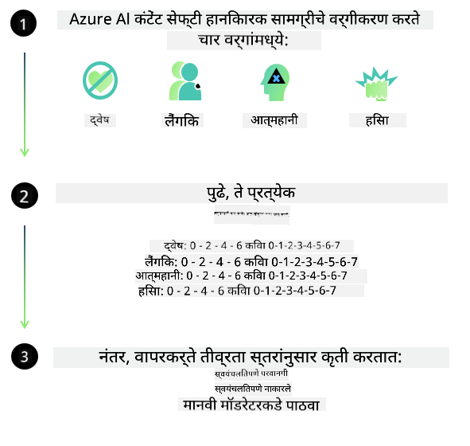

<!--
CO_OP_TRANSLATOR_METADATA:
{
  "original_hash": "c8273672cc57df2be675407a1383aaf0",
  "translation_date": "2025-05-09T05:48:06+00:00",
  "source_file": "md/01.Introduction/01/01.AISafety.md",
  "language_code": "mr"
}
-->
# Phi मॉडेल्ससाठी AI सुरक्षा  
Phi कुटुंबातील मॉडेल्स [Microsoft Responsible AI Standard](https://query.prod.cms.rt.microsoft.com/cms/api/am/binary/RE5cmFl) नुसार विकसित केले गेले आहेत, जे कंपनीव्यापी आवश्यकतांचा संच आहे आणि त्यामध्ये सहा मुख्य तत्त्वे आहेत: जबाबदारी, पारदर्शकता, न्याय्यपणा, विश्वासार्हता आणि सुरक्षा, गोपनीयता आणि सुरक्षा, तसेच समावेशीपणा, जे [Microsoft चे Responsible AI तत्त्वे](https://www.microsoft.com/ai/responsible-ai) बनवतात.  

पूर्वीच्या Phi मॉडेल्सप्रमाणे, बहुआयामी सुरक्षा मूल्यांकन आणि प्रशिक्षणानंतर सुरक्षा दृष्टिकोन अवलंबण्यात आला आहे, आणि या आवृत्तीच्या बहुभाषिक क्षमतांचा विचार करून अतिरिक्त उपाययोजना केल्या आहेत. आमचा सुरक्षा प्रशिक्षण आणि मूल्यांकन दृष्टिकोन, ज्यामध्ये अनेक भाषा आणि धोका वर्गांमध्ये चाचणी केली जाते, [Phi Safety Post-Training Paper](https://arxiv.org/abs/2407.13833) मध्ये स्पष्ट केला आहे. Phi मॉडेल्सना या दृष्टिकोनाचा फायदा होतो, पण विकासकांनी त्यांच्या विशिष्ट वापराच्या प्रकरणानुसार आणि सांस्कृतिक व भाषिक संदर्भानुसार जोखमींचे नकाशांकन, मोजमाप आणि कमी करण्याचे जबाबदारीने पालन करणे आवश्यक आहे.  

## सर्वोत्तम पद्धती  

इतर मॉडेल्सप्रमाणे, Phi कुटुंबातील मॉडेल्स कधी कधी अन्यायकारक, अविश्वसनीय किंवा आक्षेपार्ह वर्तन करू शकतात.  

SLM आणि LLM च्या काही मर्यादित वर्तनांबाबत लक्षात ठेवण्यासारखे मुद्दे:  

- **सेवेची गुणवत्ता:** Phi मॉडेल्स मुख्यत्वे इंग्रजी मजकूरावर प्रशिक्षित आहेत. इंग्रजी व्यतिरिक्त भाषा वापरल्यास कामगिरी कमी होऊ शकते. प्रशिक्षण डेटामध्ये कमी प्रतिनिधित्व असलेल्या इंग्रजी भाषेच्या प्रकारांमध्ये मानक अमेरिकन इंग्रजीच्या तुलनेत कामगिरी कमी होऊ शकते.  
- **हानिकारक प्रतिनिधित्व आणि पूर्वग्रहांची पुनरावृत्ती:** हे मॉडेल्स लोकांच्या गटांचे जास्त किंवा कमी प्रतिनिधित्व करू शकतात, काही गटांचे प्रतिनिधित्व मिटवू शकतात किंवा अपमानास्पद किंवा नकारात्मक पूर्वग्रहांना बळकटी देऊ शकतात. सुरक्षा प्रशिक्षणानंतरही, वेगवेगळ्या गटांच्या प्रतिनिधित्वातील फरक किंवा नकारात्मक पूर्वग्रहांच्या उदाहरणांचा प्रशिक्षण डेटामध्ये असलेला प्रभाव यामुळे या मर्यादा कायम राहू शकतात.  
- **अयोग्य किंवा आक्षेपार्ह सामग्री:** हे मॉडेल्स इतर प्रकारची अयोग्य किंवा आक्षेपार्ह सामग्री तयार करू शकतात, ज्यामुळे संवेदनशील संदर्भांसाठी अतिरिक्त उपायांशिवाय वापर करणे अनुचित ठरू शकते.  
- **माहितीची विश्वासार्हता:** भाषा मॉडेल्स कधी कधी अर्थहीन किंवा बनावट माहिती तयार करू शकतात, जी तार्किक वाटू शकते पण अचूक नसते किंवा जुनी असू शकते.  
- **कोडसाठी मर्यादित व्याप्ती:** Phi-3 चा बहुसंख्य प्रशिक्षण डेटा Python मध्ये आहे आणि सामान्य पॅकेजेस जसे की "typing, math, random, collections, datetime, itertools" वापरतो. जर मॉडेलने इतर पॅकेजेस वापरून Python स्क्रिप्ट्स किंवा इतर भाषांतील स्क्रिप्ट्स तयार केल्या, तर वापरकर्त्यांनी सर्व API वापरांची हाताने पडताळणी करण्याचा आम्ही आग्रह करतो.  

विकसकांनी जबाबदार AI सर्वोत्तम पद्धतींचे पालन करणे आवश्यक आहे आणि विशिष्ट वापर प्रकरणे संबंधित कायदे आणि नियमांचे पालन करतात याची खात्री करणे त्यांची जबाबदारी आहे (उदा. गोपनीयता, व्यापार इ.).  

## जबाबदार AI विचार  

इतर भाषा मॉडेल्सप्रमाणे, Phi सिरीज मॉडेल्स कधी कधी अन्यायकारक, अविश्वसनीय किंवा आक्षेपार्ह वर्तन करू शकतात. लक्षात ठेवण्यासारखे काही मर्यादित वर्तन:  

**सेवेची गुणवत्ता:** Phi मॉडेल्स मुख्यत्वे इंग्रजी मजकूरावर प्रशिक्षित आहेत. इंग्रजी व्यतिरिक्त भाषा वापरल्यास कामगिरी कमी होऊ शकते. प्रशिक्षण डेटामध्ये कमी प्रतिनिधित्व असलेल्या इंग्रजी भाषेच्या प्रकारांमध्ये मानक अमेरिकन इंग्रजीच्या तुलनेत कामगिरी कमी होऊ शकते.  

**हानिकारक प्रतिनिधित्व आणि पूर्वग्रहांची पुनरावृत्ती:** हे मॉडेल्स लोकांच्या गटांचे जास्त किंवा कमी प्रतिनिधित्व करू शकतात, काही गटांचे प्रतिनिधित्व मिटवू शकतात किंवा अपमानास्पद किंवा नकारात्मक पूर्वग्रहांना बळकटी देऊ शकतात. सुरक्षा प्रशिक्षणानंतरही, वेगवेगळ्या गटांच्या प्रतिनिधित्वातील फरक किंवा नकारात्मक पूर्वग्रहांच्या उदाहरणांचा प्रशिक्षण डेटामध्ये असलेला प्रभाव यामुळे या मर्यादा कायम राहू शकतात.  

**अयोग्य किंवा आक्षेपार्ह सामग्री:** हे मॉडेल्स इतर प्रकारची अयोग्य किंवा आक्षेपार्ह सामग्री तयार करू शकतात, ज्यामुळे संवेदनशील संदर्भांसाठी अतिरिक्त उपायांशिवाय वापर करणे अनुचित ठरू शकते.  
माहितीची विश्वासार्हता: भाषा मॉडेल्स कधी कधी अर्थहीन किंवा बनावट माहिती तयार करू शकतात, जी तार्किक वाटू शकते पण अचूक नसते किंवा जुनी असू शकते.  

**कोडसाठी मर्यादित व्याप्ती:** Phi-3 चा बहुसंख्य प्रशिक्षण डेटा Python मध्ये आहे आणि सामान्य पॅकेजेस जसे की "typing, math, random, collections, datetime, itertools" वापरतो. जर मॉडेलने इतर पॅकेजेस वापरून Python स्क्रिप्ट्स किंवा इतर भाषांतील स्क्रिप्ट्स तयार केल्या, तर वापरकर्त्यांनी सर्व API वापरांची हाताने पडताळणी करण्याचा आम्ही आग्रह करतो.  

विकसकांनी जबाबदार AI सर्वोत्तम पद्धतींचे पालन करणे आवश्यक आहे आणि विशिष्ट वापर प्रकरणे संबंधित कायदे आणि नियमांचे पालन करतात याची खात्री करणे त्यांची जबाबदारी आहे (उदा. गोपनीयता, व्यापार इ.). महत्त्वाच्या विचार करण्याच्या बाबी:  

**वाटप:** कायदेशीर स्थिती किंवा संसाधने किंवा जीवन संधींच्या वाटपावर परिणाम करणाऱ्या परिस्थितीसाठी मॉडेल्स योग्य नसू शकतात (उदा. घरखर्च, नोकरी, क्रेडिट इ.) जोखमीचे अधिक मूल्यांकन आणि अतिरिक्त पूर्वग्रह कमी करण्याच्या तंत्रांशिवाय.  

**उच्च जोखमीच्या परिस्थिती:** विकासकांनी अशा उच्च जोखमीच्या परिस्थितीत मॉडेल वापरण्याची योग्यतेचे मूल्यमापन करणे आवश्यक आहे जिथे अन्यायकारक, अविश्वसनीय किंवा आक्षेपार्ह उत्तरं फार महागडी पडू शकतात किंवा हानी होऊ शकते. यामध्ये संवेदनशील किंवा तज्ञ क्षेत्रातील सल्ला देणे समाविष्ट आहे जिथे अचूकता आणि विश्वासार्हता अत्यंत महत्त्वाची आहे (उदा. कायदेशीर किंवा आरोग्य सल्ला). वापर संदर्भानुसार अतिरिक्त संरक्षण उपाय अंमलात आणावेत.  

**माहितीचे गैरवापर:** मॉडेल्स चुकीची माहिती तयार करू शकतात. विकासकांनी पारदर्शकतेच्या सर्वोत्तम पद्धतींचे पालन करावे आणि अंतिम वापरकर्त्यांना AI प्रणालीशी संवाद साधत असल्याची माहिती द्यावी. अॅप्लिकेशन स्तरावर, विकासक वापर-प्रकरणानुसार संदर्भित माहितीवर आधारित प्रतिसाद निर्माण करण्यासाठी फीडबॅक यंत्रणा आणि पाइपलाईन्स तयार करू शकतात, ज्याला Retrieval Augmented Generation (RAG) म्हणतात.  

**हानिकारक सामग्रीची निर्मिती:** विकासकांनी त्यांच्या संदर्भासाठी उत्पादनांचे मूल्यमापन करावे आणि उपलब्ध सुरक्षा वर्गीकरण प्रणाली किंवा त्यांच्या वापर प्रकरणासाठी सानुकूल उपाय वापरावे.  

**गैरवापर:** फसवणूक, स्पॅम किंवा मालवेअर तयार करणे यांसारख्या इतर गैरवापराच्या प्रकारांची शक्यता असू शकते, आणि विकासकांनी त्यांचे अनुप्रयोग लागू कायदे आणि नियमांचे उल्लंघन करणार नाहीत याची खात्री करणे आवश्यक आहे.  

### फाइनट्युनिंग आणि AI सामग्री सुरक्षा  

मॉडेल फाइनट्युनिंग केल्यानंतर, आम्ही [Azure AI Content Safety](https://learn.microsoft.com/azure/ai-services/content-safety/overview) च्या उपाययोजना वापरण्याची जोरदार शिफारस करतो, ज्यामुळे मॉडेल्सद्वारे तयार होणारी सामग्री तपासली जाते, संभाव्य धोके, धमक्या आणि गुणवत्ता समस्या ओळखल्या आणि अवरोधित केल्या जातात.  

  

[Azure AI Content Safety](https://learn.microsoft.com/azure/ai-services/content-safety/overview) मजकूर आणि प्रतिमा सामग्री दोन्ही समर्थित करते. ते क्लाउड, डिस्कनेक्टेड कंटेनर्स आणि एज/एम्बेडेड डिव्हाइसेसवर तैनात केले जाऊ शकते.  

## Azure AI Content Safety चे आढावा  

Azure AI Content Safety सर्वांसाठी एकसारखे समाधान नाही; ते व्यवसायांच्या विशिष्ट धोरणांशी जुळवून घेण्यासाठी सानुकूल करता येते. शिवाय, त्याचे बहुभाषिक मॉडेल्स एकाच वेळी अनेक भाषा समजून घेऊ शकतात.  

  

- **Azure AI Content Safety**  
- **Microsoft Developer**  
- **5 व्हिडिओज**  

Azure AI Content Safety सेवा अनुप्रयोगांमध्ये आणि सेवांमध्ये हानिकारक वापरकर्त्याद्वारे निर्मित आणि AI निर्मित सामग्री शोधते. यात मजकूर आणि प्रतिमा API समाविष्ट आहेत जे हानिकारक किंवा अयोग्य सामग्री ओळखू शकतात.  

[AI Content Safety Playlist](https://www.youtube.com/playlist?list=PLlrxD0HtieHjaQ9bJjyp1T7FeCbmVcPkQ)

**अस्वीकरण**:  
हा दस्तऐवज AI अनुवाद सेवा [Co-op Translator](https://github.com/Azure/co-op-translator) चा वापर करून अनुवादित केला आहे. आम्ही अचूकतेसाठी प्रयत्न करतो, परंतु कृपया लक्षात ठेवा की स्वयंचलित अनुवादांमध्ये चुका किंवा अपूर्णता असू शकते. मूळ दस्तऐवज त्याच्या स्थानिक भाषेत अधिकृत स्रोत मानला पाहिजे. महत्त्वाच्या माहितीकरिता व्यावसायिक मानवी अनुवाद शिफारस केली जाते. या अनुवादाच्या वापरामुळे होणाऱ्या कोणत्याही गैरसमजुती किंवा चुकीसाठी आम्ही जबाबदार नाही.