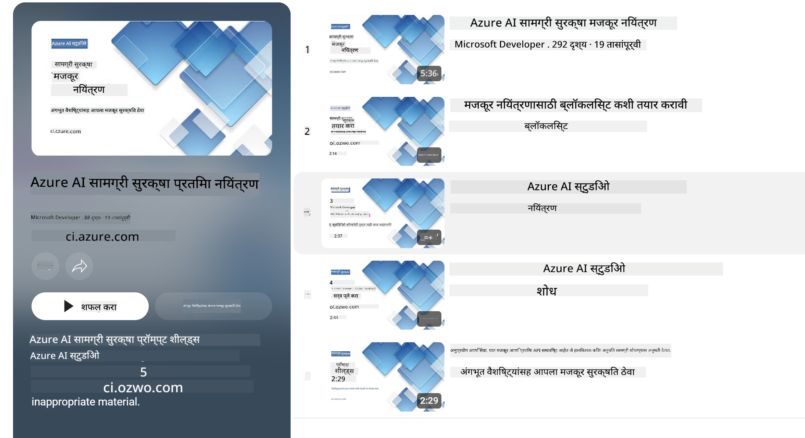

<!--
CO_OP_TRANSLATOR_METADATA:
{
  "original_hash": "839ccc4b3886ef10cfd4e64977f5792d",
  "translation_date": "2026-01-05T02:09:18+00:00",
  "source_file": "md/01.Introduction/01/01.AISafety.md",
  "language_code": "mr"
}
-->
# Phi मॉडेल्ससाठी एआय सुरक्षा
Phi कुटुंबातील मॉडेल [Microsoft Responsible AI Standard](https://www.microsoft.com/ai/principles-and-approach#responsible-ai-standard) यांच्या अनुरूप विकसित केले गेले आहेत, ही कंपनी-व्यापी आवश्यकता आहे जी खालील सहा तत्त्वांवर आधारित आहे: जबाबदारी, पारदर्शकता, न्यायसंगती, विश्वसनीयता आणि सुरक्षा, गोपनीयता आणि सुरक्षा, आणि समावेश, जे [Microsoft’s Responsible AI principles](https://www.microsoft.com/ai/responsible-ai) तयार करतात. 

इतर Phi मॉडेल्सप्रमाणे, बहु-आयामी सुरक्षा मूल्यमापन आणि प्रशिक्षणानंतरची सुरक्षा पद्धत स्वीकारली गेली आहे, आणि या प्रकाशनाच्या बहु-भाषिक क्षमतांचा विचार करण्यासाठी अतिरिक्त उपाय घेतले गेले आहेत. बहु-भाषिक आणि जोखमीच्या श्रेणींमध्ये चाचणी करून सुरक्षा प्रशिक्षण आणि मूल्यमापनाची आमची पद्धत [Phi Safety Post-Training Paper](https://arxiv.org/abs/2407.13833) मध्ये नमूद आहे. या पद्धतीमुळे Phi मॉडेल्सना फायदा होतो, परंतु विकसकांनी त्यांच्या विशिष्ट वापरप्रकरण आणि सांस्कृतिक व भाषिक संदर्भाशी संबंधित जोखमींचे नकाशांकन, मोजमाप आणि कमी करणे यांसह उत्तरदायी एआय सर्वोत्तम सराव अंमलात आणले पाहिजेत.

## सर्वोत्तम पद्धती

इतर मॉडेल्सप्रमाणे, Phi कुटुंबातील मॉडेल्स संभाव्यतः असमान, अविश्वसनीय किंवा आक्षेपार्ह पद्धतीने वागू शकतात.

SLM आणि LLM यांच्या काही मर्यादीत वर्तनांची माहिती असावी:

- **सेवेची गुणवत्ता:** Phi मॉडेल मुख्यत्वे इंग्रजी मजकुरावर प्रशिक्षित केले गेले आहेत. इंग्रजीव्यतिरिक्तच्या भाषांमध्ये कार्यक्षमता कमी असू शकते. प्रशिक्षण डेटामध्ये कमी प्रतिनिधित्व असलेल्या इंग्रजीच्या विविध आवृत्त्यांना मानक अमेरिकन इंग्रजीच्या तुलनेत कमी कार्यक्षमता अनुभवावी लागू शकते.
- **हानिकारक प्रतिनिधित्व आणि स्टीरिओटाइप्सचा कायम राहण्याचा परिणाम:** हे मॉडेल लोकांच्या गटांचे अति किंवा अपुरी प्रतिनिधित्व करू शकतात, काही गटांचे प्रतिनिधित्व मिटवू शकतात, किंवा अवमूल्यन करणारे किंवा नकारात्मक स्टीरिओटाइप्स बळकट करू शकतात. सुरक्षा प्रशिक्षणानंतरदेखील ही मर्यादा अद्याप उपस्थित राहू शकते कारण विविध गटांचा प्रतिनिधित्व वेगळ्या पातळ्यांवर असतो किंवा प्रशिक्षण डेटामध्ये नकारात्मक स्टीरिओटाइप्सची उदाहरणे वास्तविक जगातील पॅटर्न्स आणि सामाजिक पूर्वग्रह प्रतिबिंबित करतात.
- **अनुचित किंवा आक्षेपार्ह सामग्री:** ही मॉडेल्स इतर प्रकारची अनुचित किंवा आक्षेपार्ह सामग्री निर्माण करू शकतात, ज्यामुळे संवेदनशील संदर्भांसाठी वापर करण्यापूर्वी वापरप्रकरणाशी संबंधित अतिरिक्त प्रतिबंध नसेल तर लागू करणे अनुचित ठरू शकते.
Information Reliability: भाषा मॉडेल्स अर्थहीन सामग्री निर्माण करू शकतात किंवा अशी सामग्री बनवू शकतात जी तार्किक वाटू शकते परंतु अचूक नाही किंवा कालबाह्य आहे.
- **कोडसाठी मर्यादित व्याप्ती:** Phi-3 च्या प्रशिक्षण डेटाचे बहुतेक भाग Python वर आधारित आहेत आणि "typing, math, random, collections, datetime, itertools" सारख्या सामान्य पॅकेजेसचा वापर करतात. जर मॉडेलने इतर पॅकेजेस वापरणारे Python स्क्रिप्ट्स किंवा इतर भाषांमधील स्क्रिप्ट्स तयार केले तर आम्ही वापरकर्त्यांना सर्व API वापर हस्तचालितरीत्या पडताळण्याची शिफारस करतो.

विकसकांनी उत्तरदायी एआय सर्वोत्तम सराव लागू करावेत आणि विशिष्ट वापरप्रकरण संबंधित कायदे व नियम (उदा. गोपनीयता, व्यापार इत्यादी) पाळले जाण्याची जबाबदारी त्यांची आहे. 

## जबाबदार एआय विचार

इतर भाषा मॉडेल्सप्रमाणे, Phi सिरीज मॉडेल्स संभाव्यतः असमान, अविश्वसनीय किंवा आक्षेपार्ह पद्धतीने वागू शकतात. लक्षात ठेवण्याजोग्या काही मर्यादीत वर्तनांमध्ये समावेश आहे:

**सेवेची गुणवत्ता:** Phi मॉडेल मुख्यत्वे इंग्रजी मजकुरावर प्रशिक्षित केले गेले आहेत. इंग्रजीव्यतिरिक्तच्या भाषांमध्ये कार्यक्षमता कमी असू शकते. प्रशिक्षण डेटामध्ये कमी प्रतिनिधित्व असलेल्या इंग्रजीच्या विविध आवृत्त्यांना मानक अमेरिकन इंग्रजीच्या तुलनेत कमी कार्यक्षमता अनुभवावी लागू शकते.

**हानिकारक प्रतिनिधित्व आणि स्टीरिओटाइप्सचा कायम राहण्याचा परिणाम:** हे मॉडेल लोकांच्या गटांचे अति किंवा अपुरी प्रतिनिधित्व करू शकतात, काही गटांचे प्रतिनिधित्व मिटवू शकतात, किंवा अवमूल्यन करणारे किंवा नकारात्मक स्टीरिओटाइप्स बळकट करू शकतात. सुरक्षा प्रशिक्षणानंतरदेखील ही मर्यादा अद्याप उपस्थित राहू शकते कारण विविध गटांचा प्रतिनिधित्व वेगळ्या पातळ्यांवर असतो किंवा प्रशिक्षण डेटामध्ये नकारात्मक स्टीरिओटाइप्सची उदाहरणे वास्तविक जगातील पॅटर्न्स आणि सामाजिक पूर्वग्रह प्रतिबिंबित करतात.

**अनुचित किंवा आक्षेपार्ह सामग्री:** ही मॉडेल्स इतर प्रकारची अनुचित किंवा आक्षेपार्ह सामग्री निर्माण करू शकतात, ज्यामुळे संवेदनशील संदर्भांसाठी वापर करण्यापूर्वी वापरप्रकरणाशी संबंधित अतिरिक्त प्रतिबंध नसेल तर लागू करणे अनुचित ठरू शकते.
Information Reliability: भाषा मॉडेल्स अर्थहीन सामग्री निर्माण करू शकतात किंवा अशी सामग्री बनवू शकतात जी तार्किक वाटू शकते परंतु अचूक नाही किंवा कालबाह्य आहे.

**कोडसाठी मर्यादित व्याप्ती:** Phi-3 च्या प्रशिक्षण डेटाचे बहुतेक भाग Python वर आधारित आहेत आणि "typing, math, random, collections, datetime, itertools" सारख्या सामान्य पॅकेजेस वापरतात. जर मॉडेलने इतर पॅकेजेस वापरणारे Python स्क्रिप्ट्स किंवा इतर भाषांमधील स्क्रिप्ट्स तयार केले तर आम्ही वापरकर्त्यांना सर्व API वापर हस्तचालितरीत्या पडताळण्याची शिफारस करतो.

विकसकांनी उत्तरदायी एआय सर्वोत्तम सराव लागू करावे आणि विशिष्ट वापरप्रकरण संबंधित कायदे व नियम (उदा. गोपनीयता, व्यापार इत्यादी) पाळले जात असल्याची खात्री करण्याची जबाबदारी त्यांची आहे. विचार करण्यासाठी महत्वाच्या भागांमध्ये समावेश आहे:

**वाटप:** मॉडेल्स कायदेशीर स्थिती किंवा संसाधने किंवा जीवनाच्या संधींचे वाटप यावर परिणाम करणार्या परिस्थितीसाठी योग्य नसेल (उदा.: निवास, नोकरी, क्रेडिट इ.) जोखमीचे अधिक मूल्यांकन आणि अतिरिक्त बेधिंग तंत्रशास्त्रांशिवाय.

**उच्च-जोखमीच्या परिस्थिती:** ज्या उच्च-जोखमीच्या परिस्थितींमध्ये अन्याय्य, अविश्वसनीय किंवा आक्षेपार्ह आउटपुट अत्यंत महागडे किंवा हानिकारक ठरू शकतात अशा परिस्थितींसाठी मॉडेल वापरण्याचे योग्यत्व विकसकांनी साधने करून पाहावे. यामध्ये अशा संवेदनशील किंवा तज्ञ-क्षेत्रातील सल्ल्याचा समावेश आहे जिथे अचूकता आणि विश्वसनीयता अत्यावश्यक आहे (उदा.: कायदेशीर किंवा आरोग्य सल्ला). तैनात केल्या जाणार्या संदर्भानुसार अर्ज स्तरावर अतिरिक्त प्रतिबंध लागू केले पाहिजेत.

**भ्रामक माहिती:** मॉडेल्स अचूक नसलेली माहिती तयार करू शकतात. विकसकांनी पारदर्शकता सर्वोत्तम पद्धतींचे पालन करावे आणि अंतिम-उपयोगकर्त्यांना त्यांनी एआय प्रणालीशी संवाद साधत असल्याचे सूचित करावे. अर्ज स्तरावर, विकसक वापरप्रकरण-विशिष्ट, संदर्भात्मक माहितीत प्रतिसादांचे ग्राऊंडिंग करण्यासाठी अभिप्राय यंत्रणा आणि पाईपलाइन्स तयार करू शकतात, जे रीट्रायव्हल ऑगमेंटेड जनरेशन (RAG) म्हणून ओळखल्या जाणार्‍या तंत्राचा वापर आहे.

**हानिकारक सामग्रीची निर्मिती:** विकसकांनी त्यांच्या संदर्भानुसार आउटपुटचे मूल्यमापन करावे आणि त्यांच्या वापरप्रकरणासाठी योग्य असलेल्या उपलब्ध सुरक्षा वर्गीकरणे किंवा सानुकूल उपाय वापरावे.

**दुर्वापर:** फसवणूक, स्पॅम किंवा मालवेअर निर्मिती सारख्या इतर दुर्वापराच्या प्रकाराही शक्य असू शकतात, आणि विकसकांनी त्यांच्या अनुप्रयोगांनी लागू कायदे व नियमांचे उल्लंघन होत नसल्याचे सुनिश्चित करावे.

### फाइनट्यूनिंग आणि एआय सामग्री सुरक्षा

मॉडेल फाइनट्यून केल्यानंतर, आम्ही मॉडेल्सद्वारे निर्माण केलेल्या सामग्रीवर देखरेख ठेवण्यासाठी, संभाव्य जोखमी, धमक्या आणि गुणवत्तेच्या समस्या ओळखण्यासाठी आणि बंद करण्यासाठी [Azure AI Content Safety](https://learn.microsoft.com/azure/ai-services/content-safety/overview) उपाय वापरण्याची अत्यंत शिफारस करतो.

[Azure AI Content Safety](https://learn.microsoft.com/azure/ai-services/content-safety/overview) मजकूर आणि प्रतिमा सामग्री दोन्हीला समर्थन करते. हे क्लाउडमध्ये, डिस्कनेक्टेड कंटेनर्समध्ये आणि एज/एंबेडेड डिव्हाइसेसमध्ये तैनात केले जाऊ शकते.

## Azure AI Content Safety चे विहंगावलोकन

- **Azure AI Content Safety**
- **Microsoft Developer**
- **5 व्हिडिओ**

Azure AI Content Safety सेवा अनुप्रयोगांमध्ये आणि सेवांमध्ये हानिकारक वापरकर्त्याद्वारे तयार केलेली आणि एआय-निर्मित सामग्री शोधते. यात मजकूर आणि प्रतिमा API समाविष्ट आहेत जे तुम्हाला हानिकारक किंवा अनुचित सामग्री ओळखण्याची परवानगी देतात.

[AI Content Safety Playlist](https://www.youtube.com/playlist?list=PLlrxD0HtieHjaQ9bJjyp1T7FeCbmVcPkQ)

---

<!-- CO-OP TRANSLATOR DISCLAIMER START -->
अस्वीकरण:
हा दस्तऐवज एआय अनुवाद सेवा Co-op Translator (https://github.com/Azure/co-op-translator) वापरून अनुवादित केला आहे. आम्ही अचूकतेसाठी प्रयत्न करतो, परंतु कृपया लक्षात घ्या की स्वयंचलित अनुवादांमध्ये चुका किंवा अचूकतेशी संबंधित त्रुटी असू शकतात. मूळ दस्तऐवज त्याच्या मूळ भाषेत अधिकृत स्रोत मानले पाहिजे. महत्त्वाच्या माहितीसाठी व्यावसायिक मानवी अनुवाद शिफारस केला जातो. या अनुवादाच्या वापरामुळे उद्भवलेल्या कोणत्याही गैरसमजुती किंवा चुकीच्या अर्थलावण्यांसाठी आम्ही जबाबदार नाही.
<!-- CO-OP TRANSLATOR DISCLAIMER END -->