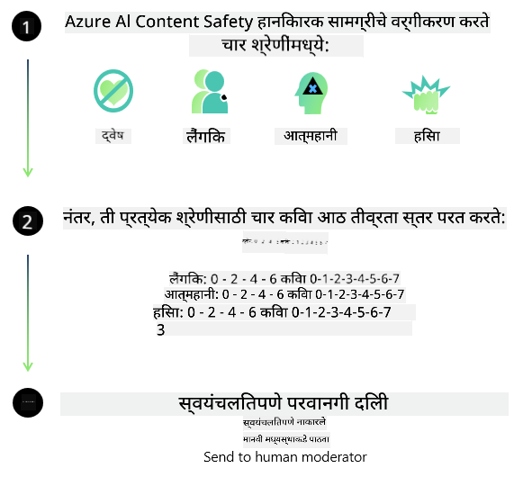
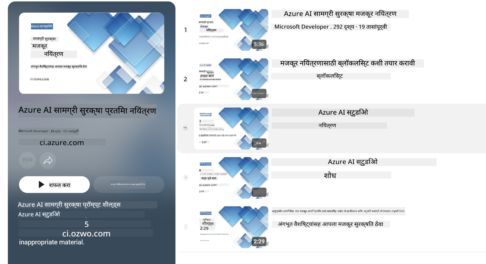

<!--
CO_OP_TRANSLATOR_METADATA:
{
  "original_hash": "c8273672cc57df2be675407a1383aaf0",
  "translation_date": "2025-07-16T17:45:37+00:00",
  "source_file": "md/01.Introduction/01/01.AISafety.md",
  "language_code": "mr"
}
-->
# Phi मॉडेलसाठी AI सुरक्षा  
Phi कुटुंबातील मॉडेल्स [Microsoft Responsible AI Standard](https://query.prod.cms.rt.microsoft.com/cms/api/am/binary/RE5cmFl) नुसार विकसित करण्यात आले आहेत, जे कंपनीव्यापी आवश्यकतांचा संच आहे आणि खालील सहा तत्त्वांवर आधारित आहे: जबाबदारी, पारदर्शकता, न्याय्यपणा, विश्वासार्हता आणि सुरक्षा, गोपनीयता आणि सुरक्षा, तसेच समावेशकता, जे [Microsoft चे Responsible AI तत्त्वे](https://www.microsoft.com/ai/responsible-ai) तयार करतात.

मागील Phi मॉडेल्सप्रमाणेच, बहुआयामी सुरक्षा मूल्यांकन आणि प्रशिक्षणानंतर सुरक्षा दृष्टिकोन स्वीकारण्यात आला आहे, आणि या आवृत्तीच्या बहुभाषिक क्षमतांचा विचार करून अतिरिक्त उपाययोजना केल्या आहेत. आमचा सुरक्षा प्रशिक्षण आणि मूल्यांकनाचा दृष्टिकोन, ज्यात अनेक भाषा आणि धोका श्रेणींमध्ये चाचणी समाविष्ट आहे, [Phi Safety Post-Training Paper](https://arxiv.org/abs/2407.13833) मध्ये तपशीलवार दिला आहे. Phi मॉडेल्स या दृष्टिकोनाचा लाभ घेत असले तरी, विकासकांनी त्यांच्या विशिष्ट वापर प्रकरण आणि सांस्कृतिक व भाषिक संदर्भानुसार जोखमींचे नकाशांकन, मोजमाप आणि कमी करण्यासह जबाबदार AI सर्वोत्तम पद्धती अवलंबाव्यात.

## सर्वोत्तम पद्धती

इतर मॉडेल्सप्रमाणे, Phi कुटुंबातील मॉडेल्स कधीकधी अन्यायकारक, अविश्वसनीय किंवा अपमानजनक वर्तन करू शकतात.

SLM आणि LLM च्या काही मर्यादित वर्तनांबाबत तुम्हाला जागरूक असणे आवश्यक आहे:

- **सेवेची गुणवत्ता:** Phi मॉडेल्स मुख्यतः इंग्रजी मजकूरावर प्रशिक्षित आहेत. इंग्रजी व्यतिरिक्त इतर भाषा वापरल्यास कामगिरी कमी होऊ शकते. प्रशिक्षण डेटामध्ये कमी प्रतिनिधित्व असलेल्या इंग्रजी भाषांतरांमध्ये मानक अमेरिकन इंग्रजीच्या तुलनेत कामगिरी अधिक खराब होऊ शकते.
- **हानिकारक प्रतिनिधित्व आणि स्टीरियोटाइप्सची पुनरावृत्ती:** हे मॉडेल्स लोकांच्या गटांचे जास्त किंवा कमी प्रतिनिधित्व करू शकतात, काही गटांचे प्रतिनिधित्व मिटवू शकतात, किंवा अपमानजनक किंवा नकारात्मक स्टीरियोटाइप्सना बळकट करू शकतात. सुरक्षा प्रशिक्षणानंतरही, विविध गटांच्या प्रतिनिधित्वातील फरक किंवा प्रशिक्षण डेटामध्ये नकारात्मक स्टीरियोटाइप्सच्या उदाहरणांमुळे या मर्यादा अस्तित्वात राहू शकतात, जे वास्तविक जगातील नमुने आणि सामाजिक पूर्वग्रह प्रतिबिंबित करतात.
- **अयोग्य किंवा अपमानजनक सामग्री:** हे मॉडेल्स इतर प्रकारची अयोग्य किंवा अपमानजनक सामग्री तयार करू शकतात, ज्यामुळे संवेदनशील संदर्भात वापरणे योग्य नसेल, जोपर्यंत वापर प्रकरणानुसार अतिरिक्त प्रतिबंधात्मक उपाय केले जात नाहीत.
- **माहितीची विश्वासार्हता:** भाषा मॉडेल्स अर्थहीन सामग्री तयार करू शकतात किंवा अशी सामग्री बनवू शकतात जी वाजवी वाटू शकते पण चुकीची किंवा जुनी असू शकते.
- **कोडसाठी मर्यादित व्याप्ती:** Phi-3 च्या प्रशिक्षण डेटाचा बहुतेक भाग Python वर आधारित आहे आणि "typing, math, random, collections, datetime, itertools" सारख्या सामान्य पॅकेजेसचा वापर करतो. जर मॉडेलने Python स्क्रिप्ट्स तयार केल्या ज्यात इतर पॅकेजेस किंवा इतर भाषांतील स्क्रिप्ट्स वापरल्या गेल्या असतील, तर वापरकर्त्यांनी सर्व API वापरांची मॅन्युअल तपासणी करणे अत्यंत आवश्यक आहे.

विकसकांनी जबाबदार AI सर्वोत्तम पद्धती अवलंबाव्यात आणि विशिष्ट वापर प्रकरण संबंधित कायदे आणि नियमांचे (उदा. गोपनीयता, व्यापार इ.) पालन सुनिश्चित करण्यासाठी जबाबदार असावे.

## जबाबदार AI विचार

इतर भाषा मॉडेल्सप्रमाणे, Phi सिरीज मॉडेल्स कधीकधी अन्यायकारक, अविश्वसनीय किंवा अपमानजनक वर्तन करू शकतात. लक्षात ठेवण्यासारख्या काही मर्यादित वर्तनांमध्ये समाविष्ट आहे:

**सेवेची गुणवत्ता:** Phi मॉडेल्स मुख्यतः इंग्रजी मजकूरावर प्रशिक्षित आहेत. इंग्रजी व्यतिरिक्त इतर भाषा वापरल्यास कामगिरी कमी होऊ शकते. प्रशिक्षण डेटामध्ये कमी प्रतिनिधित्व असलेल्या इंग्रजी भाषांतरांमध्ये मानक अमेरिकन इंग्रजीच्या तुलनेत कामगिरी अधिक खराब होऊ शकते.

**हानिकारक प्रतिनिधित्व आणि स्टीरियोटाइप्सची पुनरावृत्ती:** हे मॉडेल्स लोकांच्या गटांचे जास्त किंवा कमी प्रतिनिधित्व करू शकतात, काही गटांचे प्रतिनिधित्व मिटवू शकतात, किंवा अपमानजनक किंवा नकारात्मक स्टीरियोटाइप्सना बळकट करू शकतात. सुरक्षा प्रशिक्षणानंतरही, विविध गटांच्या प्रतिनिधित्वातील फरक किंवा प्रशिक्षण डेटामध्ये नकारात्मक स्टीरियोटाइप्सच्या उदाहरणांमुळे या मर्यादा अस्तित्वात राहू शकतात, जे वास्तविक जगातील नमुने आणि सामाजिक पूर्वग्रह प्रतिबिंबित करतात.

**अयोग्य किंवा अपमानजनक सामग्री:** हे मॉडेल्स इतर प्रकारची अयोग्य किंवा अपमानजनक सामग्री तयार करू शकतात, ज्यामुळे संवेदनशील संदर्भात वापरणे योग्य नसेल, जोपर्यंत वापर प्रकरणानुसार अतिरिक्त प्रतिबंधात्मक उपाय केले जात नाहीत.  
माहितीची विश्वासार्हता: भाषा मॉडेल्स अर्थहीन सामग्री तयार करू शकतात किंवा अशी सामग्री बनवू शकतात जी वाजवी वाटू शकते पण चुकीची किंवा जुनी असू शकते.

**कोडसाठी मर्यादित व्याप्ती:** Phi-3 च्या प्रशिक्षण डेटाचा बहुतेक भाग Python वर आधारित आहे आणि "typing, math, random, collections, datetime, itertools" सारख्या सामान्य पॅकेजेसचा वापर करतो. जर मॉडेलने Python स्क्रिप्ट्स तयार केल्या ज्यात इतर पॅकेजेस किंवा इतर भाषांतील स्क्रिप्ट्स वापरल्या गेल्या असतील, तर वापरकर्त्यांनी सर्व API वापरांची मॅन्युअल तपासणी करणे अत्यंत आवश्यक आहे.

विकसकांनी जबाबदार AI सर्वोत्तम पद्धती अवलंबाव्यात आणि विशिष्ट वापर प्रकरण संबंधित कायदे आणि नियमांचे (उदा. गोपनीयता, व्यापार इ.) पालन सुनिश्चित करण्यासाठी जबाबदार असावे. विचार करण्यासाठी महत्त्वाच्या क्षेत्रांमध्ये समाविष्ट आहेत:

**वाटप:** कायदेशीर स्थिती किंवा संसाधने किंवा जीवन संधींच्या वाटपावर परिणाम करणाऱ्या परिस्थितीसाठी मॉडेल्स योग्य नसू शकतात (उदा. घर, रोजगार, क्रेडिट इ.) जोपर्यंत पुढील मूल्यांकन आणि अतिरिक्त पूर्वग्रह कमी करण्याच्या तंत्रांचा वापर केला जात नाही.

**उच्च-धोकादायक परिस्थिती:** विकासकांनी अशा उच्च-धोकादायक परिस्थितीत मॉडेल वापरण्याची योग्यता तपासावी जिथे अन्यायकारक, अविश्वसनीय किंवा अपमानजनक आउटपुट अत्यंत महागडे किंवा हानिकारक ठरू शकतात. यात संवेदनशील किंवा तज्ञ क्षेत्रांमध्ये सल्ला देणे समाविष्ट आहे जिथे अचूकता आणि विश्वासार्हता अत्यंत महत्त्वाची आहे (उदा. कायदेशीर किंवा आरोग्य सल्ला). वापराच्या संदर्भानुसार अ‍ॅप्लिकेशन स्तरावर अतिरिक्त सुरक्षा उपाय राबवावेत.

**चुकीची माहिती:** मॉडेल्स चुकीची माहिती तयार करू शकतात. विकासकांनी पारदर्शकता सर्वोत्तम पद्धतींचे पालन करावे आणि अंतिम वापरकर्त्यांना ते AI प्रणालीशी संवाद साधत आहेत याची माहिती द्यावी. अ‍ॅप्लिकेशन स्तरावर, विकासक वापर प्रकरणानुसार संदर्भित माहितीवर आधारित प्रतिसाद देण्यासाठी अभिप्राय यंत्रणा आणि पाईपलाईन्स तयार करू शकतात, ज्याला Retrieval Augmented Generation (RAG) म्हणतात.

**हानिकारक सामग्रीची निर्मिती:** विकासकांनी त्यांच्या संदर्भासाठी आउटपुटचे मूल्यांकन करावे आणि उपलब्ध सुरक्षा वर्गीकरणे किंवा त्यांच्या वापर प्रकरणासाठी योग्य सानुकूल उपाय वापरावेत.

**दुरुपयोग:** फसवणूक, स्पॅम किंवा मालवेअर निर्मिती यांसारख्या इतर दुरुपयोगाच्या प्रकारांची शक्यता असू शकते, आणि विकासकांनी त्यांच्या अ‍ॅप्लिकेशन्सने लागू कायदे आणि नियमांचे उल्लंघन होऊ नये याची खात्री करावी.

### फाइनट्यूनिंग आणि AI सामग्री सुरक्षा

मॉडेल फाइनट्यून केल्यानंतर, आम्ही [Azure AI Content Safety](https://learn.microsoft.com/azure/ai-services/content-safety/overview) उपायांचा वापर करून मॉडेल्सद्वारे तयार होणारी सामग्री निरीक्षण करण्याची, संभाव्य धोके, धमक्या आणि गुणवत्ता समस्या ओळखण्याची आणि ब्लॉक करण्याची शिफारस करतो.

[Azure AI Content Safety](https://learn.microsoft.com/azure/ai-services/content-safety/overview) मजकूर आणि प्रतिमा सामग्री दोन्हीला समर्थन देते. हे क्लाउड, डिस्कनेक्टेड कंटेनर्स आणि एज/एम्बेडेड डिव्हाइसेसवर तैनात केले जाऊ शकते.

## Azure AI Content Safety चे आढावा

Azure AI Content Safety हा सर्वांसाठी एकसारखा उपाय नाही; तो व्यवसायांच्या विशिष्ट धोरणांशी सुसंगत करण्यासाठी सानुकूलित केला जाऊ शकतो. याशिवाय, त्याचे बहुभाषिक मॉडेल्स एकाच वेळी अनेक भाषा समजून घेऊ शकतात.

- **Azure AI Content Safety**  
- **Microsoft Developer**  
- **5 व्हिडिओज**

Azure AI Content Safety सेवा अ‍ॅप्लिकेशन्स आणि सेवांमध्ये हानिकारक वापरकर्ता-निर्मित आणि AI-निर्मित सामग्री शोधते. यात मजकूर आणि प्रतिमा API समाविष्ट आहेत जे तुम्हाला हानिकारक किंवा अयोग्य सामग्री शोधण्याची परवानगी देतात.

[AI Content Safety Playlist](https://www.youtube.com/playlist?list=PLlrxD0HtieHjaQ9bJjyp1T7FeCbmVcPkQ)

**अस्वीकरण**:  
हा दस्तऐवज AI अनुवाद सेवा [Co-op Translator](https://github.com/Azure/co-op-translator) वापरून अनुवादित केला आहे. आम्ही अचूकतेसाठी प्रयत्न करतो, तरी कृपया लक्षात घ्या की स्वयंचलित अनुवादांमध्ये चुका किंवा अचूकतेत त्रुटी असू शकतात. मूळ दस्तऐवज त्याच्या स्थानिक भाषेत अधिकृत स्रोत मानला जावा. महत्त्वाच्या माहितीसाठी व्यावसायिक मानवी अनुवाद करण्याची शिफारस केली जाते. या अनुवादाच्या वापरामुळे उद्भवलेल्या कोणत्याही गैरसमजुती किंवा चुकीच्या अर्थलागी आम्ही जबाबदार नाही.