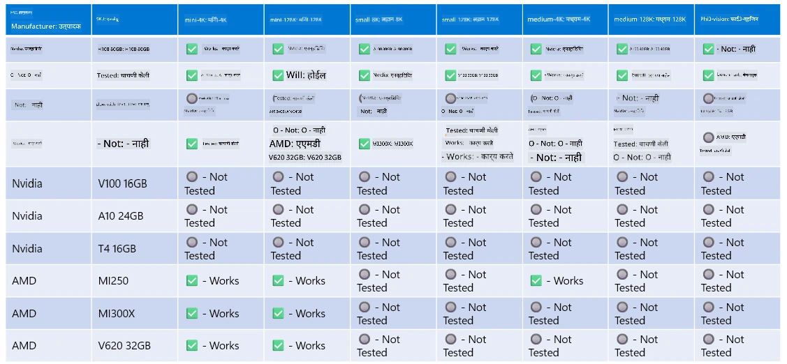

# Phi हार्डवेअर समर्थन

Microsoft Phi ONNX Runtime साठी ऑप्टिमाइझ केलेले आहे आणि Windows DirectML ला समर्थन देते. हे विविध हार्डवेअर प्रकारांवर चांगले कार्य करते, ज्यात GPU, CPU आणि अगदी मोबाइल डिव्हाइसेस देखील समाविष्ट आहेत.

## डिव्हाइस हार्डवेअर  
विशेषतः, समर्थित हार्डवेअरमध्ये समाविष्ट आहे:

- GPU SKU: RTX 4090 (DirectML)
- GPU SKU: 1 A100 80GB (CUDA)
- CPU SKU: Standard F64s v2 (64 vCPUs, 128 GiB मेमरी)

## मोबाइल SKU

- Android - Samsung Galaxy S21
- Apple iPhone 14 किंवा त्याहून वर A16/A17 प्रोसेसर

## Phi हार्डवेअर तपशील

- किमान कॉन्फिगरेशन आवश्यक.
- Windows: DirectX 12-सक्षम GPU आणि किमान 4GB एकत्रित RAM

CUDA: Compute Capability >= 7.02 असलेले NVIDIA GPU



## एकापेक्षा जास्त GPU वर onnxruntime चालवणे

सध्या उपलब्ध Phi ONNX मॉडेल्स फक्त 1 GPU साठी आहेत. Phi मॉडेलसाठी मल्टी-GPU समर्थन शक्य आहे, पण 2 GPU सह ORT वापरल्यास 2 ORT इंस्टन्सच्या तुलनेत जास्त throughput मिळेलच असे नाही. कृपया नवीनतम अपडेटसाठी [ONNX Runtime](https://onnxruntime.ai/) पहा.

[Build 2024 the GenAI ONNX Team](https://youtu.be/WLW4SE8M9i8?si=EtG04UwDvcjunyfC) यांनी जाहीर केले की त्यांनी Phi मॉडेलसाठी मल्टी-GPU ऐवजी मल्टी-इंस्टन्स सक्षम केले आहे.

सध्या यामुळे तुम्ही CUDA_VISIBLE_DEVICES पर्यावरण चल वापरून एक onnxruntime किंवा onnxruntime-genai इंस्टन्स चालवू शकता.

```Python
CUDA_VISIBLE_DEVICES=0 python infer.py
CUDA_VISIBLE_DEVICES=1 python infer.py
```

Phi बद्दल अधिक जाणून घेण्यासाठी [Azure AI Foundry](https://ai.azure.com) मध्ये शोध घेण्यास मोकळे रहा.

**अस्वीकरण**:  
हा दस्तऐवज AI अनुवाद सेवा [Co-op Translator](https://github.com/Azure/co-op-translator) वापरून अनुवादित केला आहे. आम्ही अचूकतेसाठी प्रयत्नशील असलो तरी, कृपया लक्षात घ्या की स्वयंचलित अनुवादांमध्ये चुका किंवा अचूकतेचा अभाव असू शकतो. मूळ दस्तऐवज त्याच्या स्थानिक भाषेत अधिकृत स्रोत मानला जावा. महत्त्वाच्या माहितीसाठी व्यावसायिक मानवी अनुवाद करण्याची शिफारस केली जाते. या अनुवादाच्या वापरामुळे उद्भवलेल्या कोणत्याही गैरसमजुती किंवा चुकीच्या अर्थलागी आम्ही जबाबदार नाही.