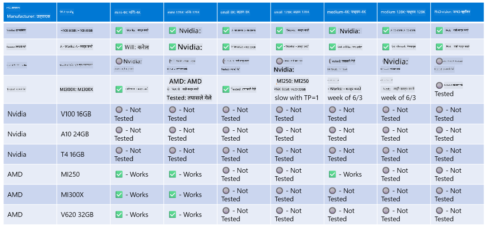

<!--
CO_OP_TRANSLATOR_METADATA:
{
  "original_hash": "8cdc17ce0f10535da30b53d23fe1a795",
  "translation_date": "2025-05-09T07:47:20+00:00",
  "source_file": "md/01.Introduction/01/01.Hardwaresupport.md",
  "language_code": "mr"
}
-->
# Phi हार्डवेअर सपोर्ट

Microsoft Phi ONNX Runtime साठी ऑप्टिमाइझ केलेले आहे आणि Windows DirectML ला सपोर्ट करते. हे विविध हार्डवेअर प्रकारांवर छान काम करते, ज्यात GPU, CPU आणि अगदी मोबाइल डिव्हाइसेस देखील समाविष्ट आहेत.

## डिव्हाइस हार्डवेअर  
विशेषतः, सपोर्ट केलेल्या हार्डवेअरमध्ये हे समाविष्ट आहे:

- GPU SKU: RTX 4090 (DirectML)
- GPU SKU: 1 A100 80GB (CUDA)
- CPU SKU: Standard F64s v2 (64 vCPUs, 128 GiB मेमरी)

## मोबाइल SKU

- Android - Samsung Galaxy S21  
- Apple iPhone 14 किंवा त्याहून वर A16/A17 प्रोसेसर

## Phi हार्डवेअर स्पेसिफिकेशन

- किमान कॉन्फिगरेशन आवश्यक.  
- Windows: DirectX 12 सक्षम GPU आणि एकूण 4GB RAM किमान आवश्यक  

CUDA: Compute Capability >= 7.02 असलेला NVIDIA GPU



## एकापेक्षा जास्त GPU वर onnxruntime चालवणे

सध्या उपलब्ध Phi ONNX मॉडेल फक्त 1 GPU साठी आहेत. Phi मॉडेलसाठी मल्टी-GPU सपोर्ट शक्य आहे, पण 2 GPU सह ORT वापरल्यास 2 वेगवेगळ्या ORT इंस्टन्सच्या तुलनेत जास्त थ्रूपुट मिळेलच असे नाही. ताजी माहितीकरता कृपया [ONNX Runtime](https://onnxruntime.ai/) पाहा.

[Build 2024 the GenAI ONNX Team](https://youtu.be/WLW4SE8M9i8?si=EtG04UwDvcjunyfC) यांनी जाहीर केले की त्यांनी Phi मॉडेलसाठी मल्टी-GPU ऐवजी मल्टी-इंस्टन्स सक्षम केले आहे.

सध्या, हे तुम्हाला CUDA_VISIBLE_DEVICES एन्व्हायर्नमेंट व्हेरिएबल वापरून एक onnxruntime किंवा onnxruntime-genai इंस्टन्स चालवण्याची परवानगी देते.

```Python
CUDA_VISIBLE_DEVICES=0 python infer.py
CUDA_VISIBLE_DEVICES=1 python infer.py
```

Phi बद्दल अधिक जाणून घेण्यासाठी [Azure AI Foundry](https://ai.azure.com) मध्ये एक्सप्लोर करा.

**अस्वीकरण**:  
हा दस्तऐवज AI अनुवाद सेवा [Co-op Translator](https://github.com/Azure/co-op-translator) वापरून अनुवादित केला आहे. आम्ही अचूकतेसाठी प्रयत्न करतो, परंतु कृपया लक्षात ठेवा की स्वयंचलित अनुवादांमध्ये चुका किंवा अपूर्णता असू शकते. मूळ दस्तऐवज त्याच्या स्थानिक भाषेत अधिकृत स्रोत मानला जावा. महत्त्वाच्या माहितीकरिता, व्यावसायिक मानवी अनुवाद करण्याची शिफारस केली जाते. या अनुवादाच्या वापरामुळे उद्भवलेल्या कोणत्याही गैरसमजुती किंवा चुकीसाठी आम्ही जबाबदार नाही.