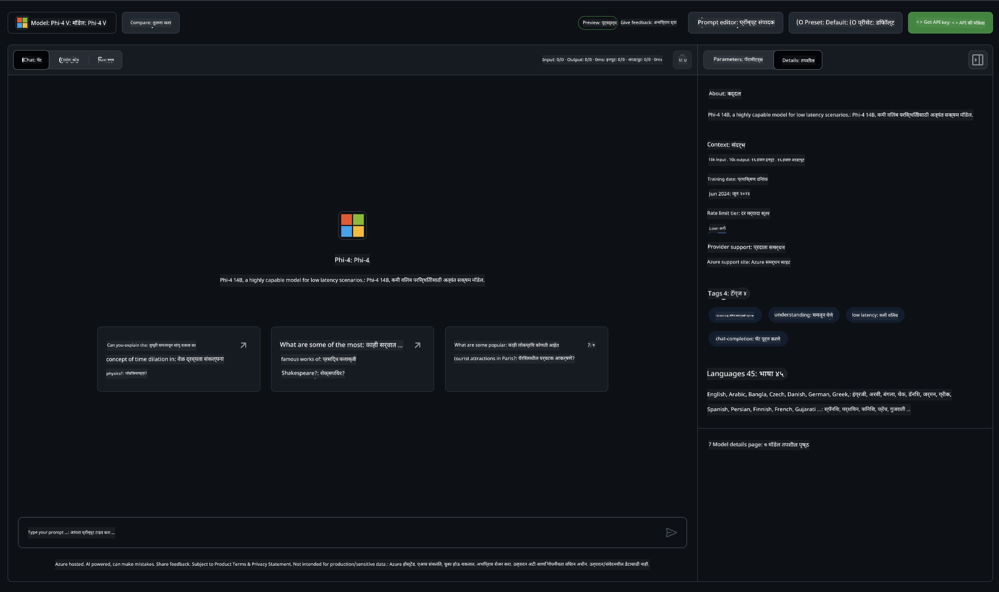

<!--
CO_OP_TRANSLATOR_METADATA:
{
  "original_hash": "fb67a08b9fc911a10ed58081fadef416",
  "translation_date": "2025-05-09T08:45:26+00:00",
  "source_file": "md/01.Introduction/02/02.GitHubModel.md",
  "language_code": "mr"
}
-->
## GitHub Models मधील Phi कुटुंब

[GitHub Models](https://github.com/marketplace/models) मध्ये तुमचे स्वागत आहे! आम्ही Azure AI वर होस्ट केलेल्या AI मॉडेल्स एक्सप्लोर करण्यासाठी सगळं तयार केलंय.


GitHub Models वर उपलब्ध मॉडेल्स विषयी अधिक माहितीकरिता, [GitHub Model Marketplace](https://github.com/marketplace/models) पहा.

## उपलब्ध मॉडेल्स

प्रत्येक मॉडेलसाठी समर्पित playground आणि sample कोड उपलब्ध आहेत.



### GitHub Model Catalog मधील Phi कुटुंब

- [Phi-4](https://github.com/marketplace/models/azureml/Phi-4)

- [Phi-3.5-MoE instruct (128k)](https://github.com/marketplace/models/azureml/Phi-3-5-MoE-instruct)

- [Phi-3.5-vision instruct (128k)](https://github.com/marketplace/models/azureml/Phi-3-5-vision-instruct)

- [Phi-3.5-mini instruct (128k)](https://github.com/marketplace/models/azureml/Phi-3-5-mini-instruct)

- [Phi-3-Medium-128k-Instruct](https://github.com/marketplace/models/azureml/Phi-3-medium-128k-instruct)

- [Phi-3-medium-4k-instruct](https://github.com/marketplace/models/azureml/Phi-3-medium-4k-instruct)

- [Phi-3-mini-128k-instruct](https://github.com/marketplace/models/azureml/Phi-3-mini-128k-instruct)

- [Phi-3-mini-4k-instruct](https://github.com/marketplace/models/azureml/Phi-3-mini-4k-instruct)

- [Phi-3-small-128k-instruct](https://github.com/marketplace/models/azureml/Phi-3-small-128k-instruct)

- [Phi-3-small-8k-instruct](https://github.com/marketplace/models/azureml/Phi-3-small-8k-instruct)

## सुरुवात कशी करावी

तुम्ही चालवण्यासाठी काही मूलभूत उदाहरणं तयार आहेत. ती samples डिरेक्टरीमध्ये मिळतील. तुमच्या आवडत्या भाषेकडे थेट जाण्यासाठी खालील भाषांमध्ये उदाहरणं उपलब्ध आहेत:

- Python  
- JavaScript  
- C#  
- Java  
- cURL  

संपूर्ण samples आणि मॉडेल्स चालवण्यासाठी एक समर्पित Codespaces Environment देखील आहे.


## Sample कोड

खाली काही उपयोगाच्या बाबतीत उदाहरण कोड दिले आहेत. Azure AI Inference SDK विषयी अधिक माहिती आणि samples साठी पूर्ण डोक्युमेंटेशन पहा.

## Setup

1. Personal access token तयार करा  
टोकनसाठी कोणतीही permissions देण्याची गरज नाही. लक्षात ठेवा की टोकन Microsoft सेवेकडे पाठवला जाईल.

खालील कोड स्निपेट्स वापरण्यासाठी, तुमचा टोकन client कोडसाठी key म्हणून सेट करणारा environment variable तयार करा.

जर तुम्ही bash वापरत असाल:  
```
export GITHUB_TOKEN="<your-github-token-goes-here>"
```  
जर तुम्ही powershell मध्ये असाल:  

```
$Env:GITHUB_TOKEN="<your-github-token-goes-here>"
```  

जर तुम्ही Windows command prompt वापरत असाल:  

```
set GITHUB_TOKEN=<your-github-token-goes-here>
```  

## Python Sample

### Dependencies इंस्टॉल करा  
pip वापरून Azure AI Inference SDK इंस्टॉल करा (आवश्यक: Python >=3.8):

```
pip install azure-ai-inference
```  
### मूलभूत कोड नमुना चालवा

हा नमुना chat completion API ला साधा कॉल दाखवतो. हा GitHub AI मॉडेल inference endpoint आणि तुमचा GitHub टोकन वापरतो. कॉल synchronous आहे.

```python
import os
from azure.ai.inference import ChatCompletionsClient
from azure.ai.inference.models import SystemMessage, UserMessage
from azure.core.credentials import AzureKeyCredential

endpoint = "https://models.inference.ai.azure.com"
model_name = "Phi-4"
token = os.environ["GITHUB_TOKEN"]

client = ChatCompletionsClient(
    endpoint=endpoint,
    credential=AzureKeyCredential(token),
)

response = client.complete(
    messages=[
        UserMessage(content="I have $20,000 in my savings account, where I receive a 4% profit per year and payments twice a year. Can you please tell me how long it will take for me to become a millionaire? Also, can you please explain the math step by step as if you were explaining it to an uneducated person?"),
    ],
    temperature=0.4,
    top_p=1.0,
    max_tokens=2048,
    model=model_name
)

print(response.choices[0].message.content)
```

### बहु-चरण संभाषण चालवा

हा नमुना chat completion API सह बहु-चरण संभाषण दाखवतो. चॅट अॅपसाठी मॉडेल वापरताना, तुम्हाला त्या संभाषणाचा इतिहास व्यवस्थापित करावा लागेल आणि मॉडेलला ताज्या मेसेजेस पाठवावे लागतील.

```
import os
from azure.ai.inference import ChatCompletionsClient
from azure.ai.inference.models import AssistantMessage, SystemMessage, UserMessage
from azure.core.credentials import AzureKeyCredential

token = os.environ["GITHUB_TOKEN"]
endpoint = "https://models.inference.ai.azure.com"
# Replace Model_Name
model_name = "Phi-4"

client = ChatCompletionsClient(
    endpoint=endpoint,
    credential=AzureKeyCredential(token),
)

messages = [
    SystemMessage(content="You are a helpful assistant."),
    UserMessage(content="What is the capital of France?"),
    AssistantMessage(content="The capital of France is Paris."),
    UserMessage(content="What about Spain?"),
]

response = client.complete(messages=messages, model=model_name)

print(response.choices[0].message.content)
```

### आउटपुट stream करा

चांगल्या वापरकर्ता अनुभवासाठी, तुम्हाला मॉडेलचा प्रतिसाद stream करायचा आहे जेणेकरून पहिला टोकन लवकर दिसेल आणि लांब प्रतिसादासाठी वाट पाहावी लागणार नाही.

```
import os
from azure.ai.inference import ChatCompletionsClient
from azure.ai.inference.models import SystemMessage, UserMessage
from azure.core.credentials import AzureKeyCredential

token = os.environ["GITHUB_TOKEN"]
endpoint = "https://models.inference.ai.azure.com"
# Replace Model_Name
model_name = "Phi-4"

client = ChatCompletionsClient(
    endpoint=endpoint,
    credential=AzureKeyCredential(token),
)

response = client.complete(
    stream=True,
    messages=[
        SystemMessage(content="You are a helpful assistant."),
        UserMessage(content="Give me 5 good reasons why I should exercise every day."),
    ],
    model=model_name,
)

for update in response:
    if update.choices:
        print(update.choices[0].delta.content or "", end="")

client.close()
```

## GitHub Models साठी मोफत वापर आणि दरमर्यादा


[playground आणि मोफत API वापरासाठी दरमर्यादा](https://docs.github.com/en/github-models/prototyping-with-ai-models#rate-limits) तुम्हाला मॉडेल्ससह प्रयोग करण्यास आणि तुमचा AI अॅप्लिकेशन प्रोटोटाइप करण्यास मदत करतात. त्या मर्यादेपलीकडे वापरासाठी, आणि तुमचा अॅप्लिकेशन स्केल करण्यासाठी, तुम्हाला Azure खात्यापासून resources provision करावे लागतील आणि तिथून authentication करावे लागेल, GitHub personal access token ऐवजी. तुमच्या कोडमध्ये इतर काहीही बदल करण्याची गरज नाही. मोफत स्तराच्या मर्यादेपलीकडे जाण्यासाठी Azure AI मध्ये कसे करायचे ते जाणून घेण्यासाठी हा लिंक वापरा.

### सूचना

मॉडेलशी संवाद करताना लक्षात ठेवा की तुम्ही AI सह प्रयोग करत आहात, त्यामुळे चुकीची माहिती येऊ शकते.

ही सुविधा विविध मर्यादांना अधीन आहे (जसे की प्रति मिनिट विनंत्या, प्रति दिवस विनंत्या, प्रति विनंती टोकन्स, आणि समांतर विनंत्या) आणि ती उत्पादन वापरासाठी डिझाइन केलेली नाही.

GitHub Models Azure AI Content Safety वापरते. हे फिल्टर्स GitHub Models अनुभवाचा भाग म्हणून बंद करता येत नाहीत. जर तुम्ही पैसे देऊन सेवा वापरत असाल, तर तुमच्या गरजेनुसार कंटेंट फिल्टर्स कॉन्फिगर करा.

ही सेवा GitHub च्या Pre-release Terms अंतर्गत आहे.

**अस्वीकरण**:  
हा दस्तऐवज AI अनुवाद सेवा [Co-op Translator](https://github.com/Azure/co-op-translator) वापरून अनुवादित केला आहे. आम्ही अचूकतेसाठी प्रयत्न करतो, परंतु कृपया लक्षात ठेवा की स्वयंचलित अनुवादांमध्ये चुका किंवा अचूकतेची कमतरता असू शकते. मूळ दस्तऐवज त्याच्या मूळ भाषेत अधिकृत स्रोत मानला पाहिजे. महत्त्वाच्या माहिती साठी व्यावसायिक मानवी अनुवादाची शिफारस केली जाते. या अनुवादाचा वापर करून झालेल्या कोणत्याही गैरसमजुती किंवा चुकीच्या अर्थलागी आम्ही जबाबदार नाही.