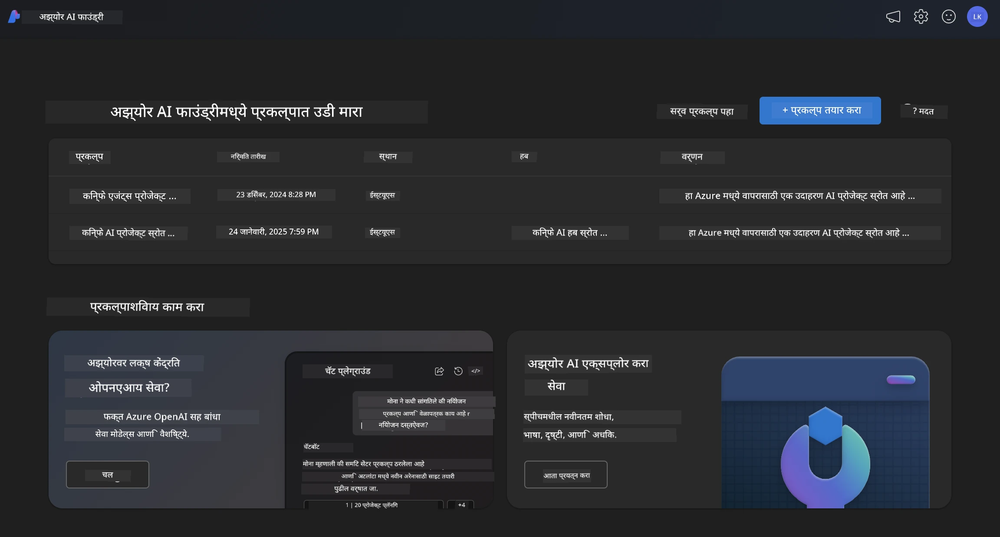
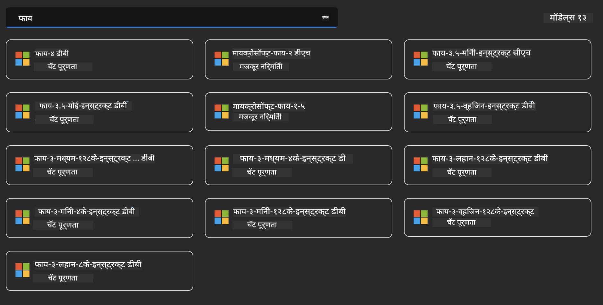
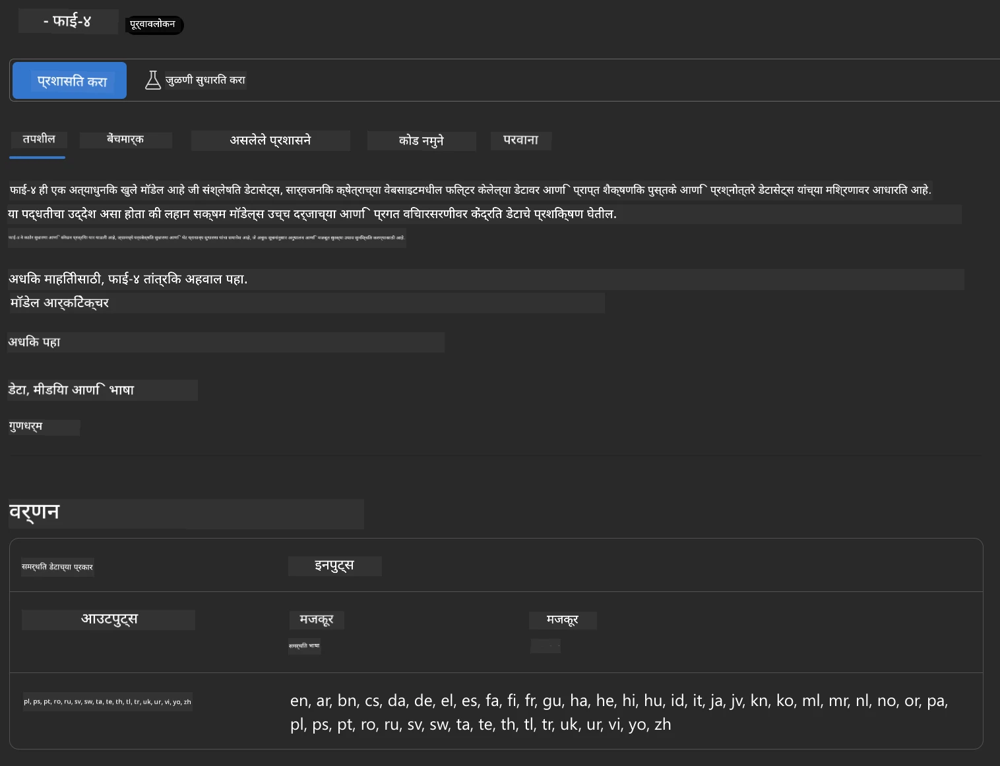
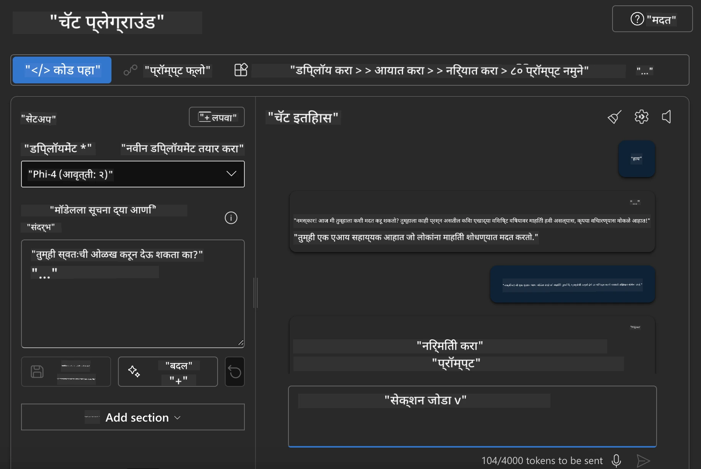

<!--
CO_OP_TRANSLATOR_METADATA:
{
  "original_hash": "3ae21dc5554e888defbe57946ee995ee",
  "translation_date": "2025-07-16T19:08:16+00:00",
  "source_file": "md/01.Introduction/02/03.AzureAIFoundry.md",
  "language_code": "mr"
}
-->
## Azure AI Foundry मधील Phi कुटुंब

[Azure AI Foundry](https://ai.azure.com) हा एक विश्वासार्ह प्लॅटफॉर्म आहे जो विकसकांना सुरक्षित, सुरक्षित आणि जबाबदारीने AI च्या मदतीने नवकल्पना घडविण्यास आणि भविष्यातील दिशा ठरविण्यास सक्षम करतो.

[Azure AI Foundry](https://ai.azure.com) विकसकांसाठी तयार केलेला आहे जेणेकरून ते:

- एंटरप्राइझ-ग्रेड प्लॅटफॉर्मवर जनरेटिव्ह AI अनुप्रयोग तयार करू शकतील.
- जबाबदार AI पद्धतींवर आधारित अत्याधुनिक AI साधने आणि ML मॉडेल्स वापरून शोध घेऊ शकतील, तयार करू शकतील, चाचणी करू शकतील आणि तैनात करू शकतील.
- अनुप्रयोग विकासाच्या संपूर्ण जीवनचक्रासाठी टीमसोबत सहकार्य करू शकतील.

Azure AI Foundry सह, तुम्ही विविध मॉडेल्स, सेवा आणि क्षमता शोधू शकता आणि तुमच्या उद्दिष्टांसाठी सर्वोत्तम AI अनुप्रयोग तयार करू शकता. Azure AI Foundry प्लॅटफॉर्म संकल्पनांपासून पूर्ण उत्पादन अनुप्रयोगांपर्यंत सहजतेने रूपांतर करण्यासाठी स्केलेबिलिटी सुलभ करतो. सातत्यपूर्ण देखरेख आणि सुधारणा दीर्घकालीन यशासाठी मदत करतात.



Azure AI Foundry मध्ये Azure AOAI Service वापरण्याशिवाय, तुम्ही Azure AI Foundry Model Catalog मध्ये तृतीय-पक्ष मॉडेल्स देखील वापरू शकता. जर तुम्हाला Azure AI Foundry तुमच्या AI सोल्यूशन प्लॅटफॉर्म म्हणून वापरायचा असेल तर हा एक चांगला पर्याय आहे.

आम्ही Azure AI Foundry मधील Model Catalog द्वारे Phi कुटुंबातील मॉडेल्स लवकर तैनात करू शकतो

[Microsoft Phi Models in Azure AI Foundry Models](https://ai.azure.com/explore/models/?selectedCollection=phi)



### **Azure AI Foundry मध्ये Phi-4 तैनात करा**



### **Azure AI Foundry Playground मध्ये Phi-4 चाचणी करा**



### **Azure AI Foundry Phi-4 कॉल करण्यासाठी Python कोड चालवा**

```python

import os  
import base64
from openai import AzureOpenAI  
from azure.identity import DefaultAzureCredential, get_bearer_token_provider  
        
endpoint = os.getenv("ENDPOINT_URL", "Your Azure AOAI Service Endpoint")  
deployment = os.getenv("DEPLOYMENT_NAME", "Phi-4")  
      
token_provider = get_bearer_token_provider(  
    DefaultAzureCredential(),  
    "https://cognitiveservices.azure.com/.default"  
)  
  
client = AzureOpenAI(  
    azure_endpoint=endpoint,  
    azure_ad_token_provider=token_provider,  
    api_version="2024-05-01-preview",  
)  
  

chat_prompt = [
    {
        "role": "system",
        "content": "You are an AI assistant that helps people find information."
    },
    {
        "role": "user",
        "content": "can you introduce yourself"
    }
] 
    
# Include speech result if speech is enabled  
messages = chat_prompt 

completion = client.chat.completions.create(  
    model=deployment,  
    messages=messages,
    max_tokens=800,  
    temperature=0.7,  
    top_p=0.95,  
    frequency_penalty=0,  
    presence_penalty=0,
    stop=None,  
    stream=False  
)  
  
print(completion.to_json())  

```

**अस्वीकरण**:  
हा दस्तऐवज AI अनुवाद सेवा [Co-op Translator](https://github.com/Azure/co-op-translator) वापरून अनुवादित केला आहे. आम्ही अचूकतेसाठी प्रयत्नशील असलो तरी, कृपया लक्षात घ्या की स्वयंचलित अनुवादांमध्ये चुका किंवा अचूकतेची कमतरता असू शकते. मूळ दस्तऐवज त्याच्या स्थानिक भाषेत अधिकृत स्रोत मानला जावा. महत्त्वाच्या माहितीसाठी व्यावसायिक मानवी अनुवाद करण्याची शिफारस केली जाते. या अनुवादाच्या वापरामुळे उद्भवलेल्या कोणत्याही गैरसमजुती किंवा चुकीच्या अर्थलागी आम्ही जबाबदार नाही.