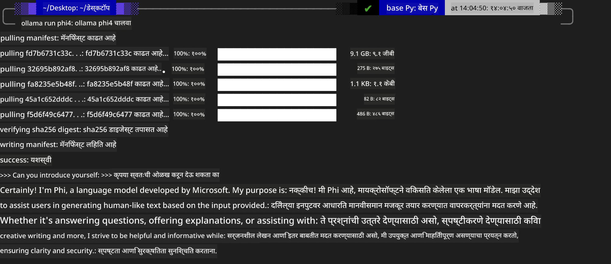
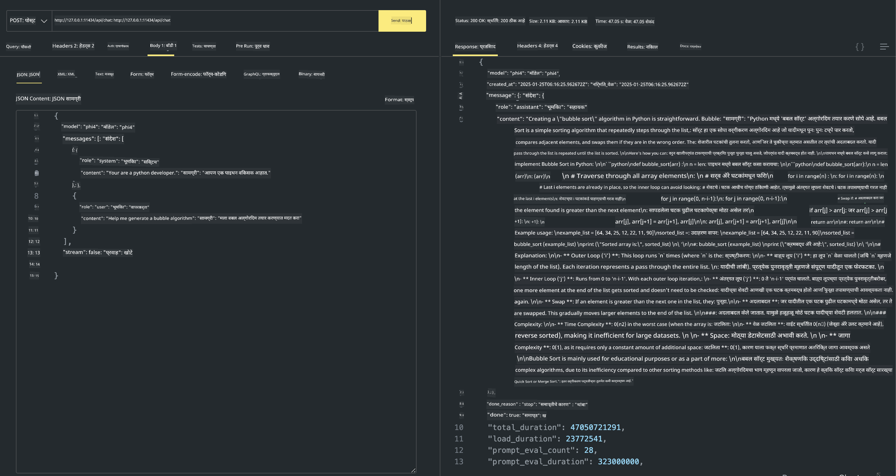

<!--
CO_OP_TRANSLATOR_METADATA:
{
  "original_hash": "0b38834693bb497f96bf53f0d941f9a1",
  "translation_date": "2025-05-09T09:11:32+00:00",
  "source_file": "md/01.Introduction/02/04.Ollama.md",
  "language_code": "mr"
}
-->
## Phi Family in Ollama


[Ollama](https://ollama.com) अनेक लोकांना सोप्या स्क्रिप्ट्सद्वारे open source LLM किंवा SLM थेट deploy करण्याची परवानगी देते, तसेच स्थानिक Copilot application साठी API तयार करण्यास मदत करते.

## **1. Installation**

Ollama Windows, macOS, आणि Linux वर चालविण्याला सपोर्ट करते. तुम्ही या लिंकवरून Ollama इन्स्टॉल करू शकता ([https://ollama.com/download](https://ollama.com/download)). यशस्वी इन्स्टॉलेशन नंतर, तुम्ही थेट टर्मिनल विंडोमधून Ollama स्क्रिप्ट वापरून Phi-3 कॉल करू शकता. तुम्ही Ollama मधील सर्व [available libraries](https://ollama.com/library) पाहू शकता. जर तुम्ही हा repository Codespace मध्ये उघडला तर Ollama आधीच इन्स्टॉल केलेले असेल.

```bash

ollama run phi4

```

> [!NOTE]
> मॉडेल प्रथमच चालवताना ते डाउनलोड होईल. अर्थात, तुम्ही थेट डाउनलोड केलेले Phi-4 मॉडेल देखील specify करू शकता. आम्ही WSL चा वापर करून कमांड चालवण्याचे उदाहरण घेतले आहे. मॉडेल यशस्वीपणे डाउनलोड झाल्यानंतर तुम्ही थेट टर्मिनलवर संवाद साधू शकता.



## **2. Call the phi-4 API from Ollama**

जर तुम्हाला Ollama द्वारे तयार केलेली Phi-4 API कॉल करायची असेल, तर तुम्ही टर्मिनलमध्ये हा कमांड वापरून Ollama server सुरू करू शकता.

```bash

ollama serve

```

> [!NOTE]
> MacOS किंवा Linux चालवताना, तुम्हाला खालील त्रुटी येऊ शकते **"Error: listen tcp 127.0.0.1:11434: bind: address already in use"** ही त्रुटी कमांड चालवताना दिसू शकते. तुम्ही ही त्रुटी दुर्लक्षित करू शकता कारण याचा अर्थ server आधीच चालू आहे, किंवा तुम्ही Ollama थांबवून पुन्हा सुरू करू शकता:

**macOS**

```bash

brew services restart ollama

```

**Linux**

```bash

sudo systemctl stop ollama

```

Ollama दोन API सपोर्ट करते: generate आणि chat. तुम्ही तुमच्या गरजेनुसार Ollama कडून दिलेली मॉडेल API कॉल करू शकता, जी स्थानिक सेवा पोर्ट 11434 वर चालू असते.

**Chat**

```bash

curl http://127.0.0.1:11434/api/chat -d '{
  "model": "phi3",
  "messages": [
    {
      "role": "system",
      "content": "Your are a python developer."
    },
    {
      "role": "user",
      "content": "Help me generate a bubble algorithm"
    }
  ],
  "stream": false
  
}'

This is the result in Postman



## Additional Resources

Check the list of available models in Ollama in [their library](https://ollama.com/library).

Pull your model from the Ollama server using this command

```bash
ollama pull phi4
```

Run the model using this command

```bash
ollama run phi4
```

***Note:*** Visit this link [https://github.com/ollama/ollama/blob/main/docs/api.md](https://github.com/ollama/ollama/blob/main/docs/api.md) to learn more

## Calling Ollama from Python

You can use `requests` or `urllib3` to make requests to the local server endpoints used above. However, a popular way to use Ollama in Python is via the [openai](https://pypi.org/project/openai/) SDK, since Ollama provides OpenAI-compatible server endpoints as well.

Here is an example for phi3-mini:

```python
import openai

client = openai.OpenAI(
    base_url="http://localhost:11434/v1",
    api_key="nokeyneeded",
)

response = client.chat.completions.create(
    model="phi4",
    temperature=0.7,
    n=1,
    messages=[
        {"role": "system", "content": "You are a helpful assistant."},
        {"role": "user", "content": "Write a haiku about a hungry cat"},
    ],
)

print("Response:")
print(response.choices[0].message.content)
```

## Calling Ollama from JavaScript 

```javascript
// Phi-4 वापरून फाइल सारांशित करण्याचे उदाहरण
script({
    model: "ollama:phi4",
    title: "Summarize with Phi-4",
    system: ["system"],
})

// सारांशित करण्याचे उदाहरण
const file = def("FILE", env.files)
$`Summarize ${file} in a single paragraph.`
```

## Calling Ollama from C#

Create a new C# Console application and add the following NuGet package:

```bash
dotnet add package Microsoft.SemanticKernel --version 1.34.0
```

Then replace this code in the `Program.cs` file

```csharp
using Microsoft.SemanticKernel;
using Microsoft.SemanticKernel.ChatCompletion;

// स्थानिक ollama server endpoint वापरून chat completion सेवा जोडा
#pragma warning disable SKEXP0001, SKEXP0003, SKEXP0010, SKEXP0011, SKEXP0050, SKEXP0052
builder.AddOpenAIChatCompletion(
    modelId: "phi4",
    endpoint: new Uri("http://localhost:11434/"),
    apiKey: "non required");

// chat सेवेला साधा prompt पाठवा
string prompt = "Write a joke about kittens";
var response = await kernel.InvokePromptAsync(prompt);
Console.WriteLine(response.GetValue<string>());
```

Run the app with the command:

```bash
dotnet run

**अस्वीकरण**:  
हा दस्तऐवज AI भाषांतर सेवा [Co-op Translator](https://github.com/Azure/co-op-translator) वापरून भाषांतरित केला आहे. आम्ही अचूकतेसाठी प्रयत्नशील असलो तरी, कृपया लक्षात ठेवा की स्वयंचलित भाषांतरांमध्ये चुका किंवा अचूकतेच्या त्रुटी असू शकतात. मूळ दस्तऐवज त्याच्या स्थानिक भाषेत अधिकृत स्रोत मानला जावा. महत्त्वाच्या माहितीसाठी व्यावसायिक मानवी भाषांतर शिफारसीय आहे. या भाषांतराच्या वापरामुळे उद्भवणाऱ्या कोणत्याही गैरसमज किंवा चुकीच्या अर्थ लावल्याबद्दल आम्ही जबाबदार नाही.