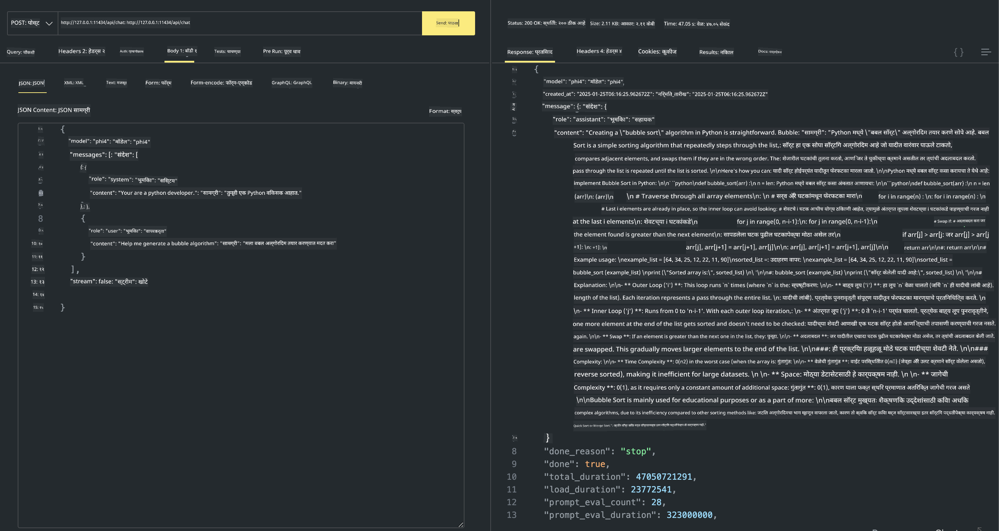

<!--
CO_OP_TRANSLATOR_METADATA:
{
  "original_hash": "0b38834693bb497f96bf53f0d941f9a1",
  "translation_date": "2025-07-16T19:14:41+00:00",
  "source_file": "md/01.Introduction/02/04.Ollama.md",
  "language_code": "mr"
}
-->
## Ollama मधील Phi कुटुंब

[Ollama](https://ollama.com) अधिक लोकांना सोप्या स्क्रिप्ट्सद्वारे open source LLM किंवा SLM थेट डिप्लॉय करण्याची परवानगी देते, तसेच स्थानिक Copilot अ‍ॅप्लिकेशनच्या वापरासाठी API तयार करण्यास मदत करू शकते.

## **1. इंस्टॉलेशन**

Ollama Windows, macOS, आणि Linux वर चालवण्यास समर्थ आहे. तुम्ही Ollama या लिंकवरून ([https://ollama.com/download](https://ollama.com/download)) इंस्टॉल करू शकता. यशस्वी इंस्टॉलेशन नंतर, तुम्ही थेट टर्मिनल विंडोमधून Ollama स्क्रिप्ट वापरून Phi-3 कॉल करू शकता. तुम्ही Ollama मधील सर्व [उपलब्ध लायब्ररी](https://ollama.com/library) पाहू शकता. जर तुम्ही हा रिपॉझिटरी Codespace मध्ये उघडला, तर Ollama आधीच इंस्टॉल केलेले असेल.

```bash

ollama run phi4

```

> [!NOTE]
> तुम्ही जेव्हा प्रथमच मॉडेल चालवाल तेव्हा ते आधी डाउनलोड होईल. अर्थात, तुम्ही थेट डाउनलोड केलेले Phi-4 मॉडेल देखील निर्दिष्ट करू शकता. आम्ही WSL चा वापर करून कमांड चालवण्याचे उदाहरण घेतले आहे. मॉडेल यशस्वीपणे डाउनलोड झाल्यानंतर, तुम्ही थेट टर्मिनलवर संवाद साधू शकता.


## **2. Ollama मधून phi-4 API कॉल करणे**

जर तुम्हाला Ollama द्वारे तयार केलेले Phi-4 API कॉल करायचे असेल, तर तुम्ही टर्मिनलमध्ये खालील कमांड वापरून Ollama सर्व्हर सुरू करू शकता.

```bash

ollama serve

```

> [!NOTE]
> जर तुम्ही MacOS किंवा Linux वापरत असाल, तर खालील त्रुटी येऊ शकते **"Error: listen tcp 127.0.0.1:11434: bind: address already in use"** ही त्रुटी कमांड चालवताना येऊ शकते. तुम्ही ही त्रुटी दुर्लक्षित करू शकता, कारण ही सामान्यतः सर्व्हर आधीच चालू असल्याचे सूचित करते, किंवा तुम्ही Ollama थांबवून पुन्हा सुरू करू शकता:

**macOS**

```bash

brew services restart ollama

```

**Linux**

```bash

sudo systemctl stop ollama

```

Ollama दोन API ला समर्थन देते: generate आणि chat. तुम्ही तुमच्या गरजेनुसार Ollama द्वारे दिलेले मॉडेल API कॉल करू शकता, स्थानिक सेवा ज्याचा पोर्ट 11434 वर चालतो, त्याला विनंत्या पाठवून.

**Chat**

```bash

curl http://127.0.0.1:11434/api/chat -d '{
  "model": "phi3",
  "messages": [
    {
      "role": "system",
      "content": "Your are a python developer."
    },
    {
      "role": "user",
      "content": "Help me generate a bubble algorithm"
    }
  ],
  "stream": false
  
}'

This is the result in Postman



## Additional Resources

Check the list of available models in Ollama in [their library](https://ollama.com/library).

Pull your model from the Ollama server using this command

```bash
ollama pull phi4
```

Run the model using this command

```bash
ollama run phi4
```

***Note:*** Visit this link [https://github.com/ollama/ollama/blob/main/docs/api.md](https://github.com/ollama/ollama/blob/main/docs/api.md) to learn more

## Calling Ollama from Python

You can use `requests` or `urllib3` to make requests to the local server endpoints used above. However, a popular way to use Ollama in Python is via the [openai](https://pypi.org/project/openai/) SDK, since Ollama provides OpenAI-compatible server endpoints as well.

Here is an example for phi3-mini:

```python
import openai

client = openai.OpenAI(
    base_url="http://localhost:11434/v1",
    api_key="nokeyneeded",
)

response = client.chat.completions.create(
    model="phi4",
    temperature=0.7,
    n=1,
    messages=[
        {"role": "system", "content": "You are a helpful assistant."},
        {"role": "user", "content": "Write a haiku about a hungry cat"},
    ],
)

print("Response:")
print(response.choices[0].message.content)
```

## Calling Ollama from JavaScript 

```javascript
// Phi-4 सह फाईलचे सारांश करण्याचे उदाहरण
script({
    model: "ollama:phi4",
    title: "Phi-4 सह सारांश",
    system: ["system"],
})

// सारांश करण्याचे उदाहरण
const file = def("FILE", env.files)
$`Summarize ${file} in a single paragraph.`
```

## Calling Ollama from C#

Create a new C# Console application and add the following NuGet package:

```bash
dotnet add package Microsoft.SemanticKernel --version 1.34.0
```

Then replace this code in the `Program.cs` file

```csharp
using Microsoft.SemanticKernel;
using Microsoft.SemanticKernel.ChatCompletion;

// स्थानिक ollama सर्व्हर एंडपॉइंट वापरून chat completion सेवा जोडा
#pragma warning disable SKEXP0001, SKEXP0003, SKEXP0010, SKEXP0011, SKEXP0050, SKEXP0052
builder.AddOpenAIChatCompletion(
    modelId: "phi4",
    endpoint: new Uri("http://localhost:11434/"),
    apiKey: "non required");

// chat सेवेला साधा प्रॉम्प्ट पाठवा
string prompt = "Write a joke about kittens";
var response = await kernel.InvokePromptAsync(prompt);
Console.WriteLine(response.GetValue<string>());
```

Run the app with the command:

```bash
dotnet run

**अस्वीकरण**:  
हा दस्तऐवज AI अनुवाद सेवा [Co-op Translator](https://github.com/Azure/co-op-translator) वापरून अनुवादित केला आहे. आम्ही अचूकतेसाठी प्रयत्नशील असलो तरी, कृपया लक्षात घ्या की स्वयंचलित अनुवादांमध्ये चुका किंवा अचूकतेची कमतरता असू शकते. मूळ दस्तऐवज त्याच्या स्थानिक भाषेत अधिकृत स्रोत मानला जावा. महत्त्वाच्या माहितीसाठी व्यावसायिक मानवी अनुवाद करण्याची शिफारस केली जाते. या अनुवादाच्या वापरामुळे उद्भवलेल्या कोणत्याही गैरसमजुती किंवा चुकीच्या अर्थलागी आम्ही जबाबदार नाही.