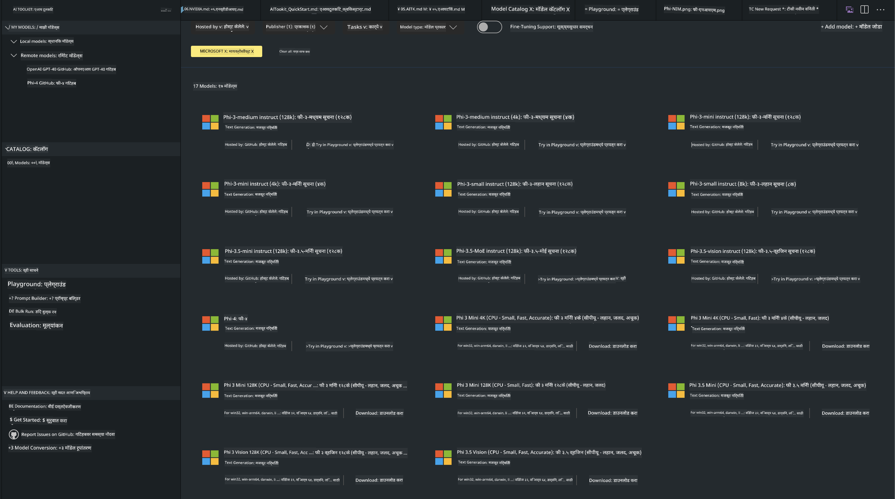
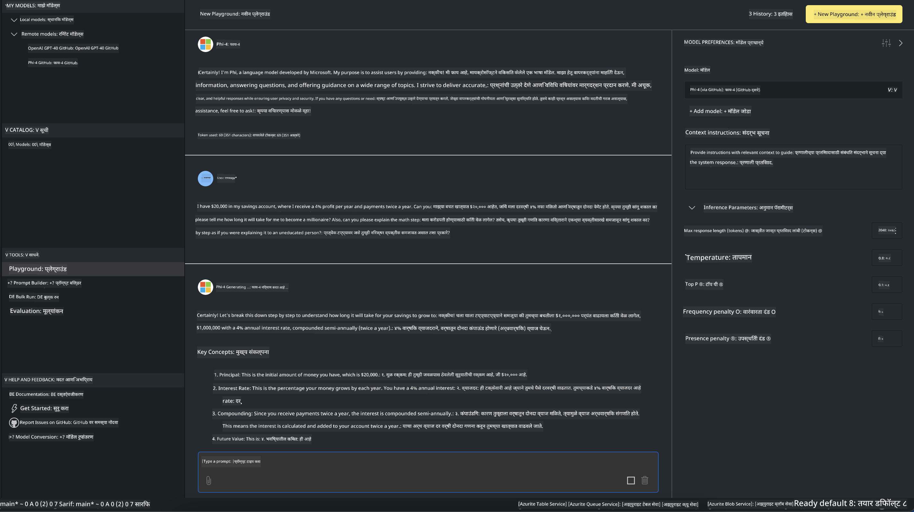

<!--
CO_OP_TRANSLATOR_METADATA:
{
  "original_hash": "4951d458c0b60c02cd1e751b40903877",
  "translation_date": "2025-05-09T09:27:34+00:00",
  "source_file": "md/01.Introduction/02/05.AITK.md",
  "language_code": "mr"
}
-->
# AITK मधील Phi कुटुंब

[AI Toolkit for VS Code](https://marketplace.visualstudio.com/items?itemName=ms-windows-ai-studio.windows-ai-studio) जनरेटिव्ह AI अॅप विकास सुलभ करते, ज्यामध्ये Azure AI Foundry Catalog आणि Hugging Face सारख्या इतर कॅटलॉगमधील अत्याधुनिक AI विकास साधने आणि मॉडेल्स एकत्र आणले आहेत. तुम्ही GitHub Models आणि Azure AI Foundry Model Catalogs द्वारे समर्थित AI मॉडेल्स कॅटलॉग ब्राउझ करू शकता, ते स्थानिक किंवा रिमोट डाउनलोड करू शकता, फाइन-ट्यून करू शकता, चाचणी करू शकता आणि तुमच्या अॅप्लिकेशनमध्ये वापरू शकता.

AI Toolkit प्रिव्ह्यू स्थानिकरित्या चालेल. स्थानिक इन्फरन्स किंवा फाइन-ट्यूनिंग, निवडलेल्या मॉडेलवर अवलंबून, तुम्हाला NVIDIA CUDA GPU सारखा GPU लागेल. तुम्ही GitHub Models थेट AITK सह चालवू शकता.

## सुरुवात कशी करावी

[Windows subsystem for Linux कसे इन्स्टॉल करायचे ते जाणून घ्या](https://learn.microsoft.com/windows/wsl/install?WT.mc_id=aiml-137032-kinfeylo)

आणि [डिफॉल्ट वितरण कसे बदलायचे ते](https://learn.microsoft.com/windows/wsl/install#change-the-default-linux-distribution-installed) देखील पहा.

[AI Toolkit GitHub Repo](https://github.com/microsoft/vscode-ai-toolkit/)

- Windows, Linux, macOS

- Windows आणि Linux दोन्हीवर फाइन-ट्यूनिंगसाठी Nvidia GPU आवश्यक आहे. शिवाय, **Windows** साठी Ubuntu 18.4 किंवा त्यापेक्षा जास्त असलेला Linux subsystem आवश्यक आहे. [Windows subsystem for Linux कसे इन्स्टॉल करायचे ते जाणून घ्या](https://learn.microsoft.com/windows/wsl/install) आणि [डिफॉल्ट वितरण कसे बदलायचे ते](https://learn.microsoft.com/windows/wsl/install#change-the-default-linux-distribution-installed).

### AI Toolkit इन्स्टॉल करा

AI Toolkit हा [Visual Studio Code Extension](https://code.visualstudio.com/docs/setup/additional-components#_vs-code-extensions) म्हणून येतो, त्यामुळे आधी [VS Code](https://code.visualstudio.com/docs/setup/windows?WT.mc_id=aiml-137032-kinfeylo) इन्स्टॉल करा आणि नंतर AI Toolkit [VS Marketplace](https://marketplace.visualstudio.com/items?itemName=ms-windows-ai-studio.windows-ai-studio) वरून डाउनलोड करा.  
[AI Toolkit Visual Studio Marketplace मध्ये उपलब्ध आहे](https://marketplace.visualstudio.com/items?itemName=ms-windows-ai-studio.windows-ai-studio) आणि इतर कोणत्याही VS Code एक्सटेंशनप्रमाणे इन्स्टॉल करता येतो.

जर तुम्हाला VS Code एक्सटेंशन्स इन्स्टॉल करण्याची माहिती नसेल, तर खालील पायऱ्या फॉलो करा:

### साइन इन करा

1. VS Code मधील Activity Bar मध्ये **Extensions** निवडा  
1. Extensions Search बारमध्ये "AI Toolkit" टाइप करा  
1. "AI Toolkit for Visual Studio code" निवडा  
1. **Install** वर क्लिक करा  

आता तुम्ही एक्सटेंशन वापरण्यास तयार आहात!

तुम्हाला GitHub मध्ये साइन इन करण्यासाठी विचारले जाईल, त्यामुळे "Allow" क्लिक करा. तुम्हाला GitHub साइन इन पेजवर रीडायरेक्ट केले जाईल.

कृपया साइन इन करा आणि प्रक्रियेचे स्टेप्स पूर्ण करा. यशस्वी पूर्णतेनंतर तुम्ही VS Code मध्ये परत येणार आहात.

एक्सटेंशन इन्स्टॉल झाल्यानंतर AI Toolkit आयकॉन Activity Bar मध्ये दिसेल.

चला उपलब्ध क्रिया पाहूया!

### उपलब्ध क्रिया

AI Toolkit चा मुख्य साइडबार खालीलप्रमाणे विभागलेला आहे:

- **Models**  
- **Resources**  
- **Playground**  
- **Fine-tuning**  
- **Evaluation**  

Resources सेक्शनमध्ये उपलब्ध आहेत. सुरुवात करण्यासाठी **Model Catalog** निवडा.

### कॅटलॉगमधून मॉडेल डाउनलोड करा

VS Code साइडबारमधून AI Toolkit सुरू केल्यावर तुम्ही खालील पर्याय निवडू शकता:



- **Model Catalog** मधून समर्थित मॉडेल शोधा आणि स्थानिक डाउनलोड करा  
- **Model Playground** मध्ये मॉडेल इन्फरन्स टेस्ट करा  
- **Model Fine-tuning** मध्ये स्थानिक किंवा रिमोट फाइन-ट्यून करा  
- AI Toolkit साठी कमांड पॅलेटद्वारे फाइन-ट्यून केलेले मॉडेल क्लाउडवर डिप्लॉय करा  
- मॉडेल्सचे मूल्यांकन करा  

> [!NOTE]
>
> **GPU Vs CPU**
>
> तुम्हाला मॉडेल कार्डवर मॉडेलचा आकार, प्लॅटफॉर्म आणि अॅक्सेलरेटर प्रकार (CPU, GPU) दिसेल. **Windows डिव्हाइसेस ज्यांच्याकडे किमान एक GPU आहे** अशा डिव्हाइसेसवर सर्वोत्तम कार्यक्षमता मिळवण्यासाठी, Windows साठी खास तयार केलेले मॉडेल आवृत्त्या निवडा.
>
> यामुळे तुम्हाला DirectML अॅक्सेलरेटरसाठी ऑप्टिमाइझ केलेले मॉडेल मिळेल.
>
> मॉडेल नावे खालील स्वरूपात असतात:
>
> - `{model_name}-{accelerator}-{quantization}-{format}`.
>
>तुमच्या Windows डिव्हाइसमध्ये GPU आहे की नाही हे तपासण्यासाठी, **Task Manager** उघडा आणि **Performance** टॅब निवडा. GPU असल्यास "GPU 0" किंवा "GPU 1" सारखी नावे दिसतील.

### Playground मध्ये मॉडेल चालवा

सर्व पॅरामीटर्स सेट केल्यावर, **Generate Project** वर क्लिक करा.

मॉडेल डाउनलोड झाल्यानंतर, कॅटलॉगमधील मॉडेल कार्डवर **Load in Playground** निवडा:

- मॉडेल डाउनलोड सुरू करा  
- सर्व आवश्यक पूर्वतयारी आणि अवलंबित्वे इन्स्टॉल करा  
- VS Code वर्कस्पेस तयार करा  



### तुमच्या अॅप्लिकेशनमध्ये REST API वापरा

AI Toolkit मध्ये स्थानिक REST API वेब सर्व्हर **पोर्ट 5272 वर** उपलब्ध आहे, जो [OpenAI chat completions format](https://platform.openai.com/docs/api-reference/chat/create) वापरतो.

यामुळे तुम्ही क्लाउड AI मॉडेल सेवा न वापरता स्थानिकरित्या तुमचे अॅप्लिकेशन टेस्ट करू शकता. उदाहरणार्थ, खालील JSON फाइलमध्ये विनंतीचे बॉडी कसे कॉन्फिगर करायचे ते दाखवले आहे:

```json
{
    "model": "Phi-4",
    "messages": [
        {
            "role": "user",
            "content": "what is the golden ratio?"
        }
    ],
    "temperature": 0.7,
    "top_p": 1,
    "top_k": 10,
    "max_tokens": 100,
    "stream": true
}
```

तुम्ही REST API चाचणीसाठी [Postman](https://www.postman.com/) किंवा CURL (Client URL) युटिलिटी वापरू शकता:

```bash
curl -vX POST http://127.0.0.1:5272/v1/chat/completions -H 'Content-Type: application/json' -d @body.json
```

### Python साठी OpenAI क्लायंट लायब्ररी वापरणे

```python
from openai import OpenAI

client = OpenAI(
    base_url="http://127.0.0.1:5272/v1/", 
    api_key="x" # required for the API but not used
)

chat_completion = client.chat.completions.create(
    messages=[
        {
            "role": "user",
            "content": "what is the golden ratio?",
        }
    ],
    model="Phi-4",
)

print(chat_completion.choices[0].message.content)
```

### .NET साठी Azure OpenAI क्लायंट लायब्ररी वापरणे

NuGet वापरून तुमच्या प्रोजेक्टमध्ये [Azure OpenAI client library for .NET](https://www.nuget.org/packages/Azure.AI.OpenAI/) जोडा:

```bash
dotnet add {project_name} package Azure.AI.OpenAI --version 1.0.0-beta.17
```

तुमच्या प्रोजेक्टमध्ये **OverridePolicy.cs** नावाचा C# फाइल जोडा आणि खालील कोड पेस्ट करा:

```csharp
// OverridePolicy.cs
using Azure.Core.Pipeline;
using Azure.Core;

internal partial class OverrideRequestUriPolicy(Uri overrideUri)
    : HttpPipelineSynchronousPolicy
{
    private readonly Uri _overrideUri = overrideUri;

    public override void OnSendingRequest(HttpMessage message)
    {
        message.Request.Uri.Reset(_overrideUri);
    }
}
```

नंतर, तुमच्या **Program.cs** फाइलमध्ये खालील कोड पेस्ट करा:

```csharp
// Program.cs
using Azure.AI.OpenAI;

Uri localhostUri = new("http://localhost:5272/v1/chat/completions");

OpenAIClientOptions clientOptions = new();
clientOptions.AddPolicy(
    new OverrideRequestUriPolicy(localhostUri),
    Azure.Core.HttpPipelinePosition.BeforeTransport);
OpenAIClient client = new(openAIApiKey: "unused", clientOptions);

ChatCompletionsOptions options = new()
{
    DeploymentName = "Phi-4",
    Messages =
    {
        new ChatRequestSystemMessage("You are a helpful assistant. Be brief and succinct."),
        new ChatRequestUserMessage("What is the golden ratio?"),
    }
};

StreamingResponse<StreamingChatCompletionsUpdate> streamingChatResponse
    = await client.GetChatCompletionsStreamingAsync(options);

await foreach (StreamingChatCompletionsUpdate chatChunk in streamingChatResponse)
{
    Console.Write(chatChunk.ContentUpdate);
}
```


## AI Toolkit सह फाइन ट्यूनिंग

- मॉडेल शोध आणि प्लेग्राउंडसह सुरुवात करा.  
- स्थानिक संगणकीय संसाधने वापरून मॉडेल फाइन-ट्यूनिंग आणि इन्फरन्स.  
- Azure संसाधने वापरून रिमोट फाइन-ट्यूनिंग आणि इन्फरन्स.  

[AI Toolkit सह फाइन ट्यूनिंग](../../03.FineTuning/Finetuning_VSCodeaitoolkit.md)

## AI Toolkit Q&A संसाधने

सर्वसाधारण समस्या आणि उपायांसाठी कृपया आमच्या [Q&A पेज](https://github.com/microsoft/vscode-ai-toolkit/blob/main/archive/QA.md) ला भेट द्या.

**अस्वीकरण**:  
हा दस्तऐवज AI भाषांतर सेवा [Co-op Translator](https://github.com/Azure/co-op-translator) चा वापर करून भाषांतरित केला आहे. आम्ही अचूकतेसाठी प्रयत्न करतो, तरी कृपया लक्षात ठेवा की स्वयंचलित भाषांतरांमध्ये चुका किंवा अचूकतेच्या त्रुटी असू शकतात. मूळ दस्तऐवज त्याच्या स्थानिक भाषेत अधिकृत स्रोत मानला पाहिजे. महत्त्वाच्या माहिती साठी व्यावसायिक मानवी भाषांतर शिफारस केली जाते. या भाषांतराचा वापर करून उद्भवलेल्या कोणत्याही गैरसमजुती किंवा चुकीच्या अर्थापासून आम्ही जबाबदार नाही.