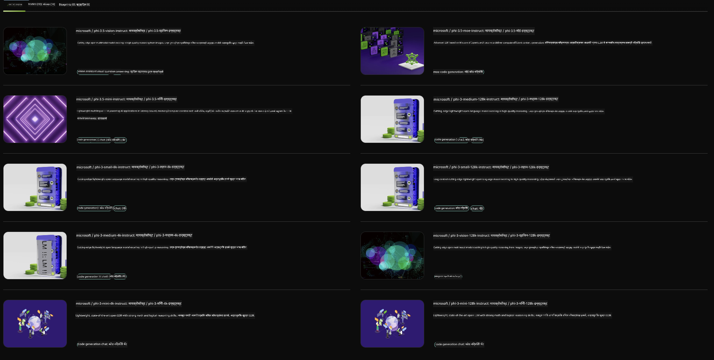

<!--
CO_OP_TRANSLATOR_METADATA:
{
  "original_hash": "7b08e277df2a9307f861ae54bc30c772",
  "translation_date": "2025-07-16T19:35:12+00:00",
  "source_file": "md/01.Introduction/02/06.NVIDIA.md",
  "language_code": "mr"
}
-->
## NVIDIA NIM मधील Phi कुटुंब

NVIDIA NIM ही सोपी वापरण्यासाठी असलेली मायक्रोसर्व्हिसेसची एक मालिका आहे, जी क्लाउड, डेटा सेंटर आणि वर्कस्टेशन्सवर जनरेटिव्ह AI मॉडेल्सच्या त्वरित तैनातीसाठी डिझाइन केलेली आहे. NIM मॉडेल कुटुंबानुसार आणि प्रत्येक मॉडेलनुसार वर्गीकृत केलेले आहेत. उदाहरणार्थ, मोठ्या भाषा मॉडेल्स (LLMs) साठी NVIDIA NIM एंटरप्राइझ अॅप्लिकेशन्समध्ये अत्याधुनिक LLMs ची शक्ती आणते, ज्यामुळे नैसर्गिक भाषा प्रक्रिया आणि समजण्याच्या क्षमतांमध्ये अतुलनीय सुधारणा होते.

NIM IT आणि DevOps टीम्सना त्यांच्या स्वतःच्या व्यवस्थापित वातावरणात मोठ्या भाषा मॉडेल्स (LLMs) सहजपणे होस्ट करण्यास मदत करते, तसेच विकसकांना उद्योगमानक API प्रदान करते ज्यामुळे ते सामर्थ्यशाली copilots, chatbots आणि AI सहाय्यक तयार करू शकतात जे त्यांच्या व्यवसायात क्रांती घडवू शकतात. NVIDIA च्या अत्याधुनिक GPU त्वरण आणि स्केलेबल तैनातीचा लाभ घेत, NIM अतुलनीय कार्यक्षमतेसह सर्वात जलद इनफरन्स मार्ग प्रदान करते.

तुम्ही NVIDIA NIM वापरून Phi कुटुंबातील मॉडेल्सवर इनफरन्स करू शकता



### **नमुने - NVIDIA NIM मधील Phi-3-Vision**

कल्पना करा की तुमच्याकडे एक प्रतिमा (`demo.png`) आहे आणि तुम्हाला अशी Python कोड तयार करायची आहे जी ही प्रतिमा प्रक्रिया करेल आणि त्याचा नवीन आवृत्ती (`phi-3-vision.jpg`) जतन करेल.

वरील कोड हा प्रक्रिया स्वयंचलित करतो:

1. वातावरण आणि आवश्यक कॉन्फिगरेशन सेट करणे.
2. मॉडेलला आवश्यक Python कोड तयार करण्यासाठी सूचित करणारा प्रॉम्प्ट तयार करणे.
3. प्रॉम्प्ट मॉडेलला पाठवणे आणि तयार झालेला कोड गोळा करणे.
4. तयार झालेला कोड काढून चालवणे.
5. मूळ आणि प्रक्रिया केलेल्या प्रतिमा दाखवणे.

हा दृष्टिकोन AI च्या शक्तीचा वापर करून प्रतिमा प्रक्रिया कार्ये स्वयंचलित करतो, ज्यामुळे तुमचे उद्दिष्टे साध्य करणे सोपे आणि जलद होते.

[Sample Code Solution](../../../../../code/06.E2E/E2E_Nvidia_NIM_Phi3_Vision.ipynb)

चला संपूर्ण कोड काय करतो ते टप्प्याटप्प्याने पाहूया:

1. **आवश्यक पॅकेज इन्स्टॉल करा**:
    ```python
    !pip install langchain_nvidia_ai_endpoints -U
    ```
    हा आदेश `langchain_nvidia_ai_endpoints` पॅकेजची नवीनतम आवृत्ती इन्स्टॉल करतो.

2. **आवश्यक मॉड्यूल्स आयात करा**:
    ```python
    from langchain_nvidia_ai_endpoints import ChatNVIDIA
    import getpass
    import os
    import base64
    ```
    हे आयात NVIDIA AI endpoints शी संवाद साधण्यासाठी, पासवर्ड सुरक्षितपणे हाताळण्यासाठी, ऑपरेटिंग सिस्टमशी संवाद साधण्यासाठी आणि base64 स्वरूपात डेटा एन्कोड/डिकोड करण्यासाठी आवश्यक मॉड्यूल्स आणतात.

3. **API की सेट करा**:
    ```python
    if not os.getenv("NVIDIA_API_KEY"):
        os.environ["NVIDIA_API_KEY"] = getpass.getpass("Enter your NVIDIA API key: ")
    ```
    हा कोड तपासतो की `NVIDIA_API_KEY` पर्यावरण चल सेट आहे का. नसेल तर वापरकर्त्याला सुरक्षितपणे API की प्रविष्ट करण्यास सांगतो.

4. **मॉडेल आणि प्रतिमेचा मार्ग निश्चित करा**:
    ```python
    model = 'microsoft/phi-3-vision-128k-instruct'
    chat = ChatNVIDIA(model=model)
    img_path = './imgs/demo.png'
    ```
    येथे वापरायचा मॉडेल सेट केला जातो, `ChatNVIDIA` चे उदाहरण तयार केले जाते आणि प्रतिमेचा फाईल पथ निश्चित केला जातो.

5. **टेक्स्ट प्रॉम्प्ट तयार करा**:
    ```python
    text = "Please create Python code for image, and use plt to save the new picture under imgs/ and name it phi-3-vision.jpg."
    ```
    हा प्रॉम्प्ट मॉडेलला प्रतिमा प्रक्रिया करण्यासाठी Python कोड तयार करण्याचे निर्देश देतो.

6. **प्रतिमा base64 मध्ये एन्कोड करा**:
    ```python
    with open(img_path, "rb") as f:
        image_b64 = base64.b64encode(f.read()).decode()
    image = f''
    ```
    हा कोड प्रतिमा फाईल वाचतो, base64 मध्ये एन्कोड करतो आणि एन्कोड केलेल्या डेटासह HTML इमेज टॅग तयार करतो.

7. **टेक्स्ट आणि प्रतिमा प्रॉम्प्टमध्ये एकत्र करा**:
    ```python
    prompt = f"{text} {image}"
    ```
    हा टेक्स्ट प्रॉम्प्ट आणि HTML इमेज टॅग एकत्र करून एक स्ट्रिंग तयार करतो.

8. **ChatNVIDIA वापरून कोड जनरेट करा**:
    ```python
    code = ""
    for chunk in chat.stream(prompt):
        print(chunk.content, end="")
        code += chunk.content
    ```
    हा कोड प्रॉम्प्ट `ChatNVIDIA` मॉडेलला पाठवतो आणि तयार झालेला कोड तुकड्यांमध्ये गोळा करतो, प्रत्येक तुकडा प्रिंट करतो आणि `code` स्ट्रिंगमध्ये जोडतो.

9. **जनरेट केलेल्या कंटेंटमधून Python कोड काढा**:
    ```python
    begin = code.index('```python') + 9
    code = code[begin:]
    end = code.index('```')
    code = code[:end]
    ```
    हा भाग markdown फॉरमॅटिंग काढून टाकून प्रत्यक्ष Python कोड काढतो.

10. **जनरेट केलेला कोड चालवा**:
    ```python
    import subprocess
    result = subprocess.run(["python", "-c", code], capture_output=True)
    ```
    हा कोड काढलेला Python कोड subprocess म्हणून चालवतो आणि त्याचा आउटपुट कॅप्चर करतो.

11. **प्रतिमा दाखवा**:
    ```python
    from IPython.display import Image, display
    display(Image(filename='./imgs/phi-3-vision.jpg'))
    display(Image(filename='./imgs/demo.png'))
    ```
    या ओळी `IPython.display` मॉड्यूल वापरून प्रतिमा दाखवतात.

**अस्वीकरण**:  
हा दस्तऐवज AI अनुवाद सेवा [Co-op Translator](https://github.com/Azure/co-op-translator) वापरून अनुवादित केला आहे. आम्ही अचूकतेसाठी प्रयत्नशील असलो तरी, कृपया लक्षात घ्या की स्वयंचलित अनुवादांमध्ये चुका किंवा अचूकतेचा अभाव असू शकतो. मूळ दस्तऐवज त्याच्या स्थानिक भाषेत अधिकृत स्रोत मानला जावा. महत्त्वाच्या माहितीसाठी व्यावसायिक मानवी अनुवाद करण्याची शिफारस केली जाते. या अनुवादाच्या वापरामुळे उद्भवलेल्या कोणत्याही गैरसमजुती किंवा चुकीच्या अर्थलागी आम्ही जबाबदार नाही.