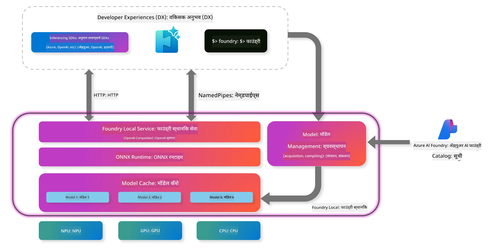
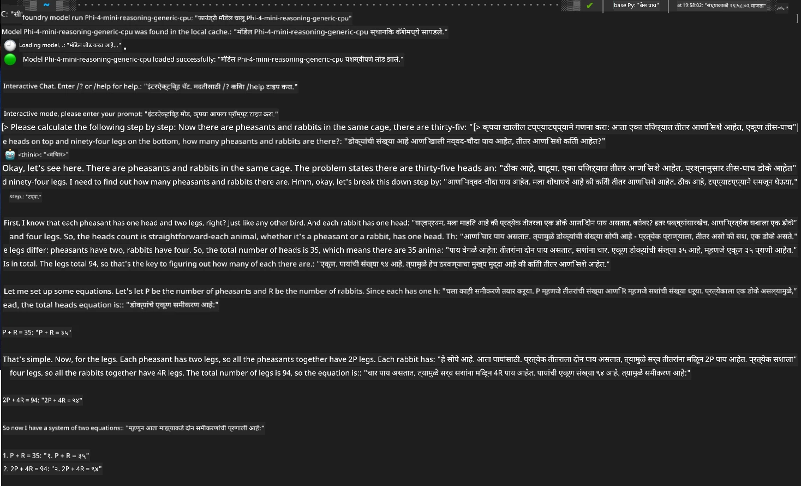

## Foundry Local मधील Phi-Family मॉडेल्ससह सुरुवात

### Foundry Local ची ओळख

Foundry Local हा एक सामर्थ्यशाली ऑन-डिव्हाइस AI इन्फरन्स सोल्यूशन आहे जो एंटरप्राइझ-ग्रेड AI क्षमता थेट तुमच्या स्थानिक हार्डवेअरवर आणतो. हा ट्युटोरियल तुम्हाला Foundry Local सह Phi-Family मॉडेल्स सेटअप आणि वापरण्याची प्रक्रिया शिकवेल, ज्यामुळे तुम्हाला तुमच्या AI वर्कलोडवर पूर्ण नियंत्रण मिळेल, गोपनीयता राखली जाईल आणि खर्च कमी होईल.

Foundry Local तुमच्या डिव्हाइसवर AI मॉडेल्स स्थानिकपणे चालवून कार्यक्षमता, गोपनीयता, सानुकूलन आणि खर्च बचत यांचे फायदे देते. हे सहजपणे तुमच्या विद्यमान वर्कफ्लोज आणि अ‍ॅप्लिकेशन्समध्ये CLI, SDK आणि REST API द्वारे समाकलित होते.



### Foundry Local का निवडावे?

Foundry Local चे फायदे समजून घेणे तुम्हाला तुमच्या AI तैनाती धोरणाबाबत योग्य निर्णय घेण्यास मदत करेल:

- **ऑन-डिव्हाइस इन्फरन्स:** तुमच्या स्वतःच्या हार्डवेअरवर मॉडेल्स चालवा, ज्यामुळे खर्च कमी होतो आणि तुमची सर्व डेटा तुमच्या डिव्हाइसवरच राहते.

- **मॉडेल सानुकूलन:** पूर्वनिर्धारित मॉडेल्समधून निवडा किंवा तुमच्या विशिष्ट गरजा आणि वापरासाठी स्वतःचे मॉडेल वापरा.

- **खर्च बचत:** तुमच्या विद्यमान हार्डवेअरचा वापर करून वारंवार येणाऱ्या क्लाउड सेवा खर्चांपासून मुक्त व्हा, ज्यामुळे AI अधिक सुलभ होते.

- **सुलभ समाकलन:** SDK, API endpoints किंवा CLI द्वारे तुमच्या अ‍ॅप्लिकेशन्सशी कनेक्ट व्हा, आणि गरजेनुसार Microsoft Foundry कडे सहज स्केल करा.

> **Getting Started Note:** हा ट्युटोरियल Foundry Local CLI आणि SDK इंटरफेसेस वापरण्यावर लक्ष केंद्रित करतो. तुम्हाला दोन्ही पद्धती शिकवण्यात येतील जेणेकरून तुम्ही तुमच्या वापरासाठी सर्वोत्तम पर्याय निवडू शकाल.

## भाग 1: Foundry Local CLI सेटअप करणे

### पाऊल 1: इंस्टॉलेशन

Foundry Local CLI हे तुमचे स्थानिक AI मॉडेल्स व्यवस्थापित आणि चालवण्याचे मुख्य साधन आहे. चला ते तुमच्या सिस्टीमवर इंस्टॉल करूया.

**समर्थित प्लॅटफॉर्म्स:** Windows आणि macOS

सविस्तर इंस्टॉलेशन सूचना पाहण्यासाठी कृपया [अधिकृत Foundry Local दस्तऐवज](https://github.com/microsoft/Foundry-Local/blob/main/README.md) पहा.

### पाऊल 2: उपलब्ध मॉडेल्सची ओळख

Foundry Local CLI इंस्टॉल केल्यानंतर, तुम्ही तुमच्या वापरासाठी कोणती मॉडेल्स उपलब्ध आहेत ते शोधू शकता. हा कमांड तुम्हाला सर्व समर्थित मॉडेल्स दाखवेल:

```bash
foundry model list
```

### पाऊल 3: Phi Family मॉडेल्स समजून घेणे

Phi Family विविध वापरप्रकरणे आणि हार्डवेअर कॉन्फिगरेशनसाठी ऑप्टिमाइझ केलेली मॉडेल्सची श्रेणी देते. Foundry Local मध्ये उपलब्ध Phi मॉडेल्स खालीलप्रमाणे आहेत:

**उपलब्ध Phi मॉडेल्स:** 

- **phi-3.5-mini** - मूलभूत कामांसाठी कॉम्पॅक्ट मॉडेल
- **phi-3-mini-128k** - लांबच्या संभाषणांसाठी विस्तारित संदर्भ आवृत्ती
- **phi-3-mini-4k** - सामान्य वापरासाठी स्टँडर्ड संदर्भ मॉडेल
- **phi-4** - सुधारित क्षमता असलेले प्रगत मॉडेल
- **phi-4-mini** - Phi-4 चे हलके आवृत्ती
- **phi-4-mini-reasoning** - क्लिष्ट तर्कशास्त्रीय कामांसाठी विशेष

> **हार्डवेअर सुसंगतता:** प्रत्येक मॉडेल वेगवेगळ्या हार्डवेअर अ‍ॅक्सेलरेशन (CPU, GPU) साठी तुमच्या सिस्टीमच्या क्षमतेनुसार कॉन्फिगर करता येते.

### पाऊल 4: तुमचा पहिला Phi मॉडेल चालवणे

चला एक व्यावहारिक उदाहरण घेऊया. आपण `phi-4-mini-reasoning` मॉडेल चालवणार आहोत, जे क्लिष्ट समस्या टप्प्याटप्प्याने सोडवण्यात उत्कृष्ट आहे.

**मॉडेल चालवण्याचा कमांड:**

```bash
foundry model run Phi-4-mini-reasoning-generic-cpu
```

> **पहिल्यांदा सेटअप:** मॉडेल प्रथमच चालवताना, Foundry Local ते तुमच्या स्थानिक डिव्हाइसवर आपोआप डाउनलोड करेल. डाउनलोड वेळ तुमच्या नेटवर्क स्पीडवर अवलंबून असतो, त्यामुळे सुरुवातीच्या सेटअप दरम्यान थोडा संयम ठेवा.

### पाऊल 5: मॉडेलची प्रत्यक्ष समस्येसह चाचणी

आता आपण आमच्या मॉडेलची चाचणी एक पारंपरिक लॉजिक समस्येसह करूया आणि पाहूया ते टप्प्याटप्प्याने तर्कशास्त्रीय कसे सोडवते:

**उदाहरण समस्या:**

```txt
Please calculate the following step by step: Now there are pheasants and rabbits in the same cage, there are thirty-five heads on top and ninety-four legs on the bottom, how many pheasants and rabbits are there?
```

**अपेक्षित वर्तन:** मॉडेलने ही समस्या तर्कशास्त्रीय टप्प्यांमध्ये विभागून सोडवावी, ज्यात फेजंट्सकडे 2 पाय आणि सशांकडे 4 पाय असल्याचा तथ्य वापरून समीकरणे सोडवली जातील.

**परिणाम:**



## भाग 2: Foundry Local SDK सह अ‍ॅप्लिकेशन्स तयार करणे

### SDK का वापरावे?

CLI चाचणी आणि जलद संवादासाठी उत्तम आहे, पण SDK Foundry Local ला प्रोग्रामॅटिक पद्धतीने तुमच्या अ‍ॅप्लिकेशन्समध्ये समाकलित करण्याची परवानगी देते. यामुळे शक्य होतात:

- कस्टम AI-चालित अ‍ॅप्लिकेशन्स तयार करणे
- स्वयंचलित वर्कफ्लोज तयार करणे
- विद्यमान सिस्टममध्ये AI क्षमता समाकलित करणे
- चॅटबॉट्स आणि संवादात्मक साधने विकसित करणे

### समर्थित प्रोग्रामिंग भाषा

Foundry Local अनेक प्रोग्रामिंग भाषांसाठी SDK समर्थन देते जेणेकरून तुम्ही तुमच्या विकासाच्या पसंतीनुसार वापरू शकता:

**📦 उपलब्ध SDKs:**

- **C# (.NET):** [SDK Documentation & Examples](https://github.com/microsoft/Foundry-Local/tree/main/sdk/cs)
- **Python:** [SDK Documentation & Examples](https://github.com/microsoft/Foundry-Local/tree/main/sdk/python)
- **JavaScript:** [SDK Documentation & Examples](https://github.com/microsoft/Foundry-Local/tree/main/sdk/js)
- **Rust:** [SDK Documentation & Examples](https://github.com/microsoft/Foundry-Local/tree/main/sdk/rust)

### पुढील पावले

1. तुमच्या विकास वातावरणानुसार **पसंदीचा SDK निवडा**
2. सविस्तर अंमलबजावणी मार्गदर्शकांसाठी **SDK-विशिष्ट दस्तऐवजांचे पालन करा**
3. गुंतागुंतीच्या अ‍ॅप्लिकेशन्स तयार करण्यापूर्वी **सोप्या उदाहरणांपासून सुरुवात करा**
4. प्रत्येक SDK रिपॉझिटरीमध्ये दिलेला **नमुना कोड एक्सप्लोर करा**

## निष्कर्ष

आता तुम्ही शिकले आहे:
- ✅ Foundry Local CLI कसे इंस्टॉल आणि सेटअप करायचे
- ✅ Phi Family मॉडेल्स कसे शोधायचे आणि चालवायचे
- ✅ प्रत्यक्ष समस्यांसह मॉडेल्सची चाचणी कशी करायची
- ✅ अ‍ॅप्लिकेशन विकासासाठी SDK पर्याय समजून घेणे

Foundry Local तुमच्या स्थानिक वातावरणात AI क्षमता थेट आणण्यासाठी एक सामर्थ्यशाली पाया पुरवतो, ज्यामुळे तुम्हाला कार्यक्षमता, गोपनीयता आणि खर्चांवर नियंत्रण मिळते, तसेच गरजेनुसार क्लाउड सोल्यूशन्सकडे स्केल करण्याची लवचिकता राखली जाते.

**अस्वीकरण**:  
हा दस्तऐवज AI अनुवाद सेवा [Co-op Translator](https://github.com/Azure/co-op-translator) वापरून अनुवादित केला आहे. आम्ही अचूकतेसाठी प्रयत्नशील असलो तरी, कृपया लक्षात घ्या की स्वयंचलित अनुवादांमध्ये चुका किंवा अचूकतेची कमतरता असू शकते. मूळ दस्तऐवज त्याच्या स्थानिक भाषेत अधिकृत स्रोत मानला जावा. महत्त्वाच्या माहितीसाठी व्यावसायिक मानवी अनुवाद करण्याची शिफारस केली जाते. या अनुवादाच्या वापरामुळे उद्भवलेल्या कोणत्याही गैरसमजुती किंवा चुकीच्या अर्थलागी आम्ही जबाबदार नाही.