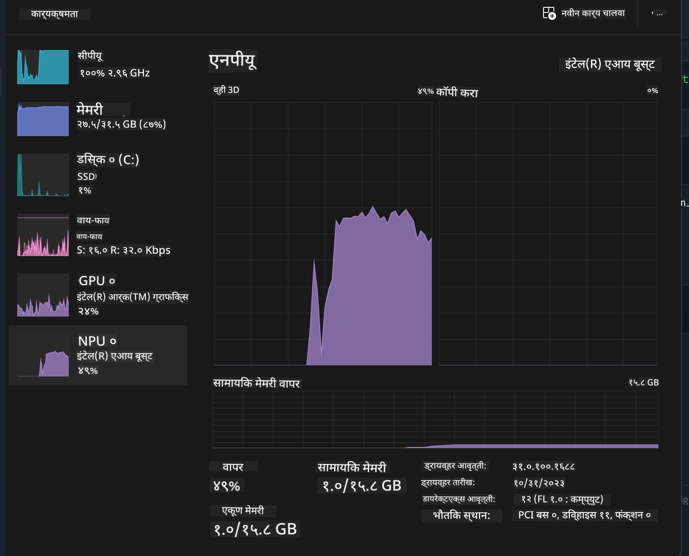
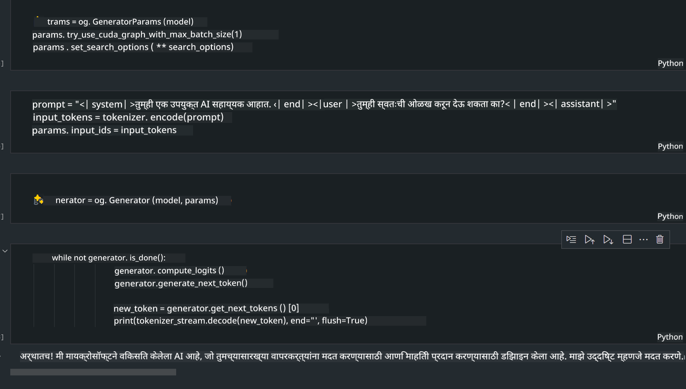
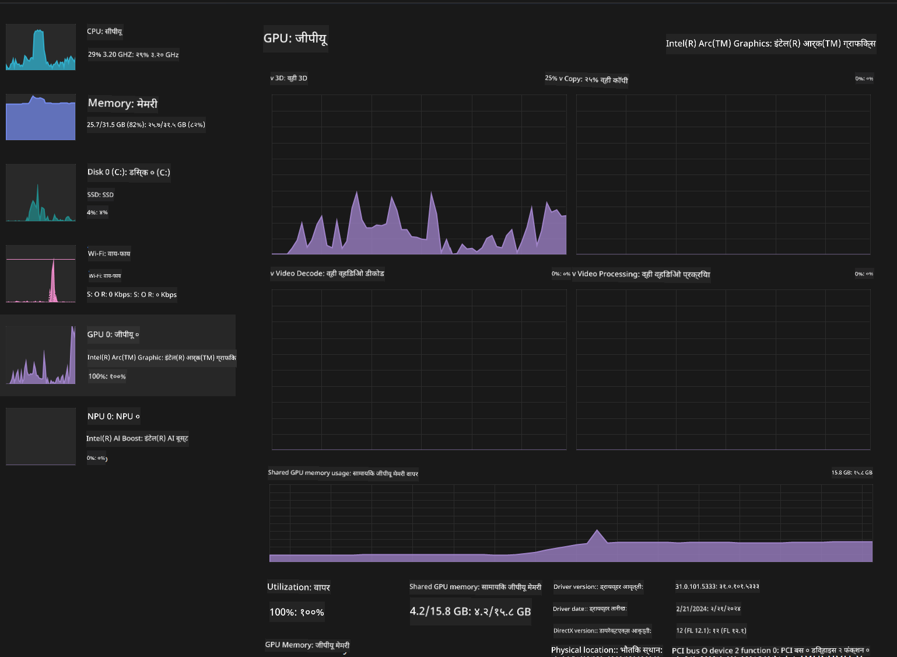

<!--
CO_OP_TRANSLATOR_METADATA:
{
  "original_hash": "e08ce816e23ad813244a09ca34ebb8ac",
  "translation_date": "2025-07-16T19:58:18+00:00",
  "source_file": "md/01.Introduction/03/AIPC_Inference.md",
  "language_code": "mr"
}
-->
# **AI PC मध्ये Inference Phi-3**

जनरेटिव्ह AI च्या प्रगतीमुळे आणि एज डिव्हाइस हार्डवेअर क्षमतांच्या सुधारण्यामुळे, अधिकाधिक जनरेटिव्ह AI मॉडेल्स वापरकर्त्यांच्या Bring Your Own Device (BYOD) डिव्हाइसेसवर समाकलित करता येऊ शकतात. AI PC हे अशाच मॉडेल्सपैकी एक आहे. 2024 पासून, Intel, AMD, आणि Qualcomm यांनी PC उत्पादकांसोबत सहकार्य करून AI PC सादर केले आहेत जे हार्डवेअर सुधारणा करून स्थानिक जनरेटिव्ह AI मॉडेल्सची तैनाती सुलभ करतात. या चर्चेत, आपण Intel AI PC वर Phi-3 कसे तैनात करायचे यावर लक्ष केंद्रित करू.

### NPU म्हणजे काय

NPU (Neural Processing Unit) हा एक समर्पित प्रोसेसर किंवा मोठ्या SoC मधील प्रोसेसिंग युनिट आहे, जो विशेषतः न्यूरल नेटवर्क ऑपरेशन्स आणि AI कार्यांसाठी वेग वाढवण्यासाठी डिझाइन केलेला आहे. सामान्य CPU आणि GPU पेक्षा वेगळा, NPU डेटा-चालित समांतर संगणनासाठी ऑप्टिमाइझ केलेला असतो, ज्यामुळे तो व्हिडिओ आणि प्रतिमा सारख्या मोठ्या मल्टीमीडिया डेटावर आणि न्यूरल नेटवर्कसाठी डेटा प्रक्रियेसाठी अत्यंत कार्यक्षम ठरतो. तो विशेषतः AI संबंधित कार्यांसाठी उपयुक्त आहे, जसे की भाषण ओळख, व्हिडिओ कॉलमधील पार्श्वभूमी धुंद करणे, आणि फोटो किंवा व्हिडिओ संपादन प्रक्रियेत ऑब्जेक्ट डिटेक्शन.

## NPU विरुद्ध GPU

अनेक AI आणि मशीन लर्निंग कार्ये GPU वर चालतात, पण GPU आणि NPU मध्ये महत्त्वाचा फरक आहे.  
GPU समांतर संगणनासाठी ओळखले जातात, पण सर्व GPU ग्राफिक्स व्यतिरिक्त कार्यक्षम नसतात. NPU मात्र न्यूरल नेटवर्क ऑपरेशन्ससाठी आवश्यक असलेल्या जटिल गणनांसाठी खास तयार केलेले असतात, ज्यामुळे ते AI कार्यांसाठी अत्यंत प्रभावी ठरतात.

सारांशात, NPU हे गणिती तज्ञ आहेत जे AI गणनांना वेग देतात आणि AI PC च्या उदयोन्मुख युगात त्यांची महत्त्वाची भूमिका आहे!

***हे उदाहरण Intel च्या नवीनतम Intel Core Ultra Processor वर आधारित आहे***

## **1. Phi-3 मॉडेल चालवण्यासाठी NPU वापरा**

Intel® NPU डिव्हाइस हा Intel क्लायंट CPU सोबत समाकलित AI inference accelerator आहे, जो Intel® Core™ Ultra CPU पिढीपासून (पूर्वी Meteor Lake म्हणून ओळखला जात असे) सुरू होतो. हे कृत्रिम न्यूरल नेटवर्क कार्यांची ऊर्जा कार्यक्षम अंमलबजावणी सक्षम करते.


**Intel NPU Acceleration Library**

Intel NPU Acceleration Library [https://github.com/intel/intel-npu-acceleration-library](https://github.com/intel/intel-npu-acceleration-library) ही Python लायब्ररी आहे जी Intel Neural Processing Unit (NPU) च्या शक्तीचा वापर करून तुमच्या अॅप्लिकेशन्सची कार्यक्षमता वाढवते आणि सुसंगत हार्डवेअरवर उच्च-गती गणना करते.

Intel® Core™ Ultra प्रोसेसरवर चालणाऱ्या AI PC वर Phi-3-mini चे उदाहरण.


pip वापरून Python लायब्ररी इन्स्टॉल करा

```bash

   pip install intel-npu-acceleration-library

```

***टीप*** प्रकल्प अजून विकासाच्या टप्प्यात आहे, पण संदर्भ मॉडेल आधीच खूप पूर्ण आहे.

### **Intel NPU Acceleration Library सह Phi-3 चालवणे**

Intel NPU अॅक्सेलरेशन वापरताना, ही लायब्ररी पारंपरिक एन्कोडिंग प्रक्रियेला प्रभावित करत नाही. तुम्हाला फक्त ही लायब्ररी वापरून मूळ Phi-3 मॉडेलचे क्वांटायझेशन करायचे आहे, जसे FP16, INT8, INT4, इत्यादी.

```python
from transformers import AutoTokenizer, pipeline,TextStreamer
from intel_npu_acceleration_library import NPUModelForCausalLM, int4
from intel_npu_acceleration_library.compiler import CompilerConfig
import warnings

model_id = "microsoft/Phi-3-mini-4k-instruct"

compiler_conf = CompilerConfig(dtype=int4)
model = NPUModelForCausalLM.from_pretrained(
    model_id, use_cache=True, config=compiler_conf, attn_implementation="sdpa"
).eval()

tokenizer = AutoTokenizer.from_pretrained(model_id)

text_streamer = TextStreamer(tokenizer, skip_prompt=True)
```

क्वांटायझेशन यशस्वी झाल्यानंतर, Phi-3 मॉडेल चालवण्यासाठी NPU कॉल करा.

```python
generation_args = {
   "max_new_tokens": 1024,
   "return_full_text": False,
   "temperature": 0.3,
   "do_sample": False,
   "streamer": text_streamer,
}

pipe = pipeline(
   "text-generation",
   model=model,
   tokenizer=tokenizer,
)

query = "<|system|>You are a helpful AI assistant.<|end|><|user|>Can you introduce yourself?<|end|><|assistant|>"

with warnings.catch_warnings():
    warnings.simplefilter("ignore")
    pipe(query, **generation_args)
```

कोड चालवताना, Task Manager मधून NPU ची चालू स्थिती पाहू शकतो.



***नमुने*** : [AIPC_NPU_DEMO.ipynb](../../../../../code/03.Inference/AIPC/AIPC_NPU_DEMO.ipynb)

## **2. Phi-3 मॉडेल चालवण्यासाठी DirectML + ONNX Runtime वापरा**

### **DirectML म्हणजे काय**

[DirectML](https://github.com/microsoft/DirectML) हा उच्च-कार्यक्षम, हार्डवेअर-त्वरित DirectX 12 लायब्ररी आहे जो मशीन लर्निंगसाठी वापरला जातो. DirectML सामान्य मशीन लर्निंग कार्यांसाठी GPU अॅक्सेलरेशन पुरवतो आणि AMD, Intel, NVIDIA, Qualcomm सारख्या विक्रेत्यांच्या सर्व DirectX 12 समर्थित GPU वर चालतो.

स्वतंत्रपणे वापरल्यास, DirectML API हा एक कमी-स्तरीय DirectX 12 लायब्ररी आहे आणि उच्च-कार्यक्षमता, कमी विलंब असलेल्या अॅप्लिकेशन्ससाठी योग्य आहे, जसे फ्रेमवर्क, गेम्स, आणि इतर रिअल-टाइम अॅप्लिकेशन्स. DirectML चा Direct3D 12 सोबत सहज समाकलन आणि कमी ओव्हरहेड यामुळे तो मशीन लर्निंगसाठी आदर्श आहे, जेथे उच्च कार्यक्षमता आणि हार्डवेअरवर परिणामांची विश्वसनीयता आवश्यक आहे.

***टीप*** : नवीनतम DirectML मध्ये NPU सपोर्ट आहे (https://devblogs.microsoft.com/directx/introducing-neural-processor-unit-npu-support-in-directml-developer-preview/)

### DirectML आणि CUDA यांच्या क्षमतांबाबत:

**DirectML** ही Microsoft द्वारे विकसित केलेली मशीन लर्निंग लायब्ररी आहे. ती Windows डिव्हाइसेसवर मशीन लर्निंग कार्ये वेगाने चालवण्यासाठी डिझाइन केली आहे.
- DX12-आधारित: DirectML DirectX 12 वर आधारित आहे, ज्यामुळे NVIDIA आणि AMD दोन्ही GPU वर काम करते.
- विस्तृत समर्थन: DX12 वापरल्यामुळे, DirectML कोणत्याही DX12 समर्थित GPU सोबत काम करू शकते, अगदी इंटिग्रेटेड GPU देखील.
- प्रतिमा प्रक्रिया: DirectML प्रतिमा आणि इतर डेटा न्यूरल नेटवर्क वापरून प्रक्रिया करते, ज्यामुळे प्रतिमा ओळख, ऑब्जेक्ट डिटेक्शन सारख्या कार्यांसाठी उपयुक्त आहे.
- सोपी सेटअप: DirectML सेटअप करणे सोपे आहे आणि GPU उत्पादकांकडून विशिष्ट SDK किंवा लायब्ररीची गरज नाही.
- कार्यक्षमता: काही प्रकरणांमध्ये, DirectML चांगले काम करते आणि CUDA पेक्षा जलद असू शकते, विशेषतः काही विशिष्ट कार्यांसाठी.
- मर्यादा: मात्र, काही वेळा float16 मोठ्या बॅच साइजसाठी DirectML हळू पडू शकते.

**CUDA** ही NVIDIA ची समांतर संगणन प्लॅटफॉर्म आणि प्रोग्रामिंग मॉडेल आहे. ती NVIDIA GPU चा वापर करून सामान्य संगणन, मशीन लर्निंग, आणि वैज्ञानिक सिम्युलेशन्ससाठी डेव्हलपर्सना मदत करते.
- NVIDIA-विशिष्ट: CUDA फक्त NVIDIA GPU साठी डिझाइन केलेली आहे.
- अत्यंत ऑप्टिमाइझ्ड: NVIDIA GPU वापरताना उत्कृष्ट कार्यक्षमता देते.
- व्यापक वापर: अनेक मशीन लर्निंग फ्रेमवर्क्स (जसे TensorFlow, PyTorch) मध्ये CUDA सपोर्ट आहे.
- सानुकूलन: डेव्हलपर्स CUDA सेटिंग्ज सानुकूल करू शकतात, ज्यामुळे सर्वोत्तम कार्यक्षमता मिळू शकते.
- मर्यादा: मात्र, CUDA फक्त NVIDIA हार्डवेअरवर चालते, ज्यामुळे इतर GPU साठी मर्यादित आहे.

### DirectML आणि CUDA मधून निवड

DirectML आणि CUDA मधील निवड तुमच्या वापराच्या प्रकरणावर, हार्डवेअर उपलब्धतेवर आणि पसंतीवर अवलंबून आहे.  
जर तुम्हाला अधिक व्यापक सुसंगतता आणि सोपी सेटअप हवी असेल, तर DirectML चांगला पर्याय आहे. मात्र, NVIDIA GPU असल्यास आणि अत्यंत ऑप्टिमाइझ्ड कार्यक्षमता हवी असल्यास, CUDA सर्वोत्तम आहे. दोन्हीची स्वतःची ताकद आणि मर्यादा आहेत, त्यामुळे तुमच्या गरजा आणि हार्डवेअर लक्षात घेऊन निर्णय घ्या.

### **ONNX Runtime सह जनरेटिव्ह AI**

AI च्या युगात, AI मॉडेल्सची पोर्टेबिलिटी खूप महत्त्वाची आहे. ONNX Runtime वापरून प्रशिक्षित मॉडेल्स सहजपणे विविध डिव्हाइसेसवर तैनात करता येतात. डेव्हलपर्सना inference फ्रेमवर्कची काळजी करण्याची गरज नाही, ते एकसंध API वापरून मॉडेल inference पूर्ण करू शकतात. जनरेटिव्ह AI च्या युगात, ONNX Runtime ने कोड ऑप्टिमायझेशन देखील केले आहे (https://onnxruntime.ai/docs/genai/). ऑप्टिमाइझ्ड ONNX Runtime वापरून, क्वांटायझ्ड जनरेटिव्ह AI मॉडेल विविध टर्मिनल्सवर inference करू शकतो. ONNX Runtime सह जनरेटिव्ह AI मध्ये, तुम्ही Python, C#, C / C++ वापरून AI मॉडेल API inference करू शकता. अर्थात, iPhone वर तैनातीसाठी C++ चा फायदा घेता येतो.

[नमुना कोड](https://github.com/Azure-Samples/Phi-3MiniSamples/tree/main/onnx)

***ONNX Runtime लायब्ररी कंपाईल करा***

```bash

winget install --id=Kitware.CMake  -e

git clone https://github.com/microsoft/onnxruntime.git

cd .\onnxruntime\

./build.bat --build_shared_lib --skip_tests --parallel --use_dml --config Release

cd ../

git clone https://github.com/microsoft/onnxruntime-genai.git

cd .\onnxruntime-genai\

mkdir ort

cd ort

mkdir include

mkdir lib

copy ..\onnxruntime\include\onnxruntime\core\providers\dml\dml_provider_factory.h ort\include

copy ..\onnxruntime\include\onnxruntime\core\session\onnxruntime_c_api.h ort\include

copy ..\onnxruntime\build\Windows\Release\Release\*.dll ort\lib

copy ..\onnxruntime\build\Windows\Release\Release\onnxruntime.lib ort\lib

python build.py --use_dml


```

**लायब्ररी इन्स्टॉल करा**

```bash

pip install .\onnxruntime_genai_directml-0.3.0.dev0-cp310-cp310-win_amd64.whl

```

हे चालवलेले निकाल आहे



***नमुने*** : [AIPC_DirectML_DEMO.ipynb](../../../../../code/03.Inference/AIPC/AIPC_DirectML_DEMO.ipynb)

## **3. Phi-3 मॉडेल चालवण्यासाठी Intel OpenVino वापरा**

### **OpenVINO म्हणजे काय**

[OpenVINO](https://github.com/openvinotoolkit/openvino) हा एक ओपन-सोर्स टूलकिट आहे जो डीप लर्निंग मॉडेल्सचे ऑप्टिमायझेशन आणि तैनाती सुलभ करतो. तो TensorFlow, PyTorch आणि इतर लोकप्रिय फ्रेमवर्क्समधील व्हिजन, ऑडिओ, आणि भाषा मॉडेल्ससाठी डीप लर्निंग कार्यक्षमता वाढवतो. OpenVINO वापरून सुरुवात करा. OpenVINO CPU आणि GPU सोबत वापरून Phi-3 मॉडेल चालवू शकतो.

***टीप***: सध्या OpenVINO NPU सपोर्ट करत नाही.

### **OpenVINO लायब्ररी इन्स्टॉल करा**

```bash

 pip install git+https://github.com/huggingface/optimum-intel.git

 pip install git+https://github.com/openvinotoolkit/nncf.git

 pip install openvino-nightly

```

### **OpenVINO सह Phi-3 चालवणे**

NPU प्रमाणेच, OpenVINO देखील क्वांटायझ्ड मॉडेल्स चालवून जनरेटिव्ह AI मॉडेल्स कॉल करते. आपल्याला प्रथम Phi-3 मॉडेल क्वांटायझ करावे लागेल आणि optimum-cli वापरून कमांड लाइनवर मॉडेल क्वांटायझेशन पूर्ण करावे लागेल.

**INT4**

```bash

optimum-cli export openvino --model "microsoft/Phi-3-mini-4k-instruct" --task text-generation-with-past --weight-format int4 --group-size 128 --ratio 0.6  --sym  --trust-remote-code ./openvinomodel/phi3/int4

```

**FP16**

```bash

optimum-cli export openvino --model "microsoft/Phi-3-mini-4k-instruct" --task text-generation-with-past --weight-format fp16 --trust-remote-code ./openvinomodel/phi3/fp16

```

रूपांतरित फॉरमॅट, असे दिसते


मॉडेल पथ (model_dir), संबंधित कॉन्फिगरेशन (ov_config = {"PERFORMANCE_HINT": "LATENCY", "NUM_STREAMS": "1", "CACHE_DIR": ""}), आणि हार्डवेअर-त्वरित डिव्हाइसेस (GPU.0) OVModelForCausalLM द्वारे लोड करा

```python

ov_model = OVModelForCausalLM.from_pretrained(
     model_dir,
     device='GPU.0',
     ov_config=ov_config,
     config=AutoConfig.from_pretrained(model_dir, trust_remote_code=True),
     trust_remote_code=True,
)

```

कोड चालवताना, Task Manager मधून GPU ची चालू स्थिती पाहू शकतो



***नमुने*** : [AIPC_OpenVino_Demo.ipynb](../../../../../code/03.Inference/AIPC/AIPC_OpenVino_Demo.ipynb)

### ***टीप*** : वरील तीन पद्धतींमध्ये प्रत्येकाची स्वतःची ताकद आहे, पण AI PC inference साठी NPU अॅक्सेलरेशन वापरणे शिफारसीय आहे.

**अस्वीकरण**:  
हा दस्तऐवज AI अनुवाद सेवा [Co-op Translator](https://github.com/Azure/co-op-translator) वापरून अनुवादित केला आहे. आम्ही अचूकतेसाठी प्रयत्नशील असलो तरी, कृपया लक्षात घ्या की स्वयंचलित अनुवादांमध्ये चुका किंवा अचूकतेची कमतरता असू शकते. मूळ दस्तऐवज त्याच्या स्थानिक भाषेत अधिकृत स्रोत मानला जावा. महत्त्वाच्या माहितीसाठी व्यावसायिक मानवी अनुवाद करण्याची शिफारस केली जाते. या अनुवादाच्या वापरामुळे उद्भवणाऱ्या कोणत्याही गैरसमजुती किंवा चुकीच्या अर्थलागी आम्ही जबाबदार नाही.