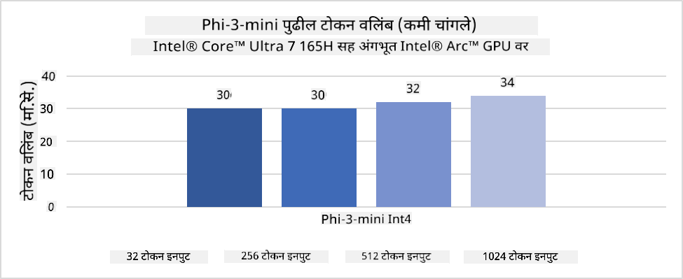
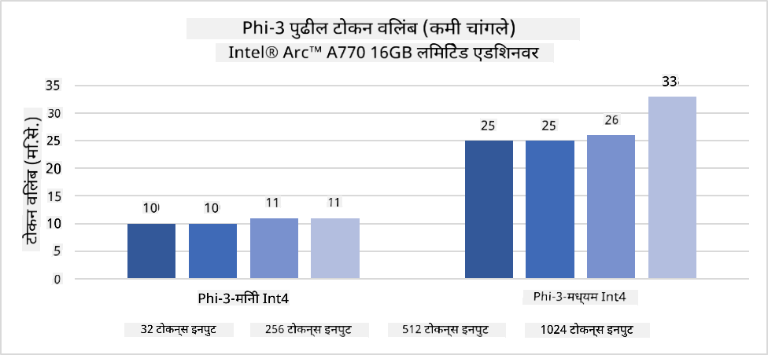
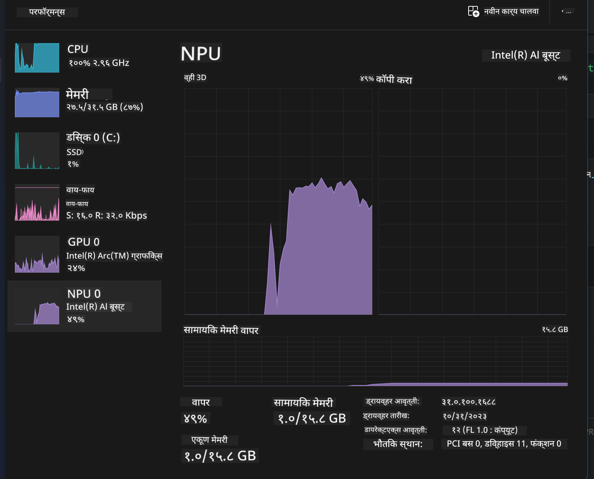
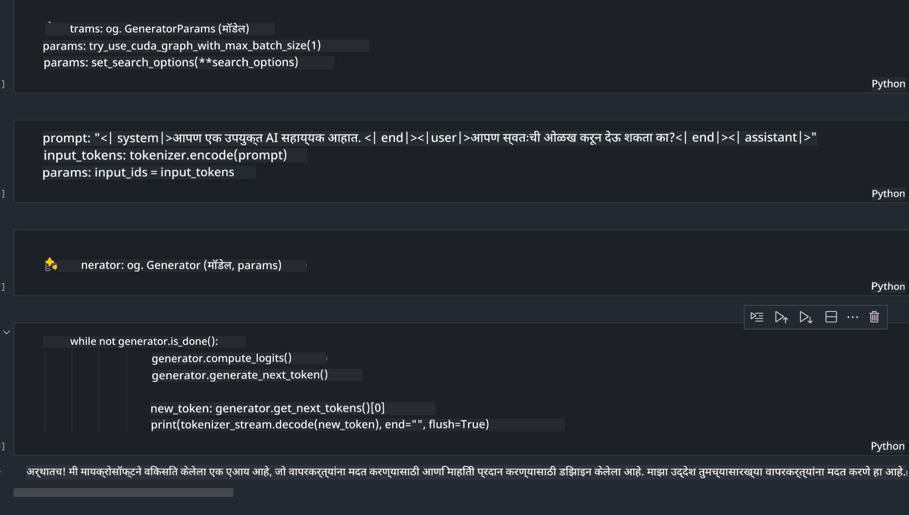
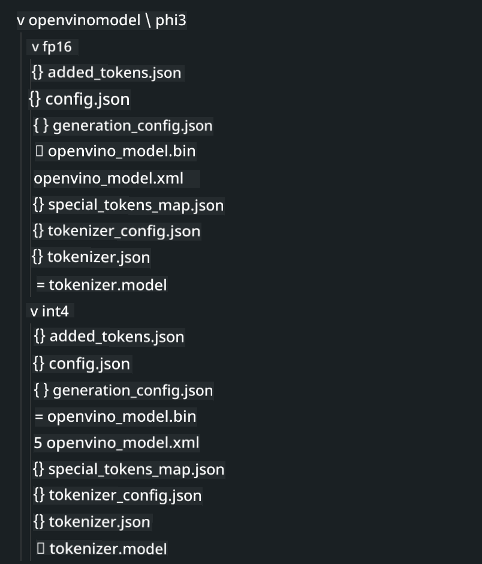

<!--
CO_OP_TRANSLATOR_METADATA:
{
  "original_hash": "e08ce816e23ad813244a09ca34ebb8ac",
  "translation_date": "2025-05-09T10:07:18+00:00",
  "source_file": "md/01.Introduction/03/AIPC_Inference.md",
  "language_code": "mr"
}
-->
# **AI PC मध्ये Phi-3 चे इनफरन्स**

जनरेटिव्ह AI च्या प्रगतीमुळे आणि एज डिव्हाइस हार्डवेअर क्षमतांतील सुधारणा मुळे, आता अधिकाधिक जनरेटिव्ह AI मॉडेल्स वापरकर्त्यांच्या Bring Your Own Device (BYOD) डिव्हाइसवर इंटिग्रेट करता येऊ शकतात. AI PC हे अशाच मॉडेल्सपैकी एक आहे. 2024 पासून, Intel, AMD, आणि Qualcomm यांनी PC उत्पादकांसोबत सहकार्य करून AI PC सादर केले आहेत जे हार्डवेअर बदलांद्वारे लोकल जनरेटिव्ह AI मॉडेल्सची डिप्लॉयमेंट सुलभ करतात. या चर्चेत, आपण Intel AI PC वर Phi-3 कसे डिप्लॉय करायचे ते पाहणार आहोत.

### NPU म्हणजे काय

NPU (Neural Processing Unit) हा एक समर्पित प्रोसेसर किंवा प्रोसेसिंग युनिट आहे जो मोठ्या SoC मध्ये असतो आणि विशेषतः न्यूरल नेटवर्क ऑपरेशन्स आणि AI कामांसाठी वेग वाढवण्यासाठी डिझाइन केला जातो. सामान्य CPU आणि GPU पेक्षा, NPU डेटा-ड्रिव्हन पॅरालेल कम्प्युटिंगसाठी ऑप्टिमाइझ्ड असतात, ज्यामुळे ते व्हिडिओ आणि इमेजेस सारख्या मोठ्या मल्टिमिडिया डेटावर आणि न्यूरल नेटवर्कसाठी डेटावर अत्यंत कार्यक्षम असतात. ते विशेषतः AI संबंधित कामांसाठी, जसे की स्पीच रिकग्निशन, व्हिडिओ कॉलमधील बॅकग्राउंड ब्लरिंग, आणि ऑब्जेक्ट डिटेक्शनसारख्या फोटो किंवा व्हिडिओ एडिटिंग प्रक्रियांमध्ये कुशल असतात.

## NPU vs GPU

जरी अनेक AI आणि मशीन लर्निंग वर्कलोड GPU वर चालतात, तरी GPU आणि NPU मध्ये एक महत्त्वाचा फरक आहे.  
GPU पॅरालेल कम्प्युटिंगसाठी ओळखले जातात, पण सर्व GPU ग्राफिक्स व्यतिरिक्त कार्यक्षम नसतात. NPU मात्र न्यूरल नेटवर्क ऑपरेशन्समध्ये लागणाऱ्या क्लिष्ट गणनांसाठी बनवलेले असतात, ज्यामुळे ते AI कामांसाठी अत्यंत प्रभावी ठरतात.

सारांश म्हणजे, NPU हे गणिताचे तज्ञ आहेत जे AI गणनांना वेग देतात आणि AI PC च्या उदयाच्या युगात त्यांची महत्त्वाची भूमिका आहे!

***हे उदाहरण Intel च्या नवीनतम Intel Core Ultra Processor वर आधारित आहे***

## **1. Phi-3 मॉडेल चालवण्यासाठी NPU वापरणे**

Intel® NPU डिव्हाइस हा Intel क्लायंट CPU मध्ये एक AI इनफरन्स अॅक्सेलरेटर आहे, जो Intel® Core™ Ultra जनरेशनच्या CPU पासून (पूर्वी Meteor Lake म्हणून ओळखला जात होता) सुरू होतो. तो आर्टिफिशियल न्यूरल नेटवर्क कामे ऊर्जा-कुशलतेने पार पाडण्यास सक्षम करतो.





**Intel NPU Acceleration Library**

Intel NPU Acceleration Library [https://github.com/intel/intel-npu-acceleration-library](https://github.com/intel/intel-npu-acceleration-library) ही Python लायब्ररी आहे जी Intel Neural Processing Unit (NPU) च्या शक्तीचा वापर करून तुमच्या अॅप्लिकेशन्सची कार्यक्षमता वाढवण्यासाठी डिझाइन केली गेली आहे, ज्यामुळे जुळणाऱ्या हार्डवेअरवर उच्च-गतीची गणना करता येते.

Intel® Core™ Ultra प्रोसेसरवर चालणाऱ्या AI PC वर Phi-3-mini चे उदाहरण.


pip वापरून Python लायब्ररी इन्स्टॉल करा

```bash

   pip install intel-npu-acceleration-library

```

***टीप*** प्रोजेक्ट अजून विकासात आहे, पण संदर्भ मॉडेल खूपच पूर्ण आहे.

### **Intel NPU Acceleration Library सह Phi-3 चालवणे**

Intel NPU अॅक्सेलरेशन वापरून, ही लायब्ररी पारंपरिक एन्कोडिंग प्रक्रियेला प्रभावित करत नाही. तुम्हाला फक्त मूळ Phi-3 मॉडेलचे क्वांटायझेशन करायचे आहे, जसे FP16, INT8, INT4 यांसारखे

```python
from transformers import AutoTokenizer, pipeline,TextStreamer
from intel_npu_acceleration_library import NPUModelForCausalLM, int4
from intel_npu_acceleration_library.compiler import CompilerConfig
import warnings

model_id = "microsoft/Phi-3-mini-4k-instruct"

compiler_conf = CompilerConfig(dtype=int4)
model = NPUModelForCausalLM.from_pretrained(
    model_id, use_cache=True, config=compiler_conf, attn_implementation="sdpa"
).eval()

tokenizer = AutoTokenizer.from_pretrained(model_id)

text_streamer = TextStreamer(tokenizer, skip_prompt=True)
```

क्वांटायझेशन यशस्वी झाल्यानंतर, Phi-3 मॉडेल चालवण्यासाठी NPU कॉल करा.

```python
generation_args = {
   "max_new_tokens": 1024,
   "return_full_text": False,
   "temperature": 0.3,
   "do_sample": False,
   "streamer": text_streamer,
}

pipe = pipeline(
   "text-generation",
   model=model,
   tokenizer=tokenizer,
)

query = "<|system|>You are a helpful AI assistant.<|end|><|user|>Can you introduce yourself?<|end|><|assistant|>"

with warnings.catch_warnings():
    warnings.simplefilter("ignore")
    pipe(query, **generation_args)
```

कोड चालवताना, Task Manager मधून NPU ची रनिंग स्थिती पाहू शकतो.



***उदाहरण*** : [AIPC_NPU_DEMO.ipynb](../../../../../code/03.Inference/AIPC/AIPC_NPU_DEMO.ipynb)

## **2. Phi-3 मॉडेल चालवण्यासाठी DirectML + ONNX Runtime वापरणे**

### **DirectML म्हणजे काय**

[DirectML](https://github.com/microsoft/DirectML) हा एक उच्च कार्यक्षम, हार्डवेअर-अॅक्सेलरेटेड DirectX 12 लायब्ररी आहे जो मशीन लर्निंगसाठी वापरला जातो. DirectML सामान्य मशीन लर्निंग टास्कसाठी GPU अॅक्सेलरेशन पुरवतो आणि AMD, Intel, NVIDIA, Qualcomm सारख्या विविध हार्डवेअर आणि ड्रायव्हर्सवर चालतो.

स्वतंत्रपणे वापरल्यास, DirectML API हा एक लो-लेव्हल DirectX 12 लायब्ररी आहे जो उच्च कार्यक्षमता, कमी लेटन्सी अॅप्लिकेशन्ससाठी योग्य आहे, जसे फ्रेमवर्क, गेम्स, आणि इतर रिअल-टाइम अॅप्लिकेशन्स. Direct3D 12 सोबतचा सहज समाकलन आणि कमी ओव्हरहेडमुळे तसेच हार्डवेअरवर एकसारखे वर्तन यामुळे DirectML मशीन लर्निंगसाठी उत्तम आहे, विशेषतः जेव्हा उच्च कार्यक्षमता आणि विश्वासार्हता दोन्ही आवश्यक असतात.

***टीप*** : नवीनतम DirectML मध्ये NPU सपोर्ट आहे (https://devblogs.microsoft.com/directx/introducing-neural-processor-unit-npu-support-in-directml-developer-preview/)

### DirectML आणि CUDA यांची क्षमता आणि कामगिरी यामधील तुलना:

**DirectML** हा Microsoft ने विकसित केलेला मशीन लर्निंग लायब्ररी आहे. तो Windows डिव्हाइसेसवर, जसे डेस्कटॉप, लॅपटॉप, आणि एज डिव्हाइसेसवर मशीन लर्निंग वर्कलोड्स अॅक्सेलरेट करण्यासाठी डिझाइन केला आहे.  
- DX12-आधारित: DirectML DirectX 12 (DX12) वर आधारित आहे, ज्यामुळे NVIDIA आणि AMD सारख्या GPU सोबत मोठ्या प्रमाणात हार्डवेअर सपोर्ट मिळतो.  
- विस्तृत सपोर्ट: DX12 वापरल्यामुळे, DirectML कोणत्याही DX12 समर्थित GPU सोबत काम करू शकतो, अगदी इंटिग्रेटेड GPU देखील.  
- इमेज प्रोसेसिंग: DirectML न्यूरल नेटवर्क वापरून इमेजेस आणि इतर डेटा प्रक्रिया करतो, ज्यामुळे इमेज रिकग्निशन, ऑब्जेक्ट डिटेक्शन सारख्या कामांसाठी उपयुक्त आहे.  
- सेटअप सोपे: DirectML सेटअप करणे सोपे आहे आणि GPU उत्पादकांकडून विशिष्ट SDKs किंवा लायब्ररीची गरज नाही.  
- कामगिरी: काही प्रकरणांमध्ये, DirectML चांगले काम करते आणि CUDA पेक्षा जलद असू शकतो, विशेषतः काही वर्कलोडसाठी.  
- मर्यादा: मात्र, काही वेळा DirectML थोडा हळू असू शकतो, विशेषतः float16 मोठ्या बॅच साईझसाठी.

**CUDA** हा NVIDIA चा पॅरालेल कम्प्युटिंग प्लॅटफॉर्म आणि प्रोग्रामिंग मॉडेल आहे. तो विकसकांना NVIDIA GPU चा वापर करून सामान्य कम्प्युटिंग, मशीन लर्निंग आणि वैज्ञानिक सिम्युलेशन्ससाठी शक्ती मिळवून देतो.  
- NVIDIA-विशिष्ट: CUDA फक्त NVIDIA GPU सोबत कार्य करतो आणि त्यासाठीच डिझाइन केला आहे.  
- अत्यंत ऑप्टिमाइझ्ड: GPU अॅक्सेलरेटेड टास्कसाठी, विशेषतः NVIDIA GPU वापरताना उत्कृष्ट कामगिरी देतो.  
- मोठ्या प्रमाणावर वापरला जातो: अनेक मशीन लर्निंग फ्रेमवर्क्स आणि लायब्ररींना (जसे TensorFlow आणि PyTorch) CUDA सपोर्ट आहे.  
- सानुकूलन: विकसक विशिष्ट टास्कसाठी CUDA सेटिंग्ज अचूक करू शकतात, ज्यामुळे उत्तम कामगिरी मिळू शकते.  
- मर्यादा: मात्र, CUDA फक्त NVIDIA हार्डवेअरवर अवलंबून असल्यामुळे, वेगवेगळ्या GPU वर ब्रॉड सपोर्ट कमी होतो.

### DirectML आणि CUDA यामध्ये निवड कशी करावी

DirectML आणि CUDA मधील निवड तुमच्या वापराच्या प्रकरणावर, हार्डवेअर उपलब्धतेवर आणि पसंतीवर अवलंबून आहे.  
जर तुम्हाला जास्त हार्डवेअर सपोर्ट आणि सेटअप सुलभता हवी असेल तर DirectML चांगला पर्याय आहे. मात्र, जर तुमच्याकडे NVIDIA GPU असेल आणि अत्यंत ऑप्टिमाइझ्ड कामगिरी हवी असेल तर CUDA चांगला पर्याय राहील. सारांश म्हणजे, दोन्हीचेच फायदे आणि तोटे आहेत, त्यामुळे तुमच्या गरजा आणि हार्डवेअर पाहून निर्णय घ्या.

### **ONNX Runtime सह जनरेटिव्ह AI**

AI च्या युगात, AI मॉडेल्सची पोर्टेबिलिटी खूप महत्त्वाची आहे. ONNX Runtime वापरून प्रशिक्षित मॉडेल्स वेगवेगळ्या डिव्हाइसेसवर सहज डिप्लॉय करता येतात. डेव्हलपर्सना इनफरन्स फ्रेमवर्कची काळजी न करता एकसंध API वापरून मॉडेल इनफरन्स पूर्ण करता येते. जनरेटिव्ह AI च्या युगात, ONNX Runtime ने कोड ऑप्टिमायझेशनही केली आहे (https://onnxruntime.ai/docs/genai/). ऑप्टिमाइझ्ड ONNX Runtime वापरून क्वांटायझ्ड जनरेटिव्ह AI मॉडेल विविध टर्मिनलवर इनफर करु शकतो. Python, C#, C / C++ द्वारे Generative AI सह ONNX Runtime API वापरता येतो. अर्थात, iPhone वर डिप्लॉयमेंट करताना C++ चा फायदा घेता येतो.

[Sample Code](https://github.com/Azure-Samples/Phi-3MiniSamples/tree/main/onnx)

***Generative AI सह ONNX Runtime लायब्ररी कंपाइल करा***

```bash

winget install --id=Kitware.CMake  -e

git clone https://github.com/microsoft/onnxruntime.git

cd .\onnxruntime\

./build.bat --build_shared_lib --skip_tests --parallel --use_dml --config Release

cd ../

git clone https://github.com/microsoft/onnxruntime-genai.git

cd .\onnxruntime-genai\

mkdir ort

cd ort

mkdir include

mkdir lib

copy ..\onnxruntime\include\onnxruntime\core\providers\dml\dml_provider_factory.h ort\include

copy ..\onnxruntime\include\onnxruntime\core\session\onnxruntime_c_api.h ort\include

copy ..\onnxruntime\build\Windows\Release\Release\*.dll ort\lib

copy ..\onnxruntime\build\Windows\Release\Release\onnxruntime.lib ort\lib

python build.py --use_dml


```

**लायब्ररी इन्स्टॉल करा**

```bash

pip install .\onnxruntime_genai_directml-0.3.0.dev0-cp310-cp310-win_amd64.whl

```

हा चालण्याचा निकाल आहे



***उदाहरण*** : [AIPC_DirectML_DEMO.ipynb](../../../../../code/03.Inference/AIPC/AIPC_DirectML_DEMO.ipynb)

## **3. Phi-3 मॉडेल चालवण्यासाठी Intel OpenVino वापरणे**

### **OpenVINO म्हणजे काय**

[OpenVINO](https://github.com/openvinotoolkit/openvino) हा एक ओपन-सोर्स टूलकिट आहे जो डीप लर्निंग मॉडेल्स ऑप्टिमायझेशन आणि डिप्लॉयमेंटसाठी वापरला जातो. तो TensorFlow, PyTorch आणि इतर लोकप्रिय फ्रेमवर्क्समधून व्हिजन, ऑडिओ, आणि लँग्वेज मॉडेल्ससाठी डीप लर्निंगची कामगिरी वाढवतो. OpenVINO वापरून सुरुवात करा. OpenVINO CPU आणि GPU सह एकत्र वापरून Phi-3 मॉडेल चालवू शकतो.

***टीप***: सध्या OpenVINO NPU ला सपोर्ट करत नाही.

### **OpenVINO लायब्ररी इन्स्टॉल करा**

```bash

 pip install git+https://github.com/huggingface/optimum-intel.git

 pip install git+https://github.com/openvinotoolkit/nncf.git

 pip install openvino-nightly

```

### **OpenVINO सह Phi-3 चालवणे**

NPU प्रमाणेच, OpenVINO देखील जनरेटिव्ह AI मॉडेल कॉल क्वांटायझ्ड मॉडेल चालवून पूर्ण करतो. आपल्याला आधी Phi-3 मॉडेल क्वांटायझ करणे आवश्यक आहे आणि optimum-cli वापरून कमांड लाईनवर मॉडेल क्वांटायझेशन पूर्ण करावे लागते.

**INT4**

```bash

optimum-cli export openvino --model "microsoft/Phi-3-mini-4k-instruct" --task text-generation-with-past --weight-format int4 --group-size 128 --ratio 0.6  --sym  --trust-remote-code ./openvinomodel/phi3/int4

```

**FP16**

```bash

optimum-cli export openvino --model "microsoft/Phi-3-mini-4k-instruct" --task text-generation-with-past --weight-format fp16 --trust-remote-code ./openvinomodel/phi3/fp16

```

रूपांतरित फॉरमॅट, असे दिसते



मॉडेलचे पथ (model_dir), संबंधित कॉन्फिगरेशन (ov_config = {"PERFORMANCE_HINT": "LATENCY", "NUM_STREAMS": "1", "CACHE_DIR": ""}), आणि हार्डवेअर-अॅक्सेलरेटेड डिव्हाइसेस (GPU.0) OVModelForCausalLM द्वारे लोड करा

```python

ov_model = OVModelForCausalLM.from_pretrained(
     model_dir,
     device='GPU.0',
     ov_config=ov_config,
     config=AutoConfig.from_pretrained(model_dir, trust_remote_code=True),
     trust_remote_code=True,
)

```

कोड चालवताना, Task Manager मधून GPU ची रनिंग स्थिती पाहू शकतो


***उदाहरण*** : [AIPC_OpenVino_Demo.ipynb](../../../../../code/03.Inference/AIPC/AIPC_OpenVino_Demo.ipynb)

### ***टीप*** : वरील तीन पद्धतींना त्यांच्या स्वतःच्या फायदे आहेत, पण AI PC इनफरन्ससाठी NPU अॅक्सेलरेशन वापरणे शिफारसीय आहे.

**डिस्क्लेमर**:  
हा दस्तऐवज AI अनुवाद सेवा [Co-op Translator](https://github.com/Azure/co-op-translator) वापरून अनुवादित केला आहे. आम्ही अचूकतेसाठी प्रयत्न करतो, तरी कृपया लक्षात घ्या की स्वयंचलित अनुवादांमध्ये चुका किंवा अचूकतेचा अभाव असू शकतो. मूळ दस्तऐवज त्याच्या स्थानिक भाषेत अधिकृत स्रोत मानला जावा. महत्त्वाची माहिती असल्यास, व्यावसायिक मानवी अनुवाद शिफारसीय आहे. या अनुवादाच्या वापरामुळे उद्भवलेल्या कोणत्याही गैरसमजुती किंवा चुकीच्या अर्थनिर्णयांसाठी आम्ही जबाबदार नाही.