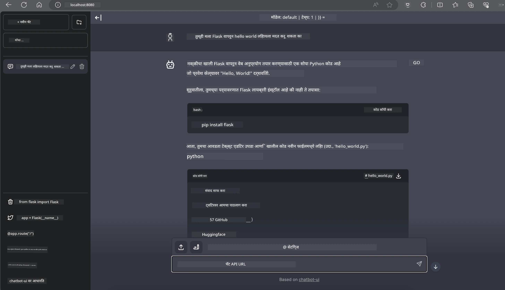

# **Nvidia Jetson मध्ये Inference Phi-3**

Nvidia Jetson ही Nvidia कडून आलेली एम्बेडेड कम्प्युटिंग बोर्ड्सची मालिका आहे. Jetson TK1, TX1 आणि TX2 मॉडेल्समध्ये Nvidia चा Tegra प्रोसेसर (किंवा SoC) असतो जो ARM आर्किटेक्चरवर आधारित सेंट्रल प्रोसेसिंग युनिट (CPU) एकत्र करतो. Jetson हा कमी वीज वापर करणारा सिस्टम आहे आणि मशीन लर्निंग अ‍ॅप्लिकेशन्स जलद करण्यासाठी डिझाइन केलेला आहे. Nvidia Jetson व्यावसायिक डेव्हलपर्सकडून सर्व उद्योगांमध्ये क्रांतिकारी AI उत्पादने तयार करण्यासाठी वापरला जातो, तसेच विद्यार्थी आणि उत्साही लोक AI शिकण्यासाठी आणि आश्चर्यकारक प्रोजेक्ट्स तयार करण्यासाठी वापरतात. SLM Jetson सारख्या एज डिव्हाइसेसवर तैनात केला जातो, ज्यामुळे औद्योगिक जनरेटिव्ह AI अ‍ॅप्लिकेशनच्या परिस्थितींचे अधिक चांगले अंमलबजावणी शक्य होते.

## NVIDIA Jetson वर तैनाती:
स्वयंचलित रोबोटिक्स आणि एम्बेडेड डिव्हाइसेसवर काम करणारे डेव्हलपर्स Phi-3 Mini चा फायदा घेऊ शकतात. Phi-3 ची तुलनेने लहान आकार एज तैनातीसाठी आदर्श आहे. प्रशिक्षणादरम्यान पॅरामीटर्स काळजीपूर्वक समायोजित केले गेले आहेत, ज्यामुळे प्रतिसादांमध्ये उच्च अचूकता सुनिश्चित होते.

### TensorRT-LLM ऑप्टिमायझेशन:
NVIDIA चा [TensorRT-LLM लायब्ररी](https://github.com/NVIDIA/TensorRT-LLM?WT.mc_id=aiml-138114-kinfeylo) मोठ्या भाषा मॉडेलच्या इनफरन्ससाठी ऑप्टिमायझेशन करतो. तो Phi-3 Mini च्या लांबच्या संदर्भ विंडोला समर्थन देतो, ज्यामुळे थ्रूपुट आणि लेटन्सी दोन्ही सुधारतात. ऑप्टिमायझेशनमध्ये LongRoPE, FP8 आणि inflight batching सारख्या तंत्रांचा समावेश आहे.

### उपलब्धता आणि तैनाती:
डेव्हलपर्स Phi-3 Mini ला 128K संदर्भ विंडोसह [NVIDIA च्या AI](https://www.nvidia.com/en-us/ai-data-science/generative-ai/) वर एक्सप्लोर करू शकतात. हे NVIDIA NIM म्हणून पॅकेज केलेले आहे, जे एक मायक्रोसर्व्हिस आहे ज्याचा एक स्टँडर्ड API आहे आणि ते कुठेही तैनात करता येते. याशिवाय, [TensorRT-LLM च्या GitHub वरच्या अंमलबजावण्या](https://github.com/NVIDIA/TensorRT-LLM) उपलब्ध आहेत.

## **1. तयारी**

a. Jetson Orin NX / Jetson NX

b. JetPack 5.1.2+

c. Cuda 11.8

d. Python 3.8+

## **2. Jetson मध्ये Phi-3 चालवणे**

आम्ही [Ollama](https://ollama.com) किंवा [LlamaEdge](https://llamaedge.com) निवडू शकतो.

जर तुम्हाला क्लाउड आणि एज डिव्हाइसेसवर एकाच वेळी gguf वापरायचे असेल, तर LlamaEdge ला WasmEdge म्हणून समजले जाऊ शकते (WasmEdge हा एक हलका, उच्च कार्यक्षम, स्केलेबल WebAssembly रनटाइम आहे जो क्लाउड नेटिव्ह, एज आणि विकेंद्रित अ‍ॅप्लिकेशन्ससाठी योग्य आहे. तो सर्व्हरलेस अ‍ॅप्लिकेशन्स, एम्बेडेड फंक्शन्स, मायक्रोसर्व्हिसेस, स्मार्ट कॉन्ट्रॅक्ट्स आणि IoT डिव्हाइसेसना समर्थन देतो. तुम्ही gguf चा क्वांटिटेटिव्ह मॉडेल एज डिव्हाइसेस आणि क्लाउडवर LlamaEdge द्वारे तैनात करू शकता.)


इथे वापरण्याचे टप्पे आहेत:

1. संबंधित लायब्ररी आणि फाइल्स इन्स्टॉल आणि डाउनलोड करा

```bash

curl -sSf https://raw.githubusercontent.com/WasmEdge/WasmEdge/master/utils/install.sh | bash -s -- --plugin wasi_nn-ggml

curl -LO https://github.com/LlamaEdge/LlamaEdge/releases/latest/download/llama-api-server.wasm

curl -LO https://github.com/LlamaEdge/chatbot-ui/releases/latest/download/chatbot-ui.tar.gz

tar xzf chatbot-ui.tar.gz

```

**टीप**: llama-api-server.wasm आणि chatbot-ui एकाच डायरेक्टरीमध्ये असणे आवश्यक आहे

2. टर्मिनलमध्ये स्क्रिप्ट्स चालवा

```bash

wasmedge --dir .:. --nn-preload default:GGML:AUTO:{Your gguf path} llama-api-server.wasm -p phi-3-chat

```

इथे चालवलेले निकाल आहे



***नमुना कोड*** [Phi-3 mini WASM Notebook Sample](https://github.com/Azure-Samples/Phi-3MiniSamples/tree/main/wasm)

सारांश म्हणून, Phi-3 Mini भाषा मॉडेलिंगमध्ये एक मोठा टप्पा आहे, जो कार्यक्षमता, संदर्भ जागरूकता आणि NVIDIA च्या ऑप्टिमायझेशन कौशल्याचा संगम आहे. तुम्ही रोबोट्स तयार करत असाल किंवा एज अ‍ॅप्लिकेशन्सवर काम करत असाल, Phi-3 Mini हा एक शक्तिशाली साधन आहे ज्याची माहिती असणे आवश्यक आहे.

**अस्वीकरण**:  
हा दस्तऐवज AI अनुवाद सेवा [Co-op Translator](https://github.com/Azure/co-op-translator) वापरून अनुवादित केला आहे. आम्ही अचूकतेसाठी प्रयत्नशील असलो तरी, कृपया लक्षात घ्या की स्वयंचलित अनुवादांमध्ये चुका किंवा अचूकतेची कमतरता असू शकते. मूळ दस्तऐवज त्याच्या स्थानिक भाषेत अधिकृत स्रोत मानला जावा. महत्त्वाच्या माहितीसाठी व्यावसायिक मानवी अनुवाद करण्याची शिफारस केली जाते. या अनुवादाच्या वापरामुळे उद्भवलेल्या कोणत्याही गैरसमजुती किंवा चुकीच्या अर्थलागी आम्ही जबाबदार नाही.