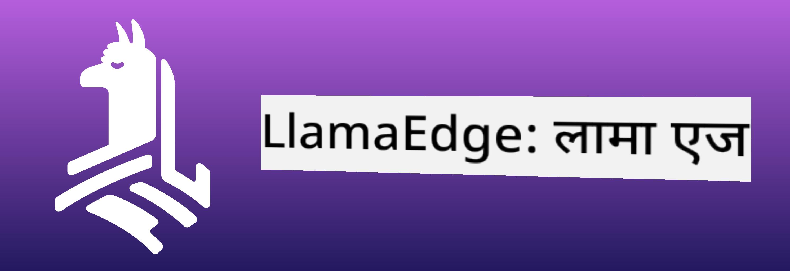
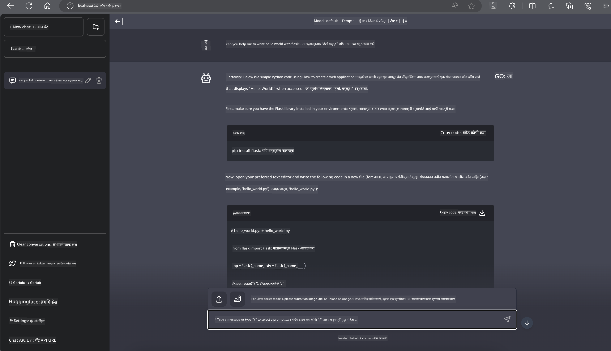

<!--
CO_OP_TRANSLATOR_METADATA:
{
  "original_hash": "be4101a30d98e95a71d42c276e8bcd37",
  "translation_date": "2025-05-09T11:32:54+00:00",
  "source_file": "md/01.Introduction/03/Jetson_Inference.md",
  "language_code": "mr"
}
-->
# **Nvidia Jetson मध्ये Inference Phi-3**

Nvidia Jetson हा Nvidia कडून बनवलेला एम्बेडेड कम्प्युटिंग बोर्ड्सचा एक मालिका आहे. Jetson TK1, TX1 आणि TX2 मॉडेल्समध्ये Nvidia चा Tegra प्रोसेसर (किंवा SoC) असतो जो ARM आर्किटेक्चरचा CPU एकत्र करतो. Jetson एक कमी पॉवर सिस्टम आहे आणि मशीन लर्निंग अॅप्लिकेशन्स जलद करण्यासाठी डिझाइन केलेले आहे. Nvidia Jetson व्यावसायिक डेव्हलपर्सकडून सर्व उद्योगांमध्ये क्रांतिकारी AI उत्पादने तयार करण्यासाठी वापरले जाते, तसेच विद्यार्थी आणि उत्साही लोक AI शिकण्यासाठी आणि अद्भुत प्रोजेक्ट्स तयार करण्यासाठी वापरतात. SLM Jetson सारख्या एज डिव्हाइसेस मध्ये तैनात केला जातो, ज्यामुळे औद्योगिक जनरेटिव AI अॅप्लिकेशन सीनारियोची अधिक चांगली अंमलबजावणी शक्य होते.

## NVIDIA Jetson वर तैनाती:
स्वयंचलित रोबोटिक्स आणि एम्बेडेड डिव्हाइसेसवर काम करणारे डेव्हलपर्स Phi-3 Mini वापरू शकतात. Phi-3 चे तुलनेने लहान आकार एज डिप्लॉयमेंटसाठी आदर्श आहे. प्रशिक्षणादरम्यान पॅरामीटर्स काळजीपूर्वक ट्यून केले गेले आहेत, ज्यामुळे उत्तरांमध्ये उच्च अचूकता सुनिश्चित होते.

### TensorRT-LLM ऑप्टिमायझेशन:
NVIDIA चा [TensorRT-LLM लायब्ररी](https://github.com/NVIDIA/TensorRT-LLM?WT.mc_id=aiml-138114-kinfeylo) मोठ्या भाषा मॉडेलच्या इन्फरन्ससाठी ऑप्टिमायझेशन करते. हे Phi-3 Mini च्या लांब कॉन्टेक्स्ट विंडोला सपोर्ट करते, ज्यामुळे थ्रूपुट आणि लेटन्सी दोन्ही सुधारतात. ऑप्टिमायझेशनमध्ये LongRoPE, FP8, आणि इनफ्लाइट बॅचिंग सारख्या तंत्रांचा समावेश आहे.

### उपलब्धता आणि तैनाती:
डेव्हलपर्स Phi-3 Mini चा 128K कॉन्टेक्स्ट विंडो वापरून पाहू शकतात [NVIDIA च्या AI वर](https://www.nvidia.com/en-us/ai-data-science/generative-ai/). हे NVIDIA NIM म्हणून पॅकेज केलेले आहे, जे एक मायक्रोसर्व्हिस आहे ज्याला स्टँडर्ड API आहे आणि जे कुठेही तैनात करता येते. शिवाय, [TensorRT-LLM चे GitHub वर इम्प्लीमेंटेशन](https://github.com/NVIDIA/TensorRT-LLM) देखील उपलब्ध आहे.

## **1. तयारी**

a. Jetson Orin NX / Jetson NX

b. JetPack 5.1.2+

c. Cuda 11.8

d. Python 3.8+

## **2. Jetson मध्ये Phi-3 चालवणे**

आम्ही [Ollama](https://ollama.com) किंवा [LlamaEdge](https://llamaedge.com) यापैकी निवड करू शकतो.

जर तुम्हाला क्लाउड आणि एज डिव्हाइसेस दोन्ही ठिकाणी gguf वापरायचा असेल, तर LlamaEdge ला WasmEdge म्हणून समजून घ्या (WasmEdge हा एक हलका, उच्च कार्यक्षमतेचा, स्केलेबल WebAssembly रनटाइम आहे जो क्लाउड नेटिव, एज आणि विकेंद्रित अॅप्लिकेशन्ससाठी योग्य आहे. हे सर्व्हरलेस अॅप्लिकेशन्स, एम्बेडेड फंक्शन्स, मायक्रोसर्व्हिसेस, स्मार्ट कॉन्ट्रॅक्ट्स आणि IoT डिव्हाइसेसना सपोर्ट करते. तुम्ही gguf चा क्वांटिटेटिव मॉडेल एज डिव्हाइसेस आणि क्लाउडवर LlamaEdge द्वारे तैनात करू शकता.)



इथे वापरण्याचे पायऱ्या आहेत

1. संबंधित लायब्ररीज आणि फाइल्स इन्स्टॉल आणि डाउनलोड करा

```bash

curl -sSf https://raw.githubusercontent.com/WasmEdge/WasmEdge/master/utils/install.sh | bash -s -- --plugin wasi_nn-ggml

curl -LO https://github.com/LlamaEdge/LlamaEdge/releases/latest/download/llama-api-server.wasm

curl -LO https://github.com/LlamaEdge/chatbot-ui/releases/latest/download/chatbot-ui.tar.gz

tar xzf chatbot-ui.tar.gz

```

**टीप**: llama-api-server.wasm आणि chatbot-ui हे एकाच डायरेक्टरीत असणे आवश्यक आहे

2. टर्मिनलमध्ये स्क्रिप्ट्स चालवा

```bash

wasmedge --dir .:. --nn-preload default:GGML:AUTO:{Your gguf path} llama-api-server.wasm -p phi-3-chat

```

हे चालविल्यानंतरचे परिणाम खालीलप्रमाणे दिसतील



***नमुना कोड*** [Phi-3 mini WASM Notebook Sample](https://github.com/Azure-Samples/Phi-3MiniSamples/tree/main/wasm)

सारांशात, Phi-3 Mini भाषा मॉडेलिंगमध्ये एक मोठा टप्पा आहे, ज्यामध्ये कार्यक्षमता, संदर्भ जागरूकता आणि NVIDIA च्या ऑप्टिमायझेशन कौशल्याचा संगम आहे. तुम्ही रोबोट्स बनवत असाल किंवा एज अॅप्लिकेशन्स तयार करत असाल, Phi-3 Mini हा एक शक्तिशाली टूल आहे ज्याची माहिती असणे महत्त्वाचे आहे.

**अस्वीकरण**:  
हा दस्तऐवज AI भाषांतर सेवा [Co-op Translator](https://github.com/Azure/co-op-translator) वापरून भाषांतरित केला आहे. आम्ही अचूकतेसाठी प्रयत्नशील असलो तरी, कृपया लक्षात घ्या की स्वयंचलित भाषांतरांमध्ये चुका किंवा अचूकतेच्या त्रुटी असू शकतात. मूळ दस्तऐवज त्याच्या स्थानिक भाषेत अधिकृत स्रोत मानला जावा. महत्त्वाच्या माहितीकरिता व्यावसायिक मानवी भाषांतर शिफारसीय आहे. या भाषांतराच्या वापरामुळे होणाऱ्या कोणत्याही गैरसमजुती किंवा चुकीच्या अर्थलागीसाठी आम्ही जबाबदार नाही.