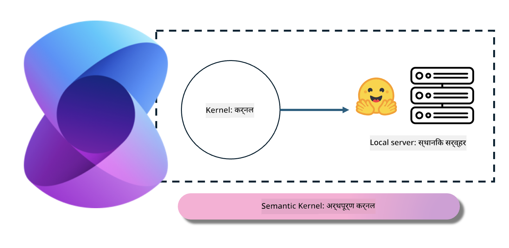
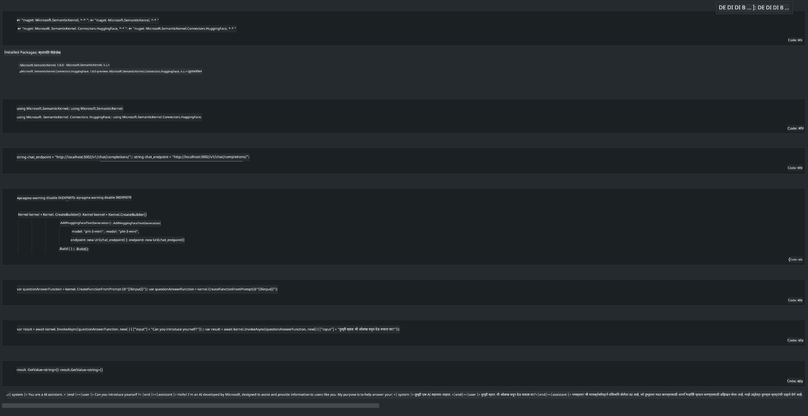

<!--
CO_OP_TRANSLATOR_METADATA:
{
  "original_hash": "bcf5dd7031db0031abdb9dd0c05ba118",
  "translation_date": "2025-05-09T12:02:09+00:00",
  "source_file": "md/01.Introduction/03/Local_Server_Inference.md",
  "language_code": "mr"
}
-->
# **लोकल सर्व्हरवर Inference Phi-3**

आम्ही Phi-3 लोकल सर्व्हरवर डिप्लॉय करू शकतो. वापरकर्ते [Ollama](https://ollama.com) किंवा [LM Studio](https://llamaedge.com) सोल्यूशन्स वापरू शकतात, किंवा स्वतःचा कोड लिहू शकतात. तुम्ही Phi-3 च्या लोकल सर्व्हिसेसना [Semantic Kernel](https://github.com/microsoft/semantic-kernel?WT.mc_id=aiml-138114-kinfeylo) किंवा [Langchain](https://www.langchain.com/) द्वारे कनेक्ट करून Copilot अ‍ॅप्लिकेशन्स तयार करू शकता.

## **Semantic Kernel वापरून Phi-3-mini ऍक्सेस करा**

Copilot अ‍ॅप्लिकेशनमध्ये, आपण Semantic Kernel / LangChain च्या माध्यमातून अ‍ॅप्लिकेशन्स तयार करतो. अशा प्रकारचा अ‍ॅप्लिकेशन फ्रेमवर्क सामान्यतः Azure OpenAI Service / OpenAI मॉडेल्सशी सुसंगत असतो, तसेच Hugging Face वरील ओपन सोर्स मॉडेल्स आणि लोकल मॉडेल्सना देखील सपोर्ट करतो. Semantic Kernel वापरून Phi-3-mini ऍक्सेस करायचा असल्यास काय करावे? .NET चा उदाहरण म्हणून घेतल्यास, आपण ते Semantic Kernel मधील Hugging Face Connector सोबत एकत्र करू शकतो. डिफॉल्टनुसार, ते Hugging Face वरील मॉडेल आयडीशी जुळते (पहिल्यांदा वापरल्यावर मॉडेल Hugging Face कडून डाउनलोड होते, ज्याला वेळ लागतो). तुम्ही बिल्ट केलेल्या लोकल सर्व्हिसशी देखील कनेक्ट करू शकता. या दोनंपैकी, आम्ही शेवचा पर्याय सुचवतो कारण त्यात स्वायत्ततेची पातळी जास्त आहे, विशेषतः एंटरप्राइज अ‍ॅप्लिकेशन्ससाठी.

चित्रातून दिसते की Semantic Kernel द्वारे लोकल सर्व्हिसेस ऍक्सेस करून सहजपणे स्वतःच्या Phi-3-mini मॉडेल सर्व्हरशी कनेक्ट करता येते. खाली चालविलेल्या निकालाचा स्क्रीनशॉट आहे.

***Sample Code*** https://github.com/kinfey/Phi3MiniSamples/tree/main/semantickernel

**अस्वीकरण**:  
हा दस्तऐवज AI भाषांतर सेवा [Co-op Translator](https://github.com/Azure/co-op-translator) वापरून भाषांतरित केला आहे. आम्ही अचूकतेसाठी प्रयत्न करतो, तरी कृपया लक्षात घ्या की स्वयंचलित भाषांतरांमध्ये चुका किंवा अचूकतेत त्रुटी असू शकतात. मूळ दस्तऐवज त्याच्या स्थानिक भाषेत अधिकृत स्रोत मानला जावा. महत्त्वाच्या माहितीसाठी व्यावसायिक मानवी भाषांतराची शिफारस केली जाते. या भाषांतराचा वापर करून झालेल्या कोणत्याही गैरसमज किंवा चुकीच्या अर्थलावांसाठी आम्ही जबाबदार नाही.