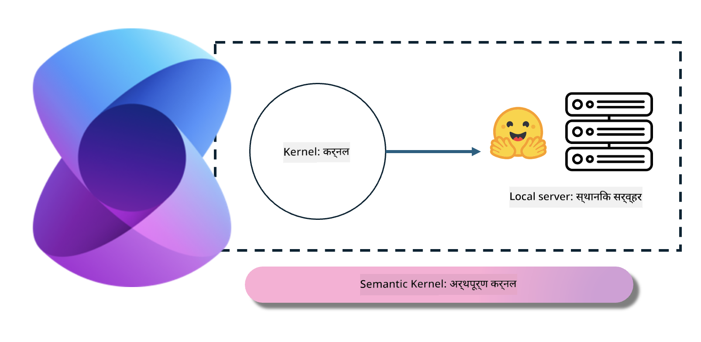

<!--
CO_OP_TRANSLATOR_METADATA:
{
  "original_hash": "bcf5dd7031db0031abdb9dd0c05ba118",
  "translation_date": "2025-07-16T20:56:24+00:00",
  "source_file": "md/01.Introduction/03/Local_Server_Inference.md",
  "language_code": "mr"
}
-->
# **लोकल सर्व्हरवर Inference Phi-3**

आम्ही Phi-3 लोकल सर्व्हरवर डिप्लॉय करू शकतो. वापरकर्ते [Ollama](https://ollama.com) किंवा [LM Studio](https://llamaedge.com) सोल्यूशन्स निवडू शकतात, किंवा स्वतःचा कोड लिहू शकतात. तुम्ही Phi-3 च्या लोकल सेवांना [Semantic Kernel](https://github.com/microsoft/semantic-kernel?WT.mc_id=aiml-138114-kinfeylo) किंवा [Langchain](https://www.langchain.com/) द्वारे कनेक्ट करून Copilot अ‍ॅप्लिकेशन्स तयार करू शकता.

## **Phi-3-mini ला Semantic Kernel वापरून प्रवेश करा**

Copilot अ‍ॅप्लिकेशनमध्ये, आम्ही Semantic Kernel / LangChain द्वारे अ‍ॅप्लिकेशन्स तयार करतो. अशा प्रकारचा अ‍ॅप्लिकेशन फ्रेमवर्क सामान्यतः Azure OpenAI Service / OpenAI मॉडेल्सशी सुसंगत असतो, तसेच Hugging Face व लोकल मॉडेल्सवर आधारित ओपन सोर्स मॉडेल्सना देखील सपोर्ट करतो. जर आम्हाला Semantic Kernel वापरून Phi-3-mini ला प्रवेश करायचा असेल तर काय करावे? .NET चा उदाहरण घेऊन, आम्ही Semantic Kernel मधील Hugging Face Connector सोबत ते एकत्र करू शकतो. डीफॉल्टनुसार, हे Hugging Face वरील मॉडेल आयडीशी जुळते (पहिल्यांदा वापरल्यावर, मॉडेल Hugging Face वरून डाउनलोड होतो, ज्याला थोडा वेळ लागतो). तुम्ही बांधलेल्या लोकल सेवेशी देखील कनेक्ट करू शकता. या दोघांपैकी, आम्ही नंतरचा पर्याय वापरण्याचा सल्ला देतो कारण त्यात स्वायत्ततेची जास्त पातळी असते, विशेषतः एंटरप्राइझ अ‍ॅप्लिकेशन्समध्ये.

चित्रातून दिसते की Semantic Kernel द्वारे लोकल सेवांमध्ये प्रवेश करणे सोपे आहे आणि स्वतःच्या बांधलेल्या Phi-3-mini मॉडेल सर्व्हरशी सहज कनेक्ट करता येते. खाली त्याचा रनिंग निकाल दिला आहे.

***Sample Code*** https://github.com/kinfey/Phi3MiniSamples/tree/main/semantickernel

**अस्वीकरण**:  
हा दस्तऐवज AI अनुवाद सेवा [Co-op Translator](https://github.com/Azure/co-op-translator) वापरून अनुवादित केला आहे. आम्ही अचूकतेसाठी प्रयत्नशील असलो तरी, कृपया लक्षात घ्या की स्वयंचलित अनुवादांमध्ये चुका किंवा अचूकतेत त्रुटी असू शकतात. मूळ दस्तऐवज त्याच्या स्थानिक भाषेत अधिकृत स्रोत मानला जावा. महत्त्वाच्या माहितीसाठी व्यावसायिक मानवी अनुवाद करण्याची शिफारस केली जाते. या अनुवादाच्या वापरामुळे उद्भवलेल्या कोणत्याही गैरसमजुती किंवा चुकीच्या अर्थलागी आम्ही जबाबदार नाही.