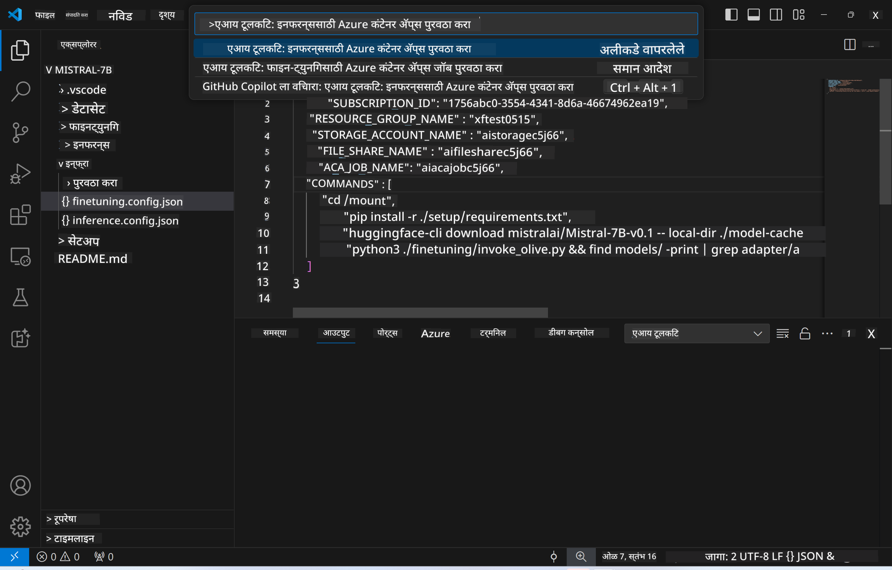
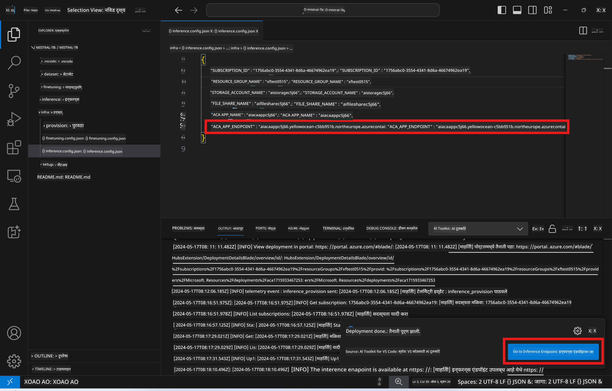

<!--
CO_OP_TRANSLATOR_METADATA:
{
  "original_hash": "a54cd3d65b6963e4e8ce21e143c3ab04",
  "translation_date": "2025-07-16T21:17:18+00:00",
  "source_file": "md/01.Introduction/03/Remote_Interence.md",
  "language_code": "mr"
}
-->
# फाइन-ट्यून केलेल्या मॉडेलसह रिमोट इन्फरन्सिंग

रिमोट वातावरणात अ‍ॅडॉप्टर्स प्रशिक्षित केल्यानंतर, मॉडेलशी संवाद साधण्यासाठी एक सोपी Gradio अ‍ॅप्लिकेशन वापरा.


### Azure संसाधने तयार करणे  
रिमोट इन्फरन्ससाठी Azure संसाधने सेटअप करण्यासाठी, कमांड पॅलेटमधून `AI Toolkit: Provision Azure Container Apps for inference` चालवा. या सेटअप दरम्यान, आपल्याला आपली Azure सबस्क्रिप्शन आणि रिसोर्स ग्रुप निवडण्यास सांगितले जाईल.  


डिफॉल्टनुसार, इन्फरन्ससाठी सबस्क्रिप्शन आणि रिसोर्स ग्रुप फाइन-ट्यूनिंगसाठी वापरलेल्या त्या प्रमाणेच असावेत. इन्फरन्ससाठी त्याच Azure Container App Environment चा वापर होईल आणि फाइन-ट्यूनिंग दरम्यान तयार केलेले मॉडेल आणि मॉडेल अ‍ॅडॉप्टर Azure Files मध्ये संग्रहित असतील, ज्याचा वापर केला जाईल.

## AI Toolkit वापरणे

### इन्फरन्ससाठी डिप्लॉयमेंट  
जर तुम्हाला इन्फरन्स कोडमध्ये बदल करायचा असेल किंवा इन्फरन्स मॉडेल पुन्हा लोड करायचे असेल, तर `AI Toolkit: Deploy for inference` कमांड चालवा. यामुळे तुमचा नवीनतम कोड ACA सोबत सिंक्रोनाइझ होईल आणि रेप्लिका पुन्हा सुरू होईल.


डिप्लॉयमेंट यशस्वी झाल्यानंतर, मॉडेल आता या एंडपॉइंटचा वापर करून मूल्यांकनासाठी तयार आहे.

### इन्फरन्स API कसे वापरावे

VSCode नोटिफिकेशनमध्ये दिसणाऱ्या "*Go to Inference Endpoint*" बटणावर क्लिक करून तुम्ही इन्फरन्स API वापरू शकता. पर्यायीपणे, वेब API एंडपॉइंट `ACA_APP_ENDPOINT` मध्ये `./infra/inference.config.json` फाईलमध्ये आणि आउटपुट पॅनेलमध्ये सापडेल.



> **Note:** इन्फरन्स एंडपॉइंट पूर्णपणे कार्यरत होण्यासाठी काही मिनिटे लागू शकतात.

## टेम्पलेटमध्ये समाविष्ट इन्फरन्स घटक

| फोल्डर | सामग्री |
| ------ |--------- |
| `infra` | रिमोट ऑपरेशन्ससाठी आवश्यक सर्व कॉन्फिगरेशन समाविष्ट आहे. |
| `infra/provision/inference.parameters.json` | बायसेप टेम्पलेटसाठी पॅरामीटर्स ठेवते, जी इन्फरन्ससाठी Azure संसाधने तयार करण्यासाठी वापरली जातात. |
| `infra/provision/inference.bicep` | इन्फरन्ससाठी Azure संसाधने तयार करण्यासाठी टेम्पलेट्स समाविष्ट आहेत. |
| `infra/inference.config.json` | `AI Toolkit: Provision Azure Container Apps for inference` कमांडने तयार केलेली कॉन्फिगरेशन फाईल. ही इतर रिमोट कमांड पॅलेटसाठी इनपुट म्हणून वापरली जाते. |

### AI Toolkit वापरून Azure Resource Provision कॉन्फिगर करणे  
[AI Toolkit](https://marketplace.visualstudio.com/items?itemName=ms-windows-ai-studio.windows-ai-studio) कॉन्फिगर करा.

`Provision Azure Container Apps for inference` कमांड वापरा.

कॉन्फिगरेशन पॅरामीटर्स `./infra/provision/inference.parameters.json` फाईलमध्ये सापडतील. तपशील खालीलप्रमाणे:  
| पॅरामीटर | वर्णन |
| --------- |------------ |
| `defaultCommands` | वेब API सुरू करण्यासाठी वापरले जाणारे कमांड्स. |
| `maximumInstanceCount` | GPU इंस्टन्सची कमाल क्षमता सेट करणारा पॅरामीटर. |
| `location` | Azure संसाधने तयार होणारे स्थान. डिफॉल्ट मूल्य निवडलेल्या रिसोर्स ग्रुपच्या स्थानासारखेच असते. |
| `storageAccountName`, `fileShareName`, `acaEnvironmentName`, `acaEnvironmentStorageName`, `acaAppName`, `acaLogAnalyticsName` | या पॅरामीटर्सचा वापर Azure संसाधनांची नावे देण्यासाठी होतो. डिफॉल्टनुसार, ही नावे फाइन-ट्यूनिंगसाठी वापरलेल्या संसाधनांच्या नावांसारखीच असतात. तुम्ही नवीन, वापरलेली नसलेली नावे देऊ शकता किंवा आधीपासून अस्तित्वात असलेल्या Azure संसाधनांची नावे वापरू शकता. अधिक माहितीसाठी [Using existing Azure Resources](../../../../../md/01.Introduction/03) विभाग पहा. |

### विद्यमान Azure संसाधने वापरणे

डिफॉल्टनुसार, इन्फरन्स Provision साठी फाइन-ट्यूनिंगसाठी वापरलेले Azure Container App Environment, Storage Account, Azure File Share आणि Azure Log Analytics वापरले जातात. इन्फरन्स API साठी स्वतंत्र Azure Container App तयार केला जातो.

जर तुम्ही फाइन-ट्यूनिंग दरम्यान Azure संसाधने सानुकूलित केली असतील किंवा स्वतःची विद्यमान Azure संसाधने इन्फरन्ससाठी वापरू इच्छित असाल, तर त्यांची नावे `./infra/inference.parameters.json` फाईलमध्ये नमूद करा. नंतर कमांड पॅलेटमधून `AI Toolkit: Provision Azure Container Apps for inference` कमांड चालवा. यामुळे नमूद केलेली संसाधने अपडेट होतील आणि नसलेली तयार केली जातील.

उदाहरणार्थ, जर तुमच्याकडे विद्यमान Azure कंटेनर वातावरण असेल, तर तुमची `./infra/finetuning.parameters.json` अशी दिसेल:

```json
{
    "$schema": "https://schema.management.azure.com/schemas/2019-04-01/deploymentParameters.json#",
    "contentVersion": "1.0.0.0",
    "parameters": {
      ...
      "acaEnvironmentName": {
        "value": "<your-aca-env-name>"
      },
      "acaEnvironmentStorageName": {
        "value": null
      },
      ...
    }
  }
```

### मॅन्युअल Provision  
जर तुम्हाला Azure संसाधने मॅन्युअली कॉन्फिगर करायची असतील, तर `./infra/provision` फोल्डरमधील बायसेप फाइल्स वापरू शकता. जर तुम्ही AI Toolkit कमांड पॅलेट वापरल्याशिवाय सर्व Azure संसाधने आधीच सेटअप केली आणि कॉन्फिगर केली असतील, तर फक्त `inference.config.json` फाईलमध्ये संसाधनांची नावे प्रविष्ट करा.

उदाहरणार्थ:

```json
{
  "SUBSCRIPTION_ID": "<your-subscription-id>",
  "RESOURCE_GROUP_NAME": "<your-resource-group-name>",
  "STORAGE_ACCOUNT_NAME": "<your-storage-account-name>",
  "FILE_SHARE_NAME": "<your-file-share-name>",
  "ACA_APP_NAME": "<your-aca-name>",
  "ACA_APP_ENDPOINT": "<your-aca-endpoint>"
}
```

**अस्वीकरण**:  
हा दस्तऐवज AI अनुवाद सेवा [Co-op Translator](https://github.com/Azure/co-op-translator) वापरून अनुवादित केला आहे. आम्ही अचूकतेसाठी प्रयत्नशील असलो तरी, कृपया लक्षात घ्या की स्वयंचलित अनुवादांमध्ये चुका किंवा अचूकतेची कमतरता असू शकते. मूळ दस्तऐवज त्याच्या स्थानिक भाषेत अधिकृत स्रोत मानला जावा. महत्त्वाच्या माहितीसाठी व्यावसायिक मानवी अनुवाद करण्याची शिफारस केली जाते. या अनुवादाच्या वापरामुळे उद्भवलेल्या कोणत्याही गैरसमजुती किंवा चुकीच्या अर्थलागी आम्ही जबाबदार नाही.