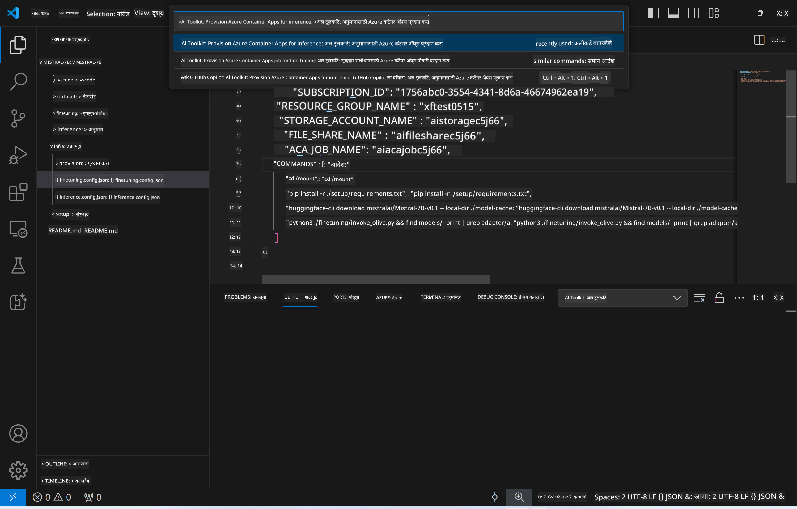
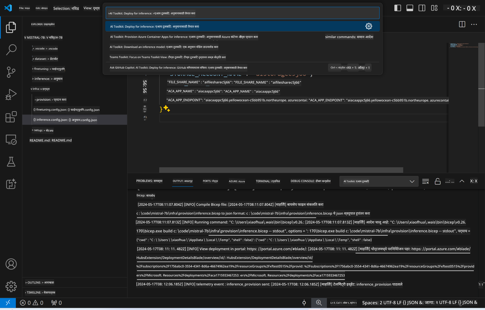
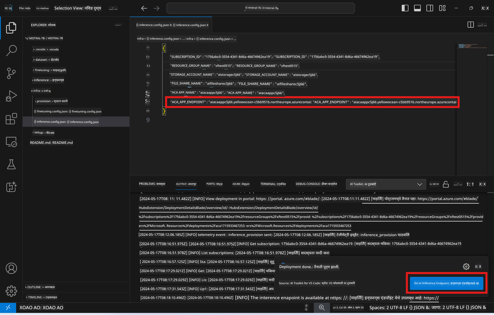

<!--
CO_OP_TRANSLATOR_METADATA:
{
  "original_hash": "a54cd3d65b6963e4e8ce21e143c3ab04",
  "translation_date": "2025-05-09T12:35:35+00:00",
  "source_file": "md/01.Introduction/03/Remote_Interence.md",
  "language_code": "mr"
}
-->
# दूरस्थ इन्फरन्सिंग फाइन-ट्यून केलेल्या मॉडेलसह

अ‍ॅडॉप्टर्स दूरस्थ वातावरणात प्रशिक्षित केल्यानंतर, मॉडेलशी संवाद साधण्यासाठी एक सोपी Gradio अ‍ॅप्लिकेशन वापरा.


### Azure संसाधने पुरवठा करा
दूरस्थ इन्फरन्ससाठी Azure संसाधने सेटअप करण्यासाठी कमांड पॅलेटमधून `AI Toolkit: Provision Azure Container Apps for inference` चालवा. या सेटअप दरम्यान, तुम्हाला तुमची Azure Subscription आणि resource group निवडण्यास सांगितले जाईल.  

   
मुळात, इन्फरन्ससाठी subscription आणि resource group फाइन-ट्यूनिंगसाठी वापरलेल्या सारखेच असावेत. इन्फरन्ससाठी त्याच Azure Container App Environment चा वापर केला जाईल आणि Azure Files मध्ये संग्रहित मॉडेल व मॉडेल अ‍ॅडॉप्टर वापरले जातील, जे फाइन-ट्यूनिंग टप्प्यात तयार झाले होते.

## AI Toolkit वापरणे

### इन्फरन्ससाठी तैनाती  
जर तुम्हाला इन्फरन्स कोडमध्ये सुधारणा करायची असेल किंवा इन्फरन्स मॉडेल पुन्हा लोड करायचे असेल, तर कृपया `AI Toolkit: Deploy for inference` कमांड चालवा. यामुळे तुमचा नवीनतम कोड ACA सोबत सिंक्रोनाइझ होईल आणि replica रीस्टार्ट होईल.



तैनाती यशस्वी झाल्यानंतर, मॉडेल आता या endpoint वापरून मूल्यांकनासाठी तयार आहे.

### इन्फरन्स API कसे वापरावे

VSCode नोटिफिकेशनमध्ये दिसणाऱ्या "*Go to Inference Endpoint*" बटणावर क्लिक करून तुम्ही इन्फरन्स API वापरू शकता. पर्यायाने, वेब API endpoint `ACA_APP_ENDPOINT` मध्ये `./infra/inference.config.json` आणि output पॅनेलमध्ये सापडू शकतो.



> **Note:** इन्फरन्स endpoint पूर्णपणे कार्यान्वित होण्यासाठी काही मिनिटे लागू शकतात.

## टेम्पलेटमध्ये समाविष्ट इन्फरन्स घटक

| फोल्डर | सामग्री |
| ------ |--------- |
| `infra` | दूरस्थ ऑपरेशन्ससाठी आवश्यक सर्व कॉन्फिगरेशन समाविष्ट आहे. |
| `infra/provision/inference.parameters.json` | बायसेप टेम्पलेटसाठी पॅरामीटर्स ठेवतो, जे Azure संसाधने इन्फरन्ससाठी पुरवठा करण्यासाठी वापरले जातात. |
| `infra/provision/inference.bicep` | इन्फरन्ससाठी Azure संसाधने पुरवठा करण्यासाठी टेम्पलेट्स समाविष्ट आहेत. |
| `infra/inference.config.json` | कॉन्फिगरेशन फाइल, जी `AI Toolkit: Provision Azure Container Apps for inference` कमांडने तयार केली जाते. ही इतर दूरस्थ कमांड पॅलेटसाठी इनपुट म्हणून वापरली जाते. |

### AI Toolkit वापरून Azure Resource Provision कॉन्फिगर करणे
[AI Toolkit](https://marketplace.visualstudio.com/items?itemName=ms-windows-ai-studio.windows-ai-studio) कॉन्फिगर करा

इन्फरन्ससाठी Azure Container Apps पुरवठा करा` command.

You can find configuration parameters in `./infra/provision/inference.parameters.json` file. Here are the details:
| Parameter | Description |
| --------- |------------ |
| `defaultCommands` | This is the commands to initiate a web API. |
| `maximumInstanceCount` | This parameter sets the maximum capacity of GPU instances. |
| `location` | This is the location where Azure resources are provisioned. The default value is the same as the chosen resource group's location. |
| `storageAccountName`, `fileShareName` `acaEnvironmentName`, `acaEnvironmentStorageName`, `acaAppName`,  `acaLogAnalyticsName` | These parameters are used to name the Azure resources for provision. By default, they will be same to the fine-tuning resource name. You can input a new, unused resource name to create your own custom-named resources, or you can input the name of an already existing Azure resource if you'd prefer to use that. For details, refer to the section [Using existing Azure Resources](../../../../../md/01.Introduction/03). |

### Using Existing Azure Resources

By default, the inference provision use the same Azure Container App Environment, Storage Account, Azure File Share, and Azure Log Analytics that were used for fine-tuning. A separate Azure Container App is created solely for the inference API. 

If you have customized the Azure resources during the fine-tuning step or want to use your own existing Azure resources for inference, specify their names in the `./infra/inference.parameters.json` फाइलमध्ये. नंतर, कमांड पॅलेटमधून `AI Toolkit: Provision Azure Container Apps for inference` कमांड चालवा. हे कोणतेही निर्दिष्ट संसाधने अपडेट करेल आणि जे नसतील ते तयार करेल.

उदाहरणार्थ, जर तुमच्याकडे आधीच Azure container environment असेल, तर तुमची `./infra/finetuning.parameters.json` फाइल अशी दिसायला हवी:

```json
{
    "$schema": "https://schema.management.azure.com/schemas/2019-04-01/deploymentParameters.json#",
    "contentVersion": "1.0.0.0",
    "parameters": {
      ...
      "acaEnvironmentName": {
        "value": "<your-aca-env-name>"
      },
      "acaEnvironmentStorageName": {
        "value": null
      },
      ...
    }
  }
```

### मॅन्युअल पुरवठा  
जर तुम्हाला Azure संसाधने मॅन्युअली कॉन्फिगर करायची असतील, तर तुम्ही `./infra/provision` folders. If you have already set up and configured all the Azure resources without using the AI Toolkit command palette, you can simply enter the resource names in the `inference.config.json` फाइलमधील दिलेले बायसेप फाइल्स वापरू शकता.

उदाहरणार्थ:

```json
{
  "SUBSCRIPTION_ID": "<your-subscription-id>",
  "RESOURCE_GROUP_NAME": "<your-resource-group-name>",
  "STORAGE_ACCOUNT_NAME": "<your-storage-account-name>",
  "FILE_SHARE_NAME": "<your-file-share-name>",
  "ACA_APP_NAME": "<your-aca-name>",
  "ACA_APP_ENDPOINT": "<your-aca-endpoint>"
}
```

**अस्वीकरण**:  
हा दस्तऐवज AI अनुवाद सेवा [Co-op Translator](https://github.com/Azure/co-op-translator) वापरून अनुवादित केला आहे. आम्ही अचूकतेसाठी प्रयत्न करतो, तरी कृपया लक्षात ठेवा की स्वयंचलित अनुवादांमध्ये चुका किंवा अचूकतेचा अभाव असू शकतो. मूळ दस्तऐवज त्याच्या स्थानिक भाषेत अधिकृत स्रोत मानला जावा. महत्त्वाच्या माहितीकरिता व्यावसायिक मानवी अनुवादाची शिफारस केली जाते. या अनुवादाच्या वापरामुळे होणाऱ्या कोणत्याही गैरसमजुती किंवा चुकीच्या अर्थलागी आम्ही जबाबदार नाही.