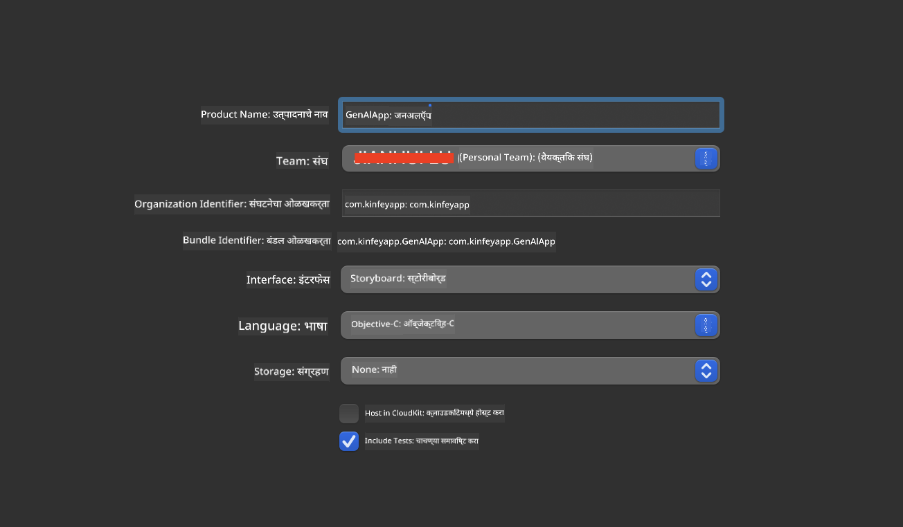
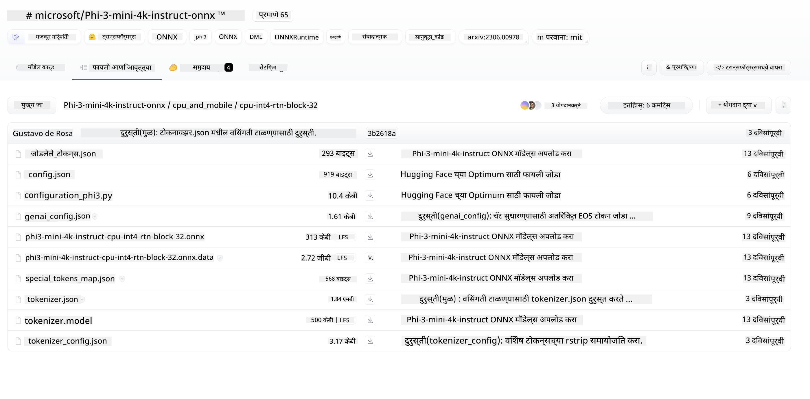
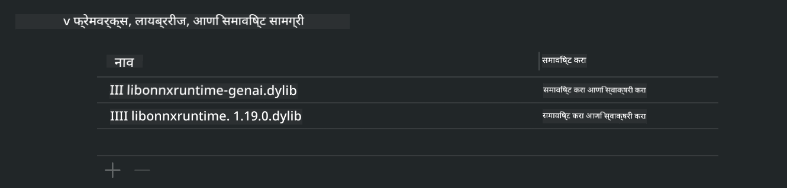

<!--
CO_OP_TRANSLATOR_METADATA:
{
  "original_hash": "82af197df38d25346a98f1f0e84d1698",
  "translation_date": "2025-05-09T10:54:04+00:00",
  "source_file": "md/01.Introduction/03/iOS_Inference.md",
  "language_code": "mr"
}
-->
# **iOS मध्ये Inference Phi-3**

Phi-3-mini ही Microsoft कडून नवीन मॉडेल्सची सिरीज आहे जी Edge डिव्हाइसेस आणि IoT डिव्हाइसेसवर Large Language Models (LLMs) डिप्लॉय करण्यास सक्षम करते. Phi-3-mini iOS, Android आणि Edge Device डिप्लॉयमेंटसाठी उपलब्ध आहे, ज्यामुळे BYOD वातावरणात generative AI डिप्लॉय करता येतो. खालील उदाहरण iOS वर Phi-3-mini कसे डिप्लॉय करायचे ते दर्शवते.

## **1. तयारी**

- **a.** macOS 14+
- **b.** Xcode 15+
- **c.** iOS SDK 17.x (iPhone 14 A16 किंवा त्याहून अधिक)
- **d.** Python 3.10+ इन्स्टॉल करा (Conda शिफारसीय आहे)
- **e.** Python लायब्ररी इन्स्टॉल करा: `python-flatbuffers`
- **f.** CMake इन्स्टॉल करा

### Semantic Kernel आणि Inference

Semantic Kernel हा एक application framework आहे जो Azure OpenAI Service, OpenAI मॉडेल्स आणि अगदी लोकल मॉडेल्ससाठी सुसंगत application तयार करण्याची परवानगी देतो. Semantic Kernel द्वारे लोकल सर्व्हिसेस वापरल्यास तुमच्या self-hosted Phi-3-mini मॉडेल सर्व्हरशी सहज इंटिग्रेशन करता येते.

### Ollama किंवा LlamaEdge वापरून Quantized मॉडेल कॉल करणे

अनेक वापरकर्ते quantized मॉडेल्स वापरून लोकल पातळीवर मॉडेल्स चालवणे पसंत करतात. [Ollama](https://ollama.com) आणि [LlamaEdge](https://llamaedge.com) वापरकर्त्यांना वेगवेगळ्या quantized मॉडेल्स कॉल करण्याची परवानगी देतात:

#### **Ollama**

तुम्ही `ollama run phi3` थेट चालवू शकता किंवा ऑफलाइन कॉन्फिगर करू शकता. तुमच्या `gguf` फाइलचा पथ असलेला Modelfile तयार करा. Phi-3-mini quantized मॉडेल चालवण्यासाठी नमुना कोड:

```gguf
FROM {Add your gguf file path}
TEMPLATE \"\"\"<|user|> .Prompt<|end|> <|assistant|>\"\"\"
PARAMETER stop <|end|>
PARAMETER num_ctx 4096
```

#### **LlamaEdge**

जर तुम्हाला `gguf` क्लाउड आणि Edge डिव्हाइसेस दोन्हीवर एकत्र वापरायचे असेल, तर LlamaEdge एक उत्तम पर्याय आहे.

## **2. iOS साठी ONNX Runtime कंपाइल करणे**

```bash

git clone https://github.com/microsoft/onnxruntime.git

cd onnxruntime

./build.sh --build_shared_lib --ios --skip_tests --parallel --build_dir ./build_ios --ios --apple_sysroot iphoneos --osx_arch arm64 --apple_deploy_target 17.5 --cmake_generator Xcode --config Release

cd ../

```

### **सूचना**

- **a.** कंपाइल करण्यापूर्वी, खात्री करा की Xcode योग्यरित्या कॉन्फिगर केलेले आहे आणि टर्मिनलमध्ये ते active developer directory म्हणून सेट केले आहे:

    ```bash
    sudo xcode-select -switch /Applications/Xcode.app/Contents/Developer
    ```

- **b.** ONNX Runtime वेगवेगळ्या प्लॅटफॉर्मसाठी कंपाइल करणे आवश्यक आहे. iOS साठी, तुम्ही `arm64` or `x86_64` साठी कंपाइल करू शकता.

- **c.** कंपाइलसाठी नवीनतम iOS SDK वापरणे शिफारसीय आहे. मात्र, मागील SDKs शी सुसंगतता हवी असल्यास जुन्या आवृत्तीचा देखील वापर करू शकता.

## **3. iOS साठी ONNX Runtime सह Generative AI कंपाइल करणे**

> **Note:** ONNX Runtime सह Generative AI अजून प्रिव्ह्यूमध्ये असल्यामुळे, संभाव्य बदलांची जाणीव ठेवा.

```bash

git clone https://github.com/microsoft/onnxruntime-genai
 
cd onnxruntime-genai
 
mkdir ort
 
cd ort
 
mkdir include
 
mkdir lib
 
cd ../
 
cp ../onnxruntime/include/onnxruntime/core/session/onnxruntime_c_api.h ort/include
 
cp ../onnxruntime/build_ios/Release/Release-iphoneos/libonnxruntime*.dylib* ort/lib
 
export OPENCV_SKIP_XCODEBUILD_FORCE_TRYCOMPILE_DEBUG=1
 
python3 build.py --parallel --build_dir ./build_ios --ios --ios_sysroot iphoneos --ios_arch arm64 --ios_deployment_target 17.5 --cmake_generator Xcode --cmake_extra_defines CMAKE_XCODE_ATTRIBUTE_CODE_SIGNING_ALLOWED=NO

```

## **4. Xcode मध्ये App application तयार करणे**

मी App डेव्हलपमेंटसाठी Objective-C निवडले कारण ONNX Runtime C++ API सह Generative AI वापरताना Objective-C अधिक सुसंगत आहे. अर्थात, Swift bridging वापरून संबंधित कॉल्स पूर्ण करणे देखील शक्य आहे.



## **5. ONNX quantized INT4 मॉडेल App application प्रोजेक्टमध्ये कॉपी करा**

आपल्याला ONNX फॉरमॅटमधील INT4 quantization मॉडेल आयात करणे आवश्यक आहे, जे आधी डाउनलोड करावे लागेल



डाउनलोड केल्यानंतर, ते Xcode मधील प्रोजेक्टच्या Resources डायरेक्टरीमध्ये जोडावे लागेल.


## **6. ViewControllers मध्ये C++ API जोडणे**

> **सूचना:**

- **a.** संबंधित C++ हेडर फाइल्स प्रोजेक्टमध्ये जोडा.

  

- **b.** Objective-C++ सपोर्टसाठी `onnxruntime-genai` dynamic library in Xcode.

  

- **c.** Use the C Samples code for testing. You can also add additional features like ChatUI for more functionality.

- **d.** Since you need to use C++ in your project, rename `ViewController.m` to `ViewController.mm` समाविष्ट करा.

```objc

    NSString *llmPath = [[NSBundle mainBundle] resourcePath];
    char const *modelPath = llmPath.cString;

    auto model =  OgaModel::Create(modelPath);

    auto tokenizer = OgaTokenizer::Create(*model);

    const char* prompt = "<|system|>You are a helpful AI assistant.<|end|><|user|>Can you introduce yourself?<|end|><|assistant|>";

    auto sequences = OgaSequences::Create();
    tokenizer->Encode(prompt, *sequences);

    auto params = OgaGeneratorParams::Create(*model);
    params->SetSearchOption("max_length", 100);
    params->SetInputSequences(*sequences);

    auto output_sequences = model->Generate(*params);
    const auto output_sequence_length = output_sequences->SequenceCount(0);
    const auto* output_sequence_data = output_sequences->SequenceData(0);
    auto out_string = tokenizer->Decode(output_sequence_data, output_sequence_length);
    
    auto tmp = out_string;

```

## **7. Application चालवा**

सेटअप पूर्ण झाल्यानंतर, तुम्ही application चालवून Phi-3-mini मॉडेल inference चे परिणाम पाहू शकता.


अधिक नमुना कोड आणि सविस्तर सूचना पाहण्यासाठी, [Phi-3 Mini Samples repository](https://github.com/Azure-Samples/Phi-3MiniSamples/tree/main/ios) भेट द्या.

**अस्वीकरण**:  
हा दस्तऐवज AI भाषांतर सेवा [Co-op Translator](https://github.com/Azure/co-op-translator) चा वापर करून भाषांतरित केला आहे. आम्ही अचूकतेसाठी प्रयत्न करतो, परंतु कृपया लक्षात ठेवा की स्वयंचलित भाषांतरांमध्ये चुका किंवा अचूकतेच्या त्रुटी असू शकतात. मूळ दस्तऐवज त्याच्या मूळ भाषेत अधिकृत स्रोत मानला पाहिजे. महत्त्वाच्या माहितीसाठी व्यावसायिक मानवी भाषांतर शिफारस केले जाते. या भाषांतराचा वापर केल्यामुळे होणाऱ्या कोणत्याही गैरसमजुती किंवा चुकीच्या अर्थ लावण्याबद्दल आम्ही जबाबदार नाही.