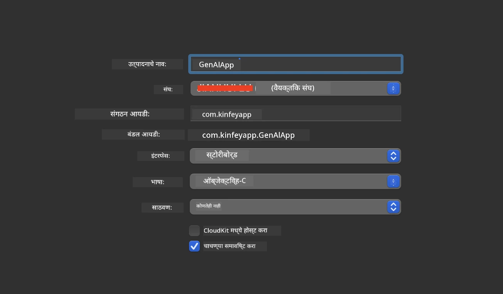
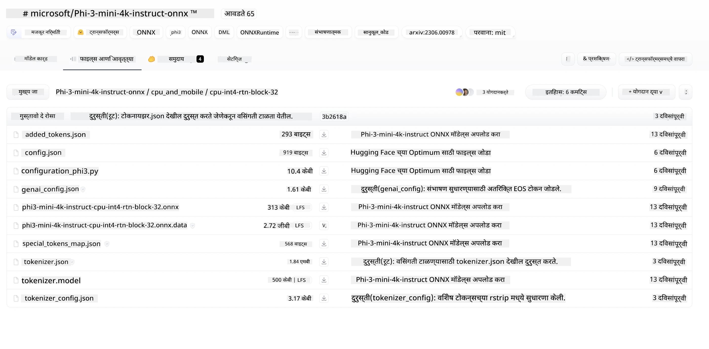
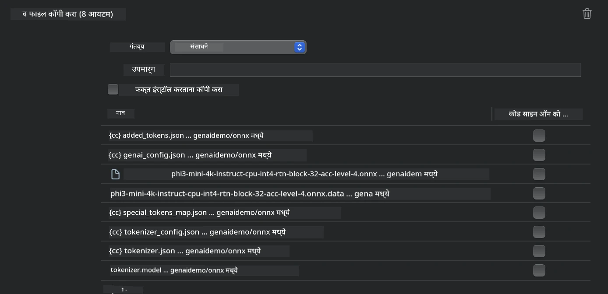
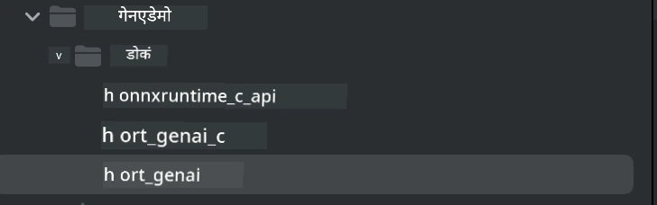
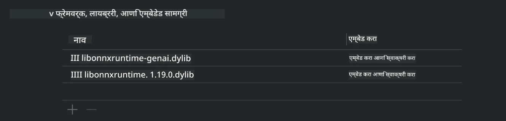
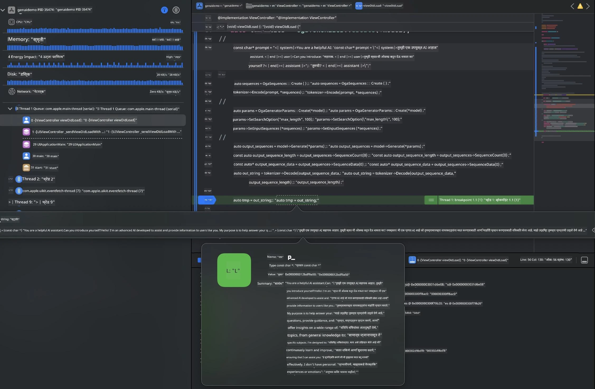

<!--
CO_OP_TRANSLATOR_METADATA:
{
  "original_hash": "82af197df38d25346a98f1f0e84d1698",
  "translation_date": "2025-07-16T20:19:58+00:00",
  "source_file": "md/01.Introduction/03/iOS_Inference.md",
  "language_code": "mr"
}
-->
# **iOS मध्ये Inference Phi-3**

Phi-3-mini ही Microsoft कडून नवीन मॉडेल्सची मालिका आहे जी एज डिव्हाइसेस आणि IoT डिव्हाइसेसवर Large Language Models (LLMs) तैनात करण्यास सक्षम करते. Phi-3-mini iOS, Android आणि एज डिव्हाइस डिप्लॉयमेंटसाठी उपलब्ध आहे, ज्यामुळे BYOD वातावरणात जनरेटिव्ह AI तैनात करता येतो. खालील उदाहरण iOS वर Phi-3-mini कसे तैनात करायचे हे दाखवते.

## **1. तयारी**

- **a.** macOS 14+
- **b.** Xcode 15+
- **c.** iOS SDK 17.x (iPhone 14 A16 किंवा त्याहून अधिक)
- **d.** Python 3.10+ इन्स्टॉल करा (Conda वापरणे शिफारसीय)
- **e.** Python लायब्ररी इन्स्टॉल करा: `python-flatbuffers`
- **f.** CMake इन्स्टॉल करा

### Semantic Kernel आणि Inference

Semantic Kernel हा एक अ‍ॅप्लिकेशन फ्रेमवर्क आहे जो Azure OpenAI Service, OpenAI मॉडेल्स आणि स्थानिक मॉडेल्सशी सुसंगत अ‍ॅप्लिकेशन्स तयार करण्यास मदत करतो. Semantic Kernel द्वारे स्थानिक सेवा वापरल्यास तुमच्या स्व-होस्ट केलेल्या Phi-3-mini मॉडेल सर्व्हरशी सहज समाकलन करता येते.

### Ollama किंवा LlamaEdge सह Quantized मॉडेल कॉल करणे

अनेक वापरकर्ते स्थानिकपणे मॉडेल चालवण्यासाठी quantized मॉडेल्स वापरणे पसंत करतात. [Ollama](https://ollama.com) आणि [LlamaEdge](https://llamaedge.com) वापरकर्त्यांना वेगवेगळ्या quantized मॉडेल्स कॉल करण्याची परवानगी देतात:

#### **Ollama**

`ollama run phi3` थेट चालवू शकता किंवा ऑफलाइन कॉन्फिगर करू शकता. तुमच्या `gguf` फाइलचा पथ असलेली Modelfile तयार करा. Phi-3-mini quantized मॉडेल चालवण्यासाठी नमुना कोड:

```gguf
FROM {Add your gguf file path}
TEMPLATE \"\"\"<|user|> .Prompt<|end|> <|assistant|>\"\"\"
PARAMETER stop <|end|>
PARAMETER num_ctx 4096
```

#### **LlamaEdge**

जर तुम्हाला `gguf` क्लाउड आणि एज डिव्हाइसेसवर एकाच वेळी वापरायचे असेल, तर LlamaEdge एक उत्तम पर्याय आहे.

## **2. iOS साठी ONNX Runtime संकलन**

```bash

git clone https://github.com/microsoft/onnxruntime.git

cd onnxruntime

./build.sh --build_shared_lib --ios --skip_tests --parallel --build_dir ./build_ios --ios --apple_sysroot iphoneos --osx_arch arm64 --apple_deploy_target 17.5 --cmake_generator Xcode --config Release

cd ../

```

### **सूचना**

- **a.** संकलनापूर्वी, Xcode योग्यरित्या कॉन्फिगर केलेले आहे याची खात्री करा आणि टर्मिनलमध्ये ते सक्रिय डेव्हलपर डायरेक्टरी म्हणून सेट करा:

    ```bash
    sudo xcode-select -switch /Applications/Xcode.app/Contents/Developer
    ```

- **b.** ONNX Runtime वेगवेगळ्या प्लॅटफॉर्मसाठी संकलित करणे आवश्यक आहे. iOS साठी, तुम्ही `arm64` किंवा `x86_64` साठी संकलित करू शकता.

- **c.** संकलनासाठी नवीनतम iOS SDK वापरणे शिफारसीय आहे. मात्र, मागील SDKs शी सुसंगततेसाठी जुनी आवृत्ती देखील वापरू शकता.

## **3. iOS साठी ONNX Runtime सह Generative AI संकलन**

> **Note:** ONNX Runtime सह Generative AI अजून प्रिव्ह्यूमध्ये असल्यामुळे, संभाव्य बदलांची जाणीव ठेवा.

```bash

git clone https://github.com/microsoft/onnxruntime-genai
 
cd onnxruntime-genai
 
mkdir ort
 
cd ort
 
mkdir include
 
mkdir lib
 
cd ../
 
cp ../onnxruntime/include/onnxruntime/core/session/onnxruntime_c_api.h ort/include
 
cp ../onnxruntime/build_ios/Release/Release-iphoneos/libonnxruntime*.dylib* ort/lib
 
export OPENCV_SKIP_XCODEBUILD_FORCE_TRYCOMPILE_DEBUG=1
 
python3 build.py --parallel --build_dir ./build_ios --ios --ios_sysroot iphoneos --ios_arch arm64 --ios_deployment_target 17.5 --cmake_generator Xcode --cmake_extra_defines CMAKE_XCODE_ATTRIBUTE_CODE_SIGNING_ALLOWED=NO

```

## **4. Xcode मध्ये App अ‍ॅप्लिकेशन तयार करा**

मी App विकासासाठी Objective-C निवडले कारण ONNX Runtime C++ API सह Generative AI वापरताना Objective-C अधिक सुसंगत आहे. अर्थात, Swift ब्रिजिंगद्वारे संबंधित कॉल्स पूर्ण करणे देखील शक्य आहे.



## **5. ONNX quantized INT4 मॉडेल App प्रोजेक्टमध्ये कॉपी करा**

आपल्याला ONNX फॉरमॅटमधील INT4 quantization मॉडेल आयात करायचे आहे, जे आधी डाउनलोड करणे आवश्यक आहे.



डाउनलोड केल्यानंतर, ते Xcode मधील प्रोजेक्टच्या Resources डायरेक्टरीमध्ये जोडावे लागेल.



## **6. ViewControllers मध्ये C++ API जोडणे**

> **सूचना:**

- **a.** संबंधित C++ हेडर फाइल्स प्रोजेक्टमध्ये जोडा.

  

- **b.** Xcode मध्ये `onnxruntime-genai` डायनॅमिक लायब्ररी समाविष्ट करा.

  

- **c.** चाचणीसाठी C Samples कोड वापरा. अधिक कार्यक्षमतेसाठी ChatUI सारखे अतिरिक्त फीचर्स देखील जोडू शकता.

- **d.** प्रोजेक्टमध्ये C++ वापरण्याची गरज असल्यामुळे, `ViewController.m` चे नाव `ViewController.mm` असे बदला जेणेकरून Objective-C++ सपोर्ट सक्षम होईल.

```objc

    NSString *llmPath = [[NSBundle mainBundle] resourcePath];
    char const *modelPath = llmPath.cString;

    auto model =  OgaModel::Create(modelPath);

    auto tokenizer = OgaTokenizer::Create(*model);

    const char* prompt = "<|system|>You are a helpful AI assistant.<|end|><|user|>Can you introduce yourself?<|end|><|assistant|>";

    auto sequences = OgaSequences::Create();
    tokenizer->Encode(prompt, *sequences);

    auto params = OgaGeneratorParams::Create(*model);
    params->SetSearchOption("max_length", 100);
    params->SetInputSequences(*sequences);

    auto output_sequences = model->Generate(*params);
    const auto output_sequence_length = output_sequences->SequenceCount(0);
    const auto* output_sequence_data = output_sequences->SequenceData(0);
    auto out_string = tokenizer->Decode(output_sequence_data, output_sequence_length);
    
    auto tmp = out_string;

```

## **7. अ‍ॅप्लिकेशन चालवा**

सेटअप पूर्ण झाल्यानंतर, अ‍ॅप्लिकेशन चालवून Phi-3-mini मॉडेल इन्फरन्सचे परिणाम पाहू शकता.



अधिक नमुना कोड आणि सविस्तर सूचना पाहण्यासाठी, [Phi-3 Mini Samples repository](https://github.com/Azure-Samples/Phi-3MiniSamples/tree/main/ios) भेट द्या.

**अस्वीकरण**:  
हा दस्तऐवज AI अनुवाद सेवा [Co-op Translator](https://github.com/Azure/co-op-translator) वापरून अनुवादित केला आहे. आम्ही अचूकतेसाठी प्रयत्नशील असलो तरी, कृपया लक्षात घ्या की स्वयंचलित अनुवादांमध्ये चुका किंवा अचूकतेची कमतरता असू शकते. मूळ दस्तऐवज त्याच्या स्थानिक भाषेत अधिकृत स्रोत मानला जावा. महत्त्वाच्या माहितीसाठी व्यावसायिक मानवी अनुवाद करण्याची शिफारस केली जाते. या अनुवादाच्या वापरामुळे उद्भवलेल्या कोणत्याही गैरसमजुती किंवा चुकीच्या अर्थलागी आम्ही जबाबदार नाही.