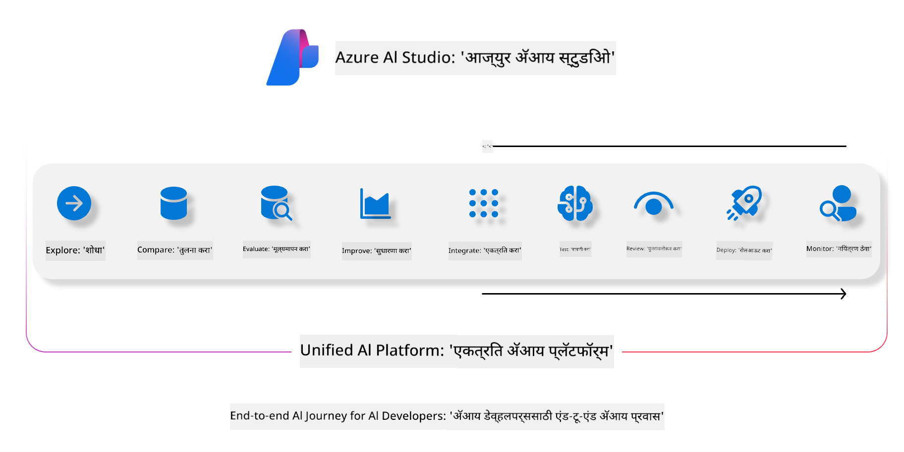
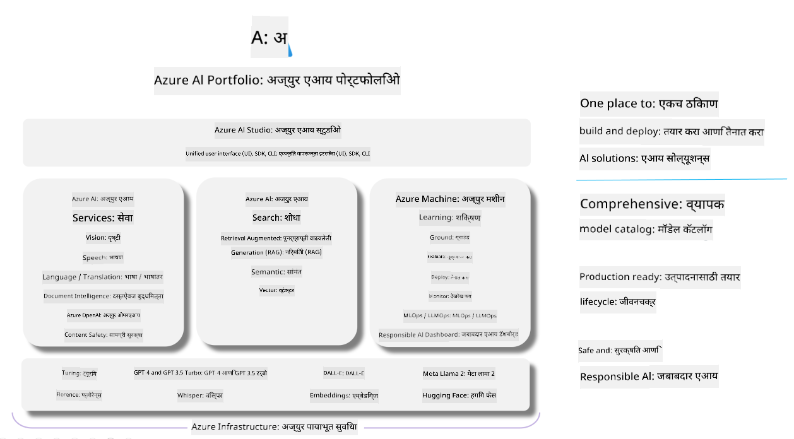

<!--
CO_OP_TRANSLATOR_METADATA:
{
  "original_hash": "7b4235159486df4000e16b7b46ddfec3",
  "translation_date": "2025-05-09T14:53:51+00:00",
  "source_file": "md/01.Introduction/05/AIFoundry.md",
  "language_code": "mr"
}
-->
# **Azure AI Foundry वापरून मूल्यांकन करणे**

[Azure AI Foundry](https://ai.azure.com?WT.mc_id=aiml-138114-kinfeylo) वापरून तुमच्या जनरेटिव्ह AI अ‍ॅप्लिकेशनचे मूल्यांकन कसे करायचे. तुम्ही एकट्या संवादाचा किंवा बहु-टर्न संवादाचा आढावा घेत असाल, Azure AI Foundry मॉडेलच्या कामगिरी आणि सुरक्षिततेचे मूल्यांकन करण्यासाठी साधने प्रदान करते.

## Azure AI Foundry सह जनरेटिव्ह AI अ‍ॅप्सचे मूल्यांकन कसे करावे  
अधिक तपशीलांसाठी [Azure AI Foundry Documentation](https://learn.microsoft.com/azure/ai-studio/how-to/evaluate-generative-ai-app?WT.mc_id=aiml-138114-kinfeylo) पहा

प्रारंभ करण्यासाठी खालील टप्पे आहेत:

## Azure AI Foundry मध्ये जनरेटिव्ह AI मॉडेलचे मूल्यांकन

**आवश्यकता**

- CSV किंवा JSON स्वरूपातील चाचणी डेटासेट.
- एक तैनात जनरेटिव्ह AI मॉडेल (जसे की Phi-3, GPT 3.5, GPT 4, किंवा Davinci मॉडेल्स).
- मूल्यांकन चालविण्यासाठी एक रनटाइमसह कम्प्युटिंग इंस्टन्स.

## अंगभूत मूल्यांकन मेट्रिक्स

Azure AI Foundry तुम्हाला एकट्या संवादांसह तसेच जटिल बहु-टर्न संवादांचे मूल्यांकन करण्याची परवानगी देते.  
Retrieval Augmented Generation (RAG) परिस्थितींमध्ये, जिथे मॉडेल विशिष्ट डेटावर आधारित असते, तुम्ही अंगभूत मूल्यांकन मेट्रिक्स वापरून कामगिरी तपासू शकता.  
त्याचप्रमाणे, तुम्ही सामान्य एकट्या संवादातील प्रश्नोत्तरे (non-RAG) देखील मूल्यांकन करू शकता.

## मूल्यांकन रन तयार करणे

Azure AI Foundry UI मधून, Evaluate पृष्ठ किंवा Prompt Flow पृष्ठावर जा.  
मूल्यांकन तयार करण्यासाठी विजार्डचे अनुसरण करा. तुमच्या मूल्यांकनासाठी ऐच्छिक नाव द्या.  
तुमच्या अ‍ॅप्लिकेशनच्या उद्दिष्टांशी सुसंगत असलेली परिस्थिती निवडा.  
मॉडेलच्या आउटपुटचे मूल्यांकन करण्यासाठी एक किंवा अधिक मूल्यांकन मेट्रिक्स निवडा.

## सानुकूल मूल्यांकन प्रवाह (ऐच्छिक)

अधिक लवचिकतेसाठी, तुम्ही सानुकूल मूल्यांकन प्रवाह तयार करू शकता. तुमच्या विशिष्ट गरजांनुसार मूल्यांकन प्रक्रिया सानुकूल करा.

## निकाल पाहणे

मूल्यांकन चालवल्यानंतर, Azure AI Foundry मध्ये तपशीलवार मूल्यांकन मेट्रिक्स लॉग करा, पाहा आणि विश्लेषण करा. तुमच्या अ‍ॅप्लिकेशनच्या क्षमता आणि मर्यादा समजून घ्या.

**Note** Azure AI Foundry सध्या सार्वजनिक प्रिव्ह्यूमध्ये आहे, त्यामुळे ते प्रयोग आणि विकासासाठी वापरा. उत्पादनासाठी इतर पर्यायांचा विचार करा. अधिक तपशील आणि टप्प्याटप्प्याने सूचना पाहण्यासाठी अधिकृत [AI Foundry documentation](https://learn.microsoft.com/azure/ai-studio/?WT.mc_id=aiml-138114-kinfeylo) तपासा.

**अस्वीकरण**:  
हा दस्तऐवज AI भाषांतर सेवा [Co-op Translator](https://github.com/Azure/co-op-translator) वापरून भाषांतरित केला आहे. आम्ही अचूकतेसाठी प्रयत्न करतो, तरी कृपया लक्षात घ्या की स्वयंचलित भाषांतरांमध्ये चुका किंवा अचूकतेची कमतरता असू शकते. मूळ दस्तऐवज त्याच्या स्थानिक भाषेत अधिकृत स्रोत मानला पाहिजे. महत्त्वाची माहिती साठी व्यावसायिक मानवी भाषांतर शिफारस केली जाते. या भाषांतराच्या वापरामुळे उद्भवलेल्या कोणत्याही गैरसमजुती किंवा चुकीच्या अर्थलागी आम्ही जबाबदार नाही.