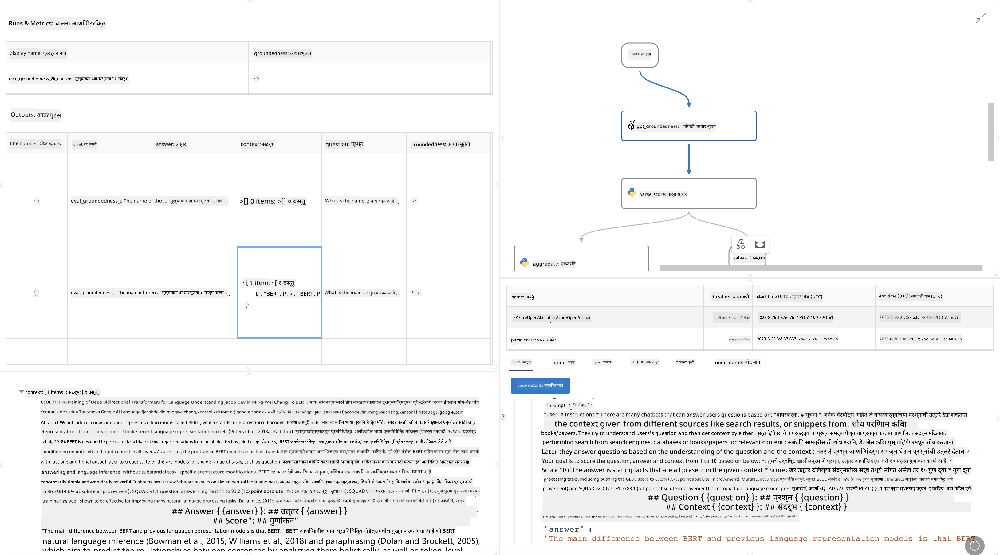

<!--
CO_OP_TRANSLATOR_METADATA:
{
  "original_hash": "3cbe7629d254f1043193b7fe22524d55",
  "translation_date": "2025-07-16T22:38:35+00:00",
  "source_file": "md/01.Introduction/05/Promptflow.md",
  "language_code": "mr"
}
-->
# **Promptflow ची ओळख**

[Microsoft Prompt Flow](https://microsoft.github.io/promptflow/index.html?WT.mc_id=aiml-138114-kinfeylo) हा एक दृश्य वर्कफ्लो ऑटोमेशन टूल आहे जो वापरकर्त्यांना पूर्वनिर्मित टेम्पलेट्स आणि कस्टम कनेक्टर्स वापरून स्वयंचलित वर्कफ्लो तयार करण्याची परवानगी देतो. हे डेव्हलपर्स आणि बिझनेस अॅनालिस्ट्सना डेटा व्यवस्थापन, सहकार्य आणि प्रक्रिया ऑप्टिमायझेशनसारख्या कामांसाठी जलद स्वयंचलित प्रक्रिया तयार करण्यास सक्षम करण्यासाठी डिझाइन केलेले आहे. Prompt Flow वापरून, वापरकर्ते वेगवेगळ्या सेवा, अॅप्लिकेशन्स आणि सिस्टम्स सहजपणे जोडू शकतात आणि गुंतागुंतीच्या व्यावसायिक प्रक्रियांना स्वयंचलित करू शकतात.

Microsoft Prompt Flow मोठ्या भाषा मॉडेल्स (LLMs) द्वारे चालवलेल्या AI अॅप्लिकेशन्सच्या संपूर्ण विकास चक्राला सुलभ करण्यासाठी डिझाइन केलेले आहे. तुम्ही कल्पना मांडत असाल, प्रोटोटायपिंग करत असाल, चाचणी करत असाल, मूल्यमापन करत असाल किंवा LLM-आधारित अॅप्लिकेशन्स तैनात करत असाल, Prompt Flow हा प्रक्रिया सुलभ करतो आणि तुम्हाला उत्पादन दर्जाच्या LLM अॅप्स तयार करण्यास मदत करतो.

## Microsoft Prompt Flow वापरण्याचे मुख्य वैशिष्ट्ये आणि फायदे:

**इंटरऐक्टिव्ह ऑथरिंग अनुभव**

Prompt Flow तुमच्या फ्लोच्या रचनेचे दृश्यात्मक प्रतिनिधित्व प्रदान करतो, ज्यामुळे तुमच्या प्रोजेक्ट्स समजून घेणे आणि नेव्हिगेट करणे सोपे होते.
हे कार्यक्षम फ्लो विकास आणि डिबगिंगसाठी नोटबुकसारखा कोडिंग अनुभव देते.

**प्रॉम्प्ट व्हेरिएंट्स आणि ट्यूनिंग**

अनेक प्रॉम्प्ट व्हेरिएंट तयार करा आणि त्यांची तुलना करा ज्यामुळे पुनरावृत्ती सुधारणा प्रक्रिया सुलभ होते. वेगवेगळ्या प्रॉम्प्ट्सची कामगिरी मूल्यांकन करा आणि सर्वात प्रभावी प्रॉम्प्ट निवडा.

**बिल्ट-इन मूल्यांकन फ्लोज**

बिल्ट-इन मूल्यांकन साधने वापरून तुमच्या प्रॉम्प्ट्स आणि फ्लोजची गुणवत्ता आणि परिणामकारकता तपासा.
तुमच्या LLM-आधारित अॅप्लिकेशन्सची कामगिरी कशी आहे हे समजून घ्या.

**संपूर्ण संसाधने**

Prompt Flow मध्ये बिल्ट-इन टूल्स, सॅम्पल्स आणि टेम्पलेट्सची लायब्ररी समाविष्ट आहे. हे संसाधने विकासासाठी सुरुवातीचा बिंदू म्हणून काम करतात, सर्जनशीलतेला प्रेरणा देतात आणि प्रक्रियेला वेग देतात.

**सहकार्य आणि एंटरप्राइझ तयारी**

प्रॉम्प्ट इंजिनिअरिंग प्रोजेक्ट्सवर एकाधिक वापरकर्त्यांना एकत्र काम करण्याची परवानगी देऊन टीम सहकार्याला समर्थन द्या.
व्हर्जन कंट्रोल राखा आणि ज्ञान प्रभावीपणे शेअर करा. विकास, मूल्यांकन, तैनाती आणि मॉनिटरिंगपासून संपूर्ण प्रॉम्प्ट इंजिनिअरिंग प्रक्रिया सुलभ करा.

## Prompt Flow मधील मूल्यांकन

Microsoft Prompt Flow मध्ये, मूल्यांकन हे तुमच्या AI मॉडेल्सची कामगिरी कशी आहे हे तपासण्यासाठी महत्त्वपूर्ण भूमिका बजावते. चला पाहूया की तुम्ही Prompt Flow मध्ये मूल्यांकन फ्लोज आणि मेट्रिक्स कसे सानुकूल करू शकता:

**Prompt Flow मधील मूल्यांकन समजून घेणे**

Prompt Flow मध्ये, फ्लो म्हणजे नोड्सची एक मालिका जी इनपुट प्रक्रिया करते आणि आउटपुट तयार करते. मूल्यांकन फ्लोज हे विशेष प्रकारचे फ्लोज असतात जे विशिष्ट निकष आणि उद्दिष्टांवर आधारित रनची कामगिरी तपासण्यासाठी डिझाइन केलेले असतात.

**मूल्यांकन फ्लोजची मुख्य वैशिष्ट्ये**

हे सहसा तपासल्या जाणाऱ्या फ्लो नंतर चालतात, त्याचे आउटपुट वापरून. ते तपासल्या जाणाऱ्या फ्लोची कामगिरी मोजण्यासाठी स्कोअर्स किंवा मेट्रिक्स काढतात. मेट्रिक्समध्ये अचूकता, सापेक्षता स्कोअर्स किंवा इतर संबंधित मोजमापांचा समावेश असू शकतो.

### मूल्यांकन फ्लोज सानुकूल करणे

**इनपुट्सची व्याख्या करणे**

मूल्यांकन फ्लोजना तपासल्या जाणाऱ्या रनचे आउटपुट्स इनपुट म्हणून घ्यावे लागतात. इनपुट्सची व्याख्या सामान्य फ्लोजप्रमाणेच करा.
उदाहरणार्थ, जर तुम्ही QnA फ्लोचे मूल्यांकन करत असाल, तर इनपुटचे नाव "answer" ठेवा. जर वर्गीकरण फ्लोचे मूल्यांकन करत असाल, तर इनपुटचे नाव "category" ठेवा. ग्राउंड ट्रूथ इनपुट्स (उदा. वास्तविक लेबल्स) देखील आवश्यक असू शकतात.

**आउटपुट्स आणि मेट्रिक्स**

मूल्यांकन फ्लोज तपासल्या जाणाऱ्या फ्लोची कामगिरी मोजणारे निकाल तयार करतात. मेट्रिक्स Python किंवा LLM वापरून काढले जाऊ शकतात. संबंधित मेट्रिक्स लॉग करण्यासाठी log_metric() फंक्शन वापरा.

**सानुकूल मूल्यांकन फ्लोज वापरणे**

तुमच्या विशिष्ट कामांसाठी आणि उद्दिष्टांसाठी तुमचा स्वतःचा मूल्यांकन फ्लो विकसित करा. तुमच्या मूल्यांकन उद्दिष्टांनुसार मेट्रिक्स सानुकूल करा.
मोठ्या प्रमाणावर चाचणीसाठी बॅच रनवर हा सानुकूलित मूल्यांकन फ्लो लागू करा.

## बिल्ट-इन मूल्यांकन पद्धती

Prompt Flow बिल्ट-इन मूल्यांकन पद्धती देखील प्रदान करतो.
तुम्ही बॅच रन सबमिट करू शकता आणि मोठ्या डेटासेटसह तुमच्या फ्लोची कामगिरी कशी आहे हे या पद्धती वापरून तपासू शकता.
मूल्यांकन निकाल पहा, मेट्रिक्सची तुलना करा आणि आवश्यकतेनुसार पुनरावृत्ती करा.
लक्षात ठेवा, मूल्यांकन हे तुमच्या AI मॉडेल्सना अपेक्षित निकष आणि उद्दिष्टे पूर्ण करतात याची खात्री करण्यासाठी आवश्यक आहे. Microsoft Prompt Flow मध्ये मूल्यांकन फ्लोज विकसित करण्यासाठी आणि वापरण्यासाठी अधिक तपशीलवार सूचना मिळवण्यासाठी अधिकृत दस्तऐवज पहा.

सारांश म्हणून, Microsoft Prompt Flow डेव्हलपर्सना प्रॉम्प्ट इंजिनिअरिंग सुलभ करून आणि एक मजबूत विकास वातावरण प्रदान करून उच्च दर्जाचे LLM अॅप्लिकेशन्स तयार करण्यास सक्षम करते. जर तुम्ही LLMs सह काम करत असाल, तर Prompt Flow हा एक मौल्यवान साधन आहे. Microsoft Prompt Flow मध्ये मूल्यांकन फ्लोज विकसित करण्यासाठी आणि वापरण्यासाठी तपशीलवार सूचना पाहण्यासाठी [Prompt Flow Evaluation Documents](https://learn.microsoft.com/azure/machine-learning/prompt-flow/how-to-develop-an-evaluation-flow?view=azureml-api-2?WT.mc_id=aiml-138114-kinfeylo) यांचा अभ्यास करा.

**अस्वीकरण**:  
हा दस्तऐवज AI अनुवाद सेवा [Co-op Translator](https://github.com/Azure/co-op-translator) वापरून अनुवादित केला आहे. आम्ही अचूकतेसाठी प्रयत्नशील असलो तरी, कृपया लक्षात घ्या की स्वयंचलित अनुवादांमध्ये चुका किंवा अचूकतेची कमतरता असू शकते. मूळ दस्तऐवज त्याच्या स्थानिक भाषेत अधिकृत स्रोत मानला जावा. महत्त्वाच्या माहितीसाठी व्यावसायिक मानवी अनुवाद करण्याची शिफारस केली जाते. या अनुवादाच्या वापरामुळे उद्भवलेल्या कोणत्याही गैरसमजुती किंवा चुकीच्या अर्थलागी आम्ही जबाबदार नाही.