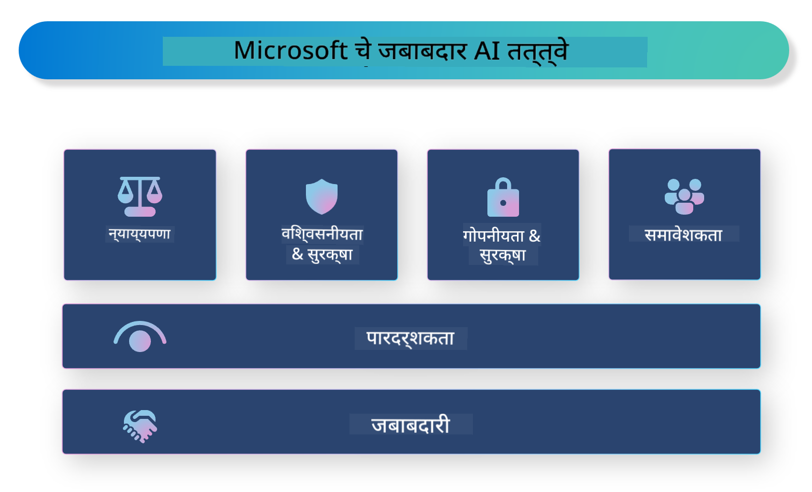

<!--
CO_OP_TRANSLATOR_METADATA:
{
  "original_hash": "805b96b20152936d8f4c587d90d6e06e",
  "translation_date": "2025-05-09T15:25:59+00:00",
  "source_file": "md/01.Introduction/05/ResponsibleAI.md",
  "language_code": "mr"
}
-->
# **जबाबदार AI ची ओळख**

[Microsoft Responsible AI](https://www.microsoft.com/ai/responsible-ai?WT.mc_id=aiml-138114-kinfeylo) ही एक पुढाकार आहे जी विकसक आणि संस्था यांना पारदर्शक, विश्वासार्ह आणि जबाबदार AI सिस्टम तयार करण्यात मदत करण्याचा उद्देश ठेवते. हा पुढाकार नैतिक तत्त्वांशी जुळणाऱ्या जबाबदार AI सोल्यूशन्स विकसित करण्यासाठी मार्गदर्शन आणि साधने पुरवतो, जसे की गोपनीयता, न्याय्यपणा आणि पारदर्शकता. आपण जबाबदार AI सिस्टम तयार करताना येणाऱ्या काही आव्हानांबाबत आणि उत्तम पद्धतींबाबतही चर्चा करू.

## Microsoft Responsible AI चे आढावा

**नैतिक तत्त्वे**

Microsoft Responsible AI गोपनीयता, न्याय्यपणा, पारदर्शकता, जबाबदारी आणि सुरक्षितता यांसारख्या नैतिक तत्त्वांवर आधारित आहे. ही तत्त्वे AI सिस्टम नैतिक आणि जबाबदारीने विकसित होण्यासाठी तयार केली आहेत.

**पारदर्शक AI**

Microsoft Responsible AI AI सिस्टममधील पारदर्शकतेवर भर देतो. यामध्ये AI मॉडेल कसे काम करतात याचे स्पष्ट स्पष्टीकरण देणे तसेच डेटा स्रोत आणि अल्गोरिदम सार्वजनिकपणे उपलब्ध करणे यांचा समावेश आहे.

**जबाबदार AI**

[Microsoft Responsible AI](https://www.microsoft.com/ai/responsible-ai?WT.mc_id=aiml-138114-kinfeylo) जबाबदार AI सिस्टम विकसित करण्यास प्रोत्साहन देतो, जे AI मॉडेल कसे निर्णय घेतात याबाबत अंतर्दृष्टी देऊ शकतात. यामुळे वापरकर्त्यांना AI सिस्टमच्या निकालांवर विश्वास ठेवता येतो.

**समावेशकता**

AI सिस्टम सर्वांसाठी फायदेशीर असाव्यात. Microsoft विविध दृष्टिकोनांचा विचार करणारा आणि पूर्वग्रह किंवा भेदभाव टाळणारा समावेशक AI तयार करण्याचा प्रयत्न करतो.

**विश्वसनीयता आणि सुरक्षितता**

AI सिस्टम विश्वसनीय आणि सुरक्षित असणे अत्यंत महत्त्वाचे आहे. Microsoft मजबूत मॉडेल तयार करण्यावर लक्ष केंद्रित करतो जे सातत्याने कार्य करतात आणि हानिकारक परिणाम टाळतात.

**AI मध्ये न्याय्यपणा**

Microsoft Responsible AI मानतो की AI सिस्टम पूर्वग्रहयुक्त डेटा किंवा अल्गोरिदमवर प्रशिक्षित केल्यास पूर्वग्रह कायम राहू शकतो. हा पुढाकार अशा न्याय्य AI सिस्टम विकसित करण्यासाठी मार्गदर्शन करतो जे जात, लिंग किंवा वय यांसारख्या घटकांवर आधारित भेदभाव करत नाहीत.

**गोपनीयता आणि सुरक्षा**

Microsoft Responsible AI वापरकर्त्यांच्या गोपनीयतेचे आणि डेटा सुरक्षेचे संरक्षण करण्याचे महत्त्व अधोरेखित करतो. यामध्ये मजबूत डेटा एन्क्रिप्शन आणि प्रवेश नियंत्रण लागू करणे तसेच AI सिस्टममधील धोके शोधण्यासाठी नियमित तपासणी करणे यांचा समावेश आहे.

**जबाबदारी आणि उत्तरदायित्व**

Microsoft Responsible AI AI विकास आणि तैनातीमध्ये जबाबदारी आणि उत्तरदायित्व वाढवण्यावर भर देतो. यामध्ये विकसक आणि संस्था AI सिस्टमशी संबंधित संभाव्य धोके ओळखून त्यांना कमी करण्यासाठी पावले उचलणे याचा समावेश आहे.

## जबाबदार AI सिस्टम तयार करण्यासाठी उत्तम पद्धती

**विविध डेटा संच वापरून AI मॉडेल विकसित करा**

AI सिस्टममधील पूर्वग्रह टाळण्यासाठी, विविध दृष्टिकोन आणि अनुभवांचे प्रतिनिधित्व करणारे डेटा संच वापरणे महत्त्वाचे आहे.

**स्पष्टीकरण देणाऱ्या AI तंत्रांचा वापर करा**

स्पष्टीकरण देणाऱ्या AI तंत्रांमुळे वापरकर्त्यांना AI मॉडेल कसे निर्णय घेतात हे समजून घेता येते, ज्यामुळे प्रणालीवर विश्वास वाढतो.

**AI सिस्टमची नियमित तपासणी करा**

AI सिस्टमची नियमित तपासणी संभाव्य धोके आणि दुर्बलता ओळखण्यासाठी मदत करते ज्यांना दुरुस्त करणे आवश्यक आहे.

**मजबूत डेटा एन्क्रिप्शन आणि प्रवेश नियंत्रण लागू करा**

डेटा एन्क्रिप्शन आणि प्रवेश नियंत्रण वापरकर्त्यांच्या गोपनीयता आणि सुरक्षा राखण्यासाठी उपयुक्त ठरतात.

**AI विकासात नैतिक तत्त्वांचे पालन करा**

न्याय्यपणा, पारदर्शकता आणि जबाबदारी यांसारख्या नैतिक तत्त्वांचे पालन केल्याने AI सिस्टमवर विश्वास वाढतो आणि ते जबाबदारीने विकसित होतात.

## Responsible AI साठी AI Foundry चा वापर

[Azure AI Foundry](https://ai.azure.com?WT.mc_id=aiml-138114-kinfeylo) ही एक शक्तिशाली प्लॅटफॉर्म आहे जी विकसक आणि संस्था यांना जलद बुद्धिमान, अत्याधुनिक, बाजारासाठी तयार आणि जबाबदार अनुप्रयोग तयार करण्याची संधी देते. Azure AI Foundry चे काही मुख्य वैशिष्ट्ये आणि क्षमता खालीलप्रमाणे आहेत:

**तयार API आणि मॉडेल**

Azure AI Foundry पूर्वनिर्मित आणि सानुकूल API व मॉडेल प्रदान करतो. हे विविध AI कार्यांसाठी आहेत, जसे की जनरेटिव AI, नैसर्गिक भाषा प्रक्रिया संभाषणांसाठी, शोध, मॉनिटरिंग, भाषांतर, भाषण, दृष्टी आणि निर्णय घेणे.

**Prompt Flow**

Azure AI Foundry मधील Prompt flow तुम्हाला संभाषणात्मक AI अनुभव तयार करण्यास मदत करतो. यामुळे तुम्ही संभाषण प्रवाह डिझाइन आणि व्यवस्थापित करू शकता, ज्यामुळे चॅटबॉट, व्हर्च्युअल सहाय्यक आणि इतर संवादात्मक अनुप्रयोग तयार करणे सोपे होते.

**Retrieval Augmented Generation (RAG)**

RAG ही एक तंत्र आहे जी पुनर्प्राप्ती-आधारित आणि जनरेटिव-आधारित दृष्टिकोन एकत्र करते. हे पूर्वस्थित ज्ञान (पुनर्प्राप्ती) आणि सर्जनशील निर्मिती (जनरेशन) वापरून उत्तरांची गुणवत्ता सुधारते.

**जनरेटिव AI साठी मूल्यांकन आणि मॉनिटरिंग मेट्रिक्स**

Azure AI Foundry जनरेटिव AI मॉडेलचे मूल्यांकन आणि मॉनिटरिंग करण्यासाठी साधने पुरवतो. तुम्ही त्यांची कामगिरी, न्याय्यपणा आणि इतर महत्त्वाचे मेट्रिक्स तपासू शकता जेणेकरून जबाबदार तैनाती सुनिश्चित करता येईल. शिवाय, जर तुम्ही डॅशबोर्ड तयार केला असेल, तर Azure Machine Learning Studio मधील नो-कोड UI वापरून तुम्ही Responsible AI Dashboard आणि संबंधित स्कोरकार्ड सानुकूलित आणि तयार करू शकता, जे [Repsonsible AI Toolbox](https://responsibleaitoolbox.ai/?WT.mc_id=aiml-138114-kinfeylo) Python लायब्ररींवर आधारित आहे. हे स्कोरकार्ड तांत्रिक आणि गैर-तांत्रिक भागधारकांसाठी न्याय्यपणा, वैशिष्ट्य महत्व आणि इतर जबाबदार तैनातीच्या बाबतीत महत्त्वाच्या अंतर्दृष्टी सामायिक करण्यात मदत करते.

Responsible AI सह AI Foundry वापरण्यासाठी खालील उत्तम पद्धतींचे पालन करा:

**तुमच्या AI सिस्टमची समस्या आणि उद्दिष्टे निश्चित करा**

विकास प्रक्रिया सुरू करण्यापूर्वी, तुमच्या AI सिस्टमने सोडवायची समस्या किंवा उद्दिष्ट स्पष्टपणे ठरवणे महत्त्वाचे आहे. यामुळे आवश्यक डेटा, अल्गोरिदम आणि संसाधने ओळखता येतील.

**संबंधित डेटा गोळा करा आणि पूर्वप्रक्रिया करा**

AI सिस्टमच्या कामगिरीवर वापरल्या जाणाऱ्या डेटाच्या गुणवत्ता आणि प्रमाणाचा मोठा प्रभाव असतो. म्हणून, संबंधित डेटा गोळा करणे, तो स्वच्छ करणे, पूर्वप्रक्रिया करणे आणि तो प्रतिनिधित्व करणारा आहे याची खात्री करणे आवश्यक आहे.

**योग्य मूल्यांकन पद्धत निवडा**

विविध मूल्यांकन अल्गोरिदम उपलब्ध आहेत. तुमच्या डेटाच्या आणि समस्येच्या आधारावर योग्य अल्गोरिदम निवडणे महत्त्वाचे आहे.

**मॉडेलचे मूल्यांकन आणि अर्थ लावा**

AI मॉडेल तयार केल्यानंतर, योग्य मेट्रिक्स वापरून त्याची कामगिरी मूल्यांकन करा आणि निकाल पारदर्शक पद्धतीने समजून घ्या. यामुळे मॉडेलमधील कोणतेही पूर्वग्रह किंवा मर्यादा ओळखता येतील आणि आवश्यक ते सुधारणा करता येतील.

**पारदर्शकता आणि स्पष्टीकरण सुनिश्चित करा**

AI सिस्टम पारदर्शक आणि समजण्यास सोपे असावेत जेणेकरून वापरकर्ते ते कसे काम करतात आणि निर्णय कसे घेतले जातात हे समजू शकतील. विशेषतः आरोग्य, वित्त आणि कायदा यांसारख्या मानवी जीवनावर मोठा परिणाम करणाऱ्या अनुप्रयोगांसाठी हे अत्यंत महत्त्वाचे आहे.

**मॉडेलची देखरेख आणि अद्यतन करा**

AI सिस्टम सातत्याने देखरेख आणि अद्ययावत केली पाहिजे जेणेकरून ते वेळोवेळी अचूक आणि प्रभावी राहतील. यासाठी नियमित देखभाल, चाचणी आणि पुनःप्रशिक्षण आवश्यक आहे.

सारांश म्हणून, Microsoft Responsible AI हा एक पुढाकार आहे जो विकसक आणि संस्था यांना पारदर्शक, विश्वासार्ह आणि जबाबदार AI सिस्टम तयार करण्यात मदत करतो. जबाबदार AI ची अंमलबजावणी अत्यंत महत्त्वाची आहे आणि Azure AI Foundry हे संस्थांसाठी ते व्यवहार्य बनवण्याचा प्रयत्न करतो. नैतिक तत्त्वे आणि उत्तम पद्धतींचे पालन करून, आपण असे सुनिश्चित करू शकतो की AI सिस्टम समाजाच्या एकूण फायद्यासाठी जबाबदारीने विकसित आणि तैनात केले जातील.

**अस्वीकरण**:  
हा दस्तऐवज AI भाषांतर सेवा [Co-op Translator](https://github.com/Azure/co-op-translator) वापरून भाषांतरित केला आहे. आम्ही अचूकतेसाठी प्रयत्नशील आहोत, तरी कृपया लक्षात ठेवा की स्वयंचलित भाषांतरांमध्ये चुका किंवा अचूकतेचा अभाव असू शकतो. मूळ दस्तऐवज त्याच्या स्थानिक भाषेत अधिकृत स्रोत मानला जावा. महत्त्वाच्या माहितीसाठी व्यावसायिक मानवी भाषांतर करण्याचा सल्ला दिला जातो. या भाषांतराच्या वापरामुळे उद्भवलेल्या कोणत्याही गैरसमजुती किंवा चुकीसाठी आम्ही जबाबदार नाही.