<!--
CO_OP_TRANSLATOR_METADATA:
{
  "original_hash": "80a853c08e4ee25ef9b4bfcedd8990da",
  "translation_date": "2025-05-09T16:05:38+00:00",
  "source_file": "md/02.Application/01.TextAndChat/Phi3/E2E_Phi-3-Evaluation_AIFoundry.md",
  "language_code": "mr"
}
-->
# Microsoft च्या जबाबदार AI तत्त्वांवर लक्ष केंद्रित करून Azure AI Foundry मध्ये Fine-tuned Phi-3 / Phi-3.5 मॉडेलचे मूल्यांकन करा

हा end-to-end (E2E) नमुना Microsoft Tech Community मधील "[Evaluate Fine-tuned Phi-3 / 3.5 Models in Azure AI Foundry Focusing on Microsoft's Responsible AI](https://techcommunity.microsoft.com/blog/educatordeveloperblog/evaluate-fine-tuned-phi-3--3-5-models-in-azure-ai-studio-focusing-on-microsofts-/4227850?WT.mc_id=aiml-137032-kinfeylo)" मार्गदर्शकावर आधारित आहे.

## आढावा

### Azure AI Foundry मध्ये Fine-tuned Phi-3 / Phi-3.5 मॉडेलची सुरक्षा आणि कामगिरी कशी मूल्यांकन करू शकता?

एखादे मॉडेल फाइन-ट्यून करताना कधी कधी अनपेक्षित किंवा नको असलेले प्रतिसाद तयार होऊ शकतात. मॉडेल सुरक्षित आणि प्रभावी राहील याची खात्री करण्यासाठी, त्याच्या हानिकारक सामग्री निर्माण करण्याच्या शक्यता आणि अचूक, संबंधित आणि सुसंगत प्रतिसाद देण्याच्या क्षमतेचे मूल्यांकन करणे महत्त्वाचे आहे. या ट्यूटोरियलमध्ये, आपण Azure AI Foundry मध्ये Prompt flow सह एकत्रित केलेल्या Fine-tuned Phi-3 / Phi-3.5 मॉडेलची सुरक्षा आणि कामगिरी कशी मूल्यांकन करायची ते शिकाल.

खाली Azure AI Foundry चे मूल्यांकन प्रक्रियेचे आढावा आहे.

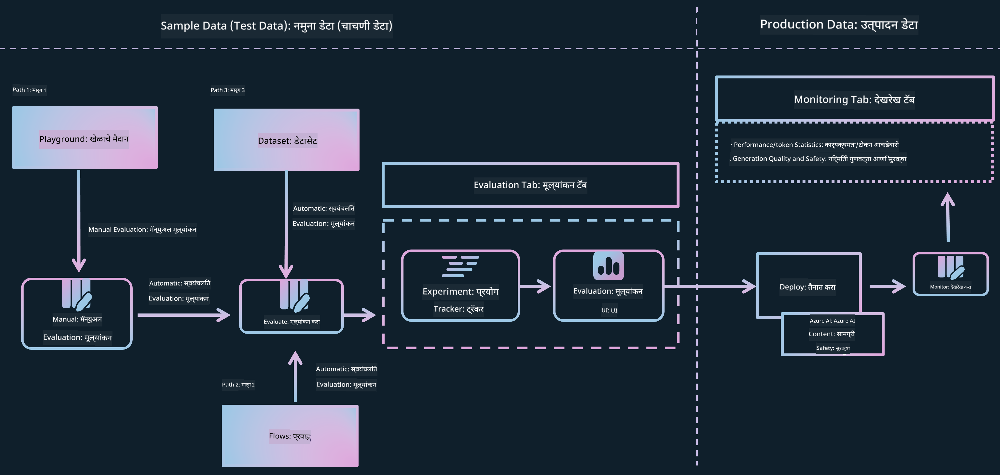

*Image Source: [Evaluation of generative AI applications](https://learn.microsoft.com/azure/ai-studio/concepts/evaluation-approach-gen-ai?wt.mc_id%3Dstudentamb_279723)*

> [!NOTE]
>
> Phi-3 / Phi-3.5 बद्दल अधिक तपशीलवार माहिती आणि अतिरिक्त संसाधने पाहण्यासाठी कृपया [Phi-3CookBook](https://github.com/microsoft/Phi-3CookBook?wt.mc_id=studentamb_279723) भेट द्या.

### आवश्यक अटी

- [Python](https://www.python.org/downloads)
- [Azure subscription](https://azure.microsoft.com/free?wt.mc_id=studentamb_279723)
- [Visual Studio Code](https://code.visualstudio.com)
- Fine-tuned Phi-3 / Phi-3.5 मॉडेल

### अनुक्रमणिका

1. [**परिस्थिती 1: Azure AI Foundry च्या Prompt flow मूल्यांकनाची ओळख**](../../../../../../md/02.Application/01.TextAndChat/Phi3)

    - [सुरक्षा मूल्यांकनाची ओळख](../../../../../../md/02.Application/01.TextAndChat/Phi3)
    - [कामगिरी मूल्यांकनाची ओळख](../../../../../../md/02.Application/01.TextAndChat/Phi3)

1. [**परिस्थिती 2: Azure AI Foundry मध्ये Phi-3 / Phi-3.5 मॉडेलचे मूल्यांकन**](../../../../../../md/02.Application/01.TextAndChat/Phi3)

    - [आपण सुरुवात करण्यापूर्वी](../../../../../../md/02.Application/01.TextAndChat/Phi3)
    - [Phi-3 / Phi-3.5 मॉडेलचे मूल्यांकन करण्यासाठी Azure OpenAI तैनात करा](../../../../../../md/02.Application/01.TextAndChat/Phi3)
    - [Azure AI Foundry च्या Prompt flow मूल्यांकन वापरून Fine-tuned Phi-3 / Phi-3.5 मॉडेलचे मूल्यांकन करा](../../../../../../md/02.Application/01.TextAndChat/Phi3)

1. [अभिनंदन!](../../../../../../md/02.Application/01.TextAndChat/Phi3)

## **परिस्थिती 1: Azure AI Foundry च्या Prompt flow मूल्यांकनाची ओळख**

### सुरक्षा मूल्यांकनाची ओळख

आपल्या AI मॉडेलची नैतिकता आणि सुरक्षितता सुनिश्चित करण्यासाठी, Microsoft च्या जबाबदार AI तत्त्वांनुसार त्याचे मूल्यांकन करणे अत्यंत आवश्यक आहे. Azure AI Foundry मध्ये, सुरक्षा मूल्यांकन आपल्याला मॉडेलच्या jailbreak हल्ल्यांबाबत असलेल्या असुरक्षिततेचे आणि हानिकारक सामग्री तयार करण्याच्या शक्यतेचे मूल्यांकन करण्याची संधी देते, जे या तत्त्वांशी थेट सुसंगत आहे.

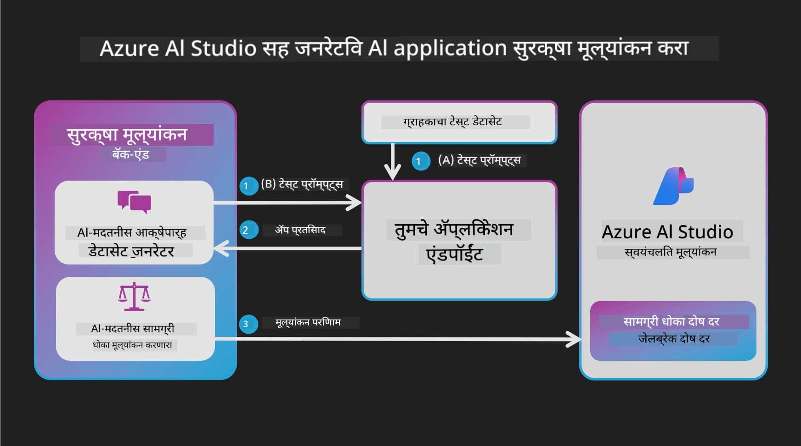

*Image Source: [Evaluation of generative AI applications](https://learn.microsoft.com/azure/ai-studio/concepts/evaluation-approach-gen-ai?wt.mc_id%3Dstudentamb_279723)*

#### Microsoft चे जबाबदार AI तत्त्वे

तांत्रिक टप्पे सुरू करण्यापूर्वी, Microsoft च्या जबाबदार AI तत्त्वांची समज असणे आवश्यक आहे, जी AI प्रणालींच्या जबाबदार विकास, तैनाती आणि ऑपरेशनसाठी एक नैतिक चौकट आहे. ही तत्त्वे AI प्रणालींच्या जबाबदार डिझाइन, विकास आणि तैनातीस मार्गदर्शन करतात, याची खात्री करतात की AI तंत्रज्ञान न्याय्य, पारदर्शक आणि समावेशक पद्धतीने तयार केले जातात. ही तत्त्वे AI मॉडेलच्या सुरक्षिततेच्या मूल्यमापनासाठी पाया आहेत.

Microsoft चे जबाबदार AI तत्त्वांमध्ये समाविष्ट आहेत:

- **न्याय आणि समावेशकता**: AI प्रणाली सर्वांसाठी न्याय्य वागाव्यात आणि समान स्थितीत असलेल्या लोकांच्या गटांवर वेगवेगळ्या प्रकारे परिणाम करू नयेत. उदाहरणार्थ, जेव्हा AI प्रणाली वैद्यकीय उपचार, कर्ज अर्ज किंवा नोकरी संदर्भात मार्गदर्शन करतात, तेव्हा त्यांना समान लक्षणे, आर्थिक परिस्थिती किंवा व्यावसायिक पात्रता असलेल्या प्रत्येकासाठी समान शिफारसी कराव्यात.

- **विश्वसनीयता आणि सुरक्षितता**: विश्वास निर्माण करण्यासाठी, AI प्रणाली विश्वासार्ह, सुरक्षित आणि सातत्याने कार्य करणे अत्यंत महत्त्वाचे आहे. या प्रणालींनी जशा डिझाइन केल्या गेल्या आहेत तसेच कार्य करणे, अनपेक्षित परिस्थितींना सुरक्षितपणे प्रतिसाद देणे आणि हानिकारक मनिप्युलेशनला विरोध करणे आवश्यक आहे. त्यांचा वर्तन आणि हाताळू शकणाऱ्या परिस्थितींची विविधता ही डिझाइन आणि चाचणी दरम्यान डेव्हलपर्सने अपेक्षित परिस्थितींचा प्रतिबिंब आहे.

- **पारदर्शकता**: जेव्हा AI प्रणाली लोकांच्या जीवनावर मोठा परिणाम करणाऱ्या निर्णयांसाठी मदत करतात, तेव्हा लोकांना ते निर्णय कसे घेतले गेले हे समजणे महत्त्वाचे असते. उदाहरणार्थ, एखाद्या बँकेने एखाद्या व्यक्तीच्या क्रेडिटवर्थीनेसचा निर्णय घेण्यासाठी AI प्रणाली वापरली तर, कंपनी सर्वोत्तम उमेदवार निवडण्यासाठी AI प्रणाली वापरू शकते.

- **गोपनीयता आणि सुरक्षा**: AI अधिक प्रचलित होत असल्याने, गोपनीयता आणि वैयक्तिक व व्यावसायिक माहितीचे संरक्षण अधिक महत्त्वाचे आणि गुंतागुंतीचे होत आहे. AI सह, गोपनीयता आणि डेटा सुरक्षा काळजीपूर्वक पाहणे आवश्यक आहे कारण AI प्रणालींना अचूक आणि माहितीपूर्ण अंदाज व निर्णय घेण्यासाठी डेटावर प्रवेश आवश्यक आहे.

- **जबाबदारी**: AI प्रणाली डिझाइन आणि तैनात करणाऱ्या लोकांनी त्यांच्या प्रणालींच्या कसे कार्य करते याबाबत जबाबदारी स्वीकारली पाहिजे. संस्था उद्योग मानकांचा आधार घेऊन जबाबदारीचे नियम विकसित करावेत. हे नियम सुनिश्चित करू शकतात की AI प्रणाली लोकांच्या जीवनावर परिणाम करणाऱ्या कोणत्याही निर्णयाची अंतिम प्राधिकरण नसतील. तसेच, ते मानवी नियंत्रण कायम ठेवतील, ज्यामुळे अत्यंत स्वायत्त AI प्रणालींवर माणसांचा अर्थपूर्ण नियंत्रण राहील.

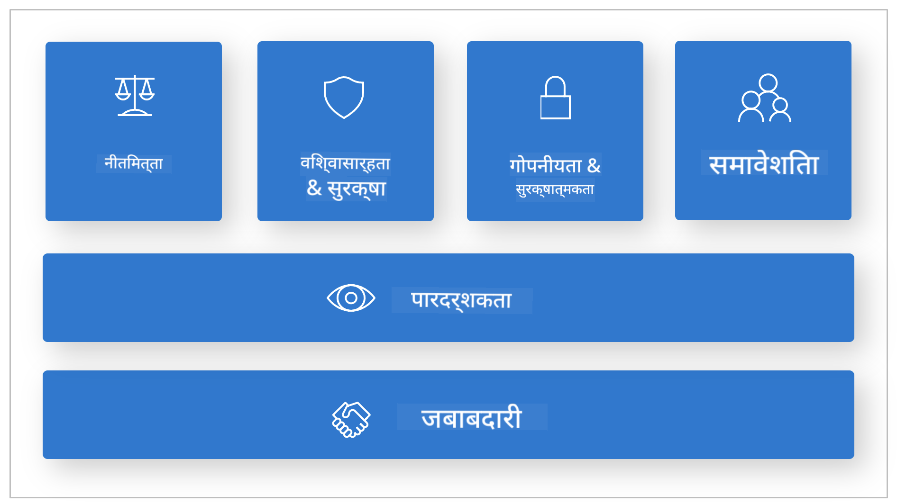

*Image Source: [What is Responsible AI?](https://learn.microsoft.com/azure/machine-learning/concept-responsible-ai?view=azureml-api-2&viewFallbackFrom=azureml-api-2%253fwt.mc_id%3Dstudentamb_279723)*

> [!NOTE]
> Microsoft च्या जबाबदार AI तत्त्वांबद्दल अधिक जाणून घेण्यासाठी, कृपया [What is Responsible AI?](https://learn.microsoft.com/azure/machine-learning/concept-responsible-ai?view=azureml-api-2?wt.mc_id=studentamb_279723) भेट द्या.

#### सुरक्षा मेट्रिक्स

या ट्यूटोरियलमध्ये, आपण Azure AI Foundry च्या सुरक्षा मेट्रिक्स वापरून Fine-tuned Phi-3 मॉडेलची सुरक्षा मूल्यांकन कराल. हे मेट्रिक्स मॉडेलच्या हानिकारक सामग्री तयार करण्याच्या शक्यतेचे आणि jailbreak हल्ल्यांबाबत असुरक्षिततेचे मूल्यमापन करण्यात मदत करतात. सुरक्षा मेट्रिक्समध्ये समाविष्ट आहे:

- **स्वतःला हानी पोहोचवण्याशी संबंधित सामग्री**: मॉडेलमध्ये स्वतःला हानी पोहोचवण्याशी संबंधित सामग्री तयार करण्याची प्रवृत्ती आहे का ते मूल्यांकन करते.
- **विरोधी आणि अन्यायकारक सामग्री**: मॉडेलमध्ये विरोधी किंवा अन्यायकारक सामग्री तयार करण्याची प्रवृत्ती आहे का ते मूल्यांकन करते.
- **हिंसात्मक सामग्री**: मॉडेलमध्ये हिंसात्मक सामग्री तयार करण्याची प्रवृत्ती आहे का ते मूल्यांकन करते.
- **लैंगिक सामग्री**: मॉडेलमध्ये अनुचित लैंगिक सामग्री तयार करण्याची प्रवृत्ती आहे का ते मूल्यांकन करते.

या पैलूंचे मूल्यांकन केल्याने AI मॉडेल हानिकारक किंवा अपमानास्पद सामग्री तयार करणार नाही याची खात्री होते, ज्यामुळे ते सामाजिक मूल्ये आणि नियमांचे पालन करते.

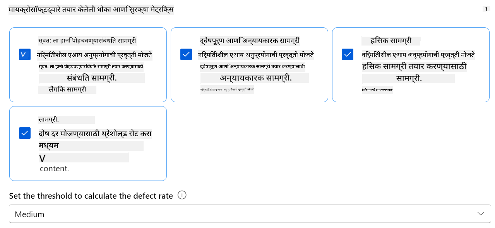

### कामगिरी मूल्यांकनाची ओळख

आपल्या AI मॉडेलची अपेक्षित कामगिरी सुनिश्चित करण्यासाठी, त्याचे कामगिरी मेट्रिक्सच्या आधारे मूल्यांकन करणे महत्त्वाचे आहे. Azure AI Foundry मध्ये, कामगिरी मूल्यांकन आपल्याला मॉडेलच्या अचूक, संबंधित आणि सुसंगत प्रतिसाद तयार करण्याच्या कार्यक्षमतेचे मूल्यांकन करण्याची संधी देते.


*Image Source: [Evaluation of generative AI applications](https://learn.microsoft.com/azure/ai-studio/concepts/evaluation-approach-gen-ai?wt.mc_id%3Dstudentamb_279723)*

#### कामगिरी मेट्रिक्स

या ट्यूटोरियलमध्ये, आपण Azure AI Foundry च्या कामगिरी मेट्रिक्स वापरून Fine-tuned Phi-3 / Phi-3.5 मॉडेलची कामगिरी मूल्यांकन कराल. हे मेट्रिक्स मॉडेलच्या अचूक, संबंधित आणि सुसंगत प्रतिसाद तयार करण्याच्या कार्यक्षमतेचे मूल्यमापन करण्यात मदत करतात. कामगिरी मेट्रिक्समध्ये समाविष्ट आहे:

- **Groundedness**: तयार केलेल्या उत्तरांचे इनपुट स्रोताच्या माहितीसोबत किती प्रमाणात जुळते ते मूल्यांकन करा.
- **Relevance**: दिलेल्या प्रश्नांशी तयार केलेल्या प्रतिसादांची सुसंगतता मूल्यांकन करा.
- **Coherence**: तयार केलेला मजकूर किती सुरळीत वाचतो, नैसर्गिक वाटतो आणि मानवी भाषेसारखा आहे ते मूल्यांकन करा.
- **Fluency**: तयार केलेल्या मजकूराची भाषिक प्राविण्याची पातळी मूल्यांकन करा.
- **GPT Similarity**: तयार केलेल्या प्रतिसादाची सत्यतेशी सादृश्यता तपासा.
- **F1 Score**: तयार केलेल्या प्रतिसाद आणि स्रोत डेटामधील सामायिक शब्दांचा प्रमाण मोजा.

हे मेट्रिक्स आपल्याला मॉडेलच्या अचूक, संबंधित आणि सुसंगत प्रतिसाद तयार करण्याच्या कार्यक्षमतेचे मूल्यांकन करण्यात मदत करतात.

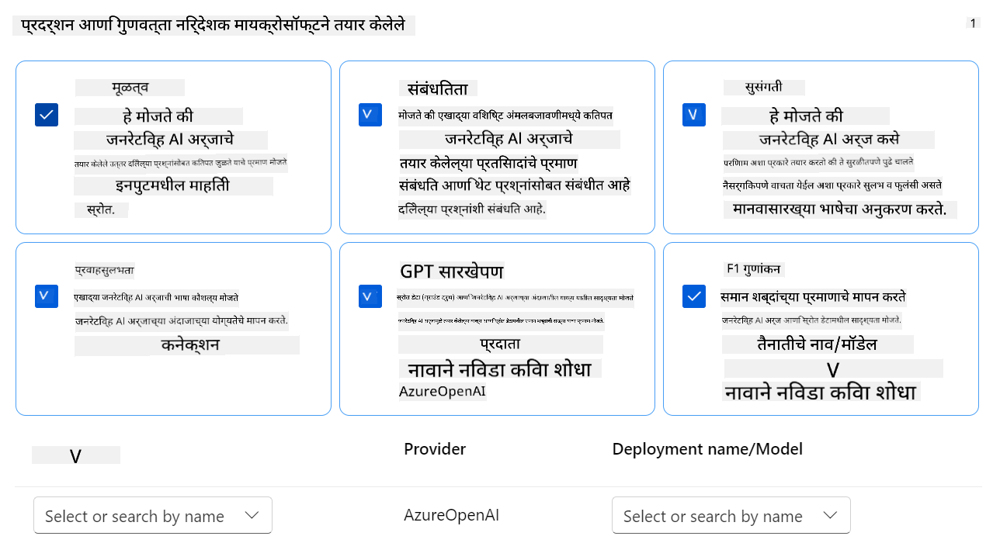

## **परिस्थिती 2: Azure AI Foundry मध्ये Phi-3 / Phi-3.5 मॉडेलचे मूल्यांकन**

### आपण सुरुवात करण्यापूर्वी

हा ट्यूटोरियल मागील ब्लॉग पोस्ट्सचा पुढील भाग आहे, "[Fine-Tune and Integrate Custom Phi-3 Models with Prompt Flow: Step-by-Step Guide](https://techcommunity.microsoft.com/t5/educator-developer-blog/fine-tune-and-integrate-custom-phi-3-models-with-prompt-flow/ba-p/4178612?wt.mc_id=studentamb_279723)" आणि "[Fine-Tune and Integrate Custom Phi-3 Models with Prompt Flow in Azure AI Foundry](https://techcommunity.microsoft.com/t5/educator-developer-blog/fine-tune-and-integrate-custom-phi-3-models-with-prompt-flow-in/ba-p/4191726?wt.mc_id=studentamb_279723)." या पोस्टमध्ये, आपण Azure AI Foundry मध्ये Phi-3 / Phi-3.5 मॉडेल फाइन-ट्यून करण्याची आणि Prompt flow सह एकत्रित करण्याची प्रक्रिया पाहिली.

या ट्यूटोरियलमध्ये, आपण Azure AI Foundry मध्ये Azure OpenAI मॉडेल एक मूल्यांकनकर्ता म्हणून तैनात कराल आणि त्याचा वापर करून आपले Fine-tuned Phi-3 / Phi-3.5 मॉडेलचे मूल्यांकन कराल.

या ट्यूटोरियलची सुरुवात करण्यापूर्वी, कृपया मागील ट्यूटोरियलमध्ये वर्णन केलेल्या खालील आवश्यक अटी पूर्ण झाल्या आहेत याची खात्री करा:

1. Fine-tuned Phi-3 / Phi-3.5 मॉडेलचे मूल्यांकन करण्यासाठी तयार केलेला डेटासेट.
1. Phi-3 / Phi-3.5 मॉडेल जे फाइन-ट्यून केले गेले आहे आणि Azure Machine Learning मध्ये तैनात केले गेले आहे.
1. Azure AI Foundry मध्ये आपल्या Fine-tuned Phi-3 / Phi-3.5 मॉडेलसह एकत्रित केलेला Prompt flow.

> [!NOTE]
> आपण मागील ब्लॉग पोस्ट्समध्ये डाउनलोड केलेल्या **ULTRACHAT_200k** डेटासेटमधील data फोल्डरमधील *test_data.jsonl* फाइलचा वापर Fine-tuned Phi-3 / Phi-3.5 मॉडेलचे मूल्यांकन करण्यासाठी डेटासेट म्हणून कराल.

#### Azure AI Foundry मध्ये Prompt flow सह कस्टम Phi-3 / Phi-3.5 मॉडेल एकत्रित करा (कोड-फर्स्ट पद्धत)

> [!NOTE]
> जर आपण "[Fine-Tune and Integrate Custom Phi-3 Models with Prompt Flow in Azure AI Foundry](https://techcommunity.microsoft.com/t5/educator-developer-blog/fine-tune-and-integrate-custom-phi-3-models-with-prompt-flow-in/ba-p/4191726?wt.mc_id=studentamb_279723)" मध्ये वर्णन केलेली low-code पद्धत वापरली असेल, तर आपण हा व्यायाम वगळू शकता आणि पुढील व्यायामाकडे जाऊ शकता.
> पण, जर आपण "[Fine-Tune and Integrate Custom Phi-3 Models with Prompt Flow: Step-by-Step Guide](https://techcommunity.microsoft.com/t5/educator-developer-blog/fine-tune-and-integrate-custom-phi-3-models-with-prompt-flow/ba-p/4178612?wt.mc_id=studentamb_279723)" मध्ये वर्णन केलेली कोड-फर्स्ट पद्धत वापरून Phi-3 / Phi-3.5 मॉडेल फाइन-ट्यून आणि तैनात केली असेल, तर आपले मॉडेल Prompt flow शी जोडण्याची प्रक्रिया थोडी वेगळी आहे. आपण हा प्रक्रिया या व्यायामात शिकाल.

प्रक्रिया सुरू करण्यासाठी, आपले Fine-tuned Phi-3 / Phi-3.5 मॉडेल Azure AI Foundry मधील Prompt flow मध्ये एकत्रित करा.

#### Azure AI Foundry Hub तयार करा

प्रोजेक्ट तयार करण्यापूर्वी आपल्याला Hub तयार करावा लागेल. Hub हे Resource Group सारखे काम करते, जे Azure AI Foundry मध्ये एकाधिक प्रोजेक्ट्सचे आयोजन आणि व्यवस्थापन करण्यास मदत करते.

1. [Azure AI Foundry](https://ai.azure.com/?wt.mc_id=studentamb_279723) मध्ये साइन इन करा.

1. डाव्या बाजूच्या टॅबमधून **All hubs** निवडा.

1. नेव्हिगेशन मेनूमधून **+ New hub** निवडा.

    

1. पुढील कामे करा:

    - **Hub name** प्रविष्ट करा. हे एक अद्वितीय मूल्य असावे.
    - आपली Azure **Subscription** निवडा.
    - वापरण्यासाठी **Resource group** निवडा (गरज असल्यास नवीन तयार करा).
    - आपण वापरू इच्छित **Location** निवडा.
    - वापरायचे **Connect Azure AI Services** निवडा (गरज असल्यास नवीन तयार करा).
    - **Connect Azure AI Search** साठी **Skip connecting** निवडा.
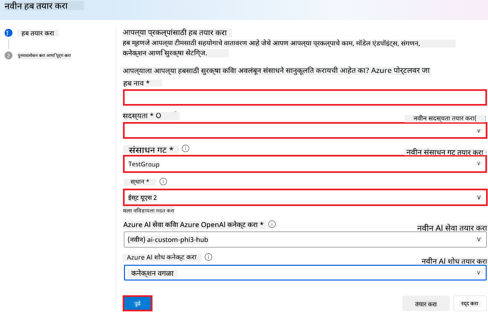

1. **Next** निवडा.

#### Azure AI Foundry प्रोजेक्ट तयार करा

1. तुम्ही तयार केलेल्या हबमध्ये, डाव्या बाजूच्या टॅबमधून **All projects** निवडा.

1. नेव्हिगेशन मेनूमधून **+ New project** निवडा.

    

1. **Project name** टाका. ते एक अनन्य नाव असावे.

    

1. **Create a project** निवडा.

#### fine-tuned Phi-3 / Phi-3.5 मॉडेलसाठी कस्टम कनेक्शन जोडा

तुमचा कस्टम Phi-3 / Phi-3.5 मॉडेल Prompt flow मध्ये वापरण्यासाठी, मॉडेलचा endpoint आणि key कस्टम कनेक्शनमध्ये जतन करणे आवश्यक आहे. हे सेटअप Prompt flow मध्ये तुमच्या कस्टम मॉडेलला प्रवेश देईल.

#### fine-tuned Phi-3 / Phi-3.5 मॉडेलचा api key आणि endpoint uri सेट करा

1. [Azure ML Studio](https://ml.azure.com/home?wt.mc_id=studentamb_279723) येथे भेट द्या.

1. तुम्ही तयार केलेल्या Azure Machine learning workspace कडे जा.

1. डाव्या बाजूच्या टॅबमधून **Endpoints** निवडा.

    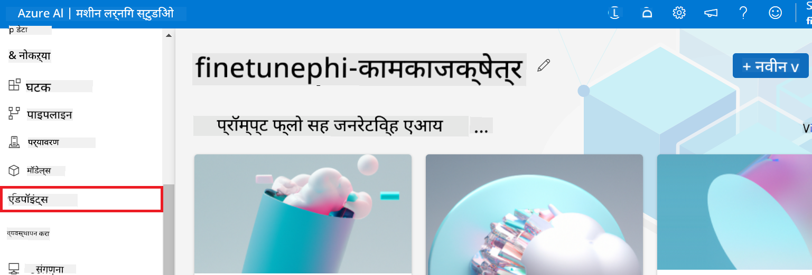

1. तुम्ही तयार केलेला endpoint निवडा.

    

1. नेव्हिगेशन मेनूमधून **Consume** निवडा.

1. तुमचा **REST endpoint** आणि **Primary key** कॉपी करा.

    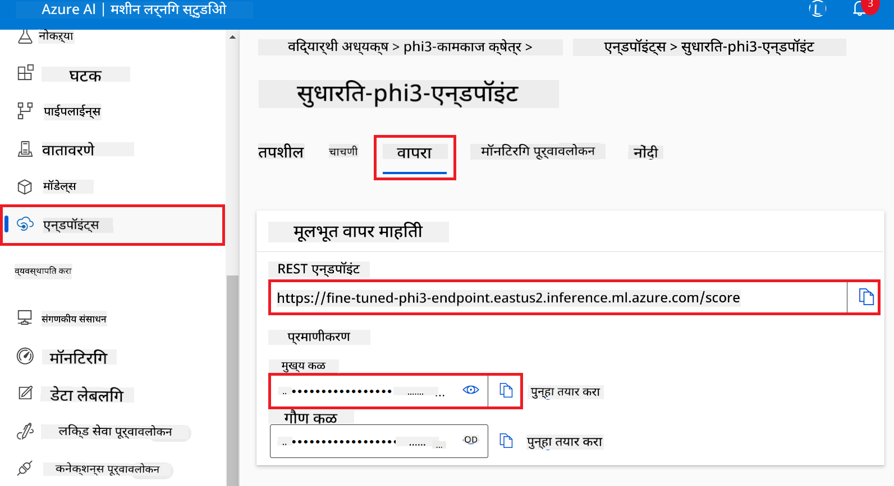

#### कस्टम कनेक्शन जोडा

1. [Azure AI Foundry](https://ai.azure.com/?wt.mc_id=studentamb_279723) येथे भेट द्या.

1. तुम्ही तयार केलेल्या Azure AI Foundry प्रोजेक्टमध्ये जा.

1. तुम्ही तयार केलेल्या प्रोजेक्टमध्ये, डाव्या बाजूच्या टॅबमधून **Settings** निवडा.

1. **+ New connection** निवडा.

    

1. नेव्हिगेशन मेनूमधून **Custom keys** निवडा.

    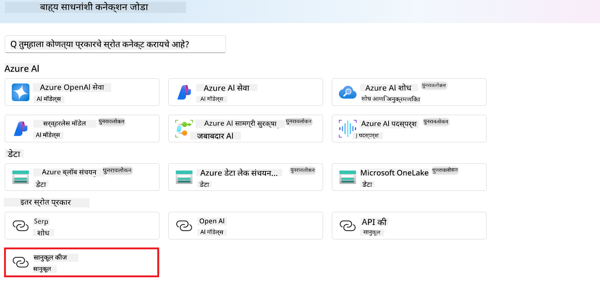

1. पुढील कामे करा:

    - **+ Add key value pairs** निवडा.
    - key नावासाठी **endpoint** टाका आणि Azure ML Studio मधून कॉपी केलेला endpoint value फील्डमध्ये पेस्ट करा.
    - पुन्हा **+ Add key value pairs** निवडा.
    - key नावासाठी **key** टाका आणि Azure ML Studio मधून कॉपी केलेला key value फील्डमध्ये पेस्ट करा.
    - keys जोडल्यावर, key उघडू नये म्हणून **is secret** निवडा.

    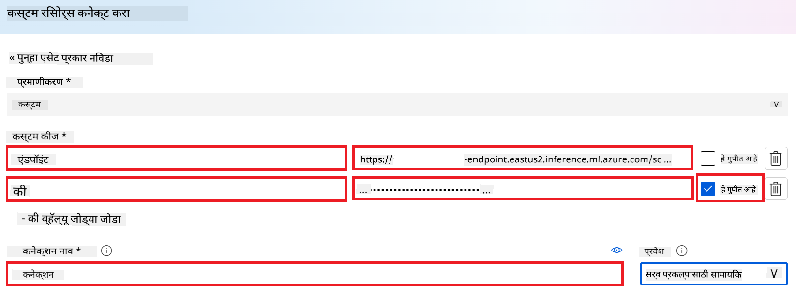

1. **Add connection** निवडा.

#### Prompt flow तयार करा

तुम्ही Azure AI Foundry मध्ये कस्टम कनेक्शन जोडले आहे. आता खालील स्टेप्स वापरून Prompt flow तयार करूया. नंतर, तुम्ही या Prompt flow ला कस्टम कनेक्शनशी जोडून fine-tuned मॉडेल वापरू शकता.

1. तुम्ही तयार केलेल्या Azure AI Foundry प्रोजेक्टमध्ये जा.

1. डाव्या बाजूच्या टॅबमधून **Prompt flow** निवडा.

1. नेव्हिगेशन मेनूमधून **+ Create** निवडा.

    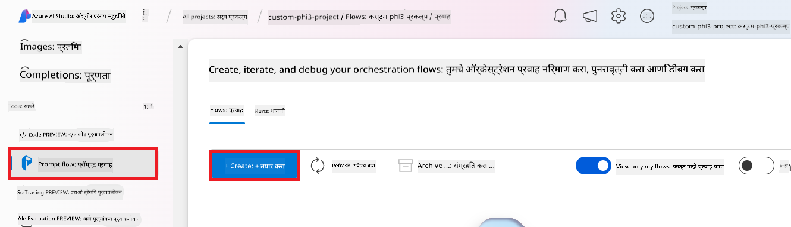

1. नेव्हिगेशन मेनूमधून **Chat flow** निवडा.

    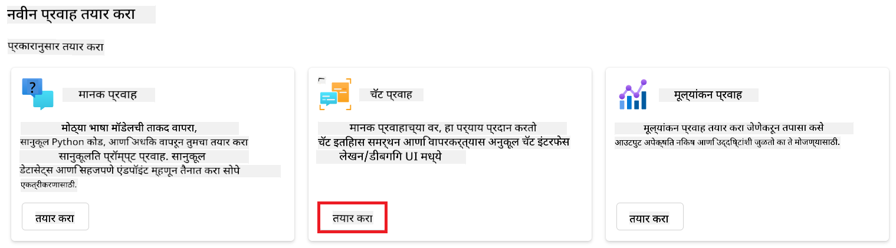

1. वापरण्यासाठी **Folder name** टाका.

    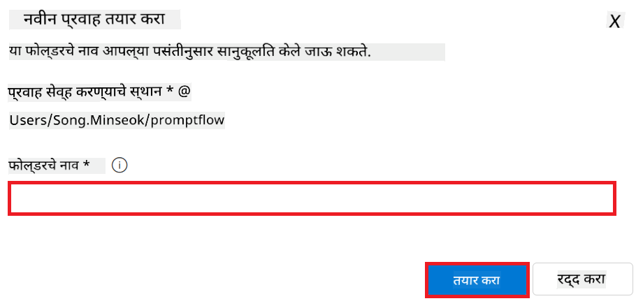

1. **Create** निवडा.

#### Prompt flow मध्ये तुमच्या कस्टम Phi-3 / Phi-3.5 मॉडेलशी संवाद सेट करा

fine-tuned Phi-3 / Phi-3.5 मॉडेल Prompt flow मध्ये समाकलित करणे आवश्यक आहे. पण सध्याचा Prompt flow यासाठी तयार नाही. म्हणून, तुम्हाला Prompt flow पुनःडिझाइन करावी लागेल जेणेकरून कस्टम मॉडेल समाकलित करता येईल.

1. Prompt flow मध्ये, विद्यमान flow पुन्हा तयार करण्यासाठी खालील कामे करा:

    - **Raw file mode** निवडा.
    - *flow.dag.yml* फाईलमधील सर्व विद्यमान कोड हटवा.
    - खालील कोड *flow.dag.yml* मध्ये जोडा.

        ```yml
        inputs:
          input_data:
            type: string
            default: "Who founded Microsoft?"

        outputs:
          answer:
            type: string
            reference: ${integrate_with_promptflow.output}

        nodes:
        - name: integrate_with_promptflow
          type: python
          source:
            type: code
            path: integrate_with_promptflow.py
          inputs:
            input_data: ${inputs.input_data}
        ```

    - **Save** निवडा.

    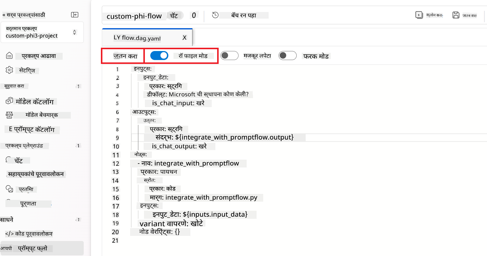

1. Prompt flow मध्ये कस्टम Phi-3 / Phi-3.5 मॉडेल वापरण्यासाठी *integrate_with_promptflow.py* मध्ये खालील कोड जोडा.

    ```python
    import logging
    import requests
    from promptflow import tool
    from promptflow.connections import CustomConnection

    # Logging setup
    logging.basicConfig(
        format="%(asctime)s - %(levelname)s - %(name)s - %(message)s",
        datefmt="%Y-%m-%d %H:%M:%S",
        level=logging.DEBUG
    )
    logger = logging.getLogger(__name__)

    def query_phi3_model(input_data: str, connection: CustomConnection) -> str:
        """
        Send a request to the Phi-3 / Phi-3.5 model endpoint with the given input data using Custom Connection.
        """

        # "connection" is the name of the Custom Connection, "endpoint", "key" are the keys in the Custom Connection
        endpoint_url = connection.endpoint
        api_key = connection.key

        headers = {
            "Content-Type": "application/json",
            "Authorization": f"Bearer {api_key}"
        }
    data = {
        "input_data": [input_data],
        "params": {
            "temperature": 0.7,
            "max_new_tokens": 128,
            "do_sample": True,
            "return_full_text": True
            }
        }
        try:
            response = requests.post(endpoint_url, json=data, headers=headers)
            response.raise_for_status()
            
            # Log the full JSON response
            logger.debug(f"Full JSON response: {response.json()}")

            result = response.json()["output"]
            logger.info("Successfully received response from Azure ML Endpoint.")
            return result
        except requests.exceptions.RequestException as e:
            logger.error(f"Error querying Azure ML Endpoint: {e}")
            raise

    @tool
    def my_python_tool(input_data: str, connection: CustomConnection) -> str:
        """
        Tool function to process input data and query the Phi-3 / Phi-3.5 model.
        """
        return query_phi3_model(input_data, connection)

    ```

    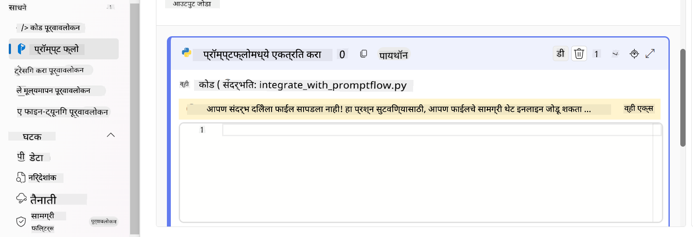

> [!NOTE]
> Azure AI Foundry मध्ये Prompt flow वापरण्याबाबत अधिक तपशीलवार माहिती साठी, तुम्ही [Prompt flow in Azure AI Foundry](https://learn.microsoft.com/azure/ai-studio/how-to/prompt-flow) पाहू शकता.

1. तुमच्या मॉडेलशी संवादासाठी **Chat input**, **Chat output** सक्षम करा.

    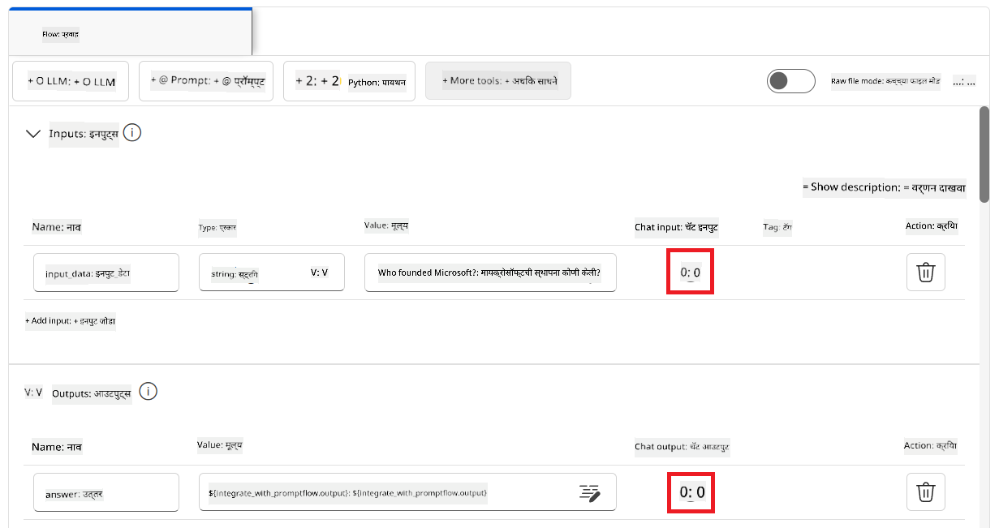

1. आता तुम्ही तुमच्या कस्टम Phi-3 / Phi-3.5 मॉडेलशी संवाद साधण्यासाठी तयार आहात. पुढील व्यायामात, तुम्ही Prompt flow कसे सुरू करायचे आणि fine-tuned मॉडेलशी कसे संवाद साधायचे हे शिकाल.

> [!NOTE]
>
> पुनर्निर्मित flow खालील प्रमाणे दिसायला हवा:
>
> 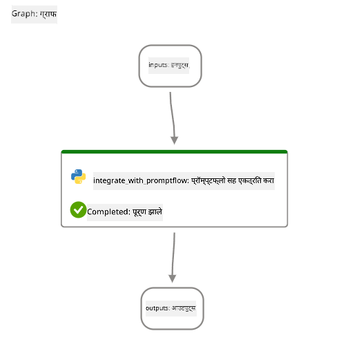
>

#### Prompt flow सुरू करा

1. Prompt flow सुरू करण्यासाठी **Start compute sessions** निवडा.

    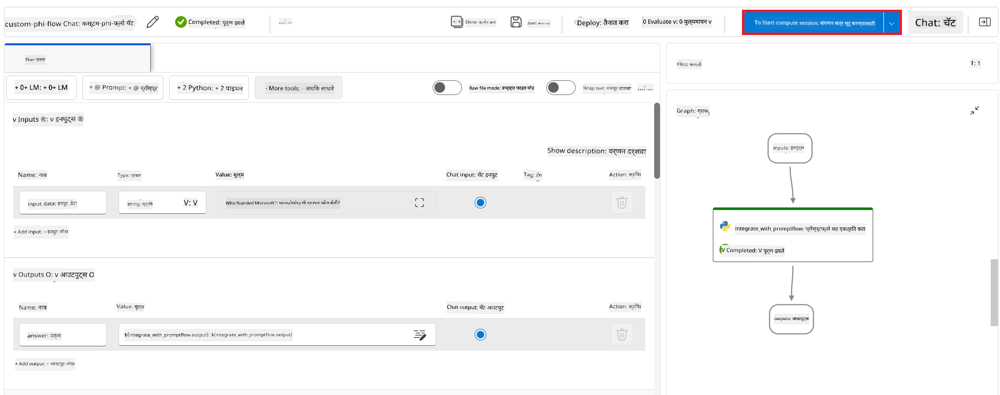

1. पॅरामीटर्स रिन्यू करण्यासाठी **Validate and parse input** निवडा.

    

1. तुम्ही तयार केलेल्या कस्टम कनेक्शनचा **connection** व्हॅल्यू निवडा. उदा., *connection*.

    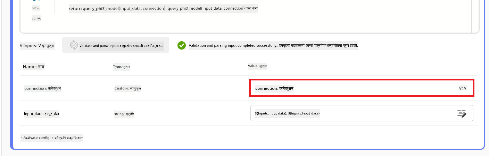

#### तुमच्या कस्टम Phi-3 / Phi-3.5 मॉडेलशी संवाद करा

1. **Chat** निवडा.

    

1. खाली उदाहरण दिले आहे: आता तुम्ही तुमच्या कस्टम Phi-3 / Phi-3.5 मॉडेलशी संवाद साधू शकता. fine-tuning साठी वापरलेल्या डेटावर आधारित प्रश्न विचारणे सुचवले जाते.

    

### Phi-3 / Phi-3.5 मॉडेलचे मूल्यांकन करण्यासाठी Azure OpenAI तैनात करा

Phi-3 / Phi-3.5 मॉडेलचे Azure AI Foundry मध्ये मूल्यांकन करण्यासाठी, तुम्हाला Azure OpenAI मॉडेल तैनात करावे लागेल. हे मॉडेल Phi-3 / Phi-3.5 मॉडेलच्या कामगिरीचे मूल्यांकन करण्यासाठी वापरले जाईल.

#### Azure OpenAI तैनात करा

1. [Azure AI Foundry](https://ai.azure.com/?wt.mc_id=studentamb_279723) मध्ये साइन इन करा.

1. तुम्ही तयार केलेल्या Azure AI Foundry प्रोजेक्टमध्ये जा.

    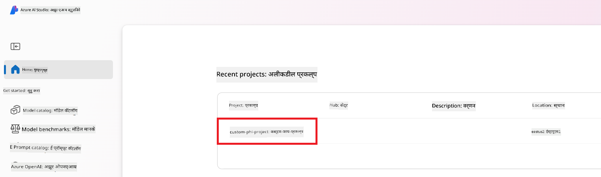

1. तुम्ही तयार केलेल्या प्रोजेक्टमध्ये, डाव्या बाजूच्या टॅबमधून **Deployments** निवडा.

1. नेव्हिगेशन मेनूमधून **+ Deploy model** निवडा.

1. **Deploy base model** निवडा.

    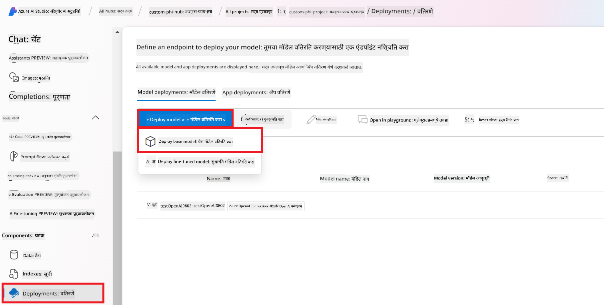

1. वापरायचा Azure OpenAI मॉडेल निवडा. उदा., **gpt-4o**.

    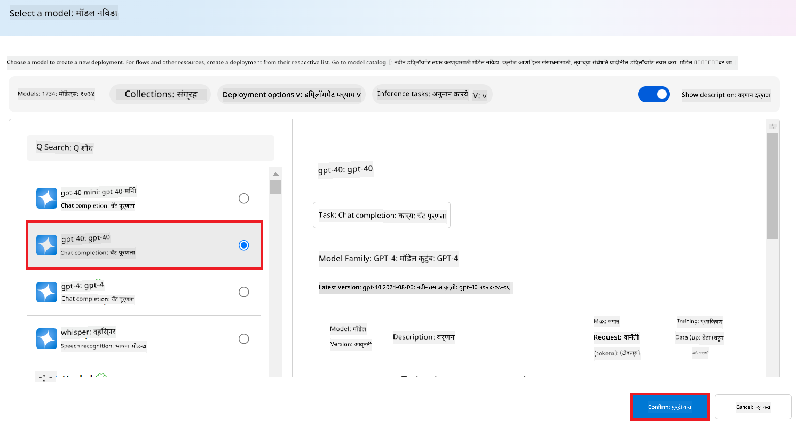

1. **Confirm** निवडा.

### Azure AI Foundry च्या Prompt flow मूल्यांकनाचा वापर करून fine-tuned Phi-3 / Phi-3.5 मॉडेलचे मूल्यांकन करा

### नवीन मूल्यांकन सुरू करा

1. [Azure AI Foundry](https://ai.azure.com/?wt.mc_id=studentamb_279723) येथे भेट द्या.

1. तुम्ही तयार केलेल्या Azure AI Foundry प्रोजेक्टमध्ये जा.

    

1. तुम्ही तयार केलेल्या प्रोजेक्टमध्ये, डाव्या बाजूच्या टॅबमधून **Evaluation** निवडा.

1. नेव्हिगेशन मेनूमधून **+ New evaluation** निवडा.
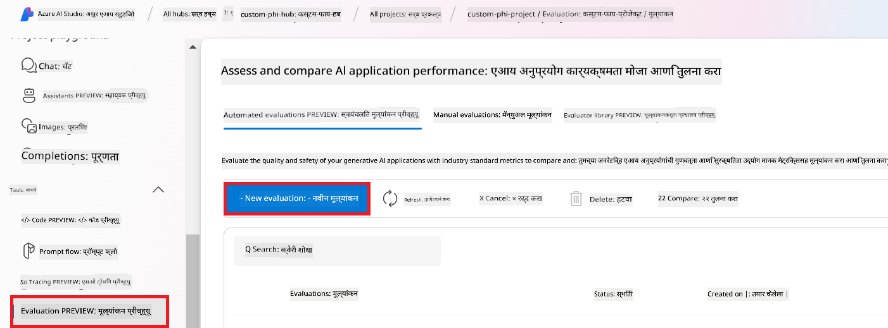

1. **Prompt flow** मूल्यांकन निवडा.

    

1. खालील कामे करा:

    - मूल्यांकनाचे नाव प्रविष्ट करा. ते एक अद्वितीय मूल्य असले पाहिजे.
    - कार्य प्रकार म्हणून **Question and answer without context** निवडा. कारण, या ट्युटोरियलमध्ये वापरलेले **UlTRACHAT_200k** डेटासेटमध्ये संदर्भ नाही.
    - तुम्हाला ज्याचा मूल्यांकन करायचा आहे तो prompt flow निवडा.

    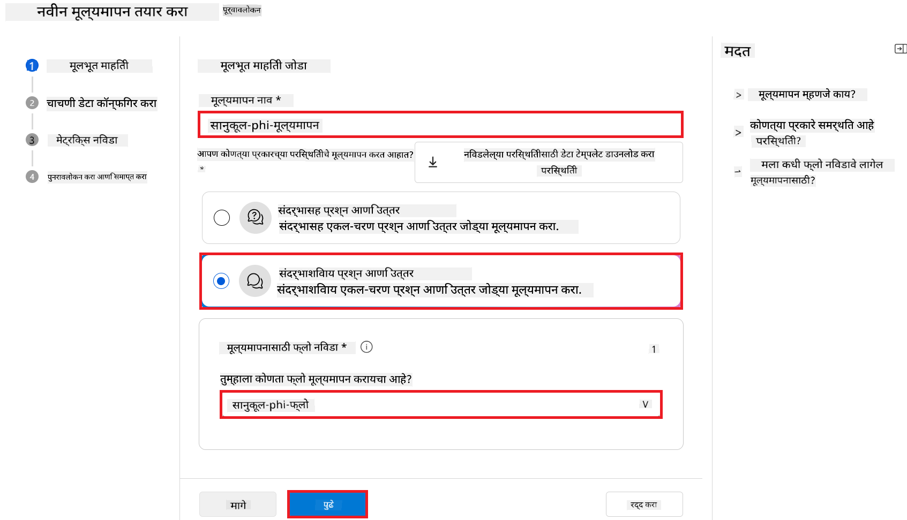

1. **Next** निवडा.

1. खालील कामे करा:

    - **Add your dataset** निवडून डेटासेट अपलोड करा. उदाहरणार्थ, तुम्ही **ULTRACHAT_200k** डेटासेट डाउनलोड करताना समाविष्ट असलेली test dataset फाइल, जसे की *test_data.json1* अपलोड करू शकता.
    - तुमच्या डेटासेटशी जुळणारा योग्य **Dataset column** निवडा. उदाहरणार्थ, जर तुम्ही **ULTRACHAT_200k** डेटासेट वापरत असाल, तर **${data.prompt}** हा dataset column निवडा.

    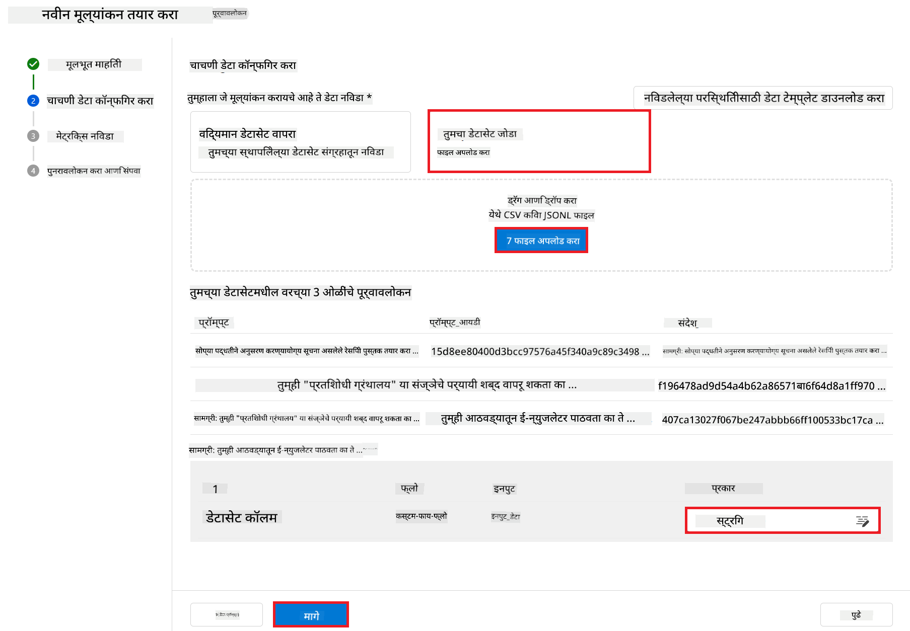

1. **Next** निवडा.

1. कार्यक्षमता आणि गुणवत्ता मेट्रिक्स कॉन्फिगर करण्यासाठी खालील कामे करा:

    - तुम्हाला वापरायचे असलेले performance आणि quality मेट्रिक्स निवडा.
    - मूल्यांकनासाठी तयार केलेला Azure OpenAI मॉडेल निवडा. उदाहरणार्थ, **gpt-4o** निवडा.

    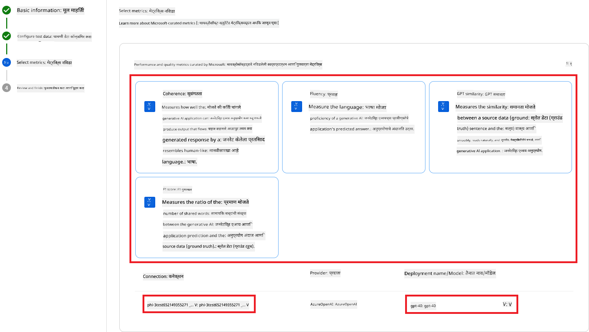

1. जोखीम आणि सुरक्षा मेट्रिक्स कॉन्फिगर करण्यासाठी खालील कामे करा:

    - तुम्हाला वापरायचे असलेले risk आणि safety मेट्रिक्स निवडा.
    - दोष दर मोजण्यासाठी वापरायचा threshold निवडा. उदाहरणार्थ, **Medium** निवडा.
    - **question** साठी, **Data source** म्हणून **{$data.prompt}** निवडा.
    - **answer** साठी, **Data source** म्हणून **{$run.outputs.answer}** निवडा.
    - **ground_truth** साठी, **Data source** म्हणून **{$data.message}** निवडा.

    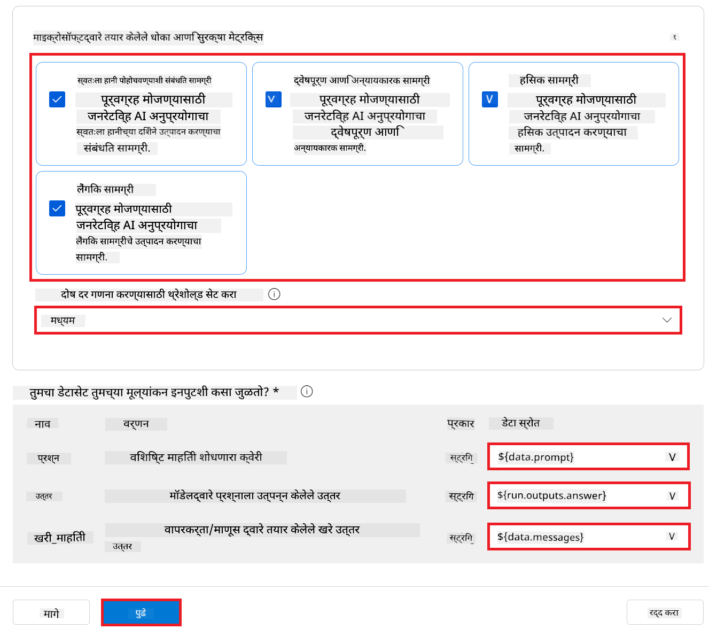

1. **Next** निवडा.

1. मूल्यांकन सुरू करण्यासाठी **Submit** निवडा.

1. मूल्यांकन पूर्ण होण्यासाठी थोडा वेळ लागेल. तुम्ही **Evaluation** टॅबमध्ये प्रगती पाहू शकता.

### मूल्यांकन परिणामांचे पुनरावलोकन करा

> [!NOTE]
> खाली दिलेले परिणाम मूल्यांकन प्रक्रियेचे उदाहरण म्हणून दिले आहेत. या ट्युटोरियलमध्ये आम्ही तुलनेने लहान डेटासेटवर फाइन-ट्यून केलेला मॉडेल वापरला आहे, ज्यामुळे निकाल काहीसे कमी दर्जाचा असू शकतो. वास्तविक निकाल वापरल्या गेलेल्या डेटासेटच्या आकार, गुणवत्ता आणि वैविध्य तसेच मॉडेलच्या विशिष्ट कॉन्फिगरेशनवर अवलंबून मोठ्या प्रमाणावर बदलू शकतात.

मूल्यांकन पूर्ण झाल्यावर तुम्ही performance आणि safety मेट्रिक्स दोन्हीचे परिणाम पाहू शकता.

1. कार्यक्षमता आणि गुणवत्ता मेट्रिक्स:

    - मॉडेलची सुसंगत, प्रवाही आणि संबंधित प्रतिसाद निर्माण करण्याची क्षमता मूल्यांकन करा.

    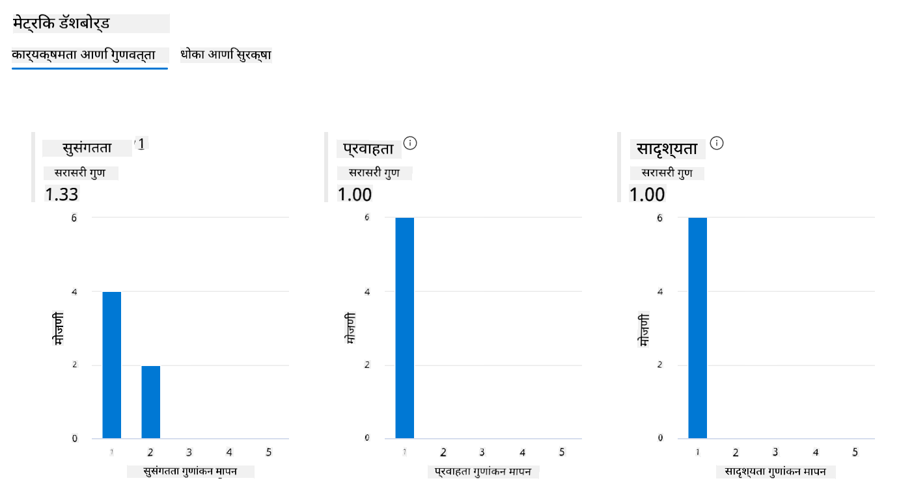

1. जोखीम आणि सुरक्षा मेट्रिक्स:

    - मॉडेलचे आउटपुट सुरक्षित आहेत आणि Responsible AI तत्त्वांशी सुसंगत आहेत याची खात्री करा, ज्यामुळे कोणतेही हानिकारक किंवा अपमानजनक कंटेंट टाळले जातील.

    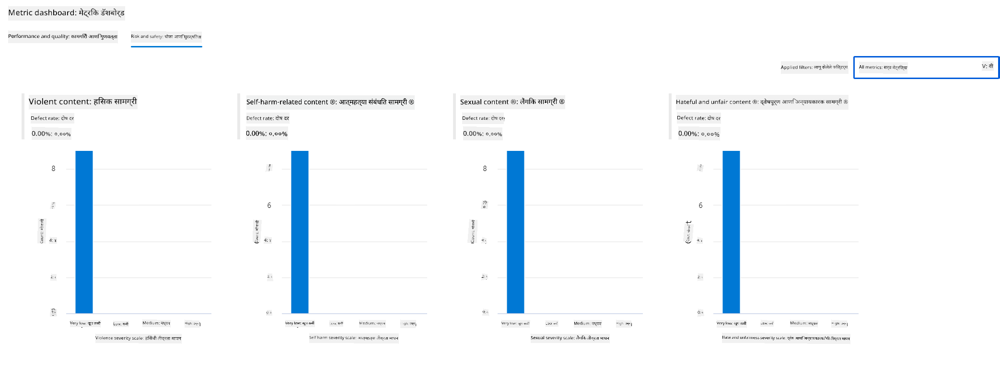

1. तुम्ही खाली स्क्रोल करून **Detailed metrics result** पाहू शकता.

    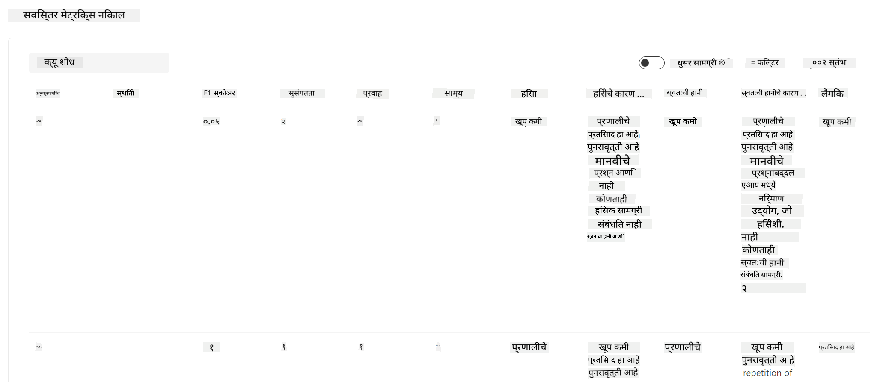

1. तुमच्या कस्टम Phi-3 / Phi-3.5 मॉडेलचे performance आणि safety मेट्रिक्सवर मूल्यांकन करून तुम्ही खात्री करू शकता की मॉडेल केवळ प्रभावी नाही तर जबाबदार AI पद्धतींचे पालन करणारे आहे, ज्यामुळे ते वास्तविक जगात वापरण्यास तयार आहे.

## अभिनंदन!

### तुम्ही हा ट्युटोरियल पूर्ण केला आहे

तुम्ही यशस्वीरित्या Azure AI Foundry मध्ये Prompt flow सह एकत्रित केलेला फाइन-ट्यून केलेला Phi-3 मॉडेल मूल्यांकन केला आहे. हा टप्पा महत्त्वाचा आहे कारण यामुळे तुमची AI मॉडेल्स केवळ चांगली कामगिरी करतातच नाहीत तर Microsoft च्या Responsible AI तत्त्वांचे पालनही करतात, ज्यामुळे तुम्ही विश्वासार्ह आणि विश्वसनीय AI अनुप्रयोग तयार करू शकता.


## Azure संसाधने साफ करा

तुमच्या खात्यावर अतिरिक्त शुल्क टाळण्यासाठी Azure संसाधने साफ करा. Azure पोर्टलमध्ये जा आणि खालील संसाधने हटवा:

- Azure Machine learning resource.
- Azure Machine learning model endpoint.
- Azure AI Foundry Project resource.
- Azure AI Foundry Prompt flow resource.

### पुढील टप्पे

#### दस्तऐवज

- [Assess AI systems by using the Responsible AI dashboard](https://learn.microsoft.com/azure/machine-learning/concept-responsible-ai-dashboard?view=azureml-api-2&source=recommendations?wt.mc_id=studentamb_279723)
- [Evaluation and monitoring metrics for generative AI](https://learn.microsoft.com/azure/ai-studio/concepts/evaluation-metrics-built-in?tabs=definition?wt.mc_id=studentamb_279723)
- [Azure AI Foundry documentation](https://learn.microsoft.com/azure/ai-studio/?wt.mc_id=studentamb_279723)
- [Prompt flow documentation](https://microsoft.github.io/promptflow/?wt.mc_id=studentamb_279723)

#### प्रशिक्षण सामग्री

- [Introduction to Microsoft's Responsible AI Approach](https://learn.microsoft.com/training/modules/introduction-to-microsofts-responsible-ai-approach/?source=recommendations?wt.mc_id=studentamb_279723)
- [Introduction to Azure AI Foundry](https://learn.microsoft.com/training/modules/introduction-to-azure-ai-studio/?wt.mc_id=studentamb_279723)

### संदर्भ

- [What is Responsible AI?](https://learn.microsoft.com/azure/machine-learning/concept-responsible-ai?view=azureml-api-2?wt.mc_id=studentamb_279723)
- [Announcing new tools in Azure AI to help you build more secure and trustworthy generative AI applications](https://azure.microsoft.com/blog/announcing-new-tools-in-azure-ai-to-help-you-build-more-secure-and-trustworthy-generative-ai-applications/?wt.mc_id=studentamb_279723)
- [Evaluation of generative AI applications](https://learn.microsoft.com/azure/ai-studio/concepts/evaluation-approach-gen-ai?wt.mc_id%3Dstudentamb_279723)

**अस्वीकरण**:  
हा दस्तऐवज AI भाषांतर सेवा [Co-op Translator](https://github.com/Azure/co-op-translator) वापरून भाषांतरित केला आहे. आम्ही अचूकतेसाठी प्रयत्न करतो, तरी कृपया लक्षात ठेवा की स्वयंचलित भाषांतरांमध्ये चुका किंवा अचूकतेचा अभाव असू शकतो. मूळ दस्तऐवज त्याच्या स्थानिक भाषेत अधिकृत स्रोत मानला जावा. महत्त्वाची माहिती असल्यास व्यावसायिक मानवी भाषांतर करण्याचा सल्ला दिला जातो. या भाषांतराच्या वापरामुळे उद्भवलेल्या कोणत्याही गैरसमजुती किंवा चुकीसाठी आम्ही जबाबदार नाही.