<!--
CO_OP_TRANSLATOR_METADATA:
{
  "original_hash": "80a853c08e4ee25ef9b4bfcedd8990da",
  "translation_date": "2025-07-16T23:29:50+00:00",
  "source_file": "md/02.Application/01.TextAndChat/Phi3/E2E_Phi-3-Evaluation_AIFoundry.md",
  "language_code": "mr"
}
-->
# Azure AI Foundry मध्ये Microsoft च्या जबाबदार AI तत्त्वांवर लक्ष केंद्रित करून Fine-tuned Phi-3 / Phi-3.5 मॉडेलचे मूल्यांकन करा

हा end-to-end (E2E) नमुना Microsoft Tech Community मधील "[Evaluate Fine-tuned Phi-3 / 3.5 Models in Azure AI Foundry Focusing on Microsoft's Responsible AI](https://techcommunity.microsoft.com/blog/educatordeveloperblog/evaluate-fine-tuned-phi-3--3-5-models-in-azure-ai-studio-focusing-on-microsofts-/4227850?WT.mc_id=aiml-137032-kinfeylo)" मार्गदर्शकावर आधारित आहे.

## आढावा

### Azure AI Foundry मध्ये Fine-tuned Phi-3 / Phi-3.5 मॉडेलची सुरक्षा आणि कार्यक्षमता कशी मूल्यांकन करू शकता?

मॉडेलचे fine-tuning केल्यावर कधी कधी अनपेक्षित किंवा नको असलेले प्रतिसाद येऊ शकतात. मॉडेल सुरक्षित आणि प्रभावी राहील याची खात्री करण्यासाठी, त्याच्या हानिकारक सामग्री निर्माण करण्याच्या शक्यता आणि अचूक, संबंधित आणि सुसंगत प्रतिसाद देण्याच्या क्षमतेचे मूल्यांकन करणे महत्त्वाचे आहे. या ट्युटोरियलमध्ये, आपण Azure AI Foundry मध्ये Prompt flow सह एकत्रित केलेल्या Fine-tuned Phi-3 / Phi-3.5 मॉडेलची सुरक्षा आणि कार्यक्षमता कशी मूल्यांकन करायची ते शिकाल.

Azure AI Foundry चा मूल्यांकन प्रक्रिया खालीलप्रमाणे आहे.

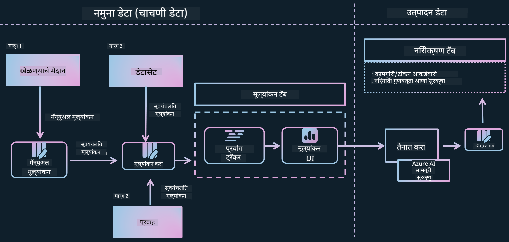

*प्रतिमा स्रोत: [Evaluation of generative AI applications](https://learn.microsoft.com/azure/ai-studio/concepts/evaluation-approach-gen-ai?wt.mc_id%3Dstudentamb_279723)*

> [!NOTE]
>
> Phi-3 / Phi-3.5 बद्दल अधिक सविस्तर माहिती आणि अतिरिक्त संसाधने पाहण्यासाठी कृपया [Phi-3CookBook](https://github.com/microsoft/Phi-3CookBook?wt.mc_id=studentamb_279723) भेट द्या.

### आवश्यक पूर्वतयारी

- [Python](https://www.python.org/downloads)
- [Azure subscription](https://azure.microsoft.com/free?wt.mc_id=studentamb_279723)
- [Visual Studio Code](https://code.visualstudio.com)
- Fine-tuned Phi-3 / Phi-3.5 मॉडेल

### अनुक्रमणिका

1. [**परिस्थिती 1: Azure AI Foundry च्या Prompt flow मूल्यांकनाची ओळख**](../../../../../../md/02.Application/01.TextAndChat/Phi3)

    - [सुरक्षा मूल्यांकनाची ओळख](../../../../../../md/02.Application/01.TextAndChat/Phi3)
    - [कार्यक्षमता मूल्यांकनाची ओळख](../../../../../../md/02.Application/01.TextAndChat/Phi3)

1. [**परिस्थिती 2: Azure AI Foundry मध्ये Phi-3 / Phi-3.5 मॉडेलचे मूल्यांकन**](../../../../../../md/02.Application/01.TextAndChat/Phi3)

    - [सुरू करण्यापूर्वी](../../../../../../md/02.Application/01.TextAndChat/Phi3)
    - [Phi-3 / Phi-3.5 मॉडेलचे मूल्यांकन करण्यासाठी Azure OpenAI तैनात करा](../../../../../../md/02.Application/01.TextAndChat/Phi3)
    - [Azure AI Foundry च्या Prompt flow मूल्यांकनाचा वापर करून Fine-tuned Phi-3 / Phi-3.5 मॉडेलचे मूल्यांकन करा](../../../../../../md/02.Application/01.TextAndChat/Phi3)

1. [अभिनंदन!](../../../../../../md/02.Application/01.TextAndChat/Phi3)

## **परिस्थिती 1: Azure AI Foundry च्या Prompt flow मूल्यांकनाची ओळख**

### सुरक्षा मूल्यांकनाची ओळख

आपले AI मॉडेल नैतिक आणि सुरक्षित आहे याची खात्री करण्यासाठी, Microsoft च्या जबाबदार AI तत्त्वांनुसार त्याचे मूल्यांकन करणे अत्यंत आवश्यक आहे. Azure AI Foundry मध्ये, सुरक्षा मूल्यांकन आपल्याला मॉडेलच्या jailbreak हल्ल्यांपासून असुरक्षिततेचे आणि हानिकारक सामग्री निर्माण करण्याच्या शक्यतेचे मूल्यांकन करण्याची परवानगी देते, जे थेट या तत्त्वांशी सुसंगत आहे.


*प्रतिमा स्रोत: [Evaluation of generative AI applications](https://learn.microsoft.com/azure/ai-studio/concepts/evaluation-approach-gen-ai?wt.mc_id%3Dstudentamb_279723)*

#### Microsoft चे जबाबदार AI तत्त्वे

तांत्रिक टप्पे सुरू करण्यापूर्वी, Microsoft च्या जबाबदार AI तत्त्वांची समज असणे आवश्यक आहे, जे AI प्रणालींच्या जबाबदार विकास, तैनाती आणि ऑपरेशनसाठी नैतिक चौकट प्रदान करतात. ही तत्त्वे AI प्रणालींच्या जबाबदार डिझाइन, विकास आणि तैनातीस मार्गदर्शन करतात, याची खात्री करतात की AI तंत्रज्ञान न्याय्य, पारदर्शक आणि सर्वसमावेशक पद्धतीने तयार केले जात आहे. ही तत्त्वे AI मॉडेलच्या सुरक्षिततेचे मूल्यांकन करण्यासाठी पाया आहेत.

Microsoft चे जबाबदार AI तत्त्वे यामध्ये समाविष्ट आहेत:

- **न्याय्य आणि सर्वसमावेशकता**: AI प्रणाली सर्वांना न्याय्य वागणूक द्यावीत आणि समान परिस्थितीत असलेल्या लोकांच्या गटांवर वेगवेगळ्या प्रकारे परिणाम होऊ नयेत. उदाहरणार्थ, जेव्हा AI प्रणाली वैद्यकीय उपचार, कर्ज अर्ज किंवा नोकरी संदर्भातील मार्गदर्शन करतात, तेव्हा त्यांना समान लक्षणे, आर्थिक परिस्थिती किंवा व्यावसायिक पात्रता असलेल्या सर्व लोकांना समान शिफारसी द्याव्यात.

- **विश्वसनीयता आणि सुरक्षा**: विश्वास निर्माण करण्यासाठी, AI प्रणाली विश्वसनीय, सुरक्षित आणि सातत्यपूर्णपणे कार्य करणे आवश्यक आहे. या प्रणालींनी जसे डिझाइन केले गेले तसे कार्य करणे, अनपेक्षित परिस्थितींना सुरक्षित प्रतिसाद देणे आणि हानिकारक हस्तक्षेपाला प्रतिबंध करणे आवश्यक आहे. त्यांचे वर्तन आणि ते हाताळू शकणाऱ्या परिस्थितींची विविधता डिझाइन आणि चाचणी दरम्यान विकसकांनी अपेक्षित केलेल्या परिस्थितींचे प्रतिबिंब आहे.

- **पारदर्शकता**: जेव्हा AI प्रणाली लोकांच्या जीवनावर मोठा परिणाम करणाऱ्या निर्णयांमध्ये मदत करतात, तेव्हा लोकांना हे समजणे आवश्यक आहे की ते निर्णय कसे घेतले गेले. उदाहरणार्थ, एखाद्या बँकेने एखाद्या व्यक्तीला क्रेडिट देण्याचा निर्णय घेण्यासाठी AI प्रणाली वापरली तर, किंवा एखाद्या कंपनीने सर्वात पात्र उमेदवार निवडण्यासाठी AI प्रणाली वापरली तर.

- **गोपनीयता आणि सुरक्षा**: AI अधिक प्रमाणात वापरात येत असल्याने, गोपनीयता संरक्षण आणि वैयक्तिक व व्यावसायिक माहितीची सुरक्षा अधिक महत्त्वाची आणि गुंतागुंतीची होत आहे. AI साठी डेटा प्रवेश आवश्यक असल्यामुळे गोपनीयता आणि डेटा सुरक्षा याकडे विशेष लक्ष देणे आवश्यक आहे, जेणेकरून AI प्रणाली लोकांबद्दल अचूक आणि माहितीपूर्ण अंदाज व निर्णय घेऊ शकतील.

- **जबाबदारी**: AI प्रणाली डिझाइन आणि तैनात करणाऱ्या लोकांनी त्यांच्या प्रणालींच्या कार्यप्रणालीसाठी जबाबदार असणे आवश्यक आहे. संस्था उद्योग मानकांचा आधार घेऊन जबाबदारीचे नियम विकसित करावेत. हे नियम सुनिश्चित करू शकतात की AI प्रणाली लोकांच्या जीवनावर परिणाम करणाऱ्या कोणत्याही निर्णयाचा अंतिम अधिकार नाहीत. तसेच, हे नियम मानवी नियंत्रण AI प्रणालींवर कायम राहील याची खात्री करतात.

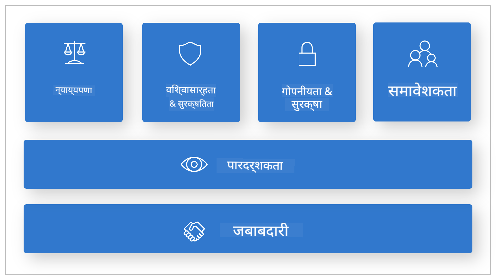

*प्रतिमा स्रोत: [What is Responsible AI?](https://learn.microsoft.com/azure/machine-learning/concept-responsible-ai?view=azureml-api-2&viewFallbackFrom=azureml-api-2%253fwt.mc_id%3Dstudentamb_279723)*

> [!NOTE]
> Microsoft च्या जबाबदार AI तत्त्वांबद्दल अधिक जाणून घेण्यासाठी, कृपया [What is Responsible AI?](https://learn.microsoft.com/azure/machine-learning/concept-responsible-ai?view=azureml-api-2?wt.mc_id=studentamb_279723) भेट द्या.

#### सुरक्षा मेट्रिक्स

या ट्युटोरियलमध्ये, आपण Azure AI Foundry च्या सुरक्षा मेट्रिक्सचा वापर करून Fine-tuned Phi-3 मॉडेलची सुरक्षा मूल्यांकन कराल. हे मेट्रिक्स मॉडेलच्या हानिकारक सामग्री निर्माण करण्याच्या शक्यता आणि jailbreak हल्ल्यांपासून असुरक्षिततेचे मूल्यांकन करण्यात मदत करतात. सुरक्षा मेट्रिक्समध्ये समाविष्ट आहे:

- **स्वतःला हानी पोहोचवण्याशी संबंधित सामग्री**: मॉडेलमध्ये स्वतःला हानी पोहोचवण्याशी संबंधित सामग्री निर्माण करण्याची प्रवृत्ती आहे का हे मूल्यांकन करते.
- **द्वेषपूर्ण आणि अन्यायकारक सामग्री**: मॉडेलमध्ये द्वेषपूर्ण किंवा अन्यायकारक सामग्री निर्माण करण्याची प्रवृत्ती आहे का हे मूल्यांकन करते.
- **हिंसात्मक सामग्री**: मॉडेलमध्ये हिंसात्मक सामग्री निर्माण करण्याची प्रवृत्ती आहे का हे मूल्यांकन करते.
- **लैंगिक सामग्री**: मॉडेलमध्ये अनुचित लैंगिक सामग्री निर्माण करण्याची प्रवृत्ती आहे का हे मूल्यांकन करते.

या पैलूंचे मूल्यांकन केल्याने AI मॉडेल हानिकारक किंवा अपमानास्पद सामग्री निर्माण करत नाही याची खात्री होते, जे सामाजिक मूल्ये आणि नियामक मानकांशी सुसंगत आहे.

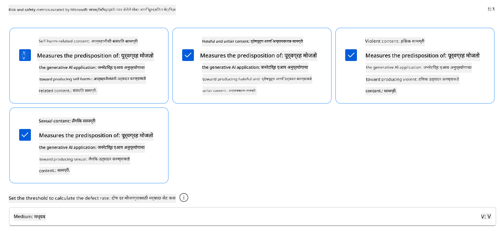

### कार्यक्षमता मूल्यांकनाची ओळख

आपले AI मॉडेल अपेक्षेनुसार कार्य करत आहे याची खात्री करण्यासाठी, त्याची कार्यक्षमता कार्यक्षमता मेट्रिक्सच्या आधारे मूल्यांकन करणे महत्त्वाचे आहे. Azure AI Foundry मध्ये, कार्यक्षमता मूल्यांकन आपल्याला मॉडेलच्या अचूक, संबंधित आणि सुसंगत प्रतिसाद निर्माण करण्याच्या कार्यक्षमतेचे मूल्यांकन करण्याची परवानगी देते.


*प्रतिमा स्रोत: [Evaluation of generative AI applications](https://learn.microsoft.com/azure/ai-studio/concepts/evaluation-approach-gen-ai?wt.mc_id%3Dstudentamb_279723)*

#### कार्यक्षमता मेट्रिक्स

या ट्युटोरियलमध्ये, आपण Azure AI Foundry च्या कार्यक्षमता मेट्रिक्सचा वापर करून Fine-tuned Phi-3 / Phi-3.5 मॉडेलची कार्यक्षमता मूल्यांकन कराल. हे मेट्रिक्स मॉडेलच्या अचूक, संबंधित आणि सुसंगत प्रतिसाद निर्माण करण्याच्या कार्यक्षमतेचे मूल्यांकन करण्यात मदत करतात. कार्यक्षमता मेट्रिक्समध्ये समाविष्ट आहे:

- **Groundedness**: तयार केलेले उत्तर इनपुट स्रोतातील माहितीशी किती जुळते हे मूल्यांकन करा.
- **Relevance**: दिलेल्या प्रश्नांसाठी तयार केलेल्या प्रतिसादांची सुसंगतता मूल्यांकन करा.
- **Coherence**: तयार केलेला मजकूर किती सुरळीत, नैसर्गिक वाचनीय आणि मानवी भाषेसारखा आहे हे मूल्यांकन करा.
- **Fluency**: तयार केलेल्या मजकुराची भाषिक प्रावीण्यता मूल्यांकन करा.
- **GPT Similarity**: तयार केलेल्या प्रतिसादाची मूळ सत्याशी सादृश्यता तपासा.
- **F1 Score**: तयार केलेल्या प्रतिसाद आणि स्रोत डेटामधील सामायिक शब्दांचे प्रमाण मोजा.

हे मेट्रिक्स आपल्याला मॉडेलच्या अचूक, संबंधित आणि सुसंगत प्रतिसाद निर्माण करण्याच्या कार्यक्षमतेचे मूल्यांकन करण्यात मदत करतात.

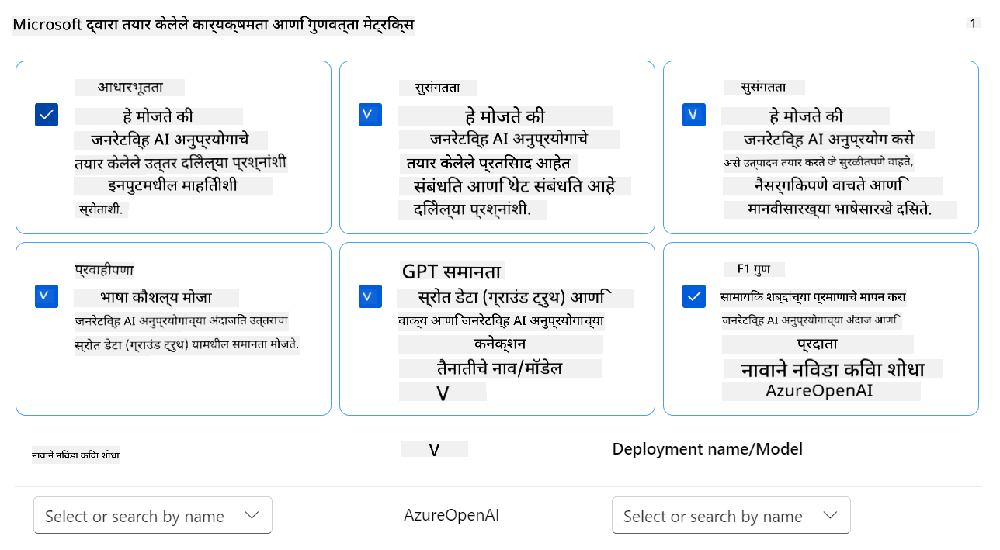

## **परिस्थिती 2: Azure AI Foundry मध्ये Phi-3 / Phi-3.5 मॉडेलचे मूल्यांकन**

### सुरू करण्यापूर्वी

हा ट्युटोरियल मागील ब्लॉग पोस्ट्स "[Fine-Tune and Integrate Custom Phi-3 Models with Prompt Flow: Step-by-Step Guide](https://techcommunity.microsoft.com/t5/educator-developer-blog/fine-tune-and-integrate-custom-phi-3-models-with-prompt-flow/ba-p/4178612?wt.mc_id=studentamb_279723)" आणि "[Fine-Tune and Integrate Custom Phi-3 Models with Prompt Flow in Azure AI Foundry](https://techcommunity.microsoft.com/t5/educator-developer-blog/fine-tune-and-integrate-custom-phi-3-models-with-prompt-flow-in/ba-p/4191726?wt.mc_id=studentamb_279723)" यांचा पुढील भाग आहे. या पोस्ट्समध्ये, आपण Azure AI Foundry मध्ये Phi-3 / Phi-3.5 मॉडेलचे fine-tuning कसे करायचे आणि ते Prompt flow सह कसे एकत्रित करायचे हे पाहिले.

या ट्युटोरियलमध्ये, आपण Azure AI Foundry मध्ये Azure OpenAI मॉडेल एक मूल्यांकनकर्ता म्हणून तैनात कराल आणि त्याचा वापर करून आपले Fine-tuned Phi-3 / Phi-3.5 मॉडेलचे मूल्यांकन कराल.

हा ट्युटोरियल सुरू करण्यापूर्वी, मागील ट्युटोरियलमध्ये वर्णन केलेल्या खालील पूर्वतयारी पूर्ण असल्याची खात्री करा:

1. Fine-tuned Phi-3 / Phi-3.5 मॉडेलचे मूल्यांकन करण्यासाठी तयार केलेला डेटासेट.
2. Azure Machine Learning मध्ये fine-tuned आणि तैनात केलेले Phi-3 / Phi-3.5 मॉडेल.
3. Azure AI Foundry मध्ये आपल्या fine-tuned Phi-3 / Phi-3.5 मॉडेलसह एकत्रित केलेला Prompt flow.

> [!NOTE]
> आपण मागील ब्लॉग पोस्ट्समध्ये डाउनलोड केलेल्या **ULTRACHAT_200k** डेटासेटमधील data फोल्डरमधील *test_data.jsonl* फाइलचा वापर Fine-tuned Phi-3 / Phi-3.5 मॉडेलचे मूल्यांकन करण्यासाठी डेटासेट म्हणून कराल.

#### Azure AI Foundry मध्ये Prompt flow सह कस्टम Phi-3 / Phi-3.5 मॉडेल एकत्रित करा (कोड प्रथम पद्धत)
> [!NOTE]
> जर तुम्ही "[Fine-Tune and Integrate Custom Phi-3 Models with Prompt Flow in Azure AI Foundry](https://techcommunity.microsoft.com/t5/educator-developer-blog/fine-tune-and-integrate-custom-phi-3-models-with-prompt-flow-in/ba-p/4191726?wt.mc_id=studentamb_279723)" मध्ये वर्णन केलेला लो-कोड दृष्टिकोन वापरला असेल, तर तुम्ही हा सराव वगळून पुढील सरावाकडे जाऊ शकता.
> मात्र, जर तुम्ही "[Fine-Tune and Integrate Custom Phi-3 Models with Prompt Flow: Step-by-Step Guide](https://techcommunity.microsoft.com/t5/educator-developer-blog/fine-tune-and-integrate-custom-phi-3-models-with-prompt-flow/ba-p/4178612?wt.mc_id=studentamb_279723)" मध्ये वर्णन केलेला कोड-फर्स्ट दृष्टिकोन वापरून तुमचा Phi-3 / Phi-3.5 मॉडेल फाइन-ट्यून आणि डिप्लॉय केला असेल, तर तुमच्या मॉडेलला Prompt flow शी जोडण्याची प्रक्रिया थोडी वेगळी आहे. तुम्हाला हा प्रक्रिया या सरावात शिकवली जाईल.
प्रगती करण्यासाठी, तुम्हाला तुमचा फाइन-ट्यून केलेला Phi-3 / Phi-3.5 मॉडेल Azure AI Foundry मधील Prompt flow मध्ये एकत्रित करावा लागेल.

#### Azure AI Foundry हब तयार करा

प्रोजेक्ट तयार करण्यापूर्वी तुम्हाला हब तयार करावा लागेल. हब हा Resource Group सारखा असतो, जो तुम्हाला Azure AI Foundry मध्ये अनेक प्रोजेक्ट्सचे आयोजन आणि व्यवस्थापन करण्यास मदत करतो.

1. [Azure AI Foundry](https://ai.azure.com/?wt.mc_id=studentamb_279723) मध्ये साइन इन करा.

1. डाव्या बाजूच्या टॅबमधून **All hubs** निवडा.

1. नेव्हिगेशन मेनूमधून **+ New hub** निवडा.

    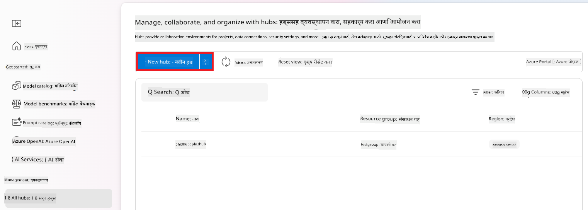

1. खालील कामे करा:

    - **Hub name** टाका. हा नाव अनन्य असावा.
    - तुमची Azure **Subscription** निवडा.
    - वापरण्यासाठी **Resource group** निवडा (गरज असल्यास नवीन तयार करा).
    - वापरायची **Location** निवडा.
    - वापरण्यासाठी **Connect Azure AI Services** निवडा (गरज असल्यास नवीन तयार करा).
    - **Connect Azure AI Search** साठी **Skip connecting** निवडा.

    

1. **Next** निवडा.

#### Azure AI Foundry प्रोजेक्ट तयार करा

1. तुम्ही तयार केलेल्या हबमध्ये, डाव्या बाजूच्या टॅबमधून **All projects** निवडा.

1. नेव्हिगेशन मेनूमधून **+ New project** निवडा.

    

1. **Project name** टाका. हे नाव अनन्य असावे.

    

1. **Create a project** निवडा.

#### फाइन-ट्यून केलेल्या Phi-3 / Phi-3.5 मॉडेलसाठी कस्टम कनेक्शन जोडा

तुमचा कस्टम Phi-3 / Phi-3.5 मॉडेल Prompt flow मध्ये एकत्रित करण्यासाठी, तुम्हाला मॉडेलचा endpoint आणि key कस्टम कनेक्शनमध्ये जतन करावा लागेल. या सेटअपमुळे Prompt flow मध्ये तुमच्या कस्टम मॉडेलचा प्रवेश सुनिश्चित होतो.

#### फाइन-ट्यून केलेल्या Phi-3 / Phi-3.5 मॉडेलचा api key आणि endpoint uri सेट करा

1. [Azure ML Studio](https://ml.azure.com/home?wt.mc_id=studentamb_279723) ला भेट द्या.

1. तुम्ही तयार केलेल्या Azure Machine learning workspace मध्ये जा.

1. डाव्या बाजूच्या टॅबमधून **Endpoints** निवडा.

    

1. तुम्ही तयार केलेला endpoint निवडा.

    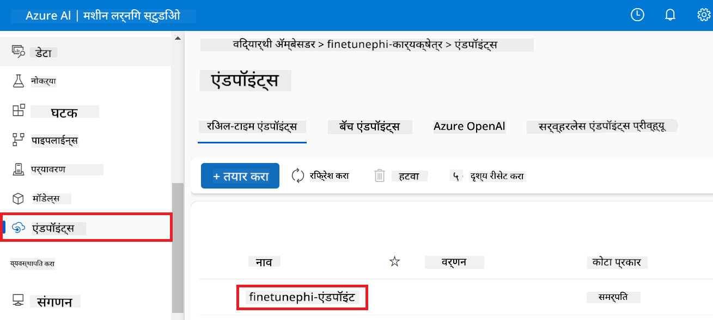

1. नेव्हिगेशन मेनूमधून **Consume** निवडा.

1. तुमचा **REST endpoint** आणि **Primary key** कॉपी करा.

    

#### कस्टम कनेक्शन जोडा

1. [Azure AI Foundry](https://ai.azure.com/?wt.mc_id=studentamb_279723) ला भेट द्या.

1. तुम्ही तयार केलेल्या Azure AI Foundry प्रोजेक्टमध्ये जा.

1. तयार केलेल्या प्रोजेक्टमध्ये, डाव्या बाजूच्या टॅबमधून **Settings** निवडा.

1. **+ New connection** निवडा.

    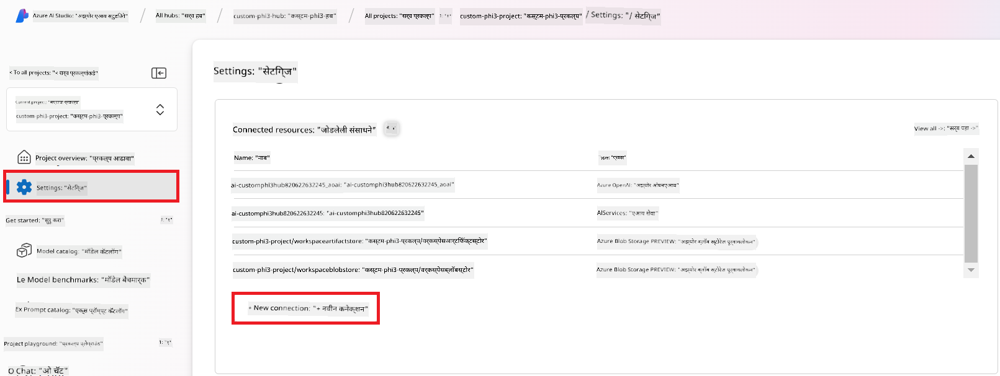

1. नेव्हिगेशन मेनूमधून **Custom keys** निवडा.

    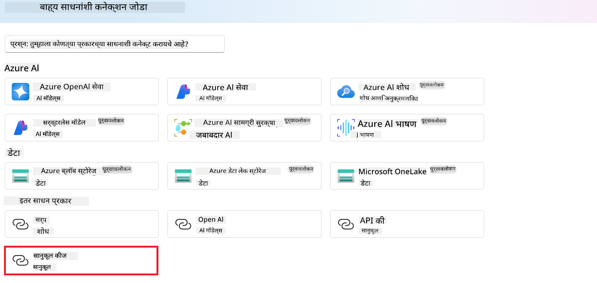

1. खालील कामे करा:

    - **+ Add key value pairs** निवडा.
    - key name साठी **endpoint** टाका आणि Azure ML Studio मधून कॉपी केलेला endpoint value field मध्ये पेस्ट करा.
    - पुन्हा **+ Add key value pairs** निवडा.
    - key name साठी **key** टाका आणि Azure ML Studio मधून कॉपी केलेला key value field मध्ये पेस्ट करा.
    - keys जोडल्यावर, key उघड होऊ नये म्हणून **is secret** निवडा.

    

1. **Add connection** निवडा.

#### Prompt flow तयार करा

तुम्ही Azure AI Foundry मध्ये कस्टम कनेक्शन जोडले आहे. आता खालील टप्प्यांद्वारे Prompt flow तयार करूया. नंतर, तुम्ही या Prompt flow ला कस्टम कनेक्शनशी जोडून फाइन-ट्यून केलेला मॉडेल Prompt flow मध्ये वापरू शकता.

1. तुम्ही तयार केलेल्या Azure AI Foundry प्रोजेक्टमध्ये जा.

1. डाव्या बाजूच्या टॅबमधून **Prompt flow** निवडा.

1. नेव्हिगेशन मेनूमधून **+ Create** निवडा.

    

1. नेव्हिगेशन मेनूमधून **Chat flow** निवडा.

    

1. वापरण्यासाठी **Folder name** टाका.

    

1. **Create** निवडा.

#### तुमच्या कस्टम Phi-3 / Phi-3.5 मॉडेलसह Prompt flow सेट करा

तुम्हाला फाइन-ट्यून केलेला Phi-3 / Phi-3.5 मॉडेल Prompt flow मध्ये एकत्रित करावा लागेल. मात्र, सध्याचा उपलब्ध Prompt flow यासाठी तयार केलेला नाही. त्यामुळे, तुम्हाला Prompt flow पुन्हा डिझाइन करावा लागेल जेणेकरून कस्टम मॉडेलची एकत्रिती शक्य होईल.

1. Prompt flow मध्ये, विद्यमान flow पुन्हा तयार करण्यासाठी खालील कामे करा:

    - **Raw file mode** निवडा.
    - *flow.dag.yml* फाईलमधील सर्व विद्यमान कोड हटवा.
    - *flow.dag.yml* मध्ये खालील कोड जोडा.

        ```yml
        inputs:
          input_data:
            type: string
            default: "Who founded Microsoft?"

        outputs:
          answer:
            type: string
            reference: ${integrate_with_promptflow.output}

        nodes:
        - name: integrate_with_promptflow
          type: python
          source:
            type: code
            path: integrate_with_promptflow.py
          inputs:
            input_data: ${inputs.input_data}
        ```

    - **Save** निवडा.

    

1. Prompt flow मध्ये कस्टम Phi-3 / Phi-3.5 मॉडेल वापरण्यासाठी *integrate_with_promptflow.py* मध्ये खालील कोड जोडा.

    ```python
    import logging
    import requests
    from promptflow import tool
    from promptflow.connections import CustomConnection

    # Logging setup
    logging.basicConfig(
        format="%(asctime)s - %(levelname)s - %(name)s - %(message)s",
        datefmt="%Y-%m-%d %H:%M:%S",
        level=logging.DEBUG
    )
    logger = logging.getLogger(__name__)

    def query_phi3_model(input_data: str, connection: CustomConnection) -> str:
        """
        Send a request to the Phi-3 / Phi-3.5 model endpoint with the given input data using Custom Connection.
        """

        # "connection" is the name of the Custom Connection, "endpoint", "key" are the keys in the Custom Connection
        endpoint_url = connection.endpoint
        api_key = connection.key

        headers = {
            "Content-Type": "application/json",
            "Authorization": f"Bearer {api_key}"
        }
    data = {
        "input_data": [input_data],
        "params": {
            "temperature": 0.7,
            "max_new_tokens": 128,
            "do_sample": True,
            "return_full_text": True
            }
        }
        try:
            response = requests.post(endpoint_url, json=data, headers=headers)
            response.raise_for_status()
            
            # Log the full JSON response
            logger.debug(f"Full JSON response: {response.json()}")

            result = response.json()["output"]
            logger.info("Successfully received response from Azure ML Endpoint.")
            return result
        except requests.exceptions.RequestException as e:
            logger.error(f"Error querying Azure ML Endpoint: {e}")
            raise

    @tool
    def my_python_tool(input_data: str, connection: CustomConnection) -> str:
        """
        Tool function to process input data and query the Phi-3 / Phi-3.5 model.
        """
        return query_phi3_model(input_data, connection)

    ```

    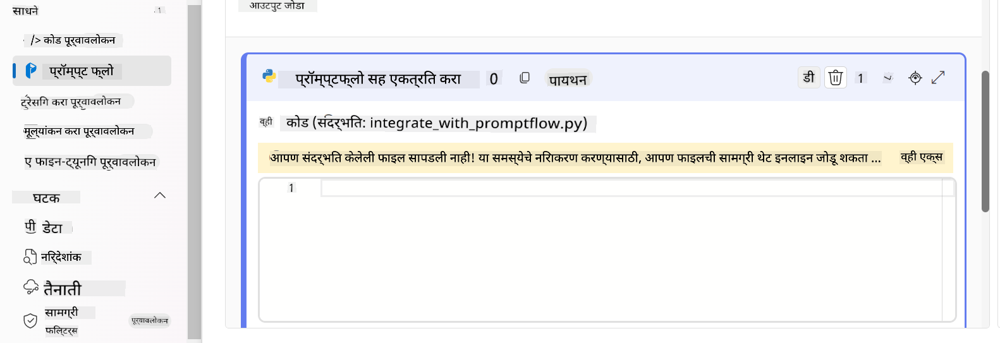

> [!NOTE]
> Azure AI Foundry मध्ये Prompt flow वापरण्याबाबत अधिक सविस्तर माहितीकरिता, तुम्ही [Prompt flow in Azure AI Foundry](https://learn.microsoft.com/azure/ai-studio/how-to/prompt-flow) पाहू शकता.

1. **Chat input**, **Chat output** निवडा जेणेकरून तुमच्या मॉडेलशी चॅट करता येईल.

    

1. आता तुम्ही तुमच्या कस्टम Phi-3 / Phi-3.5 मॉडेलशी चॅट करण्यास तयार आहात. पुढील व्यायामात, तुम्ही Prompt flow कसे सुरू करायचे आणि फाइन-ट्यून केलेल्या Phi-3 / Phi-3.5 मॉडेलशी कसे चॅट करायचे हे शिकाल.

> [!NOTE]
>
> पुन्हा तयार केलेला flow खालील चित्रासारखा दिसायला हवा:
>
> 
>

#### Prompt flow सुरू करा

1. Prompt flow सुरू करण्यासाठी **Start compute sessions** निवडा.

    

1. पॅरामीटर्स रिन्यू करण्यासाठी **Validate and parse input** निवडा.

    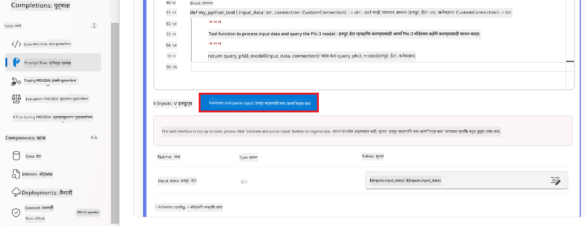

1. तुम्ही तयार केलेल्या कस्टम कनेक्शनचा **connection** चा **Value** निवडा. उदाहरणार्थ, *connection*.

    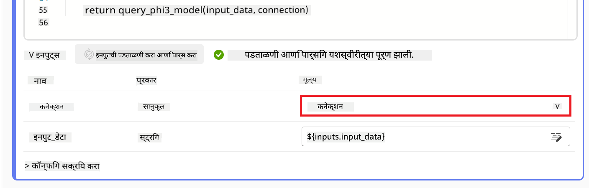

#### तुमच्या कस्टम Phi-3 / Phi-3.5 मॉडेलशी चॅट करा

1. **Chat** निवडा.

    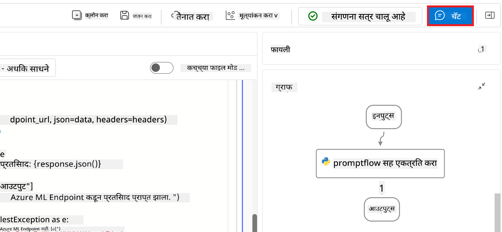

1. खाली परिणामांचे उदाहरण आहे: आता तुम्ही तुमच्या कस्टम Phi-3 / Phi-3.5 मॉडेलशी चॅट करू शकता. फाइन-ट्यूनिंगसाठी वापरलेल्या डेटावर आधारित प्रश्न विचारणे शिफारसीय आहे.

    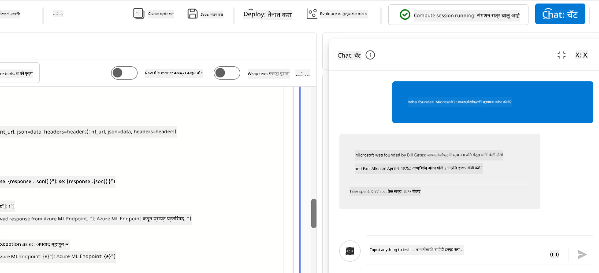

### Phi-3 / Phi-3.5 मॉडेलचे मूल्यमापन करण्यासाठी Azure OpenAI तैनात करा

Phi-3 / Phi-3.5 मॉडेलचे Azure AI Foundry मध्ये मूल्यमापन करण्यासाठी, तुम्हाला Azure OpenAI मॉडेल तैनात करावे लागेल. हा मॉडेल Phi-3 / Phi-3.5 मॉडेलच्या कामगिरीचे मूल्यमापन करण्यासाठी वापरला जाईल.

#### Azure OpenAI तैनात करा

1. [Azure AI Foundry](https://ai.azure.com/?wt.mc_id=studentamb_279723) मध्ये साइन इन करा.

1. तुम्ही तयार केलेल्या Azure AI Foundry प्रोजेक्टमध्ये जा.

    

1. तयार केलेल्या प्रोजेक्टमध्ये, डाव्या बाजूच्या टॅबमधून **Deployments** निवडा.

1. नेव्हिगेशन मेनूमधून **+ Deploy model** निवडा.

1. **Deploy base model** निवडा.

    

1. वापरायचा Azure OpenAI मॉडेल निवडा. उदाहरणार्थ, **gpt-4o**.

    

1. **Confirm** निवडा.

### Azure AI Foundry च्या Prompt flow मूल्यमापनाचा वापर करून फाइन-ट्यून केलेल्या Phi-3 / Phi-3.5 मॉडेलचे मूल्यमापन करा

### नवीन मूल्यमापन सुरू करा

1. [Azure AI Foundry](https://ai.azure.com/?wt.mc_id=studentamb_279723) ला भेट द्या.

1. तुम्ही तयार केलेल्या Azure AI Foundry प्रोजेक्टमध्ये जा.

    

1. तयार केलेल्या प्रोजेक्टमध्ये, डाव्या बाजूच्या टॅबमधून **Evaluation** निवडा.

1. नेव्हिगेशन मेनूमधून **+ New evaluation** निवडा.

    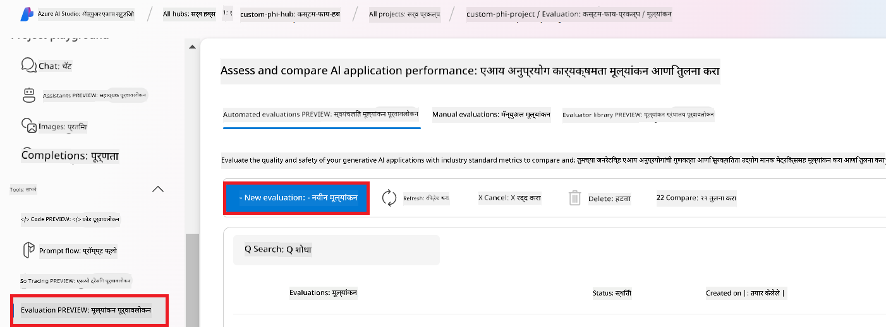

1. **Prompt flow** evaluation निवडा.

    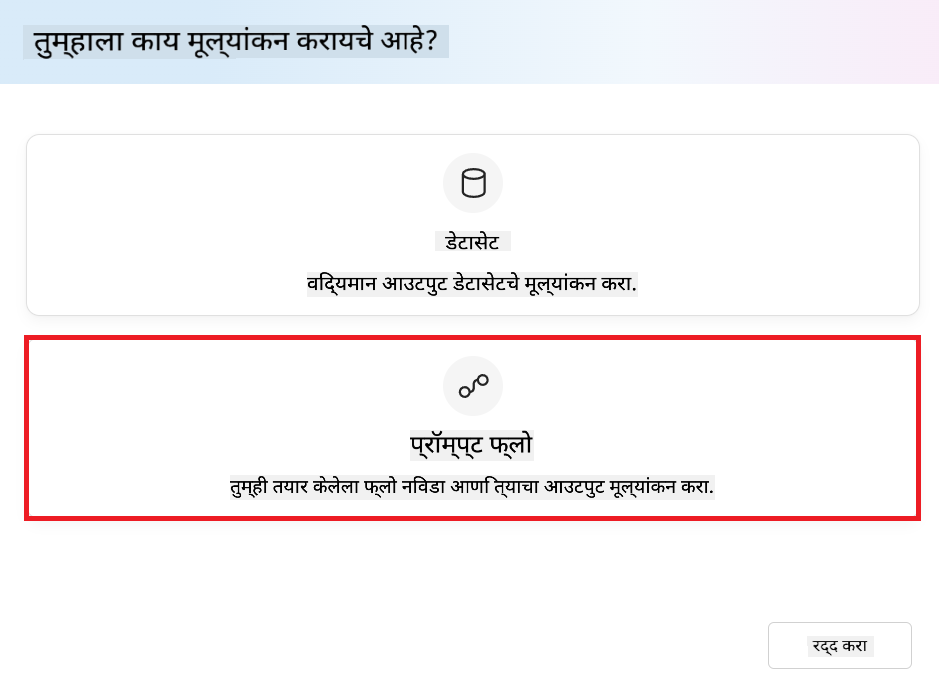

1. खालील कामे करा:

    - evaluation नाव टाका. हे नाव अनन्य असावे.
    - task type म्हणून **Question and answer without context** निवडा. कारण, या ट्युटोरियलमध्ये वापरलेला **UlTRACHAT_200k** dataset मध्ये context नाही.
    - तुम्हाला मूल्यमापन करायचा असलेला prompt flow निवडा.

    

1. **Next** निवडा.

1. खालील कामे करा:

    - dataset अपलोड करण्यासाठी **Add your dataset** निवडा. उदाहरणार्थ, तुम्ही **ULTRACHAT_200k** dataset डाउनलोड करताना मिळालेला *test_data.json1* फाइल अपलोड करू शकता.
    - dataset शी जुळणारा योग्य **Dataset column** निवडा. उदाहरणार्थ, **ULTRACHAT_200k** dataset वापरत असल्यास, **${data.prompt}** निवडा.

    

1. **Next** निवडा.

1. कामगिरी आणि गुणवत्ता मेट्रिक्स कॉन्फिगर करण्यासाठी खालील कामे करा:

    - वापरायचे कामगिरी आणि गुणवत्ता मेट्रिक्स निवडा.
    - मूल्यमापनासाठी तुम्ही तयार केलेला Azure OpenAI मॉडेल निवडा. उदाहरणार्थ, **gpt-4o**.

    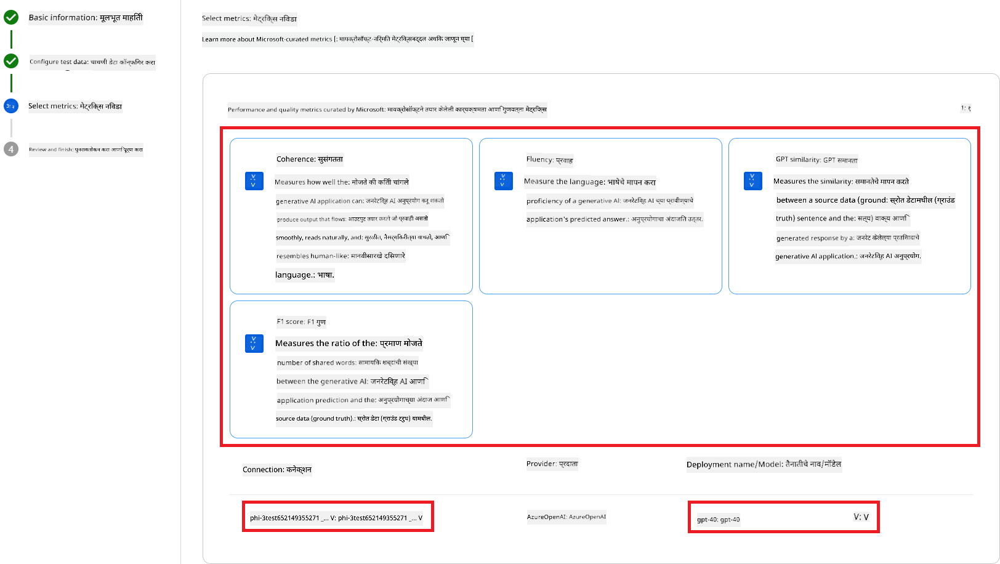

1. धोका आणि सुरक्षा मेट्रिक्स कॉन्फिगर करण्यासाठी खालील कामे करा:

    - वापरायचे धोका आणि सुरक्षा मेट्रिक्स निवडा.
    - दोष दर मोजण्यासाठी वापरायचा थ्रेशोल्ड निवडा. उदाहरणार्थ, **Medium**.
    - **question** साठी **Data source** म्हणून **{$data.prompt}** निवडा.
    - **answer** साठी **Data source** म्हणून **{$run.outputs.answer}** निवडा.
    - **ground_truth** साठी **Data source** म्हणून **{$data.message}** निवडा.

    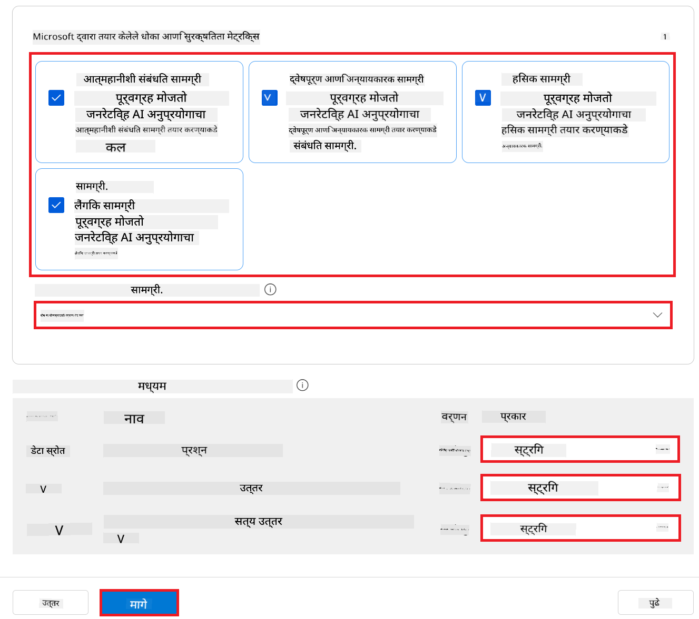

1. **Next** निवडा.

1. मूल्यमापन सुरू करण्यासाठी **Submit** निवडा.

1. मूल्यमापन पूर्ण होण्यासाठी काही वेळ लागू शकतो. तुम्ही प्रगती **Evaluation** टॅबमध्ये पाहू शकता.

### मूल्यमापनाचे निकाल तपासा
> [!NOTE]
> खाली दिलेले निकाल मूल्यांकन प्रक्रियेचे स्पष्टीकरण करण्यासाठी आहेत. या ट्युटोरियलमध्ये, आम्ही तुलनेने लहान डेटासेटवर फाइन-ट्यून केलेला मॉडेल वापरला आहे, ज्यामुळे निकाल काहीसे कमी दर्जाचे असू शकतात. वास्तविक निकाल वापरलेल्या डेटासेटच्या आकार, गुणवत्ता आणि विविधतेनुसार तसेच मॉडेलच्या विशिष्ट कॉन्फिगरेशननुसार लक्षणीय फरक पडू शकतो.
एकदा मूल्यांकन पूर्ण झाल्यावर, तुम्ही कामगिरी आणि सुरक्षितता मेट्रिक्स दोन्हींचे निकाल पाहू शकता.

1. कामगिरी आणि गुणवत्ता मेट्रिक्स:

    - मॉडेलच्या सुसंगत, प्रवाही आणि संबंधित प्रतिसाद तयार करण्याच्या कार्यक्षमतेचे मूल्यांकन करा.

    

1. धोका आणि सुरक्षितता मेट्रिक्स:

    - मॉडेलच्या आउटपुट्स सुरक्षित आहेत आणि जबाबदार AI तत्त्वांशी सुसंगत आहेत याची खात्री करा, कोणताही हानिकारक किंवा अपमानास्पद सामग्री टाळा.

    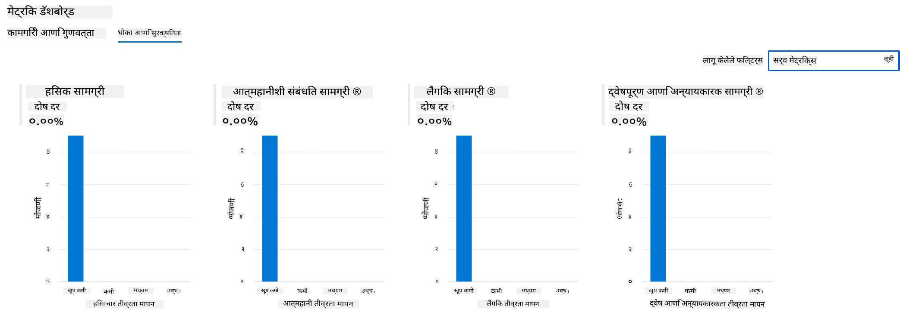

1. तुम्ही खाली स्क्रोल करून **तपशीलवार मेट्रिक्स निकाल** पाहू शकता.

    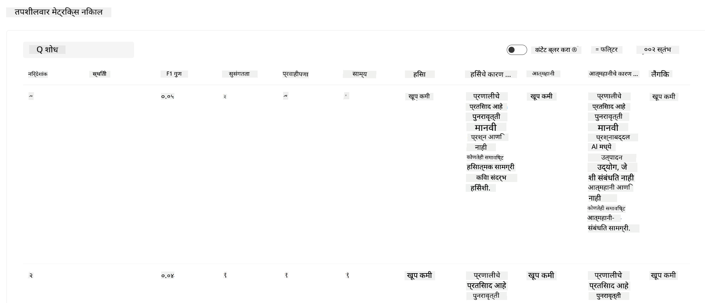

1. तुमच्या कस्टम Phi-3 / Phi-3.5 मॉडेलचे कामगिरी आणि सुरक्षितता मेट्रिक्स दोन्हींच्या आधारावर मूल्यांकन करून, तुम्ही खात्री करू शकता की मॉडेल केवळ प्रभावी नाही तर जबाबदार AI पद्धतींचे पालन करते, ज्यामुळे ते प्रत्यक्ष वापरासाठी तयार आहे.

## अभिनंदन!

### तुम्ही हा ट्युटोरियल पूर्ण केला आहे

तुम्ही यशस्वीपणे Azure AI Foundry मध्ये Prompt flow सह एकत्रित केलेले fine-tuned Phi-3 मॉडेलचे मूल्यांकन केले आहे. हा एक महत्त्वाचा टप्पा आहे ज्यामुळे तुमची AI मॉडेल्स केवळ चांगली कामगिरी करत नाहीत तर Microsoft च्या जबाबदार AI तत्त्वांचे पालन करतात, ज्यामुळे तुम्हाला विश्वासार्ह आणि विश्वसनीय AI अनुप्रयोग तयार करता येतात.


## Azure संसाधने साफ करा

तुमच्या खात्यावर अतिरिक्त शुल्क टाळण्यासाठी Azure संसाधने साफ करा. Azure पोर्टलवर जा आणि खालील संसाधने हटवा:

- Azure Machine learning संसाधन.
- Azure Machine learning मॉडेल एंडपॉइंट.
- Azure AI Foundry प्रोजेक्ट संसाधन.
- Azure AI Foundry Prompt flow संसाधन.

### पुढील पावले

#### दस्तऐवजीकरण

- [Responsible AI डॅशबोर्ड वापरून AI सिस्टमचे मूल्यांकन करा](https://learn.microsoft.com/azure/machine-learning/concept-responsible-ai-dashboard?view=azureml-api-2&source=recommendations?wt.mc_id=studentamb_279723)
- [जनरेटिव्ह AI साठी मूल्यांकन आणि देखरेख मेट्रिक्स](https://learn.microsoft.com/azure/ai-studio/concepts/evaluation-metrics-built-in?tabs=definition?wt.mc_id=studentamb_279723)
- [Azure AI Foundry दस्तऐवजीकरण](https://learn.microsoft.com/azure/ai-studio/?wt.mc_id=studentamb_279723)
- [Prompt flow दस्तऐवजीकरण](https://microsoft.github.io/promptflow/?wt.mc_id=studentamb_279723)

#### प्रशिक्षण सामग्री

- [Microsoft च्या जबाबदार AI दृष्टिकोनाची ओळख](https://learn.microsoft.com/training/modules/introduction-to-microsofts-responsible-ai-approach/?source=recommendations?wt.mc_id=studentamb_279723)
- [Azure AI Foundry ची ओळख](https://learn.microsoft.com/training/modules/introduction-to-azure-ai-studio/?wt.mc_id=studentamb_279723)

### संदर्भ

- [Responsible AI म्हणजे काय?](https://learn.microsoft.com/azure/machine-learning/concept-responsible-ai?view=azureml-api-2?wt.mc_id=studentamb_279723)
- [अधिक सुरक्षित आणि विश्वासार्ह जनरेटिव्ह AI अनुप्रयोग तयार करण्यासाठी Azure AI मधील नवीन साधने जाहीर](https://azure.microsoft.com/blog/announcing-new-tools-in-azure-ai-to-help-you-build-more-secure-and-trustworthy-generative-ai-applications/?wt.mc_id=studentamb_279723)
- [जनरेटिव्ह AI अनुप्रयोगांचे मूल्यांकन](https://learn.microsoft.com/azure/ai-studio/concepts/evaluation-approach-gen-ai?wt.mc_id%3Dstudentamb_279723)

**अस्वीकरण**:  
हा दस्तऐवज AI अनुवाद सेवा [Co-op Translator](https://github.com/Azure/co-op-translator) वापरून अनुवादित केला आहे. आम्ही अचूकतेसाठी प्रयत्नशील असलो तरी, कृपया लक्षात घ्या की स्वयंचलित अनुवादांमध्ये चुका किंवा अचूकतेची कमतरता असू शकते. मूळ दस्तऐवज त्याच्या स्थानिक भाषेत अधिकृत स्रोत मानला जावा. महत्त्वाच्या माहितीसाठी व्यावसायिक मानवी अनुवाद करण्याची शिफारस केली जाते. या अनुवादाच्या वापरामुळे उद्भवलेल्या कोणत्याही गैरसमजुती किंवा चुकीच्या अर्थलागी आम्ही जबाबदार नाही.