<!--
CO_OP_TRANSLATOR_METADATA:
{
  "original_hash": "455be2b7b9c3390d367d528f8fab2aa0",
  "translation_date": "2025-05-09T17:21:34+00:00",
  "source_file": "md/02.Application/01.TextAndChat/Phi3/E2E_Phi-3-FineTuning_PromptFlow_Integration.md",
  "language_code": "mr"
}
-->
# Fine-tune आणि Prompt flow सह कस्टम Phi-3 मॉडेल्स एकत्रित करा

हा end-to-end (E2E) नमुना Microsoft Tech Community मधील "[Fine-Tune and Integrate Custom Phi-3 Models with Prompt Flow: Step-by-Step Guide](https://techcommunity.microsoft.com/t5/educator-developer-blog/fine-tune-and-integrate-custom-phi-3-models-with-prompt-flow/ba-p/4178612?WT.mc_id=aiml-137032-kinfeylo)" या मार्गदर्शनावर आधारित आहे. यात Phi-3 मॉडेल्सचे fine-tuning, deployment, आणि Prompt flow सह एकत्रिकरण या प्रक्रियांची ओळख करून दिली आहे.

## आढावा

या E2E नमुन्यात, तुम्हाला Phi-3 मॉडेलचे fine-tune कसे करायचे आणि Prompt flow सह कसे एकत्र करायचे हे शिकवले जाईल. Azure Machine Learning आणि Prompt flow चा वापर करून तुम्ही कस्टम AI मॉडेल्स डिप्लॉय आणि वापरण्यासाठी workflow तयार कराल. हा E2E नमुना तीन परिस्थितींमध्ये विभागलेला आहे:

**परिस्थिती 1: Azure resources सेट अप करा आणि fine-tuning साठी तयार व्हा**

**परिस्थिती 2: Phi-3 मॉडेलचे fine-tune करा आणि Azure Machine Learning Studio मध्ये Deploy करा**

**परिस्थिती 3: Prompt flow सह एकत्र करा आणि तुमच्या कस्टम मॉडेलशी Chat करा**

खाली या E2E नमुन्याचा आढावा दिला आहे.

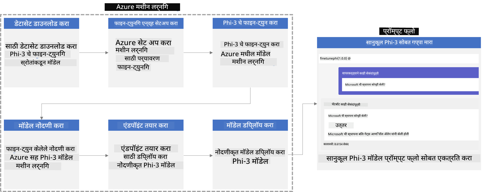

### विषय सूची

1. **[परिस्थिती 1: Azure resources सेट अप करा आणि fine-tuning साठी तयार व्हा](../../../../../../md/02.Application/01.TextAndChat/Phi3)**
    - [Azure Machine Learning Workspace तयार करा](../../../../../../md/02.Application/01.TextAndChat/Phi3)
    - [Azure Subscription मध्ये GPU quotas साठी विनंती करा](../../../../../../md/02.Application/01.TextAndChat/Phi3)
    - [Role assignment जोडा](../../../../../../md/02.Application/01.TextAndChat/Phi3)
    - [प्रोजेक्ट सेट अप करा](../../../../../../md/02.Application/01.TextAndChat/Phi3)
    - [fine-tuning साठी dataset तयार करा](../../../../../../md/02.Application/01.TextAndChat/Phi3)

1. **[परिस्थिती 2: Phi-3 मॉडेलचे fine-tune करा आणि Azure Machine Learning Studio मध्ये Deploy करा](../../../../../../md/02.Application/01.TextAndChat/Phi3)**
    - [Azure CLI सेट अप करा](../../../../../../md/02.Application/01.TextAndChat/Phi3)
    - [Phi-3 मॉडेलचे fine-tune करा](../../../../../../md/02.Application/01.TextAndChat/Phi3)
    - [fine-tuned मॉडेल Deploy करा](../../../../../../md/02.Application/01.TextAndChat/Phi3)

1. **[परिस्थिती 3: Prompt flow सह एकत्र करा आणि तुमच्या कस्टम मॉडेलशी Chat करा](../../../../../../md/02.Application/01.TextAndChat/Phi3)**
    - [कस्टम Phi-3 मॉडेल Prompt flow सह एकत्र करा](../../../../../../md/02.Application/01.TextAndChat/Phi3)
    - [तुमच्या कस्टम मॉडेलशी Chat करा](../../../../../../md/02.Application/01.TextAndChat/Phi3)

## परिस्थिती 1: Azure resources सेट अप करा आणि fine-tuning साठी तयार व्हा

### Azure Machine Learning Workspace तयार करा

1. पोर्टल पानाच्या वरच्या **search bar** मध्ये *azure machine learning* टाइप करा आणि दिसणाऱ्या पर्यायांमधून **Azure Machine Learning** निवडा.

    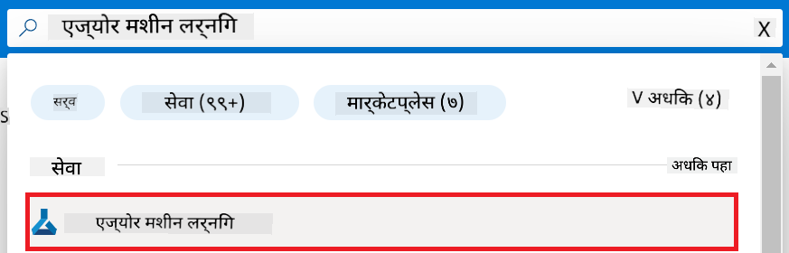

1. नेव्हिगेशन मेनूमधून **+ Create** निवडा.

1. नेव्हिगेशन मेनूमधून **New workspace** निवडा.

    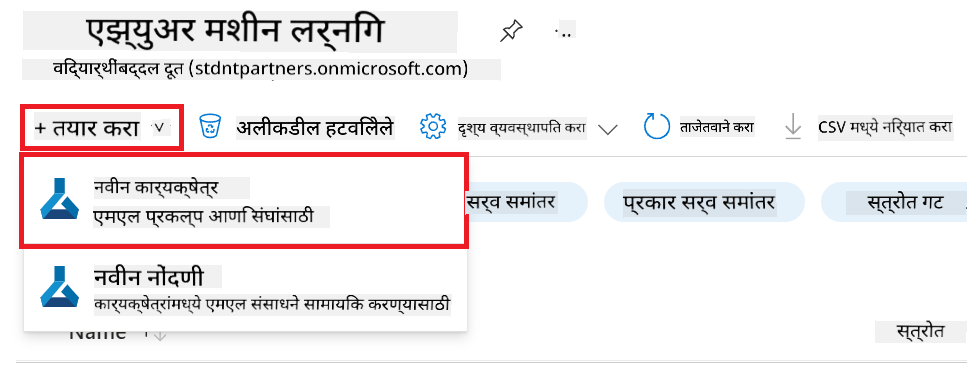

1. खालील कामे करा:

    - तुमचा Azure **Subscription** निवडा.
    - वापरायचा **Resource group** निवडा (जर नसेल तर नवीन तयार करा).
    - **Workspace Name** लिहा. हे एक अनन्य नाव असावे.
    - वापरायचा **Region** निवडा.
    - वापरायचा **Storage account** निवडा (जर नसेल तर नवीन तयार करा).
    - वापरायचा **Key vault** निवडा (जर नसेल तर नवीन तयार करा).
    - वापरायचा **Application insights** निवडा (जर नसेल तर नवीन तयार करा).
    - वापरायचा **Container registry** निवडा (जर नसेल तर नवीन तयार करा).

    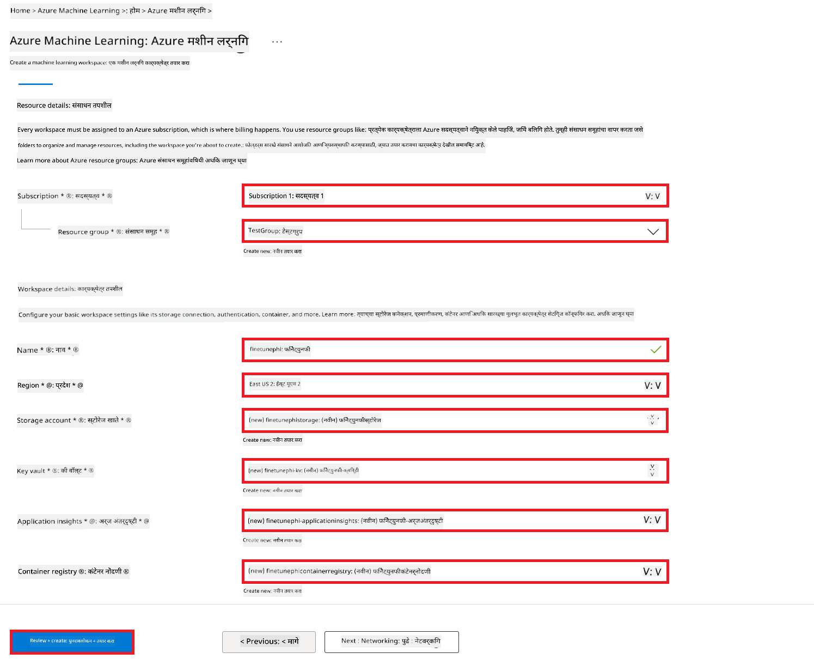

1. **Review + Create** निवडा.

1. **Create** निवडा.

### Azure Subscription मध्ये GPU quotas साठी विनंती करा

या E2E नमुन्यात, fine-tuning साठी *Standard_NC24ads_A100_v4 GPU* वापरले जाईल, ज्यासाठी quota विनंती करणे आवश्यक आहे, आणि deployment साठी *Standard_E4s_v3* CPU वापरला जाईल, ज्यासाठी quota विनंतीची गरज नाही.

> [!NOTE]
>
> फक्त Pay-As-You-Go subscriptions (सामान्य subscription प्रकार) GPU allocation साठी पात्र आहेत; benefit subscriptions सध्या समर्थित नाहीत.
>
> जे benefit subscriptions (जसे Visual Studio Enterprise Subscription) वापरत आहेत किंवा ज्यांना लवकर fine-tuning आणि deployment प्रक्रिया तपासायची आहे, त्यांच्यासाठी CPU वापरून कमी dataset सह fine-tuning कसे करायचे याचे मार्गदर्शन या ट्यूटोरियलमध्ये दिले आहे. मात्र लक्षात ठेवा की GPU वापरल्यास मोठ्या dataset सह fine-tuning चे निकाल खूपच चांगले येतात.

1. [Azure ML Studio](https://ml.azure.com/home?wt.mc_id=studentamb_279723) येथे जा.

1. *Standard NCADSA100v4 Family* quota साठी खालील कामे करा:

    - डाव्या बाजूच्या टॅबमधून **Quota** निवडा.
    - वापरायचा **Virtual machine family** निवडा. उदाहरणार्थ, **Standard NCADSA100v4 Family Cluster Dedicated vCPUs** निवडा, ज्यात *Standard_NC24ads_A100_v4* GPU समाविष्ट आहे.
    - नेव्हिगेशन मेनूमधून **Request quota** निवडा.

        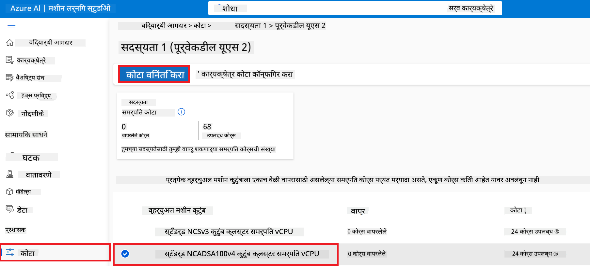

    - Request quota पानावर, वापरायचा **New cores limit** प्रविष्ट करा. उदाहरणार्थ, 24.
    - Request quota पानावर, GPU quota साठी **Submit** निवडा.

> [!NOTE]
> तुम्ही तुमच्या गरजेनुसार GPU किंवा CPU निवडण्यासाठी [Sizes for Virtual Machines in Azure](https://learn.microsoft.com/azure/virtual-machines/sizes/overview?tabs=breakdownseries%2Cgeneralsizelist%2Ccomputesizelist%2Cmemorysizelist%2Cstoragesizelist%2Cgpusizelist%2Cfpgasizelist%2Chpcsizelist) दस्तऐवज पाहू शकता.

### Role assignment जोडा

तुमचे मॉडेल fine-tune आणि deploy करण्यासाठी, प्रथम User Assigned Managed Identity (UAI) तयार करा आणि त्याला योग्य permissions द्या. ही UAI deployment दरम्यान authentication साठी वापरली जाईल.

#### User Assigned Managed Identity (UAI) तयार करा

1. पोर्टल पानाच्या वरच्या **search bar** मध्ये *managed identities* टाइप करा आणि दिसणाऱ्या पर्यायांमधून **Managed Identities** निवडा.

    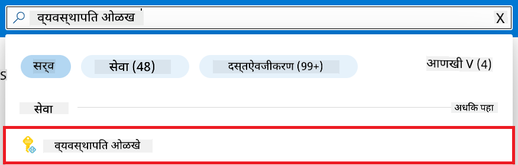

1. **+ Create** निवडा.

    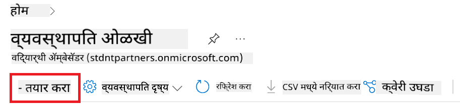

1. खालील कामे करा:

    - तुमचा Azure **Subscription** निवडा.
    - वापरायचा **Resource group** निवडा (जर नसेल तर नवीन तयार करा).
    - वापरायचा **Region** निवडा.
    - **Name** लिहा. हे एक अनन्य नाव असावे.

1. **Review + create** निवडा.

1. **+ Create** निवडा.

#### Managed Identity ला Contributor role assignment जोडा

1. तयार केलेल्या Managed Identity resource कडे जा.

1. डाव्या बाजूच्या टॅबमधून **Azure role assignments** निवडा.

1. नेव्हिगेशन मेनूमधून **+Add role assignment** निवडा.

1. Add role assignment पानावर खालील कामे करा:
    - **Scope** साठी **Resource group** निवडा.
    - तुमचा Azure **Subscription** निवडा.
    - वापरायचा **Resource group** निवडा.
    - **Role** साठी **Contributor** निवडा.

    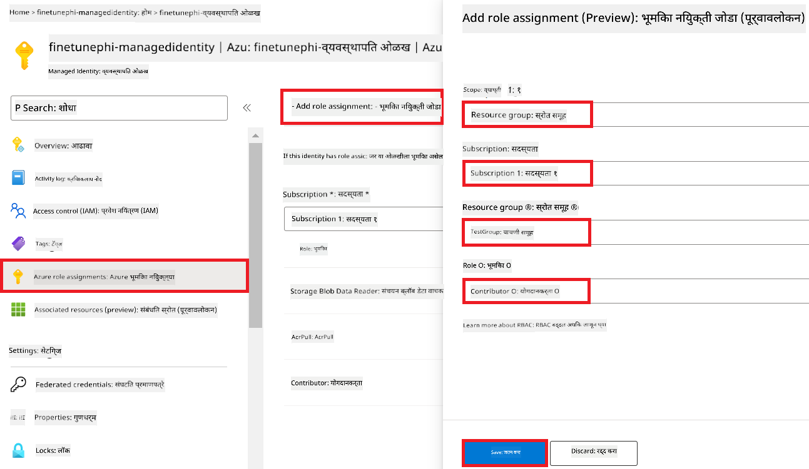

1. **Save** निवडा.

#### Managed Identity ला Storage Blob Data Reader role assignment जोडा

1. पोर्टल पानाच्या वरच्या **search bar** मध्ये *storage accounts* टाइप करा आणि दिसणाऱ्या पर्यायांमधून **Storage accounts** निवडा.

    

1. Azure Machine Learning workspace सोबत संबंधित storage account निवडा. उदाहरणार्थ, *finetunephistorage*.

1. Add role assignment पानावर जाण्यासाठी खालील कामे करा:

    - तयार केलेल्या Azure Storage account कडे जा.
    - डाव्या बाजूच्या टॅबमधून **Access Control (IAM)** निवडा.
    - नेव्हिगेशन मेनूमधून **+ Add** निवडा.
    - नेव्हिगेशन मेनूमधून **Add role assignment** निवडा.

    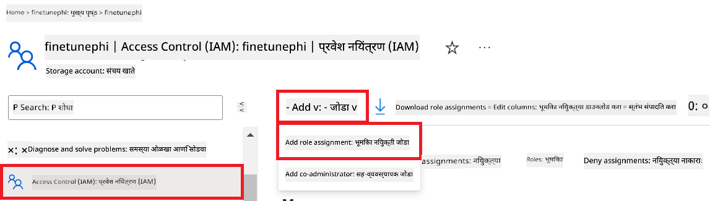

1. Add role assignment पानावर खालील कामे करा:

    - Role पानावर, **search bar** मध्ये *Storage Blob Data Reader* टाइप करा आणि दिसणाऱ्या पर्यायांमधून **Storage Blob Data Reader** निवडा.
    - Role पानावर, **Next** निवडा.
    - Members पानावर, **Assign access to** साठी **Managed identity** निवडा.
    - Members पानावर, **+ Select members** निवडा.
    - Select managed identities पानावर, तुमचा Azure **Subscription** निवडा.
    - Select managed identities पानावर, **Managed identity** साठी **Manage Identity** निवडा.
    - Select managed identities पानावर, तयार केलेली Managed Identity निवडा. उदाहरणार्थ, *finetunephi-managedidentity*.
    - Select managed identities पानावर, **Select** निवडा.

    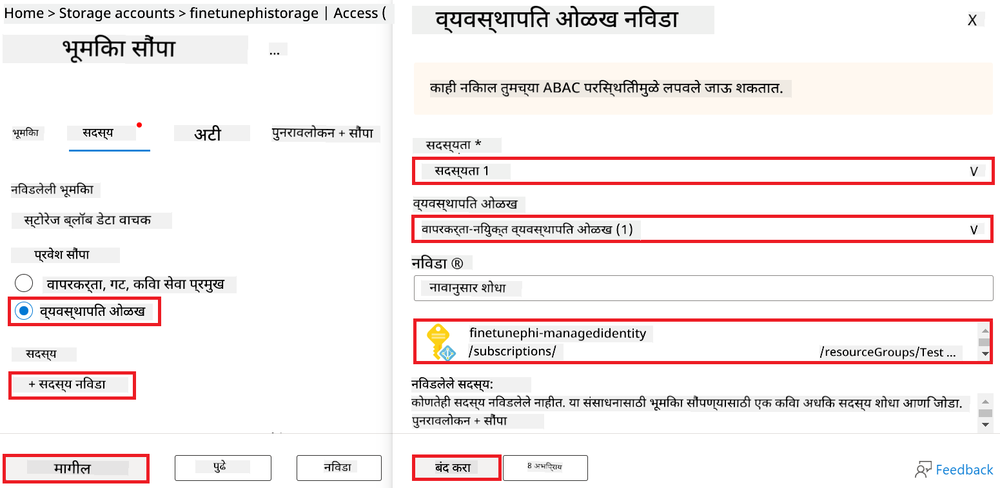

1. **Review + assign** निवडा.

#### Managed Identity ला AcrPull role assignment जोडा

1. पोर्टल पानाच्या वरच्या **search bar** मध्ये *container registries* टाइप करा आणि दिसणाऱ्या पर्यायांमधून **Container registries** निवडा.

    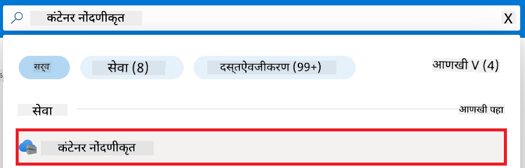

1. Azure Machine Learning workspace सोबत संबंधित container registry निवडा. उदाहरणार्थ, *finetunephicontainerregistries*

1. Add role assignment पानावर जाण्यासाठी खालील कामे करा:

    - डाव्या बाजूच्या टॅबमधून **Access Control (IAM)** निवडा.
    - नेव्हिगेशन मेनूमधून **+ Add** निवडा.
    - नेव्हिगेशन मेनूमधून **Add role assignment** निवडा.

1. Add role assignment पानावर खालील कामे करा:

    - Role पानावर, **search bar** मध्ये *AcrPull* टाइप करा आणि दिसणाऱ्या पर्यायांमधून **AcrPull** निवडा.
    - Role पानावर, **Next** निवडा.
    - Members पानावर, **Assign access to** साठी **Managed identity** निवडा.
    - Members पानावर, **+ Select members** निवडा.
    - Select managed identities पानावर, तुमचा Azure **Subscription** निवडा.
    - Select managed identities पानावर, **Managed identity** साठी **Manage Identity** निवडा.
    - Select managed identities पानावर, तयार केलेली Managed Identity निवडा. उदाहरणार्थ, *finetunephi-managedidentity*.
    - Select managed identities पानावर, **Select** निवडा.
    - **Review + assign** निवडा.

### प्रोजेक्ट सेट अप करा

आता, तुम्ही काम करण्यासाठी एक फोल्डर तयार कराल आणि एक virtual environment सेट कराल, ज्याद्वारे वापरकर्त्यांशी संवाद साधणारा प्रोग्राम तयार कराल आणि Azure Cosmos DB मधील chat history वापरून त्याच्या प्रतिसादांना माहिती द्याल.

#### कामासाठी फोल्डर तयार करा

1. टर्मिनल विंडो उघडा आणि खालील कमांड टाइप करून *finetune-phi* नावाचा फोल्डर डिफॉल्ट पथात तयार करा.

    ```console
    mkdir finetune-phi
    ```

1. टर्मिनलमध्ये खालील कमांड टाइप करून तयार केलेल्या *finetune-phi* फोल्डरमध्ये जा.

    ```console
    cd finetune-phi
    ```

#### virtual environment तयार करा

1. टर्मिनलमध्ये खालील कमांड टाइप करून *.venv* नावाचा virtual environment तयार करा.

    ```console
    python -m venv .venv
    ```

1. टर्मिनलमध्ये खालील कमांड टाइप करून virtual environment सक्रिय करा.

    ```console
    .venv\Scripts\activate.bat
    ```

> [!NOTE]
>
> जर ते यशस्वी झाले, तर कमांड प्रॉम्प्टच्या पुढे *(.venv)* दिसेल.

#### आवश्यक पॅकेजेस इन्स्टॉल करा

1. टर्मिनलमध्ये खालील कमांड टाइप करून आवश्यक पॅकेजेस इन्स्टॉल करा.

    ```console
    pip install datasets==2.19.1
    pip install transformers==4.41.1
    pip install azure-ai-ml==1.16.0
    pip install torch==2.3.1
    pip install trl==0.9.4
    pip install promptflow==1.12.0
    ```

#### प्रोजेक्ट फाइल्स तयार करा

या व्यायामात, आपण प्रोजेक्टसाठी आवश्यक फाइल्स तयार कराल. यात dataset डाउनलोड करण्यासाठी, Azure Machine Learning पर्यावरण सेट करण्यासाठी, Phi-3 मॉडेल fine-tune करण्यासाठी, आणि fine-tuned मॉडेल deploy करण्यासाठी स्क्रिप्ट्स असतील. तसेच fine-tuning पर्यावरणासाठी *conda.yml* फाइल देखील तयार कराल.

या व्यायामात, तुम्ही:

- dataset डाउनलोड करण्यासाठी *download_dataset.py* फाइल तयार कराल.
- Azure Machine Learning पर्यावरण सेट करण्यासाठी *setup_ml.py* फाइल तयार कराल.
- *finetuning_dir* फोल्डरमध्ये *fine_tune.py* फाइल तयार कराल, जी dataset वापरून Phi-3 मॉडेल fine-tune करेल.
- fine-tuning पर्यावरण सेट करण्यासाठी *conda.yml* फाइल तयार कराल.
- fine-tuned मॉडेल deploy करण्यासाठी *deploy_model.py* फाइल तयार कराल.
- fine-tuned मॉडेल Prompt flow सह एकत्र करण्यासाठी आणि चालवण्यासाठी *integrate_with_promptflow.py* फाइल तयार कराल.
- Prompt flow साठी workflow रचना सेट करण्यासाठी flow.dag.yml फाइल तयार कराल.
- Azure माहिती भरण्यासाठी *config.py* फाइल तयार कराल.

> [!NOTE]
>
> संपूर्ण फोल्डर संरचना:
>
> ```text
> └── YourUserName
> .    └── finetune-phi
> .        ├── finetuning_dir
> .        │      └── fine_tune.py
> .        ├── conda.yml
> .        ├── config.py
> .        ├── deploy_model.py
> .        ├── download_dataset.py
> .        ├── flow.dag.yml
> .        ├── integrate_with_promptflow.py
> .        └── setup_ml.py
> ```

1. **Visual Studio Code** उघडा.

1. मेनू बारमधून **File** निवडा.

1. **Open Folder** निवडा.

1. *finetune-phi* फोल्डर निवडा, जो *C:\Users\yourUserName\finetune-phi* येथे आहे.

    

1. Visual Studio Code च्या डाव्या पॅनमध्ये उजव्या क्लिक करून **New File** निवडा आणि *download_dataset.py* नावाची फाइल तयार करा.

1. डाव्या पॅनमध्ये उजव्या क्लिक करून **New File** निवडा आणि *setup_ml.py* नावाची फाइल तयार करा.

1. डाव्या पॅनमध्ये उजव्या क्लिक करून **New File** निवडा आणि *deploy_model.py* नावाची फाइल तयार करा.

    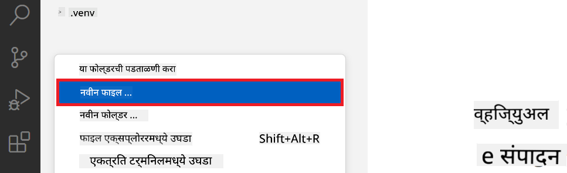

1. डाव्या पॅनमध्ये उजव्या क्लिक करून **New Folder** निवडा आणि *finetuning_dir* नावाचा फोल्डर तयार करा.

1. *finetuning_dir* फोल्डरमध्ये *fine_tune.py* नावाची फाइल तयार करा.

#### *conda.yml* फाइल तयार करा आणि कॉन्फिगर करा

1. Visual Studio Code च्या डाव्या पॅनमध्ये उजव्या क्लिक करून **New File** निवडा आणि *conda.yml* नावाची फाइल तयार करा.

1. *conda.yml* फाइलमध्ये Phi-3 मॉडेलसाठी fine-tuning पर्यावरण सेट करण्यासाठी खालील कोड जोडा.

    ```yml
    name: phi-3-training-env
    channels:
      - defaults
      - conda-forge
    dependencies:
      - python=3.10
      - pip
      - numpy<2.0
      - pip:
          - torch==2.4.0
          - torchvision==0.19.0
          - trl==0.8.6
          - transformers==4.41
          - datasets==2.21.0
          - azureml-core==1.57.0
          - azure-storage-blob==12.19.0
          - azure-ai-ml==1.16
          - azure-identity==1.17.1
          - accelerate==0.33.0
          - mlflow==2.15.1
          - azureml-mlflow==1.57.0
    ```

#### *config.py* फाइल तयार करा आणि कॉन्फिगर करा

1. Visual Studio Code च्या डाव्या पॅनमध्ये उजव्या क्लिक करून **New File** निवडा आणि *config.py* नावाची फाइल तयार करा.

1. *config.py* फाइलमध्ये तुमची Azure माहिती समाविष्ट करण्यासाठी खालील कोड जोडा.

    ```python
    # Azure settings
    AZURE_SUBSCRIPTION_ID = "your_subscription_id"
    AZURE_RESOURCE_GROUP_NAME = "your_resource_group_name" # "TestGroup"

    # Azure Machine Learning settings
    AZURE_ML_WORKSPACE_NAME = "your_workspace_name" # "finetunephi-workspace"

    # Azure Managed Identity settings
    AZURE_MANAGED_IDENTITY_CLIENT_ID = "your_azure_managed_identity_client_id"
    AZURE_MANAGED_IDENTITY_NAME = "your_azure_managed_identity_name" # "finetunephi-mangedidentity"
    AZURE_MANAGED_IDENTITY_RESOURCE_ID = f"/subscriptions/{AZURE_SUBSCRIPTION_ID}/resourceGroups/{AZURE_RESOURCE_GROUP_NAME}/providers/Microsoft.ManagedIdentity/userAssignedIdentities/{AZURE_MANAGED_IDENTITY_NAME}"

    # Dataset file paths
    TRAIN_DATA_PATH = "data/train_data.jsonl"
    TEST_DATA_PATH = "data/test_data.jsonl"

    # Fine-tuned model settings
    AZURE_MODEL_NAME = "your_fine_tuned_model_name" # "finetune-phi-model"
    AZURE_ENDPOINT_NAME = "your_fine_tuned_model_endpoint_name" # "finetune-phi-endpoint"
    AZURE_DEPLOYMENT_NAME = "your_fine_tuned_model_deployment_name" # "finetune-phi-deployment"

    AZURE_ML_API_KEY = "your_fine_tuned_model_api_key"
    AZURE_ML_ENDPOINT = "your_fine_tuned_model_endpoint_uri" # "https://{your-endpoint-name}.{your-region}.inference.ml.azure.com/score"
    ```

#### Azure environment variables जोडा

1. Azure Subscription ID जोडण्यासाठी खालील कामे करा:

    -
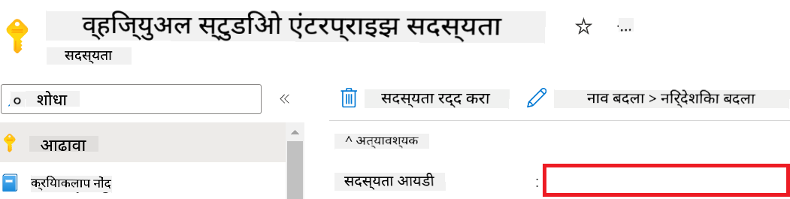

1. Azure Workspace Name जोडण्यासाठी खालील टास्क करा:

    - आपण तयार केलेल्या Azure Machine Learning रिसोर्सकडे जा.
    - आपले अकाउंट नाव *config.py* फाइलमध्ये कॉपी आणि पेस्ट करा.

    

1. Azure Resource Group Name जोडण्यासाठी खालील टास्क करा:

    - आपण तयार केलेल्या Azure Machine Learning रिसोर्सकडे जा.
    - आपले Azure Resource Group Name *config.py* फाइलमध्ये कॉपी आणि पेस्ट करा.

    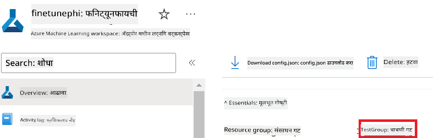

2. Azure Managed Identity नाव जोडण्यासाठी खालील टास्क करा

    - आपण तयार केलेल्या Managed Identities रिसोर्सकडे जा.
    - आपले Azure Managed Identity नाव *config.py* फाइलमध्ये कॉपी आणि पेस्ट करा.

    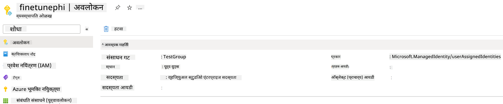

### फाइन-ट्युनिंगसाठी डेटासेट तयार करा

या एक्सरसाइजमध्ये, आपण *download_dataset.py* फाइल चालवून *ULTRACHAT_200k* डेटासेट आपल्या लोकल एन्व्हायर्नमेंटमध्ये डाउनलोड कराल. नंतर, आपण या डेटासेटचा वापर करून Azure Machine Learning मध्ये Phi-3 मॉडेल फाइन-ट्यून कराल.

#### *download_dataset.py* वापरून आपले डेटासेट डाउनलोड करा

1. Visual Studio Code मध्ये *download_dataset.py* फाइल उघडा.

1. *download_dataset.py* मध्ये खालील कोड जोडा.

    ```python
    import json
    import os
    from datasets import load_dataset
    from config import (
        TRAIN_DATA_PATH,
        TEST_DATA_PATH)

    def load_and_split_dataset(dataset_name, config_name, split_ratio):
        """
        Load and split a dataset.
        """
        # Load the dataset with the specified name, configuration, and split ratio
        dataset = load_dataset(dataset_name, config_name, split=split_ratio)
        print(f"Original dataset size: {len(dataset)}")
        
        # Split the dataset into train and test sets (80% train, 20% test)
        split_dataset = dataset.train_test_split(test_size=0.2)
        print(f"Train dataset size: {len(split_dataset['train'])}")
        print(f"Test dataset size: {len(split_dataset['test'])}")
        
        return split_dataset

    def save_dataset_to_jsonl(dataset, filepath):
        """
        Save a dataset to a JSONL file.
        """
        # Create the directory if it does not exist
        os.makedirs(os.path.dirname(filepath), exist_ok=True)
        
        # Open the file in write mode
        with open(filepath, 'w', encoding='utf-8') as f:
            # Iterate over each record in the dataset
            for record in dataset:
                # Dump the record as a JSON object and write it to the file
                json.dump(record, f)
                # Write a newline character to separate records
                f.write('\n')
        
        print(f"Dataset saved to {filepath}")

    def main():
        """
        Main function to load, split, and save the dataset.
        """
        # Load and split the ULTRACHAT_200k dataset with a specific configuration and split ratio
        dataset = load_and_split_dataset("HuggingFaceH4/ultrachat_200k", 'default', 'train_sft[:1%]')
        
        # Extract the train and test datasets from the split
        train_dataset = dataset['train']
        test_dataset = dataset['test']

        # Save the train dataset to a JSONL file
        save_dataset_to_jsonl(train_dataset, TRAIN_DATA_PATH)
        
        # Save the test dataset to a separate JSONL file
        save_dataset_to_jsonl(test_dataset, TEST_DATA_PATH)

    if __name__ == "__main__":
        main()

    ```

> [!TIP]
>
> **CPU वापरून कमी डेटासेटसह फाइन-ट्युनिंगसाठी मार्गदर्शन**
>
> जर तुम्हाला CPU वापरून फाइन-ट्युनिंग करायचे असेल, तर हा मार्ग विशेषतः benefit subscriptions (जसे की Visual Studio Enterprise Subscription) असलेल्या वापरकर्त्यांसाठी किंवा फाइन-ट्युनिंग आणि डिप्लॉयमेंट प्रक्रियेची जलद चाचणी करण्यासाठी उपयुक्त आहे.
>
> `dataset = load_and_split_dataset("HuggingFaceH4/ultrachat_200k", 'default', 'train_sft[:1%]')` with `dataset = load_and_split_dataset("HuggingFaceH4/ultrachat_200k", 'default', 'train_sft[:10]')` या ओळी बदला.
>

1. टर्मिनलमध्ये खालील कमांड टाइप करा ज्यामुळे स्क्रिप्ट चालेल आणि डेटासेट आपल्या लोकल एन्व्हायर्नमेंटमध्ये डाउनलोड होईल.

    ```console
    python download_data.py
    ```

1. तपासा की डेटासेट्स यशस्वीपणे आपल्या लोकल *finetune-phi/data* डिरेक्टरीमध्ये सेव्ह झाले आहेत.

> [!NOTE]
>
> **डेटासेटचा आकार आणि फाइन-ट्युनिंगचा वेळ**
>
> या E2E सॅम्पलमध्ये, आपण केवळ डेटासेटचा 1% (`train_sft[:1%]`) वापरत आहात. यामुळे डेटा प्रमाण खूप कमी होते, ज्यामुळे अपलोड आणि फाइन-ट्युनिंग दोन्ही प्रक्रिया जलद होतात. तुम्ही ट्रेनिंग वेळ आणि मॉडेल परफॉर्मन्स यामध्ये योग्य संतुलन साधण्यासाठी हा टक्केवारी बदलू शकता. कमी डेटासेट वापरल्यामुळे फाइन-ट्युनिंगचा वेळ कमी होतो आणि प्रक्रिया अधिक सोपी होते.

## Scenario 2: Phi-3 मॉडेल फाइन-ट्यून करा आणि Azure Machine Learning Studio मध्ये डिप्लॉय करा

### Azure CLI सेटअप करा

आपल्या एन्व्हायर्नमेंटला प्रमाणित करण्यासाठी Azure CLI सेटअप करणे आवश्यक आहे. Azure CLI कमांड लाइनवरून थेट Azure रिसोर्सेस मॅनेज करण्यास मदत करते आणि Azure Machine Learning ला या रिसोर्सेस वापरण्यासाठी आवश्यक क्रेडेन्शियल्स पुरवते. सुरुवात करण्यासाठी [Azure CLI](https://learn.microsoft.com/cli/azure/install-azure-cli) इन्स्टॉल करा.

1. टर्मिनल विंडो उघडा आणि आपल्या Azure अकाउंटमध्ये लॉगिन होण्यासाठी खालील कमांड टाइप करा.

    ```console
    az login
    ```

1. वापरायचा Azure अकाउंट निवडा.

1. वापरायचा Azure सबस्क्रिप्शन निवडा.

    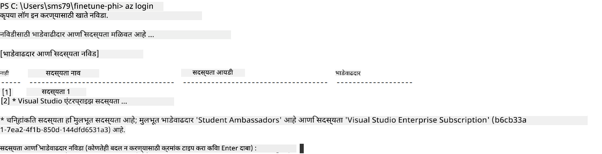

> [!TIP]
>
> Azure मध्ये साइन इन करताना अडचण येत असल्यास, डिव्हाइस कोड वापरून साइन इन करण्याचा प्रयत्न करा. टर्मिनलमध्ये खालील कमांड टाइप करा:
>
> ```console
> az login --use-device-code
> ```
>

### Phi-3 मॉडेल फाइन-ट्यून करा

या एक्सरसाइजमध्ये, आपण दिलेल्या डेटासेटचा वापर करून Phi-3 मॉडेल फाइन-ट्यून कराल. प्रथम, आपण *fine_tune.py* फाइलमध्ये फाइन-ट्युनिंग प्रक्रिया डिफाइन कराल. नंतर, Azure Machine Learning एन्व्हायर्नमेंट कॉन्फिगर करून *setup_ml.py* फाइल चालवून फाइन-ट्युनिंग सुरू कराल. हा स्क्रिप्ट फाइन-ट्युनिंग Azure Machine Learning एन्व्हायर्नमेंटमध्ये होईल याची खात्री करतो.

*setup_ml.py* चालवून, आपण Azure Machine Learning एन्व्हायर्नमेंटमध्ये फाइन-ट्युनिंग प्रक्रिया चालवाल.

#### *fine_tune.py* फाइलमध्ये कोड जोडा

1. *finetuning_dir* फोल्डरमध्ये जा आणि Visual Studio Code मध्ये *fine_tune.py* फाइल उघडा.

1. *fine_tune.py* मध्ये खालील कोड जोडा.

    ```python
    import argparse
    import sys
    import logging
    import os
    from datasets import load_dataset
    import torch
    import mlflow
    from transformers import AutoModelForCausalLM, AutoTokenizer, TrainingArguments
    from trl import SFTTrainer

    # To avoid the INVALID_PARAMETER_VALUE error in MLflow, disable MLflow integration
    os.environ["DISABLE_MLFLOW_INTEGRATION"] = "True"

    # Logging setup
    logging.basicConfig(
        format="%(asctime)s - %(levelname)s - %(name)s - %(message)s",
        datefmt="%Y-%m-%d %H:%M:%S",
        handlers=[logging.StreamHandler(sys.stdout)],
        level=logging.WARNING
    )
    logger = logging.getLogger(__name__)

    def initialize_model_and_tokenizer(model_name, model_kwargs):
        """
        Initialize the model and tokenizer with the given pretrained model name and arguments.
        """
        model = AutoModelForCausalLM.from_pretrained(model_name, **model_kwargs)
        tokenizer = AutoTokenizer.from_pretrained(model_name)
        tokenizer.model_max_length = 2048
        tokenizer.pad_token = tokenizer.unk_token
        tokenizer.pad_token_id = tokenizer.convert_tokens_to_ids(tokenizer.pad_token)
        tokenizer.padding_side = 'right'
        return model, tokenizer

    def apply_chat_template(example, tokenizer):
        """
        Apply a chat template to tokenize messages in the example.
        """
        messages = example["messages"]
        if messages[0]["role"] != "system":
            messages.insert(0, {"role": "system", "content": ""})
        example["text"] = tokenizer.apply_chat_template(
            messages, tokenize=False, add_generation_prompt=False
        )
        return example

    def load_and_preprocess_data(train_filepath, test_filepath, tokenizer):
        """
        Load and preprocess the dataset.
        """
        train_dataset = load_dataset('json', data_files=train_filepath, split='train')
        test_dataset = load_dataset('json', data_files=test_filepath, split='train')
        column_names = list(train_dataset.features)

        train_dataset = train_dataset.map(
            apply_chat_template,
            fn_kwargs={"tokenizer": tokenizer},
            num_proc=10,
            remove_columns=column_names,
            desc="Applying chat template to train dataset",
        )

        test_dataset = test_dataset.map(
            apply_chat_template,
            fn_kwargs={"tokenizer": tokenizer},
            num_proc=10,
            remove_columns=column_names,
            desc="Applying chat template to test dataset",
        )

        return train_dataset, test_dataset

    def train_and_evaluate_model(train_dataset, test_dataset, model, tokenizer, output_dir):
        """
        Train and evaluate the model.
        """
        training_args = TrainingArguments(
            bf16=True,
            do_eval=True,
            output_dir=output_dir,
            eval_strategy="epoch",
            learning_rate=5.0e-06,
            logging_steps=20,
            lr_scheduler_type="cosine",
            num_train_epochs=3,
            overwrite_output_dir=True,
            per_device_eval_batch_size=4,
            per_device_train_batch_size=4,
            remove_unused_columns=True,
            save_steps=500,
            seed=0,
            gradient_checkpointing=True,
            gradient_accumulation_steps=1,
            warmup_ratio=0.2,
        )

        trainer = SFTTrainer(
            model=model,
            args=training_args,
            train_dataset=train_dataset,
            eval_dataset=test_dataset,
            max_seq_length=2048,
            dataset_text_field="text",
            tokenizer=tokenizer,
            packing=True
        )

        train_result = trainer.train()
        trainer.log_metrics("train", train_result.metrics)

        mlflow.transformers.log_model(
            transformers_model={"model": trainer.model, "tokenizer": tokenizer},
            artifact_path=output_dir,
        )

        tokenizer.padding_side = 'left'
        eval_metrics = trainer.evaluate()
        eval_metrics["eval_samples"] = len(test_dataset)
        trainer.log_metrics("eval", eval_metrics)

    def main(train_file, eval_file, model_output_dir):
        """
        Main function to fine-tune the model.
        """
        model_kwargs = {
            "use_cache": False,
            "trust_remote_code": True,
            "torch_dtype": torch.bfloat16,
            "device_map": None,
            "attn_implementation": "eager"
        }

        # pretrained_model_name = "microsoft/Phi-3-mini-4k-instruct"
        pretrained_model_name = "microsoft/Phi-3.5-mini-instruct"

        with mlflow.start_run():
            model, tokenizer = initialize_model_and_tokenizer(pretrained_model_name, model_kwargs)
            train_dataset, test_dataset = load_and_preprocess_data(train_file, eval_file, tokenizer)
            train_and_evaluate_model(train_dataset, test_dataset, model, tokenizer, model_output_dir)

    if __name__ == "__main__":
        parser = argparse.ArgumentParser()
        parser.add_argument("--train-file", type=str, required=True, help="Path to the training data")
        parser.add_argument("--eval-file", type=str, required=True, help="Path to the evaluation data")
        parser.add_argument("--model_output_dir", type=str, required=True, help="Directory to save the fine-tuned model")
        args = parser.parse_args()
        main(args.train_file, args.eval_file, args.model_output_dir)

    ```

1. *fine_tune.py* फाइल सेव्ह करून बंद करा.

> [!TIP]
> **Phi-3.5 मॉडेल फाइन-ट्यून करू शकता**
>
> *fine_tune.py* फाइलमध्ये, `pretrained_model_name` from `"microsoft/Phi-3-mini-4k-instruct"` to any model you want to fine-tune. For example, if you change it to `"microsoft/Phi-3.5-mini-instruct"`, you'll be using the Phi-3.5-mini-instruct model for fine-tuning. To find and use the model name you prefer, visit [Hugging Face](https://huggingface.co/), search for the model you're interested in, and then copy and paste its name into the `pretrained_model_name` फील्ड बदलू शकता.
>
> :::image type="content" source="../../imgs/03/FineTuning-PromptFlow/finetunephi3.5.png" alt-text="Fine tune Phi-3.5.":::
>

#### *setup_ml.py* फाइलमध्ये कोड जोडा

1. Visual Studio Code मध्ये *setup_ml.py* फाइल उघडा.

1. *setup_ml.py* मध्ये खालील कोड जोडा.

    ```python
    import logging
    from azure.ai.ml import MLClient, command, Input
    from azure.ai.ml.entities import Environment, AmlCompute
    from azure.identity import AzureCliCredential
    from config import (
        AZURE_SUBSCRIPTION_ID,
        AZURE_RESOURCE_GROUP_NAME,
        AZURE_ML_WORKSPACE_NAME,
        TRAIN_DATA_PATH,
        TEST_DATA_PATH
    )

    # Constants

    # Uncomment the following lines to use a CPU instance for training
    # COMPUTE_INSTANCE_TYPE = "Standard_E16s_v3" # cpu
    # COMPUTE_NAME = "cpu-e16s-v3"
    # DOCKER_IMAGE_NAME = "mcr.microsoft.com/azureml/openmpi4.1.0-ubuntu20.04:latest"

    # Uncomment the following lines to use a GPU instance for training
    COMPUTE_INSTANCE_TYPE = "Standard_NC24ads_A100_v4"
    COMPUTE_NAME = "gpu-nc24s-a100-v4"
    DOCKER_IMAGE_NAME = "mcr.microsoft.com/azureml/curated/acft-hf-nlp-gpu:59"

    CONDA_FILE = "conda.yml"
    LOCATION = "eastus2" # Replace with the location of your compute cluster
    FINETUNING_DIR = "./finetuning_dir" # Path to the fine-tuning script
    TRAINING_ENV_NAME = "phi-3-training-environment" # Name of the training environment
    MODEL_OUTPUT_DIR = "./model_output" # Path to the model output directory in azure ml

    # Logging setup to track the process
    logger = logging.getLogger(__name__)
    logging.basicConfig(
        format="%(asctime)s - %(levelname)s - %(name)s - %(message)s",
        datefmt="%Y-%m-%d %H:%M:%S",
        level=logging.WARNING
    )

    def get_ml_client():
        """
        Initialize the ML Client using Azure CLI credentials.
        """
        credential = AzureCliCredential()
        return MLClient(credential, AZURE_SUBSCRIPTION_ID, AZURE_RESOURCE_GROUP_NAME, AZURE_ML_WORKSPACE_NAME)

    def create_or_get_environment(ml_client):
        """
        Create or update the training environment in Azure ML.
        """
        env = Environment(
            image=DOCKER_IMAGE_NAME,  # Docker image for the environment
            conda_file=CONDA_FILE,  # Conda environment file
            name=TRAINING_ENV_NAME,  # Name of the environment
        )
        return ml_client.environments.create_or_update(env)

    def create_or_get_compute_cluster(ml_client, compute_name, COMPUTE_INSTANCE_TYPE, location):
        """
        Create or update the compute cluster in Azure ML.
        """
        try:
            compute_cluster = ml_client.compute.get(compute_name)
            logger.info(f"Compute cluster '{compute_name}' already exists. Reusing it for the current run.")
        except Exception:
            logger.info(f"Compute cluster '{compute_name}' does not exist. Creating a new one with size {COMPUTE_INSTANCE_TYPE}.")
            compute_cluster = AmlCompute(
                name=compute_name,
                size=COMPUTE_INSTANCE_TYPE,
                location=location,
                tier="Dedicated",  # Tier of the compute cluster
                min_instances=0,  # Minimum number of instances
                max_instances=1  # Maximum number of instances
            )
            ml_client.compute.begin_create_or_update(compute_cluster).wait()  # Wait for the cluster to be created
        return compute_cluster

    def create_fine_tuning_job(env, compute_name):
        """
        Set up the fine-tuning job in Azure ML.
        """
        return command(
            code=FINETUNING_DIR,  # Path to fine_tune.py
            command=(
                "python fine_tune.py "
                "--train-file ${{inputs.train_file}} "
                "--eval-file ${{inputs.eval_file}} "
                "--model_output_dir ${{inputs.model_output}}"
            ),
            environment=env,  # Training environment
            compute=compute_name,  # Compute cluster to use
            inputs={
                "train_file": Input(type="uri_file", path=TRAIN_DATA_PATH),  # Path to the training data file
                "eval_file": Input(type="uri_file", path=TEST_DATA_PATH),  # Path to the evaluation data file
                "model_output": MODEL_OUTPUT_DIR
            }
        )

    def main():
        """
        Main function to set up and run the fine-tuning job in Azure ML.
        """
        # Initialize ML Client
        ml_client = get_ml_client()

        # Create Environment
        env = create_or_get_environment(ml_client)
        
        # Create or get existing compute cluster
        create_or_get_compute_cluster(ml_client, COMPUTE_NAME, COMPUTE_INSTANCE_TYPE, LOCATION)

        # Create and Submit Fine-Tuning Job
        job = create_fine_tuning_job(env, COMPUTE_NAME)
        returned_job = ml_client.jobs.create_or_update(job)  # Submit the job
        ml_client.jobs.stream(returned_job.name)  # Stream the job logs
        
        # Capture the job name
        job_name = returned_job.name
        print(f"Job name: {job_name}")

    if __name__ == "__main__":
        main()

    ```

1. `COMPUTE_INSTANCE_TYPE`, `COMPUTE_NAME`, and `LOCATION` हे आपले तपशील वापरून बदला.

    ```python
   # Uncomment the following lines to use a GPU instance for training
    COMPUTE_INSTANCE_TYPE = "Standard_NC24ads_A100_v4"
    COMPUTE_NAME = "gpu-nc24s-a100-v4"
    ...
    LOCATION = "eastus2" # Replace with the location of your compute cluster
    ```

> [!TIP]
>
> **CPU वापरून कमी डेटासेटसह फाइन-ट्युनिंगसाठी मार्गदर्शन**
>
> जर तुम्हाला CPU वापरून फाइन-ट्युनिंग करायचे असेल, तर हा मार्ग benefit subscriptions (जसे की Visual Studio Enterprise Subscription) असलेल्या वापरकर्त्यांसाठी किंवा फाइन-ट्युनिंग आणि डिप्लॉयमेंट प्रक्रियेची जलद चाचणी करण्यासाठी उपयुक्त आहे.
>
> 1. *setup_ml* फाइल उघडा.
> 1. `COMPUTE_INSTANCE_TYPE`, `COMPUTE_NAME`, and `DOCKER_IMAGE_NAME` with the following. If you do not have access to *Standard_E16s_v3*, you can use an equivalent CPU instance or request a new quota.
> 1. Replace `LOCATION` या ओळी आपले तपशील वापरून बदला.
>
>    ```python
>    # Uncomment the following lines to use a CPU instance for training
>    COMPUTE_INSTANCE_TYPE = "Standard_E16s_v3" # cpu
>    COMPUTE_NAME = "cpu-e16s-v3"
>    DOCKER_IMAGE_NAME = "mcr.microsoft.com/azureml/openmpi4.1.0-ubuntu20.04:latest"
>    LOCATION = "eastus2" # Replace with the location of your compute cluster
>    ```
>

1. *setup_ml.py* स्क्रिप्ट चालवून Azure Machine Learning मध्ये फाइन-ट्युनिंग प्रक्रिया सुरू करण्यासाठी खालील कमांड टाइप करा.

    ```python
    python setup_ml.py
    ```

1. या एक्सरसाइजमध्ये, आपण यशस्वीरित्या Phi-3 मॉडेल Azure Machine Learning वापरून फाइन-ट्यून केले आहे. *setup_ml.py* स्क्रिप्ट चालवून आपण Azure Machine Learning एन्व्हायर्नमेंट सेटअप केला आणि *fine_tune.py* मध्ये डिफाइंड फाइन-ट्युनिंग प्रक्रिया सुरू केली. कृपया लक्षात ठेवा की फाइन-ट्युनिंग प्रक्रियेला बराच वेळ लागू शकतो. `python setup_ml.py` command, you need to wait for the process to complete. You can monitor the status of the fine-tuning job by following the link provided in the terminal to the Azure Machine Learning portal.

    

### Deploy the fine-tuned model

To integrate the fine-tuned Phi-3 model with Prompt Flow, you need to deploy the model to make it accessible for real-time inference. This process involves registering the model, creating an online endpoint, and deploying the model.

#### Set the model name, endpoint name, and deployment name for deployment

1. Open *config.py* file.

1. Replace `AZURE_MODEL_NAME = "your_fine_tuned_model_name"` with the desired name for your model.

1. Replace `AZURE_ENDPOINT_NAME = "your_fine_tuned_model_endpoint_name"` with the desired name for your endpoint.

1. Replace `AZURE_DEPLOYMENT_NAME = "your_fine_tuned_model_deployment_name"` कमांड चालवताना आपले इच्छित डिप्लॉयमेंट नाव वापरा.

#### *deploy_model.py* फाइलमध्ये कोड जोडा

*deploy_model.py* फाइल चालवल्याने संपूर्ण डिप्लॉयमेंट प्रक्रिया ऑटोमेट होते. हे मॉडेल रजिस्टर करते, एन्डपॉइंट तयार करते, आणि config.py फाइलमध्ये दिलेल्या सेटिंग्ज (मॉडेल नाव, एन्डपॉइंट नाव, डिप्लॉयमेंट नाव) नुसार डिप्लॉयमेंट करतो.

1. Visual Studio Code मध्ये *deploy_model.py* फाइल उघडा.

1. *deploy_model.py* मध्ये खालील कोड जोडा.

    ```python
    import logging
    from azure.identity import AzureCliCredential
    from azure.ai.ml import MLClient
    from azure.ai.ml.entities import Model, ProbeSettings, ManagedOnlineEndpoint, ManagedOnlineDeployment, IdentityConfiguration, ManagedIdentityConfiguration, OnlineRequestSettings
    from azure.ai.ml.constants import AssetTypes

    # Configuration imports
    from config import (
        AZURE_SUBSCRIPTION_ID,
        AZURE_RESOURCE_GROUP_NAME,
        AZURE_ML_WORKSPACE_NAME,
        AZURE_MANAGED_IDENTITY_RESOURCE_ID,
        AZURE_MANAGED_IDENTITY_CLIENT_ID,
        AZURE_MODEL_NAME,
        AZURE_ENDPOINT_NAME,
        AZURE_DEPLOYMENT_NAME
    )

    # Constants
    JOB_NAME = "your-job-name"
    COMPUTE_INSTANCE_TYPE = "Standard_E4s_v3"

    deployment_env_vars = {
        "SUBSCRIPTION_ID": AZURE_SUBSCRIPTION_ID,
        "RESOURCE_GROUP_NAME": AZURE_RESOURCE_GROUP_NAME,
        "UAI_CLIENT_ID": AZURE_MANAGED_IDENTITY_CLIENT_ID,
    }

    # Logging setup
    logging.basicConfig(
        format="%(asctime)s - %(levelname)s - %(name)s - %(message)s",
        datefmt="%Y-%m-%d %H:%M:%S",
        level=logging.DEBUG
    )
    logger = logging.getLogger(__name__)

    def get_ml_client():
        """Initialize and return the ML Client."""
        credential = AzureCliCredential()
        return MLClient(credential, AZURE_SUBSCRIPTION_ID, AZURE_RESOURCE_GROUP_NAME, AZURE_ML_WORKSPACE_NAME)

    def register_model(ml_client, model_name, job_name):
        """Register a new model."""
        model_path = f"azureml://jobs/{job_name}/outputs/artifacts/paths/model_output"
        logger.info(f"Registering model {model_name} from job {job_name} at path {model_path}.")
        run_model = Model(
            path=model_path,
            name=model_name,
            description="Model created from run.",
            type=AssetTypes.MLFLOW_MODEL,
        )
        model = ml_client.models.create_or_update(run_model)
        logger.info(f"Registered model ID: {model.id}")
        return model

    def delete_existing_endpoint(ml_client, endpoint_name):
        """Delete existing endpoint if it exists."""
        try:
            endpoint_result = ml_client.online_endpoints.get(name=endpoint_name)
            logger.info(f"Deleting existing endpoint {endpoint_name}.")
            ml_client.online_endpoints.begin_delete(name=endpoint_name).result()
            logger.info(f"Deleted existing endpoint {endpoint_name}.")
        except Exception as e:
            logger.info(f"No existing endpoint {endpoint_name} found to delete: {e}")

    def create_or_update_endpoint(ml_client, endpoint_name, description=""):
        """Create or update an endpoint."""
        delete_existing_endpoint(ml_client, endpoint_name)
        logger.info(f"Creating new endpoint {endpoint_name}.")
        endpoint = ManagedOnlineEndpoint(
            name=endpoint_name,
            description=description,
            identity=IdentityConfiguration(
                type="user_assigned",
                user_assigned_identities=[ManagedIdentityConfiguration(resource_id=AZURE_MANAGED_IDENTITY_RESOURCE_ID)]
            )
        )
        endpoint_result = ml_client.online_endpoints.begin_create_or_update(endpoint).result()
        logger.info(f"Created new endpoint {endpoint_name}.")
        return endpoint_result

    def create_or_update_deployment(ml_client, endpoint_name, deployment_name, model):
        """Create or update a deployment."""

        logger.info(f"Creating deployment {deployment_name} for endpoint {endpoint_name}.")
        deployment = ManagedOnlineDeployment(
            name=deployment_name,
            endpoint_name=endpoint_name,
            model=model.id,
            instance_type=COMPUTE_INSTANCE_TYPE,
            instance_count=1,
            environment_variables=deployment_env_vars,
            request_settings=OnlineRequestSettings(
                max_concurrent_requests_per_instance=3,
                request_timeout_ms=180000,
                max_queue_wait_ms=120000
            ),
            liveness_probe=ProbeSettings(
                failure_threshold=30,
                success_threshold=1,
                period=100,
                initial_delay=500,
            ),
            readiness_probe=ProbeSettings(
                failure_threshold=30,
                success_threshold=1,
                period=100,
                initial_delay=500,
            ),
        )
        deployment_result = ml_client.online_deployments.begin_create_or_update(deployment).result()
        logger.info(f"Created deployment {deployment.name} for endpoint {endpoint_name}.")
        return deployment_result

    def set_traffic_to_deployment(ml_client, endpoint_name, deployment_name):
        """Set traffic to the specified deployment."""
        try:
            # Fetch the current endpoint details
            endpoint = ml_client.online_endpoints.get(name=endpoint_name)
            
            # Log the current traffic allocation for debugging
            logger.info(f"Current traffic allocation: {endpoint.traffic}")
            
            # Set the traffic allocation for the deployment
            endpoint.traffic = {deployment_name: 100}
            
            # Update the endpoint with the new traffic allocation
            endpoint_poller = ml_client.online_endpoints.begin_create_or_update(endpoint)
            updated_endpoint = endpoint_poller.result()
            
            # Log the updated traffic allocation for debugging
            logger.info(f"Updated traffic allocation: {updated_endpoint.traffic}")
            logger.info(f"Set traffic to deployment {deployment_name} at endpoint {endpoint_name}.")
            return updated_endpoint
        except Exception as e:
            # Log any errors that occur during the process
            logger.error(f"Failed to set traffic to deployment: {e}")
            raise


    def main():
        ml_client = get_ml_client()

        registered_model = register_model(ml_client, AZURE_MODEL_NAME, JOB_NAME)
        logger.info(f"Registered model ID: {registered_model.id}")

        endpoint = create_or_update_endpoint(ml_client, AZURE_ENDPOINT_NAME, "Endpoint for finetuned Phi-3 model")
        logger.info(f"Endpoint {AZURE_ENDPOINT_NAME} is ready.")

        try:
            deployment = create_or_update_deployment(ml_client, AZURE_ENDPOINT_NAME, AZURE_DEPLOYMENT_NAME, registered_model)
            logger.info(f"Deployment {AZURE_DEPLOYMENT_NAME} is created for endpoint {AZURE_ENDPOINT_NAME}.")

            set_traffic_to_deployment(ml_client, AZURE_ENDPOINT_NAME, AZURE_DEPLOYMENT_NAME)
            logger.info(f"Traffic is set to deployment {AZURE_DEPLOYMENT_NAME} at endpoint {AZURE_ENDPOINT_NAME}.")
        except Exception as e:
            logger.error(f"Failed to create or update deployment: {e}")

    if __name__ == "__main__":
        main()

    ```

1. `JOB_NAME`:

    - Navigate to Azure Machine Learning resource that you created.
    - Select **Studio web URL** to open the Azure Machine Learning workspace.
    - Select **Jobs** from the left side tab.
    - Select the experiment for fine-tuning. For example, *finetunephi*.
    - Select the job that you created.
    - Copy and paste your job Name into the `JOB_NAME = "your-job-name"` in *deploy_model.py* file.

1. Replace `COMPUTE_INSTANCE_TYPE` आपल्या तपशीलांसह बदला.

1. *deploy_model.py* स्क्रिप्ट चालवून Azure Machine Learning मध्ये डिप्लॉयमेंट प्रक्रिया सुरू करण्यासाठी खालील कमांड टाइप करा.

    ```python
    python deploy_model.py
    ```

> [!WARNING]
> आपल्या अकाउंटवर अतिरिक्त शुल्क लागू होऊ नये म्हणून, Azure Machine Learning वर्कस्पेसमधील तयार केलेला एन्डपॉइंट नक्की डिलीट करा.
>

#### Azure Machine Learning Workspace मध्ये डिप्लॉयमेंट स्थिती तपासा

1. [Azure ML Studio](https://ml.azure.com/home?wt.mc_id=studentamb_279723) येथे भेट द्या.

1. आपण तयार केलेल्या Azure Machine Learning वर्कस्पेसकडे जा.

1. Azure Machine Learning वर्कस्पेस उघडण्यासाठी **Studio web URL** निवडा.

1. डाव्या बाजूच्या टॅबमधून **Endpoints** निवडा.

    

2. आपण तयार केलेला एन्डपॉइंट निवडा.

    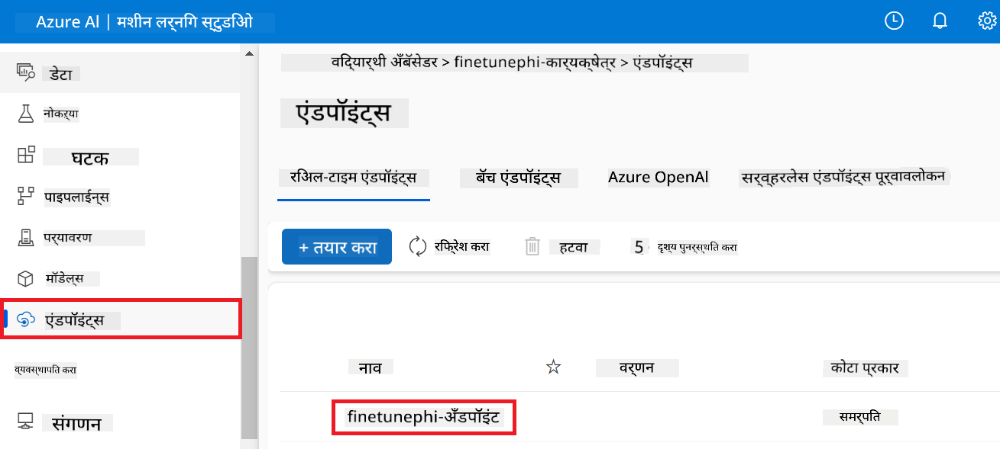

3. या पेजवर आपण डिप्लॉयमेंट प्रक्रियेदरम्यान तयार केलेले एन्डपॉइंट्स व्यवस्थापित करू शकता.

## Scenario 3: Prompt flow सोबत इंटिग्रेट करा आणि आपल्या कस्टम मॉडेलशी चॅट करा

### कस्टम Phi-3 मॉडेल Prompt flow सोबत इंटिग्रेट करा

आपले फाइन-ट्यून केलेले मॉडेल यशस्वीरित्या डिप्लॉय केल्यावर, आपण ते Prompt flow सोबत इंटिग्रेट करू शकता जेणेकरून आपल्या मॉडेलचा रिअल-टाइम अॅप्लिकेशन्समध्ये वापर करता येईल आणि आपल्या कस्टम Phi-3 मॉडेलसह विविध इंटरॅक्टिव टास्क करता येतील.

#### फाइन-ट्यून केलेल्या Phi-3 मॉडेलचा api key आणि endpoint uri सेट करा

1. आपण तयार केलेल्या Azure Machine Learning वर्कस्पेसकडे जा.
1. डाव्या बाजूच्या टॅबमधून **Endpoints** निवडा.
1. आपण तयार केलेला एन्डपॉइंट निवडा.
1. नेव्हिगेशन मेन्यूमधून **Consume** निवडा.
1. आपला **REST endpoint** कॉपी करून *config.py* फाइलमध्ये पेस्ट करा, आणि `AZURE_ML_ENDPOINT = "your_fine_tuned_model_endpoint_uri"` with your **REST endpoint**.
1. Copy and paste your **Primary key** into the *config.py* file, replacing `AZURE_ML_API_KEY = "your_fine_tuned_model_api_key"` मध्ये **Primary key** बदला.

    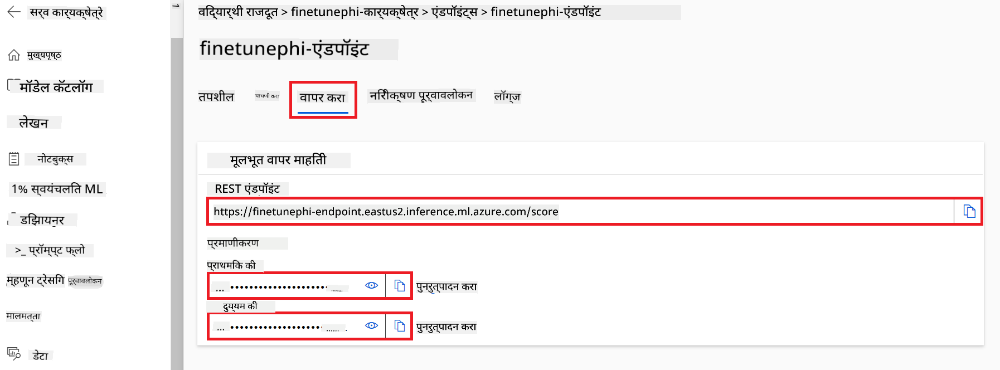

#### *flow.dag.yml* फाइलमध्ये कोड जोडा

1. Visual Studio Code मध्ये *flow.dag.yml* फाइल उघडा.

1. *flow.dag.yml* मध्ये खालील कोड जोडा.

    ```yml
    inputs:
      input_data:
        type: string
        default: "Who founded Microsoft?"

    outputs:
      answer:
        type: string
        reference: ${integrate_with_promptflow.output}

    nodes:
    - name: integrate_with_promptflow
      type: python
      source:
        type: code
        path: integrate_with_promptflow.py
      inputs:
        input_data: ${inputs.input_data}
    ```

#### *integrate_with_promptflow.py* फाइलमध्ये कोड जोडा

1. Visual Studio Code मध्ये *integrate_with_promptflow.py* फाइल उघडा.

1. *integrate_with_promptflow.py* मध्ये खालील कोड जोडा.

    ```python
    import logging
    import requests
    from promptflow.core import tool
    import asyncio
    import platform
    from config import (
        AZURE_ML_ENDPOINT,
        AZURE_ML_API_KEY
    )

    # Logging setup
    logging.basicConfig(
        format="%(asctime)s - %(levelname)s - %(name)s - %(message)s",
        datefmt="%Y-%m-%d %H:%M:%S",
        level=logging.DEBUG
    )
    logger = logging.getLogger(__name__)

    def query_azml_endpoint(input_data: list, endpoint_url: str, api_key: str) -> str:
        """
        Send a request to the Azure ML endpoint with the given input data.
        """
        headers = {
            "Content-Type": "application/json",
            "Authorization": f"Bearer {api_key}"
        }
        data = {
            "input_data": [input_data],
            "params": {
                "temperature": 0.7,
                "max_new_tokens": 128,
                "do_sample": True,
                "return_full_text": True
            }
        }
        try:
            response = requests.post(endpoint_url, json=data, headers=headers)
            response.raise_for_status()
            result = response.json()[0]
            logger.info("Successfully received response from Azure ML Endpoint.")
            return result
        except requests.exceptions.RequestException as e:
            logger.error(f"Error querying Azure ML Endpoint: {e}")
            raise

    def setup_asyncio_policy():
        """
        Setup asyncio event loop policy for Windows.
        """
        if platform.system() == 'Windows':
            asyncio.set_event_loop_policy(asyncio.WindowsSelectorEventLoopPolicy())
            logger.info("Set Windows asyncio event loop policy.")

    @tool
    def my_python_tool(input_data: str) -> str:
        """
        Tool function to process input data and query the Azure ML endpoint.
        """
        setup_asyncio_policy()
        return query_azml_endpoint(input_data, AZURE_ML_ENDPOINT, AZURE_ML_API_KEY)

    ```

### आपल्या कस्टम मॉडेलशी चॅट करा

1. *deploy_model.py* स्क्रिप्ट चालवून Azure Machine Learning मध्ये डिप्लॉयमेंट प्रक्रिया सुरू करण्यासाठी खालील कमांड टाइप करा.

    ```python
    pf flow serve --source ./ --port 8080 --host localhost
    ```

1. खालीलप्रमाणे निकाल येतील: आता आपण आपल्या कस्टम Phi-3 मॉडेलशी चॅट करू शकता. फाइन-ट्युनिंगसाठी वापरलेल्या डेटावर आधारित प्रश्न विचारणे सुचवले जाते.

    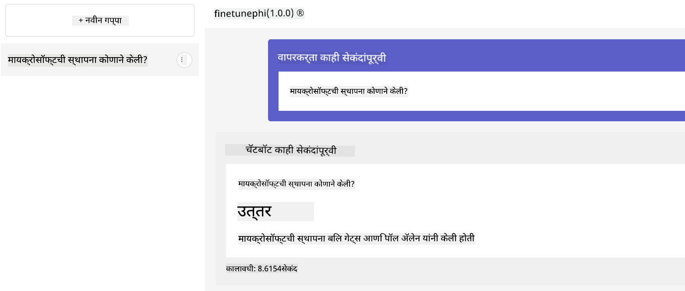

**अस्वीकरण**:  
हा दस्तऐवज AI भाषांतर सेवा [Co-op Translator](https://github.com/Azure/co-op-translator) वापरून भाषांतरित केला आहे. आम्ही अचूकतेसाठी प्रयत्न करतो, तरी कृपया लक्षात ठेवा की स्वयंचलित भाषांतरांमध्ये चुका किंवा अचूकतेचा अभाव असू शकतो. मूळ दस्तऐवज त्याच्या मूळ भाषेत अधिकृत स्रोत मानला जावा. महत्त्वाच्या माहितीसाठी व्यावसायिक मानवी भाषांतर शिफारसीय आहे. या भाषांतराच्या वापरामुळे उद्भवणाऱ्या कोणत्याही गैरसमजुती किंवा चुकीच्या अर्थलागी आम्ही जबाबदार नाही.