# कस्टम Phi-3 मॉडेल्सचे फाइन-ट्यून आणि प्रॉम्प्ट फ्लो सह एकत्रीकरण करा

हे एंड-टू-एंड (E2E) नमुना Microsoft Tech Community मधील "[प्रॉम्प्ट फ्लो सह कस्टम Phi-3 मॉडेल्सचे फाइन-ट्यून आणि एकत्रीकरण: स्टेप-बाय-स्टेप मार्गदर्शक](https://techcommunity.microsoft.com/t5/educator-developer-blog/fine-tune-and-integrate-custom-phi-3-models-with-prompt-flow/ba-p/4178612?WT.mc_id=aiml-137032-kinfeylo)" या मार्गदर्शकावर आधारित आहे. हे कस्टम Phi-3 मॉडेल्सचे फाइन-ट्यूनिंग, तैनाती आणि प्रॉम्प्ट फ्लो सह एकत्रीकरण प्रक्रियेचे परिचय देते.

## विहंगावलोकन

या E2E नमुन्यात, तुम्ही Phi-3 मॉडेलचे फाइन-ट्यून कसे करायचे आणि ते प्रॉम्प्ट फ्लो सह कसे एकत्र करायचे हे शिकाल. Azure Machine Learning आणि प्रॉम्प्ट फ्लो वापरून तुम्ही कस्टम AI मॉडेल्ससाठी तैनात करण्यासाठी आणि वापरण्यासाठी एक workflow स्थापन कराल. हा E2E नमुना तीन उपपरिस्थितींमध्ये विभागलेला आहे:

**उपपरिस्थिती 1: Azure संसाधने सेट करा आणि फाइन-ट्यूनिंगसाठी तयार व्हा**

**उपपरिस्थिती 2: Phi-3 मॉडेलचे फाइन-ट्यून करा आणि Azure Machine Learning Studio मध्ये तैनात करा**

**उपपरिस्थिती 3: प्रॉम्प्ट फ्लो सह एकत्रीकरण करा आणि तुमच्या कस्टम मॉडेलसोबत चॅट करा**

येथे या E2E नमुन्याचे विहंगावलोकन आहे.

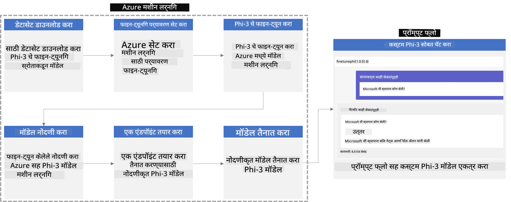

### सामग्रीचा तपशील

1. **[उपपरिस्थिती 1: Azure संसाधने सेट करा आणि फाइन-ट्यूनिंगसाठी तयार व्हा](../../../../../../md/02.Application/01.TextAndChat/Phi3)**
    - [Azure Machine Learning Workspace तयार करा](../../../../../../md/02.Application/01.TextAndChat/Phi3)
    - [Azure सदस्यत्वात GPU कोटा विनंती करा](../../../../../../md/02.Application/01.TextAndChat/Phi3)
    - [भूमिका नियुक्ती जोडा](../../../../../../md/02.Application/01.TextAndChat/Phi3)
    - [प्रोजेक्ट सेट करा](../../../../../../md/02.Application/01.TextAndChat/Phi3)
    - [फाइन-ट्यूनिंगसाठी डेटासेट तयार करा](../../../../../../md/02.Application/01.TextAndChat/Phi3)

1. **[उपपरिस्थिती 2: Phi-3 मॉडेलचे फाइन-ट्यून करा आणि Azure Machine Learning Studio मध्ये तैनात करा](../../../../../../md/02.Application/01.TextAndChat/Phi3)**
    - [Azure CLI सेट करा](../../../../../../md/02.Application/01.TextAndChat/Phi3)
    - [Phi-3 मॉडेलचा फाइन-ट्यून करा](../../../../../../md/02.Application/01.TextAndChat/Phi3)
    - [फाइन-ट्यून केलेले मॉडेल तैनात करा](../../../../../../md/02.Application/01.TextAndChat/Phi3)

1. **[उपपरिस्थिती 3: प्रॉम्प्ट फ्लो सह एकत्रीकरण करा आणि तुमच्या कस्टम मॉडेलसोबत चॅट करा](../../../../../../md/02.Application/01.TextAndChat/Phi3)**
    - [कस्टम Phi-3 मॉडेल प्रॉम्प्ट फ्लो सह एकत्र करा](../../../../../../md/02.Application/01.TextAndChat/Phi3)
    - [तुमच्या कस्टम मॉडेलसोबत चॅट करा](../../../../../../md/02.Application/01.TextAndChat/Phi3)

## उपपरिस्थिती 1: Azure संसाधने सेट करा आणि फाइन-ट्यूनिंगसाठी तयार व्हा

### Azure Machine Learning Workspace तयार करा

1. पोर्टल पेजच्या वरच्या बाजूला असलेल्या **शोध पट्टीत** *azure machine learning* टाइप करा आणि दिसणाऱ्या पर्यायांमधून **Azure Machine Learning** निवडा.

    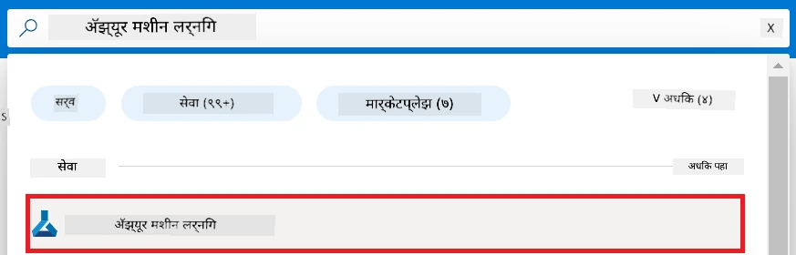

1. नेव्हिगेशन मेनूमधून **+ Create** निवडा.

1. नेव्हिगेशन मेनूमधून **New workspace** निवडा.

    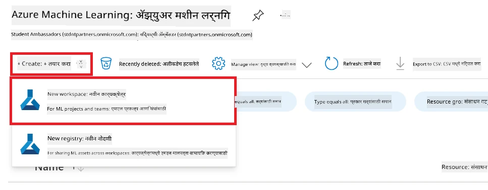

1. पुढील कामगिरी करा:

    - तुमचे Azure **Subscription** निवडा.
    - वापरण्यासाठी **Resource group** निवडा (आवश्यक असल्यास नवीन तयार करा).
    - **Workspace Name** टाका. हे एक अद्वितीय मूल्य असावे.
    - तुम्हाला हवा असलेला **Region** निवडा.
    - वापरण्यासाठी **Storage account** निवडा (आवश्यक असल्यास नवीन तयार करा).
    - वापरण्यासाठी **Key vault** निवडा (आवश्यक असल्यास नवीन तयार करा).
    - वापरण्यासाठी **Application insights** निवडा (आवश्यक असल्यास नवीन तयार करा).
    - वापरण्यासाठी **Container registry** निवडा (आवश्यक असल्यास नवीन तयार करा).

    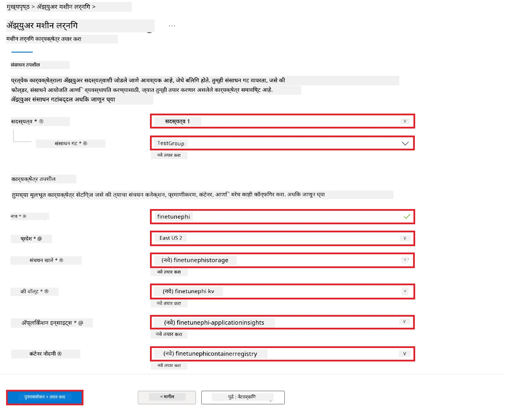

1. **Review + Create** निवडा.

1. **Create** निवडा.

### Azure सदस्यत्वात GPU कोटा विनंती करा

या E2E नमुन्यात, तुम्ही फाइन-ट्यूनिंगसाठी *Standard_NC24ads_A100_v4 GPU* वापराल, ज्यासाठी कोटा विनंती आवश्यक आहे, आणि तैनातीसाठी *Standard_E4s_v3* CPU वापराल, ज्यासाठी कोटा विनंती आवश्यक नाही.

> [!NOTE]
>
> फक्त Pay-As-You-Go सदस्यता (मानक सदस्यता प्रकार) GPU वाटपासाठी पात्र आहेत; लाभ सदस्यता सध्या समर्थित नाहीत.
>
> लाभ सदस्यता वापरणाऱ्यांसाठी (जसे Visual Studio Enterprise Subscription) किंवा फाइन-ट्यूनिंग आणि तैनाती प्रक्रियेचे जलद परीक्षण करणाऱ्यांसाठी, हा ट्युटोरियल CPU वापरून एक लहान डेटासेटसह फाइन-ट्यूनिंग कसे करायचे याचे मार्गदर्शन देखील देते. पण लक्षात ठेवा की GPU वापरून मोठ्या डेटासेटसह फाइन-ट्यूनिंगचे परिणाम लक्षणीयपणे चांगले असतात.

1. भेट द्या [Azure ML Studio](https://ml.azure.com/home?wt.mc_id=studentamb_279723).

1. *Standard NCADSA100v4 Family* कोटा विनंती करण्यासाठी पुढील कामगिरी करा:

    - डाव्या बाजूच्या टॅबमधून **Quota** निवडा.
    - वापरण्यासाठी **Virtual machine family** निवडा. उदाहरणार्थ, *Standard NCADSA100v4 Family Cluster Dedicated vCPUs*, ज्यामध्ये *Standard_NC24ads_A100_v4* GPU समाविष्ट आहे.
    - नेव्हिगेशन मेनूमधून **Request quota** निवडा.

        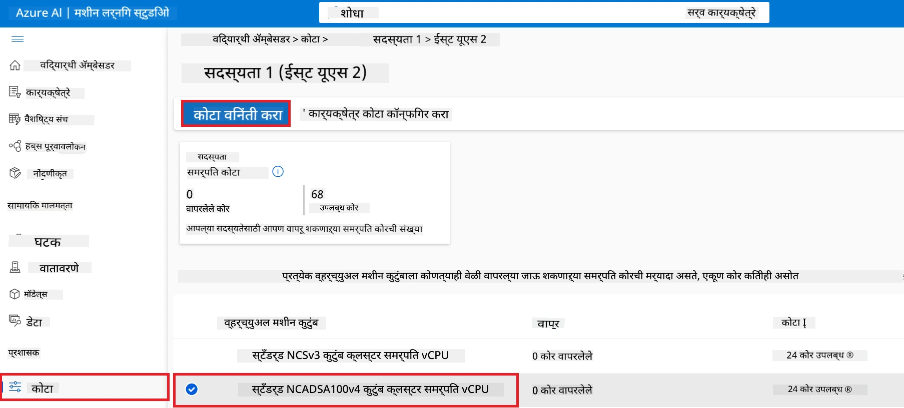

    - Request quota पृष्ठावर, तुम्हाला हवा असलेला **New cores limit** टाका. उदाहरणार्थ, 24.
    - Request quota पृष्ठावर, GPU कोटा विनंती करण्यासाठी **Submit** निवडा.

> [!NOTE]
> तुमच्या गरजेनुसार GPU किंवा CPU निवडण्यासाठी [Sizes for Virtual Machines in Azure](https://learn.microsoft.com/azure/virtual-machines/sizes/overview?tabs=breakdownseries%2Cgeneralsizelist%2Ccomputesizelist%2Cmemorysizelist%2Cstoragesizelist%2Cgpusizelist%2Cfpgasizelist%2Chpcsizelist) दस्तऐवजाचा संदर्भ घ्या.

### भूमिका नियुक्ती जोडा

तुमची मॉडेल्स फाइन-ट्यून आणि तैनात करण्यासाठी, तुम्हाला प्रथम User Assigned Managed Identity (UAI) तयार करावी लागेल आणि त्याला योग्य परवानग्या द्याव्या लागतील. ही UAI तैनाती दरम्यान प्रमाणीकरणासाठी वापरली जाईल.

#### User Assigned Managed Identity (UAI) तयार करा

1. पोर्टल पेजच्या वरच्या बाजूला असलेल्या **शोध पट्टीत** *managed identities* टाइप करा आणि दिसणाऱ्या पर्यायांमधून **Managed Identities** निवडा.

    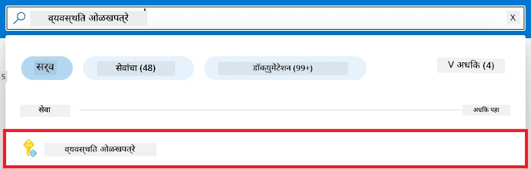

1. **+ Create** निवडा.

    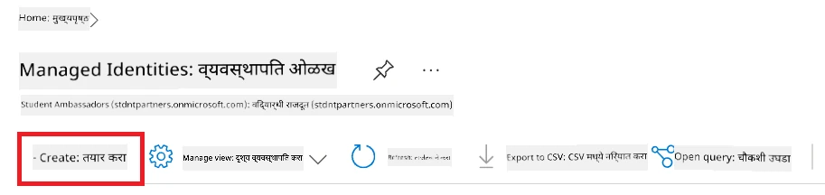

1. पुढील कामगिरी करा:

    - तुमचे Azure **Subscription** निवडा.
    - वापरण्यासाठी **Resource group** निवडा (आवश्यक असल्यास नवीन तयार करा).
    - तुम्हाला हवा असलेला **Region** निवडा.
    - **Name** टाका. हे एक अद्वितीय मूल्य असावे.

1. **Review + create** निवडा.

1. **+ Create** निवडा.

#### Managed Identity ला Contributor भूमिका नियुक्ती जोडा

1. तुम्ही तयार केलेल्या Managed Identity संसाधनावर जा.

1. डाव्या बाजूच्या टॅबमधून **Azure role assignments** निवडा.

1. नेव्हिगेशन मेनूमधून **+Add role assignment** निवडा.

1. Add role assignment पृष्ठावर पुढील कामगिरी करा:
    - **Scope** म्हणून **Resource group** निवडा.
    - तुमचे Azure **Subscription** निवडा.
    - वापरण्यासाठी **Resource group** निवडा.
    - **Role** म्हणून **Contributor** निवडा.

    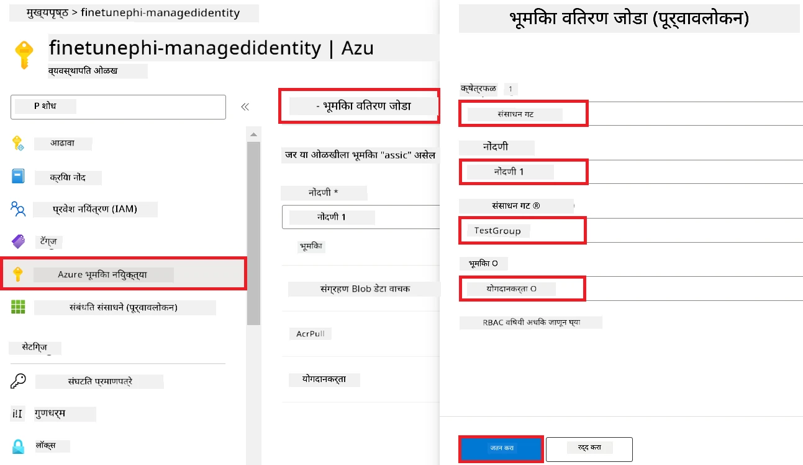

1. **Save** निवडा.

#### Managed Identity ला Storage Blob Data Reader भूमिका नियुक्ती जोडा

1. पोर्टलच्या वरच्या शोध पट्टीत *storage accounts* टाइप करा आणि दिसणाऱ्या पर्यायांमधून **Storage accounts** निवडा.

    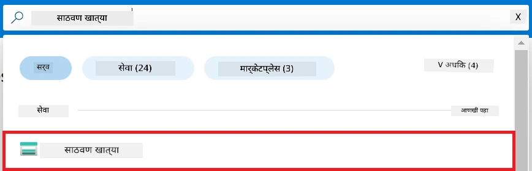

1. Azure Machine Learning workspace सोबत संबंधित स्टोरेज अकाउंट निवडा. उदाहरणार्थ, *finetunephistorage*.

1. Add role assignment पृष्ठावर जाण्यासाठी पुढील कामगिरी करा:

    - तुम्ही तयार केलेल्या Azure Storage अकाउंटवर जा.
    - डाव्या बाजूच्या टॅबमधून **Access Control (IAM)** निवडा.
    - नेव्हिगेशन मेनूमधून **+ Add** निवडा.
    - **Add role assignment** निवडा.

    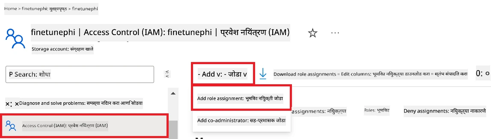

1. Add role assignment पृष्ठावर पुढील काम करा:

    - Role पृष्ठावर **search bar** मध्ये *Storage Blob Data Reader* टाइप करा आणि दिसणाऱ्या पर्यायांमधून **Storage Blob Data Reader** निवडा.
    - Role पृष्ठावर **Next** निवडा.
    - Members पृष्ठावर, **Assign access to** म्हणून **Managed identity** निवडा.
    - Members पृष्ठावर **+ Select members** निवडा.
    - Select managed identities पृष्ठावर तुमचे Azure **Subscription** निवडा.
    - Select managed identities पृष्ठावर **Managed identity** म्हणून **Manage Identity** निवडा.
    - Select managed identities पृष्ठावर तुम्ही तयार केलेली Manage Identity निवडा. उदाहरणार्थ, *finetunephi-managedidentity*.
    - Select managed identities पृष्ठावर **Select** निवडा.

    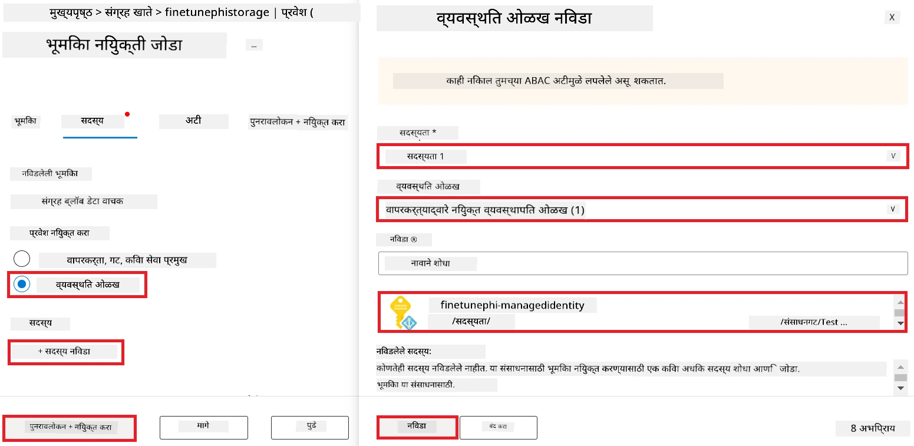

1. **Review + assign** निवडा.

#### Managed Identity ला AcrPull भूमिका नियुक्ती जोडा

1. पोर्टलच्या वरच्या शोध पट्टीत *container registries* टाइप करा आणि दिसणाऱ्या पर्यायांमधून **Container registries** निवडा.

    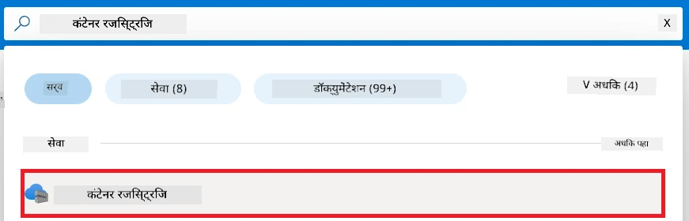

1. Azure Machine Learning workspace सोबत संबंधित कंटेनर रजीस्ट्रि निवडा. उदाहरणार्थ, *finetunephicontainerregistries*

1. Add role assignment पृष्ठावर जाण्यासाठी पुढील कामगिरी करा:

    - डाव्या बाजूच्या टॅबमधून **Access Control (IAM)** निवडा.
    - नेव्हिगेशन मेनूमधून **+ Add** निवडा.
    - **Add role assignment** निवडा.

1. Add role assignment पृष्ठावर पुढील काम करा:

    - Role पृष्ठावर **search bar** मध्ये *AcrPull* टाइप करा आणि दिसणाऱ्या पर्यायांमधून **AcrPull** निवडा.
    - Role पृष्ठावर **Next** निवडा.
    - Members पृष्ठावर, **Assign access to** म्हणून **Managed identity** निवडा.
    - Members पृष्ठावर **+ Select members** निवडा.
    - Select managed identities पृष्ठावर तुमचे Azure **Subscription** निवडा.
    - Select managed identities पृष्ठावर **Managed identity** म्हणून **Manage Identity** निवडा.
    - Select managed identities पृष्ठावर तुम्ही तयार केलेली Manage Identity निवडा. उदाहरणार्थ, *finetunephi-managedidentity*.
    - Select managed identities पृष्ठावर **Select** निवडा.
    - **Review + assign** निवडा.

### प्रोजेक्ट सेट करा

आता, तुम्ही काम करण्यासाठी एक फोल्डर तयार कराल आणि एक वर्चुअल एन्व्हायर्नमेंट सेट कराल, जे वापरकर्त्यांशी संवाद साधणारे प्रोग्राम विकसित करेल आणि Azure Cosmos DB मधील संग्रहित चॅट इतिहास वापरून त्याचे प्रतिसाद सूचित करेल.

#### काम करण्यासाठी एक फोल्डर तयार करा

1. एक टर्मिनल विंडो उघडा आणि डिफॉल्ट पथात *finetune-phi* नावाचा फोल्डर तयार करण्यासाठी खालील आदेश टाइप करा.

    ```console
    mkdir finetune-phi
    ```

1. खालील आदेश टर्मिनलमध्ये टाइप करा जेणेकरून तुम्ही तयार केलेल्या *finetune-phi* फोल्डरमध्ये जाल.

    ```console
    cd finetune-phi
    ```

#### वर्चुअल एन्व्हायर्नमेंट तयार करा

1. टर्मिनलमध्ये खालील आदेश टाइप करा म्हणजे *.venv* नावाचा वर्चुअल एन्व्हायर्नमेंट तयार होईल.

    ```console
    python -m venv .venv
    ```

1. वर्चुअल एन्व्हायर्नमेंट सक्रिय करण्यासाठी टर्मिनलमध्ये खालील आदेश टाइप करा.

    ```console
    .venv\Scripts\activate.bat
    ```

> [!NOTE]
>
> जर ते यशस्वी झाले, तर कमांड प्रॉम्प्टच्या आधी *(.venv)* दिसेल.

#### आवश्यक पॅकेजेस इन्स्टॉल करा

1. आवश्यक पॅकेजेस इन्स्टॉल करण्यासाठी टर्मिनलमध्ये खालील आदेश टाइप करा.

    ```console
    pip install datasets==2.19.1
    pip install transformers==4.41.1
    pip install azure-ai-ml==1.16.0
    pip install torch==2.3.1
    pip install trl==0.9.4
    pip install promptflow==1.12.0
    ```

#### प्रोजेक्ट फायली तयार करा
या व्यायामात, आपण आपल्या प्रकल्पासाठी अत्यावश्यक फाईली तयार कराल. या फाइलांमध्ये डेटासेट डाउनलोड करण्यासाठी स्क्रिप्ट्स, Azure मशीन लर्निंग वातावरण सेटअप करणे, Phi-3 मॉडेलचे फाइन-ट्यूनिंग करणे, आणि फाइन-ट्यून केलेले मॉडेल डिप्लॉय करणे यांचा समावेश आहे. आपण फाइन-ट्यूनिंग वातावरण सेट करण्यासाठी *conda.yml* फाइल देखील तयार कराल.

या व्यायामात, आपण हे करणार आहात:

- डेटासेट डाउनलोड करण्यासाठी *download_dataset.py* फाइल तयार करा.
- Azure मशीन लर्निंग वातावरण सेट करण्यासाठी *setup_ml.py* फाइल तयार करा.
- *finetuning_dir* फोल्डरमध्ये *fine_tune.py* फाइल तयार करा ज्याद्वारे Phi-3 मॉडेल डेटासेट वापरून फाइन-ट्यून केले जाईल.
- फाइन-ट्यूनिंग वातावरण सेट करण्यासाठी *conda.yml* फाइल तयार करा.
- फाइन-ट्यून केलेले मॉडेल डिप्लॉय करण्यासाठी *deploy_model.py* फाइल तयार करा.
- फाइन-ट्यून केलेले मॉडेल एकत्रित करण्यासाठी आणि Prompt flow वापरून मॉडेल चालवण्यासाठी *integrate_with_promptflow.py* फाइल तयार करा.
- Prompt flow साठी वर्कफ्लो संरचना सेट करण्यासाठी flow.dag.yml फाइल तयार करा.
- Azure माहिती प्रविष्ट करण्यासाठी *config.py* फाइल तयार करा.

> [!NOTE]
>
> पूर्ण फोल्डर रचना:
>
> ```text
> └── YourUserName
> .    └── finetune-phi
> .        ├── finetuning_dir
> .        │      └── fine_tune.py
> .        ├── conda.yml
> .        ├── config.py
> .        ├── deploy_model.py
> .        ├── download_dataset.py
> .        ├── flow.dag.yml
> .        ├── integrate_with_promptflow.py
> .        └── setup_ml.py
> ```

1. **Visual Studio Code** उघडा.

1. मेनूबारमधून **File** निवडा.

1. **Open Folder** निवडा.

1. आपण तयार केलेला *finetune-phi* फोल्डर निवडा, जो *C:\Users\yourUserName\finetune-phi* येथे आहे.

    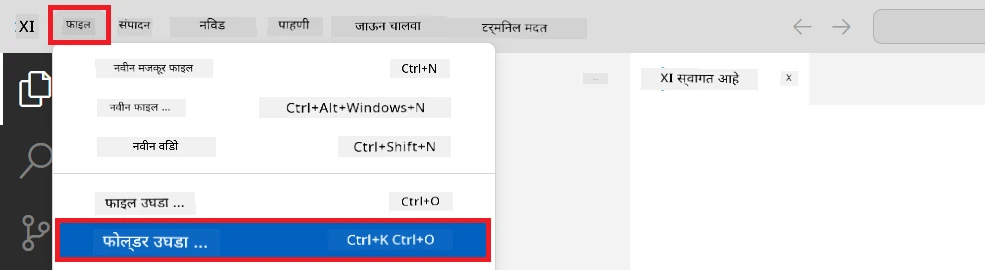

1. Visual Studio Code च्या डाव्या पॅनलमध्ये, राइट-क्लिक करा आणि नवीन फाइल तयार करण्यासाठी **New File** निवडा, नंतर *download_dataset.py* नावाची फाइल तयार करा.

1. Visual Studio Code च्या डाव्या पॅनलमध्ये, राइट-क्लिक करा आणि नवीन फाइल तयार करण्यासाठी **New File** निवडा, नंतर *setup_ml.py* नावाची फाइल तयार करा.

1. Visual Studio Code च्या डाव्या पॅनलमध्ये, राइट-क्लिक करा आणि नवीन फाइल तयार करण्यासाठी **New File** निवडा, नंतर *deploy_model.py* नावाची फाइल तयार करा.

    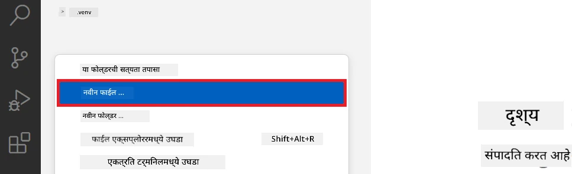

1. Visual Studio Code च्या डाव्या पॅनलमध्ये, राइट-क्लिक करा आणि नवीन फोल्डर तयार करण्यासाठी **New Folder** निवडा आणि *finetuning_dir* नावाचा फोल्डर तयार करा.

1. *finetuning_dir* फोल्डरमध्ये *fine_tune.py* नावाची नवीन फाइल तयार करा.

#### *conda.yml* फाइल तयार करा आणि कॉन्फिगर करा

1. Visual Studio Code च्या डाव्या पॅनलमध्ये, राइट-क्लिक करा आणि नवीन फाइल तयार करण्यासाठी **New File** निवडा आणि *conda.yml* नावाची फाइल तयार करा.

1. फाइन-ट्यूनिंग वातावरणासाठी खालील कोड *conda.yml* फाइलमध्ये जोडा.

    ```yml
    name: phi-3-training-env
    channels:
      - defaults
      - conda-forge
    dependencies:
      - python=3.10
      - pip
      - numpy<2.0
      - pip:
          - torch==2.4.0
          - torchvision==0.19.0
          - trl==0.8.6
          - transformers==4.41
          - datasets==2.21.0
          - azureml-core==1.57.0
          - azure-storage-blob==12.19.0
          - azure-ai-ml==1.16
          - azure-identity==1.17.1
          - accelerate==0.33.0
          - mlflow==2.15.1
          - azureml-mlflow==1.57.0
    ```

#### *config.py* फाइल तयार करा आणि कॉन्फिगर करा

1. Visual Studio Code च्या डाव्या पॅनलमध्ये, राइट-क्लिक करा आणि नवीन फाइल तयार करण्यासाठी **New File** निवडा आणि *config.py* नावाची फाइल तयार करा.

1. खालील कोड *config.py* फाइलमध्ये जोडा ज्यामध्ये आपली Azure माहिती समाविष्ट आहे.

    ```python
    # Azure सेटिंग्ज
    AZURE_SUBSCRIPTION_ID = "your_subscription_id"
    AZURE_RESOURCE_GROUP_NAME = "your_resource_group_name" # "TestGroup"

    # Azure मशीन लर्निंग सेटिंग्ज
    AZURE_ML_WORKSPACE_NAME = "your_workspace_name" # "finetunephi-workspace"

    # Azure मॅनेज्ड आयडेंटिटी सेटिंग्ज
    AZURE_MANAGED_IDENTITY_CLIENT_ID = "your_azure_managed_identity_client_id"
    AZURE_MANAGED_IDENTITY_NAME = "your_azure_managed_identity_name" # "finetunephi-mangedidentity"
    AZURE_MANAGED_IDENTITY_RESOURCE_ID = f"/subscriptions/{AZURE_SUBSCRIPTION_ID}/resourceGroups/{AZURE_RESOURCE_GROUP_NAME}/providers/Microsoft.ManagedIdentity/userAssignedIdentities/{AZURE_MANAGED_IDENTITY_NAME}"

    # डेटासेट फाइल मार्ग
    TRAIN_DATA_PATH = "data/train_data.jsonl"
    TEST_DATA_PATH = "data/test_data.jsonl"

    # फाईन-ट्यून केलेल्या मॉडेल सेटिंग्ज
    AZURE_MODEL_NAME = "your_fine_tuned_model_name" # "finetune-phi-model"
    AZURE_ENDPOINT_NAME = "your_fine_tuned_model_endpoint_name" # "finetune-phi-endpoint"
    AZURE_DEPLOYMENT_NAME = "your_fine_tuned_model_deployment_name" # "finetune-phi-deployment"

    AZURE_ML_API_KEY = "your_fine_tuned_model_api_key"
    AZURE_ML_ENDPOINT = "your_fine_tuned_model_endpoint_uri" # "https://{your-endpoint-name}.{your-region}.inference.ml.azure.com/score"
    ```

#### Azure पर्यावरणीय व्हेरिएबल जोडा

1. Azure Subscription ID जोडण्यासाठी खालील टास्क करा:

    - पोर्टल पेजच्या वरच्या **search bar** मध्ये *subscriptions* टाइप करा आणि दिसणाऱ्या पर्यायांमधून **Subscriptions** निवडा.
    - सध्या वापरात असलेली Azure Subscription निवडा.
    - आपला Subscription ID *config.py* फाइलमध्ये कॉपी-पेस्ट करा.

    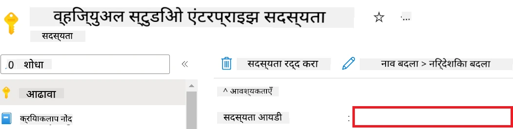

1. Azure Workspace नाव जोडण्यासाठी खालील टास्क करा:

    - आपण तयार केलेल्या Azure मशीन लर्निंग संसाधनाकडे जा.
    - आपले अकाउंट नाव *config.py* फाइलमध्ये कॉपी-पेस्ट करा.

    

1. Azure Resource Group नाव जोडण्यासाठी खालील टास्क करा:

    - आपण तयार केलेल्या Azure मशीन लर्निंग संसाधनाकडे जा.
    - आपल्या Azure Resource Group नाव *config.py* फाइलमध्ये कॉपी-पेस्ट करा.

    

2. Azure Managed Identity नाव जोडण्यासाठी खालील टास्क करा:

    - आपण तयार केलेल्या Managed Identities संसाधनाकडे जा.
    - आपले Azure Managed Identity नाव *config.py* फाइलमध्ये कॉपी-पेस्ट करा.

    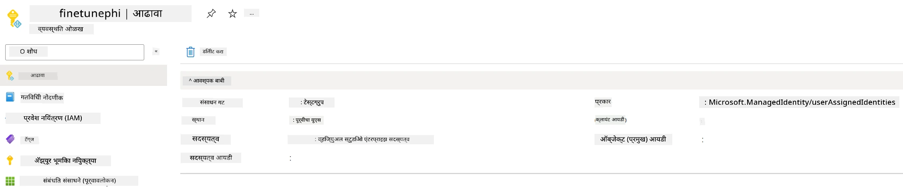

### फाइन-ट्यूनिंगसाठी डेटासेट तयार करा

या व्यायामात, आपण *download_dataset.py* फाइल चालवून *ULTRACHAT_200k* डेटासेट आपल्या स्थानिक वातावरणात डाउनलोड कराल. नंतर आपण हा डेटासेट वापरून Azure मशीन लर्निंगमध्ये Phi-3 मॉडेलचे फाइन-ट्यूनिंग कराल.

#### *download_dataset.py* वापरून आपले डेटासेट डाउनलोड करा

1. Visual Studio Code मध्ये *download_dataset.py* फाइल उघडा.

1. *download_dataset.py* मध्ये खालील कोड जोडा.

    ```python
    import json
    import os
    from datasets import load_dataset
    from config import (
        TRAIN_DATA_PATH,
        TEST_DATA_PATH)

    def load_and_split_dataset(dataset_name, config_name, split_ratio):
        """
        Load and split a dataset.
        """
        # निर्दिष्ट नाव, कॉन्फिगरेशन आणि विभाग प्रमाणांसह डेटासेट लोड करा
        dataset = load_dataset(dataset_name, config_name, split=split_ratio)
        print(f"Original dataset size: {len(dataset)}")
        
        # डेटासेटचे ट्रेन आणि टेस्ट सेटमध्ये विभाजन करा (80% ट्रेन, 20% टेस्ट)
        split_dataset = dataset.train_test_split(test_size=0.2)
        print(f"Train dataset size: {len(split_dataset['train'])}")
        print(f"Test dataset size: {len(split_dataset['test'])}")
        
        return split_dataset

    def save_dataset_to_jsonl(dataset, filepath):
        """
        Save a dataset to a JSONL file.
        """
        # जर निर्देशिका अस्तित्वात नसेल तर ती तयार करा
        os.makedirs(os.path.dirname(filepath), exist_ok=True)
        
        # फाइल लेखन मोडमध्ये उघडा
        with open(filepath, 'w', encoding='utf-8') as f:
            # डेटासेटमधील प्रत्येक नोंदीवर पुनरावृत्ती करा
            for record in dataset:
                # नोंदीला JSON ऑब्जेक्ट म्हणून डंप करा आणि फाइलमध्ये लिहा
                json.dump(record, f)
                # नोंदी वेगळ्या करण्यासाठी न्यूलाईन कॅरेक्टर लिहा
                f.write('\n')
        
        print(f"Dataset saved to {filepath}")

    def main():
        """
        Main function to load, split, and save the dataset.
        """
        # विशिष्ट कॉन्फिगरेशन आणि विभाग प्रमाणांसह ULTRACHAT_200k डेटासेट लोड आणि विभाजित करा
        dataset = load_and_split_dataset("HuggingFaceH4/ultrachat_200k", 'default', 'train_sft[:1%]')
        
        # विभागातून ट्रेन आणि टेस्ट डेटासेट एक्स्ट्रॅक्ट करा
        train_dataset = dataset['train']
        test_dataset = dataset['test']

        # ट्रेन डेटासेट JSONL फाइलमध्ये जतन करा
        save_dataset_to_jsonl(train_dataset, TRAIN_DATA_PATH)
        
        # टेस्ट डेटासेट वेगळी JSONL फाइलमध्ये जतन करा
        save_dataset_to_jsonl(test_dataset, TEST_DATA_PATH)

    if __name__ == "__main__":
        main()

    ```

> [!TIP]
>
> **CPU वापरून कमी डेटासेटसह फाइन-ट्यूनिंगसाठी मार्गदर्शन**
>
> जर आपण CPU वापरून फाइन-ट्यूनिंग करायचे असेल, तर ही पद्धत विशेषतः लाभ घेणाऱ्या सब्सक्रिप्शन्ससाठी (जसे की Visual Studio Enterprise Subscription) किंवा फाइन-ट्यूनिंग आणि डिप्लॉयमेंट प्रक्रियेची त्वरीत तपासणी करण्यासाठी उपयुक्त आहे.
>
> `dataset = load_and_split_dataset("HuggingFaceH4/ultrachat_200k", 'default', 'train_sft[:1%]')` या ओळीऐवजी `dataset = load_and_split_dataset("HuggingFaceH4/ultrachat_200k", 'default', 'train_sft[:10]')` वापरा.
>

1. टर्मिनलमध्ये पुढील कमांड टाइप करा जेणेकरून स्क्रिप्ट चालेल आणि डेटासेट आपल्या स्थानिक वातावरणात डाउनलोड होईल.

    ```console
    python download_data.py
    ```

1. खात्री करा की डेटासेट यशस्वीरित्या आपल्या स्थानिक *finetune-phi/data* डिरेक्टरीत जतन झाले आहेत.

> [!NOTE]
>
> **डेटासेटचा आकार आणि फाइन-ट्यूनिंगचा वेळ**
>
> या E2E नमुन्यात, आपण केवळ डेटासेटचा 1% (`train_sft[:1%]`) वापरता. यामुळे डेटाचे प्रमाण लक्षणीयरीत्या कमी होते, ज्यामुळे अपलोड आणि फाइन-ट्यूनिंग प्रक्रिया दोन्ही जलद होतात. आपण प्रशिक्षण वेळ आणि मॉडेल कामगिरी यामध्ये योग्य समतोल साधण्यासाठी टक्केवारी समायोजित करू शकता. डेटासेटचा लहान उपसंच वापरणे फाइन-ट्यूनिंगसाठी लागणारा वेळ कमी करते, ज्यामुळे ही प्रक्रिया E2E नमुन्यासाठी अधिक व्यवस्थापनीय होते.

## परिस्थिती 2: Azure मशीन लर्निंग स्टुडिओमध्ये Phi-3 मॉडेलचे फाइन-ट्यूनिंग करा आणि डिप्लॉय करा

### Azure CLI सेटअप करा

आपल्याला Azure CLI सेटअप करणे आवश्यक आहे ज्यामुळे आपले वातावरण प्रमाणीकृत होईल. Azure CLI वापरून आपण कमांड लाइनवरून Azure संसाधने थेट व्यवस्थापित करू शकता आणि Azure मशीन लर्निंगसाठी आवश्यक क्रेडेन्शियल्स प्रदान करता येतात. सुरुवात करण्यासाठी [Azure CLI](https://learn.microsoft.com/cli/azure/install-azure-cli) इन्स्टॉल करा.

1. टर्मिनल विंडो उघडा आणि Azure खात्यात लॉग इन करण्यासाठी खालील कमांड टाइप करा.

    ```console
    az login
    ```

1. वापरायचे Azure खाते निवडा.

1. वापरायची Azure सब्सक्रिप्शन निवडा.

    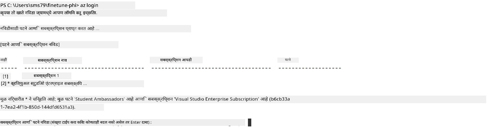

> [!TIP]
>
> Azure मध्ये लॉगिन करताना अडचण आहे का? तर डिव्हाइस कोड वापरून पाहा. टर्मिनल विंडो उघडा आणि खालील कमांड टाइप करा:
>
> ```console
> az login --use-device-code
> ```
>

### Phi-3 मॉडेल फाइन-ट्यून करा

या व्यायामात, आपण दिलेल्या डेटासेटचा वापर करून Phi-3 मॉडेल फाइन-ट्यून कराल. प्रथम, *fine_tune.py* फाइलमध्ये फाइन-ट्यूनिंग प्रक्रिया परिभाषित कराल. नंतर, Azure मशीन लर्निंग वातावरण सेट करण्यासाठी आणि फाइन-ट्यूनिंग प्रक्रिया सुरू करण्यासाठी *setup_ml.py* फाइल चालवाल. ही स्क्रिप्ट सुनिश्चित करते की फाइन-ट्यूनिंग Azure मशीन लर्निंग वातावरणातच होईल.

*setup_ml.py* चालवून, आपण फाइन-ट्यूनिंग प्रक्रिया Azure मशीन लर्निंग वातावरणात सुरू कराल.

#### *fine_tune.py* फाइलमध्ये कोड जोडा

1. *finetuning_dir* फोल्डरमध्ये जा आणि Visual Studio Code मध्ये *fine_tune.py* फाइल उघडा.

1. *fine_tune.py* मध्ये खालील कोड जोडा.

    ```python
    import argparse
    import sys
    import logging
    import os
    from datasets import load_dataset
    import torch
    import mlflow
    from transformers import AutoModelForCausalLM, AutoTokenizer, TrainingArguments
    from trl import SFTTrainer

    # MLflow मध्ये INVALID_PARAMETER_VALUE त्रुटी टाळण्यासाठी, MLflow समाकलन अक्षम करा
    os.environ["DISABLE_MLFLOW_INTEGRATION"] = "True"

    # लॉगिंग सेटअप
    logging.basicConfig(
        format="%(asctime)s - %(levelname)s - %(name)s - %(message)s",
        datefmt="%Y-%m-%d %H:%M:%S",
        handlers=[logging.StreamHandler(sys.stdout)],
        level=logging.WARNING
    )
    logger = logging.getLogger(__name__)

    def initialize_model_and_tokenizer(model_name, model_kwargs):
        """
        Initialize the model and tokenizer with the given pretrained model name and arguments.
        """
        model = AutoModelForCausalLM.from_pretrained(model_name, **model_kwargs)
        tokenizer = AutoTokenizer.from_pretrained(model_name)
        tokenizer.model_max_length = 2048
        tokenizer.pad_token = tokenizer.unk_token
        tokenizer.pad_token_id = tokenizer.convert_tokens_to_ids(tokenizer.pad_token)
        tokenizer.padding_side = 'right'
        return model, tokenizer

    def apply_chat_template(example, tokenizer):
        """
        Apply a chat template to tokenize messages in the example.
        """
        messages = example["messages"]
        if messages[0]["role"] != "system":
            messages.insert(0, {"role": "system", "content": ""})
        example["text"] = tokenizer.apply_chat_template(
            messages, tokenize=False, add_generation_prompt=False
        )
        return example

    def load_and_preprocess_data(train_filepath, test_filepath, tokenizer):
        """
        Load and preprocess the dataset.
        """
        train_dataset = load_dataset('json', data_files=train_filepath, split='train')
        test_dataset = load_dataset('json', data_files=test_filepath, split='train')
        column_names = list(train_dataset.features)

        train_dataset = train_dataset.map(
            apply_chat_template,
            fn_kwargs={"tokenizer": tokenizer},
            num_proc=10,
            remove_columns=column_names,
            desc="Applying chat template to train dataset",
        )

        test_dataset = test_dataset.map(
            apply_chat_template,
            fn_kwargs={"tokenizer": tokenizer},
            num_proc=10,
            remove_columns=column_names,
            desc="Applying chat template to test dataset",
        )

        return train_dataset, test_dataset

    def train_and_evaluate_model(train_dataset, test_dataset, model, tokenizer, output_dir):
        """
        Train and evaluate the model.
        """
        training_args = TrainingArguments(
            bf16=True,
            do_eval=True,
            output_dir=output_dir,
            eval_strategy="epoch",
            learning_rate=5.0e-06,
            logging_steps=20,
            lr_scheduler_type="cosine",
            num_train_epochs=3,
            overwrite_output_dir=True,
            per_device_eval_batch_size=4,
            per_device_train_batch_size=4,
            remove_unused_columns=True,
            save_steps=500,
            seed=0,
            gradient_checkpointing=True,
            gradient_accumulation_steps=1,
            warmup_ratio=0.2,
        )

        trainer = SFTTrainer(
            model=model,
            args=training_args,
            train_dataset=train_dataset,
            eval_dataset=test_dataset,
            max_seq_length=2048,
            dataset_text_field="text",
            tokenizer=tokenizer,
            packing=True
        )

        train_result = trainer.train()
        trainer.log_metrics("train", train_result.metrics)

        mlflow.transformers.log_model(
            transformers_model={"model": trainer.model, "tokenizer": tokenizer},
            artifact_path=output_dir,
        )

        tokenizer.padding_side = 'left'
        eval_metrics = trainer.evaluate()
        eval_metrics["eval_samples"] = len(test_dataset)
        trainer.log_metrics("eval", eval_metrics)

    def main(train_file, eval_file, model_output_dir):
        """
        Main function to fine-tune the model.
        """
        model_kwargs = {
            "use_cache": False,
            "trust_remote_code": True,
            "torch_dtype": torch.bfloat16,
            "device_map": None,
            "attn_implementation": "eager"
        }

        # pretrained_model_name = "microsoft/Phi-3-mini-4k-instruct"
        pretrained_model_name = "microsoft/Phi-3.5-mini-instruct"

        with mlflow.start_run():
            model, tokenizer = initialize_model_and_tokenizer(pretrained_model_name, model_kwargs)
            train_dataset, test_dataset = load_and_preprocess_data(train_file, eval_file, tokenizer)
            train_and_evaluate_model(train_dataset, test_dataset, model, tokenizer, model_output_dir)

    if __name__ == "__main__":
        parser = argparse.ArgumentParser()
        parser.add_argument("--train-file", type=str, required=True, help="Path to the training data")
        parser.add_argument("--eval-file", type=str, required=True, help="Path to the evaluation data")
        parser.add_argument("--model_output_dir", type=str, required=True, help="Directory to save the fine-tuned model")
        args = parser.parse_args()
        main(args.train_file, args.eval_file, args.model_output_dir)

    ```

1. *fine_tune.py* फाइल सेव्ह करा आणि बंद करा.

> [!TIP]
> **Phi-3.5 मॉडेल देखील फाइन-ट्यून करू शकता**
>
> *fine_tune.py* फाइलमध्ये, `pretrained_model_name` चे मूल्य `"microsoft/Phi-3-mini-4k-instruct"` या ऐवजी `"microsoft/Phi-3.5-mini-instruct"` असे बदलू शकता. यामुळे आपण Phi-3.5-mini-instruct मॉडेल वापरू शकता. आपल्या पसंतीचा मॉडेल नाव शोधण्यासाठी, [Hugging Face](https://huggingface.co/) वर जा, आपल्या आवडत्या मॉडेलचे नाव कॉपी करा, आणि ते स्क्रिप्टमधील `pretrained_model_name` फील्डमध्ये पेस्ट करा.
>
> <image type="content" src="../../../../imgs/02/FineTuning-PromptFlow/finetunephi3.5.png" alt-text="Fine tune Phi-3.5.">
>

#### *setup_ml.py* फाइलमध्ये कोड जोडा

1. Visual Studio Code मध्ये *setup_ml.py* फाइल उघडा.

1. *setup_ml.py* मध्ये खालील कोड जोडा.

    ```python
    import logging
    from azure.ai.ml import MLClient, command, Input
    from azure.ai.ml.entities import Environment, AmlCompute
    from azure.identity import AzureCliCredential
    from config import (
        AZURE_SUBSCRIPTION_ID,
        AZURE_RESOURCE_GROUP_NAME,
        AZURE_ML_WORKSPACE_NAME,
        TRAIN_DATA_PATH,
        TEST_DATA_PATH
    )

    # स्थिरांक

    # प्रशिक्षणासाठी CPU उदाहरण वापरण्यासाठी पुढील ओळी अनकॉमेंट करा
    # COMPUTE_INSTANCE_TYPE = "Standard_E16s_v3" # cpu
    # COMPUTE_NAME = "cpu-e16s-v3"
    # DOCKER_IMAGE_NAME = "mcr.microsoft.com/azureml/openmpi4.1.0-ubuntu20.04:latest"

    # प्रशिक्षणासाठी GPU उदाहरण वापरण्यासाठी पुढील ओळी अनकॉमेंट करा
    COMPUTE_INSTANCE_TYPE = "Standard_NC24ads_A100_v4"
    COMPUTE_NAME = "gpu-nc24s-a100-v4"
    DOCKER_IMAGE_NAME = "mcr.microsoft.com/azureml/curated/acft-hf-nlp-gpu:59"

    CONDA_FILE = "conda.yml"
    LOCATION = "eastus2" # आपल्या कंम्प्युट क्लस्टरची जागा बदला
    FINETUNING_DIR = "./finetuning_dir" # फाईन-ट्यूनिंग स्क्रिप्टचा मार्ग
    TRAINING_ENV_NAME = "phi-3-training-environment" # प्रशिक्षण पर्यावरणाचे नाव
    MODEL_OUTPUT_DIR = "./model_output" # azure ml मध्ये मॉडेल आऊटपुट डिरेक्टरीचा मार्ग

    # प्रक्रियेचे ट्रॅक ठेवण्यासाठी लॉगिंग सेटअप
    logger = logging.getLogger(__name__)
    logging.basicConfig(
        format="%(asctime)s - %(levelname)s - %(name)s - %(message)s",
        datefmt="%Y-%m-%d %H:%M:%S",
        level=logging.WARNING
    )

    def get_ml_client():
        """
        Initialize the ML Client using Azure CLI credentials.
        """
        credential = AzureCliCredential()
        return MLClient(credential, AZURE_SUBSCRIPTION_ID, AZURE_RESOURCE_GROUP_NAME, AZURE_ML_WORKSPACE_NAME)

    def create_or_get_environment(ml_client):
        """
        Create or update the training environment in Azure ML.
        """
        env = Environment(
            image=DOCKER_IMAGE_NAME,  # पर्यावरणासाठी डॉकर इमेज
            conda_file=CONDA_FILE,  # कॉन्डा पर्यावरण फाईल
            name=TRAINING_ENV_NAME,  # पर्यावरणाचे नाव
        )
        return ml_client.environments.create_or_update(env)

    def create_or_get_compute_cluster(ml_client, compute_name, COMPUTE_INSTANCE_TYPE, location):
        """
        Create or update the compute cluster in Azure ML.
        """
        try:
            compute_cluster = ml_client.compute.get(compute_name)
            logger.info(f"Compute cluster '{compute_name}' already exists. Reusing it for the current run.")
        except Exception:
            logger.info(f"Compute cluster '{compute_name}' does not exist. Creating a new one with size {COMPUTE_INSTANCE_TYPE}.")
            compute_cluster = AmlCompute(
                name=compute_name,
                size=COMPUTE_INSTANCE_TYPE,
                location=location,
                tier="Dedicated",  # कंम्प्युट क्लस्टरचा स्तर
                min_instances=0,  # कमीतकमी उदाहरणांची संख्या
                max_instances=1  # कमाल उदाहरणांची संख्या
            )
            ml_client.compute.begin_create_or_update(compute_cluster).wait()  # क्लस्टर तयार होईपर्यंत थांबा
        return compute_cluster

    def create_fine_tuning_job(env, compute_name):
        """
        Set up the fine-tuning job in Azure ML.
        """
        return command(
            code=FINETUNING_DIR,  # fine_tune.py चा मार्ग
            command=(
                "python fine_tune.py "
                "--train-file ${{inputs.train_file}} "
                "--eval-file ${{inputs.eval_file}} "
                "--model_output_dir ${{inputs.model_output}}"
            ),
            environment=env,  # प्रशिक्षण पर्यावरण
            compute=compute_name,  # वापरण्यासाठी कंम्प्युट क्लस्टर
            inputs={
                "train_file": Input(type="uri_file", path=TRAIN_DATA_PATH),  # प्रशिक्षण डेटाफाईलचा मार्ग
                "eval_file": Input(type="uri_file", path=TEST_DATA_PATH),  # मूल्यांकन डेटाफाईलचा मार्ग
                "model_output": MODEL_OUTPUT_DIR
            }
        )

    def main():
        """
        Main function to set up and run the fine-tuning job in Azure ML.
        """
        # ML क्लाएंट प्रारंभ करा
        ml_client = get_ml_client()

        # पर्यावरण तयार करा
        env = create_or_get_environment(ml_client)
        
        # विद्यमान कंम्प्युट क्लस्टर तयार करा किंवा मिळवा
        create_or_get_compute_cluster(ml_client, COMPUTE_NAME, COMPUTE_INSTANCE_TYPE, LOCATION)

        # फाईन-ट्यूनिंग जॉब तयार करा आणि सादर करा
        job = create_fine_tuning_job(env, COMPUTE_NAME)
        returned_job = ml_client.jobs.create_or_update(job)  # जॉब सादर करा
        ml_client.jobs.stream(returned_job.name)  # जॉब लॉग प्रवाहित करा
        
        # जॉब नाव कैप्चर करा
        job_name = returned_job.name
        print(f"Job name: {job_name}")

    if __name__ == "__main__":
        main()

    ```

1. `COMPUTE_INSTANCE_TYPE`, `COMPUTE_NAME`, आणि `LOCATION` आपली विशिष्ट माहितीने बदला.

    ```python
   # प्रशिक्षणासाठी GPU उदाहरण वापरण्यासाठी खालील ओळी अनकमेंट करा
    COMPUTE_INSTANCE_TYPE = "Standard_NC24ads_A100_v4"
    COMPUTE_NAME = "gpu-nc24s-a100-v4"
    ...
    LOCATION = "eastus2" # आपल्या कॉम्प्युट क्लस्टरचे स्थान येथे बदला
    ```

> [!TIP]
>
> **CPU वापरून कमी डेटासेटसह फाइन-ट्यूनिंगसाठी मार्गदर्शन**
>
> जर आपण CPU वापरून फाइन-ट्यूनिंग करायचे असेल, तर ही पद्धत विशेषतः लाभ घेणाऱ्या सब्सक्रिप्शन्ससाठी (जसे की Visual Studio Enterprise Subscription) किंवा फाइन-ट्यूनिंग आणि डिप्लॉयमेंट प्रक्रियेची त्वरीत तपासणी करण्यासाठी उपयुक्त आहे.
>
> 1. *setup_ml* फाइल उघडा.
> 1. `COMPUTE_INSTANCE_TYPE`, `COMPUTE_NAME`, आणि `DOCKER_IMAGE_NAME` पुढीलप्रमाणे बदला. जर आपल्याला *Standard_E16s_v3* मध्ये प्रवेश नसेल, तर समान CPU इंस्टन्स वापरा किंवा नवीन कोटा मागवा.
> 1. `LOCATION` आपली विशिष्ट माहितीने बदला.
>
>    ```python
>    # Uncomment the following lines to use a CPU instance for training
>    COMPUTE_INSTANCE_TYPE = "Standard_E16s_v3" # cpu
>    COMPUTE_NAME = "cpu-e16s-v3"
>    DOCKER_IMAGE_NAME = "mcr.microsoft.com/azureml/openmpi4.1.0-ubuntu20.04:latest"
>    LOCATION = "eastus2" # Replace with the location of your compute cluster
>    ```
>

1. Azure मशीन लर्निंगमध्ये फाइन-ट्यूनिंग प्रक्रिया सुरू करण्यासाठी *setup_ml.py* स्क्रिप्ट चालवण्यासाठी खालील कमांड टाइप करा.

    ```python
    python setup_ml.py
    ```

1. या व्यायामात, आपण Azure मशीन लर्निंगचा वापर करून Phi-3 मॉडेल यशस्वीपणे फाइन-ट्यून केले. *setup_ml.py* स्क्रिप्ट चालवून, आपण Azure मशीन लर्निंग वातावरण सेट केले आणि *fine_tune.py* फाइलमध्ये परिभाषित फाइन-ट्यूनिंग प्रक्रिया सुरू केली. कृपया ध्यानात घ्या की फाइन-ट्यूनिंग प्रक्रिया पूर्ण होण्यास वेळ लागू शकतो. `python setup_ml.py` कमांड चालवल्यानंतर, प्रक्रिया पूर्ण होईपर्यंत थांबा. फाइन-ट्यूनिंग नोकरीची स्थिती पाहण्यासाठी टर्मिनलमध्ये दिलेल्या दुव्यावर क्लिक करून Azure मशीन लर्निंग पोर्टलवर जा.

    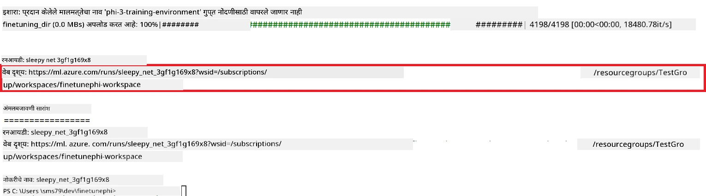

### फाइन-ट्यून केलेले मॉडेल डिप्लॉय करा

फाइन-ट्यून केलेले Phi-3 मॉडेल Prompt Flow शी एकत्र करण्यासाठी, आपल्याला ते वास्तविक वेळेतील इनफरन्ससाठी उपलब्ध करून देण्यासाठी डिप्लॉय करणे आवश्यक आहे. यामध्ये मॉडेल नोंदणी, ऑनलाइन एंडपॉइंट तयार करणे आणि मॉडेल डिप्लॉय करणे यांचा समावेश आहे.

#### डिप्लॉय करण्यासाठी मॉडेल नाव, एंडपॉइंट नाव, आणि डिप्लॉयमेंट नाव सेट करा

1. *config.py* फाइल उघडा.

1. `AZURE_MODEL_NAME = "your_fine_tuned_model_name"` ह्या ओळीऐवजी आपला इच्छित मॉडेल नाव टाका.

1. `AZURE_ENDPOINT_NAME = "your_fine_tuned_model_endpoint_name"` ह्या ओळीऐवजी आपला इच्छित एंडपॉइंट नाव टाका.

1. `AZURE_DEPLOYMENT_NAME = "your_fine_tuned_model_deployment_name"` ह्या ओळीऐवजी आपला इच्छित डिप्लॉयमेंट नाव टाका.

#### *deploy_model.py* फाइलमध्ये कोड जोडा

*deploy_model.py* फाइल चालविल्याने संपूर्ण डिप्लॉयमेंट प्रक्रिया आपोआप होईल. या प्रक्रियेत मॉडेल नोंदणी, एंडपॉइंट तयार करणे, आणि निर्देशित सेटिंग्जनुसार डिप्लॉयमेंट चालवणे यांचा समावेश आहे, ज्यात मॉडेल नाव, एंडपॉइंट नाव आणि डिप्लॉयमेंट नाव *config.py* फाइलमध्ये दिलेले आहे.

1. Visual Studio Code मध्ये *deploy_model.py* फाइल उघडा.

1. *deploy_model.py* मध्ये खालील कोड जोडा.

    ```python
    import logging
    from azure.identity import AzureCliCredential
    from azure.ai.ml import MLClient
    from azure.ai.ml.entities import Model, ProbeSettings, ManagedOnlineEndpoint, ManagedOnlineDeployment, IdentityConfiguration, ManagedIdentityConfiguration, OnlineRequestSettings
    from azure.ai.ml.constants import AssetTypes

    # संरचना आयात
    from config import (
        AZURE_SUBSCRIPTION_ID,
        AZURE_RESOURCE_GROUP_NAME,
        AZURE_ML_WORKSPACE_NAME,
        AZURE_MANAGED_IDENTITY_RESOURCE_ID,
        AZURE_MANAGED_IDENTITY_CLIENT_ID,
        AZURE_MODEL_NAME,
        AZURE_ENDPOINT_NAME,
        AZURE_DEPLOYMENT_NAME
    )

    # स्थिरांक
    JOB_NAME = "your-job-name"
    COMPUTE_INSTANCE_TYPE = "Standard_E4s_v3"

    deployment_env_vars = {
        "SUBSCRIPTION_ID": AZURE_SUBSCRIPTION_ID,
        "RESOURCE_GROUP_NAME": AZURE_RESOURCE_GROUP_NAME,
        "UAI_CLIENT_ID": AZURE_MANAGED_IDENTITY_CLIENT_ID,
    }

    # नोंदणी सेटअप
    logging.basicConfig(
        format="%(asctime)s - %(levelname)s - %(name)s - %(message)s",
        datefmt="%Y-%m-%d %H:%M:%S",
        level=logging.DEBUG
    )
    logger = logging.getLogger(__name__)

    def get_ml_client():
        """Initialize and return the ML Client."""
        credential = AzureCliCredential()
        return MLClient(credential, AZURE_SUBSCRIPTION_ID, AZURE_RESOURCE_GROUP_NAME, AZURE_ML_WORKSPACE_NAME)

    def register_model(ml_client, model_name, job_name):
        """Register a new model."""
        model_path = f"azureml://jobs/{job_name}/outputs/artifacts/paths/model_output"
        logger.info(f"Registering model {model_name} from job {job_name} at path {model_path}.")
        run_model = Model(
            path=model_path,
            name=model_name,
            description="Model created from run.",
            type=AssetTypes.MLFLOW_MODEL,
        )
        model = ml_client.models.create_or_update(run_model)
        logger.info(f"Registered model ID: {model.id}")
        return model

    def delete_existing_endpoint(ml_client, endpoint_name):
        """Delete existing endpoint if it exists."""
        try:
            endpoint_result = ml_client.online_endpoints.get(name=endpoint_name)
            logger.info(f"Deleting existing endpoint {endpoint_name}.")
            ml_client.online_endpoints.begin_delete(name=endpoint_name).result()
            logger.info(f"Deleted existing endpoint {endpoint_name}.")
        except Exception as e:
            logger.info(f"No existing endpoint {endpoint_name} found to delete: {e}")

    def create_or_update_endpoint(ml_client, endpoint_name, description=""):
        """Create or update an endpoint."""
        delete_existing_endpoint(ml_client, endpoint_name)
        logger.info(f"Creating new endpoint {endpoint_name}.")
        endpoint = ManagedOnlineEndpoint(
            name=endpoint_name,
            description=description,
            identity=IdentityConfiguration(
                type="user_assigned",
                user_assigned_identities=[ManagedIdentityConfiguration(resource_id=AZURE_MANAGED_IDENTITY_RESOURCE_ID)]
            )
        )
        endpoint_result = ml_client.online_endpoints.begin_create_or_update(endpoint).result()
        logger.info(f"Created new endpoint {endpoint_name}.")
        return endpoint_result

    def create_or_update_deployment(ml_client, endpoint_name, deployment_name, model):
        """Create or update a deployment."""

        logger.info(f"Creating deployment {deployment_name} for endpoint {endpoint_name}.")
        deployment = ManagedOnlineDeployment(
            name=deployment_name,
            endpoint_name=endpoint_name,
            model=model.id,
            instance_type=COMPUTE_INSTANCE_TYPE,
            instance_count=1,
            environment_variables=deployment_env_vars,
            request_settings=OnlineRequestSettings(
                max_concurrent_requests_per_instance=3,
                request_timeout_ms=180000,
                max_queue_wait_ms=120000
            ),
            liveness_probe=ProbeSettings(
                failure_threshold=30,
                success_threshold=1,
                period=100,
                initial_delay=500,
            ),
            readiness_probe=ProbeSettings(
                failure_threshold=30,
                success_threshold=1,
                period=100,
                initial_delay=500,
            ),
        )
        deployment_result = ml_client.online_deployments.begin_create_or_update(deployment).result()
        logger.info(f"Created deployment {deployment.name} for endpoint {endpoint_name}.")
        return deployment_result

    def set_traffic_to_deployment(ml_client, endpoint_name, deployment_name):
        """Set traffic to the specified deployment."""
        try:
            # वर्तमान एंडपॉइंट तपशील आणा
            endpoint = ml_client.online_endpoints.get(name=endpoint_name)
            
            # डिबगिंगसाठी वर्तमान ट्रॅफिक वाटपाची नोंद करा
            logger.info(f"Current traffic allocation: {endpoint.traffic}")
            
            # वितरणासाठी ट्रॅफिक वाटप सेट करा
            endpoint.traffic = {deployment_name: 100}
            
            # नवीन ट्रॅफिक वाटपासह एंडपॉइंट अद्यतनित करा
            endpoint_poller = ml_client.online_endpoints.begin_create_or_update(endpoint)
            updated_endpoint = endpoint_poller.result()
            
            # डिबगिंगसाठी अद्यतनित ट्रॅफिक वाटपाची नोंद करा
            logger.info(f"Updated traffic allocation: {updated_endpoint.traffic}")
            logger.info(f"Set traffic to deployment {deployment_name} at endpoint {endpoint_name}.")
            return updated_endpoint
        except Exception as e:
            # प्रक्रिये दरम्यान घडलेल्या कोणत्याही त्रुटींची नोंद करा
            logger.error(f"Failed to set traffic to deployment: {e}")
            raise


    def main():
        ml_client = get_ml_client()

        registered_model = register_model(ml_client, AZURE_MODEL_NAME, JOB_NAME)
        logger.info(f"Registered model ID: {registered_model.id}")

        endpoint = create_or_update_endpoint(ml_client, AZURE_ENDPOINT_NAME, "Endpoint for finetuned Phi-3 model")
        logger.info(f"Endpoint {AZURE_ENDPOINT_NAME} is ready.")

        try:
            deployment = create_or_update_deployment(ml_client, AZURE_ENDPOINT_NAME, AZURE_DEPLOYMENT_NAME, registered_model)
            logger.info(f"Deployment {AZURE_DEPLOYMENT_NAME} is created for endpoint {AZURE_ENDPOINT_NAME}.")

            set_traffic_to_deployment(ml_client, AZURE_ENDPOINT_NAME, AZURE_DEPLOYMENT_NAME)
            logger.info(f"Traffic is set to deployment {AZURE_DEPLOYMENT_NAME} at endpoint {AZURE_ENDPOINT_NAME}.")
        except Exception as e:
            logger.error(f"Failed to create or update deployment: {e}")

    if __name__ == "__main__":
        main()

    ```

1. `JOB_NAME` मिळविण्यासाठी खालील टास्क करा:

    - आपण तयार केलेल्या Azure मशीन लर्निंग संसाधनाकडे जा.
    - **Studio web URL** निवडून Azure मशीन लर्निंग वर्कस्पेस उघडा.
    - डाव्या बाजूच्या टॅबमधून **Jobs** निवडा.
    - फाइन-ट्यूनिंगसाठी केलेला experiment निवडा, उदाहरणार्थ *finetunephi*.
    - आपण तयार केलेली नोकरी निवडा.
- तुमचे नोकरीचे नाव `JOB_NAME = "your-job-name"` मध्ये *deploy_model.py* फाईलमध्ये कॉपी आणि पेस्ट करा.

1. `COMPUTE_INSTANCE_TYPE` तुमच्या विशिष्ट तपशीलांनी बदला.

1. *deploy_model.py* स्क्रिप्ट चालवण्यासाठी आणि Azure Machine Learning मध्ये डिप्लॉयमेंट प्रक्रिया सुरू करण्यासाठी खालील आदेश टाइप करा.

    ```python
    python deploy_model.py
    ```

> [!WARNING]
> तुमच्या खात्यात अतिरिक्त शुल्क होणार नाही यासाठी, Azure Machine Learning वर्कस्पेसमध्ये तयार केलेला endpoint नक्की डिलीट करा.
>

#### Azure Machine Learning वर्कस्पेसमध्ये डिप्लॉयमेंट स्थिती तपासा

1. [Azure ML Studio](https://ml.azure.com/home?wt.mc_id=studentamb_279723) ला भेट द्या.

1. तुम्ही तयार केलेल्या Azure Machine Learning वर्कस्पेसकडे जा.

1. Azure Machine Learning वर्कस्पेस उघडण्यासाठी **Studio web URL** निवडा.

1. डाव्या बाजूच्या टॅबमधून **Endpoints** निवडा.

    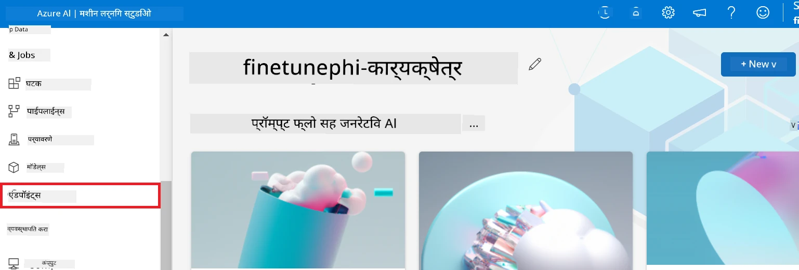

2. तुम्ही तयार केलेला endpoint निवडा.

    

3. या पृष्ठावर, तुम्ही डिप्लॉयमेंट प्रक्रियेदरम्यान तयार केलेले endpoints व्यवस्थापित करू शकता.

## परिदृश्य 3: Prompt flow शी एकत्र करा आणि तुमच्या कस्टम मॉडेलशी गप्पा मारा

### कस्टम Phi-3 मॉडेल Prompt flow शी एकत्र करा

तुमचे फाइन-ट्यून केलेले मॉडेल यशस्वीरित्या डिप्लॉय केल्यानंतर, तुम्ही ते Prompt flow शी एकत्र करू शकता ज्यामुळे तुमचा मॉडेल रिअल-टाइम अनुप्रयोगांमध्ये वापरता येईल, आणि तुमच्या कस्टम Phi-3 मॉडेलसह विविध संवादात्मक कार्ये शक्य होतील.

#### फाइन-ट्यून Phi-3 मॉडेलचा api key आणि endpoint uri सेट करा

1. तुम्ही तयार केलेल्या Azure Machine Learning वर्कस्पेसकडे जा.
1. डाव्या बाजूच्या टॅबमधून **Endpoints** निवडा.
1. तुम्ही तयार केलेला endpoint निवडा.
1. नेव्हिगेशन मेनूमधून **Consume** निवडा.
1. तुमचा **REST endpoint** कॉपी करा आणि *config.py* फाईलमध्ये `AZURE_ML_ENDPOINT = "your_fine_tuned_model_endpoint_uri"` या ठिकाणी तुमचा **REST endpoint** पेस्ट करा.
1. तुमचा **Primary key** कॉपी करा आणि *config.py* फाईलमध्ये `AZURE_ML_API_KEY = "your_fine_tuned_model_api_key"` या ठिकाणी तुमचा **Primary key** पेस्ट करा.

    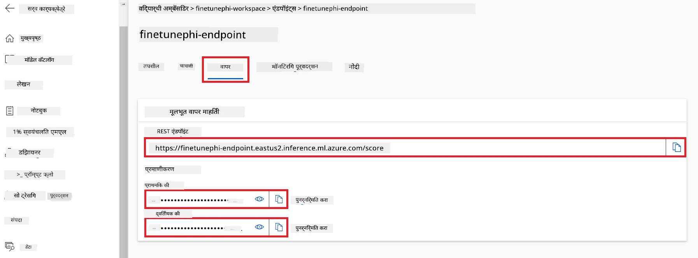

#### *flow.dag.yml* फाईलमध्ये कोड जोडा

1. Visual Studio Code मध्ये *flow.dag.yml* फाईल उघडा.

1. खालील कोड *flow.dag.yml* मध्ये जोडा.

    ```yml
    inputs:
      input_data:
        type: string
        default: "Who founded Microsoft?"

    outputs:
      answer:
        type: string
        reference: ${integrate_with_promptflow.output}

    nodes:
    - name: integrate_with_promptflow
      type: python
      source:
        type: code
        path: integrate_with_promptflow.py
      inputs:
        input_data: ${inputs.input_data}
    ```

#### *integrate_with_promptflow.py* फाईलमध्ये कोड जोडा

1. Visual Studio Code मध्ये *integrate_with_promptflow.py* फाईल उघडा.

1. खालील कोड *integrate_with_promptflow.py* मध्ये जोडा.

    ```python
    import logging
    import requests
    from promptflow.core import tool
    import asyncio
    import platform
    from config import (
        AZURE_ML_ENDPOINT,
        AZURE_ML_API_KEY
    )

    # लॉगिंग सेटअप
    logging.basicConfig(
        format="%(asctime)s - %(levelname)s - %(name)s - %(message)s",
        datefmt="%Y-%m-%d %H:%M:%S",
        level=logging.DEBUG
    )
    logger = logging.getLogger(__name__)

    def query_azml_endpoint(input_data: list, endpoint_url: str, api_key: str) -> str:
        """
        Send a request to the Azure ML endpoint with the given input data.
        """
        headers = {
            "Content-Type": "application/json",
            "Authorization": f"Bearer {api_key}"
        }
        data = {
            "input_data": [input_data],
            "params": {
                "temperature": 0.7,
                "max_new_tokens": 128,
                "do_sample": True,
                "return_full_text": True
            }
        }
        try:
            response = requests.post(endpoint_url, json=data, headers=headers)
            response.raise_for_status()
            result = response.json()[0]
            logger.info("Successfully received response from Azure ML Endpoint.")
            return result
        except requests.exceptions.RequestException as e:
            logger.error(f"Error querying Azure ML Endpoint: {e}")
            raise

    def setup_asyncio_policy():
        """
        Setup asyncio event loop policy for Windows.
        """
        if platform.system() == 'Windows':
            asyncio.set_event_loop_policy(asyncio.WindowsSelectorEventLoopPolicy())
            logger.info("Set Windows asyncio event loop policy.")

    @tool
    def my_python_tool(input_data: str) -> str:
        """
        Tool function to process input data and query the Azure ML endpoint.
        """
        setup_asyncio_policy()
        return query_azml_endpoint(input_data, AZURE_ML_ENDPOINT, AZURE_ML_API_KEY)

    ```

### तुमच्या कस्टम मॉडेलशी गप्पा मारा

1. *deploy_model.py* स्क्रिप्ट चालवण्यासाठी आणि Azure Machine Learning मध्ये डिप्लॉयमेंट प्रक्रिया सुरू करण्यासाठी खालील आदेश टाइप करा.

    ```python
    pf flow serve --source ./ --port 8080 --host localhost
    ```

1. परिणामी याचे एक उदाहरण खाली दाखवले आहे: आता तुम्ही तुमच्या कस्टम Phi-3 मॉडेलशी गप्पा मारू शकता. फाइन-ट्यूनिंगसाठी वापरलेल्या डेटावर आधारित प्रश्न विचारणे शिफारस केले जाते.

    

---

<!-- CO-OP TRANSLATOR DISCLAIMER START -->
**प्रतिज्ञापन**:
हा दस्तऐवज AI अनुवाद सेवा [Co-op Translator](https://github.com/Azure/co-op-translator) वापरून अनुवादित केला आहे. आपण अचूकतेसाठी प्रयत्न करतो, तरी कृपया लक्षात ठेवा की स्वयंचलित अनुवादांमध्ये चुका किंवा अचूकतेचा अभाव असू शकतो. मूळ दस्तऐवज त्याच्या मूळ भाषेत अधिकृत स्रोत मानला जातो. महत्त्वाची माहितीच्या बाबतीत व्यावसायिक मानवी अनुवाद शिफारसीय आहे. या अनुवादाच्या वापरामुळे उद्भवणाऱ्या कोणत्याही गैरसमजुती किंवा चुकीच्या अर्थांच्याबाबतीत आम्ही जबाबदार नाही.
<!-- CO-OP TRANSLATOR DISCLAIMER END -->