<!--
CO_OP_TRANSLATOR_METADATA:
{
  "original_hash": "455be2b7b9c3390d367d528f8fab2aa0",
  "translation_date": "2025-07-17T00:18:07+00:00",
  "source_file": "md/02.Application/01.TextAndChat/Phi3/E2E_Phi-3-FineTuning_PromptFlow_Integration.md",
  "language_code": "mr"
}
-->
# Fine-tune आणि Prompt flow सह कस्टम Phi-3 मॉडेल्स एकत्रित करा

हा end-to-end (E2E) नमुना Microsoft Tech Community मधील "[Fine-Tune and Integrate Custom Phi-3 Models with Prompt Flow: Step-by-Step Guide](https://techcommunity.microsoft.com/t5/educator-developer-blog/fine-tune-and-integrate-custom-phi-3-models-with-prompt-flow/ba-p/4178612?WT.mc_id=aiml-137032-kinfeylo)" या मार्गदर्शकावर आधारित आहे. यात Phi-3 मॉडेल्सचे fine-tuning, तैनाती आणि Prompt flow सह एकत्रीकरण यांची प्रक्रिया समजावून सांगितली आहे.

## आढावा

या E2E नमुन्यात, तुम्हाला Phi-3 मॉडेलचे fine-tune कसे करायचे आणि ते Prompt flow सह कसे एकत्रित करायचे हे शिकवले जाईल. Azure Machine Learning आणि Prompt flow चा वापर करून, तुम्ही कस्टम AI मॉडेल्स तैनात करण्यासाठी आणि वापरण्यासाठी एक workflow तयार कराल. हा E2E नमुना तीन परिस्थितींमध्ये विभागलेला आहे:

**परिस्थिती 1: Azure संसाधने सेट करा आणि fine-tuning साठी तयारी करा**

**परिस्थिती 2: Phi-3 मॉडेलचे fine-tune करा आणि Azure Machine Learning Studio मध्ये तैनात करा**

**परिस्थिती 3: Prompt flow सह एकत्रित करा आणि तुमच्या कस्टम मॉडेलशी संवाद साधा**

खाली या E2E नमुन्याचा आढावा दिला आहे.


### विषय सूची

1. **[परिस्थिती 1: Azure संसाधने सेट करा आणि fine-tuning साठी तयारी करा](../../../../../../md/02.Application/01.TextAndChat/Phi3)**
    - [Azure Machine Learning Workspace तयार करा](../../../../../../md/02.Application/01.TextAndChat/Phi3)
    - [Azure Subscription मध्ये GPU कोटा विनंती करा](../../../../../../md/02.Application/01.TextAndChat/Phi3)
    - [भूमिका नियुक्ती जोडा](../../../../../../md/02.Application/01.TextAndChat/Phi3)
    - [प्रकल्प सेट करा](../../../../../../md/02.Application/01.TextAndChat/Phi3)
    - [fine-tuning साठी डेटासेट तयार करा](../../../../../../md/02.Application/01.TextAndChat/Phi3)

1. **[परिस्थिती 2: Phi-3 मॉडेलचे fine-tune करा आणि Azure Machine Learning Studio मध्ये तैनात करा](../../../../../../md/02.Application/01.TextAndChat/Phi3)**
    - [Azure CLI सेट करा](../../../../../../md/02.Application/01.TextAndChat/Phi3)
    - [Phi-3 मॉडेलचे fine-tune करा](../../../../../../md/02.Application/01.TextAndChat/Phi3)
    - [fine-tuned मॉडेल तैनात करा](../../../../../../md/02.Application/01.TextAndChat/Phi3)

1. **[परिस्थिती 3: Prompt flow सह एकत्रित करा आणि तुमच्या कस्टम मॉडेलशी संवाद साधा](../../../../../../md/02.Application/01.TextAndChat/Phi3)**
    - [कस्टम Phi-3 मॉडेल Prompt flow सह एकत्रित करा](../../../../../../md/02.Application/01.TextAndChat/Phi3)
    - [तुमच्या कस्टम मॉडेलशी संवाद साधा](../../../../../../md/02.Application/01.TextAndChat/Phi3)

## परिस्थिती 1: Azure संसाधने सेट करा आणि fine-tuning साठी तयारी करा

### Azure Machine Learning Workspace तयार करा

1. पोर्टल पृष्ठाच्या वरच्या **search bar** मध्ये *azure machine learning* टाइप करा आणि दिसणाऱ्या पर्यायांमधून **Azure Machine Learning** निवडा.

    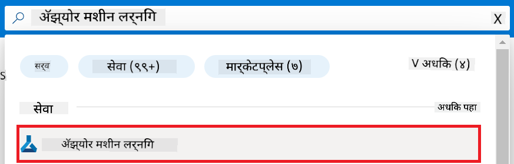

1. नेव्हिगेशन मेनूमधून **+ Create** निवडा.

1. नेव्हिगेशन मेनूमधून **New workspace** निवडा.

    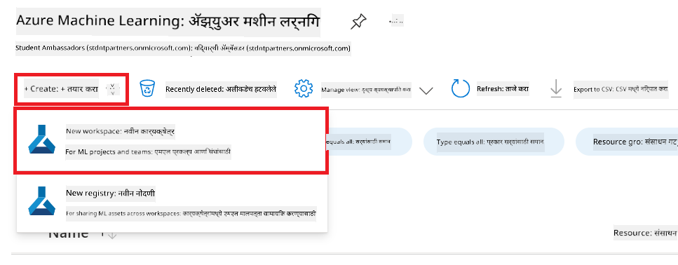

1. खालील कामे करा:

    - तुमचा Azure **Subscription** निवडा.
    - वापरण्यासाठी **Resource group** निवडा (गरज असल्यास नवीन तयार करा).
    - **Workspace Name** टाका. हे एक अद्वितीय नाव असावे.
    - वापरण्यासाठी **Region** निवडा.
    - वापरण्यासाठी **Storage account** निवडा (गरज असल्यास नवीन तयार करा).
    - वापरण्यासाठी **Key vault** निवडा (गरज असल्यास नवीन तयार करा).
    - वापरण्यासाठी **Application insights** निवडा (गरज असल्यास नवीन तयार करा).
    - वापरण्यासाठी **Container registry** निवडा (गरज असल्यास नवीन तयार करा).

    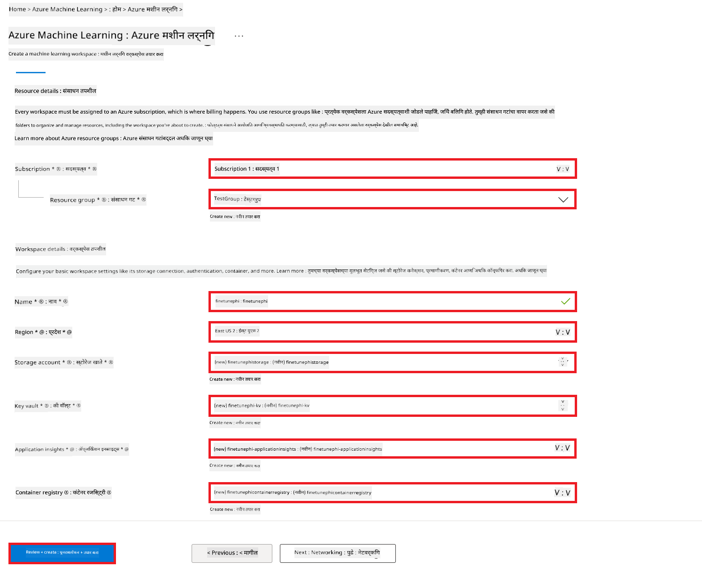

1. **Review + Create** निवडा.

1. **Create** निवडा.

### Azure Subscription मध्ये GPU कोटा विनंती करा

या E2E नमुन्यात, तुम्ही fine-tuning साठी *Standard_NC24ads_A100_v4 GPU* वापराल, ज्यासाठी कोटा विनंती आवश्यक आहे, आणि तैनातीसाठी *Standard_E4s_v3* CPU वापराल, ज्यासाठी कोटा विनंती आवश्यक नाही.

> [!NOTE]
>
> फक्त Pay-As-You-Go सबस्क्रिप्शन्स (सामान्य सबस्क्रिप्शन प्रकार) GPU वाटपासाठी पात्र आहेत; benefit सबस्क्रिप्शन्स सध्या समर्थित नाहीत.
>
> जे benefit सबस्क्रिप्शन्स वापरतात (जसे Visual Studio Enterprise Subscription) किंवा जे लवकर fine-tuning आणि तैनाती प्रक्रिया तपासू इच्छितात, त्यांच्यासाठी हा ट्यूटोरियल CPU वापरून कमी डेटासेटसह fine-tuning कसा करायचा याचे मार्गदर्शन देखील देतो. मात्र, लक्षात ठेवा की GPU वापरून मोठ्या डेटासेटसह fine-tuning चे निकाल खूपच चांगले येतात.

1. [Azure ML Studio](https://ml.azure.com/home?wt.mc_id=studentamb_279723) येथे भेट द्या.

1. *Standard NCADSA100v4 Family* कोटा विनंती करण्यासाठी खालील कामे करा:

    - डाव्या बाजूच्या टॅबमधून **Quota** निवडा.
    - वापरण्यासाठी **Virtual machine family** निवडा. उदाहरणार्थ, *Standard NCADSA100v4 Family Cluster Dedicated vCPUs* निवडा, ज्यामध्ये *Standard_NC24ads_A100_v4* GPU समाविष्ट आहे.
    - नेव्हिगेशन मेनूमधून **Request quota** निवडा.

        

    - Request quota पृष्ठावर, तुम्हाला हवे असलेले **New cores limit** टाका. उदाहरणार्थ, 24.
    - Request quota पृष्ठावर, GPU कोटा विनंती करण्यासाठी **Submit** निवडा.

> [!NOTE]
> तुमच्या गरजेनुसार योग्य GPU किंवा CPU निवडण्यासाठी [Sizes for Virtual Machines in Azure](https://learn.microsoft.com/azure/virtual-machines/sizes/overview?tabs=breakdownseries%2Cgeneralsizelist%2Ccomputesizelist%2Cmemorysizelist%2Cstoragesizelist%2Cgpusizelist%2Cfpgasizelist%2Chpcsizelist) दस्तऐवज पहा.

### भूमिका नियुक्ती जोडा

तुमचे मॉडेल्स fine-tune आणि तैनात करण्यासाठी, तुम्हाला प्रथम User Assigned Managed Identity (UAI) तयार करावी लागेल आणि त्याला योग्य परवानग्या द्याव्या लागतील. ही UAI तैनाती दरम्यान प्रमाणीकरणासाठी वापरली जाईल.

#### User Assigned Managed Identity (UAI) तयार करा

1. पोर्टल पृष्ठाच्या वरच्या **search bar** मध्ये *managed identities* टाइप करा आणि दिसणाऱ्या पर्यायांमधून **Managed Identities** निवडा.

    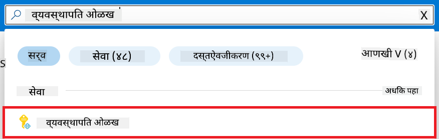

1. **+ Create** निवडा.

    

1. खालील कामे करा:

    - तुमचा Azure **Subscription** निवडा.
    - वापरण्यासाठी **Resource group** निवडा (गरज असल्यास नवीन तयार करा).
    - वापरण्यासाठी **Region** निवडा.
    - **Name** टाका. हे एक अद्वितीय नाव असावे.

1. **Review + create** निवडा.

1. **+ Create** निवडा.

#### Managed Identity ला Contributor भूमिका नियुक्त करा

1. तुम्ही तयार केलेल्या Managed Identity संसाधनावर जा.

1. डाव्या बाजूच्या टॅबमधून **Azure role assignments** निवडा.

1. नेव्हिगेशन मेनूमधून **+Add role assignment** निवडा.

1. Add role assignment पृष्ठावर खालील कामे करा:
    - **Scope** म्हणून **Resource group** निवडा.
    - तुमचा Azure **Subscription** निवडा.
    - वापरण्यासाठी **Resource group** निवडा.
    - **Role** म्हणून **Contributor** निवडा.

    

1. **Save** निवडा.

#### Managed Identity ला Storage Blob Data Reader भूमिका नियुक्त करा

1. पोर्टल पृष्ठाच्या वरच्या **search bar** मध्ये *storage accounts* टाइप करा आणि दिसणाऱ्या पर्यायांमधून **Storage accounts** निवडा.

    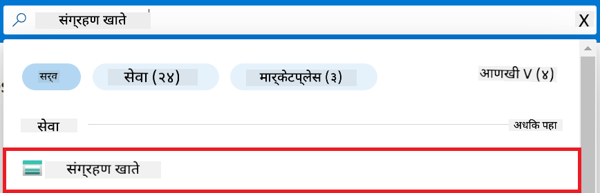

1. Azure Machine Learning workspace शी संबंधित Storage account निवडा. उदाहरणार्थ, *finetunephistorage*.

1. Add role assignment पृष्ठावर जाण्यासाठी खालील कामे करा:

    - तुम्ही तयार केलेल्या Azure Storage account वर जा.
    - डाव्या बाजूच्या टॅबमधून **Access Control (IAM)** निवडा.
    - नेव्हिगेशन मेनूमधून **+ Add** निवडा.
    - नेव्हिगेशन मेनूमधून **Add role assignment** निवडा.

    

1. Add role assignment पृष्ठावर खालील कामे करा:

    - Role पृष्ठावर, **search bar** मध्ये *Storage Blob Data Reader* टाइप करा आणि दिसणाऱ्या पर्यायांमधून **Storage Blob Data Reader** निवडा.
    - Role पृष्ठावर, **Next** निवडा.
    - Members पृष्ठावर, **Assign access to** म्हणून **Managed identity** निवडा.
    - Members पृष्ठावर, **+ Select members** निवडा.
    - Select managed identities पृष्ठावर, तुमचा Azure **Subscription** निवडा.
    - Select managed identities पृष्ठावर, **Managed identity** म्हणून **Manage Identity** निवडा.
    - Select managed identities पृष्ठावर, तुम्ही तयार केलेली Manage Identity निवडा. उदाहरणार्थ, *finetunephi-managedidentity*.
    - Select managed identities पृष्ठावर, **Select** निवडा.

    

1. **Review + assign** निवडा.

#### Managed Identity ला AcrPull भूमिका नियुक्त करा

1. पोर्टल पृष्ठाच्या वरच्या **search bar** मध्ये *container registries* टाइप करा आणि दिसणाऱ्या पर्यायांमधून **Container registries** निवडा.

    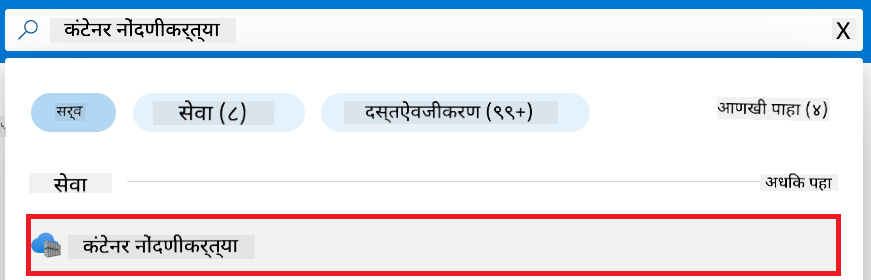

1. Azure Machine Learning workspace शी संबंधित container registry निवडा. उदाहरणार्थ, *finetunephicontainerregistries*

1. Add role assignment पृष्ठावर जाण्यासाठी खालील कामे करा:

    - डाव्या बाजूच्या टॅबमधून **Access Control (IAM)** निवडा.
    - नेव्हिगेशन मेनूमधून **+ Add** निवडा.
    - नेव्हिगेशन मेनूमधून **Add role assignment** निवडा.

1. Add role assignment पृष्ठावर खालील कामे करा:

    - Role पृष्ठावर, **search bar** मध्ये *AcrPull* टाइप करा आणि दिसणाऱ्या पर्यायांमधून **AcrPull** निवडा.
    - Role पृष्ठावर, **Next** निवडा.
    - Members पृष्ठावर, **Assign access to** म्हणून **Managed identity** निवडा.
    - Members पृष्ठावर, **+ Select members** निवडा.
    - Select managed identities पृष्ठावर, तुमचा Azure **Subscription** निवडा.
    - Select managed identities पृष्ठावर, **Managed identity** म्हणून **Manage Identity** निवडा.
    - Select managed identities पृष्ठावर, तुम्ही तयार केलेली Manage Identity निवडा. उदाहरणार्थ, *finetunephi-managedidentity*.
    - Select managed identities पृष्ठावर, **Select** निवडा.
    - **Review + assign** निवडा.

### प्रकल्प सेट करा

आता, तुम्ही काम करण्यासाठी एक फोल्डर तयार कराल आणि एक virtual environment सेट कराल ज्याद्वारे वापरकर्त्यांशी संवाद साधणारा प्रोग्राम विकसित करता येईल आणि Azure Cosmos DB मधील साठवलेला चॅट इतिहास वापरून त्याचे प्रतिसाद सुधारता येतील.

#### काम करण्यासाठी फोल्डर तयार करा

1. टर्मिनल विंडो उघडा आणि खालील आदेश टाइप करून *finetune-phi* नावाचा फोल्डर डिफॉल्ट पथात तयार करा.

    ```console
    mkdir finetune-phi
    ```

1. टर्मिनलमध्ये खालील आदेश टाइप करून तयार केलेल्या *finetune-phi* फोल्डरमध्ये जा.

    ```console
    cd finetune-phi
    ```

#### virtual environment तयार करा

1. टर्मिनलमध्ये खालील आदेश टाइप करून *.venv* नावाचा virtual environment तयार करा.

    ```console
    python -m venv .venv
    ```

1. टर्मिनलमध्ये खालील आदेश टाइप करून virtual environment सक्रिय करा.

    ```console
    .venv\Scripts\activate.bat
    ```
> [!NOTE]
>
> जर ते यशस्वी झाले असेल, तर तुम्हाला कमांड प्रॉम्प्टच्या आधी *(.venv)* दिसेल.
#### आवश्यक पॅकेजेस इन्स्टॉल करा

1. आवश्यक पॅकेजेस इन्स्टॉल करण्यासाठी टर्मिनलमध्ये खालील कमांड टाइप करा.

    ```console
    pip install datasets==2.19.1
    pip install transformers==4.41.1
    pip install azure-ai-ml==1.16.0
    pip install torch==2.3.1
    pip install trl==0.9.4
    pip install promptflow==1.12.0
    ```

#### प्रोजेक्ट फाइल्स तयार करा

या सरावात, आपण आपल्या प्रोजेक्टसाठी आवश्यक फाइल्स तयार कराल. या फाइल्समध्ये डेटासेट डाउनलोड करण्यासाठी स्क्रिप्ट्स, Azure Machine Learning पर्यावरण सेटअप करण्यासाठी, Phi-3 मॉडेलचे फाइन-ट्यूनिंग करण्यासाठी आणि फाइन-ट्यून केलेले मॉडेल डिप्लॉय करण्यासाठी स्क्रिप्ट्स असतील. तसेच, फाइन-ट्यूनिंग पर्यावरण सेट करण्यासाठी *conda.yml* फाइल तयार कराल.

या सरावात, आपण:

- डेटासेट डाउनलोड करण्यासाठी *download_dataset.py* फाइल तयार कराल.
- Azure Machine Learning पर्यावरण सेट करण्यासाठी *setup_ml.py* फाइल तयार कराल.
- *finetuning_dir* फोल्डरमध्ये *fine_tune.py* फाइल तयार कराल, ज्यात डेटासेट वापरून Phi-3 मॉडेलचे फाइन-ट्यूनिंग केले जाईल.
- फाइन-ट्यूनिंग पर्यावरण सेट करण्यासाठी *conda.yml* फाइल तयार कराल.
- फाइन-ट्यून केलेले मॉडेल डिप्लॉय करण्यासाठी *deploy_model.py* फाइल तयार कराल.
- फाइन-ट्यून केलेले मॉडेल Prompt flow सह इंटिग्रेट करण्यासाठी आणि मॉडेल चालवण्यासाठी *integrate_with_promptflow.py* फाइल तयार कराल.
- Prompt flow साठी वर्कफ्लो स्ट्रक्चर सेट करण्यासाठी flow.dag.yml फाइल तयार कराल.
- Azure माहिती भरण्यासाठी *config.py* फाइल तयार कराल.

> [!NOTE]
>
> पूर्ण फोल्डर स्ट्रक्चर:
>
> ```text
> └── YourUserName
> .    └── finetune-phi
> .        ├── finetuning_dir
> .        │      └── fine_tune.py
> .        ├── conda.yml
> .        ├── config.py
> .        ├── deploy_model.py
> .        ├── download_dataset.py
> .        ├── flow.dag.yml
> .        ├── integrate_with_promptflow.py
> .        └── setup_ml.py
> ```

1. **Visual Studio Code** उघडा.

1. मेनू बारमधून **File** निवडा.

1. **Open Folder** निवडा.

1. आपण तयार केलेला *finetune-phi* फोल्डर निवडा, जो *C:\Users\yourUserName\finetune-phi* येथे आहे.

    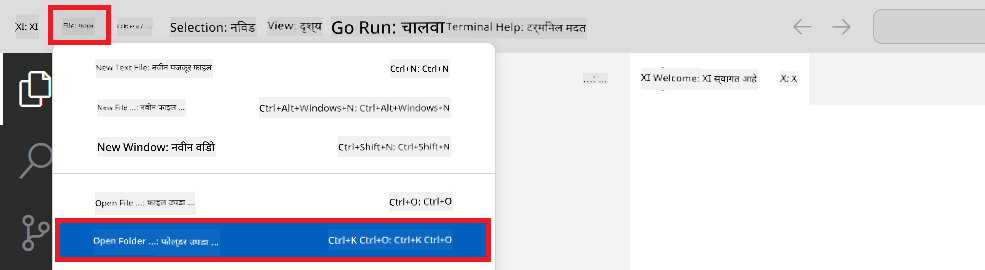

1. Visual Studio Code च्या डाव्या पॅनमध्ये राइट-क्लिक करा आणि **New File** निवडून *download_dataset.py* नावाची फाइल तयार करा.

1. डाव्या पॅनमध्ये राइट-क्लिक करा आणि **New File** निवडून *setup_ml.py* नावाची फाइल तयार करा.

1. डाव्या पॅनमध्ये राइट-क्लिक करा आणि **New File** निवडून *deploy_model.py* नावाची फाइल तयार करा.

    

1. डाव्या पॅनमध्ये राइट-क्लिक करा आणि **New Folder** निवडून *finetuning_dir* नावाचा फोल्डर तयार करा.

1. *finetuning_dir* फोल्डरमध्ये *fine_tune.py* नावाची फाइल तयार करा.

#### *conda.yml* फाइल तयार करा आणि कॉन्फिगर करा

1. Visual Studio Code च्या डाव्या पॅनमध्ये राइट-क्लिक करा आणि **New File** निवडून *conda.yml* नावाची फाइल तयार करा.

1. Phi-3 मॉडेलसाठी फाइन-ट्यूनिंग पर्यावरण सेट करण्यासाठी *conda.yml* फाइलमध्ये खालील कोड जोडा.

    ```yml
    name: phi-3-training-env
    channels:
      - defaults
      - conda-forge
    dependencies:
      - python=3.10
      - pip
      - numpy<2.0
      - pip:
          - torch==2.4.0
          - torchvision==0.19.0
          - trl==0.8.6
          - transformers==4.41
          - datasets==2.21.0
          - azureml-core==1.57.0
          - azure-storage-blob==12.19.0
          - azure-ai-ml==1.16
          - azure-identity==1.17.1
          - accelerate==0.33.0
          - mlflow==2.15.1
          - azureml-mlflow==1.57.0
    ```

#### *config.py* फाइल तयार करा आणि कॉन्फिगर करा

1. Visual Studio Code च्या डाव्या पॅनमध्ये राइट-क्लिक करा आणि **New File** निवडून *config.py* नावाची फाइल तयार करा.

1. आपल्या Azure माहिती समाविष्ट करण्यासाठी *config.py* फाइलमध्ये खालील कोड जोडा.

    ```python
    # Azure settings
    AZURE_SUBSCRIPTION_ID = "your_subscription_id"
    AZURE_RESOURCE_GROUP_NAME = "your_resource_group_name" # "TestGroup"

    # Azure Machine Learning settings
    AZURE_ML_WORKSPACE_NAME = "your_workspace_name" # "finetunephi-workspace"

    # Azure Managed Identity settings
    AZURE_MANAGED_IDENTITY_CLIENT_ID = "your_azure_managed_identity_client_id"
    AZURE_MANAGED_IDENTITY_NAME = "your_azure_managed_identity_name" # "finetunephi-mangedidentity"
    AZURE_MANAGED_IDENTITY_RESOURCE_ID = f"/subscriptions/{AZURE_SUBSCRIPTION_ID}/resourceGroups/{AZURE_RESOURCE_GROUP_NAME}/providers/Microsoft.ManagedIdentity/userAssignedIdentities/{AZURE_MANAGED_IDENTITY_NAME}"

    # Dataset file paths
    TRAIN_DATA_PATH = "data/train_data.jsonl"
    TEST_DATA_PATH = "data/test_data.jsonl"

    # Fine-tuned model settings
    AZURE_MODEL_NAME = "your_fine_tuned_model_name" # "finetune-phi-model"
    AZURE_ENDPOINT_NAME = "your_fine_tuned_model_endpoint_name" # "finetune-phi-endpoint"
    AZURE_DEPLOYMENT_NAME = "your_fine_tuned_model_deployment_name" # "finetune-phi-deployment"

    AZURE_ML_API_KEY = "your_fine_tuned_model_api_key"
    AZURE_ML_ENDPOINT = "your_fine_tuned_model_endpoint_uri" # "https://{your-endpoint-name}.{your-region}.inference.ml.azure.com/score"
    ```

#### Azure पर्यावरण व्हेरिएबल्स जोडा

1. Azure Subscription ID जोडण्यासाठी खालील टास्क करा:

    - पोर्टल पेजच्या वरच्या **search bar** मध्ये *subscriptions* टाइप करा आणि दिसणाऱ्या पर्यायांमधून **Subscriptions** निवडा.
    - आपण सध्या वापरत असलेली Azure Subscription निवडा.
    - आपला Subscription ID कॉपी करा आणि *config.py* फाइलमध्ये पेस्ट करा.

    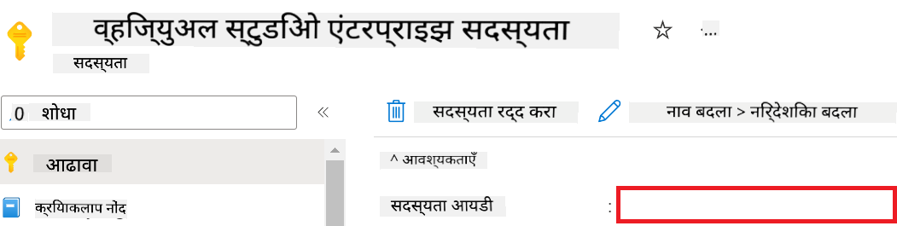

1. Azure Workspace Name जोडण्यासाठी खालील टास्क करा:

    - आपण तयार केलेल्या Azure Machine Learning रिसोर्सकडे जा.
    - आपले अकाउंट नाव कॉपी करा आणि *config.py* फाइलमध्ये पेस्ट करा.

    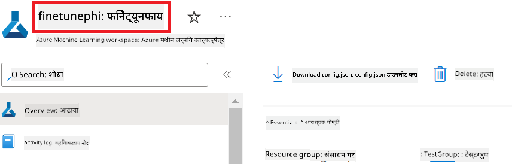

1. Azure Resource Group Name जोडण्यासाठी खालील टास्क करा:

    - आपण तयार केलेल्या Azure Machine Learning रिसोर्सकडे जा.
    - आपला Azure Resource Group Name कॉपी करा आणि *config.py* फाइलमध्ये पेस्ट करा.

    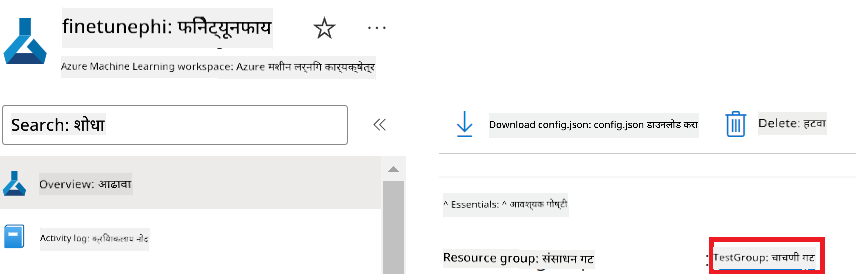

2. Azure Managed Identity नाव जोडण्यासाठी खालील टास्क करा:

    - आपण तयार केलेल्या Managed Identities रिसोर्सकडे जा.
    - आपला Azure Managed Identity नाव कॉपी करा आणि *config.py* फाइलमध्ये पेस्ट करा.

    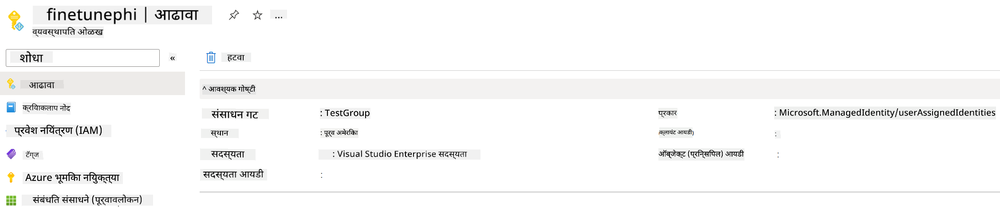

### फाइन-ट्यूनिंगसाठी डेटासेट तयार करा

या सरावात, आपण *download_dataset.py* फाइल चालवून *ULTRACHAT_200k* डेटासेट आपल्या लोकल पर्यावरणात डाउनलोड कराल. नंतर, या डेटासेटचा वापर करून Azure Machine Learning मध्ये Phi-3 मॉडेलचे फाइन-ट्यूनिंग कराल.

#### *download_dataset.py* वापरून आपले डेटासेट डाउनलोड करा

1. Visual Studio Code मध्ये *download_dataset.py* फाइल उघडा.

1. *download_dataset.py* मध्ये खालील कोड जोडा.

    ```python
    import json
    import os
    from datasets import load_dataset
    from config import (
        TRAIN_DATA_PATH,
        TEST_DATA_PATH)

    def load_and_split_dataset(dataset_name, config_name, split_ratio):
        """
        Load and split a dataset.
        """
        # Load the dataset with the specified name, configuration, and split ratio
        dataset = load_dataset(dataset_name, config_name, split=split_ratio)
        print(f"Original dataset size: {len(dataset)}")
        
        # Split the dataset into train and test sets (80% train, 20% test)
        split_dataset = dataset.train_test_split(test_size=0.2)
        print(f"Train dataset size: {len(split_dataset['train'])}")
        print(f"Test dataset size: {len(split_dataset['test'])}")
        
        return split_dataset

    def save_dataset_to_jsonl(dataset, filepath):
        """
        Save a dataset to a JSONL file.
        """
        # Create the directory if it does not exist
        os.makedirs(os.path.dirname(filepath), exist_ok=True)
        
        # Open the file in write mode
        with open(filepath, 'w', encoding='utf-8') as f:
            # Iterate over each record in the dataset
            for record in dataset:
                # Dump the record as a JSON object and write it to the file
                json.dump(record, f)
                # Write a newline character to separate records
                f.write('\n')
        
        print(f"Dataset saved to {filepath}")

    def main():
        """
        Main function to load, split, and save the dataset.
        """
        # Load and split the ULTRACHAT_200k dataset with a specific configuration and split ratio
        dataset = load_and_split_dataset("HuggingFaceH4/ultrachat_200k", 'default', 'train_sft[:1%]')
        
        # Extract the train and test datasets from the split
        train_dataset = dataset['train']
        test_dataset = dataset['test']

        # Save the train dataset to a JSONL file
        save_dataset_to_jsonl(train_dataset, TRAIN_DATA_PATH)
        
        # Save the test dataset to a separate JSONL file
        save_dataset_to_jsonl(test_dataset, TEST_DATA_PATH)

    if __name__ == "__main__":
        main()

    ```

> [!TIP]
>
> **CPU वापरून कमी डेटासेटसह फाइन-ट्यूनिंगसाठी मार्गदर्शन**
>
> जर तुम्हाला CPU वापरून फाइन-ट्यूनिंग करायचे असेल, तर हा मार्गदर्शक Visual Studio Enterprise Subscription सारख्या लाभ सदस्यांसाठी किंवा फाइन-ट्यूनिंग आणि डिप्लॉयमेंट प्रक्रिया लवकर तपासण्यासाठी उपयुक्त आहे.
>
> `dataset = load_and_split_dataset("HuggingFaceH4/ultrachat_200k", 'default', 'train_sft[:1%]')` या ओळीऐवजी `dataset = load_and_split_dataset("HuggingFaceH4/ultrachat_200k", 'default', 'train_sft[:10]')` वापरा.
>

1. स्क्रिप्ट चालवून डेटासेट आपल्या लोकल पर्यावरणात डाउनलोड करण्यासाठी टर्मिनलमध्ये खालील कमांड टाइप करा.

    ```console
    python download_data.py
    ```

1. खात्री करा की डेटासेट्स यशस्वीपणे आपल्या लोकल *finetune-phi/data* डायरेक्टरीमध्ये सेव्ह झाले आहेत.

> [!NOTE]
>
> **डेटासेटचा आकार आणि फाइन-ट्यूनिंगचा वेळ**
>
> या E2E नमुन्यात, आपण फक्त 1% डेटासेट (`train_sft[:1%]`) वापरता. यामुळे डेटाचा आकार लक्षणीयरीत्या कमी होतो, ज्यामुळे अपलोड आणि फाइन-ट्यूनिंग प्रक्रिया जलद होते. तुम्ही प्रशिक्षण वेळ आणि मॉडेल कार्यक्षमतेमध्ये योग्य संतुलन साधण्यासाठी टक्केवारी समायोजित करू शकता. डेटासेटचा लहान उपसमूह वापरल्याने फाइन-ट्यूनिंगसाठी लागणारा वेळ कमी होतो, ज्यामुळे E2E नमुन्यासाठी प्रक्रिया अधिक सुलभ होते.

## परिदृश्य 2: Phi-3 मॉडेलचे फाइन-ट्यूनिंग करा आणि Azure Machine Learning Studio मध्ये डिप्लॉय करा

### Azure CLI सेटअप करा

आपल्या पर्यावरणाची प्रमाणीकरण करण्यासाठी Azure CLI सेटअप करणे आवश्यक आहे. Azure CLI आपल्याला कमांड लाइनवरून थेट Azure संसाधने व्यवस्थापित करण्याची परवानगी देते आणि Azure Machine Learning ला या संसाधनांमध्ये प्रवेश करण्यासाठी आवश्यक क्रेडेन्शियल्स प्रदान करते. सुरुवात करण्यासाठी [Azure CLI](https://learn.microsoft.com/cli/azure/install-azure-cli) इन्स्टॉल करा.

1. टर्मिनल विंडो उघडा आणि Azure खात्यात लॉगिन करण्यासाठी खालील कमांड टाइप करा.

    ```console
    az login
    ```

1. वापरायचे Azure खाते निवडा.

1. वापरायची Azure Subscription निवडा.

    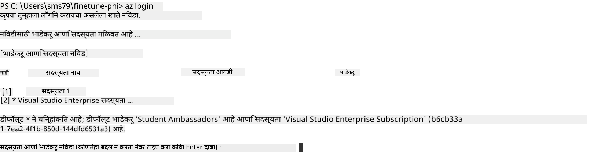

> [!TIP]
>
> Azure मध्ये साइन इन करताना अडचण येत असल्यास, डिव्हाइस कोड वापरून साइन इन करण्याचा प्रयत्न करा. टर्मिनल विंडो उघडा आणि Azure खात्यात साइन इन करण्यासाठी खालील कमांड टाइप करा:
>
> ```console
> az login --use-device-code
> ```
>

### Phi-3 मॉडेलचे फाइन-ट्यूनिंग करा

या सरावात, आपण दिलेल्या डेटासेटचा वापर करून Phi-3 मॉडेलचे फाइन-ट्यूनिंग कराल. प्रथम, *fine_tune.py* फाइलमध्ये फाइन-ट्यूनिंग प्रक्रिया परिभाषित कराल. नंतर, Azure Machine Learning पर्यावरण कॉन्फिगर करून *setup_ml.py* फाइल चालवून फाइन-ट्यूनिंग प्रक्रिया सुरू कराल. ही स्क्रिप्ट सुनिश्चित करते की फाइन-ट्यूनिंग Azure Machine Learning पर्यावरणातच होते.

*setup_ml.py* चालवून, आपण Azure Machine Learning पर्यावरणात फाइन-ट्यूनिंग प्रक्रिया सुरू कराल.

#### *fine_tune.py* फाइलमध्ये कोड जोडा

1. *finetuning_dir* फोल्डरमध्ये जा आणि Visual Studio Code मध्ये *fine_tune.py* फाइल उघडा.

1. *fine_tune.py* मध्ये खालील कोड जोडा.

    ```python
    import argparse
    import sys
    import logging
    import os
    from datasets import load_dataset
    import torch
    import mlflow
    from transformers import AutoModelForCausalLM, AutoTokenizer, TrainingArguments
    from trl import SFTTrainer

    # To avoid the INVALID_PARAMETER_VALUE error in MLflow, disable MLflow integration
    os.environ["DISABLE_MLFLOW_INTEGRATION"] = "True"

    # Logging setup
    logging.basicConfig(
        format="%(asctime)s - %(levelname)s - %(name)s - %(message)s",
        datefmt="%Y-%m-%d %H:%M:%S",
        handlers=[logging.StreamHandler(sys.stdout)],
        level=logging.WARNING
    )
    logger = logging.getLogger(__name__)

    def initialize_model_and_tokenizer(model_name, model_kwargs):
        """
        Initialize the model and tokenizer with the given pretrained model name and arguments.
        """
        model = AutoModelForCausalLM.from_pretrained(model_name, **model_kwargs)
        tokenizer = AutoTokenizer.from_pretrained(model_name)
        tokenizer.model_max_length = 2048
        tokenizer.pad_token = tokenizer.unk_token
        tokenizer.pad_token_id = tokenizer.convert_tokens_to_ids(tokenizer.pad_token)
        tokenizer.padding_side = 'right'
        return model, tokenizer

    def apply_chat_template(example, tokenizer):
        """
        Apply a chat template to tokenize messages in the example.
        """
        messages = example["messages"]
        if messages[0]["role"] != "system":
            messages.insert(0, {"role": "system", "content": ""})
        example["text"] = tokenizer.apply_chat_template(
            messages, tokenize=False, add_generation_prompt=False
        )
        return example

    def load_and_preprocess_data(train_filepath, test_filepath, tokenizer):
        """
        Load and preprocess the dataset.
        """
        train_dataset = load_dataset('json', data_files=train_filepath, split='train')
        test_dataset = load_dataset('json', data_files=test_filepath, split='train')
        column_names = list(train_dataset.features)

        train_dataset = train_dataset.map(
            apply_chat_template,
            fn_kwargs={"tokenizer": tokenizer},
            num_proc=10,
            remove_columns=column_names,
            desc="Applying chat template to train dataset",
        )

        test_dataset = test_dataset.map(
            apply_chat_template,
            fn_kwargs={"tokenizer": tokenizer},
            num_proc=10,
            remove_columns=column_names,
            desc="Applying chat template to test dataset",
        )

        return train_dataset, test_dataset

    def train_and_evaluate_model(train_dataset, test_dataset, model, tokenizer, output_dir):
        """
        Train and evaluate the model.
        """
        training_args = TrainingArguments(
            bf16=True,
            do_eval=True,
            output_dir=output_dir,
            eval_strategy="epoch",
            learning_rate=5.0e-06,
            logging_steps=20,
            lr_scheduler_type="cosine",
            num_train_epochs=3,
            overwrite_output_dir=True,
            per_device_eval_batch_size=4,
            per_device_train_batch_size=4,
            remove_unused_columns=True,
            save_steps=500,
            seed=0,
            gradient_checkpointing=True,
            gradient_accumulation_steps=1,
            warmup_ratio=0.2,
        )

        trainer = SFTTrainer(
            model=model,
            args=training_args,
            train_dataset=train_dataset,
            eval_dataset=test_dataset,
            max_seq_length=2048,
            dataset_text_field="text",
            tokenizer=tokenizer,
            packing=True
        )

        train_result = trainer.train()
        trainer.log_metrics("train", train_result.metrics)

        mlflow.transformers.log_model(
            transformers_model={"model": trainer.model, "tokenizer": tokenizer},
            artifact_path=output_dir,
        )

        tokenizer.padding_side = 'left'
        eval_metrics = trainer.evaluate()
        eval_metrics["eval_samples"] = len(test_dataset)
        trainer.log_metrics("eval", eval_metrics)

    def main(train_file, eval_file, model_output_dir):
        """
        Main function to fine-tune the model.
        """
        model_kwargs = {
            "use_cache": False,
            "trust_remote_code": True,
            "torch_dtype": torch.bfloat16,
            "device_map": None,
            "attn_implementation": "eager"
        }

        # pretrained_model_name = "microsoft/Phi-3-mini-4k-instruct"
        pretrained_model_name = "microsoft/Phi-3.5-mini-instruct"

        with mlflow.start_run():
            model, tokenizer = initialize_model_and_tokenizer(pretrained_model_name, model_kwargs)
            train_dataset, test_dataset = load_and_preprocess_data(train_file, eval_file, tokenizer)
            train_and_evaluate_model(train_dataset, test_dataset, model, tokenizer, model_output_dir)

    if __name__ == "__main__":
        parser = argparse.ArgumentParser()
        parser.add_argument("--train-file", type=str, required=True, help="Path to the training data")
        parser.add_argument("--eval-file", type=str, required=True, help="Path to the evaluation data")
        parser.add_argument("--model_output_dir", type=str, required=True, help="Directory to save the fine-tuned model")
        args = parser.parse_args()
        main(args.train_file, args.eval_file, args.model_output_dir)

    ```

1. *fine_tune.py* फाइल सेव्ह करा आणि बंद करा.

> [!TIP]
> **Phi-3.5 मॉडेलचे फाइन-ट्यूनिंग करू शकता**
>
> *fine_tune.py* फाइलमध्ये, `pretrained_model_name` `"microsoft/Phi-3-mini-4k-instruct"` पासून तुमच्या इच्छेनुसार कोणत्याही मॉडेलमध्ये बदलू शकता. उदाहरणार्थ, जर तुम्ही ते `"microsoft/Phi-3.5-mini-instruct"` मध्ये बदलले, तर तुम्ही Phi-3.5-mini-instruct मॉडेल वापरून फाइन-ट्यूनिंग कराल. तुम्हाला हवा असलेला मॉडेल नाव शोधण्यासाठी आणि वापरण्यासाठी [Hugging Face](https://huggingface.co/) ला भेट द्या, तुमच्या आवडत्या मॉडेलचे नाव कॉपी करा आणि ते `pretrained_model_name` फील्डमध्ये पेस्ट करा.
>
> :::image type="content" source="../../imgs/03/FineTuning-PromptFlow/finetunephi3.5.png" alt-text="Fine tune Phi-3.5.":::
>

#### *setup_ml.py* फाइलमध्ये कोड जोडा

1. Visual Studio Code मध्ये *setup_ml.py* फाइल उघडा.

1. *setup_ml.py* मध्ये खालील कोड जोडा.

    ```python
    import logging
    from azure.ai.ml import MLClient, command, Input
    from azure.ai.ml.entities import Environment, AmlCompute
    from azure.identity import AzureCliCredential
    from config import (
        AZURE_SUBSCRIPTION_ID,
        AZURE_RESOURCE_GROUP_NAME,
        AZURE_ML_WORKSPACE_NAME,
        TRAIN_DATA_PATH,
        TEST_DATA_PATH
    )

    # Constants

    # Uncomment the following lines to use a CPU instance for training
    # COMPUTE_INSTANCE_TYPE = "Standard_E16s_v3" # cpu
    # COMPUTE_NAME = "cpu-e16s-v3"
    # DOCKER_IMAGE_NAME = "mcr.microsoft.com/azureml/openmpi4.1.0-ubuntu20.04:latest"

    # Uncomment the following lines to use a GPU instance for training
    COMPUTE_INSTANCE_TYPE = "Standard_NC24ads_A100_v4"
    COMPUTE_NAME = "gpu-nc24s-a100-v4"
    DOCKER_IMAGE_NAME = "mcr.microsoft.com/azureml/curated/acft-hf-nlp-gpu:59"

    CONDA_FILE = "conda.yml"
    LOCATION = "eastus2" # Replace with the location of your compute cluster
    FINETUNING_DIR = "./finetuning_dir" # Path to the fine-tuning script
    TRAINING_ENV_NAME = "phi-3-training-environment" # Name of the training environment
    MODEL_OUTPUT_DIR = "./model_output" # Path to the model output directory in azure ml

    # Logging setup to track the process
    logger = logging.getLogger(__name__)
    logging.basicConfig(
        format="%(asctime)s - %(levelname)s - %(name)s - %(message)s",
        datefmt="%Y-%m-%d %H:%M:%S",
        level=logging.WARNING
    )

    def get_ml_client():
        """
        Initialize the ML Client using Azure CLI credentials.
        """
        credential = AzureCliCredential()
        return MLClient(credential, AZURE_SUBSCRIPTION_ID, AZURE_RESOURCE_GROUP_NAME, AZURE_ML_WORKSPACE_NAME)

    def create_or_get_environment(ml_client):
        """
        Create or update the training environment in Azure ML.
        """
        env = Environment(
            image=DOCKER_IMAGE_NAME,  # Docker image for the environment
            conda_file=CONDA_FILE,  # Conda environment file
            name=TRAINING_ENV_NAME,  # Name of the environment
        )
        return ml_client.environments.create_or_update(env)

    def create_or_get_compute_cluster(ml_client, compute_name, COMPUTE_INSTANCE_TYPE, location):
        """
        Create or update the compute cluster in Azure ML.
        """
        try:
            compute_cluster = ml_client.compute.get(compute_name)
            logger.info(f"Compute cluster '{compute_name}' already exists. Reusing it for the current run.")
        except Exception:
            logger.info(f"Compute cluster '{compute_name}' does not exist. Creating a new one with size {COMPUTE_INSTANCE_TYPE}.")
            compute_cluster = AmlCompute(
                name=compute_name,
                size=COMPUTE_INSTANCE_TYPE,
                location=location,
                tier="Dedicated",  # Tier of the compute cluster
                min_instances=0,  # Minimum number of instances
                max_instances=1  # Maximum number of instances
            )
            ml_client.compute.begin_create_or_update(compute_cluster).wait()  # Wait for the cluster to be created
        return compute_cluster

    def create_fine_tuning_job(env, compute_name):
        """
        Set up the fine-tuning job in Azure ML.
        """
        return command(
            code=FINETUNING_DIR,  # Path to fine_tune.py
            command=(
                "python fine_tune.py "
                "--train-file ${{inputs.train_file}} "
                "--eval-file ${{inputs.eval_file}} "
                "--model_output_dir ${{inputs.model_output}}"
            ),
            environment=env,  # Training environment
            compute=compute_name,  # Compute cluster to use
            inputs={
                "train_file": Input(type="uri_file", path=TRAIN_DATA_PATH),  # Path to the training data file
                "eval_file": Input(type="uri_file", path=TEST_DATA_PATH),  # Path to the evaluation data file
                "model_output": MODEL_OUTPUT_DIR
            }
        )

    def main():
        """
        Main function to set up and run the fine-tuning job in Azure ML.
        """
        # Initialize ML Client
        ml_client = get_ml_client()

        # Create Environment
        env = create_or_get_environment(ml_client)
        
        # Create or get existing compute cluster
        create_or_get_compute_cluster(ml_client, COMPUTE_NAME, COMPUTE_INSTANCE_TYPE, LOCATION)

        # Create and Submit Fine-Tuning Job
        job = create_fine_tuning_job(env, COMPUTE_NAME)
        returned_job = ml_client.jobs.create_or_update(job)  # Submit the job
        ml_client.jobs.stream(returned_job.name)  # Stream the job logs
        
        # Capture the job name
        job_name = returned_job.name
        print(f"Job name: {job_name}")

    if __name__ == "__main__":
        main()

    ```

1. `COMPUTE_INSTANCE_TYPE`, `COMPUTE_NAME`, आणि `LOCATION` तुमच्या तपशीलांनुसार बदला.

    ```python
   # Uncomment the following lines to use a GPU instance for training
    COMPUTE_INSTANCE_TYPE = "Standard_NC24ads_A100_v4"
    COMPUTE_NAME = "gpu-nc24s-a100-v4"
    ...
    LOCATION = "eastus2" # Replace with the location of your compute cluster
    ```

> [!TIP]
>
> **CPU वापरून कमी डेटासेटसह फाइन-ट्यूनिंगसाठी मार्गदर्शन**
>
> जर तुम्हाला CPU वापरून फाइन-ट्यूनिंग करायचे असेल, तर हा मार्गदर्शक Visual Studio Enterprise Subscription सारख्या लाभ सदस्यांसाठी किंवा फाइन-ट्यूनिंग आणि डिप्लॉयमेंट प्रक्रिया लवकर तपासण्यासाठी उपयुक्त आहे.
>
> 1. *setup_ml* फाइल उघडा.
> 1. `COMPUTE_INSTANCE_TYPE`, `COMPUTE_NAME`, आणि `DOCKER_IMAGE_NAME` खालीलप्रमाणे बदला. जर तुमच्याकडे *Standard_E16s_v3* ची परवानगी नसेल, तर तुम्ही समतुल्य CPU इंस्टन्स वापरू शकता किंवा नवीन कोटा मागवू शकता.
> 1. `LOCATION` तुमच्या तपशीलांनुसार बदला.
>
>    ```python
>    # Uncomment the following lines to use a CPU instance for training
>    COMPUTE_INSTANCE_TYPE = "Standard_E16s_v3" # cpu
>    COMPUTE_NAME = "cpu-e16s-v3"
>    DOCKER_IMAGE_NAME = "mcr.microsoft.com/azureml/openmpi4.1.0-ubuntu20.04:latest"
>    LOCATION = "eastus2" # Replace with the location of your compute cluster
>    ```
>

1. Azure Machine Learning मध्ये फाइन-ट्यूनिंग प्रक्रिया सुरू करण्यासाठी *setup_ml.py* स्क्रिप्ट चालवण्यासाठी खालील कमांड टाइप करा.

    ```python
    python setup_ml.py
    ```

1. या सरावात, तुम्ही यशस्वीपणे Azure Machine Learning वापरून Phi-3 मॉडेलचे फाइन-ट्यूनिंग केले आहे. *setup_ml.py* स्क्रिप्ट चालवून, तुम्ही Azure Machine Learning पर्यावरण सेट केले आणि *fine_tune.py* फाइलमध्ये परिभाषित फाइन-ट्यूनिंग प्रक्रिया सुरू केली. कृपया लक्षात ठेवा की फाइन-ट्यूनिंग प्रक्रियेस काही वेळ लागू शकतो. `python setup_ml.py` कमांड चालवल्यानंतर, प्रक्रियेच्या पूर्ण होण्याची वाट पाहा. तुम्ही टर्मिनलमध्ये दिलेल्या लिंकवरून Azure Machine Learning पोर्टलमध्ये जाऊन फाइन-ट्यूनिंग जॉबची स्थिती पाहू शकता.

    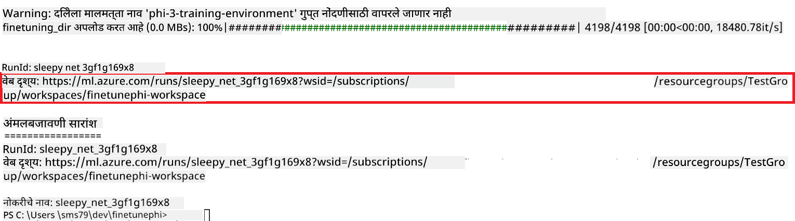

### फाइन-ट्यून केलेले मॉडेल डिप्लॉय करा

फाइन-ट्यून केलेले Phi-3 मॉडेल Prompt Flow सोबत इंटिग्रेट करण्यासाठी, तुम्हाला मॉडेल डिप्लॉय करणे आवश्यक आहे जेणेकरून ते रिअल-टाइम इन्फरन्ससाठी उपलब्ध होईल. या प्रक्रियेत मॉडेल नोंदणी, ऑनलाइन एंडपॉइंट तयार करणे आणि मॉडेल डिप्लॉय करणे यांचा समावेश आहे.

#### डिप्लॉयमेंटसाठी मॉडेल नाव, एंडपॉइंट नाव आणि डिप्लॉयमेंट नाव सेट करा

1. *config.py* फाइल उघडा.

1. `AZURE_MODEL_NAME = "your_fine_tuned_model_name"` या ओळीऐवजी तुमच्या मॉडेलसाठी हवे असलेले नाव टाका.

1. `AZURE_ENDPOINT_NAME = "your_fine_tuned_model_endpoint_name"` या ओळीऐवजी तुमच्या एंडपॉइंटसाठी हवे असलेले नाव टाका.

1. `AZURE_DEPLOYMENT_NAME = "your_fine_tuned_model_deployment_name"` या ओळीऐवजी तुमच्या डिप्लॉयमेंटसाठी हवे असलेले नाव टाका.

#### *deploy_model.py* फाइलमध्ये कोड जोडा

*deploy_model.py* फाइल चालवल्याने संपूर्ण डिप्लॉयमेंट प्रक्रिया स्वयंचलित होते. ही फाइल मॉडेल नोंदणी करते, एंडपॉइंट तयार करते आणि config.py फाइलमध्ये दिलेल्या सेटिंग्जनुसार डिप्लॉयमेंट करते, ज्यात मॉडेल नाव, एंडपॉइंट नाव आणि डिप्लॉयमेंट नाव यांचा समावेश आहे.

1. Visual Studio Code मध्ये *deploy_model.py* फाइल उघडा.

1. *deploy_model.py* मध्ये खालील कोड जोडा.

    ```python
    import logging
    from azure.identity import AzureCliCredential
    from azure.ai.ml import MLClient
    from azure.ai.ml.entities import Model, ProbeSettings, ManagedOnlineEndpoint, ManagedOnlineDeployment, IdentityConfiguration, ManagedIdentityConfiguration, OnlineRequestSettings
    from azure.ai.ml.constants import AssetTypes

    # Configuration imports
    from config import (
        AZURE_SUBSCRIPTION_ID,
        AZURE_RESOURCE_GROUP_NAME,
        AZURE_ML_WORKSPACE_NAME,
        AZURE_MANAGED_IDENTITY_RESOURCE_ID,
        AZURE_MANAGED_IDENTITY_CLIENT_ID,
        AZURE_MODEL_NAME,
        AZURE_ENDPOINT_NAME,
        AZURE_DEPLOYMENT_NAME
    )

    # Constants
    JOB_NAME = "your-job-name"
    COMPUTE_INSTANCE_TYPE = "Standard_E4s_v3"

    deployment_env_vars = {
        "SUBSCRIPTION_ID": AZURE_SUBSCRIPTION_ID,
        "RESOURCE_GROUP_NAME": AZURE_RESOURCE_GROUP_NAME,
        "UAI_CLIENT_ID": AZURE_MANAGED_IDENTITY_CLIENT_ID,
    }

    # Logging setup
    logging.basicConfig(
        format="%(asctime)s - %(levelname)s - %(name)s - %(message)s",
        datefmt="%Y-%m-%d %H:%M:%S",
        level=logging.DEBUG
    )
    logger = logging.getLogger(__name__)

    def get_ml_client():
        """Initialize and return the ML Client."""
        credential = AzureCliCredential()
        return MLClient(credential, AZURE_SUBSCRIPTION_ID, AZURE_RESOURCE_GROUP_NAME, AZURE_ML_WORKSPACE_NAME)

    def register_model(ml_client, model_name, job_name):
        """Register a new model."""
        model_path = f"azureml://jobs/{job_name}/outputs/artifacts/paths/model_output"
        logger.info(f"Registering model {model_name} from job {job_name} at path {model_path}.")
        run_model = Model(
            path=model_path,
            name=model_name,
            description="Model created from run.",
            type=AssetTypes.MLFLOW_MODEL,
        )
        model = ml_client.models.create_or_update(run_model)
        logger.info(f"Registered model ID: {model.id}")
        return model

    def delete_existing_endpoint(ml_client, endpoint_name):
        """Delete existing endpoint if it exists."""
        try:
            endpoint_result = ml_client.online_endpoints.get(name=endpoint_name)
            logger.info(f"Deleting existing endpoint {endpoint_name}.")
            ml_client.online_endpoints.begin_delete(name=endpoint_name).result()
            logger.info(f"Deleted existing endpoint {endpoint_name}.")
        except Exception as e:
            logger.info(f"No existing endpoint {endpoint_name} found to delete: {e}")

    def create_or_update_endpoint(ml_client, endpoint_name, description=""):
        """Create or update an endpoint."""
        delete_existing_endpoint(ml_client, endpoint_name)
        logger.info(f"Creating new endpoint {endpoint_name}.")
        endpoint = ManagedOnlineEndpoint(
            name=endpoint_name,
            description=description,
            identity=IdentityConfiguration(
                type="user_assigned",
                user_assigned_identities=[ManagedIdentityConfiguration(resource_id=AZURE_MANAGED_IDENTITY_RESOURCE_ID)]
            )
        )
        endpoint_result = ml_client.online_endpoints.begin_create_or_update(endpoint).result()
        logger.info(f"Created new endpoint {endpoint_name}.")
        return endpoint_result

    def create_or_update_deployment(ml_client, endpoint_name, deployment_name, model):
        """Create or update a deployment."""

        logger.info(f"Creating deployment {deployment_name} for endpoint {endpoint_name}.")
        deployment = ManagedOnlineDeployment(
            name=deployment_name,
            endpoint_name=endpoint_name,
            model=model.id,
            instance_type=COMPUTE_INSTANCE_TYPE,
            instance_count=1,
            environment_variables=deployment_env_vars,
            request_settings=OnlineRequestSettings(
                max_concurrent_requests_per_instance=3,
                request_timeout_ms=180000,
                max_queue_wait_ms=120000
            ),
            liveness_probe=ProbeSettings(
                failure_threshold=30,
                success_threshold=1,
                period=100,
                initial_delay=500,
            ),
            readiness_probe=ProbeSettings(
                failure_threshold=30,
                success_threshold=1,
                period=100,
                initial_delay=500,
            ),
        )
        deployment_result = ml_client.online_deployments.begin_create_or_update(deployment).result()
        logger.info(f"Created deployment {deployment.name} for endpoint {endpoint_name}.")
        return deployment_result

    def set_traffic_to_deployment(ml_client, endpoint_name, deployment_name):
        """Set traffic to the specified deployment."""
        try:
            # Fetch the current endpoint details
            endpoint = ml_client.online_endpoints.get(name=endpoint_name)
            
            # Log the current traffic allocation for debugging
            logger.info(f"Current traffic allocation: {endpoint.traffic}")
            
            # Set the traffic allocation for the deployment
            endpoint.traffic = {deployment_name: 100}
            
            # Update the endpoint with the new traffic allocation
            endpoint_poller = ml_client.online_endpoints.begin_create_or_update(endpoint)
            updated_endpoint = endpoint_poller.result()
            
            # Log the updated traffic allocation for debugging
            logger.info(f"Updated traffic allocation: {updated_endpoint.traffic}")
            logger.info(f"Set traffic to deployment {deployment_name} at endpoint {endpoint_name}.")
            return updated_endpoint
        except Exception as e:
            # Log any errors that occur during the process
            logger.error(f"Failed to set traffic to deployment: {e}")
            raise


    def main():
        ml_client = get_ml_client()

        registered_model = register_model(ml_client, AZURE_MODEL_NAME, JOB_NAME)
        logger.info(f"Registered model ID: {registered_model.id}")

        endpoint = create_or_update_endpoint(ml_client, AZURE_ENDPOINT_NAME, "Endpoint for finetuned Phi-3 model")
        logger.info(f"Endpoint {AZURE_ENDPOINT_NAME} is ready.")

        try:
            deployment = create_or_update_deployment(ml_client, AZURE_ENDPOINT_NAME, AZURE_DEPLOYMENT_NAME, registered_model)
            logger.info(f"Deployment {AZURE_DEPLOYMENT_NAME} is created for endpoint {AZURE_ENDPOINT_NAME}.")

            set_traffic_to_deployment(ml_client, AZURE_ENDPOINT_NAME, AZURE_DEPLOYMENT_NAME)
            logger.info(f"Traffic is set to deployment {AZURE_DEPLOYMENT_NAME} at endpoint {AZURE_ENDPOINT_NAME}.")
        except Exception as e:
            logger.error(f"Failed to create or update deployment: {e}")

    if __name__ == "__main__":
        main()

    ```

1. `JOB_NAME` मिळवण्यासाठी खालील टास्क करा:

    - आपण तयार केलेल्या Azure Machine Learning रिसोर्सकडे जा.
    - **Studio web URL** निवडून Azure Machine Learning वर्कस्पेस उघडा.
    - डाव्या बाजूच्या टॅबमधून **Jobs** निवडा.
    - फाइन-ट्यूनिंगसाठी तयार केलेला एक्सपेरिमेंट निवडा, उदा. *finetunephi*.
    - तयार केलेला जॉब निवडा.
- तुमच्या नोकरीचे नाव `JOB_NAME = "your-job-name"` मध्ये *deploy_model.py* फाईलमध्ये कॉपी आणि पेस्ट करा.

1. `COMPUTE_INSTANCE_TYPE` तुमच्या विशिष्ट तपशीलांसह बदला.

1. Azure Machine Learning मध्ये *deploy_model.py* स्क्रिप्ट चालवण्यासाठी आणि डिप्लॉयमेंट प्रक्रिया सुरू करण्यासाठी खालील कमांड टाइप करा.

    ```python
    python deploy_model.py
    ```


> [!WARNING]
> तुमच्या खात्यावर अतिरिक्त शुल्क टाळण्यासाठी, Azure Machine Learning वर्कस्पेसमध्ये तयार केलेला endpoint नक्कीच डिलीट करा.
>

#### Azure Machine Learning वर्कस्पेसमध्ये डिप्लॉयमेंट स्थिती तपासा

1. [Azure ML Studio](https://ml.azure.com/home?wt.mc_id=studentamb_279723) येथे भेट द्या.

1. तुम्ही तयार केलेल्या Azure Machine Learning वर्कस्पेसकडे जा.

1. Azure Machine Learning वर्कस्पेस उघडण्यासाठी **Studio web URL** निवडा.

1. डाव्या बाजूच्या टॅबमधून **Endpoints** निवडा.

    

2. तुम्ही तयार केलेला endpoint निवडा.

    

3. या पृष्ठावर, तुम्ही डिप्लॉयमेंट प्रक्रियेदरम्यान तयार केलेले endpoints व्यवस्थापित करू शकता.

## परिस्थिती 3: Prompt flow सह एकत्रीकरण करा आणि तुमच्या कस्टम मॉडेलशी चॅट करा

### कस्टम Phi-3 मॉडेल Prompt flow सोबत एकत्र करा

तुमचा फाइन-ट्यून केलेला मॉडेल यशस्वीपणे डिप्लॉय केल्यानंतर, तुम्ही आता तो Prompt flow सोबत एकत्र करू शकता जेणेकरून तुमचा मॉडेल रिअल-टाइम अ‍ॅप्लिकेशन्समध्ये वापरता येईल, आणि तुमच्या कस्टम Phi-3 मॉडेलसह विविध संवादात्मक कार्ये करता येतील.

#### फाइन-ट्यून केलेल्या Phi-3 मॉडेलचा api key आणि endpoint uri सेट करा

1. तुम्ही तयार केलेल्या Azure Machine Learning वर्कस्पेसकडे जा.
1. डाव्या बाजूच्या टॅबमधून **Endpoints** निवडा.
1. तुम्ही तयार केलेला endpoint निवडा.
1. नेव्हिगेशन मेनूमधून **Consume** निवडा.
1. तुमचा **REST endpoint** कॉपी करा आणि *config.py* फाईलमध्ये `AZURE_ML_ENDPOINT = "your_fine_tuned_model_endpoint_uri"` या ओळीऐवजी पेस्ट करा.
1. तुमचा **Primary key** कॉपी करा आणि *config.py* फाईलमध्ये `AZURE_ML_API_KEY = "your_fine_tuned_model_api_key"` या ओळीऐवजी पेस्ट करा.

    

#### *flow.dag.yml* फाईलमध्ये कोड जोडा

1. Visual Studio Code मध्ये *flow.dag.yml* फाईल उघडा.

1. *flow.dag.yml* मध्ये खालील कोड जोडा.

    ```yml
    inputs:
      input_data:
        type: string
        default: "Who founded Microsoft?"

    outputs:
      answer:
        type: string
        reference: ${integrate_with_promptflow.output}

    nodes:
    - name: integrate_with_promptflow
      type: python
      source:
        type: code
        path: integrate_with_promptflow.py
      inputs:
        input_data: ${inputs.input_data}
    ```

#### *integrate_with_promptflow.py* फाईलमध्ये कोड जोडा

1. Visual Studio Code मध्ये *integrate_with_promptflow.py* फाईल उघडा.

1. *integrate_with_promptflow.py* मध्ये खालील कोड जोडा.

    ```python
    import logging
    import requests
    from promptflow.core import tool
    import asyncio
    import platform
    from config import (
        AZURE_ML_ENDPOINT,
        AZURE_ML_API_KEY
    )

    # Logging setup
    logging.basicConfig(
        format="%(asctime)s - %(levelname)s - %(name)s - %(message)s",
        datefmt="%Y-%m-%d %H:%M:%S",
        level=logging.DEBUG
    )
    logger = logging.getLogger(__name__)

    def query_azml_endpoint(input_data: list, endpoint_url: str, api_key: str) -> str:
        """
        Send a request to the Azure ML endpoint with the given input data.
        """
        headers = {
            "Content-Type": "application/json",
            "Authorization": f"Bearer {api_key}"
        }
        data = {
            "input_data": [input_data],
            "params": {
                "temperature": 0.7,
                "max_new_tokens": 128,
                "do_sample": True,
                "return_full_text": True
            }
        }
        try:
            response = requests.post(endpoint_url, json=data, headers=headers)
            response.raise_for_status()
            result = response.json()[0]
            logger.info("Successfully received response from Azure ML Endpoint.")
            return result
        except requests.exceptions.RequestException as e:
            logger.error(f"Error querying Azure ML Endpoint: {e}")
            raise

    def setup_asyncio_policy():
        """
        Setup asyncio event loop policy for Windows.
        """
        if platform.system() == 'Windows':
            asyncio.set_event_loop_policy(asyncio.WindowsSelectorEventLoopPolicy())
            logger.info("Set Windows asyncio event loop policy.")

    @tool
    def my_python_tool(input_data: str) -> str:
        """
        Tool function to process input data and query the Azure ML endpoint.
        """
        setup_asyncio_policy()
        return query_azml_endpoint(input_data, AZURE_ML_ENDPOINT, AZURE_ML_API_KEY)

    ```

### तुमच्या कस्टम मॉडेलशी चॅट करा

1. Azure Machine Learning मध्ये *deploy_model.py* स्क्रिप्ट चालवण्यासाठी आणि डिप्लॉयमेंट प्रक्रिया सुरू करण्यासाठी खालील कमांड टाइप करा.

    ```python
    pf flow serve --source ./ --port 8080 --host localhost
    ```

1. खाली यशस्वी परिणामांचे उदाहरण दिले आहे: आता तुम्ही तुमच्या कस्टम Phi-3 मॉडेलशी चॅट करू शकता. फाइन-ट्यूनिंगसाठी वापरलेल्या डेटावर आधारित प्रश्न विचारणे शिफारसीय आहे.

    

**अस्वीकरण**:  
हा दस्तऐवज AI अनुवाद सेवा [Co-op Translator](https://github.com/Azure/co-op-translator) वापरून अनुवादित केला आहे. आम्ही अचूकतेसाठी प्रयत्नशील असलो तरी, कृपया लक्षात घ्या की स्वयंचलित अनुवादांमध्ये चुका किंवा अचूकतेची कमतरता असू शकते. मूळ दस्तऐवज त्याच्या स्थानिक भाषेत अधिकृत स्रोत मानला जावा. महत्त्वाच्या माहितीसाठी व्यावसायिक मानवी अनुवाद करण्याची शिफारस केली जाते. या अनुवादाच्या वापरामुळे उद्भवणाऱ्या कोणत्याही गैरसमजुती किंवा चुकीच्या अर्थलागी आम्ही जबाबदार नाही.