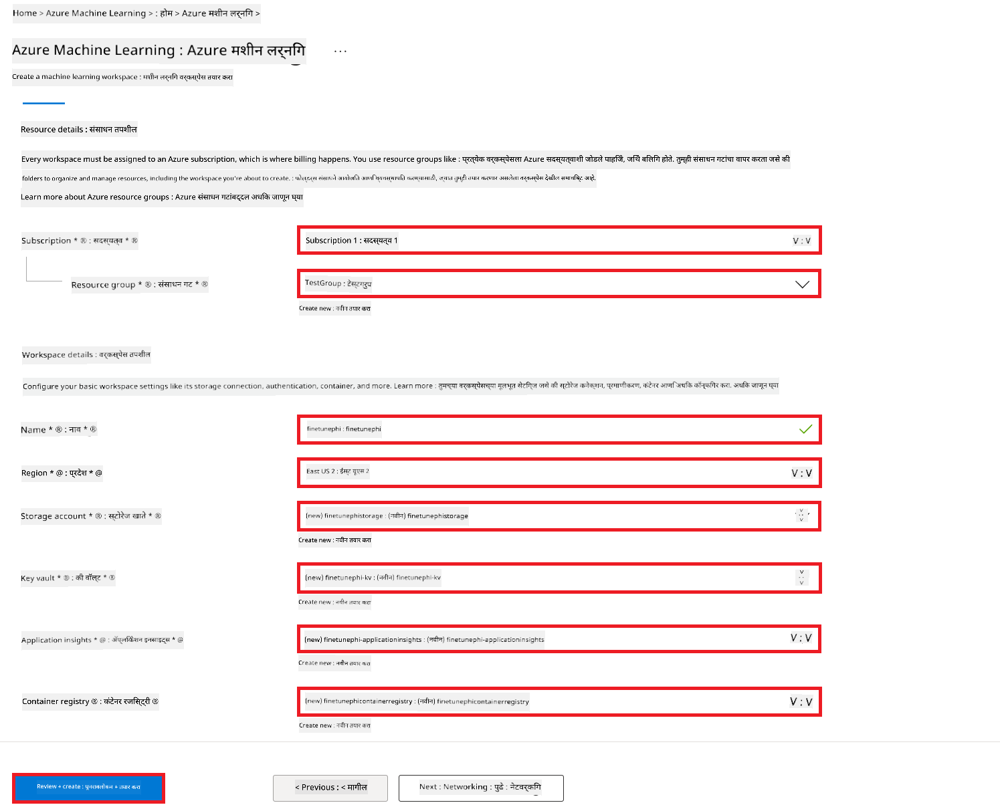
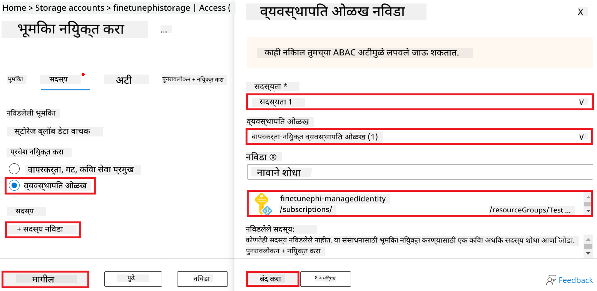
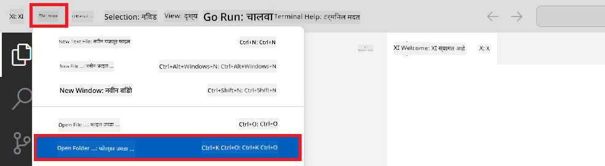
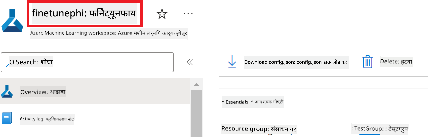
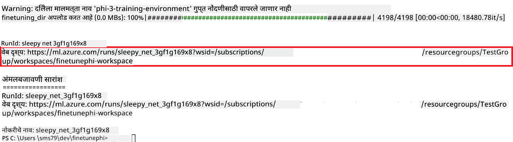
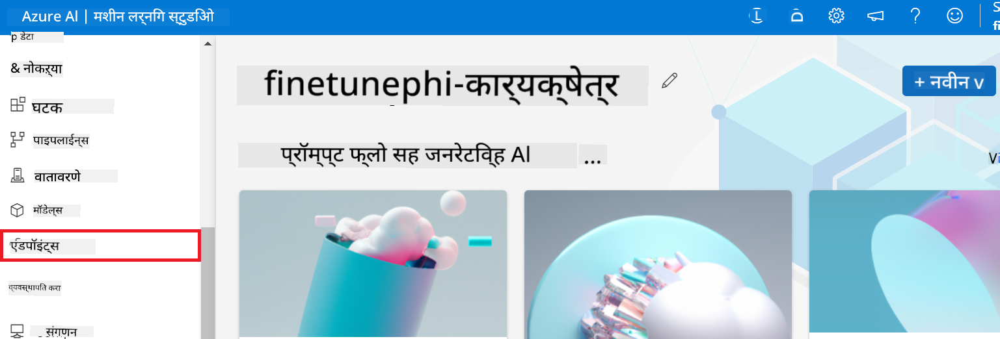

<!--
CO_OP_TRANSLATOR_METADATA:
{
  "original_hash": "7ca2c30fdb802664070e9cfbf92e24fe",
  "translation_date": "2026-01-05T02:05:26+00:00",
  "source_file": "md/02.Application/01.TextAndChat/Phi3/E2E_Phi-3-FineTuning_PromptFlow_Integration.md",
  "language_code": "mr"
}
-->
# Fine-tune and Integrate custom Phi-3 models with Prompt flow

This end-to-end (E2E) sample is based on the guide "[Fine-Tune and Integrate Custom Phi-3 Models with Prompt Flow: Step-by-Step Guide](https://techcommunity.microsoft.com/t5/educator-developer-blog/fine-tune-and-integrate-custom-phi-3-models-with-prompt-flow/ba-p/4178612?WT.mc_id=aiml-137032-kinfeylo)" from the Microsoft Tech Community. It introduces the processes of fine-tuning, deploying, and integrating custom Phi-3 models with Prompt flow.

## Overview

In this E2E sample, you will learn how to fine-tune the Phi-3 model and integrate it with Prompt flow. By leveraging Azure Machine Learning, and Prompt flow you will establish a workflow for deploying and utilizing custom AI models. This E2E sample is divided into three scenarios:

**Scenario 1: Set up Azure resources and Prepare for fine-tuning**

**Scenario 2: Fine-tune the Phi-3 model and Deploy in Azure Machine Learning Studio**

**Scenario 3: Integrate with Prompt flow and Chat with your custom model**

Here is an overview of this E2E sample.


### Table of Contents

1. **[परिदृश्य 1: Azure संसाधने सेट करा आणि फाइन-ट्यूनिंगसाठी तयार करा](../../../../../../md/02.Application/01.TextAndChat/Phi3)**
    - [Azure Machine Learning वर्कस्पेस तयार करा](../../../../../../md/02.Application/01.TextAndChat/Phi3)
    - [Azure सदस्यत्वात GPU कोटा विनंती करा](../../../../../../md/02.Application/01.TextAndChat/Phi3)
    - [भूमिकेचे असाइनमेंट जोडा](../../../../../../md/02.Application/01.TextAndChat/Phi3)
    - [प्रोजेक्ट सेट अप करा](../../../../../../md/02.Application/01.TextAndChat/Phi3)
    - [फाइन-ट्यूनिंगसाठी डेटासेट तयार करा](../../../../../../md/02.Application/01.TextAndChat/Phi3)

1. **[परिदृश्य 2: Phi-3 मॉडेल फाइन-ट्यून करा आणि Azure Machine Learning Studio मध्ये तैनात करा](../../../../../../md/02.Application/01.TextAndChat/Phi3)**
    - [Azure CLI सेट अप करा](../../../../../../md/02.Application/01.TextAndChat/Phi3)
    - [Phi-3 मॉडेल फाइन-ट्यून करा](../../../../../../md/02.Application/01.TextAndChat/Phi3)
    - [फाइन-ट्यून केलेले मॉडेल तैनात करा](../../../../../../md/02.Application/01.TextAndChat/Phi3)

1. **[परिदृश्य 3: Prompt flow सह समाकलित करा आणि आपल्या कस्टम मॉडेलनुसार चॅट करा](../../../../../../md/02.Application/01.TextAndChat/Phi3)**
    - [कस्टम Phi-3 मॉडेल Prompt flow सोबत इंटीग्रेट करा](../../../../../../md/02.Application/01.TextAndChat/Phi3)
    - [आपल्या कस्टम मॉडेलसोबत चॅट करा](../../../../../../md/02.Application/01.TextAndChat/Phi3)

## Scenario 1: Set up Azure resources and Prepare for fine-tuning

### Create an Azure Machine Learning Workspace

1. टाइप करा *azure machine learning* पोर्टल पृष्ठाच्या वरच्या भागातील **search bar** मध्ये आणि दिसणाऱ्या पर्यायांमधून **Azure Machine Learning** निवडा.

    

1. नेव्हिगेशन मेन्यूमधून **+ Create** निवडा.

1. नेव्हिगेशन मेन्यूमधून **New workspace** निवडा.

    

1. खालील कार्ये करा:

    - आपले Azure **Subscription** निवडा.
    - वापरण्यासाठी **Resource group** निवडा (गरज असल्यास नवीन तयार करा).
    - **Workspace Name** लिहा. हे अद्वितीय नाव असणे आवश्यक आहे.
    - आपण वापरू इच्छित **Region** निवडा.
    - वापरण्यासाठी **Storage account** निवडा (गरज असल्यास नवीन तयार करा).
    - वापरण्यासाठी **Key vault** निवडा (गरज असल्यास नवीन तयार करा).
    - वापरण्यासाठी **Application insights** निवडा (गरज असल्यास नवीन तयार करा).
    - वापरण्यासाठी **Container registry** निवडा (गरज असल्यास नवीन तयार करा).

    

1. **Review + Create** निवडा.

1. **Create** निवडा.

### Request GPU quotas in Azure Subscription

In this E2E sample, you will use the *Standard_NC24ads_A100_v4 GPU* for fine-tuning, which requires a quota request, and the *Standard_E4s_v3* CPU for deployment, which does not require a quota request.

> [!NOTE]
>
> फक्त Pay-As-You-Go सदस्यत्व (मानक सदस्यत्व प्रकार) GPU विभाजनासाठी पात्र आहेत; लाभ सदस्यत्व सध्या समर्थनात नाहीत.
>
> Visual Studio Enterprise Subscription सारख्या लाभ सदस्यत्वाचा वापर करणाऱ्यांसाठी किंवा ज्यांना फाइन-ट्यूनिंग व तैनाती प्रक्रियेची जलद चाचणी करायची आहे, त्यांच्यासाठी हा मार्गदर्शक CPU सह लहान डेटासेट वापरून फाइन-ट्यूनिंगचे मार्गदर्शन देखील प्रदान करतो. परंतु हे लक्षात ठेवणे महत्त्वाचे आहे की मोठ्या डेटासेटसह GPU वापरल्यास फाइन-ट्यूनिंगचे निकाल खूपच चांगले असतात.

1. भेट द्या [Azure ML Studio](https://ml.azure.com/home?wt.mc_id=studentamb_279723).

1. *Standard NCADSA100v4 Family* कोटा विनंती करण्यासाठी खालील कार्ये करा:

    - डाव्या साइड टॅबमधून **Quota** निवडा.
    - वापरायचे **Virtual machine family** निवडा. उदाहरणार्थ, **Standard NCADSA100v4 Family Cluster Dedicated vCPUs** निवडा, ज्यामध्ये *Standard_NC24ads_A100_v4* GPU समाविष्ट आहे.
    - नेव्हिगेशन मेन्यूमधून **Request quota** निवडा.

        

    - Request quota पृष्ठात, आपण वापरू इच्छित **New cores limit** टाका. उदाहरणार्थ, 24.
    - Request quota पृष्ठात, GPU कोटा विनंती करण्यासाठी **Submit** निवडा.

> [!NOTE]
> आपण आपल्या गरजेनुसार योग्य GPU किंवा CPU निवडू शकता हे तपासण्यासाठी [Sizes for Virtual Machines in Azure](https://learn.microsoft.com/azure/virtual-machines/sizes/overview?tabs=breakdownseries%2Cgeneralsizelist%2Ccomputesizelist%2Cmemorysizelist%2Cstoragesizelist%2Cgpusizelist%2Cfpgasizelist%2Chpcsizelist) दस्तऐवज पहा.

### Add role assignment

आपले मॉडेल फाइन-ट्यून आणि तैनात करण्यासाठी, प्रथम User Assigned Managed Identity (UAI) तयार करावी आणि त्याला योग्य परवानग्या असाइन कराव्यात. ही UAI तैनाती दरम्यान प्रमाणीकरणासाठी वापरली जाईल

#### Create User Assigned Managed Identity(UAI)

1. टाइप करा *managed identities* पोर्टल पृष्ठाच्या वरच्या भागातील **search bar** मध्ये आणि दिसणाऱ्या पर्यायांमधून **Managed Identities** निवडा.

    

1. **+ Create** निवडा.

    

1. खालील कार्ये करा:

    - आपले Azure **Subscription** निवडा.
    - वापरण्यासाठी **Resource group** निवडा (गरज असल्यास नवीन तयार करा).
    - आपण वापरू इच्छित **Region** निवडा.
    - **Name** लिहा. हे अद्वितीय असणे आवश्यक आहे.

1. **Review + create** निवडा.

1. **+ Create** निवडा.

#### Add Contributor role assignment to Managed Identity

1. आपण तयार केलेल्या Managed Identity संसाधनाकडे जा.

1. डाव्या साइड टॅबमधून **Azure role assignments** निवडा.

1. नेव्हिगेशन मेन्यूमधून **+Add role assignment** निवडा.

1. Add role assignment पृष्ठात, खालील कार्ये करा:
    - **Scope** ला **Resource group** सेट करा.
    - आपले Azure **Subscription** निवडा.
    - वापरण्यासाठी **Resource group** निवडा.
    - **Role** ला **Contributor** निवडा.

    

1. **Save** निवडा.

#### Add Storage Blob Data Reader role assignment to Managed Identity

1. टाइप करा *storage accounts* पोर्टल पृष्ठाच्या वरच्या भागातील **search bar** मध्ये आणि दिसणाऱ्या पर्यायांमधून **Storage accounts** निवडा.

    

1. Azure Machine Learning वर्कस्पेसशी संबंधित storage account निवडा ज्याची आपण निर्मिती केली होती. उदाहरणार्थ, *finetunephistorage*.

1. Add role assignment पृष्ठावर नेव्हिगेट करण्यासाठी खालील कार्ये करा:

    - आपण तयार केलेल्या Azure Storage account कडे जा.
    - डाव्या साइड टॅबमधून **Access Control (IAM)** निवडा.
    - नेव्हिगेशन मेन्यूमधून **+ Add** निवडा.
    - नेव्हिगेशन मेन्यूमधून **Add role assignment** निवडा.

    

1. Add role assignment पृष्ठात, खालील कार्ये करा:

    - Role पृष्ठात, **search bar** मध्ये *Storage Blob Data Reader* टाइप करा आणि दिसणाऱ्या पर्यायांमधून **Storage Blob Data Reader** निवडा.
    - Role पृष्ठात, **Next** निवडा.
    - Members पृष्ठात, **Assign access to** म्हणून **Managed identity** निवडा.
    - Members पृष्ठात, **+ Select members** निवडा.
    - Select managed identities पृष्ठात, आपले Azure **Subscription** निवडा.
    - Select managed identities पृष्ठात, **Managed identity** म्हणून **Manage Identity** निवडा.
    - Select managed identities पृष्ठात, आपण तयार केलेली Manage Identity निवडा. उदाहरणार्थ, *finetunephi-managedidentity*.
    - Select managed identities पृष्ठात, **Select** निवडा.

    

1. **Review + assign** निवडा.

#### Add AcrPull role assignment to Managed Identity

1. टाइप करा *container registries* पोर्टल पृष्ठाच्या वरच्या भागातील **search bar** मध्ये आणि दिसणाऱ्या पर्यायांमधून **Container registries** निवडा.

    

1. Azure Machine Learning वर्कस्पेसशी संबंधित container registry निवडा. उदाहरणार्थ, *finetunephicontainerregistries*

1. Add role assignment पृष्ठावर नेव्हिगेट करण्यासाठी खालील कार्ये करा:

    - डाव्या साइड टॅबमधून **Access Control (IAM)** निवडा.
    - नेव्हिगेशन मेन्यूमधून **+ Add** निवडा.
    - नेव्हिगेशन मेन्यूमधून **Add role assignment** निवडा.

1. Add role assignment पृष्ठात, खालील कार्ये करा:

    - Role पृष्ठात, **search bar** मध्ये *AcrPull* टाइप करा आणि दिसणाऱ्या पर्यायांमधून **AcrPull** निवडा.
    - Role पृष्ठात, **Next** निवडा.
    - Members पृष्ठात, **Assign access to** म्हणून **Managed identity** निवडा.
    - Members पृष्ठात, **+ Select members** निवडा.
    - Select managed identities पृष्ठात, आपले Azure **Subscription** निवडा.
    - Select managed identities पृष्ठात, **Managed identity** म्हणून **Manage Identity** निवडा.
    - Select managed identities पृष्ठात, आपण तयार केलेली Manage Identity निवडा. उदाहरणार्थ, *finetunephi-managedidentity*.
    - Select managed identities पृष्ठात, **Select** निवडा.
    - **Review + assign** निवडा.

### Set up project

आता, आपण काम करण्यासाठी एक फोल्डर तयार कराल आणि वापरकर्त्यांशी संवाद साधणारे आणि Azure Cosmos DB मध्ये संग्रहित चॅट इतिहासाचा वापर करून प्रतिसाद तयार करणारे प्रोग्राम विकसित करण्यासाठी वर्चुअल एन्व्हायर्नमेंट सेटअप कराल.

#### Create a folder to work inside it

1. टर्मिनल विंडो उघडा आणि डिफॉल्ट पाथमध्ये *finetune-phi* नावाचा फोल्डर तयार करण्यासाठी खालील आदेश टाइप करा.

    ```console
    mkdir finetune-phi
    ```

1. आपल्या टर्मिनलच्या आत तयार केलेल्या *finetune-phi* फोल्डरमध्ये नेव्हिगेट करण्यासाठी खालील आदेश टाइप करा.

    ```console
    cd finetune-phi
    ```

#### Create a virtual environment

1. आपल्या टर्मिनलमध्ये *.venv* नावाचे वर्चुअल एन्व्हायर्नमेंट तयार करण्यासाठी खालील आदेश टाइप करा.

    ```console
    python -m venv .venv
    ```

1. वर्चुअल एन्व्हायर्नमेंट सक्रिय करण्यासाठी आपल्या टर्मिनलमध्ये खालील आदेश टाइप करा.

    ```console
    .venv\Scripts\activate.bat
    ```

> [!NOTE]
>
> जर ते काम केले असेल तर आदेश प्रॉम्प्टच्या आधी *(.venv)* दिसावे.

#### Install the required packages

1. आवश्यक पॅकेजेस इन्स्टॉल करण्यासाठी आपल्या टर्मिनलमध्ये खालील आदेश टाइप करा.

    ```console
    pip install datasets==2.19.1
    pip install transformers==4.41.1
    pip install azure-ai-ml==1.16.0
    pip install torch==2.3.1
    pip install trl==0.9.4
    pip install promptflow==1.12.0
    ```

#### Create project files
या व्यायामात, आपण आपल्या प्रोजेक्टसाठी आवश्यक फाइल्स तयार कराल. या फाइल्समध्ये डेटासेट डाउनलोड करण्यासाठी स्क्रिप्ट्स, Azure Machine Learning वातावरण सेटअप करण्यासाठी स्क्रिप्ट, Phi-3 मॉडेलचे फाइन-ट्यूनिंग आणि फाइन-ट्यून केलेले मॉडेल डिप्लॉय करण्यासाठी स्क्रिप्ट्स समाविष्ट आहेत. आपण फाइन-ट्यूनिंग वातावरण सेट करण्यासाठी *conda.yml* फाइल देखील तयार कराल.

या व्यायामात, आपण:

- *download_dataset.py* फाइल तयार कराल ज्याने डेटासेट डाउनलोड केले जाईल.
- *setup_ml.py* फाइल तयार कराल ज्याने Azure Machine Learning वातावरण सेट होईल.
- *finetuning_dir* फोल्डरमध्ये *fine_tune.py* फाइल तयार कराल ज्यात डेटासेट वापरून Phi-3 मॉडेलचे फाइन-ट्यूनिंग केले जाईल.
- फाइन-ट्यूनिंग वातावरण सेट करण्यासाठी *conda.yml* फाइल तयार कराल.
- फाइन-ट्यून केलेले मॉडेल डिप्लॉय करण्यासाठी *deploy_model.py* फाइल तयार कराल.
- फाइन-ट्यून केलेले मॉडेल Prompt flow सह इंटरग्रेट करण्यासाठी आणि मॉडेल चालवण्यासाठी *integrate_with_promptflow.py* फाइल तयार कराल.
- Prompt flow साठी वर्कफ्लो संरचना सेट करण्यासाठी flow.dag.yml फाइल तयार कराल.
- Azure माहिती प्रविष्ट करण्यासाठी *config.py* फाइल तयार कराल.

> [!NOTE]
>
> पूर्ण फोल्डर संरचना:
>
> ```text
> └── YourUserName
> .    └── finetune-phi
> .        ├── finetuning_dir
> .        │      └── fine_tune.py
> .        ├── conda.yml
> .        ├── config.py
> .        ├── deploy_model.py
> .        ├── download_dataset.py
> .        ├── flow.dag.yml
> .        ├── integrate_with_promptflow.py
> .        └── setup_ml.py
> ```

1. **Visual Studio Code** उघडा.

1. मेनू बारमधून **File** निवडा.

1. **Open Folder** निवडा.

1. आपण तयार केलेला *finetune-phi* फोल्डर निवडा, जो *C:\Users\yourUserName\finetune-phi* येथे आहे.

    

1. Visual Studio Code च्या डाव्या पॅन मध्ये, राईट-क्लिक करा आणि **New File** निवडून *download_dataset.py* नावाची एक नवीन फाइल तयार करा.

1. Visual Studio Code च्या डाव्या पॅन मध्ये, राईट-क्लिक करा आणि **New File** निवडून *setup_ml.py* नावाची एक नवीन फाइल तयार करा.

1. Visual Studio Code च्या डाव्या पॅन मध्ये, राईट-क्लिक करा आणि **New File** निवडून *deploy_model.py* नावाची एक नवीन फाइल तयार करा.

    

1. Visual Studio Code च्या डाव्या पॅन मध्ये, राईट-क्लिक करा आणि **New Folder** निवडून *finetuning_dir* नावाचा एक नवीन फोल्डर तयार करा.

1. *finetuning_dir* फोल्डरमध्ये, *fine_tune.py* नावाची एक नवीन फाइल तयार करा.

#### Create and Configure *conda.yml* file

1. Visual Studio Code च्या डाव्या पॅन मध्ये, राईट-क्लिक करा आणि **New File** निवडून *conda.yml* नावाची एक नवीन फाइल तयार करा.

1. *conda.yml* फाइलमध्ये खालील कोड जोडा ज्याने Phi-3 मॉडेलसाठी फाइन-ट्यूनिंग वातावरण सेट होईल.

    ```yml
    name: phi-3-training-env
    channels:
      - defaults
      - conda-forge
    dependencies:
      - python=3.10
      - pip
      - numpy<2.0
      - pip:
          - torch==2.4.0
          - torchvision==0.19.0
          - trl==0.8.6
          - transformers==4.41
          - datasets==2.21.0
          - azureml-core==1.57.0
          - azure-storage-blob==12.19.0
          - azure-ai-ml==1.16
          - azure-identity==1.17.1
          - accelerate==0.33.0
          - mlflow==2.15.1
          - azureml-mlflow==1.57.0
    ```

#### Create and Configure *config.py* file

1. Visual Studio Code च्या डाव्या पॅन मध्ये, राईट-क्लिक करा आणि **New File** निवडून *config.py* नावाची एक नवीन फाइल तयार करा.

1. आपल्या Azure माहिती समाविष्ट करण्यासाठी *config.py* फाइलमध्ये खालील कोड जोडा.

    ```python
    # Azure सेटिंग्ज
    AZURE_SUBSCRIPTION_ID = "your_subscription_id"
    AZURE_RESOURCE_GROUP_NAME = "your_resource_group_name" # "TestGroup"

    # Azure मशीन लर्निंग सेटिंग्ज
    AZURE_ML_WORKSPACE_NAME = "your_workspace_name" # "finetunephi-workspace"

    # Azure व्यवस्थापित ओळख सेटिंग्ज
    AZURE_MANAGED_IDENTITY_CLIENT_ID = "your_azure_managed_identity_client_id"
    AZURE_MANAGED_IDENTITY_NAME = "your_azure_managed_identity_name" # "finetunephi-mangedidentity"
    AZURE_MANAGED_IDENTITY_RESOURCE_ID = f"/subscriptions/{AZURE_SUBSCRIPTION_ID}/resourceGroups/{AZURE_RESOURCE_GROUP_NAME}/providers/Microsoft.ManagedIdentity/userAssignedIdentities/{AZURE_MANAGED_IDENTITY_NAME}"

    # डेटासेट फाइल मार्ग
    TRAIN_DATA_PATH = "data/train_data.jsonl"
    TEST_DATA_PATH = "data/test_data.jsonl"

    # फाइन-ट्यून केलेल्या मॉडेलच्या सेटिंग्ज
    AZURE_MODEL_NAME = "your_fine_tuned_model_name" # "finetune-phi-model"
    AZURE_ENDPOINT_NAME = "your_fine_tuned_model_endpoint_name" # "finetune-phi-endpoint"
    AZURE_DEPLOYMENT_NAME = "your_fine_tuned_model_deployment_name" # "finetune-phi-deployment"

    AZURE_ML_API_KEY = "your_fine_tuned_model_api_key"
    AZURE_ML_ENDPOINT = "your_fine_tuned_model_endpoint_uri" # "https://{your-endpoint-name}.{your-region}.inference.ml.azure.com/score"
    ```

#### Azure पर्यावरणाचे व्हेरिएबल जोडा

1. Azure Subscription ID जोडण्यासाठी खालील कामे करा:

    - पोर्टल पृष्ठाच्या शीर्षभागी असलेल्या **search bar** मध्ये *subscriptions* टाइप करा आणि दिसणाऱ्या पर्यायांमधून **Subscriptions** निवडा.
    - आपण सध्या वापरत असलेली Azure Subscription निवडा.
    - आपला Subscription ID कॉपी करा आणि *config.py* फाइलमध्ये पेस्ट करा.

    

1. Azure Workspace Name जोडण्यासाठी खालील कामे करा:

    - आपण निर्माण केलेल्या Azure Machine Learning रिसोर्सकडे नेव्हिगेट करा.
    - आपले खाते नाव कॉपी करा आणि *config.py* फाइलमध्ये पेस्ट करा.

    

1. Azure Resource Group Name जोडण्यासाठी खालील कामे करा:

    - आपण निर्माण केलेल्या Azure Machine Learning रिसोर्सकडे नेव्हिगेट करा.
    - आपले Azure Resource Group Name कॉपी करा आणि *config.py* फाइलमध्ये पेस्ट करा.

    

2. Azure Managed Identity नाव जोडण्यासाठी खालील कामे करा:

    - आपण तयार केलेल्या Managed Identities रिसोर्सकडे नेव्हिगेट करा.
    - आपले Azure Managed Identity नाव कॉपी करा आणि *config.py* फाइलमध्ये पेस्ट करा.

    

### फाइन-ट्यूनिंगसाठी डेटासेट तयार करा

या व्यायामात, आपण *download_dataset.py* फाइल चालवून *ULTRACHAT_200k* डेटासेट्स आपल्या स्थानिक वातावरणात डाउनलोड कराल. नंतर आपण हा डेटासेट Azure Machine Learning मध्ये Phi-3 मॉडेल फाइन-ट्यून करण्यासाठी वापराल.

#### *download_dataset.py* वापरून आपले डेटासेट डाउनलोड करा

1. Visual Studio Code मध्ये *download_dataset.py* फाइल उघडा.

1. *download_dataset.py* मध्ये खालील कोड जोडा.

    ```python
    import json
    import os
    from datasets import load_dataset
    from config import (
        TRAIN_DATA_PATH,
        TEST_DATA_PATH)

    def load_and_split_dataset(dataset_name, config_name, split_ratio):
        """
        Load and split a dataset.
        """
        # निर्दिष्ट नाव, कॉन्फिगरेशन आणि विभाजन प्रमाणासह डेटासेट लोड करा
        dataset = load_dataset(dataset_name, config_name, split=split_ratio)
        print(f"Original dataset size: {len(dataset)}")
        
        # डेटासेटला प्रशिक्षण आणि चाचणी संचांमध्ये विभाजित करा (80% प्रशिक्षण, 20% चाचणी)
        split_dataset = dataset.train_test_split(test_size=0.2)
        print(f"Train dataset size: {len(split_dataset['train'])}")
        print(f"Test dataset size: {len(split_dataset['test'])}")
        
        return split_dataset

    def save_dataset_to_jsonl(dataset, filepath):
        """
        Save a dataset to a JSONL file.
        """
        # निर्देशिका अस्तित्वात नसेल तर ती तयार करा
        os.makedirs(os.path.dirname(filepath), exist_ok=True)
        
        # फाईल लेखन मोडमध्ये उघडा
        with open(filepath, 'w', encoding='utf-8') as f:
            # डेटासेटमधील प्रत्येक रेकॉर्डवर पुनरावृत्ती करा
            for record in dataset:
                # रेकॉर्डला JSON ऑब्जेक्ट म्हणून डंप करा आणि फाईलमध्ये लिहा
                json.dump(record, f)
                # रेकॉर्ड वेगळे करण्यासाठी नवीन ओळ कॅरेक्टर लिहा
                f.write('\n')
        
        print(f"Dataset saved to {filepath}")

    def main():
        """
        Main function to load, split, and save the dataset.
        """
        # ULTRACHAT_200k डेटासेट निर्दिष्ट कॉन्फिगरेशन व विभाजन प्रमाणासह लोड करा आणि विभाजित करा
        dataset = load_and_split_dataset("HuggingFaceH4/ultrachat_200k", 'default', 'train_sft[:1%]')
        
        # विभाजनातून प्रशिक्षण व चाचणी डेटासेट मिळवा
        train_dataset = dataset['train']
        test_dataset = dataset['test']

        # प्रशिक्षण डेटासेट JSONL फाईलमध्ये जतन करा
        save_dataset_to_jsonl(train_dataset, TRAIN_DATA_PATH)
        
        # चाचणी डेटासेट वेगळ्या JSONL फाईलमध्ये जतन करा
        save_dataset_to_jsonl(test_dataset, TEST_DATA_PATH)

    if __name__ == "__main__":
        main()

    ```

> [!TIP]
>
> **CPU वापरून न्यूनतम डेटासेटसह फाइन-ट्यूनिंगसाठी मार्गदर्शन**
>
> जर आपण फाइन-ट्यूनिंगसाठी CPU वापरू इच्छित असाल, तर हा दृष्टिकोन Visual Studio Enterprise Subscription सारख्या बेनिफिट सदस्यत्वांसाठी किंवा फाइन-ट्यूनिंग आणि डिप्लॉयमेंट प्रक्रियेची त्वरीत तपासणी करण्यासाठी उपयुक्त आहे.
>
> `dataset = load_and_split_dataset("HuggingFaceH4/ultrachat_200k", 'default', 'train_sft[:1%]')` या ओळीस `dataset = load_and_split_dataset("HuggingFaceH4/ultrachat_200k", 'default', 'train_sft[:10]')` ने बदला
>

1. आपल्या टर्मिनलमध्ये खालील कमांड टाइप करा ज्याने स्क्रिप्ट चालवून डेटासेट आपल्या स्थानिक वातावरणात डाउनलोड होईल.

    ```console
    python download_data.py
    ```

1. तपासा की डेटासेट्स यशस्वीरित्या आपल्या स्थानिक *finetune-phi/data* निर्देशिकेत जतन झाले आहेत का.

> [!NOTE]
>
> **डेटासेटचा आकार आणि फाइन-ट्यूनिंगचा वेळ**
>
> या E2E सॅम्पलमध्ये, आपण फक्त डेटासेटचा 1% (`train_sft[:1%]`) वापरता. यामुळे डेटा खूपच कमी होतो, ज्यामुळे अपलोड आणि फाइन-ट्यूनिंग प्रक्रिया दोन्ही वेगवान होतात. ट्रेनिंग वेळ आणि मॉडेल कार्यक्षमतेमध्ये योग्य संतुलन शोधण्यासाठी तुम्ही टक्केवारी समायोजित करू शकता. डेटासेटच्या छोट्या उपसमुच्च्याचा वापर केल्याने फाइन-ट्यूनिंगसाठी आवश्यक वेळ कमी होतो, ज्यामुळे E2E सॅम्पलसाठी प्रक्रिया अधिक व्यवस्थापनीय होते.

## परिदृश्य 2: Phi-3 मॉडेलचे फाइन-ट्यून करा आणि Azure Machine Learning Studio मध्ये डिप्लॉय करा

### Azure CLI सेट अप करा

आपल्या वातावरणाचे प्रमाणपत्रीकरण करण्यासाठी Azure CLI सेट अप करणे आवश्यक आहे. Azure CLI आपल्याला कमांड लाइनवरून थेट Azure रिसोर्सेस व्यवस्थापित करण्याची परवानगी देते आणि Azure Machine Learning ला या रिसोर्सेस पोहचण्यासाठी आवश्यक क्रेडेन्शियल्स प्रदान करते. सुरू करण्यासाठी [Azure CLI](https://learn.microsoft.com/cli/azure/install-azure-cli) इंस्टॉल करा

1. एक टर्मिनल विंडो उघडा आणि आपल्या Azure खात्यात लॉगिन करण्यासाठी खालील कमांड टाइप करा.

    ```console
    az login
    ```

1. वापरण्यासाठी आपले Azure खाते निवडा.

1. वापरण्यासाठी आपली Azure subscription निवडा.

    

> [!TIP]
>
> जर Azure मध्ये साइन इन करण्यात अडचण येत असेल, तर डिव्हाइस कोड वापरून प्रयत्न करा. आपल्या Azure खात्यात साइन इन करण्यासाठी टर्मिनल विंडो उघडा आणि खालील कमांड टाइप करा:
>
> ```console
> az login --use-device-code
> ```
>

### Phi-3 मॉडेल फाइन-ट्यून करा

या व्यायामात, आपण दिलेल्या डेटासेटचा वापर करून Phi-3 मॉडेलचे फाइन-ट्यूनिंग कराल. प्रथम, आपण *fine_tune.py* फाइलमध्ये फाइन-ट्यूनिंग प्रक्रिया परिभाषित कराल. नंतर, आपण Azure Machine Learning वातावरण कॉन्फिगर कराल आणि *setup_ml.py* फाइल चालवून फाइन-ट्यूनिंग प्रक्रिया सुरू कराल. ही स्क्रिप्ट सुनिश्चित करते की फাইন-ट्यूनिंग Azure Machine Learning वातावरणातच होते.

*setup_ml.py* चालवल्यास, आपण Azure Machine Learning वातावरणात फाइन-ट्यूनिंग प्रक्रिया चालवता.

#### *fine_tune.py* फाइलमध्ये कोड जोडा

1. *finetuning_dir* फोल्डरमध्ये जा आणि Visual Studio Code मध्ये *fine_tune.py* फाइल उघडा.

1. *fine_tune.py* मध्ये खालील कोड जोडा.

    ```python
    import argparse
    import sys
    import logging
    import os
    from datasets import load_dataset
    import torch
    import mlflow
    from transformers import AutoModelForCausalLM, AutoTokenizer, TrainingArguments
    from trl import SFTTrainer

    # MLflow मधील INVALID_PARAMETER_VALUE त्रुटी टाळण्यासाठी, MLflow एकत्रीकरण अक्षम करा
    os.environ["DISABLE_MLFLOW_INTEGRATION"] = "True"

    # लॉगिंग सेटअप
    logging.basicConfig(
        format="%(asctime)s - %(levelname)s - %(name)s - %(message)s",
        datefmt="%Y-%m-%d %H:%M:%S",
        handlers=[logging.StreamHandler(sys.stdout)],
        level=logging.WARNING
    )
    logger = logging.getLogger(__name__)

    def initialize_model_and_tokenizer(model_name, model_kwargs):
        """
        Initialize the model and tokenizer with the given pretrained model name and arguments.
        """
        model = AutoModelForCausalLM.from_pretrained(model_name, **model_kwargs)
        tokenizer = AutoTokenizer.from_pretrained(model_name)
        tokenizer.model_max_length = 2048
        tokenizer.pad_token = tokenizer.unk_token
        tokenizer.pad_token_id = tokenizer.convert_tokens_to_ids(tokenizer.pad_token)
        tokenizer.padding_side = 'right'
        return model, tokenizer

    def apply_chat_template(example, tokenizer):
        """
        Apply a chat template to tokenize messages in the example.
        """
        messages = example["messages"]
        if messages[0]["role"] != "system":
            messages.insert(0, {"role": "system", "content": ""})
        example["text"] = tokenizer.apply_chat_template(
            messages, tokenize=False, add_generation_prompt=False
        )
        return example

    def load_and_preprocess_data(train_filepath, test_filepath, tokenizer):
        """
        Load and preprocess the dataset.
        """
        train_dataset = load_dataset('json', data_files=train_filepath, split='train')
        test_dataset = load_dataset('json', data_files=test_filepath, split='train')
        column_names = list(train_dataset.features)

        train_dataset = train_dataset.map(
            apply_chat_template,
            fn_kwargs={"tokenizer": tokenizer},
            num_proc=10,
            remove_columns=column_names,
            desc="Applying chat template to train dataset",
        )

        test_dataset = test_dataset.map(
            apply_chat_template,
            fn_kwargs={"tokenizer": tokenizer},
            num_proc=10,
            remove_columns=column_names,
            desc="Applying chat template to test dataset",
        )

        return train_dataset, test_dataset

    def train_and_evaluate_model(train_dataset, test_dataset, model, tokenizer, output_dir):
        """
        Train and evaluate the model.
        """
        training_args = TrainingArguments(
            bf16=True,
            do_eval=True,
            output_dir=output_dir,
            eval_strategy="epoch",
            learning_rate=5.0e-06,
            logging_steps=20,
            lr_scheduler_type="cosine",
            num_train_epochs=3,
            overwrite_output_dir=True,
            per_device_eval_batch_size=4,
            per_device_train_batch_size=4,
            remove_unused_columns=True,
            save_steps=500,
            seed=0,
            gradient_checkpointing=True,
            gradient_accumulation_steps=1,
            warmup_ratio=0.2,
        )

        trainer = SFTTrainer(
            model=model,
            args=training_args,
            train_dataset=train_dataset,
            eval_dataset=test_dataset,
            max_seq_length=2048,
            dataset_text_field="text",
            tokenizer=tokenizer,
            packing=True
        )

        train_result = trainer.train()
        trainer.log_metrics("train", train_result.metrics)

        mlflow.transformers.log_model(
            transformers_model={"model": trainer.model, "tokenizer": tokenizer},
            artifact_path=output_dir,
        )

        tokenizer.padding_side = 'left'
        eval_metrics = trainer.evaluate()
        eval_metrics["eval_samples"] = len(test_dataset)
        trainer.log_metrics("eval", eval_metrics)

    def main(train_file, eval_file, model_output_dir):
        """
        Main function to fine-tune the model.
        """
        model_kwargs = {
            "use_cache": False,
            "trust_remote_code": True,
            "torch_dtype": torch.bfloat16,
            "device_map": None,
            "attn_implementation": "eager"
        }

        # pretrained_model_name = "microsoft/Phi-3-mini-4k-instruct"
        pretrained_model_name = "microsoft/Phi-3.5-mini-instruct"

        with mlflow.start_run():
            model, tokenizer = initialize_model_and_tokenizer(pretrained_model_name, model_kwargs)
            train_dataset, test_dataset = load_and_preprocess_data(train_file, eval_file, tokenizer)
            train_and_evaluate_model(train_dataset, test_dataset, model, tokenizer, model_output_dir)

    if __name__ == "__main__":
        parser = argparse.ArgumentParser()
        parser.add_argument("--train-file", type=str, required=True, help="Path to the training data")
        parser.add_argument("--eval-file", type=str, required=True, help="Path to the evaluation data")
        parser.add_argument("--model_output_dir", type=str, required=True, help="Directory to save the fine-tuned model")
        args = parser.parse_args()
        main(args.train_file, args.eval_file, args.model_output_dir)

    ```

1. *fine_tune.py* फाइल जतन करा आणि बंद करा.

> [!TIP]
> **आपण Phi-3.5 मॉडेल फाइन-ट्यून करू शकता**
>
> *fine_tune.py* फाइलमध्ये, `pretrained_model_name` ला `"microsoft/Phi-3-mini-4k-instruct"` वरून कोणत्याही इच्छित मॉडेलवर बदला ज्याचे आपण फाइन-ट्यूनिंग करायला इच्छिता. उदाहरणार्थ, जर आपण ते `"microsoft/Phi-3.5-mini-instruct"` मध्ये बदलले तर आपण Phi-3.5-mini-instruct मॉडेलचा फाइन-ट्यूनिंगसाठी वापर कराल. आपल्याला हवे असेल ते मॉडेल नाव शोधण्यासाठी आणि वापरण्यासाठी, [Hugging Face](https://huggingface.co/) ला भेट द्या, इच्छित मॉडेल शोधा, आणि नंतर त्याचे नाव `pretrained_model_name` फील्डमध्ये कॉपी-पेस्ट करा.
>
> <image type="content" src="../../../../imgs/02/FineTuning-PromptFlow/finetunephi3.5.png" alt-text="Phi-3.5 चे फाइन-ट्यून करा.">
>

#### *setup_ml.py* फाइलमध्ये कोड जोडा

1. Visual Studio Code मध्ये *setup_ml.py* फाइल उघडा.

1. *setup_ml.py* मध्ये खालील कोड जोडा.

    ```python
    import logging
    from azure.ai.ml import MLClient, command, Input
    from azure.ai.ml.entities import Environment, AmlCompute
    from azure.identity import AzureCliCredential
    from config import (
        AZURE_SUBSCRIPTION_ID,
        AZURE_RESOURCE_GROUP_NAME,
        AZURE_ML_WORKSPACE_NAME,
        TRAIN_DATA_PATH,
        TEST_DATA_PATH
    )

    # स्थिरांक

    # प्रशिक्षणासाठी CPU इन्स्टन्स वापरण्यासाठी खालील ओळींची टिप्पणी काढा
    # COMPUTE_INSTANCE_TYPE = "Standard_E16s_v3" # सीपीयू
    # COMPUTE_NAME = "cpu-e16s-v3"
    # DOCKER_IMAGE_NAME = "mcr.microsoft.com/azureml/openmpi4.1.0-ubuntu20.04:latest"

    # प्रशिक्षणासाठी GPU इन्स्टन्स वापरण्यासाठी खालील ओळींची टिप्पणी काढा
    COMPUTE_INSTANCE_TYPE = "Standard_NC24ads_A100_v4"
    COMPUTE_NAME = "gpu-nc24s-a100-v4"
    DOCKER_IMAGE_NAME = "mcr.microsoft.com/azureml/curated/acft-hf-nlp-gpu:59"

    CONDA_FILE = "conda.yml"
    LOCATION = "eastus2" # आपल्या कंप्यूट क्लस्टरच्या स्थानाने बदला
    FINETUNING_DIR = "./finetuning_dir" # फाइन-ट्यूनिंग स्क्रिप्टचा मार्ग
    TRAINING_ENV_NAME = "phi-3-training-environment" # प्रशिक्षण वातावरणाचे नाव
    MODEL_OUTPUT_DIR = "./model_output" # Azure ML मधील मॉडेल आउटपुट निर्देशिकेचा मार्ग

    # प्रक्रियेचा मागोवा घेण्यासाठी लॉगिंग सेटअप
    logger = logging.getLogger(__name__)
    logging.basicConfig(
        format="%(asctime)s - %(levelname)s - %(name)s - %(message)s",
        datefmt="%Y-%m-%d %H:%M:%S",
        level=logging.WARNING
    )

    def get_ml_client():
        """
        Initialize the ML Client using Azure CLI credentials.
        """
        credential = AzureCliCredential()
        return MLClient(credential, AZURE_SUBSCRIPTION_ID, AZURE_RESOURCE_GROUP_NAME, AZURE_ML_WORKSPACE_NAME)

    def create_or_get_environment(ml_client):
        """
        Create or update the training environment in Azure ML.
        """
        env = Environment(
            image=DOCKER_IMAGE_NAME,  # वातावरणासाठी Docker प्रतिमा
            conda_file=CONDA_FILE,  # Conda पर्यावरण फाइल
            name=TRAINING_ENV_NAME,  # पर्यावरणाचे नाव
        )
        return ml_client.environments.create_or_update(env)

    def create_or_get_compute_cluster(ml_client, compute_name, COMPUTE_INSTANCE_TYPE, location):
        """
        Create or update the compute cluster in Azure ML.
        """
        try:
            compute_cluster = ml_client.compute.get(compute_name)
            logger.info(f"Compute cluster '{compute_name}' already exists. Reusing it for the current run.")
        except Exception:
            logger.info(f"Compute cluster '{compute_name}' does not exist. Creating a new one with size {COMPUTE_INSTANCE_TYPE}.")
            compute_cluster = AmlCompute(
                name=compute_name,
                size=COMPUTE_INSTANCE_TYPE,
                location=location,
                tier="Dedicated",  # कंप्यूट क्लस्टरचा स्तर
                min_instances=0,  # किमान इन्स्टन्सची संख्या
                max_instances=1  # कमाल इन्स्टन्सची संख्या
            )
            ml_client.compute.begin_create_or_update(compute_cluster).wait()  # क्लस्टर तयार होईपर्यंत प्रतीक्षा करा
        return compute_cluster

    def create_fine_tuning_job(env, compute_name):
        """
        Set up the fine-tuning job in Azure ML.
        """
        return command(
            code=FINETUNING_DIR,  # fine_tune.py चा मार्ग
            command=(
                "python fine_tune.py "
                "--train-file ${{inputs.train_file}} "
                "--eval-file ${{inputs.eval_file}} "
                "--model_output_dir ${{inputs.model_output}}"
            ),
            environment=env,  # प्रशिक्षण वातावरण
            compute=compute_name,  # वापरण्यासाठीचा कंप्यूट क्लस्टर
            inputs={
                "train_file": Input(type="uri_file", path=TRAIN_DATA_PATH),  # प्रशिक्षण डेटा फाइलचा मार्ग
                "eval_file": Input(type="uri_file", path=TEST_DATA_PATH),  # मूल्यमापन डेटा फाइलचा मार्ग
                "model_output": MODEL_OUTPUT_DIR
            }
        )

    def main():
        """
        Main function to set up and run the fine-tuning job in Azure ML.
        """
        # ML क्लायंट आरंभीकरण
        ml_client = get_ml_client()

        # पर्यावरण तयार करा
        env = create_or_get_environment(ml_client)
        
        # कंप्यूट क्लस्टर तयार करा किंवा विद्यमान मिळवा
        create_or_get_compute_cluster(ml_client, COMPUTE_NAME, COMPUTE_INSTANCE_TYPE, LOCATION)

        # फाइन-ट्यूनिंग जॉब तयार करा आणि सबमिट करा
        job = create_fine_tuning_job(env, COMPUTE_NAME)
        returned_job = ml_client.jobs.create_or_update(job)  # जॉब सबमिट करा
        ml_client.jobs.stream(returned_job.name)  # जॉब लॉग प्रवाहित करा
        
        # जॉबचे नाव नोंद करा
        job_name = returned_job.name
        print(f"Job name: {job_name}")

    if __name__ == "__main__":
        main()

    ```

1. `COMPUTE_INSTANCE_TYPE`, `COMPUTE_NAME`, आणि `LOCATION` आपल्या विशिष्ट तपशीलांनी बदला.

    ```python
   # प्रशिक्षणासाठी GPU इन्स्टन्स वापरण्यासाठी खालील ओळी अनकॉमेंट करा
    COMPUTE_INSTANCE_TYPE = "Standard_NC24ads_A100_v4"
    COMPUTE_NAME = "gpu-nc24s-a100-v4"
    ...
    LOCATION = "eastus2" # तुमच्या संगणकीय क्लस्टरच्या ठिकाणाने बदला
    ```

> [!TIP]
>
> **CPU वापरून न्यूनतम डेटासेटसह फाइन-ट्यूनिंगसाठी मार्गदर्शन**
>
> जर आपण फाइन-ट्यूनिंगसाठी CPU वापरू इच्छित असाल, तर हा दृष्टिकोन Visual Studio Enterprise Subscription सारख्या बेनिफिट सदस्यत्वांसाठी किंवा फाइन-ट्यूनिंग आणि डिप्लॉयमेंट प्रक्रियेची त्वरीत तपासणी करण्यासाठी उपयुक्त आहे.
>
> 1. *setup_ml* फाइल उघडा.
> 1. `COMPUTE_INSTANCE_TYPE`, `COMPUTE_NAME`, आणि `DOCKER_IMAGE_NAME` खालीलप्रमाणे बदला. जर आपल्याला *Standard_E16s_v3* उपलब्ध नसेल, तर आपण समान CPU इन्स्टन्स वापरू शकता किंवा नवीन क्वोटा मागवू शकता.
> 1. `LOCATION` आपल्या विशिष्ट तपशीलांनी बदला.
>
>    ```python
>    # Uncomment the following lines to use a CPU instance for training
>    COMPUTE_INSTANCE_TYPE = "Standard_E16s_v3" # cpu
>    COMPUTE_NAME = "cpu-e16s-v3"
>    DOCKER_IMAGE_NAME = "mcr.microsoft.com/azureml/openmpi4.1.0-ubuntu20.04:latest"
>    LOCATION = "eastus2" # Replace with the location of your compute cluster
>    ```
>

1. *setup_ml.py* स्क्रिप्ट चालवून Azure Machine Learning मध्ये फाइन-ट्यूनिंग प्रक्रिया सुरू करण्यासाठी खालील कमांड टाइप करा.

    ```python
    python setup_ml.py
    ```

1. या व्यायामात, आपण Azure Machine Learning वापरून यशस्वीपणे Phi-3 मॉडेलचे फाइन-ट्यूनिंग केले आहे. *setup_ml.py* स्क्रिप्ट चालवून, आपण Azure Machine Learning वातावरण सेट केले आहे आणि *fine_tune.py* फाइलमध्ये परिभाषित केलेली फाइन-ट्यूनिंग प्रक्रिया सुरू केली आहे. कृपया लक्षात घ्या की फाइन-ट्यूनिंग प्रक्रियेमध्ये बरीच वेळ लागू शकतो. `python setup_ml.py` कमांड चालवल्यानंतर, प्रक्रिया पूर्ण होईपर्यंत प्रतीक्षा करावी लागेल. टर्मिनलमध्ये दिलेल्या दुव्याद्वारे Azure Machine Learning पोर्टलमध्ये जाऊन आपण फाइन-ट्यूनिंग जॉबची स्थिती पाहू शकता.

    

### फाइन-ट्यून केलेले मॉडेल डिप्लॉय करा

फाइन-ट्यून केलेल्या Phi-3 मॉडेलला Prompt Flow सोबत इंटरग्रेट करण्यासाठी, आपल्याला रिअल-टाइम इन्फरन्ससाठी मॉडेल डिप्लॉय करणे आवश्यक आहे. या प्रक्रियेत मॉडेल नोंदणी करणे, एक ऑनलाइन एंडपॉइंट तयार करणे आणि मॉडेल डिप्लॉय करणे समाविष्ट आहे.

#### डिप्लॉयमेंटसाठी मॉडेल नाव, एंडपॉइंट नाव आणि डिप्लॉयमेंट नाव सेट करा

1. *config.py* फाइल उघडा.

1. `AZURE_MODEL_NAME = "your_fine_tuned_model_name"` हे आपल्या इच्छित मॉडेल नावाने बदला.

1. `AZURE_ENDPOINT_NAME = "your_fine_tuned_model_endpoint_name"` हे आपल्या इच्छित एंडपॉइंट नावाने बदला.

1. `AZURE_DEPLOYMENT_NAME = "your_fine_tuned_model_deployment_name"` हे आपल्या इच्छित डिप्लॉयमेंट नावाने बदला.

#### *deploy_model.py* फाइलमध्ये कोड जोडा

*deploy_model.py* फाइल चालविल्याने संपूर्ण डिप्लॉयमेंट प्रक्रिया ऑटोमेट केली जाते. ही स्क्रिप्ट मॉडेल नोंदवते, एक एंडपॉइंट तयार करते, आणि config.py फाइलमध्ये निर्दिष्ट सेटिंग्जच्या आधारे मॉडेल डिप्लॉय करते, ज्यात मॉडेलचे नाव, एंडपॉइंट नाव आणि डिप्लॉयमेंट नाव समाविष्ट आहेत.

1. Visual Studio Code मध्ये *deploy_model.py* फाइल उघडा.

1. *deploy_model.py* मध्ये खालील कोड जोडा.

    ```python
    import logging
    from azure.identity import AzureCliCredential
    from azure.ai.ml import MLClient
    from azure.ai.ml.entities import Model, ProbeSettings, ManagedOnlineEndpoint, ManagedOnlineDeployment, IdentityConfiguration, ManagedIdentityConfiguration, OnlineRequestSettings
    from azure.ai.ml.constants import AssetTypes

    # कॉन्फिगरेशन आयात
    from config import (
        AZURE_SUBSCRIPTION_ID,
        AZURE_RESOURCE_GROUP_NAME,
        AZURE_ML_WORKSPACE_NAME,
        AZURE_MANAGED_IDENTITY_RESOURCE_ID,
        AZURE_MANAGED_IDENTITY_CLIENT_ID,
        AZURE_MODEL_NAME,
        AZURE_ENDPOINT_NAME,
        AZURE_DEPLOYMENT_NAME
    )

    # स्थिरांक
    JOB_NAME = "your-job-name"
    COMPUTE_INSTANCE_TYPE = "Standard_E4s_v3"

    deployment_env_vars = {
        "SUBSCRIPTION_ID": AZURE_SUBSCRIPTION_ID,
        "RESOURCE_GROUP_NAME": AZURE_RESOURCE_GROUP_NAME,
        "UAI_CLIENT_ID": AZURE_MANAGED_IDENTITY_CLIENT_ID,
    }

    # लॉगिंग सेटअप
    logging.basicConfig(
        format="%(asctime)s - %(levelname)s - %(name)s - %(message)s",
        datefmt="%Y-%m-%d %H:%M:%S",
        level=logging.DEBUG
    )
    logger = logging.getLogger(__name__)

    def get_ml_client():
        """Initialize and return the ML Client."""
        credential = AzureCliCredential()
        return MLClient(credential, AZURE_SUBSCRIPTION_ID, AZURE_RESOURCE_GROUP_NAME, AZURE_ML_WORKSPACE_NAME)

    def register_model(ml_client, model_name, job_name):
        """Register a new model."""
        model_path = f"azureml://jobs/{job_name}/outputs/artifacts/paths/model_output"
        logger.info(f"Registering model {model_name} from job {job_name} at path {model_path}.")
        run_model = Model(
            path=model_path,
            name=model_name,
            description="Model created from run.",
            type=AssetTypes.MLFLOW_MODEL,
        )
        model = ml_client.models.create_or_update(run_model)
        logger.info(f"Registered model ID: {model.id}")
        return model

    def delete_existing_endpoint(ml_client, endpoint_name):
        """Delete existing endpoint if it exists."""
        try:
            endpoint_result = ml_client.online_endpoints.get(name=endpoint_name)
            logger.info(f"Deleting existing endpoint {endpoint_name}.")
            ml_client.online_endpoints.begin_delete(name=endpoint_name).result()
            logger.info(f"Deleted existing endpoint {endpoint_name}.")
        except Exception as e:
            logger.info(f"No existing endpoint {endpoint_name} found to delete: {e}")

    def create_or_update_endpoint(ml_client, endpoint_name, description=""):
        """Create or update an endpoint."""
        delete_existing_endpoint(ml_client, endpoint_name)
        logger.info(f"Creating new endpoint {endpoint_name}.")
        endpoint = ManagedOnlineEndpoint(
            name=endpoint_name,
            description=description,
            identity=IdentityConfiguration(
                type="user_assigned",
                user_assigned_identities=[ManagedIdentityConfiguration(resource_id=AZURE_MANAGED_IDENTITY_RESOURCE_ID)]
            )
        )
        endpoint_result = ml_client.online_endpoints.begin_create_or_update(endpoint).result()
        logger.info(f"Created new endpoint {endpoint_name}.")
        return endpoint_result

    def create_or_update_deployment(ml_client, endpoint_name, deployment_name, model):
        """Create or update a deployment."""

        logger.info(f"Creating deployment {deployment_name} for endpoint {endpoint_name}.")
        deployment = ManagedOnlineDeployment(
            name=deployment_name,
            endpoint_name=endpoint_name,
            model=model.id,
            instance_type=COMPUTE_INSTANCE_TYPE,
            instance_count=1,
            environment_variables=deployment_env_vars,
            request_settings=OnlineRequestSettings(
                max_concurrent_requests_per_instance=3,
                request_timeout_ms=180000,
                max_queue_wait_ms=120000
            ),
            liveness_probe=ProbeSettings(
                failure_threshold=30,
                success_threshold=1,
                period=100,
                initial_delay=500,
            ),
            readiness_probe=ProbeSettings(
                failure_threshold=30,
                success_threshold=1,
                period=100,
                initial_delay=500,
            ),
        )
        deployment_result = ml_client.online_deployments.begin_create_or_update(deployment).result()
        logger.info(f"Created deployment {deployment.name} for endpoint {endpoint_name}.")
        return deployment_result

    def set_traffic_to_deployment(ml_client, endpoint_name, deployment_name):
        """Set traffic to the specified deployment."""
        try:
            # सध्याच्या एंडपॉइंटचे तपशील मिळवा
            endpoint = ml_client.online_endpoints.get(name=endpoint_name)
            
            # डीबगिंगसाठी सध्याच्या ट्रॅफिक वाटपाची लॉग करा
            logger.info(f"Current traffic allocation: {endpoint.traffic}")
            
            # डिप्लॉयमेंटसाठी ट्रॅफिकचे वाटप सेट करा
            endpoint.traffic = {deployment_name: 100}
            
            # नवीन ट्रॅफिक वाटपासह एंडपॉइंट अद्ययावत करा
            endpoint_poller = ml_client.online_endpoints.begin_create_or_update(endpoint)
            updated_endpoint = endpoint_poller.result()
            
            # डीबगिंगसाठी अद्ययावत ट्रॅफिक वाटपाची लॉग करा
            logger.info(f"Updated traffic allocation: {updated_endpoint.traffic}")
            logger.info(f"Set traffic to deployment {deployment_name} at endpoint {endpoint_name}.")
            return updated_endpoint
        except Exception as e:
            # प्रक्रिये दरम्यान होणाऱ्या कोणत्याही त्रुटींची लॉग करा
            logger.error(f"Failed to set traffic to deployment: {e}")
            raise


    def main():
        ml_client = get_ml_client()

        registered_model = register_model(ml_client, AZURE_MODEL_NAME, JOB_NAME)
        logger.info(f"Registered model ID: {registered_model.id}")

        endpoint = create_or_update_endpoint(ml_client, AZURE_ENDPOINT_NAME, "Endpoint for finetuned Phi-3 model")
        logger.info(f"Endpoint {AZURE_ENDPOINT_NAME} is ready.")

        try:
            deployment = create_or_update_deployment(ml_client, AZURE_ENDPOINT_NAME, AZURE_DEPLOYMENT_NAME, registered_model)
            logger.info(f"Deployment {AZURE_DEPLOYMENT_NAME} is created for endpoint {AZURE_ENDPOINT_NAME}.")

            set_traffic_to_deployment(ml_client, AZURE_ENDPOINT_NAME, AZURE_DEPLOYMENT_NAME)
            logger.info(f"Traffic is set to deployment {AZURE_DEPLOYMENT_NAME} at endpoint {AZURE_ENDPOINT_NAME}.")
        except Exception as e:
            logger.error(f"Failed to create or update deployment: {e}")

    if __name__ == "__main__":
        main()

    ```

1. `JOB_NAME` मिळवण्यासाठी खालील कामे करा:

    - आपण तयार केलेल्या Azure Machine Learning रिसोर्सकडे नेव्हिगेट करा.
    - Azure Machine Learning वर्कस्पेस उघडण्यासाठी **Studio web URL** निवडा.
    - डाव्या बाजूच्या टॅबमधून **Jobs** निवडा.
    - फाइन-ट्यूनिंगसाठी केलेले experiment निवडा. उदाहरणार्थ, *finetunephi*.
    - आपण तयार केलेला job निवडा.
    - तुमचे जॉब नाव कॉपी करा आणि `JOB_NAME = "your-job-name"` हे *deploy_model.py* फाइलमध्ये पेस्ट करा.

1. `COMPUTE_INSTANCE_TYPE` तुमच्या विशिष्ट तपशीलांनी बदला.

1. *deploy_model.py* स्क्रिप्ट चालवण्यासाठी आणि Azure Machine Learning मध्ये तैनाती प्रक्रिया सुरू करण्यासाठी खालील कमांड टाइप करा.

    ```python
    python deploy_model.py
    ```

> [!WARNING]
> तुमच्या खात्यावर अतिरिक्त शुल्क येऊ नये म्हणून, Azure Machine Learning वर्कस्पेसमध्ये तयार केलेला एंडपॉइंट नक्की हटवा.
>

#### Azure Machine Learning Workspace मध्ये तैनातीची स्थिती तपासा

1. [Azure ML Studio](https://ml.azure.com/home?wt.mc_id=studentamb_279723) येथे भेट द्या.

1. तुम्ही तयार केलेल्या Azure Machine Learning वर्कस्पेसमध्ये नेव्हिगेट करा.

1. Azure Machine Learning वर्कस्पेस उघडण्यासाठी **Studio web URL** निवडा.

1. डाव्या बाजूस असलेल्या टॅबमधून **Endpoints** निवडा.

    

2. तुम्ही तयार केलेले एंडपॉइंट निवडा.

    

3. या पृष्ठावर, तुम्ही तैनाती प्रक्रिये दरम्यान तयार केलेले एंडपॉइंट्स व्यवस्थापित करू शकता.

## परिदृश्य 3: Prompt flow सह एकत्र करा आणि तुमच्या कस्टम मॉडेलशी चॅट करा

### Prompt flow सोबत कस्टम Phi-3 मॉडेल एकत्रित करा

तुमचे फाइन-ट्यून केलेले मॉडेल यशस्वीरित्या तैनात केल्यानंतर, तुम्ही ते Prompt flow सोबत एकत्रित करू शकता जेणेकरून वास्तविक वेळेतील अनुप्रयोगांमध्ये तुमच्या कस्टम Phi-3 मॉडेलचा वापर करता येईल आणि विविध संवादात्मक कार्ये शक्य होतील.

#### फाइन-ट्यून केलेल्या Phi-3 मॉडेलचा API की आणि endpoint URI सेट करा

1. तुम्ही तयार केलेल्या Azure Machine Learning वर्कस्पेसमध्ये जा.
1. डाव्या बाजूच्या टॅबमधून **Endpoints** निवडा.
1. तुम्ही तयार केलेला एंडपॉइंट निवडा.
1. नेव्हिगेशन मेनूमधून **Consume** निवडा.
1. तुमचा **REST endpoint** कॉपी करा आणि *config.py* फाईलमध्ये पेस्ट करा, `AZURE_ML_ENDPOINT = "your_fine_tuned_model_endpoint_uri"` या ओळीऐवजी तुमचा **REST endpoint** ठेवा.
1. तुमची **Primary key** कॉपी करा आणि *config.py* फाईलमध्ये पेस्ट करा, `AZURE_ML_API_KEY = "your_fine_tuned_model_api_key"` या ओळीऐवजी तुमची **Primary key** ठेवा.

    

#### *flow.dag.yml* फाइलमध्ये कोड जोडा

1. Visual Studio Code मध्ये *flow.dag.yml* फाईल उघडा.

1. खालील कोड *flow.dag.yml* मध्ये जोडा.

    ```yml
    inputs:
      input_data:
        type: string
        default: "Who founded Microsoft?"

    outputs:
      answer:
        type: string
        reference: ${integrate_with_promptflow.output}

    nodes:
    - name: integrate_with_promptflow
      type: python
      source:
        type: code
        path: integrate_with_promptflow.py
      inputs:
        input_data: ${inputs.input_data}
    ```

#### *integrate_with_promptflow.py* फाइलमध्ये कोड जोडा

1. Visual Studio Code मध्ये *integrate_with_promptflow.py* फाइल उघडा.

1. खालील कोड *integrate_with_promptflow.py* मध्ये जोडा.

    ```python
    import logging
    import requests
    from promptflow.core import tool
    import asyncio
    import platform
    from config import (
        AZURE_ML_ENDPOINT,
        AZURE_ML_API_KEY
    )

    # लॉगिंग सेटअप
    logging.basicConfig(
        format="%(asctime)s - %(levelname)s - %(name)s - %(message)s",
        datefmt="%Y-%m-%d %H:%M:%S",
        level=logging.DEBUG
    )
    logger = logging.getLogger(__name__)

    def query_azml_endpoint(input_data: list, endpoint_url: str, api_key: str) -> str:
        """
        Send a request to the Azure ML endpoint with the given input data.
        """
        headers = {
            "Content-Type": "application/json",
            "Authorization": f"Bearer {api_key}"
        }
        data = {
            "input_data": [input_data],
            "params": {
                "temperature": 0.7,
                "max_new_tokens": 128,
                "do_sample": True,
                "return_full_text": True
            }
        }
        try:
            response = requests.post(endpoint_url, json=data, headers=headers)
            response.raise_for_status()
            result = response.json()[0]
            logger.info("Successfully received response from Azure ML Endpoint.")
            return result
        except requests.exceptions.RequestException as e:
            logger.error(f"Error querying Azure ML Endpoint: {e}")
            raise

    def setup_asyncio_policy():
        """
        Setup asyncio event loop policy for Windows.
        """
        if platform.system() == 'Windows':
            asyncio.set_event_loop_policy(asyncio.WindowsSelectorEventLoopPolicy())
            logger.info("Set Windows asyncio event loop policy.")

    @tool
    def my_python_tool(input_data: str) -> str:
        """
        Tool function to process input data and query the Azure ML endpoint.
        """
        setup_asyncio_policy()
        return query_azml_endpoint(input_data, AZURE_ML_ENDPOINT, AZURE_ML_API_KEY)

    ```

### तुमच्या कस्टम मॉडेलशी चॅट करा

1. *deploy_model.py* स्क्रिप्ट चालवण्यासाठी आणि Azure Machine Learning मध्ये तैनाती प्रक्रिया सुरू करण्यासाठी खालील कमांड टाइप करा.

    ```python
    pf flow serve --source ./ --port 8080 --host localhost
    ```

1. खाली परिणामांचे एक उदाहरण आहे: आता तुम्ही तुमच्या कस्टम Phi-3 मॉडेलशी चॅट करू शकता. फाइन-ट्यूनिंगसाठी वापरलेल्या डेटावर आधारित प्रश्न विचारणे सुचवले जाते.

    

---

<!-- CO-OP TRANSLATOR DISCLAIMER START -->
अस्वीकरण:
हा दस्तऐवज AI अनुवाद सेवा Co‑op Translator (https://github.com/Azure/co-op-translator) वापरून अनुवादित केला गेला आहे. आम्ही अचूकतेसाठी प्रयत्न करतो, परंतु कृपया लक्षात घ्या की स्वयंचलित अनुवादांमध्ये चुका किंवा अयोग्यता असू शकते. मूळ दस्तऐवज त्याच्या मूळ भाषेत अधिकृत स्रोत म्हणून मानला जावा. महत्त्वाच्या माहितीसाठी व्यावसायिक मानवी अनुवाद शिफारस केला जातो. या अनुवादाच्या वापरामुळे उद्भवणाऱ्या कोणत्याही गैरसमजुतींबद्दल किंवा चुकीच्या अर्थ लावण्याबद्दल आम्ही जबाबदार नाही.
<!-- CO-OP TRANSLATOR DISCLAIMER END -->