# Azure AI Foundry मध्ये Prompt flow सह सानुकूल Phi-3 मॉडेल्सचे फाइन-ट्यूनिंग आणि एकत्रीकरण

हा एंड-टू-एंड (E2E) नमुना Microsoft Tech Community मधील "[Azure AI Foundry मध्ये Prompt flow सह सानुकूल Phi-3 मॉडेल्सचे फाइन-ट्यूनिंग आणि एकत्रीकरण](https://techcommunity.microsoft.com/t5/educator-developer-blog/fine-tune-and-integrate-custom-phi-3-models-with-prompt-flow-in/ba-p/4191726?WT.mc_id=aiml-137032-kinfeylo)" मार्गदर्शकावर आधारित आहे. यात Azure AI Foundry मध्ये Prompt flow सह सानुकूल Phi-3 मॉडेल्सचे फाइन-ट्यूनिंग, तैनाती, आणि एकत्रीकरण प्रक्रिया सादर केली आहे. ए2ई नमुन्याच्या विरुद्ध, "[Prompt Flow सह सानुकूल Phi-3 मॉडेल्सचे फाइन-ट्यूनिंग आणि एकत्रीकरण](./E2E_Phi-3-FineTuning_PromptFlow_Integration.md)" ज्यामध्ये स्थानिक कोड चालवणे होते, हा ट्युटोरियल पूर्णपणे Azure AI / ML Studio मध्ये मॉडेल फाइन-ट्यूनिंग आणि एकत्रीकरणावर केंद्रित आहे.

## अवलोकन

या E2E नमुन्यात, तुम्ही Phi-3 मॉडेलचे फाइन-ट्यून कसे करायचे आणि ते Azure AI Foundry मध्ये Prompt flow सह कसे एकत्र करायचे ते शिकाल. Azure AI / ML Studio चा उपयोग करून, तुम्ही सानुकूल AI मॉडेल्सच्या तैनातीसाठी आणि वापरासाठी एक कार्यप्रवाह स्थापन कराल. हा E2E नमुना तीन स्थित्यंतरांमध्ये विभागलेला आहे:

**स्थित्यंतर 1: Azure संसाधने सेट अप करा आणि फाइन-ट्यूनिंगसाठी तयारी करा**

**स्थित्यंतर 2: Phi-3 मॉडेलचे फाइन-ट्यूनिंग करा आणि Azure Machine Learning Studio मध्ये तैनात करा**

**स्थित्यंतर 3: Prompt flow सह एकत्र करा आणि Azure AI Foundry मध्ये तुमच्या सानुकूल मॉडेलशी गप्पा मारा**

हे या E2E नमुन्याचे एक आढावा आहे.

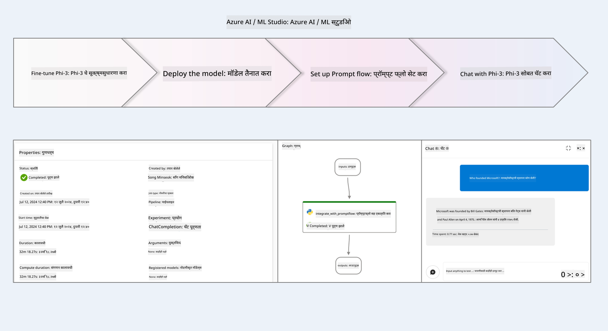

### अनुक्रमणिका

1. **[स्थित्यंतर 1: Azure संसाधने सेट अप करा आणि फाइन-ट्यूनिंगसाठी तयारी करा](../../../../../../md/02.Application/01.TextAndChat/Phi3)**
    - [Azure Machine Learning Workspace तयार करा](../../../../../../md/02.Application/01.TextAndChat/Phi3)
    - [Azure Subscription मध्ये GPU कोटा मागणी करा](../../../../../../md/02.Application/01.TextAndChat/Phi3)
    - [भूमिका नियुक्ती जोडा](../../../../../../md/02.Application/01.TextAndChat/Phi3)
    - [प्रकल्प सेट अप करा](../../../../../../md/02.Application/01.TextAndChat/Phi3)
    - [फाइन-ट्यूनिंगसाठी डेटासेट तयार करा](../../../../../../md/02.Application/01.TextAndChat/Phi3)

1. **[स्थित्यंतर 2: Phi-3 मॉडेल फाइन-ट्यून करा आणि Azure Machine Learning Studio मध्ये तैनात करा](../../../../../../md/02.Application/01.TextAndChat/Phi3)**
    - [Phi-3 मॉडेलचे फाइन-ट्यूनिंग करा](../../../../../../md/02.Application/01.TextAndChat/Phi3)
    - [फाइन-ट्यून केलेले Phi-3 मॉडेल तैनात करा](../../../../../../md/02.Application/01.TextAndChat/Phi3)

1. **[स्थित्यंतर 3: Prompt flow सह एकत्र करा आणि Azure AI Foundry मध्ये तुमच्या सानुकूल मॉडेलशी गप्पा मारा](../../../../../../md/02.Application/01.TextAndChat/Phi3)**
    - [सानुकूल Phi-3 मॉडेल Prompt flow सह एकत्र करा](../../../../../../md/02.Application/01.TextAndChat/Phi3)
    - [तुमच्या सानुकूल Phi-3 मॉडेलशी गप्पा मारा](../../../../../../md/02.Application/01.TextAndChat/Phi3)

## स्थित्यंतर 1: Azure संसाधने सेट अप करा आणि फाइन-ट्यूनिंगसाठी तयारी करा

### Azure Machine Learning Workspace तयार करा

1. पोर्टल पृष्ठाच्या शीर्षस्थित **शोध पट्टी** मध्ये *azure machine learning* टाका आणि दिसणाऱ्या पर्यायांमधून **Azure Machine Learning** निवडा.

    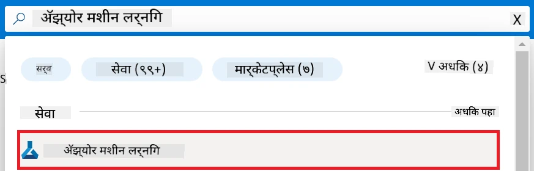

2. नेव्हिगेशन मेनूमधून **+ Create** निवडा.

3. नेव्हिगेशन मेनूमधून **New workspace** निवडा.

    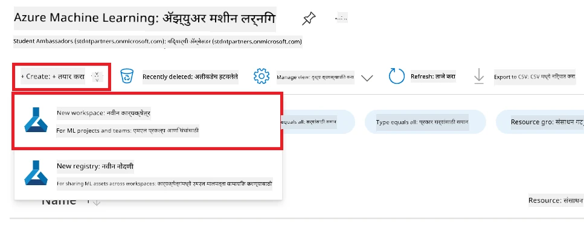

4. खालील कार्ये पार पाडा:

    - तुमची Azure **Subscription** निवडा.
    - वापरण्यासाठी **Resource group** निवडा (आवश्यक असल्यास नवीन तयार करा).
    - **Workspace Name** प्रविष्ट करा. हा एक अद्वितीय मूल्य असावा.
    - तुम्हाला हवा असलेला **Region** निवडा.
    - वापरण्यासाठी **Storage account** निवडा (आवश्यक असल्यास नवीन तयार करा).
    - वापरण्यासाठी **Key vault** निवडा (आवश्यक असल्यास नवीन तयार करा).
    - वापरण्यासाठी **Application insights** निवडा (आवश्यक असल्यास नवीन तयार करा).
    - वापरण्यासाठी **Container registry** निवडा (आवश्यक असल्यास नवीन तयार करा).

    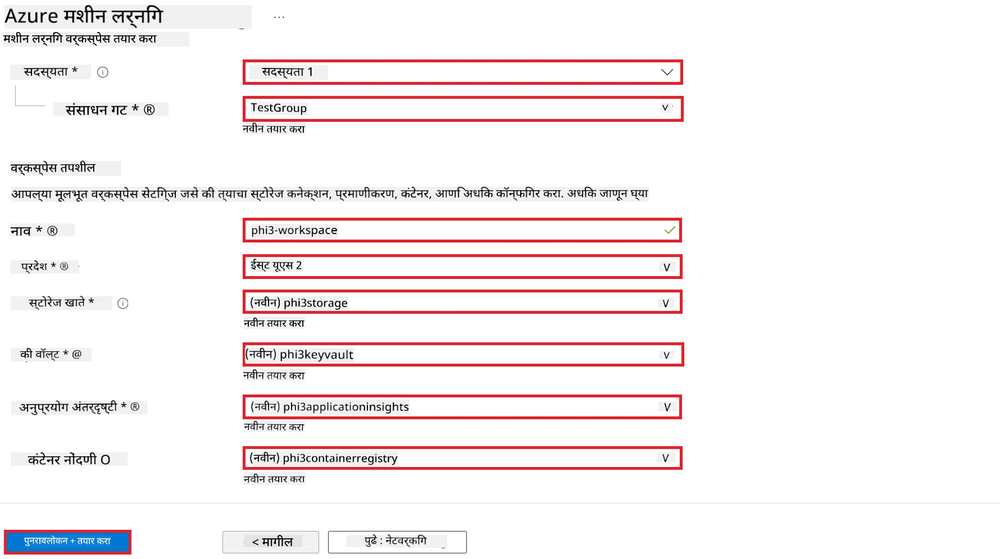

5. **Review + Create** निवडा.

6. **Create** निवडा.

### Azure Subscription मध्ये GPU कोटा मागणी करा

या ट्युटोरियलमध्ये, तुम्ही Phi-3 मॉडेल फाइन-ट्यून आणि तैनात करण्यासाठी GPU वापरणार आहात. फाइन-ट्यूनिंगसाठी, तुम्ही *Standard_NC24ads_A100_v4* GPU वापराल, ज्यासाठी कोटा मागणी आवश्यक आहे. तैनातीसाठी, तुम्ही *Standard_NC6s_v3* GPU वापराल, ज्यासाठी देखील कोटा मागणी आवश्यक आहे.

> [!NOTE]
>
> फक्त Pay-As-You-Go सदस्यता (सामान्य सदस्यता प्रकार) GPU वितरणासाठी पात्र आहेत; लाभ सदस्यता सध्या समर्थनात नाहीत.
>

1. [Azure ML Studio](https://ml.azure.com/home?wt.mc_id=studentamb_279723) वर भेट द्या.

1. *Standard NCADSA100v4 Family* कोटा मागण्यासाठी खालील कार्ये करा:

    - डाव्या बाजूच्या टॅबमधून **Quota** निवडा.
    - वापरण्यासाठी **Virtual machine family** निवडा. उदाहरणार्थ, **Standard NCADSA100v4 Family Cluster Dedicated vCPUs** निवडा, ज्यात *Standard_NC24ads_A100_v4* GPU समाविष्ट आहे.
    - नेव्हिगेशन मेनूमधून **Request quota** निवडा.

        

    - Request quota पृष्ठावर, तुम्ही वापरू इच्छित असलेली **New cores limit** प्रविष्ट करा. उदाहरणार्थ, 24.
    - Request quota पृष्ठावर, GPU कोटा मागण्यासाठी **Submit** निवडा.

1. *Standard NCSv3 Family* कोटा मागण्यासाठी खालील कार्ये करा:

    - डाव्या बाजूच्या टॅबमधून **Quota** निवडा.
    - वापरण्यासाठी **Virtual machine family** निवडा. उदाहरणार्थ, **Standard NCSv3 Family Cluster Dedicated vCPUs** निवडा, ज्यात *Standard_NC6s_v3* GPU समाविष्ट आहे.
    - नेव्हिगेशन मेनूमधून **Request quota** निवडा.
    - Request quota पृष्ठावर, तुम्ही वापरू इच्छित असलेली **New cores limit** प्रविष्ट करा. उदाहरणार्थ, 24.
    - Request quota पृष्ठावर, GPU कोटा मागण्यासाठी **Submit** निवडा.

### भूमिका नियुक्ती जोडा

तुमच्या मॉडेल्सचे फाइन-ट्यूनिंग आणि तैनाती करण्यासाठी, तुम्हाला प्रथम User Assigned Managed Identity (UAI) तयार करावी लागेल आणि ती योग्य परवानग्यांसह नियुक्त करावी लागेल. ही UAI तैनाती दरम्यान प्रमाणीकरणासाठी वापरली जाईल.

#### User Assigned Managed Identity(UAI) तयार करा

1. पोर्टल पृष्ठाच्या शीर्षस्थित **शोध पट्टी** मध्ये *managed identities* टाका आणि दिसणाऱ्या पर्यायांमधून **Managed Identities** निवडा.

    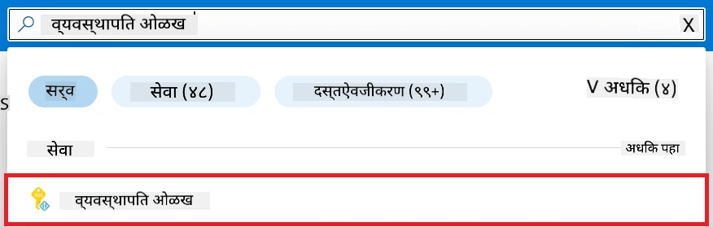

1. **+ Create** निवडा.

    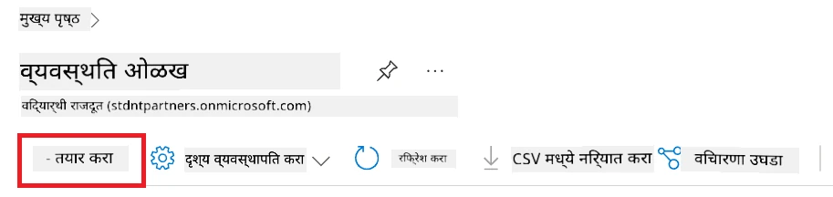

1. खालील कार्ये करा:

    - तुमची Azure **Subscription** निवडा.
    - वापरण्यासाठी **Resource group** निवडा (आवश्यक असल्यास नवीन तयार करा).
    - तुम्हाला हवा असलेला **Region** निवडा.
    - **Name** प्रविष्ट करा. हा एक अद्वितीय मूल्य असावा.

    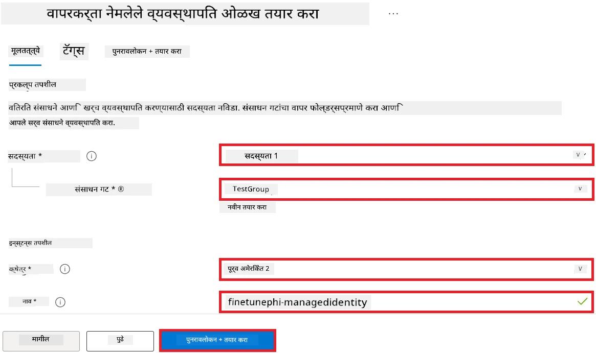

1. **Review + create** निवडा.

1. **+ Create** निवडा.

#### Managed Identity ला Contributor भूमिका नियुक्त करा

1. तुम्ही तयार केलेल्या Managed Identity संसाधनाकडे जा.

1. डाव्या टॅबमधून **Azure role assignments** निवडा.

1. नेव्हिगेशन मेनूमधून **+Add role assignment** निवडा.

1. Add role assignment पृष्ठावर, खालील कार्ये करा:
    - **Scope** म्हणून **Resource group** निवडा.
    - तुमची Azure **Subscription** निवडा.
    - वापरण्यासाठी **Resource group** निवडा.
    - **Role** म्हणून **Contributor** निवडा.

    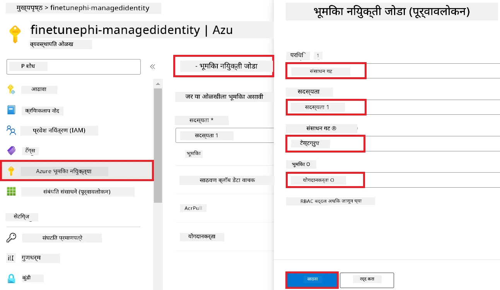

2. **Save** निवडा.

#### Managed Identity ला Storage Blob Data Reader भूमिका नियुक्त करा

1. पोर्टल पृष्ठाच्या शीर्षस्थित **शोध पट्टी** मध्ये *storage accounts* टाका आणि दिसणाऱ्या पर्यायांमधून **Storage accounts** निवडा.

    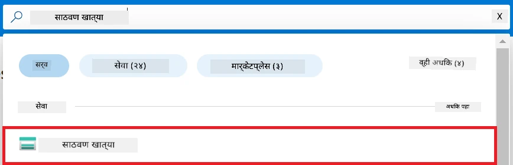

1. Azure Machine Learning workspace शी संलग्न असलेला स्टोरेज अकाउंट निवडा. उदाहरणार्थ, *finetunephistorage*.

1. Add role assignment पृष्ठावर जाण्यासाठी खालील कार्ये करा:

    - तुम्ही तयार केलेल्या Azure Storage अकाउंटकडे जा.
    - डाव्या टॅबमधून **Access Control (IAM)** निवडा.
    - नेव्हिगेशन मेनूमधून **+ Add** निवडा.
    - नेव्हिगेशन मेनूमधून **Add role assignment** निवडा.

    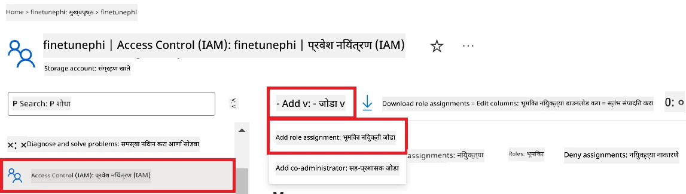

1. Add role assignment पृष्ठावर, खालीलप्रमाणे कार्य करा:

    - Role पृष्ठावर *Storage Blob Data Reader* या शब्दांचा वापर करा आणि दिसलेल्या पर्यायांमधून **Storage Blob Data Reader** निवडा.
    - Role पृष्ठावर, **Next** निवडा.
    - Members पृष्ठावर, **Assign access to** **Managed identity** निवडा.
    - Members पृष्ठावर, **+ Select members** निवडा.
    - Select managed identities पृष्ठावर, तुमची Azure **Subscription** निवडा.
    - Select managed identities पृष्ठावर, **Managed identity** म्हणून **Manage Identity** निवडा.
    - Select managed identities पृष्ठावर, तुम्ही तयार केलेली Managed Identity निवडा. उदाहरणार्थ, *finetunephi-managedidentity*.
    - Select managed identities पृष्ठावर, **Select** निवडा.

    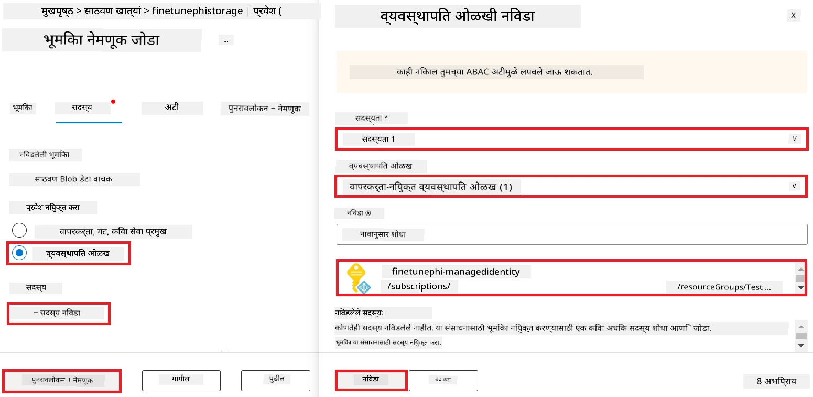

1. **Review + assign** निवडा.

#### Managed Identity ला AcrPull भूमिका नियुक्त करा

1. पोर्टल पृष्ठाच्या शीर्षस्थित **शोध पट्टी** मध्ये *container registries* टाका आणि दिसणाऱ्या पर्यायांमधून **Container registries** निवडा.

    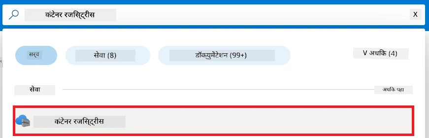

1. Azure Machine Learning workspace शी संलग्न असलेला container registry निवडा. उदाहरणार्थ, *finetunephicontainerregistry*

1. Add role assignment पृष्ठावर जाण्यासाठी खालील कार्ये करा:

    - डाव्या टॅबमधून **Access Control (IAM)** निवडा.
    - नेव्हिगेशन मेनूमधून **+ Add** निवडा.
    - नेव्हिगेशन मेनूमधून **Add role assignment** निवडा.

1. Add role assignment पृष्ठावर, खालील कार्य करा:

    - Role पृष्ठावर *AcrPull* हा शब्द टाका आणि दिसलेल्या पर्यायांमधून **AcrPull** निवडा.
    - Role पृष्ठावर, **Next** निवडा.
    - Members पृष्ठावर, **Assign access to** **Managed identity** निवडा.
    - Members पृष्ठावर, **+ Select members** निवडा.
    - Select managed identities पृष्ठावर, तुमची Azure **Subscription** निवडा.
    - Select managed identities पृष्ठावर, **Managed identity** म्हणून **Manage Identity** निवडा.
    - Select managed identities पृष्ठावर, तुम्ही तयार केलेली Managed Identity निवडा. उदाहरणार्थ, *finetunephi-managedidentity*.
    - Select managed identities पृष्ठावर, **Select** निवडा.
    - **Review + assign** निवडा.

### प्रकल्प सेट अप करा

फाइन-ट्यूनिंगसाठी आवश्यक डेटासेट डाउनलोड करण्यासाठी, तुम्ही स्थानिक एन्व्हायरनमेंट सेट कराल.

या व्यायामात, तुम्ही

- कामासाठी एक फोल्डर तयार कराल.
- एक व्हर्च्युअल एन्व्हायरनमेंट तयार कराल.
- आवश्यक पॅकेजेस इन्स्टॉल कराल.
- डेटासेट डाउनलोड करण्यासाठी *download_dataset.py* फाइल तयार कराल.

#### काम करण्यासाठी फोल्डर तयार करा

1. टर्मिनल विंडो उघडा आणि डीफॉल्ट पथात *finetune-phi* नावाच्या फोल्डरला तयार करण्यासाठी खालील आदेश टाका.

    ```console
    mkdir finetune-phi
    ```

2. *finetune-phi* फोल्डरमध्ये जाउन खालील कमांड आपला टर्मिनलमध्ये टाइप करा.

    ```console
    cd finetune-phi
    ```

#### व्हर्च्युअल एन्व्हायर्नमेंट तयार करा

1. *.venv* नावाने व्हर्च्युअल एन्व्हायर्नमेंट तयार करण्यासाठी खालील कमांड आपला टर्मिनलमध्ये टाइप करा.

    ```console
    python -m venv .venv
    ```

2. व्हर्च्युअल एन्व्हायर्नमेंट सक्रिय करण्यासाठी खालील कमांड आपला टर्मिनलमध्ये टाइप करा.

    ```console
    .venv\Scripts\activate.bat
    ```

> [!NOTE]
> जर ते यशस्वी झाले, तर कमांड प्रॉम्प्टच्या आधी *(.venv)* दिसायला हवे.

#### आवश्यक पॅकेजेस इन्स्टॉल करा

1. आवश्यक पॅकेजेस इन्स्टॉल करण्यासाठी खालील कमांड आपला टर्मिनलमध्ये टाइप करा.

    ```console
    pip install datasets==2.19.1
    ```

#### `donload_dataset.py` तयार करा

> [!NOTE]
> पूर्ण फोल्डर संरचना:
>
> ```text
> └── YourUserName
> .    └── finetune-phi
> .        └── download_dataset.py
> ```

1. **Visual Studio Code** उघडा.

1. मेनू बारमधील **File** निवडा.

1. **Open Folder** निवडा.

1. आपण तयार केलेला *finetune-phi* फोल्डर निवडा, जो *C:\Users\yourUserName\finetune-phi* येथे आहे.

    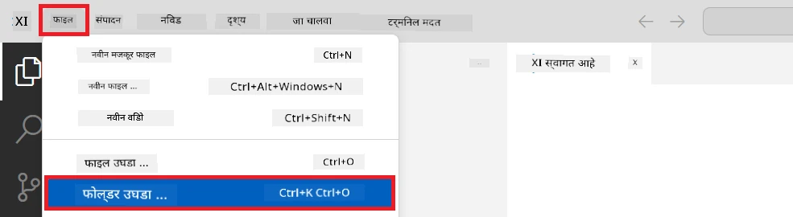

1. Visual Studio Code च्या डाव्या पॅनेलमध्ये उजवे क्लिक करा आणि **New File** निवडा, ज्यामुळे *download_dataset.py* नावाचा नवीन फाइल तयार होईल.

    

### फाईन-ट्युनिंगसाठी डेटासेट तयार करा

या ऍक्सरसाइजमध्ये, आपण *download_dataset.py* फाइल चालवून *ultrachat_200k* डेटासेट्स आपल्या स्थानिक एन्व्हायर्नमेंटमध्ये डाउनलोड कराल. नंतर आपण हा डेटासेट Phi-3 मॉडेल Azure Machine Learning मध्ये फाईन-ट्युनिंगसाठी वापराल.

या ऍक्सरसाइजमध्ये, आपण:

- *download_dataset.py* फाइलमध्ये कोड जोडाल जेणेकरून डेटासेट डाउनलोड होईल.
- *download_dataset.py* फाइल चालवून डेटासेट आपल्या स्थानिक एन्व्हायर्नमेंटमध्ये डाउनलोड कराल.

#### *download_dataset.py* वापरून आपले डेटासेट डाउनलोड करा

1. Visual Studio Code मध्ये *download_dataset.py* फाइल उघडा.

1. *download_dataset.py* फाइलमध्ये खालील कोड जोडा.

    ```python
    import json
    import os
    from datasets import load_dataset

    def load_and_split_dataset(dataset_name, config_name, split_ratio):
        """
        Load and split a dataset.
        """
        # निर्दिष्ट नाव, कॉन्फिगरेशन आणि विभाग अनुपातासह डेटासेट लोड करा
        dataset = load_dataset(dataset_name, config_name, split=split_ratio)
        print(f"Original dataset size: {len(dataset)}")
        
        # डेटासेटला ट्रेन आणि टेस्ट सेटमध्ये विभागा (80% ट्रेन, 20% टेस्ट)
        split_dataset = dataset.train_test_split(test_size=0.2)
        print(f"Train dataset size: {len(split_dataset['train'])}")
        print(f"Test dataset size: {len(split_dataset['test'])}")
        
        return split_dataset

    def save_dataset_to_jsonl(dataset, filepath):
        """
        Save a dataset to a JSONL file.
        """
        # असेल तर निर्देशिका तयार करा
        os.makedirs(os.path.dirname(filepath), exist_ok=True)
        
        # फाइल लेखन मोडमध्ये उघडा
        with open(filepath, 'w', encoding='utf-8') as f:
            # डेटासेटमधील प्रत्येक नोंदीवर पुनरावृत्ती करा
            for record in dataset:
                # नोंदी JSON ऑब्जेक्ट म्हणून डंप करा आणि फाइलमध्ये लिहा
                json.dump(record, f)
                # नोंदी वेगळ्या करण्यासाठी नवीन ओळ वर्ण लिहा
                f.write('\n')
        
        print(f"Dataset saved to {filepath}")

    def main():
        """
        Main function to load, split, and save the dataset.
        """
        # विशिष्ट कॉन्फिगरेशन आणि विभाग अनुपातासह ULTRACHAT_200k डेटासेट लोड आणि विभागा
        dataset = load_and_split_dataset("HuggingFaceH4/ultrachat_200k", 'default', 'train_sft[:1%]')
        
        # विभागातून ट्रेन आणि टेस्ट डेटासेट काढा
        train_dataset = dataset['train']
        test_dataset = dataset['test']

        # ट्रेन डेटासेट JSONL फाइलमध्ये जतन करा
        save_dataset_to_jsonl(train_dataset, "data/train_data.jsonl")
        
        # टेस्ट डेटासेट वेगळ्या JSONL फाइलमध्ये जतन करा
        save_dataset_to_jsonl(test_dataset, "data/test_data.jsonl")

    if __name__ == "__main__":
        main()

    ```

1. स्क्रिप्ट चालवण्यासाठी आणि डेटासेट आपल्या स्थानिक एन्व्हायर्नमेंटमध्ये डाउनलोड करण्यासाठी खालील कमांड आपला टर्मिनलमध्ये टाइप करा.

    ```console
    python download_dataset.py
    ```

1. खात्री करा की डेटासेट्स यशस्वीपणे आपल्या स्थानिक *finetune-phi/data* निर्देशिकेत सेव्ह झाले आहेत.

> [!NOTE]
>
> #### डेटासेटच्या आकार आणि फाईन-ट्युनिंग वेळेवर टीप
>
> या ट्यूटोरियलमध्ये, आपण फक्त डेटासेटचा 1% (`split='train[:1%]'`) वापर करता. यामुळे डेटा प्रमाण खूप कमी होते, त्यामुळे अपलोड व फाईन-ट्युनिंग प्रक्रिया वेगवान होते. आपण प्रशिक्षण वेळ आणि मॉडेल कामगिरी यांच्यात योग्य समतोल शोधण्यासाठी टक्केवारी समायोजित करू शकता. डेटासेटचा लहान subset वापरल्यामुळे फाईन-ट्युनिंगचा वेळ कमी होतो, ज्यामुळे ट्यूटोरियलसाठी हा प्रक्रिया सुलभ होते.

## प्रसंग 2: Phi-3 मॉडेल फाईन-ट्युन करा आणि Azure Machine Learning Studio मध्ये तैनात करा

### Phi-3 मॉडेल फाईन-ट्युन करा

या ऍक्सरसाइजमध्ये, आपण Azure Machine Learning Studio मध्ये Phi-3 मॉडेल फाईन-ट्युन कराल.

या ऍक्सरसाइजमध्ये, आपण:

- फाईन-ट्युनसाठी संगणक क्लस्टर तयार कराल.
- Azure Machine Learning Studio मध्ये Phi-3 मॉडेल फाईन-ट्युन कराल.

#### फाईन-ट्युनसाठी संगणक क्लस्टर तयार करा

1. [Azure ML Studio](https://ml.azure.com/home?wt.mc_id=studentamb_279723) येथे जा.

1. डाव्या बाजूच्या टॅबमधून **Compute** निवडा.

1. नेविगेशन मेनूमधून **Compute clusters** निवडा.

1. **+ New** निवडा.

    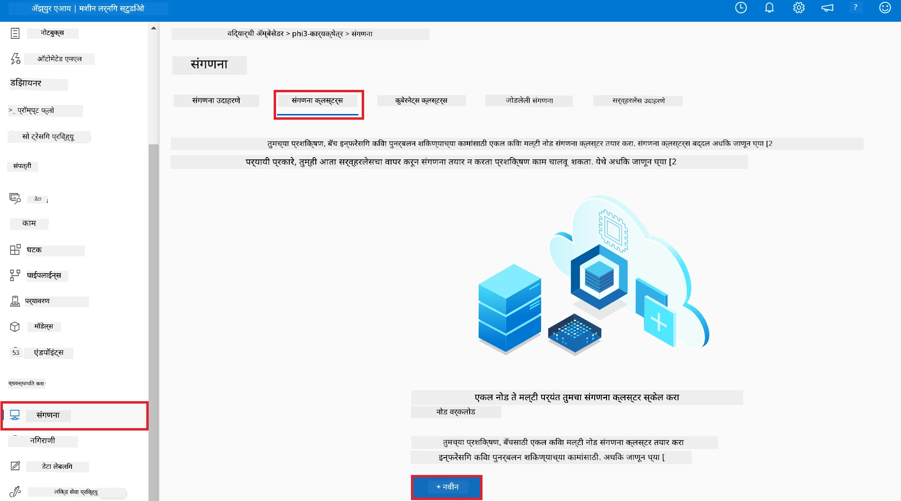

1. खालील कार्ये करा:

    - वापरायचा **Region** निवडा.
    - **Virtual machine tier** ला **Dedicated** निवडा.
    - **Virtual machine type** ला **GPU** निवडा.
    - **Virtual machine size** फिल्टर ला **Select from all options** निवडा.
    - **Virtual machine size** ला **Standard_NC24ads_A100_v4** निवडा.

    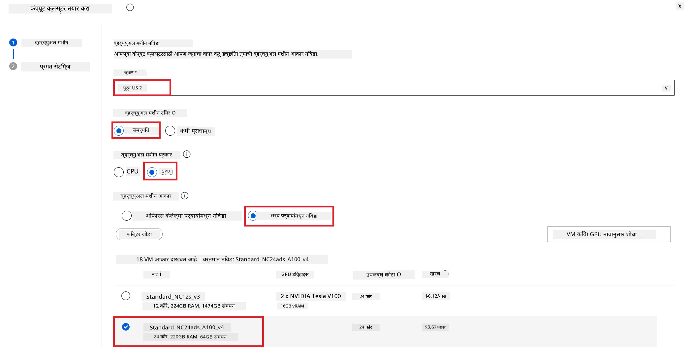

1. **Next** निवडा.

1. खालील कार्ये करा:

    - **Compute name** प्रविष्ट करा. हे एक अद्वितीय मूल्य असले पाहिजे.
    - **Minimum number of nodes** ला **0** निवडा.
    - **Maximum number of nodes** ला **1** निवडा.
    - **Idle seconds before scale down** ला **120** निवडा.

    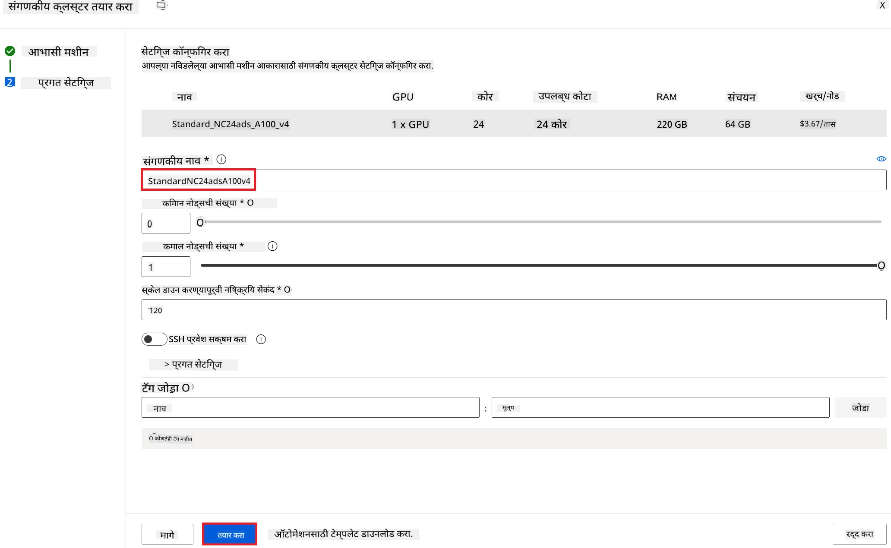

1. **Create** निवडा.

#### Phi-3 मॉडेल फाईन-ट्युन करा

1. [Azure ML Studio](https://ml.azure.com/home?wt.mc_id=studentamb_279723) येथे जा.

1. आपण तयार केलेला Azure Machine Learning workspace निवडा.

    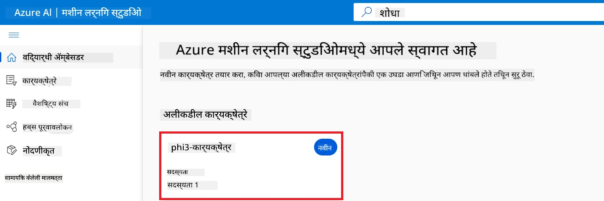

1. खालील कार्ये करा:

    - डाव्या बाजूच्या टॅबमधून **Model catalog** निवडा.
    - **search bar** मध्ये *phi-3-mini-4k* टाइप करा आणि दिसलेल्या पर्यायांमधून **Phi-3-mini-4k-instruct** निवडा.

    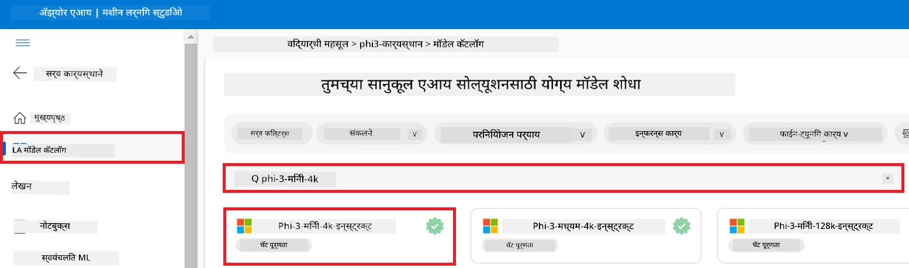

1. नेविगेशन मेनूमधून **Fine-tune** निवडा.

    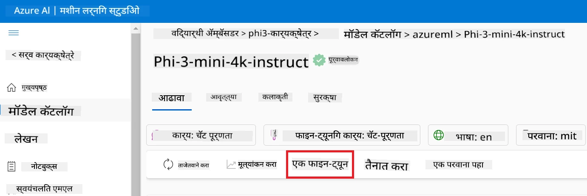

1. खालील कार्ये करा:

    - **Select task type** ला **Chat completion** निवडा.
    - **+ Select data** निवडा आणि **Training data** अपलोड करा.
    - Validation data अपलोड प्रकार म्हणून **Provide different validation data** निवडा.
    - **+ Select data** निवडा आणि **Validation data** अपलोड करा.

    

> [!TIP]
>
> आपण **Advanced settings** निवडून **learning_rate** आणि **lr_scheduler_type** सारख्या कॉन्फिगरेशन सानुकूलित करू शकता ज्याने फाईन-ट्युनिंग प्रक्रिया आपल्या गरजेनुसार सुधारेल.

1. **Finish** निवडा.

1. या ऍक्सरसाइजमध्ये, आपण Azure Machine Learning वापरून यशस्वीपणे Phi-3 मॉडेल फाईन-ट्युन केले. कृपया लक्षात ठेवा की, फाईन-ट्युनिंग प्रक्रियेस बरेच वेळ लागू शकतो. फाईन-ट्युनिंग जॉब चालवल्यानंतर, त्याच्या पूर्ण होईपर्यंत प्रतीक्षा करावी लागेल. आपण आपला Azure Machine Learning Workspace च्या डाव्या बाजूच्या Jobs टॅबमध्ये जाऊन फाईन-ट्युनिंग जॉबचे स्थिती पहू शकता. पुढील सत्रांमध्ये, आपण फाईन-ट्युन केलेले मॉडेल तैनात कराल आणि ते Prompt flow सोबत एकत्रित कराल.

    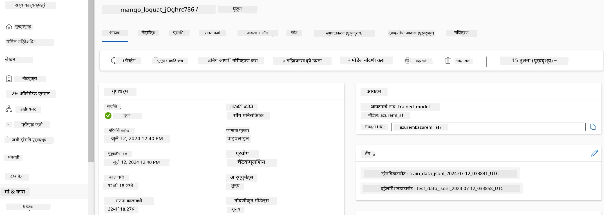

### फाईन-ट्युन केलेले Phi-3 मॉडेल तैनात करा

फाईन-ट्युन केलेल्या Phi-3 मॉडेलला Prompt flow सोबत एकत्रित करण्यासाठी, आपल्याला मॉडेल तैनात करावे लागेल जेणेकरून ते रिअल-टाइम इनफरन्ससाठी उपलब्ध होईल. या प्रक्रियेत मॉडेल नोंदणी, ऑनलाईन एंडपॉईंट तयार करणे आणि मॉडेल तैनात करणे यांचा समावेश आहे.

या ऍक्सरसाइजमध्ये, आपण:

- Azure Machine Learning workspace मध्ये फाईन-ट्युन केलेले मॉडेल नोंदणी कराल.
- ऑनलाईन एंडपॉईंट तयार कराल.
- नोंदणीकृत फाईन-ट्युन केलेले Phi-3 मॉडेल तैनात कराल.

#### फाईन-ट्युन केलेले मॉडेल नोंदणी करा

1. [Azure ML Studio](https://ml.azure.com/home?wt.mc_id=studentamb_279723) येथे जा.

1. आपण तयार केलेला Azure Machine Learning workspace निवडा.

    

1. डाव्या बाजूच्या टॅबमधून **Models** निवडा.
1. **+ Register** निवडा.
1. **From a job output** निवडा.

    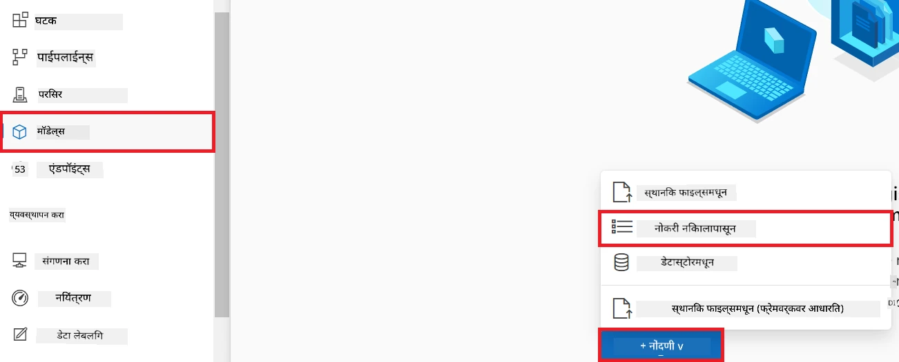

1. आपण तयार केलेला जॉब निवडा.

    

1. **Next** निवडा.

1. **Model type** ला **MLflow** निवडा.

1. **Job output** निवडले असल्याची खात्री करा; हे आपोआप निवडले जाईल.

    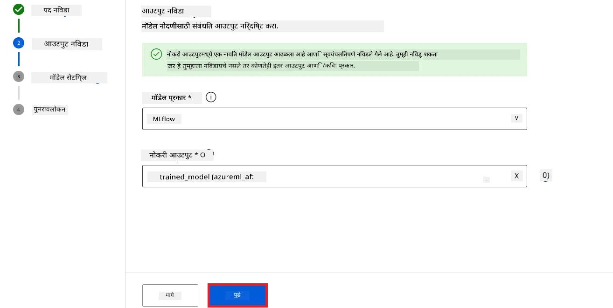

2. **Next** निवडा.

3. **Register** निवडा.

    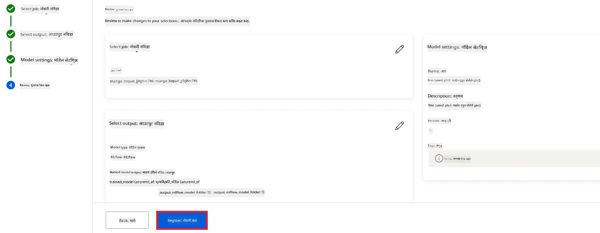

4. नोंदणीकृत मॉडेल पाहण्यासाठी डाव्या बाजूच्या टॅबमधील **Models** मेनूमध्ये जा.

    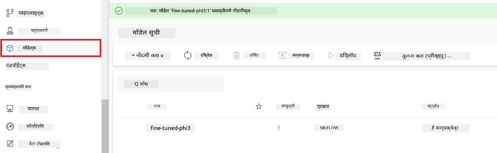

#### फाईन-ट्युन केलेले मॉडेल तैनात करा

1. आपण तयार केलेल्या Azure Machine Learning workspace मध्ये जा.

1. डाव्या बाजूच्या टॅबमधून **Endpoints** निवडा.

1. नेविगेशन मेनूमधून **Real-time endpoints** निवडा.

    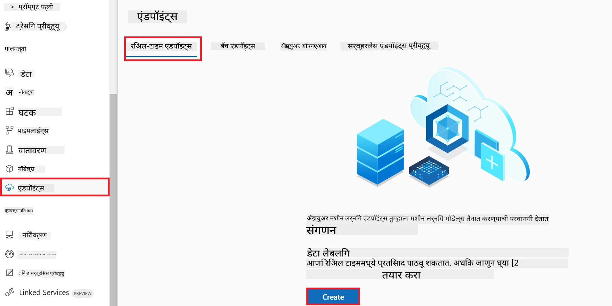

1. **Create** निवडा.

1. आपण तयार केलेले नोंदणीकृत मॉडेल निवडा.

    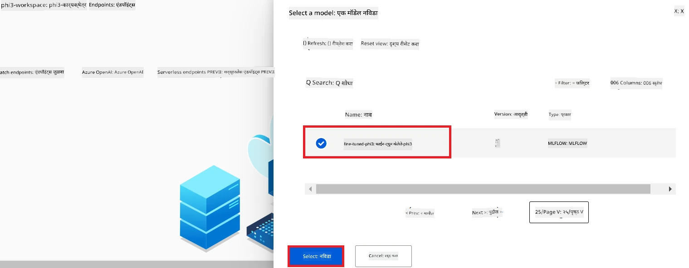

1. **Select** निवडा.

1. खालील कामे करा:

    - **Virtual machine** ला *Standard_NC6s_v3* निवडा.
    - आपण वापरू इच्छित **Instance count** निवडा, उदाहरणार्थ *1*.
    - **Endpoint** ला **New** निवडा आणि एखादा एंडपॉईंट तयार करा.
    - **Endpoint name** प्रविष्ट करा. हे अद्वितीय मूल्य असले पाहिजे.
    - **Deployment name** प्रविष्ट करा. हे अद्वितीय मूल्य असले पाहिजे.

    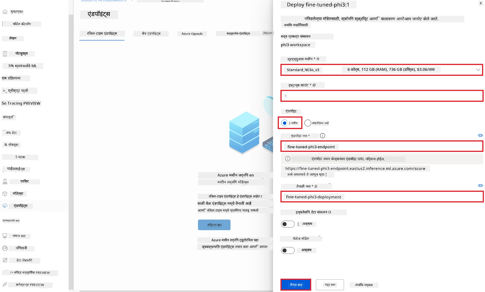

1. **Deploy** निवडा.

> [!WARNING]
> आपल्या अकाउंटवर अतिरिक्त शुल्क टाळण्यासाठी, Azure Machine Learning workspace मध्ये तयार केलेले एंडपॉईंट नंतर नक्कीच हटवा.
>

#### Azure Machine Learning Workspace मध्ये तैनाती स्थिती तपासा

1. आपण तयार केलेल्या Azure Machine Learning workspace मध्ये जा.

1. डाव्या बाजूच्या टॅबमधून **Endpoints** निवडा.

1. आपण तयार केलेला एंडपॉईंट निवडा.

    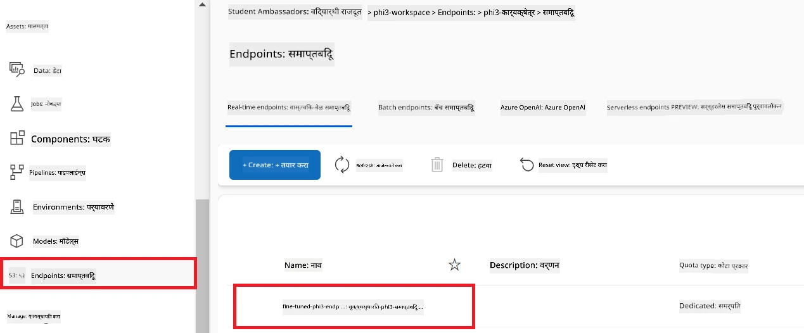

1. या पानावर, आपण तैनाती प्रक्रिये दरम्यान एंडपॉईंट्स व्यवस्थापित करू शकता.

> [!NOTE]
> एकदा तैनाती पूर्ण झाल्यावर, खात्री करा की **Live traffic** **100%** वर सेट आहे. जर तसे नसेल तर **Update traffic** निवडून ट्रॅफिक सेटिंग्ज समायोजित करा. लक्षात ठेवा की ट्रॅफिक 0% असल्यास आपण मॉडेलची चाचणी करू शकत नाही.
>
> 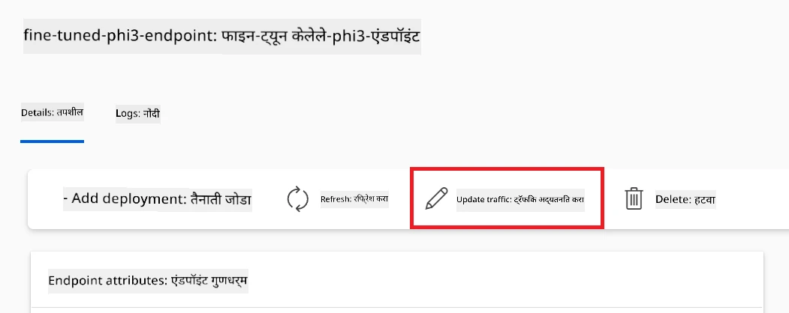
>

## प्रसंग 3: Prompt flow सोबत एकत्रित करा आणि Azure AI Foundry मध्ये आपल्या कस्टम मॉडेलशी गप्पा मारा

### कस्टम Phi-3 मॉडेल Prompt flow सोबत एकत्रित करा

आपण यशस्वीपणे आपला फाईन-ट्युन केलेला मॉडेल तैनात केल्यानंतर, आता आपण तो मॉडेल Prompt Flow सोबत वापरू शकता, ज्यामुळे आपल्या कस्टम Phi-3 मॉडेलसह विविध इंटरॅक्टिव टास्क रिअल-टाइममध्ये करता येतील.

या ऍक्सरसाइजमध्ये, आपण:

- Azure AI Foundry Hub तयार कराल.
- Azure AI Foundry प्रोजेक्ट तयार कराल.
- Prompt flow तयार कराल.
- फाईन-ट्युन केलेल्या Phi-3 मॉडेलसाठी कस्टम कनेक्शन जोडल.
- Prompt flow सेटअप करून आपल्या कस्टम Phi-3 मॉडेलशी गप्पा मुराल.

> [!NOTE]
> आपण Azure ML Studio वापरून देखील Promptflow सोबत एकत्रित करू शकता. एकाच एकत्रीकरण प्रक्रियेस Azure ML Studio साठी वापरले जाऊ शकते.

#### Azure AI Foundry Hub तयार करा

प्रोजेक्ट तयार करण्यापूर्वी आपण Hub तयार करावा लागेल. Hub हा Resource Group प्रमाणे काम करते, ज्यामुळे आपण Azure AI Foundry मध्ये एकापेक्षा अधिक प्रोजेक्ट व्यवस्थापित करू शकता.

1. [Azure AI Foundry](https://ai.azure.com/?WT.mc_id=aiml-137032-kinfeylo) येथे जा.

1. डाव्या बाजूच्या टॅबमधून **All hubs** निवडा.

1. नेविगेशन मेनूमधून **+ New hub** निवडा.
    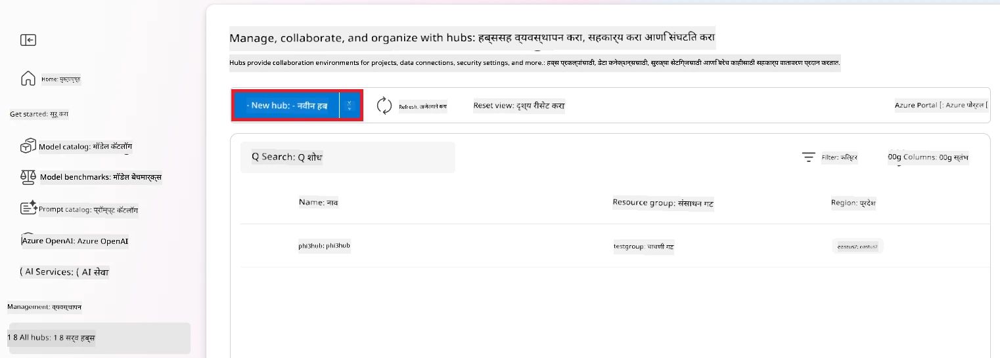

1. खालील कार्ये करा:

    - **हब नाव** प्रविष्ट करा. ते एक अद्वितीय मूल्य असावे.
    - आपले Azure **सबस्क्रिप्शन** निवडा.
    - वापरण्यासाठी **रिसोर्स ग्रुप** निवडा (आवश्यक असल्यास नवीन तयार करा).
    - आपण जे **स्थान** वापरू इच्छिता ते निवडा.
    - वापरण्यासाठी **Connect Azure AI Services** निवडा (आवश्यक असल्यास नवीन तयार करा).
    - **Connect Azure AI Search** साठी **कनेक्ट करणे स्किप करा** निवडा.

    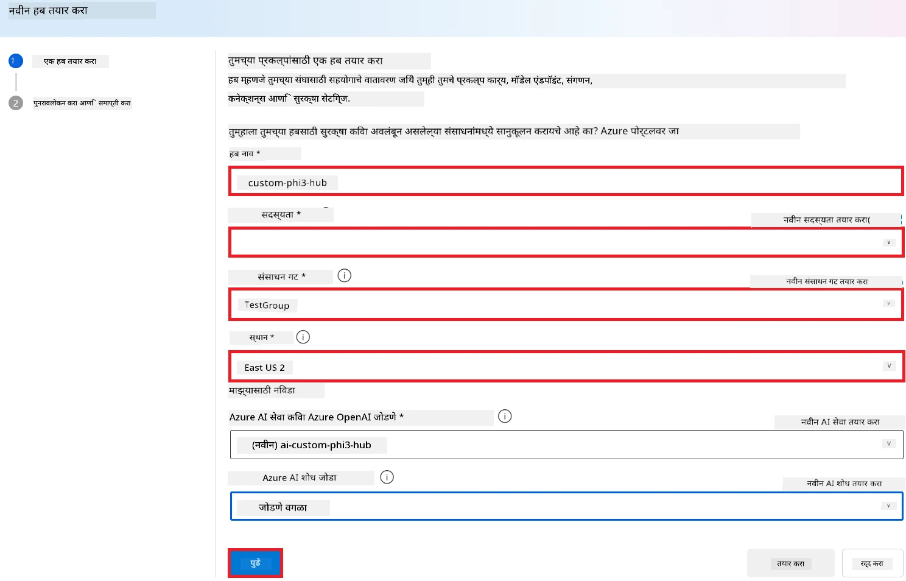

1. **Next** निवडा.

#### Azure AI Foundry प्रोजेक्ट तयार करा

1. आपण तयार केलेल्या हब मध्ये, डाव्या बाजूच्या टॅबमधून **All projects** निवडा.

1. नेव्हिगेशन मेनूमधून **+ New project** निवडा.

    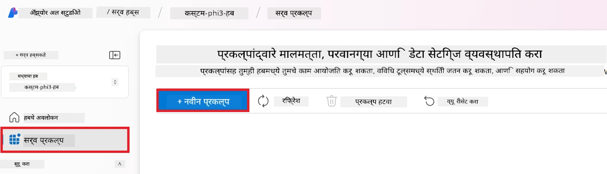

1. **Project name** प्रविष्ट करा. ते एक अद्वितीय मूल्य असावे.

    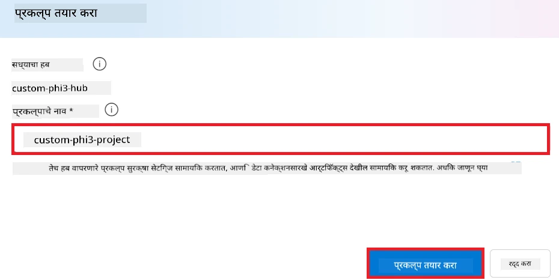

1. **Create a project** निवडा.

#### फाइन-ट्यून केलेल्या Phi-3 मॉडेलसाठी कस्टम कनेक्शन जोडा

आपल्या कस्टम Phi-3 मॉडेलला Prompt flow सोबत जोडण्यासाठी, आपल्याला मॉडेलचा endpoint आणि key कस्टम कनेक्शनमध्ये सेव्ह करणे आवश्यक आहे. हे सेटअप Prompt flow मध्ये आपला कस्टम Phi-3 मॉडेल वापरण्याची परवानगी देते.

#### फाइन-ट्यून केलेल्या Phi-3 मॉडेलचा api key आणि endpoint uri सेट करा

1. भेट द्या [Azure ML Studio](https://ml.azure.com/home?WT.mc_id=aiml-137032-kinfeylo).

1. आपण तयार केलेल्या Azure मशीन लर्निंग वर्कस्पेस कडे जा.

1. डाव्या बाजूच्या टॅबमधून **Endpoints** निवडा.

    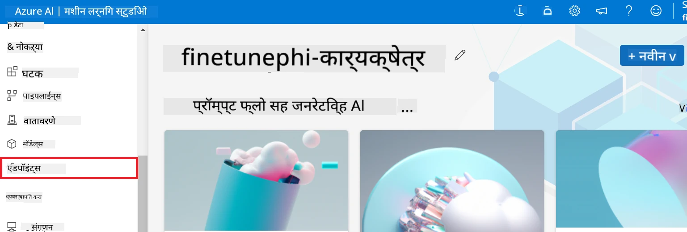

1. आपण तयार केलेला endpoint निवडा.

    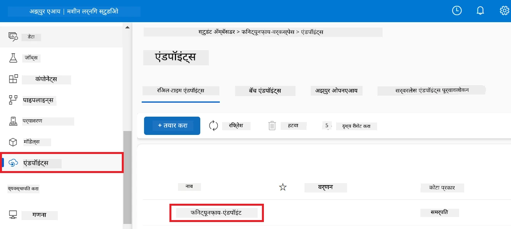

1. नेव्हिगेशन मेनूमधून **Consume** निवडा.

1. आपला **REST endpoint** आणि **Primary key** कॉपी करा.

    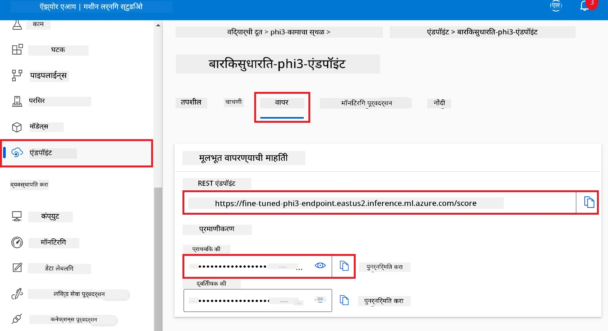

#### कस्टम कनेक्शन जोडा

1. भेट द्या [Azure AI Foundry](https://ai.azure.com/?WT.mc_id=aiml-137032-kinfeylo).

1. आपण तयार केलेल्या Azure AI Foundry प्रोजेक्टमध्ये जा.

1. आपण तयार केलेल्या प्रोजेक्टमध्ये, डाव्या बाजूच्या टॅबमधून **Settings** निवडा.

1. **+ New connection** निवडा.

    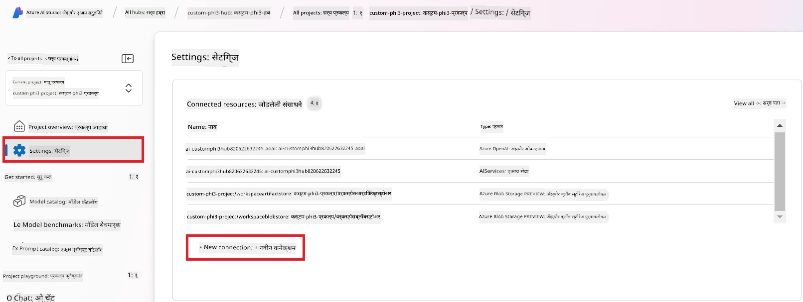

1. नेव्हिगेशन मेनूमधून **Custom keys** निवडा.

    

1. खालील कार्ये करा:

    - **+ Add key value pairs** निवडा.
    - की नावासाठी, **endpoint** टाका आणि Azure ML Studio मधून कॉपी केलेला endpoint मूल्य फील्डमध्ये पेस्ट करा.
    - पुन्हा **+ Add key value pairs** निवडा.
    - की नावासाठी, **key** टाका आणि Azure ML Studio मधून कॉपी केलेली key मूल्य फील्डमध्ये पेस्ट करा.
    - की जोडल्यावर, की उघडकीस येण्यापासून प्रतिबंधित करण्यासाठी **is secret** निवडा.

    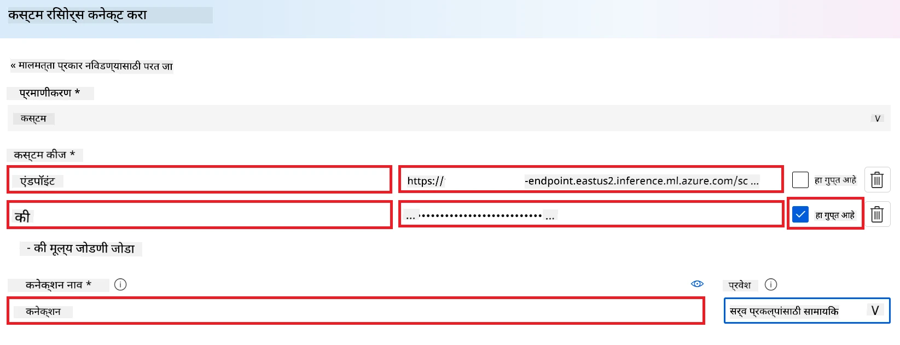

1. **Add connection** निवडा.

#### Prompt flow तयार करा

आपण Azure AI Foundry मध्ये कस्टम कनेक्शन जोडले आहे. आता, खालील चरणांच्या साहाय्याने Prompt flow तयार करू या. नंतर, आपण हे Prompt flow कस्टम कनेक्शनशी जोडाल जेणेकरून आपण फाइन-ट्यून केलेले मॉडेल Prompt flow मध्ये वापरू शकाल.

1. आपण तयार केलेल्या Azure AI Foundry प्रोजेक्टमध्ये जा.

1. डाव्या बाजूच्या टॅबमधून **Prompt flow** निवडा.

1. नेव्हिगेशन मेनूमधून **+ Create** निवडा.

    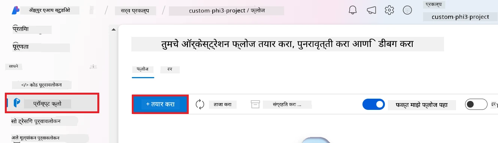

1. नेव्हिगेशन मेनूमधून **Chat flow** निवडा.

    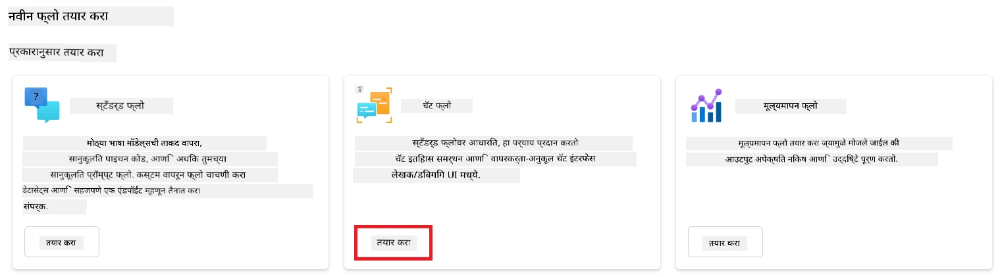

1. वापरण्यासाठी **फोल्डर नाव** प्रविष्ट करा.

    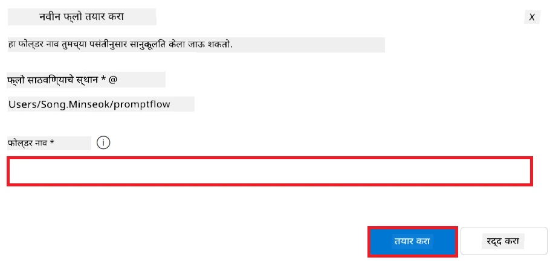

2. **Create** निवडा.

#### आपल्या कस्टम Phi-3 मॉडेलसह चॅट करण्यासाठी Prompt flow सेट करा

आपल्याला फाइन-ट्यून केलेले Phi-3 मॉडेल Prompt flow मध्ये जोडण्याची गरज आहे. तथापि, उपलब्ध Prompt flow हा या उद्दिष्टासाठी तयार केलेला नाही. म्हणून, कस्टम मॉडेल जोडण्यासाठी Prompt flow पुन्हा डिझाइन करावा लागेल.

1. Prompt flow मध्ये, विद्यमान फ्लो पुन्हा तयार करण्यासाठी खालील कार्य करा:

    - **Raw file mode** निवडा.
    - *flow.dag.yml* फाईलमधील सर्व विद्यमान कोड हटवा.
    - खालील कोड *flow.dag.yml* फाईलमध्ये जोडा.

        ```yml
        inputs:
          input_data:
            type: string
            default: "Who founded Microsoft?"

        outputs:
          answer:
            type: string
            reference: ${integrate_with_promptflow.output}

        nodes:
        - name: integrate_with_promptflow
          type: python
          source:
            type: code
            path: integrate_with_promptflow.py
          inputs:
            input_data: ${inputs.input_data}
        ```

    - **Save** निवडा.

    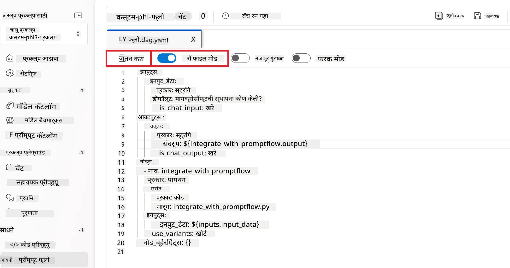

1. Prompt flow मध्ये कस्टम Phi-3 मॉडेल वापरण्यासाठी *integrate_with_promptflow.py* फाईलमध्ये खालील कोड जोडा.

    ```python
    import logging
    import requests
    from promptflow import tool
    from promptflow.connections import CustomConnection

    # लॉगिंग सेटअप
    logging.basicConfig(
        format="%(asctime)s - %(levelname)s - %(name)s - %(message)s",
        datefmt="%Y-%m-%d %H:%M:%S",
        level=logging.DEBUG
    )
    logger = logging.getLogger(__name__)

    def query_phi3_model(input_data: str, connection: CustomConnection) -> str:
        """
        Send a request to the Phi-3 model endpoint with the given input data using Custom Connection.
        """

        # "connection" हे कस्टम कनेक्शनचे नाव आहे, "endpoint", "key" हे कस्टम कनेक्शनमधील कीज आहेत
        endpoint_url = connection.endpoint
        api_key = connection.key

        headers = {
            "Content-Type": "application/json",
            "Authorization": f"Bearer {api_key}"
        }
        data = {
            "input_data": {
                "input_string": [
                    {"role": "user", "content": input_data}
                ],
                "parameters": {
                    "temperature": 0.7,
                    "max_new_tokens": 128
                }
            }
        }
        try:
            response = requests.post(endpoint_url, json=data, headers=headers)
            response.raise_for_status()
            
            # पूर्ण JSON प्रतिसाद लॉग करा
            logger.debug(f"Full JSON response: {response.json()}")

            result = response.json()["output"]
            logger.info("Successfully received response from Azure ML Endpoint.")
            return result
        except requests.exceptions.RequestException as e:
            logger.error(f"Error querying Azure ML Endpoint: {e}")
            raise

    @tool
    def my_python_tool(input_data: str, connection: CustomConnection) -> str:
        """
        Tool function to process input data and query the Phi-3 model.
        """
        return query_phi3_model(input_data, connection)

    ```

    

> [!NOTE]
> Azure AI Foundry मध्ये Prompt flow वापरण्याबाबत अधिक तपशीलवार माहिती साठी, आपण [Prompt flow in Azure AI Foundry](https://learn.microsoft.com/azure/ai-studio/how-to/prompt-flow) पाहू शकता.

1. **Chat input**, **Chat output** निवडा जेणेकरून आपल्या मॉडेलशी चॅट करता येईल.

    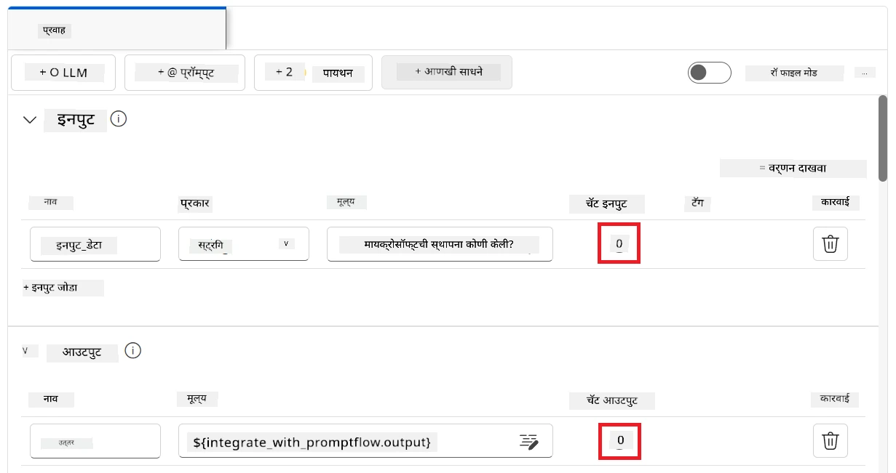

1. आता आपण आपल्या कस्टम Phi-3 मॉडेलशी चॅट करण्यासाठी तयार आहात. पुढील व्यायामात, आपण Prompt flow कसा सुरू करायचा व फाइन-ट्यून केलेल्या Phi-3 मॉडेलसह चॅट कसा करायचा हे शिकाल.

> [!NOTE]
>
> पुनर्बांधणी केलेला फ्लो खालील चित्रासारखा दिसायला हवा:
>
> 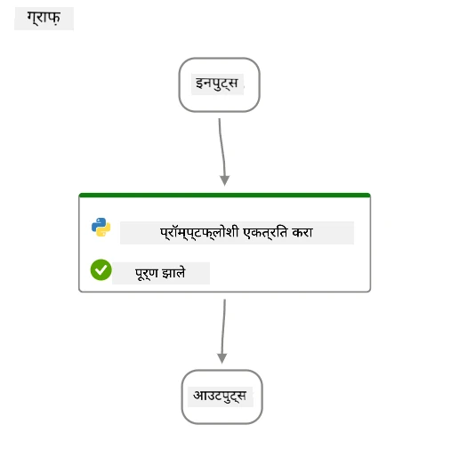
>

### आपल्या कस्टम Phi-3 मॉडेलशी चॅट करा

आपण फाइन-ट्यून केलेले आणि Prompt flow मध्ये समाकलित केलेले आपल्या कस्टम Phi-3 मॉडेलसह आता संवाद सुरू करण्यास तयार आहात. हा व्यायाम आपल्याला Prompt flow वापरून मॉडेलशी संवाद सुरू करण्याची प्रक्रिया मार्गदर्शन करेल. या स्टेप्सचे अनुसरण करून, आपण फाइन-ट्यून केलेल्या Phi-3 मॉडेलच्या विविध कार्यांसाठी आणि संभाषणांसाठी पूर्ण क्षमतांचा लाभ घेऊ शकाल.

- Prompt flow वापरून आपल्या कस्टम Phi-3 मॉडेलशी चॅट करा.

#### Prompt flow सुरू करा

1. Prompt flow सुरू करण्यासाठी **Start compute sessions** निवडा.

    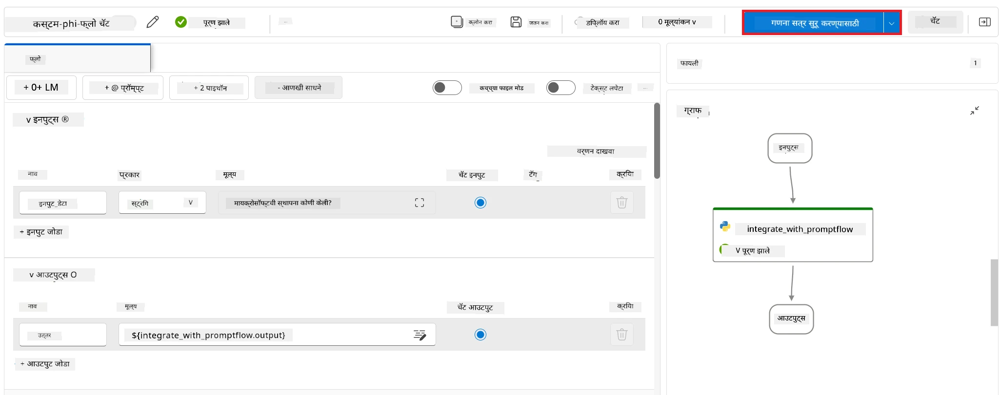

1. पॅरामीटर्स नूतनीकृत करण्यासाठी **Validate and parse input** निवडा.

    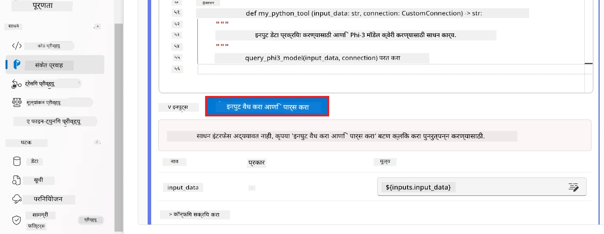

1. आपण तयार केलेल्या कस्टम कनेक्शनची **connection** ची **Value** निवडा. उदाहरणार्थ, *connection*.

    

#### आपल्या कस्टम मॉडेलशी चॅट करा

1. **Chat** निवडा.

    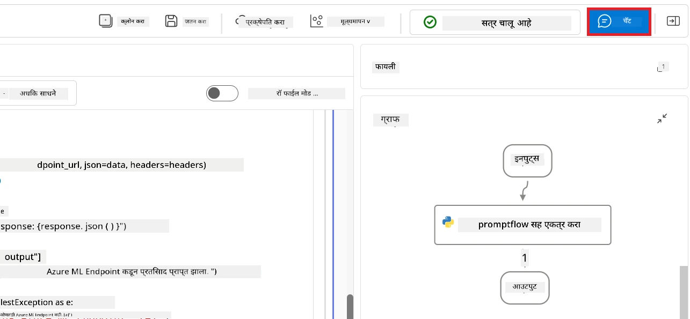

1. खाली दिलेला उदाहरण परिणाम आहे: आता आपण आपल्या कस्टम Phi-3 मॉडेलशी चॅट करू शकता. फाइन-ट्यूनिंगसाठी वापरलेल्या डेटाच्या आधारावर प्रश्न विचारणे शिफारसीय आहे.

    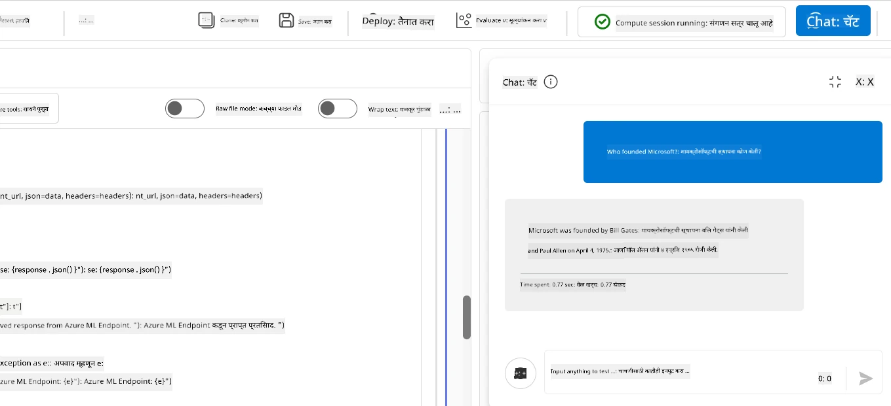

---

<!-- CO-OP TRANSLATOR DISCLAIMER START -->
**सूचना**:
हा दस्तऐवज AI भाषांतर सेवा [Co-op Translator](https://github.com/Azure/co-op-translator) वापरून भाषांतरित केला आहे. आम्ही अचूकतेसाठी प्रयत्नशील आहोत, तरी कृपया लक्षात घ्या की स्वयंचलित भाषांतरांमध्ये चुका किंवा अचूकतेचा अभाव असू शकतो. मूळ दस्तऐवज त्याच्या स्वदेशी भाषेत अधिकृत स्रोत मानला जावा. महत्त्वपूर्ण माहिती साठी व्यावसायिक मानवी भाषांतर करण्याचा सल्ला दिला जातो. या भाषांतराच्या वापरामुळे उद्भवलेल्या कोणत्याही गैरसमज किंवा चुकीच्या अर्थाप्रती आम्ही जबाबदार नाही.
<!-- CO-OP TRANSLATOR DISCLAIMER END -->